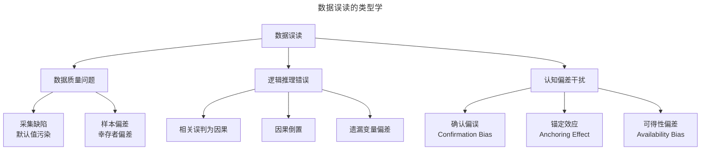
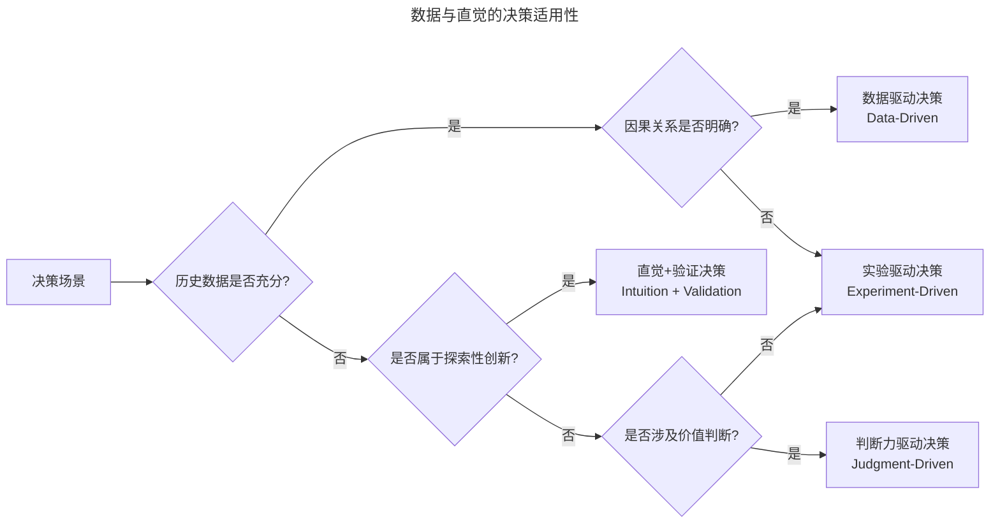

# 数据的边界：当数据无法回答的问题

> **适用范围**：产品经理（各阶段）、数据产品经理、数据分析师、需要做产品决策的管理者。适用于数据误读识别、指标博弈、直觉判断、AI 伦理、决策体系建设等场景。
>
> **更新摘要（v2 · 2026-08 更新）**：
> - 结构化升级为 6 节骨架（导言 / 核心方法论 / 关键流程 / 工具与实战 / 常见误区 / 进阶延展）
> - 保留数据误读陷阱、Goodhart 法则、确认偏误、直觉价值、未知的未知、AI 伦理、三元决策模型
> - 保留全部 Mermaid 图并补充 `--- title: ... ---` frontmatter，每张图后追加文字解读

---

## 1. 导言

在数据驱动（Data-Driven）理念深植产品管理实践的当下，对数据能力的信仰几乎成为行业共识。然而，越是将数据奉为圭臬，越有必要清醒地认知数据的边界。数据无法回答的问题，恰恰是决定产品成败的关键命题——从战略方向的选择到用户情感的洞察，从未知的未知到伦理的判断，这些领域数据要么无力触及，要么可能产生误导。

本文将从数据误读的陷阱、数据驱动的系统性偏差、Goodhart 法则与指标博弈、直觉与判断力的价值、未知的未知，以及 AI 时代的伦理挑战六个维度，系统阐述数据的边界。同时结合 2024-2026 年 AI 幻觉（AI Hallucination）、算法偏见（Algorithmic Bias）和伦理 AI（Ethical AI）等前沿议题，探讨在数据之外如何构建更完整的产品决策体系。

---

## 2. 核心方法论

### 2.1 数据误读的陷阱

数据误读（Data Misinterpretation）并非偶发的个人失误，而是具有系统性规律的认知偏差。以下 Mermaid 图展示了常见数据误读的类型与层级关系：

> **图解**：数据误读的类型学——数据质量问题（采集缺陷默认值污染、样本偏差幸存者偏差）、逻辑推理错误（相关误判为因果、因果倒置、遗漏变量偏差）、认知偏差干扰（确认偏误、锚定效应、可得性偏差）。

**默认值污染与虚假规律**——数据质量问题中最具隐蔽性的一类是"默认值污染"（Default Value Pollution）。当系统预设的默认值被大量用户无意识地采用时，这些默认值会在数据中形成虚假的统计规律。经典案例：某社交平台分析用户星座构成时，发现摩羯座用户占比异常偏高。基于此，团队进行了大量星座性格与平台契合度的分析。然而，真实原因是用户注册时生日字段默认为 1 月 1 日，大量用户未修改默认值，导致摩羯座在数据中被严重高估。

该案例的启示：当某维度数据出现异常分布时，**第一反应应是质疑数据质量，而非急于寻找解释**；对所有使用默认值的字段，应在数据分析时单独标记"默认值用户"分群，避免污染整体分析；在数据采集设计阶段，应尽量减少默认值的使用，或使默认值不具有统计意义。

**相关性与因果性的混淆**——将相关性（Correlation）误判为因果性（Causation）是数据误读中最普遍、危害最大的类型。三种典型混淆模式如下：

| 混淆模式 | 定义 | 产品案例 | 错误决策 |
|----------|------|----------|----------|
| 相关非因果 | A 和 B 同时变化，但无因果链 | iOS 用户付费能力更强 | 仅优化 iOS 端体验，忽视高付费 Android 用户 |
| 因果倒置 | A 导致 B，但被误判为 B 导致 A | 后退操作后付款率更高 | 强化"后退"功能，而非修复优惠券刷新缺陷 |
| 遗漏变量 | C 同时导致 A 和 B，A 和 B 之间无直接因果 | 寒冷地区冰淇淋销量与溺水事故同时下降 | 限制冰淇淋销售以减少溺水（遗漏变量：季节温度） |

产品实践中，将数据视为现象（Phenomenon）而非原因（Cause）是避免此类误读的基本原则。除非有明确的逻辑链或实验证据，数据应被理解为"需要被解释的信号"，而非"可直接行动的指令"。

**幸存者偏差**——幸存者偏差（Survivorship Bias）是指仅关注"幸存"样本而忽略"消失"样本导致的统计偏差。在产品管理中，幸存者偏差常出现在以下场景：用户反馈分析（仅分析活跃用户的反馈，忽视已流失用户的声音——而后者恰恰包含最有价值的改进线索）；功能使用数据（仅分析使用某功能的用户数据，忽视从未发现或尝试该功能的用户——后者可能揭示功能可达性 Discoverability 问题）；成功案例复盘（仅研究成功产品的策略，忽视采用相同策略但失败的产品——导致对策略有效性的系统性高估）。对抗幸存者偏差的核心方法是主动寻找"缺失数据"：流失用户的退出访谈、未转化用户的漏斗分析、失败竞品的案例研究。

### 2.2 Goodhart 法则与指标博弈

**Goodhart 法则的运作机制**——Goodhart 法则指出："当一个指标成为目标时，它就不再是好指标。"（When a measure becomes a target, it ceases to be a good measure.）这一法则由经济学家 Charles Goodhart 于 1975 年提出，在产品管理中具有深刻的现实意义。Goodhart 法则的运作机制可分解为以下链条：

**指标设定 → 行为激励偏移 → 指标优化脱离价值 → 系统性偏差**

具体而言，当团队被某指标考核时，其行为会从"创造用户价值以提升指标"偏移为"直接优化指标数字"，后者往往与用户价值无关甚至相悖。

**Goodhart 法则的典型表现**：

| 指标目标 | 偏移行为 | 对用户价值的损害 |
|----------|----------|------------------|
| 文章阅读量 | 使用耸人听闻的标题、追热点 | 内容质量下降，用户信任流失 |
| 用户注册数 | 降低注册门槛、诱导注册 | 注册用户质量下降，长期留存无提升 |
| 功能使用率 | 强制引导、频繁弹窗提示 | 用户体验恶化，满意度下降 |
| 客服响应速度 | 模板化回复、快速关闭工单 | 用户问题未解决，二次投诉增加 |
| 代码提交量 | 拆分提交、提交无意义改动 | 代码质量下降，技术债务积累 |

**对抗 Goodhart 法则的策略**——Goodhart 法则不可消除，但可通过以下策略减轻其影响：护栏指标（Guardrail Metrics）机制（在设定目标指标的同时，明确约束指标。如以"阅读量"为目标时，设"用户满意度"和"内容投诉率"为护栏）；指标轮换（避免长期固定同一指标作为目标，定期更换关注焦点，防止团队形成路径依赖）；多维度评估（任何重要决策的评估都应包含定量指标和定性判断两个维度，不以单一数字定乾坤）；延迟评估（对长期性目标，引入滞后指标评估，避免短期行为对长期价值的侵蚀）。

### 2.3 确认偏误与预设期望

**确认偏误的运作**——确认偏误（Confirmation Bias）是人类认知系统中最根深蒂固的偏差之一。在数据分析场景中，它表现为：当决策者已形成倾向性立场时，会无意识地优先关注支持该立场的数据，忽略或贬低与之矛盾的证据。经典的"卖鞋故事"精准地刻画了这一现象：两个鞋推销员来到一个无人穿鞋的岛上，立场不同导致对同一数据（"没人穿鞋"）的解读完全相反——一个看到"没有市场"，另一个看到"巨大商机"。

在产品决策中，确认偏误的典型表现包括：选择性引用数据（在汇报方案时，只呈现支持性数据，省略矛盾数据）；调整分析口径（当数据不支持预期结论时，调整时间窗口、用户分群或计算口径以"获得"支持性结论）；差异化对待证据（对支持性证据不加质疑地接受，对矛盾证据则严苛审查其方法论）。

**对抗确认偏误的结构化方法**：

| 方法 | 操作方式 | 适用场景 |
|------|----------|----------|
| 反向推导 | 用同一组数据推导结论的反面，检验是否逻辑上也成立 | 任何有倾向性的结论 |
| 魔鬼代言人 | 指定团队成员专门挑战主流观点 | 需求评审、方案讨论 |
| 预分析注册 | 在分析前书面记录预期结论和分析计划，防止事后调整 | 重要决策的数据分析 |
| 盲审 | 隐藏数据来源和背景信息，仅呈现数据本身 | 容易受权威或立场影响的判断 |

其中，"反向推导"是最轻量、最易实施的方法：当用数据得出某结论后，尝试用同一组数据推导相反结论。若相反结论也能在逻辑上自洽，则说明当前数据不足以支撑任何方向性判断，需要补充信息或降低决策信心度。

---

## 3. 关键流程

### 3.1 直觉与判断力的价值

**数据无法覆盖的决策域**——以下 Mermaid 图展示了不同决策场景下数据与直觉的适用性分布，帮助决策者选择合适的决策模式：

> **图解**：数据与直觉的决策适用性——决策场景判断历史数据是否充分：是则看因果关系是否明确（明确用数据驱动决策，否则用实验驱动决策）；否则看是否属于探索性创新（是则用直觉+验证决策，否则看是否涉及价值判断：是则用判断力驱动决策，否则用实验驱动决策）。核心逻辑：**数据驱动的适用范围取决于历史数据的充分性和因果关系的明确性**。当两者都不满足时，应转向实验驱动或直觉+验证的模式；当涉及价值判断时，则必须依赖人类的判断力。

**直觉的本质与可靠性**——直觉（Intuition）常被误解为"拍脑袋"，但其本质是经验模式识别（Experiential Pattern Recognition）。认知科学研究表明，专家直觉的可靠性取决于两个条件：环境稳定性（决策环境具有足够的规律性，使得过去的经验可用于预测未来）；反馈及时性（决策者能获得关于判断质量的及时反馈，从而持续校准）。当两个条件同时满足时，经验丰富的产品经理的直觉判断可能优于纯数据分析——因为直觉能在数据不足以形成统计显著性时，捕捉微弱但真实的信号。

然而，直觉的边界同样清晰：

| 直觉可靠的场景 | 直觉不可靠的场景 |
|----------------|------------------|
| 熟悉市场的用户需求判断 | 全新市场的需求推测 |
| 常规产品迭代的方向选择 | 技术范式转移的方向判断 |
| 团队能力边界的评估 | 大规模组织变革的效果预估 |
| 用户体验的定性评估 | 复杂系统的定量预测 |

**划时代产品与数据的天花板**——数据本质上是关于过去的记录，其预测能力依赖于"未来是过去的延续"这一隐含假设。然而，划时代的产品（Category-Creating Product）恰恰打破了这一假设——它们的诞生无法从既有数据中推演，而需要基于对行业趋势的判断和用户需求的深层洞察。相传 Henry Ford 曾说"If I asked people what they wanted, they would have said faster horses"（此言出处存疑，多为托名），但这句话精准地描述了这一困境：数据能告诉你如何优化马车的速度，但无法告诉你应该制造汽车。产品史上的关键转折——iPhone 重新定义手机、微信从通讯工具走向社交生态、TikTok 以短视频重构内容消费——其方向性判断均超出了当时可获取数据的解释范围，依赖的是对技术趋势和用户行为的深层洞察。

### 3.2 未知的未知

前美国国防部长 Donald Rumsfeld 著名的"未知的未知"（Unknown Unknowns）分类，同样适用于产品数据领域：

| 类别 | 定义 | 产品示例 | 数据能力 |
|------|------|----------|----------|
| 已知的已知（Known Knowns） | 知道自己知道什么 | 当前 DAU、留存率 | 可直接度量 |
| 已知的未知（Known Unknowns） | 知道自己不知道什么 | 竞品的真实 MAU、用户流失的真实原因 | 可通过研究探索 |
| 未知的未知（Unknown Unknowns） | 不知道自己不知道什么 | 即将出现的技术颠覆、未被识别的用户需求 | 数据无法触及 |

数据能够处理"已知的已知"和部分"已知的未知"，但对于"未知的未知"——那些决策者甚至不知道需要提问的领域——数据完全无力。对抗"未知的未知"需要：多元化团队（不同背景的成员能感知不同的盲区）；跨行业学习（从其他行业的变革模式中获得预警）；边缘信号监控（关注小众社区、早期采用者的行为变化）；情景规划（Scenario Planning，构建多种未来情景，而非仅预测最可能情景）。

---

## 4. 工具与实战

### 4.1 AI 时代的伦理挑战

**AI 幻觉风险**——2024-2026 年，生成式 AI（Generative AI）在产品管理中的应用急剧扩展——从自动生成数据分析报告到辅助决策建议。然而，AI 幻觉（AI Hallucination）风险对数据驱动决策构成了新的威胁。AI 幻觉是指模型生成看似合理但实际不正确的信息。在数据分析场景中，AI 幻觉可能表现为：

| 幻觉类型 | 表现 | 对决策的影响 |
|----------|------|-------------|
| 数据捏造 | AI 引用不存在的数据或报告 | 决策建立在虚假基础上 |
| 因果臆造 | AI 在无因果证据时声称发现因果关系 | 导致错误的行动方案 |
| 趋势虚构 | AI 基于有限数据外推不合理的趋势 | 导致方向性误判 |
| 方法论错误 | AI 推荐不适用的统计方法 | 分析结论不可靠 |

对抗 AI 幻觉的策略：事实核查（Fact-Checking，对 AI 提供的所有数据和引用进行独立验证）；人类审核（Human Review，AI 输出必须经过领域专家审核后才能用于决策）；置信度标注（要求 AI 对其输出标注置信度，低置信度结论需额外验证）；多模型交叉验证（使用不同模型对同一问题生成分析，对比差异）。

**算法偏见**——算法偏见（Algorithmic Bias）是指 AI 系统在训练数据中继承并放大了既有社会偏见，导致输出结果对特定群体产生系统性不公。在产品数据场景中，算法偏见可能表现为：数据采集偏见（采集手段本身导致数据对特定群体代表性不足，如仅采集智能手机用户行为，忽视功能机用户）；分析偏见（分析模型对少数群体的预测准确率显著低于主流群体）；决策偏见（基于有偏见的数据做出对特定群体不利的决策，如信贷产品对特定人群的歧视性定价）。2024-2026 年，欧盟《人工智能法案》（EU AI Act）正式生效，对高风险 AI 系统提出了透明度、公平性和可解释性要求。产品团队需在数据采集和分析流程中嵌入公平性审计（Fairness Audit）机制。

**伦理 AI 的实践框架**：

| 原则 | 实践要求 | 工具/方法 |
|------|----------|-----------|
| 透明性（Transparency） | 披露 AI 在决策中的角色和影响范围 | Model Cards、AI 影响评估 |
| 公平性（Fairness） | 定期审计 AI 输出的群体差异 | Fairlearn、AI Fairness 360 |
| 可解释性（Explainability） | 关键决策应可追溯至可理解的逻辑 | SHAP、LIME |
| 隐私性（Privacy） | AI 训练和使用过程符合隐私法规 | 差分隐私、联邦学习 |
| 可追责性（Accountability） | 明确 AI 决策的人类责任人 | 决策日志、审计追踪 |

### 4.2 构建超越数据的决策体系

**三元决策模型**——完整的决策体系应整合三个维度：

1. **数据理性（Data Rationality）**：用数据校验假设、度量进展、识别异常
2. **经验直觉（Experiential Intuition）**：用行业经验和模式识别填补数据空白
3. **价值判断（Value Judgment）**：用使命愿景和伦理准则确定方向与边界

三者关系如下表所示：

| 维度 | 强项 | 盲区 | 失衡风险 |
|------|------|------|----------|
| 数据理性 | 客观、可验证、可复现 | 无法处理未知、无法做价值判断 | 过度优化、忽视长期价值 |
| 经验直觉 | 快速、捕捉弱信号、处理模糊性 | 受限于个人经验、可能过时 | 主观偏见、路径依赖 |
| 价值判断 | 提供方向、设定边界、应对伦理困境 | 缺乏操作粒度、难以量化 | 空洞愿景、脱离实际 |

**从数据驱动到数据赋能**——将数据分析视为终点，是产品实践中最危险的倾向之一。数据驱动决策的目的是辅助决策，而非替代系统性思考。**"数据赋能"（Data-Informed）的表述比"数据驱动"更为精确：数据是决策的重要输入，但不是唯一输入。** 产品经理的职责是整合数据、经验、判断和价值观，做出最优决策。

**KPI 动物的陷阱**——当数据成为唯一驱动力时，产品团队容易退化为"KPI 动物"——一切行为以优化数字为目标，而忽视数字背后是否真正创造了用户价值。KPI 动物陷阱的本质是**手段与目的的倒置**：指标本应是衡量用户价值的手段，却被当作了目的本身。对抗这一陷阱需要团队在文化层面建立共识——产品存在的意义是创造用户价值，数据是验证价值创造的工具，而非价值本身。

**实践建议**——针对 3-5 年经验的产品经理，以下实践建议有助于在数据的边界处做出更优决策：建立数据质量审查习惯（在做任何数据分析前，先检查数据来源、采集方法和可能的偏差，对异常分布保持警觉）；为每个重要决策寻找反面证据（主动寻找不支持当前结论的数据，这是对抗确认偏误最简单有效的方法）；区分相关与因果（在得出因果结论前，追问"是否有替代解释？"和"能否通过实验验证？"）；设置护栏指标（在追求任何目标指标时，同时监控至少一个护栏指标，防止优化行为偏离价值）；记录决策日志（记录决策的假设、数据依据和预期结果，定期复盘校准判断力）；投资直觉校准（通过持续的行业观察、用户接触和跨领域学习，积累可靠的经验直觉）；在 AI 辅助分析中保持人类审核（不盲信 AI 输出，对关键结论进行独立验证）。

---

## 5. 常见误区

| 误区 | 表现 | 正确做法 |
|------|------|---------|
| **把数据当万能** | 认为数据能回答所有问题 | 认知数据的边界，数据是关于过去的记录 |
| **急于解释异常分布** | 数据异常不质疑质量就找解释 | 第一反应是质疑数据质量（默认值污染） |
| **相关当因果** | 把相关性误判为因果性 | 用逻辑链或实验证据验证因果 |
| **忽视幸存者偏差** | 只分析活跃用户/成功案例 | 主动寻找"缺失数据" |
| **指标即目标** | Goodhart 法则生效，优化数字脱离价值 | 设护栏指标、指标轮换、多维度评估 |
| **确认偏误** | 只看见支持自己立场的数据 | 用反向推导、魔鬼代言人对抗 |
| **忽视直觉价值** | 完全否定直觉判断 | 在数据不足时用经验直觉+验证 |
| **盲信 AI 输出** | AI 幻觉和算法偏见污染决策 | 事实核查、人类审核、多模型交叉验证 |
| **KPI 动物** | 手段与目的倒置，优化数字忽视价值 | 产品存在的意义是创造用户价值 |

---

## 6. 进阶延展

### 6.1 总结

数据是产品决策最忠实的伙伴，但忠实不等于万能。本文从数据误读、系统性偏差、Goodhart 法则、确认偏误、直觉价值和 AI 伦理六个维度，系统阐述了数据的边界。

核心要点回顾：数据有边界（数据是关于过去的记录，无法回答关于未来的方向性问题，更无法处理"未知的未知"）；数据可误导（默认值污染、相关-因果混淆、幸存者偏差等陷阱随时可能导致严重误读）；指标可博弈（Goodhart 法则提醒，当指标成为目标时，它就不再是好指标）；立场可污染（确认偏误使决策者倾向于只看见自己想看见的数据）；直觉有价值（在数据不足或因果不明时，经过校准的经验直觉是不可或缺的决策输入）；AI 需警惕（AI 幻觉和算法偏见为数据驱动决策引入了新的风险维度）。

正如本文标题所言——尽信"数"不如无"数"。这不是否定数据的价值，而是强调：数据驱动决策的前提是对数据边界的清醒认知。只有当决策者既善用数据的力量，又敬畏数据的边界，才能在不确定的世界中做出真正可靠的判断。

### 6.2 参考文献

- Cathy O'Neil. (2016). *Weapons of Math Destruction: How Big Data Increases Inequality and Threatens Democracy*. Crown Publishing Group.
- European Parliament and Council. (2024). Regulation (EU) 2024/1689 (Artificial Intelligence Act). *Official Journal of the European Union*.
- Goodhart, C. A. E. (1975). Problems of Monetary Management: The U.K. Experience. In *Papers in Monetary Economics, Vol. I*. Reserve Bank of Australia.
- Kahneman, D. (2011). *Thinking, Fast and Slow*. Farrar, Straus and Giroux.
- Marr, B. (2024). *AI Dilemma: The Risks and Rewards of Artificial Intelligence*. Wiley.
- Mitchell, M., & Krakauer, D. (2023). The debate over understanding in AI's large language models. *Proceedings of the National Academy of Sciences*, 120(13).
- OECD. (2024). *OECD AI Principles (Updated 2024)*. OECD Publishing.
- Selbst, A. D., et al. (2019). Fairness and Abstraction in Sociotechnical Systems. *Proceedings of the Conference on Fairness, Accountability, and Transparency*, 59-68.
- Stray, V. (2024). The curse of recency: How product teams misinterpret data. *Harvard Business Review Digital Articles*.
- Tetlock, P. E., & Gardner, D. (2015). *Superforecasting: The Art and Science of Prediction*. Crown Publishing Group.
