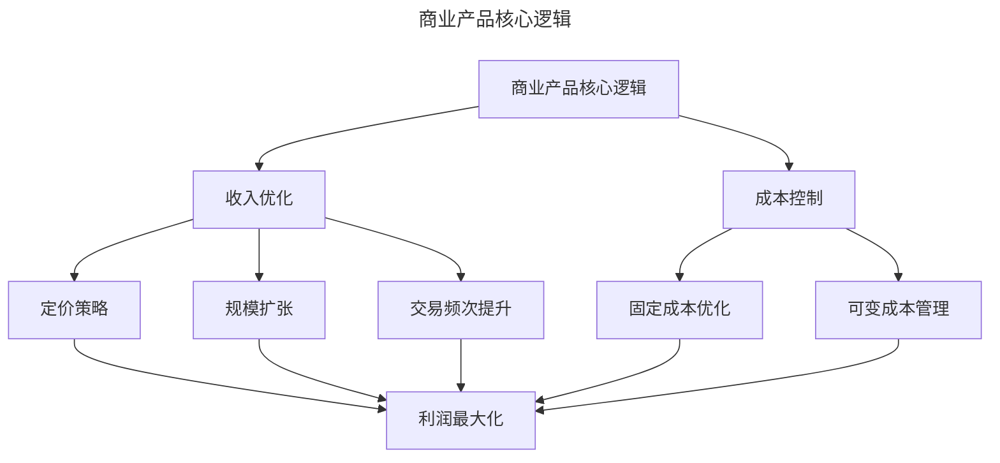
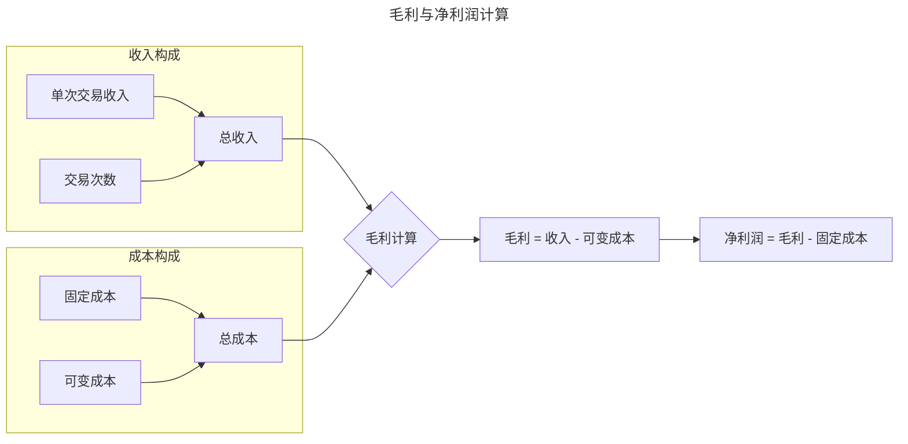
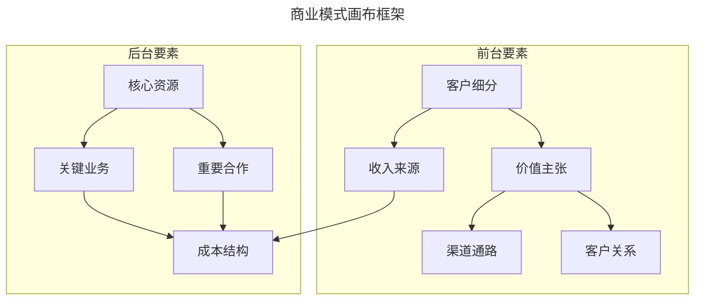
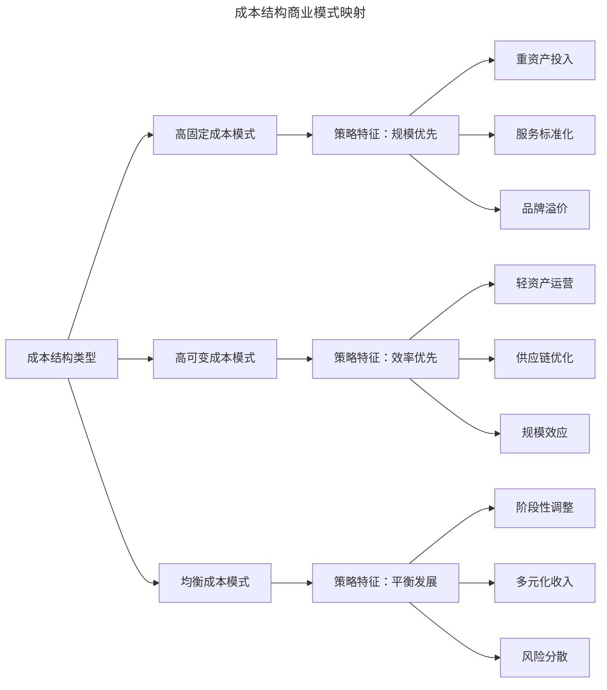
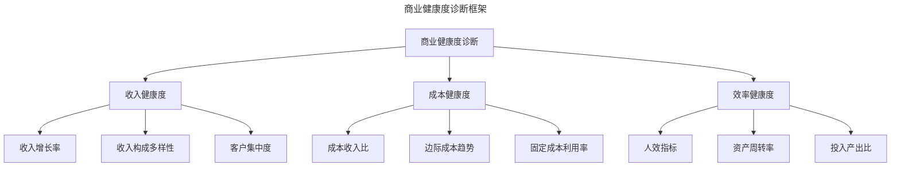

# 产品经理必备的商业逻辑与核心概念

> **适用范围**：产品经理（各阶段）、商业产品经理、创业者、需要商业分析能力的团队负责人。适用于单位经济模型、商业模式画布、收入模型、成本结构、AI 变现等场景。
>
> **更新摘要（v2 · 2026-08 更新）**：
> - 结构化升级为 6 节骨架（导言 / 核心方法论 / 关键流程 / 工具与实战 / 常见误区 / 进阶延展）
> - 保留利润方程、单位经济模型、商业模式画布、收入模型、成本结构、AI 变现模式
> - 保留全部 Mermaid 图并补充 `--- title: ... ---` frontmatter，每张图后追加文字解读

---

## 1. 导言

本文系统阐述产品经理必须掌握的商业核心概念与分析框架，涵盖单位经济模型（Unit Economics）、商业模式画布（Business Model Canvas）、收入模型与成本结构等关键领域。结合 2024-2026 年 SaaS 经济、订阅制模式与 AI 产品变现的最新实践，为资深产品经理提供商业决策的理论基础与实践指南。

### 1.1 商业产品的核心逻辑框架

商业产品的本质逻辑可归纳为一个简洁的数学表达式：

$$利润 = 收入 - 支出$$

这一公式看似简单，实则蕴含着商业决策的全部复杂性。产品经理的核心使命在于：在资源约束条件下，通过产品设计与运营策略，实现收入最大化与成本最优化的动态平衡。

> **图解**：商业产品核心逻辑——收入优化（定价策略、规模扩张、交易频次提升）与成本控制（固定成本优化、可变成本管理）共同实现利润最大化。

### 1.2 支出结构的二元分类

在商业分析实践中，支出可依据其与交易规模的关联性划分为两大类别：

**固定支出（Fixed Cost）**：不随交易量变化的支出项目，如研发团队薪酬、服务器基础设施、办公场地租金等。这类支出具有"门槛性质"，无论业务规模如何均需承担。

**可变支出（Variable Cost）**：与单元交易直接相关的支出项目，如内容分成、支付通道费、物流成本等。这类支出具有"边际性质"，随业务规模线性或非线性增长。

| 支出类型 | 特征 | 典型案例 | 规模效应 | 管理重点 |
|---------|------|---------|---------|---------|
| 固定支出 | 与交易量无关 | 研发团队、服务器、办公租金 | 规模越大，单位成本越低 | 产能利用率优化 |
| 可变支出 | 与交易量正相关 | 分成、支付费、物流 | 需关注边际成本曲线 | 供应链议价、效率提升 |
| 半可变支出 | 兼具两种特性 | 客服团队、销售团队 | 存在阶梯式增长点 | 阈值管理与自动化 |

### 1.3 单元交易的定义与应用

**单元交易（Unit Transaction）**是商业分析的基础计量单位，指最小粒度的价值交换行为。不同业务形态的单元交易定义各异：电商平台（单件商品销售）；出行服务（单次行程完成）；知识付费（单门课程购买）；SaaS 产品（单用户订阅周期）。单元交易的定义直接影响单位经济模型的构建。清晰界定单元交易边界，是进行商业分析的前提条件。

---

## 2. 核心方法论

### 2.1 单位经济模型深度解析

**毛利的计算与意义**——毛利（Gross Profit）是衡量产品商业价值的核心指标：

$$毛利 = 收入 - 可变成本$$

毛利的重要性体现在三个维度：生存能力判断（长期毛利为负的产品难以持续，除非处于战略性补贴阶段）；运营空间评估（毛利厚度决定了促销、返现、渠道分成等运营手段的可行空间）；规模化潜力（高毛利产品具备更强的抗风险能力与扩张弹性）。

> **图解**：毛利与净利润计算——总收入（单次交易收入 × 交易次数）减去可变成本得到毛利，再减去固定成本得到净利润。

**边际效应与规模经济**——互联网产品的核心优势在于显著的边际效应。当固定成本占比较高、可变成本占比较低时，规模扩张将带来单位成本的持续下降。**边际成本（Marginal Cost）**的计算公式为：

$$MC = \frac{\Delta TC}{\Delta Q}$$

其中，$\Delta TC$为总成本增量，$\Delta Q$为产量增量。

| 商业模式 | 固定成本占比 | 边际成本特征 | 规模经济性 | 典型代表 |
|---------|------------|-------------|-----------|---------|
| 平台型产品 | 高 | 极低 | 强规模经济 | 社交网络、搜索引擎 |
| SaaS订阅 | 高 | 低 | 较强规模经济 | 企业软件、云服务 |
| 内容产品 | 中高 | 低 | 中等规模经济 | 视频、音乐、知识付费 |
| 电商零售 | 中 | 中 | 弱规模经济 | 综合电商、垂直电商 |
| 重资产服务 | 低 | 高 | 规模不经济 | 专车、自营物流 |

**盈亏平衡点分析**——**盈亏平衡点（Break-Even Point, BEP）**是商业规划的关键参考指标，指总收入等于总成本时的业务规模：

$$BEP = \frac{固定成本}{单位毛利}$$

理解盈亏平衡点有助于：设定阶段性业务目标；评估补贴策略的可持续性；制定融资与现金流规划。

---

## 3. 关键流程

### 3.1 商业模式画布与收入模型

**商业模式画布框架**——商业模式画布（Business Model Canvas, Osterwalder & Pigneur, 2010）是系统分析商业逻辑的结构化工具，包含九大核心要素：

> **图解**：商业模式画布框架——前台要素（客户细分、价值主张、渠道通路、客户关系、收入来源）与后台要素（核心资源、关键业务、重要合作、成本结构）相互关联。收入来源与成本结构共同决定商业模式的经济性。

| 要素类别 | 核心问题 | 分析要点 |
|---------|---------|---------|
| 客户细分 | 我们为谁创造价值？ | 用户画像、市场分层、付费能力 |
| 价值主张 | 我们提供什么价值？ | 痛点解决、差异化优势、付费意愿 |
| 渠道通路 | 如何触达客户？ | 获客成本、转化效率、渠道组合 |
| 客户关系 | 如何维系客户？ | 留存策略、服务模式、粘性机制 |
| 收入来源 | 如何获取收入？ | 定价模式、付费节点、收入结构 |
| 核心资源 | 我们需要什么资源？ | 技术资产、品牌价值、数据资源 |
| 关键业务 | 我们需要做什么？ | 研发、运营、销售、服务 |
| 重要合作 | 谁是我们的伙伴？ | 供应商、渠道商、生态伙伴 |
| 成本结构 | 我们的成本构成？ | 固定/可变比例、成本驱动因素 |

**收入模型的类型与选择**——现代互联网产品的收入模型呈现多元化趋势：
- **订阅制（Subscription Model）**：特征（周期性付费、持续服务）；优势（收入可预测、用户粘性高）；挑战（流失率管理、价值持续交付）；2024-2026 趋势（混合订阅基础订阅+增值服务、使用量阶梯定价）。
- **交易佣金（Transaction Fee）**：特征（按交易金额抽成）；优势（与用户利益绑定、规模效应明显）；挑战（GMV 依赖、费率竞争压力）；适用场景（平台型产品、市场撮合）。
- **广告变现（Advertising）**：特征（流量变现、用户免费使用）；优势（规模效应强、边际成本极低）；挑战（用户体验平衡、流量质量要求）；2024-2026 趋势（隐私合规广告、AI 驱动精准投放）。
- **增值服务（Freemium）**：特征（基础功能免费、高级功能付费）；优势（降低获客门槛、用户分层变现）；挑战（免费与付费功能边界设计）；适用场景（工具类产品、内容平台）。

**2024-2026 年 SaaS 经济新特征**——SaaS 模式在 2024-2026 年呈现以下演进趋势：
- **单位经济模型的精细化**：从关注 GMV 转向关注 ARR（Annual Recurring Revenue）；NRR（Net Revenue Retention）成为核心指标，行业标杆达 120%+；CAC 回收周期从 18 个月压缩至 12 个月以内。
- **定价模式的创新**：Usage-Based Pricing（基于使用量定价）成为主流；Hybrid Pricing（混合定价）结合订阅与使用量；Value-Based Pricing（价值定价）在垂直领域兴起。
- **AI 驱动的成本结构优化**：客服自动化率提升至 80% 以上；销售效率（Sales Productivity）提升 30-50%；产品迭代周期缩短 50%。

---

## 4. 工具与实战

### 4.1 成本结构的战略分析

**成本结构的商业模式映射**——不同的成本结构对应不同的商业策略：

> **图解**：成本结构商业模式映射——高固定成本模式（规模优先：重资产投入、服务标准化、品牌溢价）；高可变成本模式（效率优先：轻资产运营、供应链优化、规模效应）；均衡成本模式（平衡发展：阶段性调整、多元化收入、风险分散）。

**成本非线性增长的识别与管理**——规模扩张过程中，部分成本呈现非线性增长特征：
- **人力成本的非线性**：管理层级增加带来的效率损耗；沟通成本随团队规模平方增长；解决方案（组织扁平化、自动化工具、外包策略）。
- **服务成本的非线性**：客服需求随用户规模超线性增长；解决方案（AI 客服、自助服务、产品易用性优化）。
- **获客成本的非线性**：优质流量池耗尽后成本陡增；解决方案（品牌建设、自然流量培育、用户裂变）。

| 成本类型 | 线性增长条件 | 非线性触发因素 | 管理策略 |
|---------|------------|--------------|---------|
| 研发成本 | 团队规模可控 | 架构复杂度、技术债务 | 模块化设计、技术投资 |
| 客服成本 | AI自动化率高 | 人工服务依赖 | 智能客服、产品优化 |
| 销售成本 | 标准化产品 | 定制化需求 | 产品标准化、自助销售 |
| 获客成本 | 蓝海市场 | 竞争加剧、流量枯竭 | 品牌建设、用户裂变 |

**边际效应的构建路径**——构建边际效应是互联网产品的核心竞争优势：产品层面（设计可规模化交付的产品形态）；技术层面（投资自动化与智能化基础设施）；运营层面（建立可复用的运营流程与工具）；组织层面（优化团队结构，降低协调成本）。

### 4.2 AI 时代的商业模型演进

**AI 产品的成本结构特征**——AI 产品呈现独特的成本结构：
- **训练成本（Training Cost）**：一次性高投入，属于固定成本；模型迭代带来周期性投入；2024-2026 趋势（开源模型降低训练门槛）。
- **推理成本（Inference Cost）**：随使用量线性增长，属于可变成本；优化方向（模型压缩、边缘计算、推理加速）。
- **数据成本（Data Cost）**：数据获取、清洗、标注的持续投入；高质量数据成为竞争壁垒。

**AI 产品变现模式**：

| 变现模式 | 适用场景 | 定价逻辑 | 代表产品 |
|---------|---------|---------|---------|
| API调用 | 开发者服务 | 按调用次数/Token计费 | OpenAI API、Claude API |
| 订阅制 | 终端用户产品 | 按功能等级/使用量分级 | ChatGPT Plus、Midjourney |
| 嵌入式 | 企业解决方案 | 按席位/部署规模 | Microsoft Copilot、Notion AI |
| 效果付费 | 营销/销售场景 | 按效果（转化、成交）分成 | AI销售助手、AI广告优化 |

**数据资产的商业化**——数据作为新型生产要素，其商业化路径包括：数据产品化（将数据加工为可销售的产品）；数据赋能（通过数据提升现有产品价值）；数据交换（在合规框架下进行数据流通）；数据资产化（数据作为企业资产进行估值与融资）。

### 4.3 商业分析框架的应用实践

**商业健康度诊断框架**——产品经理应建立系统化的商业健康度诊断能力：

> **图解**：商业健康度诊断框架——收入健康度（收入增长率、收入构成多样性、客户集中度）、成本健康度（成本收入比、边际成本趋势、固定成本利用率）、效率健康度（人效指标、资产周转率、投入产出比）。

**商业决策的量化思维**——商业产品经理应培养量化决策能力：假设驱动（每个决策建立可验证的假设）；数据支撑（用数据而非直觉支撑决策）；敏感性分析（评估关键变量变化的影响）；情景规划（为不同情景准备应对方案）。

**商业意识的培养路径**——提升商业意识的有效方法：案例分析（研究成功与失败产品的商业逻辑）；财务建模（亲手构建产品的财务模型）；跨部门协作（与财务、销售、运营团队深度合作）；行业研究（持续跟踪行业动态与竞争格局）。

### 4.4 实战要点

| 要点 | 说明 | 适用场景 |
|------|------|----------|
| 利润方程 | 利润 = 收入 - 支出 | 所有商业决策 |
| 固定/可变成本分类 | 区分门槛性质与边际性质支出 | 成本分析 |
| 单元交易定义 | 界定最小粒度的价值交换行为 | 单位经济模型 |
| 毛利计算 | 毛利 = 收入 - 可变成本 | 商业价值评估 |
| 盈亏平衡点 | BEP = 固定成本 / 单位毛利 | 业务目标设定 |
| 商业模式画布 | 九大核心要素系统分析 | 商业模式设计 |
| 收入模型选择 | 订阅/佣金/广告/增值服务 | 变现模式设计 |
| 成本非线性识别 | 人力/服务/获客成本非线性增长 | 规模扩张规划 |
| AI成本结构 | 训练/推理/数据成本 | AI产品设计 |
| AI变现模式 | API/订阅/嵌入式/效果付费 | AI产品商业化 |
| 商业健康度诊断 | 收入/成本/效率三维度 | 商业健康评估 |
| 量化决策思维 | 假设驱动、数据支撑、敏感性分析 | 商业决策 |

---

## 5. 常见误区

| 误区 | 表现 | 正确做法 |
|------|------|---------|
| **只看收入不看成本** | 忽视可变成本，毛利为负仍扩张 | 用毛利 = 收入 - 可变成本评估 |
| **混淆固定与可变成本** | 把客服等半可变成本当固定成本 | 区分固定/可变/半可变三类 |
| **忽视边际成本** | 不关注规模扩张的边际成本变化 | 用 MC = ΔTC/ΔQ 分析 |
| **收入模式单一** | 过度依赖单一收入来源 | 多元化收入，收入构成多样性 |
| **忽视成本非线性** | 规模扩张后成本陡增 | 识别人力/服务/获客成本非线性 |
| **AI 成本失控** | 忽视推理成本随使用量增长 | 用模型压缩、边缘计算优化推理成本 |

---

## 6. 进阶延展

### 6.1 总结与展望

商业逻辑是产品经理的核心能力基础。本文系统阐述了单位经济模型、商业模式画布、收入模型与成本结构等核心概念，并结合 2024-2026 年的最新实践，分析了 SaaS 经济、AI 产品变现等前沿趋势。

未来产品经理需要具备：商业敏感度（快速识别商业机会与风险）；量化分析能力（用数据驱动商业决策）；战略思维（在产品决策中融入商业考量）；学习能力（持续跟踪商业模式创新）。

### 6.2 参考文献

- Osterwalder, A., & Pigneur, Y. (2010). *Business model generation: A handbook for visionaries, game changers, and challengers*. John Wiley & Sons.
- Skok, D. (2015). SaaS metrics 2.0: A guide to measuring and improving what matters. *forEntrepreneurs*. https://www.forentrepreneurs.com/saas-metrics-2/
- Bessemer Venture Partners. (2025). *State of the Cloud 2025: AI-native applications and the future of SaaS*. Bessemer Venture Partners.
- McKinsey & Company. (2025). *The economic potential of generative AI: The next productivity frontier*. McKinsey Global Institute.
- Gartner. (2026). *Market guide for AI-enabled pricing and revenue management solutions*. Gartner Research.
- Porter, M. E. (1985). *Competitive advantage: Creating and sustaining superior performance*. Free Press.
- Ries, E. (2011). *The lean startup: How today's entrepreneurs use continuous innovation to create radically successful businesses*. Crown Business.
- Anderson, C. (2009). *Free: The future of a radical price*. Hyperion.
- Huang, M., & Rust, R. T. (2021). A strategic framework for artificial intelligence in marketing. *Journal of the Academy of Marketing Science*, 49(1), 30-50.
- Chen, L., Mislove, A., & Wilson, C. (2016). An empirical analysis of algorithmic pricing on Amazon marketplace. *Proceedings of the 25th International Conference on World Wide Web (WWW '16)*, 1339-1349.
