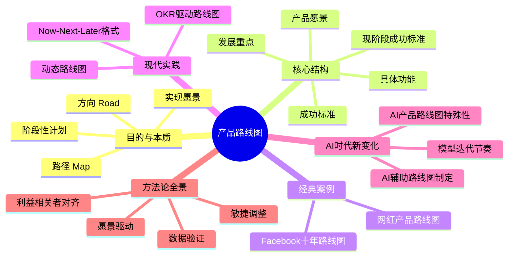
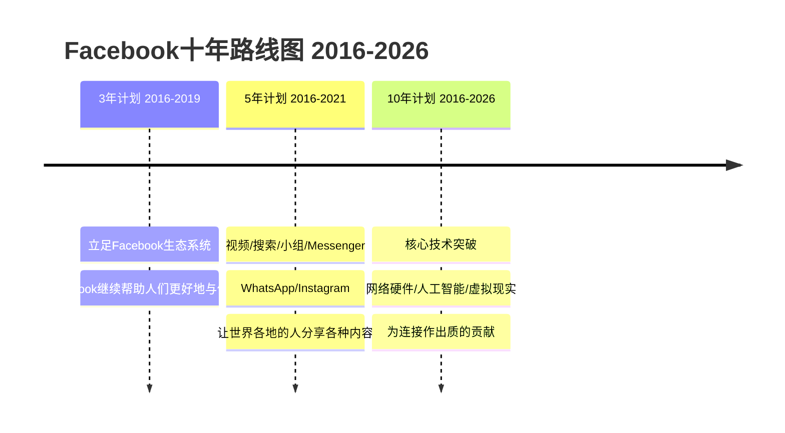
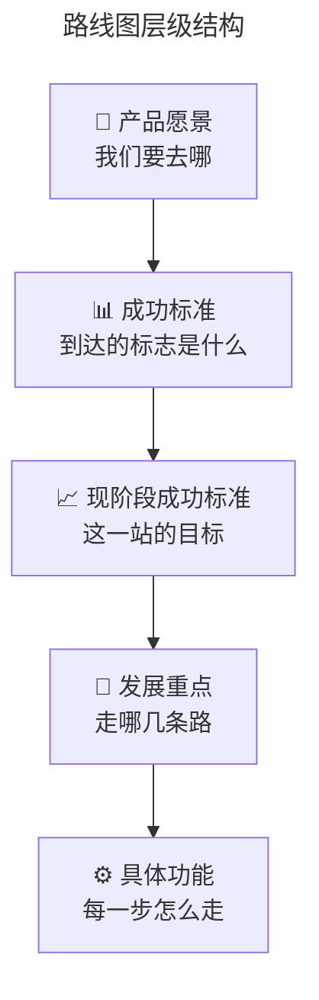
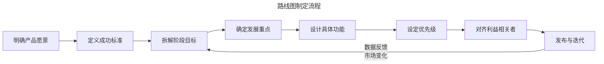
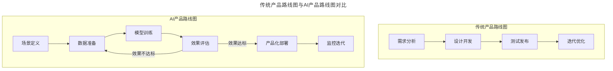
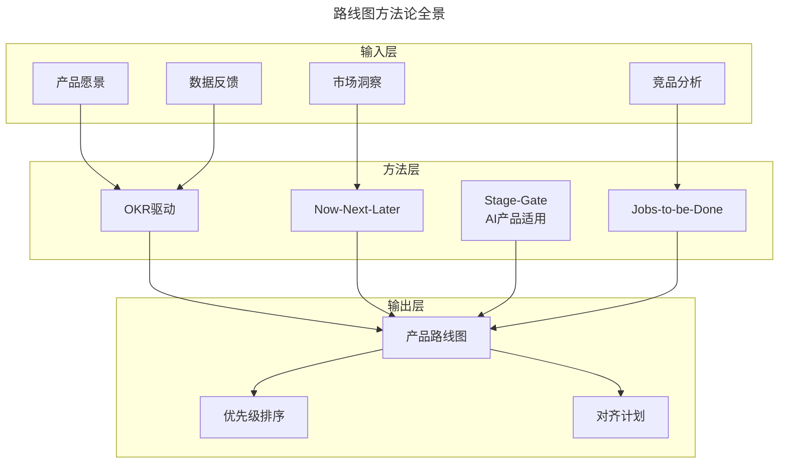

# 29 | 你需要一个产品路线图

> **适用范围**：产品经理（各阶段）、产品负责人、创业者、需要做产品规划的管理者。适用于路线图制定、愿景拆解、优先级设定、OKR 驱动、AI 产品路线图等场景。
>
> **更新摘要（v2 · 2026-08 更新）**：
> - 结构化升级为 6 节骨架（导言 / 核心方法论 / 关键流程 / 工具与实战 / 常见误区 / 进阶延展）
> - 保留 Facebook 十年路线图、层级结构、网红产品案例、OKR 驱动、Now-Next-Later、AI 时代
> - 保留全部 Mermaid 图并补充 `--- title: ... ---` frontmatter，每张图后追加文字解读

---

## 1. 导言

**产品路线图的核心目的是让团队成员清楚知道产品要往哪个方向走，怎么走，以及在什么时间要做什么事情。**

路线图的英文叫作 Roadmap，由 road 和 map 两个单词组成。路线图首先要告诉团队成员我们要去哪——路在何方，也就是 road；然后告诉他们我们应该怎么去——如何达到目的，这就是 map。所以，**产品路线图一定要立足于产品的愿景（vision），告诉团队成员我们如何一步步实现产品的愿景。**

> **图解**：产品路线图——目的与本质（方向、路径、阶段性计划、实现愿景）、核心结构（产品愿景、成功标准、现阶段成功标准、发展重点、具体功能）、经典案例、现代实践、AI 时代新变化、方法论全景。

### 1.1 Facebook 十年路线图

扎克伯格在 2016 年提出了 Facebook 未来十年的产品路线图，愿景是**连接整个世界，让人与人之间的距离更近**。

> **图解**：Facebook 十年路线图——3 年计划（立足 Facebook 生态系统，让 Facebook 继续帮助人们更好地与他人连接）、5 年计划（视频/搜索/小组/Messenger、WhatsApp/Instagram，让世界各地的人分享各种内容）、10 年计划（核心技术突破：网络硬件/人工智能/虚拟现实，为连接作出质的贡献）。

从 Facebook 十年的产品路线图中可以看出，扎克伯格首先从整个公司的愿景出发，然后层层深入；从近期的三年计划着手，步步推进，最后十年计划一出来，整个公司仿佛看到了一个让整个世界连接更紧密的蓝图。当然，大部分产品经理管的是一个具体的产品，也不会做一个十年规划的路线图，但是产品路线图的目的都是一样的：先立足于产品要达到的最终效果，以长期愿景为目的，然后一步一步告诉团队成员如何实现。

### 1.2 路线图 ≠ 任务清单

**有些产品经理的路线图，简言之就是一个任务清单，列出了一个个要完成的任务，团队成员看完后，并不清楚到底要达到什么目的，成功指标是什么，这最多算一个项目管理档案，不能叫作产品路线图。**

一个好的产品路线图，应该是你读完后：首先，明确产品的长期愿景；然后，明确分为哪几个阶段，每个阶段的成功标准是什么，每个阶段之间有什么样的逻辑关系，才能实现最后的长期愿景；最后，明确每个阶段我们具体要做什么，以及怎么做。

**越是高级的产品经理，想得越远，产品路线图横跨的时间范围越广，这种路线图的难度也越高。** 好的产品路线图，团队成员看完后，应该有种"哇塞，我做的事情真酷""哇塞，我看到了我们一步一步如何实现最终的成功"这样的感觉，并且团队的每个人都知道：我们这半年要做的事情，和长期愿景到底有什么关系；我们这半年做的事情，分为哪几个部分，重要性和优先级都是什么。

---

## 2. 核心方法论

### 2.1 路线图的层级结构

> **图解**：路线图层级结构遵循从愿景到功能的逐层拆解逻辑——产品愿景（我们要去哪）→成功标准（到达的标志是什么）→现阶段成功标准（这一站的目标）→发展重点（走哪几条路）→具体功能（每一步怎么走）。每一层都回答一个关键问题，确保团队既知其然，也知其所以然。

### 2.2 产品路线图的内容：网红产品路线图案例

我一般会有整个产品团队的路线图，和每个产品的路线图。整个团队的路线图更多是写我们这半年要达到什么目标，这个目标如何帮助我们离成功更进一步。下面通过一个具体的实例，展示我一般按照什么样的框架来写产品团队的路线图。

**1. 团队愿景：** 成为最有效的网红和粉丝之间沟通互动的工具。
**2. 成功是什么样子？** 网红首选我们的工具和粉丝沟通，粉丝和网红每周至少互动一次。
**3. 下半年的成功是什么样子的？** 50% 粉丝和网红每周至少互动一次。
**4. 下半年如何实现这样的成功：**

| 发展重点 | 优先级 | 具体功能 |
|---------|--------|---------|
| 帮助网红找到铁粉 | P0 | 铁粉特别徽章、铁粉排行榜 |
| 帮助新粉丝找到感兴趣的网红 | P0 | 网红发现广场、每天推荐5个网红给新粉丝 |
| 提供网红和铁粉之间互动的工具 | P1 | 选定粉丝互动、铁粉抽奖活动、铁粉专属内容工具 |

**注意，我并没有在"如何实现这样的成功"这部分直奔要实现的 7 个小功能，而是先拆分为三个重点，然后再说明解决每个重点问题需要实现的具体功能。**

有时，我还会在"成功是什么样子"这个部分加上日期，让大家有紧迫感。比如：2018 年上半年（50% 的粉丝和网红每周至少互动一次）；2018 年下半年（75% 的粉丝和网红每周至少互动一次，产品成为网红的前三个选择）；2019 年上半年（网红首选我们的工具和粉丝沟通，粉丝和网红每周至少互动一次）。

对于一个粉丝给网红打赏的产品，路线图可以这样写：

**产品愿景：** 让网红可以以赚取粉丝的打赏为生；让粉丝得到网红特别的关注。
**成功标准：** 10000 个网红能够达到月收入 10000 元。
**2018 年上半年成功标准：** 1000 个网红月收入 5000 元。
**2018 年下半年成功标准：** 5000 个网红月收入 5000 元，1000 个网红月收入 10000 元。
**2019 年上半年成功标准：** 10000 个网红月收入 10000 元。

然后具体说 2018 年上半年的成功如何实现——目标是 1000 个网红月收入 5000 元，为此需要让已有打赏的 200 个网红得到更多赏金，让还没有打赏的其他网红（假设目前有 3000 个）中的 800 个月收入达到 5000 元。接下来划分重点问题：让粉丝加大打赏金；培养更多粉丝打赏的习惯；增加粉丝用户的数量。然后按照团队路线图的逻辑，设计每个部分的产品功能来实现成功目标。

---

## 3. 关键流程

### 3.1 路线图制定流程

> **图解**：路线图制定流程——明确产品愿景→定义成功标准→拆解阶段目标→确定发展重点→设计具体功能→设定优先级→对齐利益相关者→发布与迭代。路线图的制定不是一次性的活动，而是一个持续迭代的过程。当数据反馈或市场变化出现时，需要回到阶段目标重新审视和调整。

### 3.2 现代实践：2024-2026

**OKR 驱动路线图**——传统的路线图以时间线为轴，而 OKR 驱动的路线图以目标为轴。每个 OKR 周期（通常为季度）对应路线图的一个阶段，关键结果直接成为该阶段的成功标准。**OKR 驱动路线图的核心逻辑**：Objective = 路线图阶段目标；Key Results = 阶段成功标准；Initiatives = 发展重点；Features/Tasks = 具体功能。这种方式的优势在于：目标与执行之间有清晰的因果链，且每个周期结束时的 OKR 复盘天然成为路线图的校准节点。

**Now-Next-Later 格式**——相比传统的时间驱动格式（Q1/Q2/Q3），Now-Next-Later 格式更强调优先级而非时间节点：

| 层级 | 含义 | 确定性 | 细节程度 |
|------|------|--------|---------|
| **Now** | 当前正在做 | 高 | 详细到具体功能和验收标准 |
| **Next** | 接下来要做 | 中 | 明确到发展重点和方向 |
| **Later** | 未来考虑做 | 低 | 只描述愿景和探索方向 |

这种格式承认了一个事实：**越远的事情，我们知道的越少**。与其假装能精确规划 6 个月后的功能，不如诚实地表达不确定性，同时保持方向清晰。

**动态路线图**——动态路线图是 OKR 驱动和 Now-Next-Later 的结合体，其核心特征是：定期校准（每个 OKR 周期结束时重新评估路线图）；滚动规划（始终保持 Now-Next-Later 三层结构）；数据驱动调整（基于 KR 完成度和市场信号调整优先级）；透明可追溯（每次调整都有明确的原因和记录）。

---

## 4. 工具与实战

### 4.1 AI 时代的新变化

**AI 辅助路线图制定**——AI 正在改变路线图的制定方式，但不是替代产品经理的判断：

| 环节 | AI能做什么 | 产品经理做什么 |
|------|-----------|--------------|
| 愿景推演 | 分析行业趋势、竞品动态 | 判断方向、做出取舍 |
| 成功标准 | 基于历史数据预测可达指标 | 设定有挑战性的目标 |
| 优先级排序 | 多维度数据加权分析 | 考虑战略协同和团队能力 |
| 风险识别 | 识别潜在依赖和冲突 | 评估组织风险和执行风险 |

**AI 产品路线图的特殊性**——AI 产品的路线图与传统产品有本质区别，核心在于**模型迭代节奏**的不确定性：

> **图解**：传统产品路线图是线性的（需求分析→设计开发→测试发布→迭代优化）；AI 产品路线图是循环的（场景定义→数据准备→模型训练→效果评估，效果不达标回到数据准备，效果达标产品化部署→监控迭代）。核心差异在于模型训练可能需要多次迭代才能达到预期效果。

AI 产品路线图的关键差异：模型效果的不确定性（传统产品可以较准确地预估开发周期，但模型训练可能需要多次迭代才能达到预期效果，路线图需要为这种不确定性预留缓冲）；数据是前置依赖（数据收集、清洗、标注的进度直接影响模型训练，路线图必须将数据准备作为独立阶段）；效果评估是门控节点（模型效果是否达标决定了是继续投入还是调整方向，这是传统产品路线图中不存在的决策点）；部署后的持续学习（AI 产品上线后不是终点，模型需要持续从真实数据中学习，路线图要包含监控和迭代计划）。

**AI 产品路线图实践建议**：采用阶段门控（Stage-Gate）模式（在模型训练和效果评估之间设置门控，效果达标才进入下一阶段）；并行推进（数据准备和场景定义可以并行，但模型训练必须在数据就绪后才能开始）；设置效果下限（为每个 AI 功能设定最低可接受效果指标，低于此指标则调整或砍掉）；规划模型迭代周期（将模型迭代作为路线图的常规节奏，而非异常情况）。

### 4.2 方法论全景图

> **图解**：路线图方法论全景——输入层（产品愿景、市场洞察、数据反馈、竞品分析）→方法层（OKR 驱动、Now-Next-Later、Stage-Gate AI 产品适用、Jobs-to-be-Done）→输出层（产品路线图、优先级排序、对齐计划）。

### 4.3 三层深度视角

**🟢 进阶视角（1-3 年产品经理）**——掌握路线图的基本框架和撰写方法：学会从愿景到功能的逐层拆解，不要跳过发展重点直接列功能清单；为每个阶段设定可量化的成功标准，避免模糊的描述如"提升用户体验"；理解优先级的意义，P0/P1 不是凭直觉，而是基于对愿景贡献度的判断；练习撰写单个产品的路线图，先做好一个产品，再考虑产品线级别。关键提醒：路线图不是给你自己看的，是给团队看的。写完后问自己：团队成员看完能说清楚"我做的事情和愿景有什么关系"吗？

**🔵 资深视角（3-5 年产品经理）**——从"写路线图"进化到"用路线图驱动团队"：掌握 OKR 驱动的路线图方法，让目标与执行之间形成闭环；采用 Now-Next-Later 格式，承认远期规划的不确定性，提高路线图的可信度；建立路线图的定期校准机制，每个 OKR 周期复盘并调整；处理跨产品线的路线图协同，确保多个产品之间的依赖和优先级对齐；学会与利益相关者对齐，路线图不是产品经理一个人的决定，需要与工程、设计、运营等团队达成共识。关键提醒：好的路线图不是最完美的计划，而是团队最愿意执行的承诺。

**🟣 专家视角（5 年+产品经理）**——思考路线图背后的战略问题和组织问题：路线图是战略表达的工具（每一个优先级排序都隐含了战略取舍，要能说清楚"为什么做这个而不做那个"）；动态路线图的组织能力建设（不是每个团队都能适应动态调整的节奏，需要建立相应的决策机制和文化）；AI 产品路线图的范式创新（模型迭代的不确定性要求路线图从"计划驱动"转向"假设驱动"，每个阶段都是验证假设的过程）；路线图作为沟通工具的边界（对外投资人和对内团队的路线图应该有不同的颗粒度和表达方式）；从路线图到战略叙事（最高级的路线图不是一张图，而是一个让人愿意追随的故事）。关键提醒：路线图的终极价值不是规划，而是让一群人朝着同一个方向前进。

### 4.4 实战要点

| 要点 | 说明 | 适用场景 |
|------|------|----------|
| 愿景驱动 | 从产品愿景出发，层层深入 | 所有路线图 |
| 层级结构 | 愿景→成功标准→发展重点→功能 | 路线图撰写 |
| 区分任务清单 | 路线图不是任务清单 | 路线图质量 |
| OKR驱动 | 以目标为轴而非时间线 | 现代路线图 |
| Now-Next-Later | 以优先级而非时间驱动 | 动态路线图 |
| 定期校准 | 每个OKR周期复盘调整 | 路线图迭代 |
| 阶段门控 | AI产品效果达标才进入下一阶段 | AI产品路线图 |
| 利益相关者对齐 | 与工程/设计/运营达成共识 | 路线图发布 |

---

## 5. 常见误区

| 误区 | 表现 | 正确做法 |
|------|------|---------|
| **路线图=任务清单** | 列出任务却不清目的和成功指标 | 明确愿景、阶段成功标准、逻辑关系 |
| **跳过发展重点** | 直奔功能清单 | 先拆分为发展重点，再说明具体功能 |
| **成功标准模糊** | "提升用户体验"等模糊描述 | 设定可量化的成功标准 |
| **时间线刚性** | 假装能精确规划6个月后功能 | 采用Now-Next-Later承认不确定性 |
| **一次成型** | 路线图做完不迭代 | 定期校准，动态调整 |
| **忽视AI模型不确定性** | 用传统方式规划AI产品 | 阶段门控，为模型迭代预留缓冲 |

---

## 6. 进阶延展

### 6.1 关键术语表

| 术语 | 英文 | 定义 |
|------|------|------|
| 产品路线图 | Product Roadmap | 从产品愿景出发，按阶段规划发展重点和具体功能的战略文档 |
| 产品愿景 | Product Vision | 产品最终要达到的状态和创造的价值 |
| 成功标准 | Success Criteria | 衡量是否达成目标的可量化指标 |
| OKR | Objectives and Key Results | 目标与关键结果，一种目标管理方法 |
| Now-Next-Later | — | 以优先级而非时间驱动的路线图格式 |
| Stage-Gate | — | 阶段门控模型，在关键节点评估是否继续推进 |
| P0/P1/P2 | Priority 0/1/2 | 优先级标记，P0最高 |
| 动态路线图 | Dynamic Roadmap | 可根据数据反馈和市场变化持续调整的路线图 |
| JTBD | Jobs-to-be-Done | 待完成任务理论，从用户"雇佣"产品完成什么任务的角度理解需求 |
| 模型迭代节奏 | Model Iteration Cadence | AI产品中模型训练、评估、部署的周期性节奏 |

### 6.2 思考题

- 🟢 **进阶层：** 如果让你设计抖音未来三年的产品路线图，你会如何从愿景出发，拆解到发展重点和具体功能？
- 🔵 **资深层：** 你负责的产品线中，如果两个产品的路线图在资源上产生冲突，你会如何用 OKR 框架来决定优先级？请描述你的决策逻辑。
- 🟣 **专家层：** AI 产品的模型效果不确定性如何改变路线图的制定方式？请设计一个适用于 AI 产品的阶段门控路线图框架，并说明每个门控的评估标准。

### 6.3 延伸阅读

1. **《Inspired》** — Marty Cagan，产品路线图章节深入讨论了为什么传统路线图会失败
2. **《Measure What Matters》** — John Doerr，OKR 方法论的经典著作，理解 OKR 如何驱动路线图
3. **《The Lean Startup》** — Eric Ries，最小可行产品和验证学习，理解为什么路线图需要动态调整
4. **《Escaping the Build Trap》** — Melissa Perri，深入分析为什么"输出导向"的路线图是陷阱，以及如何转向"成果导向"
5. **"Now-Next-Later Roadmaps"** — Janna Bastow，Now-Next-Later 格式的提出者和倡导者
