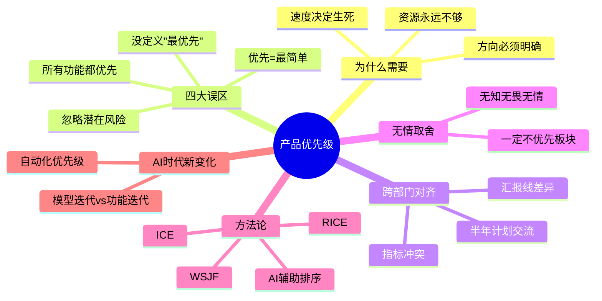
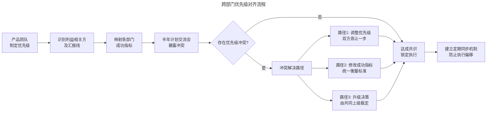
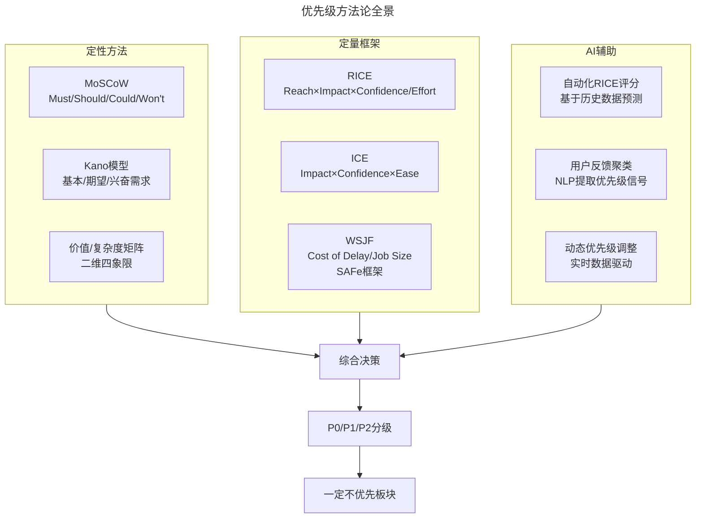

# 30 | 如何制定产品优先级？

> **适用范围**：产品经理（各阶段）、产品负责人、创业者、需要做需求排序的管理者。适用于优先级制定、跨部门对齐、无情取舍、RICE/ICE/WSJF、AI 辅助优先级等场景。
>
> **更新摘要（v2 · 2026-08 更新）**：
> - 结构化升级为 6 节骨架（导言 / 核心方法论 / 关键流程 / 工具与实战 / 常见误区 / 进阶延展）
> - 保留四大误区、跨部门对齐、无情取舍、RICE/ICE/WSJF、AI 时代
> - 保留全部 Mermaid 图并补充 `--- title: ... ---` frontmatter，每张图后追加文字解读

---

## 1. 导言

制定产品优先级是产品经理的必备技能，但这个必备技能着实是一块儿"硬骨头"。在日新月异的科技行业，计划赶不上变化，A/B 测试可能带给你新的结论，竞争对手可能打乱你的步伐，产品功能比之前计划得要复杂得多，这样的变化都会改变产品优先级。所以，每个产品经理需要做的，就是要在高变化、高不确定性、高复杂性的情况下制定出优先级，让产品以最快的速度、最小的代价取得最大的成功。

可见，制定优先级并不是一件易事，但更难的是要说服其他人认可你制定的优先级。



> **图解**：产品优先级——为什么需要（资源永远不够、方向必须明确、速度决定生死）、四大误区、跨部门对齐、无情取舍、方法论（RICE/ICE/WSJF/AI 辅助）、AI 时代新变化。

### 1.1 为什么需要产品优先级？

产品优先级，可以让团队成员明确哪些功能是需要优先做的，哪些功能是无关紧要的，从而在最短的时间内解决产品最关键的问题。如果没有明确的优先级，团队成员就会失去方向，各打各的各自为政无法高效合作；产品优先级弄错了，就会耽误产品进度，而且你认为不重要的功能被竞争对手抢先发布了，对创业公司来说可能就关乎生死了。

我见过许许多多的产品团队，无论是成熟的产品团队，还是从零到一的产品团队，也接触过无数的产品经理，无论是资深的行家，还是刚刚入行的新人，这些产品团队和产品经理，都有一个共同的特点，那就是永远有做不完的产品任务，从来没有把事情都做完的时候。而且，每次产品发布前的一个星期，总会出各种各样的问题，产品经理总会有各种危机要处理，甚至会修改之前的计划。所以，如果产品团队没有优先级，而是按照顺序一个一个地做所有的任务，那么产品永远都不会被发布。

在 Facebook，我们每个产品经理都要遵循的一个理念是：**权衡取舍要无情**。这句话重要到我们已经把它做成海报贴在了公司墙上，所有人每天上班前都会看到。

### 1.2 优先级制定流程

```mermaid
---
title: 优先级制定流程
---
flowchart TD
    A[收集需求池] --> B[估算价值与成本]
    B --> C[评估风险与依赖]
    C --> D[应用优先级框架]
    D --> E{排序结果是否清晰?}
    E -->|否| F[回溯价值假设<br/>重新评估]
    F --> B
    E -->|是| G[标记P0/P1/P2]
    G --> H[明确"一定不优先"板块]
    H --> I[跨部门对齐]
    I --> J{各部门是否达成共识?}
    J -->|否| K[调整成功指标<br/>或修改优先级]
    K --> I
    J -->|是| L[锁定路线图<br/>进入执行]
    L --> M[定期复盘<br/>根据新信息调整]
    M --> A
```

> **图解**：优先级制定流程——收集需求池→估算价值与成本→评估风险与依赖→应用优先级框架→排序结果是否清晰（否则回溯价值假设重新评估）→标记 P0/P1/P2→明确"一定不优先"板块→跨部门对齐→各部门是否达成共识（否则调整成功指标或修改优先级）→锁定路线图进入执行→定期复盘根据新信息调整回到需求池。

---

## 2. 核心方法论

### 2.1 产品优先级的误区

在制定产品优先级时，有以下这四大误区，需要特别注意。

**误区一：认为所有功能都优先**——这句话同时意味着所有功能都不优先。很多时候我发现，刚入行的产品经理会在产品需求文档洋洋洒洒地写上十几个功能，而且每个功能都是紧急，这样做根本就是没有搞清楚产品的优先级。在我看来，产品的优先级是要分等级的，如果你有 10 个功能，最多有三个功能是最优先，也一定有三个功能是不优先的。产品优先级的等级，我一般喜欢用 P0、P1、P2 表示，P 代表 priority，P0 指最优先，P1 指一般优先，P2 则可以以后再做。在 Facebook，我们的共识是 P0 是现在要做的，P1 是有空就做的，P2 是一定来不及做的。

**误区二：认为优先的功能是最简单的功能**——这源于产品经理对最小化可行产品的误解。最小化可行产品，是确保产品功能只要满足用户最基本的需求就可以了，但并不等于说产品只有最简单的功能。最优先的功能应该是最有价值的功能，如果一个产品只具备一堆锦上添花的、最简单的功能，那它并不能算是一个完整的产品，它的优先级出了问题。

**误区三：判断优先级时忽略潜在风险**——判断产品优先级时只考虑工程难度以及预期效果，而忽略了这个功能的潜在风险。如果产品需要下个月发布，有一个功能非常重要，也不难做，但是涉及到和其他的组的合作。而目前这个组的团队有问题，很有可能这个功能无法按时完成，而产品的发布时间必须要保证。那么，这时候你就要思考这个功能到底是不是优先，是不是应该先做低风险的功能以确保产品发布。

**误区四：没有明确什么叫做"最优先"**——在做产品计划时，没有明确什么叫做最优先。比如，产品有三个最优先的功能，发布前其中一个没做完，那么你到底是应该选择先发布两个已经做完的功能，还是推迟整个产品的发布时间，等第三个功能完成后一起发布？很多产品经理事先都没有考虑这个问题，导致产品发布前出现了突发情况非常慌，和团队成员争论不休，从而耽误了产品发布的良机。所以，我建议，在做产品计划时就应该先明确，这些功能到底是不是重要到推迟产品发布也要等的程度。

> 🟢 **进阶 1-3 年**：牢记 P0/P1/P2 分级法，每次规划时强制自己从需求池中选出最多 3 个 P0，并明确写出至少 3 个"一定不做"的项目。
> 🔵 **资深 3-5 年**：在分级基础上引入量化框架（如 RICE），用数据支撑优先级判断，而非仅凭直觉。同时建立"优先级变更日志"，记录每次调整的原因和结果。
> 🟣 **专家 5 年+**：设计团队级的优先级治理机制，包括定期评审节奏、跨部门对齐流程、优先级冲突升级路径。让优先级决策从个人判断升级为组织能力。

---

## 3. 关键流程

### 3.1 你的产品优先级决定真的算数吗？

很多时候产品经理并不直接管理所有的团队成员，特别是在大公司，每个细分领域都有具体的部门来执行，而这些部门并不直接对产品经理负责。举个简单的例子，市场营销部门会直接汇报给市场营销总监，所以你的市场营销经理更在乎的是总监在乎的指标，而不是你在乎的指标。如果你制定的产品优先级和其他部门的不一致，那么你的产品优先级多半不算数。即使你分析得再准确，沟通得再清楚，甚至你的团队成员也哼哼哈哈地同意了，但最终他们并不一定会按照你的优先级来。

**案例：网红产品 vs 市场营销**——我在负责网红产品时，就经历了和市场营销部门的优先级不一致，而影响了产品的事情。我的产品团队有专门负责传媒公司营销策略的市场营销经理，当时我把对小型明星工作室更有帮助的功能，定为了最优先。而这个市场营销经理汇报的部门衡量成功的标准是，传媒公司客户的满意度，因此他们最优先的几个项目都是和传媒公司有关的。虽然我说服了市场营销经理认可我制定的优先级，他也认为这对我们团队来说是最正确的选择，但在实际工作中，他并没有按照我制定的优先级来。而我们中间又缺乏有效地沟通，最终影响了我们这个功能的正常发布。

后来，为了解决这种问题，Facebook 在每半年计划的时候，都会让不同的部门交流彼此的优先项目，提前找出利益冲突的部分。这样，在制定计划时就充分交流，提前发现问题，有冲突时要么修改各自的优先级，要么修改成功指标（毕竟成功指标是决定优先级的核心标准），可以最大程度地避免对产品发布的影响。

**跨部门对齐流程**：



> **图解**：跨部门优先级对齐流程——产品团队制定优先级→识别利益相关方及汇报线→映射各部门成功指标→半年计划交流会暴露冲突→是否存在优先级冲突（否则达成共识锁定执行）→冲突解决路径（路径 1 调整优先级双方各让一步、路径 2 修改成功指标统一衡量标准、路径 3 升级决策由共同上级裁定）→达成共识→建立定期同步机制防止执行偏移。

> 🟢 **进阶 1-3 年**：在制定优先级后，主动列出所有受影响的部门，逐一确认他们的核心指标是否与你的优先级一致。不一致时，及时向上反馈。
> 🔵 **资深 3-5 年**：主导跨部门优先级对齐会议，提前准备"优先级冲突矩阵"，清晰展示各方指标差异和潜在折中方案，推动共识而非妥协。
> 🟣 **专家 5 年+**：从组织设计层面解决优先级对齐问题——推动建立跨职能 OKR、共享成功指标、联合路线图评审机制，让对齐成为制度而非临时动作。

### 3.2 无情的权衡取舍还要明确我们一定不做什么

在 Facebook，我们一直在讲产品经理要**无知、无畏、无情**：**无知**，就是产品经理不应该马上下结论，而是应该保持好奇心，提出假设，然后验证假设；**无畏**，就是产品经理应该勇于制定有难度达到的成功指标，更好地激发团队潜力，而不是为了不担风险只打安全牌；**无情**，就是不管产品的想法多么好，可做的事情多么重要，都一定要分出个主次，明确我们一定不做什么。

**案例：Instagram 的"一定不优先"板块**——我在 Instagram 的一个老板，在制定产品线路图和优先级时，喜欢加一个**"一定不优先"**的板块，这个部分专门写那些我们肯定不做、明确不是优先级的内容。我第一次看到这个版块时，完全不理解为什么要花这么大精力去写一堆不用做的内容，但真正和团队磨合时，我发现经常会有人提出我们要不要试试这个功能、要不要也做一做那个功能，或者某一个领导突然对某个东西感兴趣随口问了一句，大家就一拥而上，要修改原有的产品计划，做这个功能。这样的情况时有发生，虽说可以活跃产品团队氛围，但更多的却是干扰，导致产品的实际执行不能按照既定轨道进行。我的这个老板的"一定不优先"版块，目的就是降低这样的干扰。他可以自如地给大家展示这个文档，问大家有没有最新的用户反馈，如果没有的话，我们就明确这个功能一定不优先；有没有什么新的信息需要我们改变策略，没有的话，我们就继续按照原定计划执行。这样一来，大家很快就能回到正轨，减少干扰。

> 🟢 **进阶 1-3 年**：在每次路线图中增加"一定不优先"板块，学会对干扰说"不"。用文档化的方式减少口头争论，让团队聚焦。
> 🔵 **资深 3-5 年**：建立"优先级变更门槛"——什么级别的新信息才能触发优先级调整？是关键用户反馈、竞品动作，还是数据异动？明确门槛，减少随意变更。
> 🟣 **专家 5 年+**：将"一定不优先"升级为战略选择工具。不做什么，定义了你和竞品的差异。定期审视"一定不优先"列表，判断其中是否有被竞品验证后值得重新评估的项目。

---

## 4. 工具与实战

### 4.1 优先级方法论全景图



> **图解**：优先级方法论全景——定性方法（MoSCoW、Kano 模型、价值/复杂度矩阵）、定量框架（RICE、ICE、WSJF）、AI 辅助（自动化 RICE 评分、用户反馈聚类、动态优先级调整）汇入综合决策→P0/P1/P2 分级→一定不优先板块。

**RICE 框架**——RICE 是 Intercom 产品经理 Sean McBride 于 2016 年提出的优先级量化框架，也是目前硅谷使用最广泛的优先级方法之一：

| 维度 | 含义 | 评估方式 |
|------|------|----------|
| **R**each | 影响用户数 | 每季度受影响的用户/事件数量 |
| **I**mpact | 影响程度 | 1-5分（3=中等，5=巨大） |
| **C**onfidence | 置信度 | 百分比（100%=高，80%=中，50%=低） |
| **E**ffort | 工作量 | 人月数（包含设计、开发、测试） |

**RICE 得分 = (Reach × Impact × Confidence) / Effort**

得分越高，优先级越高。RICE 的优势在于强制产品经理量化直觉，减少"我觉得这个重要"的主观判断。

**ICE 框架**——ICE 是 Growth 黑客领域常用的轻量级优先级框架，适合快速决策场景：Impact（影响力，1-10 分）；Confidence（置信度，1-10 分）；Ease（实施难度，越容易分越高，1-10 分）。**ICE 得分 = Impact × Confidence × Ease**。ICE 比 RICE 更简洁，不需要估算用户数和工作量，适合早期产品或增长实验的快速排序。

**WSJF（加权最短作业优先）**——WSJF 来自 SAFe（规模化敏捷框架），特别适合大型团队和依赖关系复杂的场景：**WSJF = Cost of Delay / Job Size**。其中 Cost of Delay 由三个维度构成：用户业务价值（对用户/业务的直接影响）；时间紧迫性（延迟交付带来的损失速率）；风险降低/机会赋能（降低风险或创造新机会的价值）。WSJF 的核心思想是：**延迟成本越高的功能，越应该优先做**，而不仅仅看功能本身的价值。

> 🟢 **进阶 1-3 年**：从 ICE 开始实践——它最简单，每次规划时给每个需求打三个分数，排序即可。逐步过渡到 RICE，学会量化 Reach 和 Effort。
> 🔵 **资深 3-5 年**：根据产品阶段选择框架——早期用 ICE 快速迭代，成长期用 RICE 精细排序，成熟期用 WSJF 管理复杂依赖。同时建立团队专属的评分校准机制。
> 🟣 **专家 5 年+**：设计优先级框架的组合策略。不同层级用不同框架：战略层用价值/复杂度矩阵，季度规划用 RICE，冲刺排期用 ICE。建立框架间的映射规则，确保从战略到执行的优先级一致性。

### 4.2 AI 时代的优先级新变化

**AI 辅助优先级排序**——2024 年以来，AI 在优先级排序中的应用已经从概念走向实践：
1. **自动化 RICE/ICE 评分**：通过接入产品分析平台（如 Amplitude、Mixpanel），AI 可以自动估算 Reach（基于历史用户行为数据）和 Confidence（基于类似功能的历史表现），大幅减少人工评估的工作量和偏差。
2. **用户反馈智能聚类**：利用 NLP 模型对用户反馈、客服工单、App Store 评论进行语义聚类，自动识别高频需求和情感趋势，为优先级决策提供数据支撑。2025 年，多家 SaaS 公司已将此能力集成到产品管理工具中（如 Productboard、Aha!）。
3. **动态优先级调整**：AI 可以基于实时数据（如竞品发布、用户活跃度变化、A/B 测试结果）自动触发优先级重评估，替代传统的定期人工评审。这意味着优先级从"季度锁定"走向"持续优化"。

**AI 产品的优先级特殊性**——AI 产品（尤其是基于大模型的产品）在优先级制定上面临独特的挑战：

| 维度 | 传统软件产品 | AI产品 |
|------|-------------|--------|
| 迭代单位 | 功能迭代 | 模型迭代 + 功能迭代 |
| 优先级对象 | 功能列表 | 模型能力 + 功能列表 + 数据策略 |
| 风险类型 | 工程风险、市场风险 | + 模型幻觉风险、安全风险、合规风险 |
| 价值衡量 | 用户行为指标 | + 模型准确率、推理成本、延迟 |
| 发布节奏 | 可控的版本发布 | 模型更新可能影响所有功能 |

**AI 产品的优先级关键原则**：模型能力是基础设施（模型迭代应作为 P0 级别的"地基工程"，功能迭代建立在模型能力之上）；安全与合规是硬约束（AI 安全相关的优先级不应参与常规排序，而是作为前置条件）；推理成本影响优先级（一个高价值但推理成本极高的功能，可能需要降级或寻找替代方案）；评估体系需双轨并行（同时追踪模型指标准确率、延迟和产品指标留存、转化）。

> 🟢 **进阶 1-3 年**：学会使用 AI 辅助工具（如 Productboard 的 AI 优先级建议）加速日常排序工作，但不要完全依赖 AI 输出——理解每个分数背后的逻辑。
> 🔵 **资深 3-5 年**：在团队中引入 AI 辅助优先级流程，设计"人机协作"的评审机制：AI 出初排，人类做校准和战略判断。同时为 AI 产品建立双轨评估体系。
> 🟣 **专家 5 年+**：重新定义 AI 时代的优先级治理——模型迭代与功能迭代如何协调？数据策略何时成为 P0？如何平衡创新速度与 AI 安全？这些是传统优先级框架未曾面对的新问题。

### 4.3 实战要点

| 要点 | 说明 | 适用场景 |
|------|------|----------|
| P0/P1/P2分级 | P0必须做/P1有空做/P2来不及做 | 所有产品规划 |
| 无情取舍 | 明确"一定不优先"板块 | 减少干扰 |
| 跨部门对齐 | 提前暴露利益冲突 | 每半年计划 |
| RICE框架 | Reach×Impact×Confidence/Effort | 硅谷主流 |
| ICE框架 | Impact×Confidence×Ease | 早期快速决策 |
| WSJF框架 | Cost of Delay / Job Size | 大型复杂依赖 |
| 一定不优先板块 | 明确不做减少干扰 | 路线图制定 |
| 无知无畏无情 | 保持好奇/勇定高目标/分主次 | Facebook理念 |
| AI辅助排序 | 自动评分、反馈聚类、动态调整 | 2024+优先级 |
| AI双轨评估 | 模型指标+产品指标并行追踪 | AI产品优先级 |

---

## 5. 常见误区

| 误区 | 表现 | 正确做法 |
|------|------|---------|
| **所有功能都优先** | 需求文档写十几个功能都紧急 | 用 P0/P1/P2 分级，最多3个P0 |
| **优先=最简单** | 认为优先功能是最简单的功能 | 最优先应是最有价值的功能 |
| **忽略潜在风险** | 只考虑工程难度和预期效果 | 考虑跨组合作、依赖风险 |
| **没定义"最优先"** | 发布前才纠结等不等未完成功能 | 做计划时就明确重要到等发布的程度 |
| **跨部门不一致** | 优先级不被其他部门认可执行 | 半年计划交流会提前暴露冲突 |
| **不设"一定不优先"** | 被临时想法/领导随口问干扰 | 用"一定不优先"板块减少干扰 |

---

## 6. 进阶延展

### 6.1 关键术语表

| 术语 | 定义 |
|------|------|
| **P0/P1/P2** | 优先级分级法，P0为最优先（必须做），P1为一般优先（有空做），P2为低优先（来不及做） |
| **MVP** | 最小化可行产品（Minimum Viable Product），满足用户最基本需求的产品版本 |
| **RICE** | 优先级量化框架，综合Reach（覆盖面）、Impact（影响度）、Confidence（置信度）、Effort（工作量） |
| **ICE** | 轻量级优先级框架，综合Impact（影响力）、Confidence（置信度）、Ease（易实施性） |
| **WSJF** | 加权最短作业优先（Weighted Shortest Job First），基于延迟成本与工作量的比值排序 |
| **MoSCoW** | 需求分类法：Must have / Should have / Could have / Won't have |
| **Kano模型** | 将需求分为基本型、期望型、兴奋型，用于判断功能优先级 |
| **Cost of Delay** | 延迟成本，指功能每延迟一个时间单位所损失的业务价值 |
| **路线图** | 产品路线图（Roadmap），展示产品发展方向和功能优先级的时间规划 |
| **OKR** | 目标与关键成果（Objectives and Key Results），用于对齐团队目标和衡量进展 |

### 6.2 思考题

- 🟢 **进阶 1-3 年**：回顾你最近一次产品规划，你是否犯了文中提到的四个误区之一？如果是，你会如何用 RICE 框架重新排序？
- 🔵 **资深 3-5 年**：你负责的产品是否遇到过跨部门优先级不一致的情况？你是如何解决的？如果重新来过，你会采用文中哪个冲突解决路径？
- 🟣 **专家 5 年+**：如果你正在规划一个 AI 产品，模型迭代和功能迭代发生了优先级冲突，你会如何设计决策框架？请考虑安全、成本、用户体验三个维度。

### 6.3 延伸阅读

1. **《Inspired: How to Create Tech Products Customers Love》** — Marty Cagan，硅谷产品集团创始人，系统阐述产品发现与优先级
2. **《Empowered: Ordinary People, Extraordinary Products》** — Marty Cagan，深入探讨产品团队赋权和优先级决策
3. **"RICE: Simple Prioritization for Product Managers"** — Sean McBride，Intercom 博客，RICE 框架的原始出处
4. **"WSJF — Weighted Shortest Job First"** — Scaled Agile Framework 官方文档，WSJF 的完整定义
5. **《Escaping the Build Trap》** — Melissa Perri，如何从"功能工厂"转向战略驱动的产品优先级
6. **"AI Product Management: A New Paradigm"** — Harvard Business Review, 2025，AI 产品管理的优先级新挑战
