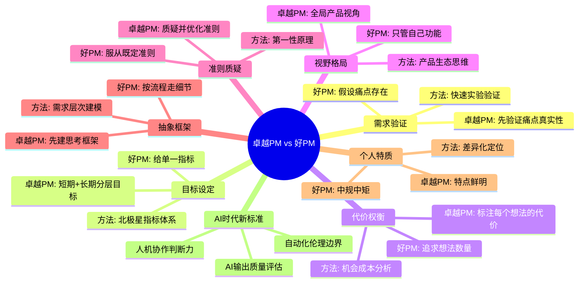
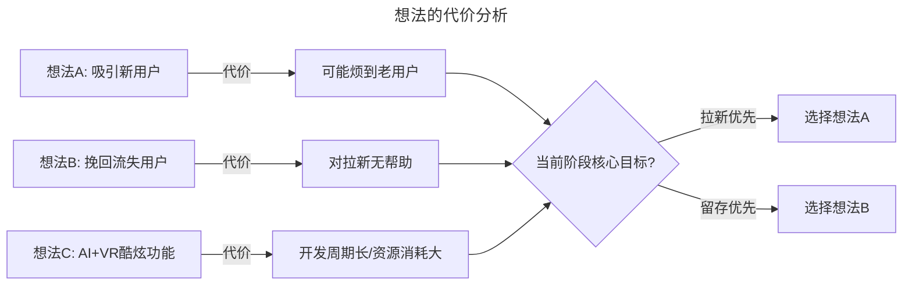
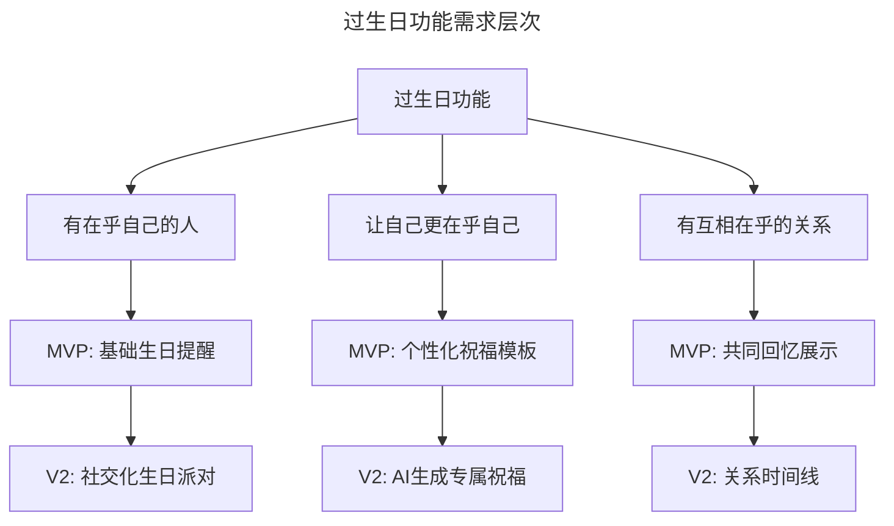
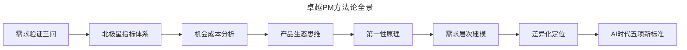

# 31 | 好的产品经理和卓越的产品经理

> **适用范围**：产品经理（各阶段）、产品负责人、面试官、希望提升产品能力的从业者。适用于能力认知、需求验证、目标设定、机会成本、产品生态思维、AI 时代 PM 等场景。
>
> **更新摘要（v2 · 2026-08 更新）**：
> - 结构化升级为 6 节骨架（导言 / 核心方法论 / 关键流程 / 工具与实战 / 常见误区 / 进阶延展）
> - 保留两个测试、七个核心区别、三层视角、AI 时代五项新标准
> - 保留全部 Mermaid 图并补充 `--- title: ... ---` frontmatter，每张图后追加文字解读

---

## 1. 导言

Facebook 面试产品经理有两个经典测试——**坐飞机测试**和**请假测试**。坐飞机测试：如果这个候选人要和你同坐十小时飞往亚洲的航班，你愿意让他做邻座吗？请假测试：这个人好到你会请假半天、开车到他家门口求他入职吗？如果没有任何面试官对候选人有这种冲动，就不录取。这两个测试的本质不是在找"合格"的人，而是在找**让人无法忽视**的人——卓越，而非还好。

> **图解**：卓越 PM vs 好 PM——七个核心区别（需求验证、目标设定、代价权衡、视野格局、准则质疑、抽象框架、个人特质），每个都对应不同的方法论，加上 AI 时代新标准。

---

## 2. 核心方法论

### 2.1 区别一：痛点是否真实存在

**案例：设计一个给 00 后看新闻的产品**——好的 PM 会假设痛点存在，迫不及待地在白板上写下"00 后想看新闻"，然后给出短视频新闻平台、"鹿晗讲特朗普"模块等方案。卓越的 PM 会先停下来追问：00 后真的有看新闻的需求吗？如果有，今日头条或微信能否已经满足？他们不会一上来就设计产品，而是先说明**用什么方式、以最快速度验证需求是否真实存在**。

> **方法论：需求验证三问**
> 1. 用户是否真的有这个痛点？（存在性验证）
> 2. 现有方案是否已经足够？（替代性验证）
> 3. 如何用最小成本快速验证？（MVP验证）

### 2.2 区别二：长期目标 vs 短期目标

**案例：设计一个给年轻人找职业导师的产品，如何衡量成功？**——好的 PM 会马上给出一个指标——月活数、日活数，或者"平均每个用户找到了几个导师"。卓越的 PM 会分层设定目标：

| 阶段 | 核心指标 | 逻辑 |
|------|---------|------|
| 冷启动期 | 导师回复率 | 没有回复，用户不会留存 |
| 短期 | 每个年轻人找到的导师数 | 验证匹配效率 |
| 长期 | 薪资涨幅 + 联系频率 | 验证产品终极价值 |

> **方法论：北极星指标体系（North Star Metric Framework）**
> - 一颗北极星指标统领方向
> - 若干输入指标驱动过程
> - 不同阶段指标权重动态调整

### 2.3 区别三：想法的代价是什么

好的 PM 头脑风暴时追求想法数量，给出 20 个主意，以为数量等于创造力。卓越的 PM 不仅给想法，还标注每个想法的**代价和副作用**：

> **图解**：想法的代价分析——每个想法都有代价和副作用（想法 A 吸引新用户可能烦到老用户、想法 B 挽回流失用户对拉新无帮助、想法 C AI+VR 酷炫功能开发周期长资源消耗大），根据当前阶段核心目标选择（拉新优先选 A、留存优先选 B）。

> **方法论：机会成本分析（Opportunity Cost Analysis）**
> 每一个"是"都意味着对其他选项说"否"。卓越 PM 的判断力不体现在能想出多少点子，而体现在**能清晰说出为什么放弃某些点子**。

### 2.4 区别四：只在乎自己功能 vs 全局视角

**案例：在 Facebook Messenger 上设计朋友生日 GIF 功能**——好的 PM 只看生日 GIF 的使用数量——这没错，但 90% 的面试者都这么说。卓越的 PM 会站在 Messenger 产品总监的高度思考：生日 GIF 发送增加 → 文字祝福是否减少？文字祝福比 GIF 更有心意 → 对 Messenger 整体是好事吗？生日 GIF 是否替代了语音通话？

> **方法论：产品生态思维（Product Ecosystem Thinking）**
> 不要只看功能级指标（Feature Metric），要看产品级指标（Product Metric）和生态级指标（Ecosystem Metric）。功能 A 的增长可能以功能 B 的衰退为代价，净效应才是关键。

### 2.5 区别五：质疑设计准则

当被告知"你的设计不符合公司视频产品的设计准则"时：好的 PM 说"那我换个方式再想想"——服从规则。卓越的 PM 会追问：之前的视频产品为什么制定这样的准则？之前的产品和现在这个功能有没有本质区别？准则本身是否可以优化？能否通过这个产品推动整个设计准则的迭代？

> **方法论：第一性原理（First Principles Thinking）**
> 不要在别人搭建的框架里做选择，要回到问题本质重新审视框架本身。规则是工具，不是枷锁。

### 2.6 区别六：抽象框架 vs 细节流程

**案例：设计一个帮助好友过生日的功能**——好的 PM 按流程走：功能列表 → 权衡取舍 → UI 图 → 成功标准。卓越的 PM 先建框架：过生日本质上满足了三个核心人性需求——

> **图解**：过生日功能需求层次——先抽象出三个核心人性需求（有在乎自己的人、让自己更在乎自己、有互相在乎的关系），再为每个需求设计 MVP（基础生日提醒、个性化祝福模板、共同回忆展示）和 V2（社交化生日派对、AI 生成专属祝福、关系时间线）。

> **方法论：需求层次建模（Need Hierarchy Modeling）**
> 先抽象出需求的底层结构，再决定 MVP 在每个维度做到什么程度，最后规划后续版本如何深挖每个维度。这保证了产品演进的方向性和一致性。

### 2.7 区别七：个人特点与风格

好的 PM 中规中矩，问"Facebook 喜欢什么样的 PM"，然后照葫芦画瓢。卓越的 PM 特点鲜明，让面试官吵得不可开交。Facebook 的原则是：**与其选一个大家都觉得"还行"的人，不如选一个有人特别喜欢、有人不太感冒的人。**

> **方法论：差异化定位（Differentiated Positioning）**
> 深挖你的特点——不一定是优点，但可以成为优点的部分——然后想尽一切办法发挥它。比如，精力旺盛+急脾气=激情驱动型 PM，让所有人至少记住"这个人非常有激情"。

---

## 3. 关键流程

### 3.1 三层视角

| 视角 | 好的PM | 卓越的PM |
|------|--------|----------|
| **执行层** | 按流程交付功能 | 先建框架再执行，每步有方法论支撑 |
| **策略层** | 关注单一功能指标 | 全局视角，关注产品生态净效应 |
| **原则层** | 服从既定规则 | 质疑规则，回到第一性原理重新审视 |

---

## 4. 工具与实战

### 4.1 AI 时代新变化：AI 产品经理的卓越标准

大模型时代，产品经理的能力模型正在发生根本性变化。以下是 AI 时代卓越 PM 的新标准：

**1. 人机协作判断力**——好的 PM 把 AI 当工具用，卓越的 PM 知道**什么时候该用 AI、什么时候不该用**。AI 可以生成 100 个功能方案，但判断哪个方案值得做、代价是什么，仍然需要人的决策力。卓越的 AI PM 能在 AI 的"广度"和人的"深度"之间找到最优分配。

**2. AI 输出质量评估能力**——当 AI 生成用户调研摘要、竞品分析报告、PRD 草稿时，好的 PM 直接采用，卓越的 PM 能**识别 AI 输出中的幻觉、偏见和逻辑漏洞**。这要求 PM 对业务领域有足够深的理解，才能做 AI 输出的"质量守门人"。

**3. 自动化伦理边界意识**——AI 产品涉及数据隐私、算法偏见、自动化决策的透明性等问题。卓越的 PM 会在产品设计的早期就划定伦理红线，而不是等问题爆发后再补救。他们能回答：这个 AI 功能在什么场景下应该主动"拒绝服务"？

**4. 提示词即产品思维**——在 AI 产品中，提示词（Prompt）本身就是产品体验的一部分。卓越的 PM 能把用户意图转化为高质量的提示词设计，让 AI 的输出稳定、可控、可预期——这本质上是一种新的"产品感"。

**5. 迭代速度的质变**——传统 PM 以周/月为单位迭代，AI PM 以天/小时为单位。卓越的 AI PM 能在高速迭代中保持方向感，不被短期数据波动带偏，同时利用 AI 的快速反馈循环加速学习。

### 4.2 最新实践

- **Meta 的 Product Sense 面试**已加入 AI 场景题：设计一个 AI 助手帮助用户规划旅行，考察候选人对 AI 能力边界的理解
- **Google 的 PM 面试**新增"AI 伦理判断"环节：给定一个 AI 功能场景，判断是否应该上线
- **字节跳动**内部推行"AI Copilot"工作流，PM 日常使用 AI 辅助决策，但最终判断权在人
- **Stripe**的 PM 团队要求每个产品决策都附上"AI 能做什么、AI 不能做什么"的分析

### 4.3 方法论总结

> **图解**：卓越 PM 方法论全景——需求验证三问→北极星指标体系→机会成本分析→产品生态思维→第一性原理→需求层次建模→差异化定位→AI 时代五项新标准，形成递进的完整方法论链条。

### 4.4 实战要点

| 要点 | 说明 | 适用场景 |
|------|------|----------|
| 需求验证三问 | 存在性/替代性/MVP验证 | 需求分析 |
| 北极星指标体系 | 单颗北极星+输入指标+动态权重 | 目标设定 |
| 机会成本分析 | 清晰说出为什么放弃某些点子 | 方案选择 |
| 产品生态思维 | 关注产品生态净效应 | 功能决策 |
| 第一性原理 | 回到问题本质审视框架 | 准则质疑 |
| 需求层次建模 | 先抽象底层结构再规划 | 产品演进 |
| 差异化定位 | 深挖特点建立辨识度 | 个人品牌 |
| AI质量守门人 | 识别AI幻觉、偏见、逻辑漏洞 | AI时代 |
| 提示词即产品 | 把用户意图转化为高质量Prompt | AI产品设计 |

---

## 5. 常见误区

| 误区 | 表现 | 正确做法 |
|------|------|---------|
| **假设痛点存在** | 不验证就急着设计方案 | 先验证痛点真实性 |
| **给单一指标** | 只给一个短期指标 | 分层设定短期+长期目标 |
| **追求想法数量** | 头脑风暴给20个主意 | 标注每个想法的代价和副作用 |
| **只管自己功能** | 只看功能级指标 | 产品生态思维，看净效应 |
| **服从既定准则** | 被告知不符合准则就服从 | 用第一性原理质疑并优化准则 |
| **按流程走细节** | 直接功能列表→UI图 | 先建需求层次框架 |
| **直接采用AI输出** | 不识别AI幻觉和偏见 | 做AI输出质量守门人 |

---

## 6. 进阶延展

### 6.1 术语表

| 术语 | 英文 | 释义 |
|------|------|------|
| 北极星指标 | North Star Metric | 衡量产品核心价值的单一最重要指标 |
| 最小可行产品 | MVP | 用最低成本验证核心假设的产品版本 |
| 机会成本 | Opportunity Cost | 选择某方案时放弃的最佳替代方案的价值 |
| 第一性原理 | First Principles | 回到问题最基本的事实和假设进行推理 |
| 产品生态思维 | Product Ecosystem Thinking | 从整体产品而非单一功能角度做决策 |
| 需求层次建模 | Need Hierarchy Modeling | 将用户需求拆解为层次结构指导产品演进 |
| 净效应 | Net Effect | 一个变化带来的正面和负面影响的综合结果 |
| 差异化定位 | Differentiated Positioning | 通过独特特质建立个人或产品的辨识度 |
| AI幻觉 | AI Hallucination | AI生成看似合理但实际错误的内容 |
| 提示词工程 | Prompt Engineering | 设计输入指令以优化AI输出的技术 |

### 6.2 思考题

1. 请你设计一个让 00 后看新闻的产品，用需求验证三问框架写出你的验证方案。
2. 你是短视频 UGC 平台的 PM，新功能测试期用户日均观看时长增加 10%，但人均原创视频发布量降低 5%。请用机会成本分析和产品生态思维判断：这个功能应不应该发布？
3. 在 AI 时代，"质疑设计准则"这一条有什么新的含义？当 AI 生成的方案与公司既定设计准则冲突时，你如何决策？

### 6.3 延伸阅读

1. Jackie Bavaro《Decoding the PM Interview》——Asana 首位产品经理、PM 面试方法论（另著《Cracking the PM Interview》）
2. Ken Norton《How to Hire a Product Manager》——Google Ventures 合伙人谈 PM 招聘哲学
3. Marty Cagan《Inspired》——产品经理如何从"好"到"卓越"的系统性指南
4. Lenny Rachitsky《AI Product Management》——AI 时代 PM 能力模型的前沿思考
5. Teresa Torres《Continuous Discovery Habits》——持续验证需求的方法论
