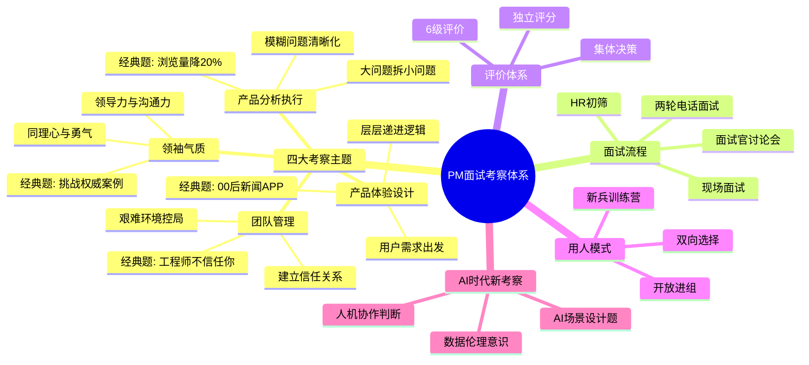
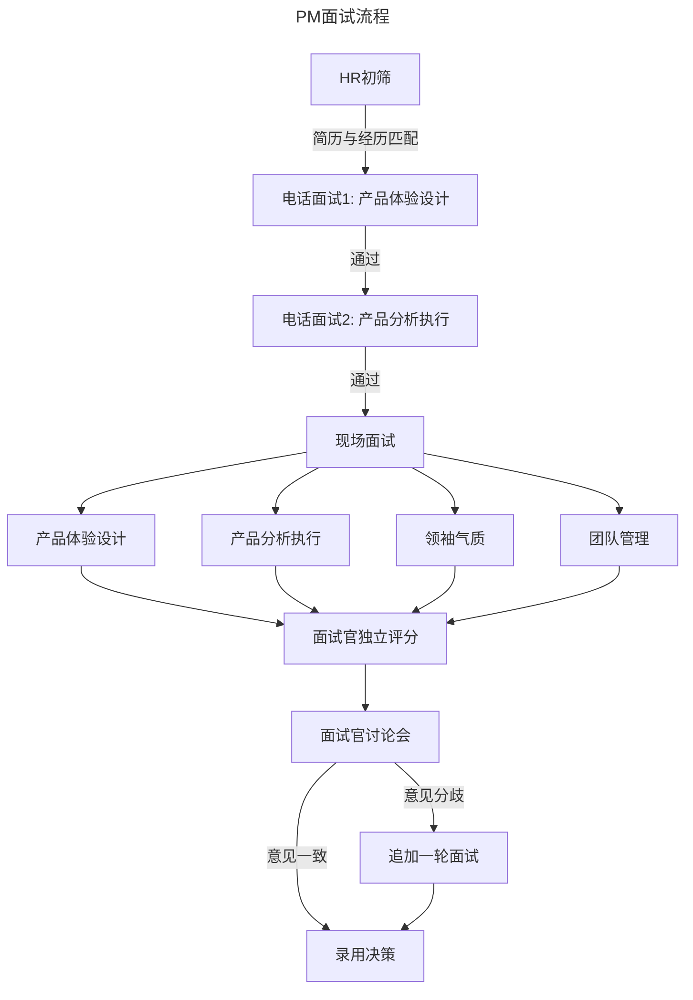
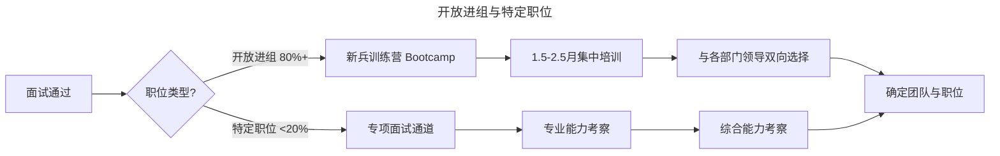
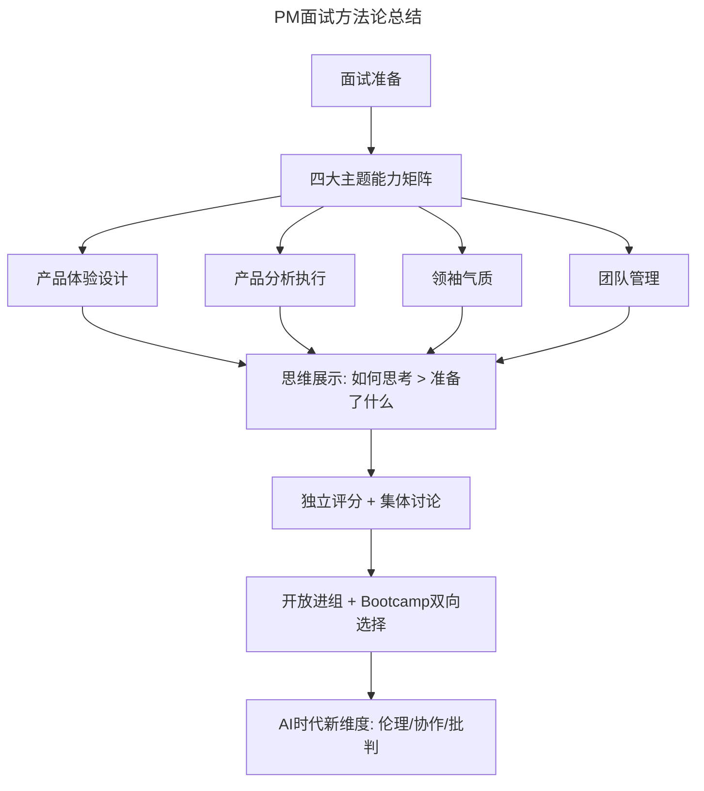

# 32 | 产品经理面试考察的是什么？

> **适用范围**：产品经理（求职者、面试官）、需要招聘 PM 的管理者、HR。适用于面试准备、面试考察、招聘体系设计、AI 时代面试等场景。
>
> **更新摘要（v2 · 2026-08 更新）**：
> - 结构化升级为 6 节骨架（导言 / 核心方法论 / 关键流程 / 工具与实战 / 常见误区 / 进阶延展）
> - 保留四大考察主题、面试流程、独立评分、6级评价、开放进组 vs 特定职位、Bootcamp、AI 时代新考察
> - 保留全部 Mermaid 图并补充 `--- title: ... ---` frontmatter，每张图后追加文字解读

---

## 1. 导言

产品经理面试没有算法题那样的量化标准，考察内容更全面，甚至涉及人格魅力。但考察重点始终明确：**分析能力、讲故事的能力、沟通能力、权衡取舍的能力、解决问题的能力**。这五项能力通过四大主题展开。

> **图解**：PM 面试考察体系——四大考察主题（产品体验设计、产品分析执行、领袖气质、团队管理）、面试流程、评价体系（6 级评价、独立评分、集体决策）、用人模式（开放进组、新兵训练营、双向选择）、AI 时代新考察。

---

## 2. 核心方法论

### 2.1 四大考察主题

**主题一：产品体验设计（Product Sense / Product Design）**

| 维度 | 说明 |
|------|------|
| 考察能力 | 能否从用户需求出发，设计出满足需求的完整产品体验 |
| 面试形式 | 提出一个大问题，观察面试者如何层层递进、按逻辑关系找到问题精髓，制定靠谱方案 |
| 经典题型 | 设计一个00后使用的新闻APP |

**主题二：产品分析执行（Product Analysis & Execution）**

| 维度 | 说明 |
|------|------|
| 考察能力 | 能否深入浅出，把模糊问题清晰化、具体化，把大问题拆分为可逐步解决的小问题 |
| 面试形式 | 一系列产品分析、数据分析、权衡取舍、优先级判断问题 |
| 经典题型 | 视频产品浏览量降低20%，作为PM你该怎么做？ |

**主题三：领袖气质（Leadership）**

| 维度 | 说明 |
|------|------|
| 考察能力 | 领导能力、沟通能力、同理心、勇往直前的勇气 |
| 面试形式 | 通过具体案例和假想问题，让面试者详尽描述解决方法，用具体事例展示领导力 |
| 经典题型 | 说一个你以前挑战权威的例子 |

**主题四：团队管理（Team Management）**

| 维度 | 说明 |
|------|------|
| 考察能力 | 能否在艰难环境下掌控局面，与团队成员建立信任关系 |
| 面试形式 | 具体情景题，有经验者讲真实故事，无经验者讲假设方案；面对面深谈，每句话都可能追问 |
| 经典题型 | 你的一个工程师不信任你，作为PM你会怎么做？ |

---

## 3. 关键流程

### 3.1 面试流程

> **图解**：PM 面试流程——HR 初筛（简历与经历匹配）→电话面试 1（产品体验设计）→电话面试 2（产品分析执行）→现场面试（产品体验设计、产品分析执行、领袖气质、团队管理）→面试官独立评分→面试官讨论会（意见一致录用决策，意见分歧追加一轮面试）。

**关键机制：独立评分**——面试官在内部系统中输入评价，**提交前看不到其他面试官的评价**，保证独立性和公平性。

**6 级评价体系**：

| 等级 | 英文 | 含义 |
|------|------|------|
| 强烈推荐 | Strong Hire | 不惜代价争取 |
| 一般推荐 | Hire | 明确支持录用 |
| 有点推荐 | Lean Hire | 倾向录用但有保留 |
| 有点不推荐 | Lean No Hire | 倾向不录用但非绝对 |
| 一般不推荐 | No Hire | 明确反对录用 |
| 强烈不推荐 | Strong No Hire | 坚决反对 |

**核心原则**：如果所有面试官都选"有点推荐"，这个人也不一定会被录取。真正值得录用的是那些**让面试官愿意为之与其他面试官争取**的候选人。

**面试官讨论会**——所有面试官面对面讨论，由产品高管主持。经常出现争论——一个面试官说"最有创新能力的 PM"，另一个说"逻辑不清楚不推荐"。最终看谁能说服谁，僵持不下则追加一轮面试。

### 3.2 开放进组 vs 特定职位

> **图解**：开放进组与特定职位——开放进组（80%+，新兵训练营 Bootcamp→1.5-2.5 月集中培训→与各部门领导双向选择→确定团队与职位）；特定职位（<20%，专项面试通道→专业能力考察→综合能力考察→确定团队与职位）。

**开放进组（Generalist PM）**——大部分 PM 职位是开放进组——面试时不考虑对某个具体部门是否合适，而看**是否适合整个公司**。面试流程和内容统一，不会因具体经验而改变。原因：顶尖公司机会多，PM 换部门很正常，产品发展需要综合能力。公司希望招聘的是**具备优秀思考和策略、分析和执行能力的人**，能胜任不同产品部门，而不只是某个部门老板觉得合适。

**特定职位（Specialist PM）**——少数情况选择特定职位，通常是：产品部门高管；需要特定专业经验的职位（如音乐产品 PM 需了解版权运作模式）。特定 PM 有专门面试通道，但也会有其他部门面试官考察综合能力，**防止因某个人特别喜欢就草率录用**。

**新兵训练营（Bootcamp）**——每个新人都会经历 Bootcamp，周期 1.5-2.5 个月：第 1-2 周（公司文化、工作流程集中培训）；第 3-6 周（与有招聘需求的部门领导沟通，双向选择）；第 7-10 周（深入了解公司情况，选择适合的职位）。公司希望新人**尽量多了解公司情况后再选择**，而不是急着定部门。这个阶段有时持续到三个月。

---

## 4. 工具与实战

### 4.1 三层视角

| 视角 | 传统理解 | 深层洞察 |
|------|---------|----------|
| **执行层** | 面试是回答问题的过程 | 面试是展示思维方式的窗口——面试官看的是你如何思考，而非你准备了什么故事 |
| **策略层** | 面试考察特定技能 | 面试考察综合能力——顶尖公司要的是能胜任任何产品线的通用型PM |
| **原则层** | 面试是单向筛选 | 面试是双向匹配——独立评分+集体讨论+Bootcamp双向选择，确保人岗匹配而非单向妥协 |

### 4.2 AI 时代新变化：PM 面试的新考察维度

**1. AI 场景设计题**——传统"设计一个 00 后新闻 APP"已不够，面试官会追问：如果这个产品有 AI 推荐引擎，你如何设计推荐逻辑的透明度？用户如何知道内容是 AI 筛选的还是人工编辑的？

**2. 人机协作判断考察**——面试官可能给出一个 AI 生成的产品分析报告，让候选人评估其质量和可靠性——考察的不是 AI 使用能力，而是**对 AI 输出的批判性思维**。

**3. 数据伦理意识**——AI 产品涉及用户数据训练、算法偏见、自动化决策等问题。面试中会考察候选人对这些问题的敏感度和处理思路，例如：你的产品用用户数据训练 AI 模型，用户要求删除数据，你如何处理已训练的模型？

**4. 快速原型能力**——AI 工具让 PM 可以在几小时内做出可交互原型。面试中，能展示用 AI 工具快速验证想法的候选人更具竞争力——这体现了"想法的代价"评估能力的升级。

**5. 跨模态产品思维**——AI 产品不再局限于文本和图像，语音、视频、3D 交互等模态的融合成为常态。面试官会考察候选人对多模态产品体验的理解和设计能力。

### 4.3 最新实践

- **Meta** 2024 年起在 PM 面试中加入"AI Product Sense"环节，要求候选人在白板设计中明确标注 AI 决策点和人工决策点
- **Google** PM 面试新增"Responsible AI"评估维度，考察候选人对 AI 伦理的判断力
- **Amazon** 在 Leadership Principle 面试中融入 AI 场景，如"当你发现 AI 推荐系统存在偏见时，你如何 Balance 业务目标和公平性"
- **字节跳动** 国内 PM 面试已加入"AI 工具使用"实操环节，考察候选人用 AI 快速产出方案的能力
- **Stripe** 面试流程中增加"AI 输出审查"环节，给候选人一份 AI 生成的 PRD，要求找出其中的逻辑漏洞

### 4.4 方法论总结

> **图解**：PM 面试方法论总结——面试准备→四大主题能力矩阵（产品体验设计、产品分析执行、领袖气质、团队管理）→思维展示（如何思考 > 准备了什么）→独立评分 + 集体讨论→开放进组 + Bootcamp 双向选择→AI 时代新维度（伦理/协作/批判）。

### 4.5 实战要点

| 要点 | 说明 | 适用场景 |
|------|------|----------|
| 四大主题 | 产品体验/分析执行/领袖气质/团队管理 | 面试考察 |
| 独立评分 | 提交前看不到他人评价 | 保证公平性 |
| 6级评价 | Strong Hire 到 Strong No Hire | 录用决策 |
| 面试官讨论会 | 集体讨论，僵持追加面试 | 录用决策 |
| 开放进组 | 考察综合能力，适合整个公司 | 大公司招聘 |
| 特定职位 | 需要特定专业经验 | 高管/专业岗位 |
| Bootcamp | 新兵训练营+双向选择 | 新人入职 |
| AI场景设计题 | 考察AI透明度、伦理 | AI时代面试 |
| AI输出批判思维 | 评估AI生成报告的质量可靠性 | AI时代面试 |

---

## 5. 常见误区

| 误区 | 表现 | 正确做法 |
|------|------|---------|
| **只准备答案** | 面试前背好故事 | 展示思维方式，如何思考比准备了什么重要 |
| **忽略综合能力** | 只展示单一技能 | 展示能胜任任何产品线的通用型PM能力 |
| **单向求职心态** | 只求被录用 | 面试是双向匹配，理解Bootcamp双向选择 |
| **忽视AI批判思维** | 直接采信AI输出 | 考察对AI输出的批判性思维 |

---

## 6. 进阶延展

### 6.1 术语表

| 术语 | 英文 | 释义 |
|------|------|------|
| 产品体验设计 | Product Sense / Product Design | 从用户需求出发设计完整产品体验的能力 |
| 产品分析执行 | Product Analysis & Execution | 将模糊问题清晰化、拆解并逐步解决的能力 |
| 领袖气质 | Leadership | 领导力、沟通力、同理心与勇气的综合体现 |
| 开放进组 | Generalist PM / Open Allocation | 不针对特定部门，考察综合能力的招聘模式 |
| 新兵训练营 | Bootcamp | 新员工入职后的集中培训和双向选择期 |
| 独立评分 | Independent Evaluation | 面试官在看不到他人评价的情况下独立打分 |
| 面试官讨论会 | Debrief / Hiring Committee | 所有面试官集体讨论决定是否录用 |
| 特定职位 | Specialist PM | 需要特定专业经验的PM职位 |
| 负责任AI | Responsible AI | AI产品的伦理、公平性和透明性考量 |
| 多模态 | Multimodal | 融合文本、语音、图像、视频等多种交互形式 |

### 6.2 思考题

1. 你所在公司的 PM 面试流程是什么样的？考察哪些能力？与本文描述的四大主题相比，有哪些差异和盲区？
2. 如果你是面试官，如何设计一道题来考察候选人的"AI 输出批判性思维"？请给出具体题目和评分标准。
3. 开放进组模式在什么规模的公司最有效？小公司应该采用什么样的 PM 面试策略？

### 6.3 延伸阅读

1. Lewis C. Lin《Decode and Conquer》——PM 面试四大主题的系统性拆解与应答框架
2. Gayle Laakmann McDowell《Cracking the PM Interview》——硅谷 PM 面试全流程指南
3. Ken Norton《How to Hire a Product Manager》——GV 合伙人谈 PM 招聘的底层哲学
4. Lenny Rachitsky Newsletter——AI 时代 PM 面试趋势的持续追踪
5. Google Re:Work《Hiring Audit Guide》——面试公平性与独立评分机制的设计原则
