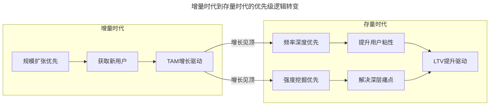
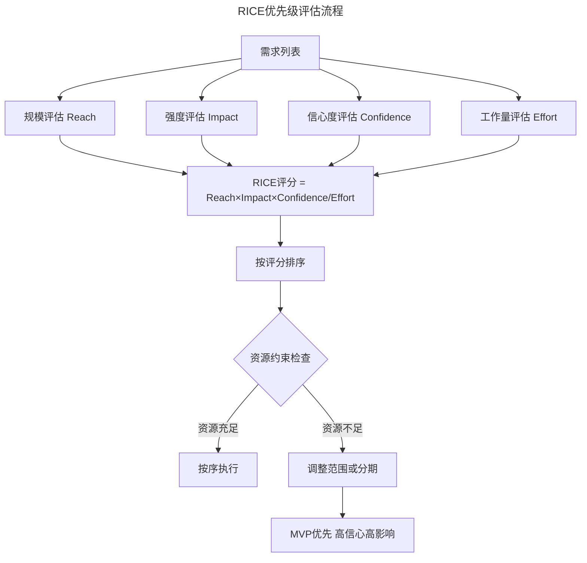
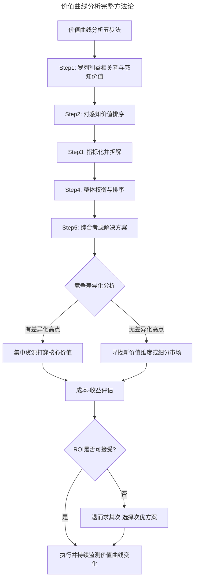
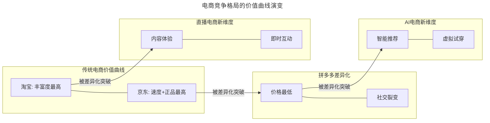

# 32 | 排定需求优先级的方法

> **适用范围**：产品经理（各阶段）、产品负责人、创业者、需要做需求排序的管理者。适用于需求优先级排定、价值曲线分析、机会成本评估、竞争差异化、RICE/ICE/WSJF 框架等场景。
>
> **更新摘要（v2 · 2026-08 更新）**：
> - 结构化升级为 6 节骨架（导言 / 核心方法论 / 关键流程 / 工具与实战 / 常见误区 / 进阶延展）
> - 合并"规模/频率/强度"（上）与"价值曲线分析"（下）两篇为单篇完整文档
> - 保留全部 Mermaid 图并补充 `--- title: ... ---` frontmatter，每张图后追加文字解读
> - 保留 RICE/ICE/WSJF 现代框架、存量时代反思、拼多多竞争案例、AI 时代新变化

---

## 1. 导言

**"一朝需求不称意，口里驱蛩心上蚝。"——（明）刘基**

在之前几次分享中，我们介绍了产品分析的思考套路（用什么方法，解决谁的什么问题）。基于这样的套路，或许我们可以列出产品不同利益相关者面临的不同问题，以及解决这些问题的方案。那么接下来的问题是：**在资源有限的情况下，应该如何取舍，如何安排需求优先级？**

> **核心摘要**：需求优先级排定有两种互补的方法论。第一种从**受众规模、需求频率和强度**三维模型出发，辅以"主观可达性"约束，用机会成本思维排定优先级；第二种是**价值曲线分析**，从所有利益相关者的感知价值出发，通过"罗列感知价值→排序→指标化拆解→整体权衡→综合解决方案"五步法排定优先级，核心原则是"只做用户能感知到的价值"。在数据驱动和 AI 时代，"不可感知价值"的边界正在被重新定义，竞争差异化是价值曲线分析的关键应用。RICE、ICE、WSJF 等现代框架为优先级判断提供了更量化的工具，但任何框架都无法替代产品经理对用户和市场的深度理解。

---

## 2. 核心方法论

### 2.1 避免毫无价值的正确

在排定优先级时，产品经理很容易出现的错误是"做无可争议的正确事情"——需求列表里永远有这样的需求，虽然没什么用，但做了肯定没错。比如不断地优化一张页面的视觉和交互细节，这样的需求不能说它是错的，但大都无关痛痒。

**机会成本思维**——这里提到"正确的事情"，背后有一个叫"机会成本"的经济学概念。如果我们投入 1 人日的研发资源做一个功能 A，获得 1 万块收益，成本 5 千块，看起来有 5 千块利润。但如果产品经理能找到另一个功能 B 让收益达到 2 万块，那做功能 A 就产生了机会成本——因选择而不得不失去获利更大的机会。

| 思维方式 | 关注点 | 典型表现 |
|----------|--------|---------|
| 绝对收益思维 | 这个需求能带来多少价值 | "这个功能做了肯定有用" |
| 机会成本思维 | 做这个需求意味着放弃什么 | "做这个功能的机会成本是推迟更高价值的功能" |

机会成本的本质是：**资源的有限性意味着每一个选择都隐含着放弃**。产品经理排定优先级，不是在"做与不做"之间选择，而是在"先做这个还是先做那个"之间选择。

### 2.2 WSJF：将机会成本量化

**WSJF（Weighted Shortest Job First，加权最短作业优先）** 是 SAFe 框架中提出的优先级量化方法，它直接将机会成本思想公式化：

> **WSJF = Cost of Delay ÷ Job Size**

其中，Cost of Delay（延迟成本）包含三个维度：用户业务价值（对用户/业务的直接影响）；时间紧迫性（延迟多久会导致价值衰减）；风险降低/机会启用（是否降低风险或开启新机会）。Job Size 则是预估的工作量。

WSJF 的核心思想是：**同样价值的需求，工作量越小优先级越高；同样工作量的需求，延迟成本越高优先级越高**。这与机会成本的逻辑完全一致——延迟一个高价值需求的机会成本更大。

### 2.3 规模、频率与强度三维模型

还是从"谁的什么问题"出发，首先将所有的利益相关者以及他们的问题列出来，逐条分析受众的规模，以及问题的频率和强度。**最简单的逻辑是：受益者越多、问题的频率越高、强度越大，则解决这样问题的价值就越大，优先级也越高。**

**规模：TAM 与市场天花板**——判断规模，有一个概念叫 TAM（Total Addressable Market），指潜在市场范围。每项服务都有受众天花板。当然这个天花板是会动的，可以用历年复合增长率估算增量，或用需求数量作为准绳估测市场潜力。**重要的是要有完整和健全的逻辑链条**——在这个逻辑链条中，客观因素越多，可控性就越差，整个产品模式的设计也就越不稳固。

**频率与强度：从增量到存量的视角转换**——需求的频率和强度比较容易理解，比如吃饭和打车跟相亲和找工作相比是高频场景，而结婚和求职比吃饭和打车的强度大。频率和强度也会随着时代、基础设施以及环境的变化而变化。

> **图解**：从增量时代到存量时代——增量时代以规模扩张优先（获取新用户、TAM 增长驱动）；当增长见顶进入存量时代，转向频率深度优先（提升用户粘性）和强度挖掘优先（解决深层痛点），最终实现 LTV 提升驱动。

在增量时代，**规模**是最重要的维度——谁先获取更多用户，谁就赢。但在存量时代（2023-2025 年中国互联网已进入存量竞争），用户增长见顶，**频率和强度的权重需要大幅提升**：频率维度（从"让更多人用"转向"让现有用户用得更频繁"，如微信从通讯工具扩展到支付、小程序、视频号）；强度维度（从"解决浅层需求"转向"解决深层痛点"，如拼多多从"便宜"这个强需求切入）。

**主观可达性：规模不等于可及**——在规模、频率和强度之外还有一个考虑因素叫主观的可达性。拿吃饭举例，吃饭的规模、频率和强度都很高，但显然不能按全世界人口 × 3 去推算饭店的业务天花板。可达性包含两个层面：市场可达性（能否触达目标用户？如面向农村老年人的产品，规模巨大但触达渠道有限）；能力可达性（团队是否有能力满足这个需求？如 AI 医疗影像诊断，市场巨大但技术门槛极高）。

---

## 3. 关键流程

### 3.1 排定优先级

理解了规模、频率和强度之后，就可以以此来做优先级排序了。把不同利益相关者的问题列出来，根据规模、频率和强度打分，然后综合考虑：

1. **规模评估**：某个用户提出需求时，挖掘到背后的动机后，考虑他能代表多少人，是小众需求还是大部分用户面临同样的问题。
2. **频率评估**：客观评价问题出现几率是否高。有的问题虽然确实存在，但因为出现频率足够低，会策略性地选择暂时不去解决（如更换会员 ID）。
3. **强度评估**：从正反两面评价强度——如果满足了这个需求，用户会有多开心；如果没有满足，用户会有多痛苦。

描述规模、频率和强度时，得到结论固然重要，但**更重要的是去探求结论的过程**——它背后是产品经理对产品定位的深入理解、对用户和场景的理解、以及对市场和竞争环境的理解。

### 3.2 现代优先级框架：RICE 与 ICE

除了规模/频率/强度的定性评估，业界还发展出了更量化的优先级框架：

**RICE 框架**（Intercom 提出）：**RICE Score = (Reach × Impact × Confidence) ÷ Effort**

| 维度 | 含义 | 评估方式 |
|------|------|----------|
| Reach | 影响范围 | 每期影响的用户数/事件数 |
| Impact | 影响强度 | 1-5分（3=显著影响，1=微小影响） |
| Confidence | 信心度 | 百分比（100%=高信心，50%=中等） |
| Effort | 工作量 | 人月/人周 |

**ICE 框架**（Sean Ellis 提出，RICE 的简化版）：**ICE Score = Impact × Confidence × Ease**。ICE 去掉了 Reach（很多场景下 Impact 已经包含规模因素），用 Ease（容易度）替代 Effort（放在分母），计算更简单，适合快速评估。

> **图解**：RICE 优先级评估流程——需求列表→规模/强度/信心度/工作量评估→RICE 评分=Reach×Impact×Confidence/Effort→按评分排序→资源约束检查（资源充足按序执行，资源不足调整范围或分期、MVP 优先高信心高影响）。

**框架选择的实践建议**：

| 框架 | 优势 | 局限 | 适用场景 |
|------|------|------|----------|
| 规模/频率/强度 | 直觉友好，适合定性讨论 | 难以量化比较 | 需求探索初期、团队讨论 |
| RICE | 量化评分，可比较 | 评分主观性，计算成本高 | 中大型产品、需求池管理 |
| ICE | 简单快速 | 粒度粗，容易忽略规模 | 快速决策、创业团队 |
| WSJF | 考虑时间因素 | 需要SAFe框架支撑 | 敏捷规模化、大型组织 |

**关键原则**：框架是辅助思考的工具，不是替代思考的公式。不要为了"精确"而花过多时间在评分上，评分的目的是让隐含假设显性化，促进团队讨论和共识。

### 3.3 价值曲线分析：从感知价值排定优先级

价值曲线分析是排定需求优先级的另一种重要方法，出发点还是"用什么方案，解决谁的什么问题"。与传统价值曲线分析（主要用于分析用户感知和服务质量）不同，产品经理不能仅关注用户，而要从所有利益相关者的角度出发，理解他们的感知，再评价产品提供的服务质量。

**五步法**：

**Step1：罗列利益相关者和他们的感知价值**——以开连锁饭店（X 县小吃）为例，利益相关者包括顾客、加盟店长、原材料供应商、投资人等。把自己放到他们的立场，考虑他们能感知到的价值和问题。顾客可感知的价值可能是菜品种类、口味、价格和卫生；加盟店长关注收入、成本、利润、翻台率；投资方关注加盟店数量、增速、毛利、实施成本。

> **关键原则**：这里加"感知到的"，是为了保证价值最大化。**提供用户完全无法感知到的价值是危险的**，那很难成为用户为你付费的原因。乔布斯说过"要把篱笆的背面也做得尽善尽美"，这是值得赞叹的工匠精神，但如果用户无法感知，为此付出的成本很容易就跑到黑洞里了。

**Step2：对问题进行优先级排序**——为每个角色的关注问题做排序，没有正确答案，但跟业务方向和目标用户群强相关。根据业务定位（X 县连锁小吃店）和目标用户群（CBD 白领）衡量排序，可能最重要的是配餐速度，其次是价格，第三是卫生。

**Step3：将问题指标化并拆解**——将所有问题指标化，把"配餐速度快"换成"下单到上桌的时长"，把"卫生条件好"换成"餐具消毒次数和清扫频率"。产品经理要避免把诗性和情绪带到分析框架里。在指标化过程中可能需要对部分指标做拆解（利润 = 营收 - 成本，成本 = 可变成本 + 固定成本，固定成本 = 人员成本 + 设备成本）。2024-2025 年，**OKR 和北极星指标**已经成为指标化管理的标准实践——北极星指标是最能代表产品核心价值的单一指标，OKR 将战略目标拆解为可衡量的关键结果。

**Step4：整体权衡和排序**——指标化之后，基于模型进行整体排序，在业务上做出判断：目前哪些人的哪些问题是当前的瓶颈？抓住这个问题和背后的指标，基本就抓住了业务重心和方向。不同人的感知价值之间可能会有矛盾（提高效率可能伤害用户体验，提高用户体验可能提高店长运营成本），这样的权衡是做产品的常态，需要把路径想清楚，有所抉择，一旦做了决定，下手要迅速。

**Step5：综合考虑解决方案**——排在第一位的问题可能耗费的成本巨大，承受不了就退而求其次。用成本-收益矩阵辅助决策：

| | 高收益 | 低收益 |
|------|--------|--------|
| **低成本** | 优先做（Quick Win） | 有余力再做 |
| **高成本** | 重点评估ROI | 暂缓或放弃 |

同时用 **MVP 思维**提醒：不需要一次性在所有价值维度上都做到最优，而是先在核心差异化维度上做到极致（如拼多多早期只在"价格"一个维度做到极致，其他维度维持及格线）。

---

## 4. 工具与实战

### 4.1 竞争差异化：价值曲线的核心应用

**价值曲线分析方法论框架**：

> **图解**：价值曲线分析完整方法论——五步法（罗列利益相关者与感知价值→对感知价值排序→指标化并拆解→整体权衡与排序→综合考虑解决方案）→竞争差异化分析（有差异化高点则集中资源打穿核心价值，无则寻找新价值维度或细分市场）→成本-收益评估→ROI 是否可接受（是则执行并持续监测价值曲线变化，否则退而求其次）。

回到连锁小吃店的例子，如果分析类似品牌竞争者都主打口味和用餐环境，聪明的办法是去找一个不同于其他人的价值高点——在口味和用餐环境保持及格的前提下，把送餐速度做到十倍快，做出差异化的品牌定位。

**拼多多：价值曲线差异化战略的教科书级案例**——它没有在淘宝和京东的优势维度（丰富度、物流速度）上硬拼，而是找到了一条全新的价值曲线——"极致性价比"，并通过社交裂变（拼团）和下沉市场（三四线城市用户）实现了差异化突破。2024-2025 年的新变量还包括：直播电商（用"内容+即时互动"创造新的感知价值维度）；AI 电商（AI 试衣、AI 推荐创造新的感知价值维度）。

> **图解**：电商竞争格局的价值曲线演变——淘宝（丰富度最高）和京东（速度+正品最高）双雄格局，被拼多多（价格最低+社交裂变）差异化突破，直播电商（内容体验+即时互动）创造新维度，AI 电商（智能推荐+虚拟试穿）再创新维度。**价值曲线不是静态的，它会随技术进步和竞争格局变化持续演进**，产品经理需要定期重新审视。

**打车平台新格局**——原稿中打车平台案例需要更新。2025 年的打车市场已从"滴滴一家独大"演变为：滴滴（从补贴扩张转向服务品质和合规性）、高德打车（聚合模式，通过"比价+一站式叫车"创造差异化）、曹操出行/T3 出行（自营车队，标准化服务+新能源）、自动驾驶出租车萝卜快跑（2022 年起在武汉等地规模化试运营，创造"无人驾驶体验"新维度）。

### 4.2 数据驱动时代"不可感知价值"的再讨论

原稿强调"提供用户完全无法感知到的价值是危险的"，这一原则在大多数场景下依然成立。但在数据驱动和 AI 时代，"不可感知价值"的边界正在被重新定义：

| 不可感知价值 | 战略意义 | 实践建议 |
|-------------|----------|----------|
| 数据资产 | 通过数据飞轮持续提升可感知价值 | 某些不可感知价值是可感知价值的"基础设施" |
| 技术债 | 拖慢迭代速度，间接导致交付变慢 | 偿还技术债是"不可感知的投资" |
| 安全与隐私 | 不出事时不感知，出事时剧烈负感知 | 采用"最低必要投入"策略，将不可感知价值"信号化" |

**AI 时代的感知价值重构**——AI 正在重构感知价值的构成方式：个性化提升感知价值（每个用户感知到的价值不同）；AI 本身成为感知价值（用户认为"有 AI 功能的产品更先进"）；自动化降低感知门槛（AI 让原本需要主动操作才能感知的价值变成被动感知）。

### 4.3 AI 辅助优先级判断

2024-2025 年，AI 工具为优先级判断提供了新的辅助手段：用户反馈量化（AI 自动分析用户反馈，统计不同需求的出现频率和情感强度，为 Reach 和 Impact 评估提供数据支撑）；竞品功能覆盖率分析（AI 快速梳理竞品功能矩阵，帮助判断某个需求是否构成差异化优势）；工作量预估辅助（基于历史数据，AI 辅助预估 Effort，减少人天评估偏差）。

**但 AI 无法替代的核心判断是：这个需求是否与产品战略方向一致**。AI 可以告诉你"用户最常提的需求是什么"，但无法告诉你"这个需求是否值得做"——后者需要产品经理的战略判断力。

### 4.4 实战要点

| 要点 | 说明 | 适用场景 |
|------|------|----------|
| 机会成本思维 | 每个选择都隐含放弃，用相对收益评估 | 所有优先级决策 |
| TAM评估 | 估算市场规模天花板，关注逻辑链完整性 | 新产品规划 |
| 规模/频率/强度三维 | 定性评估需求价值 | 需求讨论、团队共识 |
| RICE量化评分 | 将定性判断转化为可比较数值 | 需求池管理 |
| ICE快速评估 | 简化版RICE | 创业团队、快速决策 |
| WSJF加权最短作业 | 考虑延迟成本和工作量 | 敏捷规模化 |
| 存量时代调整 | 规模见顶时，频率和强度权重提升 | 成熟产品 |
| 感知价值优先 | 只做用户能感知到的价值 | 所有产品规划 |
| 竞争差异化 | 找到与竞品不同的价值高点 | 竞争分析、产品定位 |
| 价值曲线动态更新 | 定期重新审视价值曲线 | 季度/半年度规划 |
| MVP打穿核心价值 | 先在一个差异化维度做到极致 | 新产品启动 |
| AI辅助数据支撑 | 用AI量化用户反馈频率和情感强度 | 大量反馈处理 |

---

## 5. 常见误区

| 误区 | 表现 | 正确做法 |
|------|------|---------|
| **做无可争议的正确事** | 优化页面细节等无关痛痒的需求 | 用机会成本思维，考虑相对收益 |
| **绝对收益思维** | "这个功能做了肯定有用" | 考虑做这个需求的机会成本 |
| **只算规模不算可达** | 按全世界人口×3推算业务天花板 | 用主观可达性约束（市场/能力） |
| **规模见顶还追求规模** | 存量时代仍只关注规模扩张 | 存量时代提升频率和强度的权重 |
| **提供不可感知价值** | 为无法感知的工匠精神过度投入 | 不可感知价值用"最低必要投入"策略 |
| **在相同维度硬拼** | 与竞品在相同价值点竞争 | 竞争差异化，找不同的价值高点 |
| **价值曲线一次定终身** | 分析一次不再更新 | 定期重新审视，响应竞争和技术变化 |
| **框架替代思考** | 为"精确"花过多时间在评分上 | 评分的目的是让隐含假设显性化 |

---

## 6. 进阶延展

### 6.1 总结

排定需求优先级有"规模/频率/强度三维模型"和"价值曲线分析"两种互补的方法论。前者从受益者规模和问题频率强度出发，辅以主观可达性约束和机会成本思维；后者从所有利益相关者的感知价值出发，通过五步法找到最高优先级的价值点，并通过竞争差异化实现突破。

**核心原则**：框架是辅助思考的工具，不是替代思考的公式。无论是 RICE/ICE/WSJF 等现代量化框架，还是 AI 辅助的数据分析，都无法替代产品经理对用户和市场的深度理解。在增量时代追求规模，在存量时代深挖频率和强度；只做用户能感知到的价值，用竞争差异化找到突破点——这是排定需求优先级的核心智慧。

### 6.2 参考文献

- W. Chan Kim & Renée Mauborgne, *Blue Ocean Strategy*——价值曲线分析的原始理论来源
- Intercom Blog: "RICE: Simple Prioritization for Product Managers"——RICE 框架原始文献
- SAFe Framework: WSJF——加权最短作业优先的完整方法论
- CNNIC《中国互联网络发展状况统计报告》——中国网民规模最新数据
- Sean Ellis, *Hacking Growth*——ICE 框架与增长方法论
- John Doerr, *Measure What Matters*——OKR 与指标化管理
- Amplitude Blog: "North Star Metric"——北极星指标方法论
