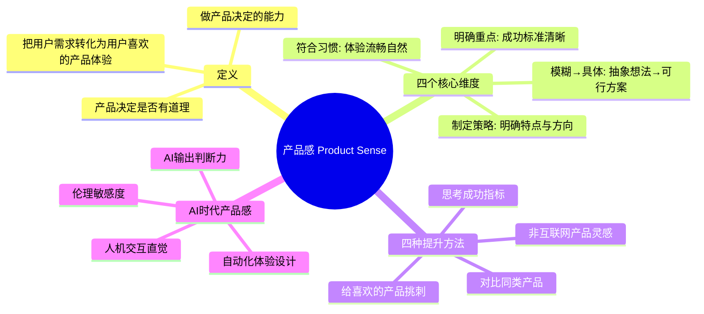
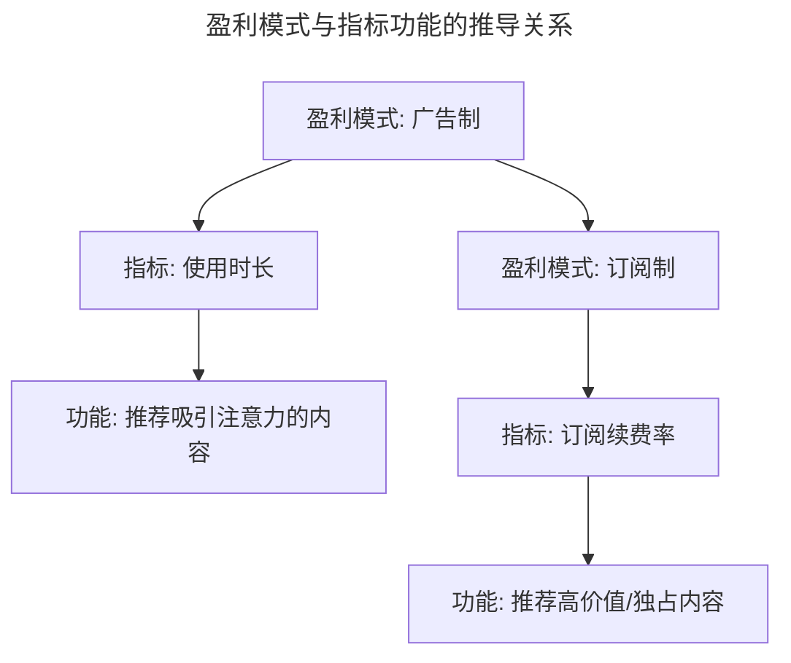
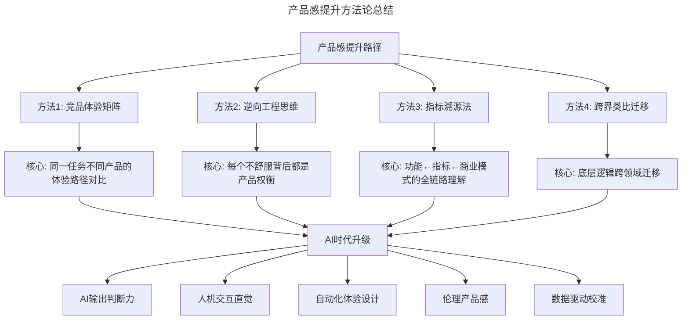

# 33 | 如何提升产品感（Product Sense）？

> **适用范围**：产品经理（各阶段）、产品设计师、希望提升产品判断力的从业者。适用于产品感训练、竞品分析、指标溯源、跨界迁移、AI 时代产品感等场景。
>
> **更新摘要（v2 · 2026-08 更新）**：
> - 结构化升级为 6 节骨架（导言 / 核心方法论 / 关键流程 / 工具与实战 / 常见误区 / 进阶延展）
> - 保留四种提升方法、IGTV 案例、指标溯源法、AI 时代产品感进化
> - 保留全部 Mermaid 图并补充 `--- title: ... ---` frontmatter，每张图后追加文字解读

---

## 1. 导言

**产品感（Product Sense），简言之就是产品经理能把用户的需求转化成用户喜欢、用得顺手的产品体验。** 一句话概括：你是不是知道如何做产品决定，以及你的产品决定是不是有道理。

> **图解**：产品感 Product Sense——定义（把用户需求转化为用户喜欢的产品体验、做产品决定的能力）、四个核心维度（模糊→具体、符合习惯、制定策略、明确重点）、四种提升方法（对比同类产品、给喜欢的产品挑刺、思考成功指标、非互联网产品灵感）、AI 时代产品感（AI 输出判断力、人机交互直觉、自动化体验设计、伦理敏感度）。

### 1.1 产品感的四个核心维度

| 维度 | 核心问题 | 能力描述 |
|------|---------|----------|
| 模糊→具体 | 能否将抽象想法落地？ | 将模糊抽象的想法转化成实际可行的产品解决方案 |
| 符合习惯 | 用户用得顺手吗？ | 设计符合用户使用习惯、体验流畅的产品方案 |
| 制定策略 | 下一步做什么？ | 制定产品策略，明确产品特点，知道下一个功能该做什么 |
| 明确重点 | 怎么算成功？ | 明确产品的重点以及成功标准 |

### 1.2 经典案例：IGTV 的竖版全屏

Instagram 发布的视频平台 IGTV，采用竖版全屏方式——这是产品感的典型体现。

> **图解**：IGTV 竖版全屏决策逻辑——用户洞察（年轻化+爱时尚）→竞品分析（长视频多为横版）→产品决策（竖版全屏）→体验优势（浸入式+便捷）→内容匹配（时尚/旅游类内容特别适合）→差异化（第一个长视频竖版 APP）。

视频产品呈现方式有很多，大多数视频 APP 内容虽好，但多为横版，不够沉浸。IGTV 意识到用户年轻化、爱时尚的特点，所有视频都是竖版全屏——即使长达一小时的小电影也是如此。这种竖版全屏模式对 Instagram 擅长的时尚和旅游内容特别合适，体验浸入式，吸引了大量用户。**在其他产品的长视频都是横版的情况下，认识到这种体验对现有用户并非最优，并制定出浸入式又便捷的解决方案——这就是好的产品感。**

---

## 2. 核心方法论

### 2.1 方法一：对比和研究同类产品

对于视频产品，对比抖音、快手、微视、YouTube 等。

**第一步：对比直观内容**——目标用户群体、产品功能等表层差异。

**第二步：对比用户体验（最关键）**——在这几个平台上传同一个视频，对比发布后的体验：哪个视频在短时间内观看数量更多？其他用户给你反馈的方式是什么（评论还是表情包）？它们多久给你发一次提醒消息，提醒是否有用？为什么打开抖音最先看到最火的内容，而打开 Instagram 最先看到的是朋友或关注明星的内容？

> **方法论：竞品体验矩阵（Competitive Experience Matrix）**
> 不要只对比功能清单，要对比**同一用户任务在不同产品中的完整体验路径**。功能是表象，体验路径才是本质。

**第三步：思考还没有的功能**——如果要加一个视频剪辑功能，作为抖音的 PM 会怎么做？作为 Instagram 的 PM 又会怎么做？

### 2.2 方法二：给喜欢的产品挑刺

越是你喜欢的产品，用户体验越好，可以挑错的空间越小。给最喜欢的产品挑错，需要大量思考、谨慎观察产品体验的一丝一毫——这个过程可以有效提升产品感。如果现在让你给微信、抖音、Instagram 挑错，你会挑出哪些问题？

> **方法论：逆向工程思维（Reverse Engineering Thinking）**
> 挑刺不是为了批评，而是为了理解：这个产品为什么在这个地方做了这样的取舍？如果我来做，有没有更好的方案？每一个"不舒服"的体验背后，都可能藏着一个产品决策的权衡。

### 2.3 方法三：思考产品成功指标的制定过程

**1. 了解其他产品的成功指标是什么，以及如何指导功能开发**

| 产品 | 核心成功指标 | 指标驱动的功能 |
|------|------------|---------------|
| Facebook | 用户使用数量 + 平均使用时间 | 信息流中放大量视频，提升使用时长 |
| YouTube | 视频观看总时长 | 不断推荐长视频，提升观看总时长 |

理解了指标，就理解了功能：Facebook 在信息流放视频是为了提升使用时间，YouTube 推荐长视频是为了提升观看总时长。

**2. 思考其他产品为什么制定这样的指标**——Facebook 和 YouTube 的盈利模式都是在内容中插广告，插广告有一定逻辑（看了多长时间后才插），所以使用时间越长，能插的广告越多。

**3. 假想变换盈利模式，重新推导指标和功能**

> **图解**：盈利模式与指标功能的推导关系——广告制→指标（使用时长）→功能（推荐吸引注意力的内容）；订阅制→指标（订阅续费率）→功能（推荐高价值/独占内容）。

> **方法论：指标溯源法（Metric Tracing）**
> 每一个产品功能背后都有一个成功指标，每一个成功指标背后都有一个商业模式。理解这条链路，就能理解产品决策的底层逻辑，也能在商业模式变化时快速推导出新的指标和功能方向。

### 2.4 方法四：从非互联网产品中寻找灵感

所有产品都是相通的，讲究的都是如何解决用户问题。

**时尚产品的启示**——同样是奢侈品牌，LV、Chanel 和 Burberry 的大片对女性的描述方式很不一样。每次时装秀，设计师讲自己的"缪斯"来自哪里——这和我们的**目标用户群体**是相通的。

**金融产品的启示**——银行产品对用户分层非常明显：金卡、银卡、白金卡，每种卡对应福利不同。这和我们把用户分成"金主爸爸"、付费用户、活跃用户、普通用户等类别，采用不同推送方式，逻辑完全一致。

> **方法论：跨界类比迁移（Cross-Domain Analogy）**
> 不能把互联网产品看成孤立的门类。时尚产品的用户画像方法、金融产品的用户分层策略、零售产品的定价心理学——这些底层逻辑可以直接迁移到互联网产品中。跳出互联网产品的小圈子去看外面的大世界，这是 PM 的素养，也是提升产品感的好方法。

---

## 3. 关键流程

### 3.1 三层视角

| 视角 | 表层理解 | 深层洞察 |
|------|---------|----------|
| **执行层** | 产品感是设计功能的能力 | 产品感是**做产品决定**的能力——不是设计得多好看，而是决定做什么、不做什么 |
| **策略层** | 产品感靠天赋和经验积累 | 产品感可以通过**系统化训练**提升——对比、挑刺、指标溯源、跨界迁移，每一步都有方法 |
| **原则层** | 产品感是关于产品的感觉 | 产品感本质是**对人的理解**——观察生活、思考生活，才能更好地服务于用户的生活 |

---

## 4. 工具与实战

### 4.1 AI 时代新变化：产品感的进化

**1. AI 输出判断力成为新维度**——传统产品感关注"用户需求→产品体验"的转化，AI 时代还需要关注"AI 输出→用户体验"的中间层。当 AI 生成推荐、摘要、对话时，PM 需要判断这些输出是否符合用户预期——这是一种新的产品感。

**2. 人机交互直觉**——AI 产品的交互不再是确定性的按钮和表单，而是概率性的对话和推荐。PM 需要培养对"AI 什么时候该主动、什么时候该沉默"的直觉——这比传统交互设计更依赖对用户心理的理解。

**3. 自动化体验设计**——AI 可以自动生成界面、自动调整布局、自动个性化内容。PM 的产品感需要从"设计具体体验"升级为"设计体验生成的规则"——你不再画每一屏，而是定义 AI 生成每一屏的约束条件。

**4. 伦理敏感度**——AI 产品可能产生偏见、歧视、信息茧房等问题。卓越的 PM 能提前感知这些风险，在产品设计中嵌入"安全阀"——这需要一种超越功能层面的产品感，可以称之为**伦理产品感（Ethical Product Sense）**。

**5. 数据驱动的产品感验证**——传统产品感依赖直觉和经验，AI 时代可以用 A/B 测试、用户行为分析等手段快速验证产品感是否准确。产品感不再是"玄学"，而是可以被**量化校准**的能力。

### 4.2 最新实践

- **Spotify** 的 AI DJ 功能，PM 团队花了大量时间定义"AI 什么时候该说话、什么时候该安静"的交互规则，这是人机交互直觉的典型应用
- **Notion** 的 AI 写作助手，PM 在设计时明确区分了"AI 主动建议"和"用户触发 AI"两种模式，体现了自动化体验设计的思路
- **TikTok** 的推荐算法团队与 PM 紧密协作，PM 负责定义"推荐多样性"的约束条件，防止信息茧房——伦理产品感的实践
- **Apple** 在设计 Apple Intelligence 时，PM 团队的核心工作之一是定义"AI 能力的边界"——什么场景下 AI 应该拒绝服务
- **Figma** 的 AI 生成功能，PM 将产品感从"设计工具"升级为"设计规则生成器"，用户定义风格约束，AI 在约束内生成

### 4.3 方法论总结

> **图解**：产品感提升方法论总结——四种方法（竞品体验矩阵、逆向工程思维、指标溯源法、跨界类比迁移）各有核心，AI 时代升级为（AI 输出判断力、人机交互直觉、自动化体验设计、伦理产品感、数据驱动校准）。

---

## 5. 常见误区

| 误区 | 表现 | 正确做法 |
|------|------|----------|
| **把产品感当设计能力** | 只关注界面好不好看 | 产品感是做产品决定的能力，决定做什么不做什么 |
| **认为产品感靠天赋** | 觉得无法系统化提升 | 通过对比、挑刺、指标溯源、跨界迁移系统化训练 |
| **只对比功能清单** | 竞品分析停留在功能列表 | 用竞品体验矩阵对比同一任务的体验路径 |
| **挑刺只为批评** | 给喜欢产品挑刺却不解取舍 | 用逆向工程思维理解产品决策的权衡 |
| **只看功能不看指标** | 不理解功能背后的成功指标 | 用指标溯源法理解功能←指标←商业模式 |
| **忽略跨界迁移** | 只在互联网小圈子里打转 | 从时尚、金融、零售等领域迁移底层逻辑 |

---

## 6. 进阶延展

### 6.1 术语表

| 术语 | 英文 | 释义 |
|------|------|------|
| 产品感 | Product Sense | 将用户需求转化为优质产品体验的直觉与能力 |
| 竞品体验矩阵 | Competitive Experience Matrix | 对比同一用户任务在不同产品中的完整体验路径 |
| 逆向工程思维 | Reverse Engineering Thinking | 从产品表现反推设计决策和权衡逻辑 |
| 指标溯源法 | Metric Tracing | 从功能追溯到指标再到商业模式的链路分析方法 |
| 跨界类比迁移 | Cross-Domain Analogy | 将其他领域的底层逻辑迁移到互联网产品中 |
| 伦理产品感 | Ethical Product Sense | 对AI产品伦理风险的预判和防范能力 |
| 信息茧房 | Filter Bubble | 算法推荐导致用户只接触同质化信息的现象 |
| 体验路径 | Experience Pathway | 用户完成某个任务在产品中的完整操作路径 |
| 自动化体验设计 | Automated Experience Design | 定义AI生成体验的规则和约束而非设计具体界面 |
| 数据驱动校准 | Data-Driven Calibration | 用量化手段验证和修正产品感判断 |

### 6.2 思考题

1. 选择一个你常用的 AI 产品（如 ChatGPT、Notion AI、Spotify AI DJ），用"给喜欢的产品挑刺"方法找出 3 个体验问题，并分析每个问题背后的产品权衡。
2. 用指标溯源法分析一个你熟悉的产品：它的核心成功指标是什么？这个指标背后的商业模式是什么？如果商业模式改变，指标和功能应该如何调整？
3. 在 AI 时代，"从非互联网产品中寻找灵感"这一方法有什么新的可能性？AI 能否帮助我们发现跨领域的类比？这种 AI 辅助的跨界迁移有什么风险？

### 6.3 延伸阅读

1. Julie Zhuo《The Making of a Manager》——Facebook 前 VP 谈产品感与管理能力的融合
2. Ken Kocienda《Creative Selection》——Apple 前工程师谈产品直觉如何从迭代中生长
3. Scott Belsky《The Messy Middle》——产品从 0 到 1 过程中产品感的锤炼
4. Teresa Torres《Continuous Discovery Habits》——用持续发现方法系统化培养产品感
5. Rian van der Merwe《Product Sense》——产品感的系统性拆解与训练框架
