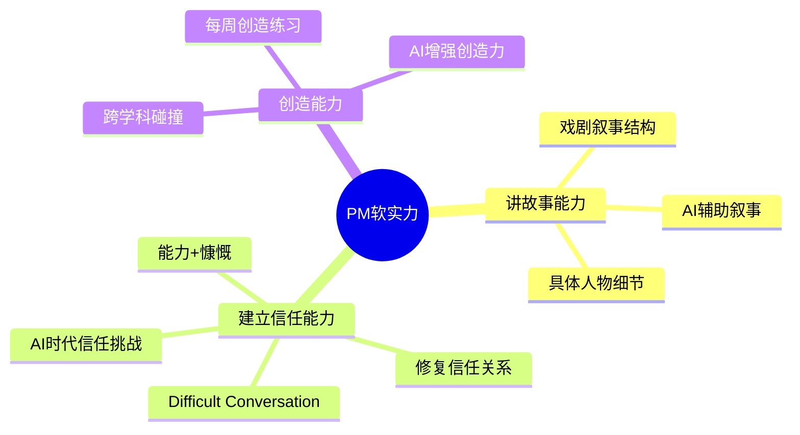
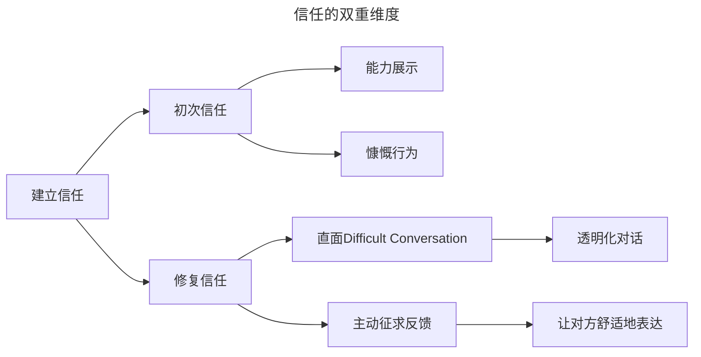

# 34 | 如何提升产品经理的综合素质？

> **适用范围**：产品经理（各阶段）、产品负责人、需要提升软实力的从业者。适用于讲故事能力、建立信任、创造力训练、AI 时代软实力提升等场景。
>
> **更新摘要（v2 · 2026-08 更新）**：
> - 结构化升级为 6 节骨架（导言 / 核心方法论 / 关键流程 / 工具与实战 / 常见误区 / 进阶延展）
> - 保留 STAR 叙事框架、信任建立、Difficult Conversation、创造力健身、AI 时代新变化、PDCA 循环
> - 保留全部 Mermaid 图并补充 `--- title: ... ---` frontmatter，每张图后追加文字解读

---

## 1. 导言

产品经理的工作内容多种多样，接触的人风格各异，产品发布情况不断。你不仅需要过硬的产品增长能力、领导能力、管理能力，更需要勇气和灵活应变的软实力来应对各种变化和压力。

> **图解**：PM 软实力——讲故事能力（具体人物细节、戏剧叙事结构、AI 辅助叙事）、建立信任能力（能力+慷慨、修复信任关系、Difficult Conversation、AI 时代信任挑战）、创造能力（跨学科碰撞、每周创造练习、AI 增强创造力）。

### 1.1 三层视角：软实力的个体-团队-组织维度

| 维度 | 核心问题 | 关键能力 |
|------|---------|---------|
| 个体层 | 如何让自己持续输出价值？ | 讲故事能力、创造能力 |
| 团队层 | 如何让多元背景的人高效协作？ | 建立信任能力、修复关系能力 |
| 组织层 | 如何让软实力成为文化资产？ | 透明沟通机制、创新激励机制 |

---

## 2. 核心方法论

### 2.1 讲故事的能力

讲故事看似只是动动嘴皮子，却是一个极其重要的能力——营销经理、设计师、工程师，所有人都喜欢听故事。这里的"讲故事"不是吹牛，而是给团队讲清楚我们到底在做什么，为什么这件事值得我们做、值得我们这么做。

**方法论：STAR 叙事框架**

| 阶段 | 产品叙事对应 | 核心动作 |
|------|------------|---------|
| Situation（情境） | 用户痛点 | 用具体人物细节还原场景 |
| Task（任务） | 痛点为何一直未解决 | 揭示结构性障碍 |
| Action（行动） | 我们的解决方案 | 展示独特价值主张 |
| Result（结果） | 愿景与期待 | 让听众产生行动欲望 |

**经典案例**——**Chris Cox 的愿景演讲**：Facebook 首席产品官 Chris Cox，每个新员工入职第一天的 Newcomer Camp，他都会讲 Facebook 的愿景和产品蓝图。每次讲完，新员工两眼放光，对工作充满激情和斗志。这就是讲故事的力量——把抽象的战略变成可感知的叙事。**奥巴马 2008 年竞选演讲**：回顾黑人平权运动和女性投票权的进展时，他没有堆砌史实，而是用 106 岁黑人妇女 Ann Nixon Cooper 的亲身经历，侧面揭示美国在民主和和平上的进展。

**戏剧叙事结构在产品中的应用**——借鉴虚拟文学和戏剧文学的写作方式——开端、铺垫、高潮、结局同样适用于讲述产品故事：开端（说出用户的痛点）；铺垫（为什么这样的痛点一直没有解决）；高潮（我们想要达成的目的和解决方式）；结局（收尾，让大家充满期待）。

### 2.2 和他人建立信任的能力

产品经理要和各种各样的人打交道，日常可能接触上百人，每个人都有不同的风格和性格特点，这意味着需要培养和各种人快速建立信任的能力。

**心理学基础：领袖吸引他人的两个特点**——心理学研究表明，领袖吸引他人靠两点：**一是有能力，二是慷慨**。产品经理除了具备超群的产品能力外，更不能自私、唯我独尊，而应该大度、慷慨，愿意多花时间帮助别人，给他人带来福利。如果你的工程师在这个项目上花的时间最多，当有机会给大老板展示时，大家自然而然想到的是你这个产品经理——那这个出风头的机会你会让给工程师吗？

**信任的双重维度**：

> **图解**：信任的双重维度——初次信任（能力展示、慷慨行为）与修复信任（直面 Difficult Conversation、主动征求反馈）。建立信任不仅仅是第一印象建立良好关系，还包括快速修复关系的能力。

**Sheryl Sandberg 的信任修复法**——Facebook 首席运营官 Sheryl Sandberg 提出两个关键原则：敢于直接面对不舒服的对话（Difficult Conversation，包括对别人的工作方式提出批评、建议，直面和同事的隔阂，直击问题要点，让对话透明化）；主动问别人对你有没有什么意见（用这种方式让对方更舒服地说出问题，从而解决问题）。在 Facebook，成为产品主管之前，所有人都要接受公司内部培训，专门学习如何进行 Difficult Conversation。

**日常锻炼方法**——在社交活动上和陌生人聊天，专门找一些乍一看不是很热情的人，看能否在短时间内建立信任；工作中遇到不顺心的人，不要逃避，锻炼自己在一周内修复关系；订阅 Harvard Business Review 的 Tip Of The Day，每天一条提升领导力的建议。

### 2.3 创造能力

**跨学科碰撞：创造力的源泉**——跨学科的碰撞是最能提升创造能力的方式。每当接触新鲜事物或其他学科时，都是"脑洞大开"、创造力爆棚的时候。虽然工作繁忙，但花时间尝试不熟悉的东西，其实也是在为工作做功课。周末可以学个新爱好，读一本从未接触过的领域的书，在 Coursera 或 edX 上学一门与计算机、产品无关的课。案例：曾在 edX 上过哈佛大学的米其林料理课，课程中讲了很多厨师摆盘、设计菜品的想法，后来在设计产品时经常会想到这些，给了不少设计灵感。

**创造力健身法**——Fidji Simo 是 Facebook 最年轻的副总裁之一，2012 年开始做产品经理，之后一年至少升一级，30 出头就成了副总裁。她的新年计划是**每周做一件有创造力的事情**，比如画画、写文章等。创造力好比健身，不练也会退化。工作忙起来满脑子都是公司具体产品的事情，需要跳出来锻炼创造能力，否则只是在消耗，没有积累和锻炼新的能力，终有一天会黔驴技穷。

---

## 3. 关键流程

### 3.1 AI 时代新变化：软实力的进化

**AI 辅助讲故事**——2025 年，AI 正在重塑产品叙事的方式：AI 叙事助手（使用 ChatGPT、Claude 等工具快速生成产品叙事的多个版本，A/B 测试哪种叙事最能打动团队和用户）；数据驱动叙事（AI 可以从海量用户数据中自动提取关键洞察，将冰冷的数据转化为有温度的用户故事）；个性化叙事（同一产品愿景，AI 可以根据听众背景自动调整叙事角度和语言风格）；实时叙事优化（通过 AI 分析听众反馈，动态调整叙事节奏和重点）。

> **关键洞察**：AI 可以帮你构建叙事骨架，但情感共鸣的"灵魂"仍需产品经理亲自注入。最好的方式是 AI 生成初稿，人类注入情感和细节。

**AI 时代的信任建立**——2025 年，AI 工具的普及给信任建立带来了新的挑战和机遇：AI 生成内容的信任危机（当团队成员发现你用 AI 生成的报告或方案，信任可能受损。关键是在使用 AI 时保持透明，标注 AI 辅助的部分）；远程协作中的信任（AI 会议摘要工具可以记录会议要点，减少信息不对称，但也要注意隐私边界）；AI 辅助 Difficult Conversation（可以使用 AI 模拟困难对话场景，提前练习沟通策略，但真正的对话必须面对面进行）；数据透明度（AI 时代，用数据说话更容易建立信任，让团队成员看到决策背后的数据依据）。

**AI 增强创造力**——2025 年，AI 正在成为创造力的放大器而非替代品：AI 作为创意伙伴（使用 Midjourney、DALL-E 快速可视化产品概念，用 ChatGPT 进行头脑风暴，生成 10 倍于以往的创意方案）；跨学科知识加速器（AI 可以在几分钟内帮你理解一个全新领域的基础框架，大幅降低跨学科学习的门槛）；创造力练习的新形式（用 AI 生成创意挑战题目，每天练习）；从执行到策展（当 AI 可以快速生成大量创意时，产品经理的核心能力从"产生创意"转向"筛选和组合创意"——判断力比产出量更重要）。

> **关键洞察**：AI 时代的创造力公式 = 人类洞察 × AI 生成能力 × 策展判断力。产品经理需要同时提升三者的水平。

---

## 4. 工具与实战

### 4.1 方法论总结：软实力提升的 PDCA 循环

| 阶段 | 讲故事 | 建立信任 | 创造能力 |
|------|--------|---------|---------|
| Plan | 分析听众，确定叙事目标 | 识别关键利益相关者 | 选择跨学科领域 |
| Do | 用STAR框架构建叙事 | 主动帮助他人，直面困难对话 | 每周做一件创造性的事 |
| Check | 收集听众反馈，评估叙事效果 | 定期检查信任关系状态 | 反思创造练习的收获 |
| Act | 优化叙事结构和细节 | 修复受损关系，强化良好关系 | 将跨学科洞察融入产品 |

### 4.2 实战要点

| 要点 | 说明 | 适用场景 |
|------|------|----------|
| STAR叙事框架 | Situation-Task-Action-Result组织叙事 | 产品汇报、愿景宣讲 |
| 戏剧叙事结构 | 开端-铺垫-高潮-结局 | 讲述产品故事 |
| 能力+慷慨 | 领袖吸引他人的两个特点 | 建立信任 |
| Difficult Conversation | 直面不舒服的对话，透明化 | 修复信任 |
| 主动征求反馈 | 让对方舒适地表达问题 | 信任建立 |
| 跨学科碰撞 | 学习新领域知识提升创造力 | 创造力训练 |
| 每周创造练习 | 每周做一件有创造力的事 | 保持创造力 |
| AI辅助叙事 | AI生成初稿，人类注入情感 | 产品叙事 |
| AI增强创造力 | 人类洞察×AI生成×策展判断力 | 创意产出 |

---

## 5. 常见误区

| 误区 | 表现 | 正确做法 |
|------|------|----------|
| **讲故事=吹牛** | 只讲大话不讲清楚做什么 | 用 STAR 框架讲清楚做什么、为什么值得做 |
| **把风头留给自己** | 工程师花的力最多却不让其展示 | 慷慨分享成果，帮助他人建立信任 |
| **逃避困难对话** | 不敢直面冲突和隔阂 | 敢于直面 Difficult Conversation，透明化 |
| **创造力耗尽** | 工作忙不锻炼创造力 | 每周做一件有创造力的事 |
| **完全依赖AI叙事** | 直接采用 AI 生成的叙事 | AI 生成初稿，人类注入情感和细节 |

---

## 6. 进阶延展

### 6.1 术语表

| 术语 | 英文 | 释义 |
|------|------|------|
| Difficult Conversation | Difficult Conversation | 不舒服的对话，指需要直面冲突、批评或隔阂的沟通场景 |
| STAR框架 | STAR Framework | Situation-Task-Action-Result叙事结构 |
| 冷启动 | Cold Start | 平台型产品初期缺乏用户和内容的状态 |
| 创造力健身 | Creativity Fitness | 通过持续练习保持创造力活跃的方法论 |
| 跨学科碰撞 | Cross-disciplinary Collision | 不同领域知识交汇产生新洞察的过程 |
| 策展判断力 | Curation Judgment | 从大量选项中筛选最优方案的能力 |

### 6.2 思考题

1. 回忆你最近一次产品汇报，如果用 STAR 框架重新组织叙事，会有什么不同？
2. 你上一次主动进行 Difficult Conversation 是什么时候？结果如何？如果重来一次你会怎么调整？
3. 在 AI 可以快速生成创意的今天，产品经理的"创造力"定义发生了什么变化？你如何保持自己的独特创造力？

### 6.3 延伸阅读

1. *Cracking the PM Interview* — Gayle Laakmann McDowell & Jackie Bavaro
2. *Resonate* — Nancy Duarte（演讲叙事设计）
3. *Crucial Conversations* — Kerry Patterson 等（困难对话方法论）
4. *The Innovator's DNA* — Jeff Dyer 等（创新者的五种发现技能）
5. Harvard Business Review — Tip Of The Day 每日订阅
6. Ann Nixon Cooper — 奥巴马 2008 年胜选演讲全文
