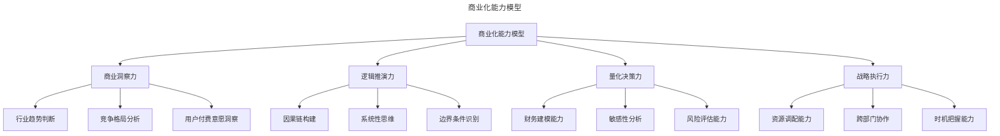
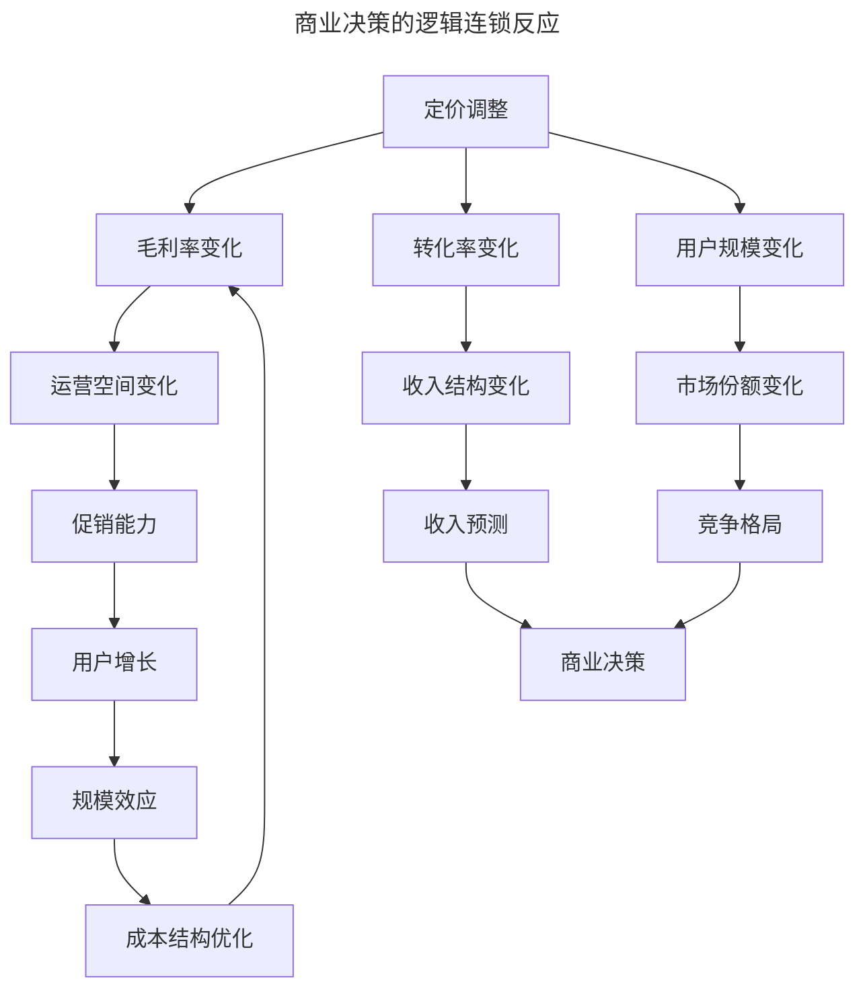
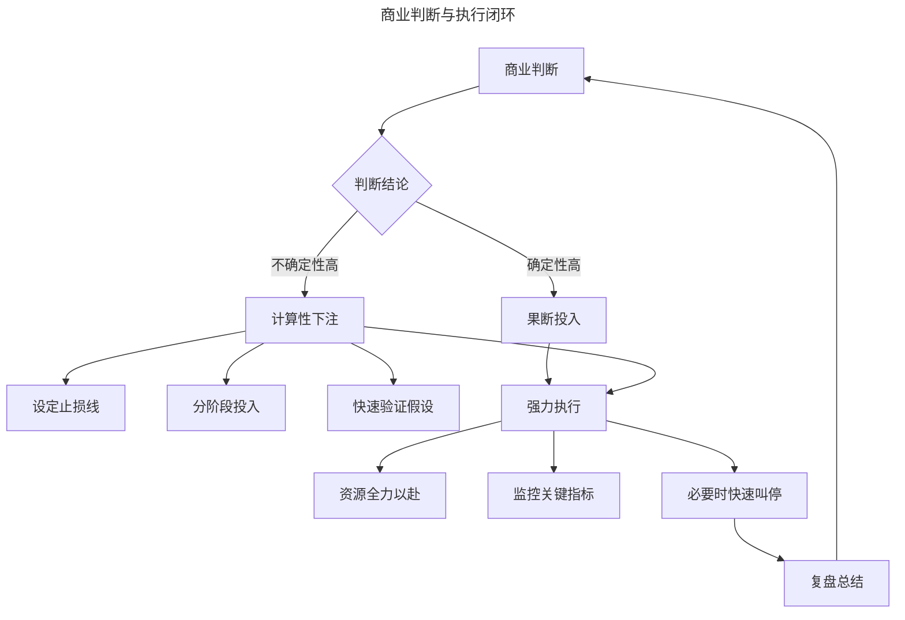
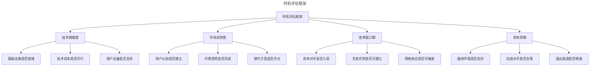
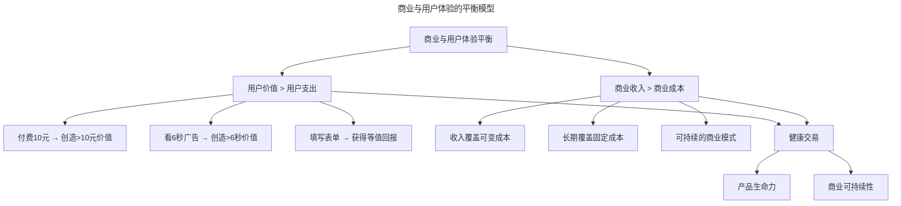
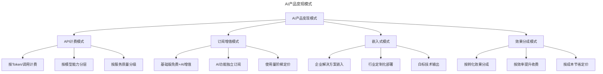

# 商业化能力的构建路径与思维框架

> **适用范围**：商业产品经理、产品负责人、创业者、需要构建商业化能力的从业者。适用于商业心智模型、变现设计、收入多元化、平台经济学、AI 产品变现等场景。
>
> **更新摘要（v2 · 2026-08 更新）**：
> - 结构化升级为 6 节骨架（导言 / 核心方法论 / 关键流程 / 工具与实战 / 常见误区 / 进阶延展）
> - 保留商业化能力模型、逻辑计算、判断力、时机把握、商业体验平衡、AI 变现、数据商业化、平台经济学、成长路径
> - 保留全部 Mermaid 图并补充 `--- title: ... ---` frontmatter，每张图后追加文字解读

---

## 1. 导言

本文系统阐述产品经理商业化能力的构建路径与思维框架，涵盖商业心智模型（Commercial Mindset）、变现设计方法论（Monetization Design）、收入多元化策略（Revenue Diversification）与平台经济学（Platform Economics）核心原理。结合 2024-2026 年 AI 产品变现（AI Product Monetization）、数据资产商业化（Data Monetization）与产品驱动增长（PLG）的最新实践，为资深产品经理提供从商业认知到执行能力的系统性成长路径。

### 1.1 商业化能力的定义

商业化能力是指产品经理将产品价值转化为可持续商业回报的系统性能力，涵盖商业洞察、逻辑推演、量化决策与战略执行四个维度。与用户产品经理不同，商业产品经理的评价标准是明确而刚性的：**能否赚钱，能否持续赚钱**。

> **图解**：商业化能力模型——商业洞察力（行业趋势判断、竞争格局分析、用户付费意愿洞察）、逻辑推演力（因果链构建、系统性思维、边界条件识别）、量化决策力（财务建模、敏感性分析、风险评估）、战略执行力（资源调配、跨部门协作、时机把握）。

### 1.2 商业化能力的层级模型

| 能力层级 | 核心能力 | 典型表现 | 成长阶段 |
|---------|---------|---------|---------|
| L1 基础认知 | 理解商业基本概念 | 能计算LTV/CAC、理解成本结构 | 0-1年商业产品经验 |
| L2 分析推理 | 构建商业逻辑链条 | 能分析产品决策的商业影响 | 1-3年商业产品经验 |
| L3 策略设计 | 设计变现策略与定价 | 能制定系统性的商业化方案 | 3-5年商业产品经验 |
| L4 战略决策 | 在不确定性中做判断 | 能做出正确的商业方向选择 | 5-8年商业产品经验 |
| L5 系统构建 | 构建可持续的商业模式 | 能设计自我增强的商业系统 | 8年以上商业产品经验 |

### 1.3 商业产品经理与用户产品经理的能力差异

| 维度 | 用户产品经理 | 商业产品经理 |
|------|------------|------------|
| 核心目标 | 用户满意度与体验优化 | 收入增长与利润最大化 |
| 评价标准 | DAU、留存率、NPS | MRR/ARR、毛利率、NRR |
| 决策逻辑 | 用户需求驱动 | 商业逻辑驱动 |
| 思维模式 | 同理心与体验思维 | 经济学与分析思维 |
| 风险偏好 | 体验风险规避 | 商业风险计算性承担 |
| 关键能力 | 需求洞察、交互设计 | 定价策略、收益管理 |

---

## 2. 核心方法论

### 2.1 逻辑与计算：商业化能力的基石

商业产品经理最核心的能力是**逻辑推理**：理解每个决策的来龙去脉，识别变量间的因果关系，预测可能的连锁反应。商业概念之间存在复杂的相互关联，而非孤立存在：

> **图解**：商业决策的逻辑连锁反应——定价调整引发毛利率、转化率、用户规模的连锁变化，最终形成"规模效应→成本结构优化→毛利率"的反馈循环。逻辑推理的核心要求：每个决策必须能追溯其逻辑链；每个结论必须有前提假设支撑；每个预测必须可验证与证伪；每个变量变化必须分析其连锁效应。

**量化计算的肌肉记忆**——商业化能力的第二根基柱是**量化计算**能力，且需达到"肌肉记忆"的程度。降价促销的量化分析：降价后的销量增量必须可计算，不能以"薄利多销"笼统概括。**降价后利润 = (原价 × (1-折扣率) - 可变成本) × 原销量 × (1 + 销量增长率)**。ROI 的计算与验证：每项投入必须有预期 ROI，实际 ROI 必须可追踪与验证。

| 计算场景 | 关键公式 | 常见错误 | 正确方法 |
|---------|---------|---------|---------|
| 降价促销 | 利润=新毛利x新销量 | 忽略销量增长的非线性 | 基于弹性系数预估销量 |
| 获客投放 | ROI=LTV/CAC | 用收入替代毛利计算 | 用毛利计算真实回报 |
| 功能投资 | 投入产出比=增量收入/开发成本 | 低估开发成本 | 全成本核算 |
| 渠道选择 | 渠道效率=付费用户LTV/渠道CAC | 忽略用户质量差异 | 按渠道队列追踪LTV |

**商业决策的量化框架**：**决策值 = Σ(P_i × V_i) - C**，其中 P_i 为第 i 种结果的概率，V_i 为该结果的价值，C 为决策成本。决策树分析方法：列出所有可能的决策路径→为每条路径估算概率与价值→计算期望值并选择最优路径→敏感性分析验证结论稳健性。

### 2.2 不确定性与判断力

商业决策中，部分结论可通过逻辑推演获得确定性，另一部分则建立在不确定性之上：

| 决策类型 | 特征 | 方法论 | 典型案例 |
|---------|------|--------|---------|
| 确定性决策 | 因果关系明确 | 逻辑推理+计算 | 降价对毛利的影响 |
| 风险性决策 | 结果分布已知 | 概率分析+期望值 | 不同渠道的获客效果 |
| 不确定性决策 | 结果分布未知 | 判断力+情景分析 | 新市场的进入时机 |

**判断力的构成要素**：行业认知（对行业趋势的深刻理解）；模式识别（从历史案例中提取规律）；信息整合（从碎片信息中构建全景图）；直觉经验（长期积累的隐性知识）。提升判断力的方法：深度行业研究、案例复盘、信息网络、快速验证。

**下注与执行意志**：

> **图解**：商业判断与执行闭环——判断结论后，确定性高则果断投入，不确定性高则计算性下注（设定止损线、分阶段投入、快速验证假设），最终都强力执行（资源全力以赴、监控关键指标、必要时快速叫停）→复盘总结→回到商业判断。核心原则：**战略谨慎与战术凶狠**——战略层面深入思考充分论证，战术层面果断执行全力以赴；失败只能输给运气或判断，不能输给执行。止损机制：每次下注前设定止损条件，达到止损线必须立即叫停，不被沉没成本牵绊。

---

## 3. 关键流程

### 3.1 时机把握的战略意义

在商业产品领域，**"何时做"往往比"做什么"更重要**。时机是产品存亡的关键因素。

> **图解**：时机评估框架——从技术就绪度（基础设施/技术成本/用户设备）、市场成熟度（用户认知/付费意愿/替代方案）、竞争窗口期（竞争对手/先发优势/网络效应）、资本周期（融资环境/估值水平/退出渠道）四个维度综合评估时机。**时机评分 = w1×技术就绪度 + w2×市场成熟度 + w3×竞争窗口 + w4×资本周期**。

**时机判断的历史案例**：

| 产品/模式 | 错误时机 | 正确时机 | 关键变量 |
|----------|---------|---------|---------|
| 视频直播 | 2G时代（带宽不足） | 3G/4G时代（带宽充足） | 网络基础设施 |
| 移动出行 | 无移动支付时代 | 移动支付普及后 | 支付基础设施 |
| SaaS企业服务 | 企业IT自建时代 | 云计算普及后 | 云基础设施与认知 |
| AI应用 | 算力成本高昂期 | 算力成本下降后 | 算力成本与模型能力 |
| 数据产品 | 隐私法规缺失期 | 合规框架建立后 | 法律法规与数据资产 |

### 3.2 商业与用户体验的平衡艺术

商业与用户体验并非对立关系，其平衡的核心原则是**建立健康的交易**。从经济学角度，交易成立的条件是买卖双方均认为自己的收获大于支出：**用户价值 > 用户支出 且 商业收入 > 商业成本**。

> **图解**：商业与用户体验的平衡模型——只有当用户价值 > 用户支出且商业收入 > 商业成本同时满足时，才能形成健康交易，进而带来产品生命力与商业可持续性。

**商业化设计的价值对齐**：

| 商业化手段 | 用户支出 | 价值对齐要求 | 设计原则 |
|-----------|---------|-------------|---------|
| 付费订阅 | 金钱 | 功能价值 > 订阅价格 | 功能与价格分层设计 |
| 广告展示 | 注意力/时间 | 内容价值 > 广告时间 | 广告频控、质量审核 |
| 数据授权 | 隐私 | 服务价值 > 隐私损失 | 最小必要、用户可控 |
| 功能解锁 | 金钱 | 解锁功能 > 付费金额 | 免费功能满足基础需求 |
| 社交裂变 | 社交资本 | 奖励价值 > 社交成本 | 自然分享、非强制 |

**商业化节奏的设计**——渐进式商业化路径：价值积累期（专注产品体验，商业化 0%）→价值验证期（小范围测试付费意愿，5-10%）→商业化建设期（系统构建变现机制，15-30%）→收入增长期（规模化变现，30-60%）→生态扩展期（多元化收入，60%+）。

---

## 4. 工具与实战

### 4.1 2024-2026 年商业化新范式

**AI 产品的变现路径**——AI 产品的商业化呈现独特的挑战与机遇，其成本结构特征为高固定成本（训练成本）+ 低边际成本（推理成本）。

> **图解**：AI 产品变现模式——API 计费（按 Token/调用计费、按模型能力分层、按服务质量分级）、订阅增值（基础版免费+AI 增值、AI 功能独立订阅、使用量阶梯定价）、嵌入式（企业解决方案嵌入、行业定制化部署、白标技术输出）、效果分成（按转化效果分成、按效率提升收费、按成本节省定价）。

| 变现模式 | 定价逻辑 | 适用场景 | 代表产品 | 2024-2026趋势 |
|---------|---------|---------|---------|-------------|
| API计费 | 按使用量 | 开发者服务 | OpenAI、Claude | Token价格持续下降 |
| 订阅增值 | 按功能等级 | 终端用户 | ChatGPT Plus、Copilot | AI功能成为标准增值项 |
| 嵌入式 | 按席位/规模 | 企业服务 | Salesforce Einstein | AI成为企业软件标配 |
| 效果分成 | 按业务结果 | 营销/销售 | AI广告优化 | 向可归因效果演进 |

**数据资产的商业化**——数据作为新型生产要素，其商业化路径日益清晰：L1 数据赋能（数据提升产品价值，间接变现）→L2 数据产品（数据加工为产品，直接变现）→L3 数据交换（合规数据流通，生态变现）→L4 数据资产（数据估值与融资，资本变现）。数据商业化的合规框架：数据收集（最小必要原则、用户知情同意）、数据使用（目的限制、脱敏处理）、数据流通（合规评估、安全计算）、数据跨境（本地化要求、安全评估）。

**平台经济学与生态变现**——平台经济学（Platform Economics）为商业化提供核心理论框架。平台的核心机制：双边/多边网络效应、交叉补贴策略、生态治理与价值分配。

| 平台类型 | 核心网络效应 | 变现方式 | 生态治理挑战 |
|---------|------------|---------|------------|
| 交易平台 | 双边交易网络 | 佣金+广告 | 供需平衡、质量管控 |
| 社交平台 | 用户社交网络 | 广告+增值 | 内容治理、隐私保护 |
| 内容平台 | 创作者-消费者 | 广告+订阅+打赏 | 内容质量、版权保护 |
| 开发者平台 | 开发者-用户 | API收费+分发 | 生态健康、安全合规 |
| AI平台 | 模型-应用 | API+推理服务 | 模型安全、成本控制 |

### 4.2 商业化能力的成长路径

**能力构建的系统方法**——知识积累（财务基础、经济学原理、行业研究）+ 实践锻炼（分析他人产品、与商业负责人交流、在自己的产品中实践）+ 反思提炼（数据追踪与复盘、建立决策日志、定期自我审视）→ 商业直觉 → 肌肉记忆级商业意识。

**商业意识的培养方法**：

| 培养方法 | 投入时间 | 学习深度 | 适用阶段 | 效果 |
|---------|---------|---------|---------|------|
| 逆向分析 | 每周2-3小时 | 中 | 任何阶段 | 拓宽视野 |
| 深度对话 | 每月1-2次 | 高 | 有一定基础后 | 深化理解 |
| 实践验证 | 持续投入 | 极高 | 有产品主导权后 | 形成肌肉记忆 |

**从商业意识到商业能力的跨越**：意识觉醒（从功能思维到商业思维）→逻辑构建（从感性判断到理性分析）→策略设计（从分析问题到设计方案）→决策执行（从方案到结果）→系统构建（从单点突破到系统设计）。

### 4.3 实战要点

| 要点 | 说明 | 适用场景 |
|------|------|----------|
| 逻辑推理 | 每个决策能追溯逻辑链，分析连锁效应 | 所有商业决策 |
| 量化计算 | 降价促销、ROI、决策树分析 | 商业决策 |
| 判断力 | 行业认知、模式识别、信息整合、直觉经验 | 不确定性决策 |
| 计算性下注 | 设定止损线、分阶段投入、快速验证 | 高风险决策 |
| 时机把握 | 技术就绪度/市场成熟度/竞争窗口/资本周期 | 新产品进入 |
| 健康交易 | 用户价值>用户支出 且 商业收入>商业成本 | 商业化设计 |
| 渐进式商业化 | 价值积累→验证→建设→增长→生态扩展 | 商业化节奏 |
| AI变现模式 | API/订阅/嵌入式/效果分成 | AI产品商业化 |
| 数据商业化 | 数据赋能/产品/交换/资产四层级 | 数据资产变现 |
| 平台经济学 | 网络效应、交叉补贴、生态治理 | 平台型产品 |

---

## 5. 常见误区

| 误区 | 表现 | 正确做法 |
|------|------|----------|
| **笼统概括"薄利多销"** | 不量化降价后的销量增量 | 用弹性系数预估销量，计算盈亏平衡点 |
| **用收入替代毛利** | 获客 ROI 用收入计算 | 用毛利计算真实回报 |
| **忽视时机** | 只关注"做什么"忽略"何时做" | 用时机评分框架评估 |
| **破坏健康交易** | 商业收入>商业成本但用户价值<用户支出 | 确保用户价值>用户支出 |
| **过早商业化** | 价值积累期就大规模变现 | 用渐进式商业化路径 |
| **忽视止损** | 被沉没成本牵绊 | 设定止损线，达到立即叫停 |

---

## 6. 进阶延展

### 6.1 总结

本文系统阐述了商业化能力的构建路径与思维框架，从逻辑计算到判断执行，从时机把握到商业平衡，为产品经理提供了从商业认知到执行能力的系统性成长方法论。

核心要点回顾：逻辑与计算是基石（每个决策必须有逻辑支撑与量化计算）；判断力是差异化能力（在不确定性中做出正确判断）；时机是关键变量（"何时做"往往比"做什么"更重要）；健康交易是平衡核心（用户价值必须大于用户支出）；持续学习是成长路径（通过分析、对话、实践三重循环提升）。

未来商业化能力的关键趋势：AI 原生商业化（AI 能力本身成为核心变现产品）；数据驱动决策（从经验判断到数据驱动的商业决策）；平台生态变现（从产品变现到生态变现）；合规商业化（在监管框架下设计可持续的商业模式）；自动化收益管理（AI 驱动的实时定价与收益优化）。

### 6.2 参考文献

- Christensen, C. M., & Raynor, M. E. (2003). *The innovator's solution*. Harvard Business Review Press.
- Parker, G. G., Van Alstyne, M. W., & Choudary, S. P. (2016). *Platform revolution*. W. W. Norton & Company.
- Kahneman, D. (2011). *Thinking, fast and slow*. Farrar, Straus and Giroux.
- McGrath, R. G. (2019). *Seeing around corners*. Houghton Mifflin Harcourt.
- Thiel, P. (2014). *Zero to one*. Crown Business.
- Zuboff, S. (2019). *The age of surveillance capitalism*. PublicAffairs.
