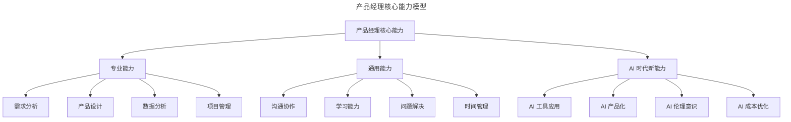
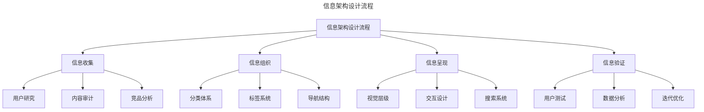
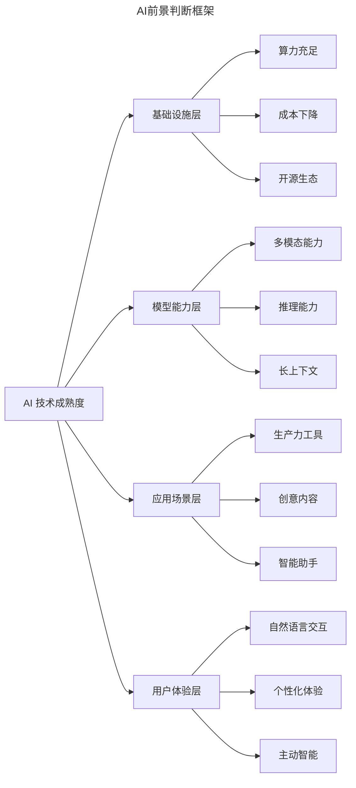
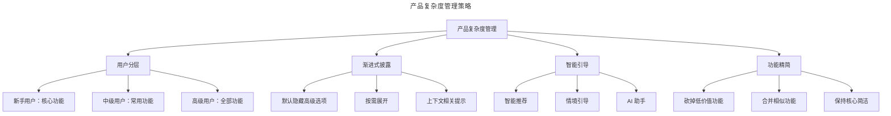

# 35 | 答疑时间：关于产品经理的 12 个问题

> **适用范围**：产品经理（各阶段）、求职者、希望提升产品能力的从业者。适用于职业发展、交互设计边界、时间管理、信息架构、AI 前景判断、需求变更沟通等场景。
>
> **更新摘要（v2 · 2026-08 更新）**：
> - 结构化升级为 6 节骨架（导言 / 核心方法论 / 关键流程 / 工具与实战 / 常见误区 / 进阶延展）
> - 保留 12 个问答的基础/进阶/高层三层视角，更新至大模型时代
> - 保留全部 Mermaid 图并补充 `--- title: ... ---` frontmatter，每张图后追加文字解读

---

## 1. 导言

自从开设了这些内容，我陆陆续续收到了不少留言，今天就挑出来一些有代表性的问题，集中解答一下。本篇集中回答读者关于产品经理职业发展的 12 个核心问题，涵盖 AI 背景求职、交互设计边界、时间管理、信息架构、核心路径设计、AI 前景判断、新人素质要求等。2026 年更新版重点补充了大模型时代对产品经理角色的颠覆性影响、AI 原生产品的设计方法论、以及 AR/VR 生态（Apple Vision Pro 发布后）的最新判断。

> **图解**：产品经理核心能力模型——专业能力（需求分析、产品设计、数据分析、项目管理）、通用能力（沟通协作、学习能力、问题解决、时间管理）、AI 时代新能力（AI 工具应用、AI 产品化、AI 伦理意识、AI 成本优化）。传统能力是基础，AI 时代新能力成为差异化竞争的关键。

---

## 2. 核心方法论

### 2.1 问题 1：AI 背景同学如何展示优势？

**基础层**：在面试中展现 AI 优势的办法有三种，效果依次递减：在人工智能方面有过产品成果（"做成过事情"，用实际数据和成果说话最有力，如"Guido 的简历上就三个词 I wrote Python"）；没有亲自做成过事情但看过别人做过或学习过资料（结合用人岗位的实际需求，描述 AI 可以跟业务结合的机会和方式，等于向面试官做一个人工智能结合对方业务的产品方案提案）；自己没有产品成果也不了解公司业务（只能干讲学过的资料和感悟，缺乏感染力）。

**进阶层**：即便没有操盘过真实产品，至少应该有自己做过的实验性项目——尽量不要是课程作业或教科书样例程序。2026 年更新案例：用大模型 API 构建智能客服助手、用 RAG 技术搭建知识库问答系统、用 Agent 框架实现自动化工作流。这些项目直接展示了你理解 AI 产品化的核心挑战——Prompt 设计、上下文管理、幻觉控制、成本优化等。

**高阶层**：2026 年，大模型时代"AI 背景"的含义已发生根本性变化。2018 年的 AI 背景可能意味着懂机器学习算法、会写 TensorFlow/PyTorch 代码；2026 年的 AI 背景更强调：AI 产品化能力（能否将大模型能力转化为用户价值？）、AI 评估能力（能否建立 AI 产品的评估体系？）、AI 成本意识（能否在效果与成本之间找到平衡？）、AI 伦理意识（能否识别和规避 AI 产品的风险？）。这些是最稀缺的 AI 产品经理能力。

### 2.2 问题 2：交互设计与原型设计的边界

**基础层**：交互设计师跟产品经理的工作边界。作为产品经理，用用例文档描述用户与系统的交互流程（如"系统展示商品→用户浏览→用户挑选并向系统请求购买→系统校验库存并生成订单"），但并不描述系统怎么展示、怎么交互。然后与交互设计师交流流程背后的动机和商业背景，基于交流交互设计师做出更完整的交互稿。

**进阶层**：2026 年工具更新，主流交互设计工具已从 Axure、Sketch 演进为 Figma、ProtoPie、Principle 等。Figma 的实时协作让产品经理和设计师可以在同一文件中并行工作，边界变得更加模糊。协作模式演进：传统模式（PM 写 PRD→交互出交互稿→UI 出视觉稿→开发实现）→现代模式（PM 与设计师共同在 Figma 中探索）→AI 辅助模式（用 v0.dev、Galileo AI 快速生成原型）。

**高阶层**：AI 原生产品的交互设计新挑战——传统的"页面跳转、布局、控件状态"框架面临挑战：对话式交互（如何设计多轮对话的交互逻辑？）；生成式内容（如何设计 AI 生成内容的呈现方式？）；渐进式披露（如何在简单与强大之间平衡？）。这要求产品经理和交互设计师建立更紧密的协作关系。

### 2.3 问题 3：时间管理与工作流

**基础层**：如果团队没有意识到需要留出时间，同时你也没有足够影响力去要出时间，那么就熬夜吧，至少保证"被发酵一觉的时间"。精力分配，可以试着用各种工具和方法，但事情多了还是会很慌乱。

**进阶层**：2026 年工具与方法更新——任务管理工具（Linear、Notion、飞书多维表格）；日历管理（Clockwise、Reclaim.ai 等 AI 驱动的日历工具，自动为深度工作预留时间块）；会议优化（Loom、飞书妙记等异步沟通工具）。**精力管理框架**：与其管理时间，不如管理精力，关注四个维度——体能精力（睡眠、运动、饮食）、情感精力（压力管理、人际关系）、思维精力（专注力、创造力）、意志精力（目标感、价值观）。

**高阶层**：2026 年 AI 辅助工作流——PRD 撰写（用 ChatGPT/Claude 辅助生成框架）；竞品分析（用 Perplexity 快速收集信息）；用户访谈（用 Otter.ai 自动转录并提取洞察）；数据分析（用自然语言查询数据）。**但要注意**：AI 是效率工具，不是思考替代品。"需求发酵"的核心是深度思考，这个过程无法被 AI 加速。建议把 AI 节省下来的时间投入到思考中，而不是做更多的事。

### 2.4 问题 8：为什么产品建议需要了解上下文？

**基础层**：陈升有一句歌词说"写歌的人断了魂啊，听歌的人最无情"，大概就是这个意思。建议分成两种：从用户角度出发不爽希望改，完全没问题，最后改不改取决于设计者的判断；从产品设计同行的角度去评价别人，在没有看到大盘数据细节、也不知道别人的战略判断的情况下，就不好给出评价或意见。

**进阶层**：产品决策是一个系统工程，任何"小建议"都可能牵一发而动全身——战略层面（是否符合产品定位？）、资源层面（投入产出比如何？）、技术层面（技术成本如何？）、用户层面（对哪些用户有利？）。案例：微信的"已读回执"功能，很多用户希望微信像钉钉一样显示已读，但微信坚持不做——因为微信的产品定位是"生活方式"，而非"工作工具"，已读回执会带来社交压力，与"让沟通更轻松"的愿景相悖。

**高阶层**：AI 时代上下文更加复杂——AI 能力边界（在当前 AI 能力下是否可行？）、AI 不确定性（如何设计容错机制？）、AI 伦理风险（是否存在偏见、隐私、安全风险？）。建议在提产品建议时，先问自己三个问题：是否了解产品战略定位和目标用户？是否了解技术可行性和成本？是否考虑可能带来的负面影响？

---

## 3. 关键流程

### 3.1 问题 4：如何让团队真正做产品而非做项目？

**基础层**：最好的方法还是激发团队的凝聚力和好奇心。强扭的瓜不甜，抱怨也没有用，行动起来，能改善一点儿是一点儿。

**进阶层**：团队协作的核心原则——建立共同目标（让团队理解"为什么做"比"做什么"更重要）；创造参与感（在需求探索阶段就邀请开发、设计参与）；建立信任（承认不足，尊重专业判断）；庆祝小胜利（及时分享成功数据）。

**高阶层**：2026 年，AI 时代"做产品"与"做项目"的区别更加明显——做项目（完成需求文档、交付功能、验收通过）；做产品（持续优化用户体验、用数据驱动迭代、对业务结果负责）。AI 工具让"做项目"的效率大幅提升，但"做产品"的核心——用户洞察、价值判断、战略思考——仍需要人的深度参与。建议用 AI 把团队从"项目执行"中解放出来，把精力投入到"产品思考"中。

### 3.2 问题 5：信息架构与核心路径设计

**基础层**：（1）信息架构：注意辨别信息本来的架构，想办法弱化设计，让信息自己表达自己的逻辑关系（如文章标题又黑又大、作者小放下面、时间写成日期形式）。从用户的角度考虑信息架构，而非从供给的角度；符合用户的心智模型，而非我们自己的实现模型。（2）核心路径：设计之初要有假设（如电商典型路径是搜索→详情→购买），上线后看行为路径数据完善或纠正假设。

**进阶层**：

> **图解**：信息架构设计流程——信息收集（用户研究、内容审计、竞品分析）→信息组织（分类体系、标签系统、导航结构）→信息呈现（视觉层级、交互设计、搜索系统）→信息验证（用户测试、数据分析、迭代优化），形成闭环。核心原则是"让信息自己说话"，减少用户的认知负担。

核心路径分析方法：用户旅程地图（梳理用户完成目标的全流程）、漏斗分析（识别关键转化节点）、路径分析（发现用户的实际行为路径）、归因分析（理解不同触点对转化的贡献）。

**高阶层**：AI 原生产品的信息架构新挑战——动态信息架构（AI 生成内容动态，如何设计适应不确定内容的架构？）、对话式导航（用户通过自然语言交互，传统导航结构是否还有意义？）、个性化信息架构（如何平衡个性化与一致性？）。AI 可以帮助产品经理更高效地发现和优化核心路径（分析海量行为数据识别异常路径、路径模拟预测设计决策影响、个性化推荐为不同用户匹配最优路径）。

### 3.3 问题 6：AI 前景判断

**基础层**：火热和山谷是很正常的，有点像股价和公司价值之间的关系，不论短期怎么波动，整体的走势还是稳定的。AI 不同于 AR/VR，可以在现有计算平台和业务流程中部分地发挥作用，它并不是在解决新问题，而是在用新方法解决老问题（如手写识别过去能做，但有了深度学习，成本和门槛低了）。

**进阶层**：2026 年回顾——2018 年的回答在今天看来有对有错：对的部分（AI 确实在"用新方法解决老问题"，且已深入各行各业；AI 不需要业务结构性变化就能带来价值）；需要更新的部分（AR/VR 并非"为时过早"，2023 年 Apple Vision Pro 发布，空间计算生态逐步成熟；大模型带来的影响远超 2018 年的"深度学习"，不仅是技术升级，更是交互范式的革命）。

**高阶层**：

> **图解**：AI 前景判断框架——基础设施层（算力充足、成本下降、开源生态）、模型能力层（多模态、推理、长上下文）、应用场景层（生产力工具、创意内容、智能助手）、用户体验层（自然语言交互、个性化体验、主动智能）四层协同推动 AI 从"技术热点"变为"基础设施"。2026 年 AI 技术已跨越"炒作周期"的山谷，进入稳步爬升期。对产品经理的启示：AI 不再是"要不要用"的问题，而是"怎么用好"的问题；AI 产品经理已成为独立岗位；AI 伦理、安全、合规成为必要考量。

---

## 4. 工具与实战

### 4.1 其余关键问题

**问题 7：1-2 年产品经理最重要的素质**——最重要的是有没有做成事情的经历和气质，不论这个事情是什么。1-2 年产品经理能力模型：执行力（40%）、学习力（30%）、沟通力（20%）、主动性（10%）。2026 年视角补充：AI 工具应用能力、数据敏感度、用户同理心。

**问题 9：运营转产品，是否需要学 Python？**——做运营想转产品，建议三思，先成为一个优秀的运营，把本职工作做得很出色。关于学 Python：为了数据分析有价值但 SQL 可能更实用；为了"显得更技术"意义不大；为了理解 AI 工具原理了解基础即可。2026 年视角：AI 辅助数据分析降低 Python 门槛；AI 辅助文档撰写降低产品基本功门槛；运营与产品边界模糊。

**问题 10：如何面对产品功能复杂的问题？**

> **图解**：产品复杂度管理策略——用户分层（新手核心功能、中级常用功能、高级全部功能）、渐进式披露（默认隐藏高级选项、按需展开、上下文提示）、智能引导（智能推荐、情境引导、AI 助手）、功能精简（砍低价值、合并相似、保持核心简洁）。核心原则是"让新手轻松上手，让高级用户发挥全部能力"。AI 时代解决方案：AI 助手（自然语言询问操作指引）、智能推荐（预测需求主动推荐）、个性化界面（动态调整隐藏不常用功能）。

**问题 11：如何沟通需求变更？**——对方是什么世界的人，就用什么语言。需求变更沟通策略：领导要求（先理解动机，再讨论影响）；业务需求变化（用数据说话，评估优先级）；设计调整（聚焦用户体验，避免主观偏好）；技术问题（共同寻找替代方案）。需求变更管理的系统方法：建立变更流程、量化变更影响、设置变更窗口、建立需求冻结机制。

**问题 12：游戏设计对产品经理的启发**——游戏设计核心启发：目标与反馈（清晰目标+即时反馈）、渐进式难度（新手引导+逐步解锁）、社交元素（竞争与合作）、奖励机制（变比奖励+内在激励）、心流体验（挑战与能力平衡）。游戏化设计的伦理边界：正向游戏化（帮助养成好习惯）、灰色游戏化（利用人性弱点提升留存）、暗黑游戏化（故意设计让用户沉迷）。AI 时代的游戏化可以让它更个性化，但 AI 是否可以"算计"用户？产品经理需要守住底线。

### 4.2 实战要点

| 要点 | 说明 | 适用场景 |
|------|------|----------|
| 成果导向 | 面试时用实际成果说话，而非空谈理论 | 求职、晋升 |
| 上下文思维 | 提建议前先了解上下文，避免"指点江山" | 产品评审、咨询 |
| 精力管理 | 管理精力而非时间，保证深度思考的时间 | 日常工作 |
| 团队赋能 | 激发团队的好奇心和参与感，而非"胁迫" | 需求评审、团队协作 |
| 信息架构 | 让信息自己说话，符合用户心智模型 | 产品设计 |
| AI 工具 | 用 AI 提升效率，但不要让 AI 替代思考 | 日常工作 |
| 复杂度管理 | 用户分层 + 渐进披露 + 智能引导 | 产品迭代 |
| 变更沟通 | 用对方的语言沟通，量化变更影响 | 需求变更 |
| 游戏化伦理 | 游戏化可以提升参与度，但要守住伦理底线 | 用户增长 |

---

## 5. 常见误区

| 误区 | 表现 | 正确做法 |
|------|------|----------|
| **面试只讲理论** | 不展示实际成果和经验 | 用实际成果说话，准备"做成事情"案例 |
| **指点江山提建议** | 不了解上下文就评价产品 | 先了解战略定位、技术成本、负面影响 |
| **管理时间而非精力** | 只排日程不关注精力状态 | 管理体能/情感/思维/意志四维精力 |
| **AI 替代思考** | 用 AI 生成的方案不审视 | AI 是效率工具，深度思考无法被替代 |
| **功能越全越好** | 产品不断堆功能 | 用户分层+渐进披露+功能精简管理复杂度 |
| **游戏化无底线** | 用暗黑游戏化操纵用户 | 守住伦理底线，区分正向/灰色/暗黑 |

---

## 6. 进阶延展

### 6.1 总结

本篇通过 12 个问答，系统回答了产品经理职业发展的核心问题，涵盖 AI 背景求职、交互设计边界、时间管理、信息架构、核心路径设计、AI 前景判断、新人素质要求等。每个问题均按基础层/进阶层/高阶层提供差异化视角，既适合刚入门的产品经理建立认知，也适合资深产品经理深化理解。

2026 年更新版重点补充了大模型时代对产品经理角色的颠覆性影响——AI 产品化能力、AI 评估能力、AI 成本意识、AI 伦理意识成为最稀缺的产品经理能力；AI 工具应用成为效率提升的关键，但深度思考、用户洞察、价值判断仍是不可替代的核心能力。

### 6.2 延伸阅读

- 《启示录：打造用户喜爱的产品》（Marty Cagan）——产品经理必读经典
- 《俞军产品方法论》（俞军）——中国互联网产品方法论
- 《Web 信息架构》（Peter Morville）——信息架构设计经典
- 《游戏化思维》（Kevin Werbach）——游戏化设计的理论与应用
- 《精力管理》（Jim Loehr）——从时间管理到精力管理
- 极客时间专栏《AI 大模型产品实战》——AI 产品化方法论
