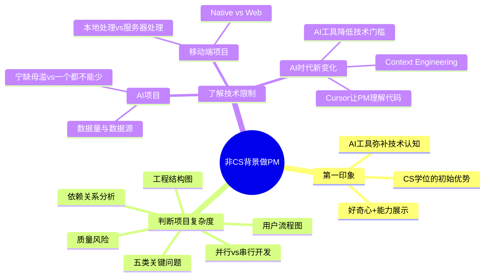
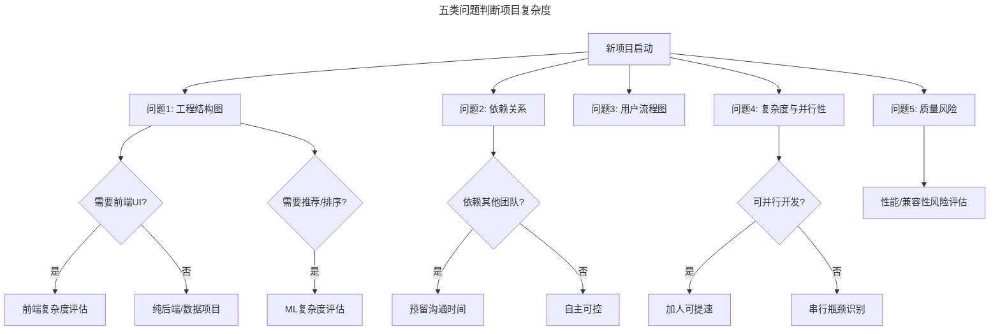

# 35 | 非计算机专业也能做产品经理？

> **适用范围**：非计算机背景的产品经理、求职者、需要理解技术判断力的从业者。适用于技术可信度建立、项目复杂度判断、技术限制理解、Context Engineering 等场景。
>
> **更新摘要（v2 · 2026-08 更新）**：
> - 结构化升级为 6 节骨架（导言 / 核心方法论 / 关键流程 / 工具与实战 / 常见误区 / 进阶延展）
> - 保留五类问题判断复杂度、Context Engineering、AI/移动端技术限制、方法论总结
> - 保留全部 Mermaid 图并补充 `--- title: ... ---` frontmatter，每张图后追加文字解读

---

## 1. 导言

硅谷很多公司几年前都要求产品经理必须要有计算机背景，谷歌甚至要求所有产品经理都要通过编程面试。近年来，以 Facebook 为首的公司开始允许各种背景的候选者面试产品经理职位。而硅谷一系列多元化运动让越来越多人意识到，产品经理需要多元化背景，才能了解百万甚至千万用户的需求，而不只是做一堆中看不中用的"黑科技"。但是，没有计算机专业背景，工程师会不会瞧不起我？我会不会不知道如何设计科技产品？我以前是做运营的，到底怎么转型？

> **图解**：非 CS 背景做 PM——第一印象（CS 学位的初始优势、好奇心+能力展示、AI 工具弥补技术认知）、判断项目复杂度（五类关键问题、工程结构图、依赖关系分析、用户流程图、并行 vs 串行开发、质量风险）、了解技术限制（AI 项目、移动端项目、AI 时代新变化）。

### 1.1 三层视角：技术理解力的个体-团队-组织维度

| 维度 | 核心问题 | 关键能力 |
|------|---------|---------|
| 个体层 | 如何快速建立技术可信度？ | 第一印象管理、好奇心驱动学习 |
| 团队层 | 如何与工程师高效沟通？ | 项目复杂度判断、技术限制理解 |
| 组织层 | 如何让多元背景成为产品优势？ | 用户洞察多样性、技术决策参与度 |

---

## 2. 核心方法论

### 2.1 给工程师的第一印象

计算机专业学位最明显的优势就是，工程师对你会有一个较好的第一印象。他们会默认你不好蒙骗，也知道你会理解他们的辛苦和难处——毕竟你自己也曾调试代码到半夜。但这也仅限于第一印象。之后你的想法是否靠谱，大家是否信任你，和计算机学位越来越没有关系。

**没有 CS 学位如何弥补？**——你只要在一开始保持好奇心，多问工程师问题，同时展示你自己的能力，完全可以弥补没有专业学位的短板。你没有必要过度纠结专业学位对第一印象的影响。

**AI 时代新变化：AI 工具降低技术门槛**——2025 年，AI 工具正在大幅降低非技术背景产品经理的入门门槛：Cursor 让 PM 理解代码（使用 Cursor 等 AI 编程助手，非 CS 背景的 PM 可以快速阅读和理解代码库）；AI 代码解释器（将代码片段粘贴给 ChatGPT 或 Claude，即可获得自然语言解释）；技术文档 AI 摘要（使用 AI 工具快速消化技术设计文档）。

### 2.2 判断项目复杂程度的能力

有计算机背景，可以更容易理解一个项目的复杂程度。比如，如果项目牵扯到更改之前的数据结构，即使看上去只是加一个按钮，工程难度也可能非常大。另外，可以更容易理解项目应该如何拆分——前端怎么拆分，后端怎么拆分；如果时间紧任务重需要多派人，也可以明白把人放到哪个部分可以加快速度。

**方法论：五类问题判断项目复杂度**

> **图解**：五类问题判断项目复杂度——问题 1 工程结构图（需要前端 UI？需要推荐/排序？）、问题 2 依赖关系（依赖其他团队？）、问题 3 用户流程图、问题 4 复杂度与并行性（可并行开发？）、问题 5 质量风险。

**问题 1：项目的工程结构图是什么样的？**——这个项目需要前端 UI 吗？需要后端吗？是移动端还是网页？是新添加的功能还是修改已有产品流程？需不需要推荐系统、排序（Ranking）？利用的是已经存在的用户数据，还是需要输入新的用户数据？

**问题 2：这个项目的所有用户体验都由我们自己的团队控制吗？**——还是需要利用其他组负责的部分？依赖的其他组的功能部分是已经做好了，还是正在开发阶段？如果我们修改了当前的用户体验，会不会影响已有功能，需不需要修改以前功能的代码？

**问题 3：这个项目一步步的用户流程图是什么样的？**——每一步需要提取什么样的用户数据？每一步和每一步之间有延时吗？

**问题 4：这个项目最复杂的部分是什么？最耗时间的部分又是什么？**——哪些部分可以平行开发（两个工程师可以同时开始，各做各的），哪些部分是要先完成后其他工程师才能开始做（多派工程师也不会提高生产效率）？

**问题 5：这个项目的产品质量会不会受影响？**——会不会需要花很长时间计算才能进行到下一步，会不会在网络条件不够理想的情况下无法操作？对所有的手机型号都适用吗？

**AI 时代新变化：Context Engineering**——2025 年，一个新兴概念正在改变 PM 理解技术的方式——**Context Engineering（上下文工程）**：为 AI 工具提供恰到好处的上下文信息，使其生成更准确的技术分析。这本身就是一种产品思维——理解用户（AI）需要什么信息才能做出好的判断。PM 的新优势：Context Engineering 的核心是"理解需要什么信息、以什么顺序提供"，这恰恰是产品经理的强项。非 CS 背景的 PM 在 Context Engineering 上可能比纯技术背景的人更有优势。

---

## 3. 关键流程

### 3.1 了解技术是否可实现，有什么限制

计算机专业出身，可以更了解某项技术到底能不能实现某个功能。比如，你可以利用人工智能技术设计一个模型来自动捕捉成人内容，原理是利用图像进行判断，所以很容易训练出这样的模型。但如果要用这个模型来捕捉政治内容，单靠模型可能就不够用了，需要设计一个产品工作流，把模型不确定的内容经由人工审核，确保准确度。

**AI 项目：两个关键问题**——**问题 1：宁缺毋滥还是一个都不能少？**

| 策略 | 含义 | 典型场景 |
|------|------|---------|
| 宁缺毋滥（High Precision） | 捕捉的内容必须符合设定条件，宁可少捕捉也不要误判 | 警察抓小偷需要证据，不能冤枉好人 |
| 一个都不能少（High Recall） | 不想错过任何满足条件的内容，即使不确定也不放过 | 过滤不适合广告商的视频，宁可多过滤也不漏过 |

宁缺毋滥还是一个都不能少，本质上是**产品决定**，需要产品经理和工程师弄清楚再行动。

**问题 2：我们的数据有多少？多少数据才能训练出准确的模型？数据来源又是什么？**

**移动端项目：两个关键问题**——**问题 1：信息图像处理是在移动设备上进行，还是先把内容发到服务器上再处理？** **问题 2：UI 必须是 Native 的吗（使用 Objective-C 或 Java 等语言），还是可以在网页端写代码然后在移动端显示网页？** 后者将大幅降低工程难度。

**AI 时代新变化：AI 工具让 PM 更懂技术**——2025 年，AI 工具正在让非技术背景的 PM 也能深入理解技术实现：Cursor 让 PM 理解代码（直接在 Cursor 中打开项目代码库，用自然语言提问"这个功能是怎么实现的"）；AI 架构分析（使用 AI 工具自动生成项目架构图、依赖关系图）；技术可行性快速评估（将产品需求描述给 AI，让其分析技术实现路径、潜在风险和替代方案）；Prompt Engineering → Context Engineering（从"如何写好提示词"进化到"如何为 AI 构建完整的上下文环境"）。

> **关键洞察**：AI 时代，"懂技术"的定义正在改变。从"能写代码"转向"能理解技术决策的 trade-off、能用 AI 工具快速获取技术洞察、能在技术讨论中提出正确的问题"。

---

## 4. 工具与实战

### 4.1 方法论总结：非 CS 背景 PM 的技术能力建设路径

| 阶段 | 目标 | 具体行动 |
|------|------|---------|
| 入门期（0-3月） | 建立技术可信度 | 多问问题，展示产品能力，用AI工具理解代码 |
| 成长期（3-6月） | 掌握复杂度判断 | 每个项目用五类问题框架分析，与工程师对齐认知 |
| 成熟期（6-12月） | 理解技术限制 | 深入AI项目和移动端项目的技术trade-off，参与技术决策 |
| 精通期（12月+） | 多元背景成为优势 | 将非技术视角转化为用户洞察，推动产品创新 |

### 4.2 实战要点

| 要点 | 说明 | 适用场景 |
|------|------|----------|
| 第一印象管理 | 保持好奇心，展示能力 | 加入新团队 |
| 五类问题框架 | 工程结构/依赖/流程/并行/质量 | 新项目启动 |
| 宁缺毋滥vs一个都不能少 | 明确AI模型的精度/召回策略 | AI项目 |
| 本地vs服务器处理 | 评估移动端处理方式 | 移动端项目 |
| Native vs Web | 评估UI实现方式 | 移动端项目 |
| Context Engineering | 为AI构建完整上下文环境 | AI工具使用 |
| AI理解代码 | 用Cursor等工具理解代码库 | 技术认知 |

---

## 5. 常见误区

| 误区 | 表现 | 正确做法 |
|------|------|----------|
| **过度纠结CS学位** | 认为没有学位就无法胜任 | 保持好奇心+展示能力可弥补 |
| **不懂项目复杂度** | 低估改数据结构的工程难度 | 用五类问题框架判断复杂度 |
| **不清楚精度/召回** | 不区分"宁缺毋滥"和"一个都不能少" | AI项目先明确产品决定 |
| **不懂移动端限制** | 不区分本地/服务器、Native/Web | 理解移动端技术限制 |
| **忽视Context Engineering** | 只会写Prompt不会构建上下文 | 用产品思维构建AI上下文环境 |

---

## 6. 进阶延展

### 6.1 术语表

| 术语 | 英文 | 释义 |
|------|------|------|
| 宁缺毋滥 | High Precision | AI模型优先保证准确性，宁可漏判也不误判 |
| 一个都不能少 | High Recall | AI模型优先保证覆盖率，宁可误判也不漏判 |
| Native开发 | Native Development | 使用平台原生语言开发移动应用 |
| 推荐系统 | Recommendation System | 根据用户行为和偏好自动推荐内容的算法系统 |
| 排序 | Ranking | 对搜索结果或内容流按相关性排序的算法 |
| Context Engineering | Context Engineering | 为AI工具构建精确上下文信息以获得更优输出的工程方法 |
| 并行开发 | Parallel Development | 多个工程师同时开发不同模块，互不阻塞 |
| 串行开发 | Sequential Development | 模块间存在依赖，必须按顺序开发 |

### 6.2 思考题

1. 如果你有计算机背景，还有哪些方面的计算机知识能够帮助你的工作？AI 工具的出现是否让某些 CS 知识变得不那么重要了？
2. 如果你没有计算机背景，在哪些方面仍感到吃力？Context Engineering 的思路能否帮你弥补？
3. 当 AI 工具可以让任何人"理解代码"时，CS 学位对产品经理的价值会发生什么变化？

### 6.3 延伸阅读

1. *Cracking the PM Interview* — Gayle Laakmann McDowell & Jackie Bavaro
2. *Building Products for the Enterprise* — Blair Reeves & Benjamin Gaines（面向企业软件的产品管理）
3. *Swipe to Unlock* — Parth Detroja 等（非技术背景理解科技行业核心概念）
4. Cursor Documentation — https://cursor.com（AI 编程助手）
5. *Designing Machine Learning Systems* — Chip Huyen（ML 系统设计，PM 视角）
