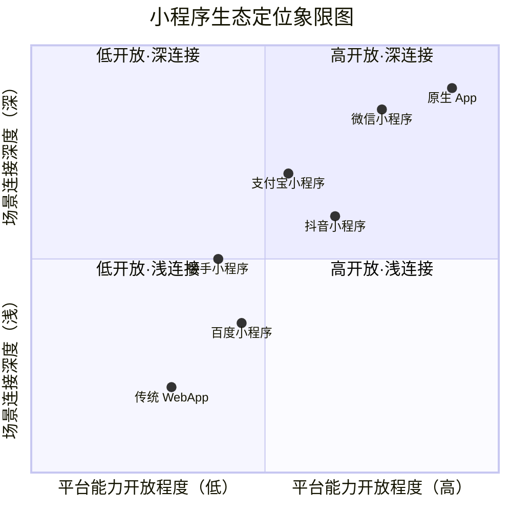
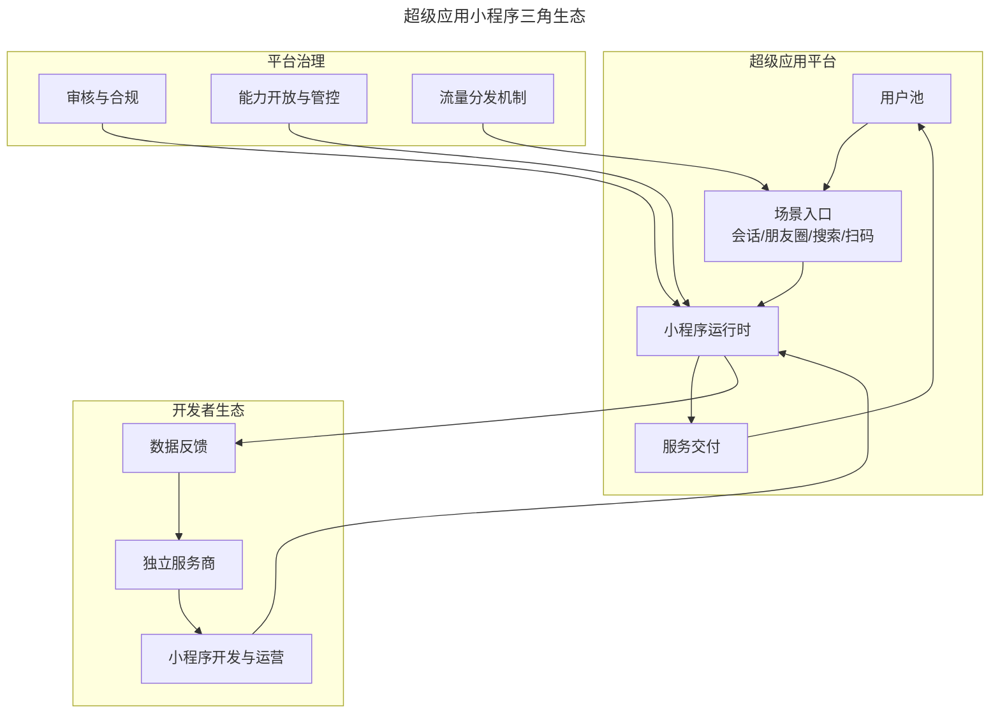
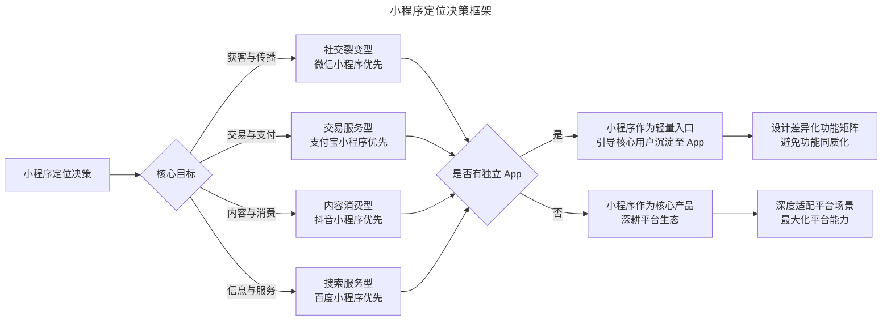

# 小程序生态的战略价值与产品定位

> **适用范围**：产品经理、小程序产品经理、创业者、需要做数字化触点布局的管理者。适用于小程序战略价值、生态分析、平台选择、产品定位、AI 小程序等场景。
>
> **更新摘要（v2 · 2026-08 更新）**：
> - 结构化升级为 6 节骨架（导言 / 核心方法论 / 关键流程 / 工具与实战 / 常见误区 / 进阶延展）
> - 保留生态定位地图、战略价值、关系链开放、体验与归属、AI 小程序、产品定位决策框架
> - 保留全部 Mermaid 图并补充 `--- title: ... ---` frontmatter，每张图后追加文字解读

---

## 1. 导言

小程序（Mini Program）自 2017 年微信正式上线以来，已从最初的技术实验演变为移动互联网的核心基础设施之一。截至 2024 年，微信小程序日活跃用户已超 4.5 亿（微信公开课 2024 口径），覆盖超过 200 个细分行业。与此同时，支付宝、抖音、百度、快手等平台纷纷构建各自的小程序生态，形成了"超级应用 + 小程序"的平台化竞争格局。

对于产品经理而言，理解小程序的战略价值与定位逻辑，不仅关乎单一产品的渠道选择，更涉及企业数字化触点布局的全局决策。

### 1.1 小程序生态的发展阶段

| 阶段 | 时间区间 | 核心特征 | 代表事件 |
|------|----------|----------|----------|
| 探索期 | 2017-2018 | 概念验证，开发者观望 | 微信小程序正式上线，"跳一跳"引爆关注 |
| 红利期 | 2018-2020 | 流量红利，裂变驱动 | 拼多多、趣头条等裂变玩法涌现 |
| 规范期 | 2020-2022 | 平台治理，生态成熟 | 微信收紧诱导分享政策，支付宝/抖音小程序崛起 |
| 深化期 | 2023-2026 | 价值回归，AI 融合 | AI 小程序出现，多平台统一开发框架成熟 |

### 1.2 生态定位地图

> **图解**：小程序生态定位象限图——横轴平台能力开放程度、纵轴场景连接深度。微信小程序凭借社交关系链的开放与场景连接的深度，占据"高开放·深连接"象限的核心位置。原生 App 在能力开放度与连接深度上均居首位，但获客成本与维护复杂度远高于小程序。传统 WebApp 因能力受限与场景断裂，处于"低开放·浅连接"象限。

---

## 2. 核心方法论

### 2.1 小程序的核心战略价值：实施成本优势

小程序的首要价值在于显著降低产品的实施与交付成本。

**（1）跨平台开发成本降低**——传统 App 开发需分别维护 iOS 与 Android 两套客户端代码，涉及平台适配、版本管理、应用商店审核等复杂流程。小程序通过统一的渲染层与 API 抽象，将跨平台差异压缩至近乎零。根据阿拉丁研究院（2024）的数据，同等功能需求下，小程序的开发周期约为原生 App 的 40%-60%，开发成本约为 30%-50%。值得注意的是，跨平台开发框架（如 React Native、Flutter）虽也试图解决多端一致性问题，但在业务复杂度增长后往往面临性能瓶颈与框架限制。Airbnb 于 2018 年放弃 React Native 的案例即说明了跨平台框架在成熟业务中的局限性。小程序则通过平台方统一管控运行时环境，规避了这一矛盾。

**（2）获客与试错成本降低**——小程序无需用户下载安装，显著降低了用户首次使用的心理门槛与行为成本。这使得产品团队能够以更低成本进行市场验证（Market Validation），快速试错并迭代方向。

### 2.2 超级应用平台战略

从平台经济学（Platform Economics）视角分析，小程序是超级应用（Super App）构建双边市场（Two-Sided Market）的核心机制：供给侧（超级应用通过小程序机制向第三方开发者开放用户触达渠道，丰富平台服务供给，提升用户留存与时长）；需求侧（用户在单一应用内获得多元化服务，降低跨应用切换成本，形成平台锁定效应 Lock-in Effect）。

> **图解**：超级应用小程序三角生态——超级应用平台（用户池→场景入口→小程序运行时→服务交付）、开发者生态（独立服务商→小程序开发与运营→数据反馈）、平台治理（审核与合规、能力开放与管控、流量分发机制）三者构成动态平衡的三角关系。开发者通过小程序接入平台场景获取流量与用户；平台通过治理机制确保生态健康；用户在这一体系中获得便捷的服务体验。

### 2.3 关系链开放：微信小程序的核心壁垒

各平台小程序的核心价值存在本质差异，这种差异并非技术特性层面的，而是生态底层逻辑的差异：

| 平台 | 核心价值来源 | 用户心智模型 | 典型场景 |
|------|-------------|-------------|----------|
| 微信 | 社交关系链（Social Graph） | 社交沟通 | 会话分享、群裂变、朋友圈传播 |
| 支付宝 | 信用体系与支付管道 | 金融交易 | 生活缴费、信用租赁、政务服务 |
| 抖音 | 内容分发与兴趣推荐 | 娱乐消费 | 短视频挂载、直播带货、内容互动 |
| 百度 | 搜索分发与信息连接 | 信息获取 | 搜索结果直达、智能问答 |
| 快手 | 社区信任与私域运营 | 社交电商 | 直播间小程序、粉丝社群 |

微信小程序的核心壁垒在于其对社交关系链的间接开放。微信中每个用户同时处于多个社交圈层（如职场群、家庭群、同学群），形成"关系折叠"现象——同一个人在不同群组中呈现不同的社交身份。这种折叠使得信息能够通过单一节点跨圈层传播，实现从一线城市到下沉市场的穿透式触达。

### 2.4 体验与归属：小程序与 WebApp 的本质差异

从技术实现看，小程序仍基于 WebView 渲染，但其在用户体验（UX）与用户归属感知（Ownership Perception）两个维度上与 WebApp 存在本质差异。

**（1）体验维度**——小程序在 Native App 与 WebApp 之间取得了平衡：一方面保留了 WebApp 的跨平台灵活性，另一方面通过微信提供的原生能力（如摄像头、定位、支付等）与统一的 UI 规范，大幅提升了体验一致性。

**（2）归属维度**——WebApp 时代，产品团队倾向于将微信内的用户"抢夺"至自有体系（引导注册、下载 App、关注公众号）。而小程序体系中，微信对引流行为的严格限制迫使开发者接受"用户属于微信"的前提，转而以服务而非占有的逻辑运营用户。这一归属感的转变客观上降低了用户使用门槛。

| 维度 | WebApp | 小程序 |
|------|--------|--------|
| 渲染方式 | WebView | WebView + 原生组件混合 |
| 系统能力调用 | 受限（JS-SDK） | 丰富（微信原生 API） |
| 交互体验 | 页面加载刷新，交互割裂 | 接近原生体验，流程连贯 |
| 设计规范 | 自由但混乱 | 遵循平台规范，体验统一 |
| 用户归属感知 | 产品方所有，需登录注册 | 平台所有，授权即用 |
| 引流自由度 | 高（可引导下载/关注） | 低（平台严格限制） |
| 用户使用门槛 | 高（需登录/下载） | 低（授权即用） |

---

## 3. 关键流程

### 3.1 2024-2026：小程序生态的新趋势

**多平台统一开发**——随着支付宝、抖音、百度等平台小程序生态的成熟，多平台小程序统一开发成为行业刚需。Taro、uni-app 等框架已支持一次编写、多端发布，但各平台 API 差异与审核标准的分歧仍是主要挑战。2025 年，中国信通院推动的《小程序开发者服务能力要求》行业标准（YD/T 6174-2025）试图在接口规范层面建立共识，但落地进展有限。

**AI 小程序的崛起**——2024-2025 年，以大语言模型（LLM）为核心能力的 AI 小程序开始规模化出现。典型形态包括：智能对话类（基于 ChatGPT/文心一言等模型的对话助手小程序）；AI 创作类（AI 绘画、AI 写作、AI 视频生成等创作工具）；AI 增强服务类（在传统服务流程中嵌入 AI 能力，如智能客服、个性化推荐）。AI 小程序凭借"低门槛 + 高价值"的特性，成为增速最快的品类。但需注意，微信于 2025 年更新了《小程序内 AI 生成内容管理规范》，要求 AI 小程序必须标注生成内容来源并提供内容过滤机制，合规成本上升。

**苹果生态博弈持续**——苹果对小程序生态的警惕从未放松。从早期迫使"应用号"更名为"小程序"，到 iOS 端虚拟商品支付的限制，再到 2024 年欧盟《数字市场法》（DMA）压力下苹果开放第三方应用商店的连锁反应，苹果与超级应用之间的博弈仍在持续。2025 年，苹果进一步收紧了对小程序内购支付的管理，要求 iOS 端小程序内涉及数字内容消费必须接入 Apple Pay 或 IAP（In-App Purchase）。

**从流量运营到用户价值运营**——经历红利期的野蛮增长后，小程序生态正在回归用户价值本位。平台方持续加强治理，流量成本持续上升，单纯依赖裂变的增长模型已不可持续。头部小程序开始转向精细化运营，关注 LTV、留存率与服务满意度等长期指标。

---

## 4. 工具与实战

### 4.1 产品定位决策框架

> **图解**：小程序定位决策框架——根据核心目标匹配平台（获客与传播→微信小程序、交易与支付→支付宝、内容与消费→抖音、信息与服务→百度），再判断是否有独立 App（是则小程序作为轻量入口引导沉淀至 App、设计差异化功能矩阵；否则小程序作为核心产品深耕平台生态、深度适配平台场景）。

**关键决策要点**：平台选择（根据产品核心场景匹配平台价值源，而非简单选择用户量最大的平台）；功能定位（小程序不应是 App 的完整复刻，应聚焦碎片化、场景化的单一功能闭环）；生态策略（评估是否需要多平台布局，优先做好一个平台再做扩展）；长期价值（在流量红利消退的背景下，将用户价值而非短期增长作为核心衡量指标）。

### 4.2 实战要点

| 要点 | 说明 | 适用场景 |
|------|------|----------|
| 平台价值匹配 | 根据核心场景匹配平台价值源 | 平台选择 |
| 功能聚焦 | 小程序聚焦单一功能闭环，非App复刻 | 功能定位 |
| 多平台布局 | 优先做好一个平台再做扩展 | 生态策略 |
| 长期价值衡量 | 关注LTV/留存/满意度 | 用户价值运营 |
| AI小程序合规 | 标注生成内容来源，提供过滤机制 | AI小程序 |
| 归属感认知 | 接受"用户属于平台"，以服务运营 | 用户运营 |

---

## 5. 常见误区

| 误区 | 表现 | 正确做法 |
|------|------|----------|
| **只选用户量最大的平台** | 忽略平台价值源与产品场景匹配 | 根据核心场景匹配平台价值源 |
| **小程序=App复刻** | 完整复制App功能 | 聚焦碎片化、场景化的单一功能闭环 |
| **忽视归属感转变** | 仍按WebApp逻辑"抢夺"用户 | 接受"用户属于平台"，以服务运营 |
| **依赖裂变增长** | 流量红利消退后仍靠裂变 | 转向用户价值运营，关注LTV/留存 |
| **忽视AI合规** | AI小程序不标注内容来源 | 遵守平台AI生成内容管理规范 |

---

## 6. 进阶延展

### 6.1 结论

小程序的战略价值远不止于"开发成本低"这一表象。其核心价值在于：超级应用通过小程序机制向开发者开放了平台场景与核心能力（尤其是社交关系链），构建了新的用户触达与服务交付范式。对于产品经理而言，理解不同平台小程序生态的底层逻辑差异，基于产品核心场景进行精准的平台选择与功能定位，是在小程序生态中获得持续价值的关键。

随着 AI 能力的融入、多平台标准的逐步统一以及平台治理的持续深化，小程序生态正从流量驱动转向价值驱动。产品经理应以长期主义视角审视小程序定位，在平台规则边界内构建可持续的用户价值。

### 6.2 参考文献

- 阿拉丁研究院. (2024). *2024年小程序行业发展白皮书*. 阿拉丁.
- Lenz, N. (2018). *Sunsetting React Native*. Airbnb Engineering & Data Science.
- 微信开放平台. (2025). *2025微信小程序年度发展报告*. 腾讯.
- 中国信通院. (2025). *小程序开发者服务能力要求* (YD/T 6174-2025). 工业和信息化部.
- Parker, G. G., Van Alstyne, M. W., & Choudary, S. P. (2016). *Platform revolution*. W. W. Norton & Company.
- Rochet, J. C., & Tirole, J. (2003). Platform competition in two-sided markets. *Journal of the European Economic Association*, 1(4), 990-1029.
- European Parliament. (2022). *Regulation (EU) 2022/1925 on contestable and fair markets in the digital sector (Digital Markets Act)*.
