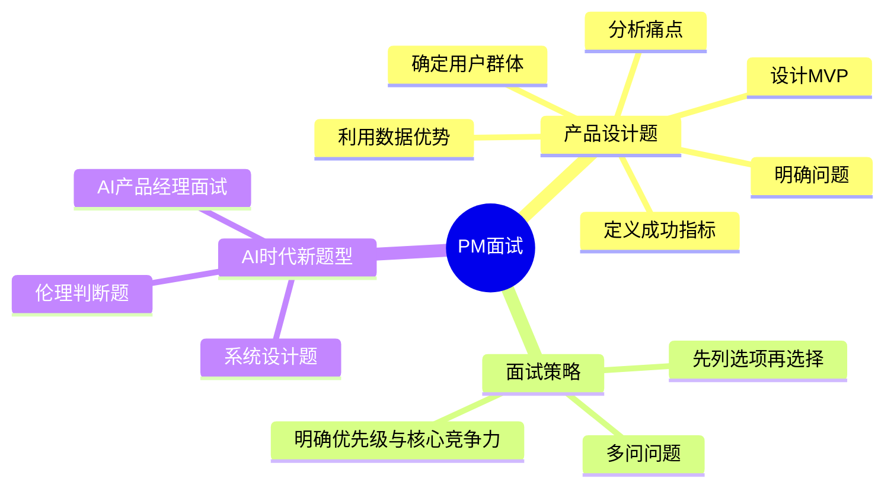
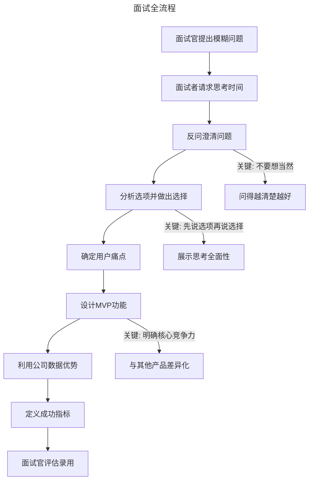

# 36 | 模拟一场硅谷的产品经理面试

> **适用范围**：产品经理（求职者、面试官）、需要提升面试能力的从业者。适用于产品设计题、面试策略、CIRCLES 框架、AI 时代新题型等场景。
>
> **更新摘要（v2 · 2026-08 更新）**：
> - 结构化升级为 6 节骨架（导言 / 核心方法论 / 关键流程 / 工具与实战 / 常见误区 / 进阶延展）
> - 保留面试全流程还原、三大要点、CIRCLES 框架、AI 时代新题型
> - 保留全部 Mermaid 图并补充 `--- title: ... ---` frontmatter，每张图后追加文字解读

---

## 1. 导言

作为专栏的最后一篇文章，我将为你模拟一场产品经理面试，增强你的面试能力，助你取得理想的 offer。我以产品感和分析能力的考察为例，边分享面试者和面试官的对话，边解释每部分要测试的能力。

> **图解**：PM 面试——产品设计题（明确问题、确定用户群体、分析痛点、设计 MVP、利用数据优势、定义成功指标）、面试策略（多问问题、先列选项再选择、明确优先级与核心竞争力）、AI 时代新题型（AI 产品经理面试、系统设计题、伦理判断题）。

### 1.1 三层视角：PM 面试的个体-团队-组织维度

| 维度 | 核心问题 | 面试考察点 |
|------|---------|-----------|
| 个体层 | 你能否独立思考并结构化表达？ | 逻辑分析能力、问题拆解能力 |
| 团队层 | 你能否在模糊信息中做出合理决策？ | 权衡取舍能力、优先级判断 |
| 组织层 | 你能否将产品与公司战略对齐？ | 战略思维、数据驱动决策 |

### 1.2 面试全流程还原

> **图解**：面试全流程——面试官提出模糊问题→请求思考时间→反问澄清→分析选项并选择→确定用户痛点→设计 MVP 功能→利用公司数据优势→定义成功指标→面试官评估录用。关键点：不要想当然问得越清楚越好、先说选项再说选择展示思考全面性、明确核心竞争力与其他产品差异化。

---

## 2. 核心方法论

### 2.1 对话 1：请求思考时间

**面试官：** 如果现在要设计一款帮助大家找房子的产品，你会怎么设计？

**面试者：** 嗯，让我想一下。能否给我几分钟捋清思路？

**面试官：** 没问题。

**要点**：不要害怕和面试官多要时间，也不要怕面试时需要现场思考，经过思考说出的内容比试图脱口而出的要好得多。

### 2.2 对话 2：反问澄清

**面试者：** 我想先问几个问题明确一下我们设计的目的，以及针对的用户。你说找房子，是什么概念，是买房子还是租房子？

**面试官：** 你是产品经理，你觉得呢？

**要点**：面试者的问题很好、很关键，但面试官提出这样模糊的问题也是有目的的——就是要考验面试者的思考能力。

### 2.3 对话 3：分析选项并做出选择

**面试者：** 首先，买房子这个部分我们已经有很多产品了，比如 Zillow、Redfin 等。其次，我们公司的优势是用户数据多，用户的活跃程度高，而买房子的交易频率太低了，不能充分发挥我们公司的优势。另外，现在房屋出租的产品比较少，而且租房要综合考虑房源和室友，室友的选择需要更多的是人与人的接触，而这恰恰是我们公司最擅长的。所以，我觉得还是租房子的产品比较适合我们。

**要点**：对话进行到这里，面试者的逻辑能力已经展现，面试官的眼睛亮起来了。面试者如果能事先想到两种方式——一种是从头搭建平台，一个是先和其他平台合作或爬取信息——然后再分析哪个方式更有道理，这样能更好地体现思考能力。

---

## 3. 关键流程

### 3.1 对话 4：痛点分析与 MVP 设计

**面试官：** 好的，那我们就来做租房子的产品。你接下来会怎么设计呢？

**面试者：** 我会先考虑用户的痛点有哪些。租房子的一般都是年轻人，他们还没有结婚，所以会考虑有几个室友，房源在什么位置，周围有哪些配套设施，交通是不是方便这些问题。所以，我们这款租房产品要解决的痛点是，能够搜索并筛选目标地域，查看具体的房源信息，包括房源图片以及房东和室友信息，还要添加配套设施、房源评价等功能。

**面试官：** 等等，你房源的信息是怎么来的？

**面试者：** 房源信息是用户提供的呀。

**面试官：** 也就是说这是一个包含房主和访客两方的平台，他们都要在我们的平台上发信息。现在已经有其他的平台上有房东和房源的信息了，我们为什么不直接拿来用呢？

**面试者：** 你说的有道理。但是，我的顾虑是，如果我们直接把其他平台的信息通过爬虫技术拿过来，那我们就只能通过邮件或者电话的形式实现房客和房东的联络了。但是，我们公司有自己的发消息产品，而房东和房客的联络应该是我们掌控的，以后我们可以根据这些信息做进一步的功能。

**面试官：** 好吧，但是这要求我们从头开始，冷启动时，我们要怎么解决没有足够的房客和房东的问题？

**面试者：** 我觉得，我们可以让运营团队先把房东信息带过来。其实，我们可以专门找一个人，通过其他平台的房东信息联系上房东，让他们也来注册我们平台的一个账号。他们只要输入最基本的电话或者邮箱就可以了，剩下的信息我们可以帮他们填充，减少他们的工作量，吸引他们完成注册。另外，我们应该一个城市一个城市地发布，而不要一开始就覆盖所有城市。

### 3.2 对话 5：MVP 优先级与数据利用

**面试者：** 我们刚才讲到了痛点，我觉得要是划分优先级的话，我会把搜索并筛选目标地域，查看房源信息，包括房源图片以及房东和室友信息作为最小化可行产品。之所以要加上房东和室友信息，是因为这些信息别的平台没有，我希望我们产品第一天发布就能给用户眼前一亮的感觉。

**面试官：** 我们通过公司其他产品提取了大量用户数据，怎么利用好这些资源？

**面试者：** 我觉得，我们可以在房东和房源信息这个板块下功夫，比如我们了解用户的喜好，所在地、学校信息，我们可以推荐同校的房客住在一起，我们也可以让房客找到房子后对房东以及房源进行实名评价。这些就是我们数据资源的独特优势。

**面试官：** 好了，时间不多了，有一点你还没告诉我，我们产品的成功指标是什么？

**面试者：** 我觉得，应该是多少房客给房东发了消息询问房源信息。

**面试官：** 为什么不是最后签合同的数量呢？

**面试者：** 我们平台最大的作用应该是高效帮助用户筛选靠谱的房源，让他们从几百个房源中筛选出五个，而不是从五个中选出一个。五选一，完全可以通过电话聊天来完成，那我们所做产品并没有本质性的变革，但是从几百个中选五个就不一样了，这个过程最繁琐，用户最不喜欢，而且难度最高，我们能把这个做好就很了不起了。

**要点**：产品的成功标准最好能在设计产品功能之前先说。但他的回答非常有道理，也反映出了很强的思考能力。

### 3.3 对话 6：面试官评估

**面试官：** 我觉得这个人我们应该录用。首先，他有很强的逻辑分析能力，能够精准确定用户群体，问的问题也能反映出他有很好的洞察能力。其次，他能够很好地权衡取舍，不仅能够选出最小化可行产品的功能，也能清晰地说出这些功能必须做的原因。最后，他对成功指标的定位很准确，能够清醒认识到我们的价值不在于选择最后一个，而是筛选出最合适的五个，目标明确，我们应该录取。

**招聘老板：** 好的，听你的。让 HR 跟进发 offer 吧。

---

## 4. 工具与实战

### 4.1 面试三大要点

| 要点 | 核心原则 | 面试中的体现 |
|------|---------|------------|
| 多问问题 | 不要想当然，问得越清楚越好 | 一上来就问清楚是买房还是租房 |
| 先列选项再选择 | 展示思考全面性，而非凭直觉决定 | 分析买房vs租房的利弊后再选择 |
| 明确优先级与核心竞争力 | 什么先做、什么后做、什么是差异化 | MVP功能选择+成功指标定义 |

### 4.2 AI 时代新变化：AI 产品经理面试新题型

2025 年，AI 产品的爆发催生了全新的 PM 面试题型。传统的设计题仍在，但新增了三类高频题型：

**新题型 1：AI 产品经理面试题**——典型问题："设计一个 AI 写作助手产品，你会怎么定义产品边界？"

| 考察维度 | 关键问题 | 评分要点 |
|---------|---------|---------|
| AI能力边界 | 什么该让AI做，什么该留给用户？ | 能否区分自动化与辅助的边界 |
| 人机协作设计 | 用户如何与AI交互？反馈机制是什么？ | 是否考虑了用户控制感和信任建立 |
| 数据策略 | 训练数据从哪来？如何持续优化？ | 是否理解数据飞轮效应 |
| 降级方案 | AI出错时怎么办？ | 是否设计了fallback机制 |

**新题型 2：系统设计题**——典型问题："设计一个推荐系统，如何平衡精准度和多样性？"这类题目考察 PM 对技术系统的理解深度，而非要求写代码：需求分析（推荐系统的业务目标是什么？）；指标设计（Precision/Recall/多样性/新颖性如何权衡？）；数据流设计（用户行为数据如何采集？实时还是批量处理？）；反馈闭环（用户反馈如何回流到模型优化？）。

**新题型 3：伦理判断题**——典型问题："你的 AI 产品被发现有偏见，你会怎么处理？"

| 场景 | 考察点 | 合格回答要素 |
|------|--------|------------|
| 算法偏见 | 伦理意识与行动力 | 承认问题→评估影响→制定修复计划→建立预防机制 |
| 隐私与个性化 | 用户权益与商业利益平衡 | 透明度原则→用户选择权→最小数据原则 |
| AI生成内容责任 | 平台责任边界 | 内容审核机制→用户举报→AI水印标识 |
| 自动化决策公平性 | 社会影响评估 | 算法审计→多元测试→人工复核机制 |

> **关键洞察**：AI 时代的 PM 面试，不再只考察"你能不能设计产品"，更要考察"你能不能负责任地设计 AI 产品"。伦理判断力和系统思维正在成为顶级 PM 的核心竞争力。

### 4.3 方法论总结：PM 面试的 CIRCLES 框架

| 步骤 | 英文 | 含义 | 面试中的应用 |
|------|------|------|------------|
| C | Comprehend | 理解问题 | 反问澄清，明确设计目标 |
| I | Identify | 识别用户 | 确定目标用户群体和场景 |
| R | Report | 报告痛点 | 列出用户核心痛点 |
| C | Cut | 精简优先级 | 选择MVP功能，明确核心竞争力 |
| L | List | 列出方案 | 提出多个解决方案并比较 |
| E | Evaluate | 评估权衡 | 分析各方案利弊，做出选择 |
| S | Summarize | 总结推荐方案 | 定义成功指标和衡量方式，收束陈词 |

### 4.4 实战要点

| 要点 | 说明 | 适用场景 |
|------|------|----------|
| 请求思考时间 | 不要怕现场思考 | 所有面试题 |
| 反问澄清 | 不要想当然，问得越清楚越好 | 模糊产品题 |
| 先列选项再选择 | 展示思考全面性 | 方案选择 |
| 明确核心竞争力 | 与竞品差异化 | MVP设计 |
| 数据优势利用 | 发挥公司数据资源 | 产品设计 |
| 成功指标前置 | 尽早定义成功标准 | 产品设计 |
| CIRCLES框架 | 结构化回答产品设计题 | 产品设计题 |
| AI伦理判断 | 负责任地设计AI产品 | AI时代新题型 |

---

## 5. 常见误区

| 误区 | 表现 | 正确做法 |
|------|------|----------|
| **脱口而出** | 不思考就回答 | 请求思考时间，经过思考再回答 |
| **想当然** | 不问清楚就设计 | 多问问题，明确设计目的和用户 |
| **凭直觉选方案** | 不分析选项直接选择 | 先说选项再说选择，展示思考全面性 |
| **忽略核心竞争力** | MVP功能与竞品同质化 | 明确核心竞争力，差异化设计 |
| **成功指标后置** | 设计完功能才想指标 | 成功标准最好在设计功能前先说 |
| **忽视AI伦理** | 不考察负责任地设计AI产品 | 伦理判断力成为核心竞争力 |

---

## 6. 进阶延展

### 6.1 术语表

| 术语 | 英文 | 释义 |
|------|------|------|
| MVP | Minimum Viable Product | 最小化可行产品，用最少功能验证产品假设 |
| 冷启动 | Cold Start | 平台型产品初期缺乏用户和内容的状态 |
| 成功指标 | Success Metric | 衡量产品是否达成目标的关键量化指标 |
| CIRCLES框架 | CIRCLES Framework | PM面试中产品设计题的结构化回答框架 |
| 数据飞轮 | Data Flywheel | 数据越多→产品越好→用户越多→数据更多的正向循环 |
| Fallback机制 | Fallback Mechanism | AI系统出错时的降级处理方案 |
| 算法审计 | Algorithm Audit | 对AI系统进行系统性检查，评估偏见和公平性 |
| AI水印 | AI Watermark | 嵌入AI生成内容中的可识别标记 |

### 6.2 思考题

1. 如果你是面试者，针对上面面试者的回答，你觉得可以在哪些方面做得更好？
2. 如果面试官问你"设计一个 AI 写作助手"，你会如何用 CIRCLES 框架组织回答？
3. 当 AI 产品出现偏见时，产品经理应该承担什么责任？你会在面试中如何回答伦理判断题？

### 6.3 延伸阅读

1. *Cracking the PM Interview* — Gayle Laakmann McDowell & Jackie Bavaro
2. *Decode and Conquer* — Lewis C. Lin（CIRCLES 框架提出者）
3. *Swipe to Unlock* — Parth Detroja 等（科技行业核心概念）
4. *Human + Machine* — Paul Daugherty & H. James Wilson（AI 时代的工作方式）
5. *Weapons of Math Destruction* — Cathy O'Neil（算法偏见与伦理）
6. *System Design Interview* — Alex Xu（系统设计面试指南）
