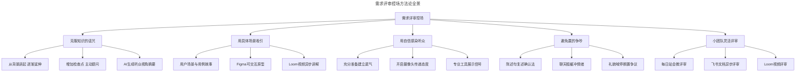
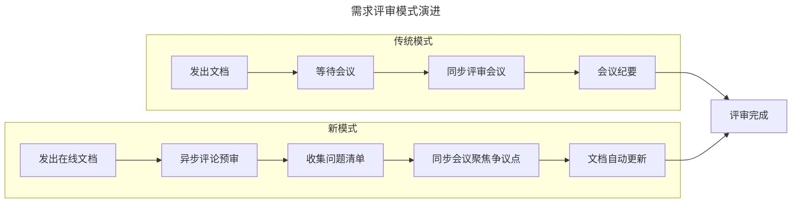
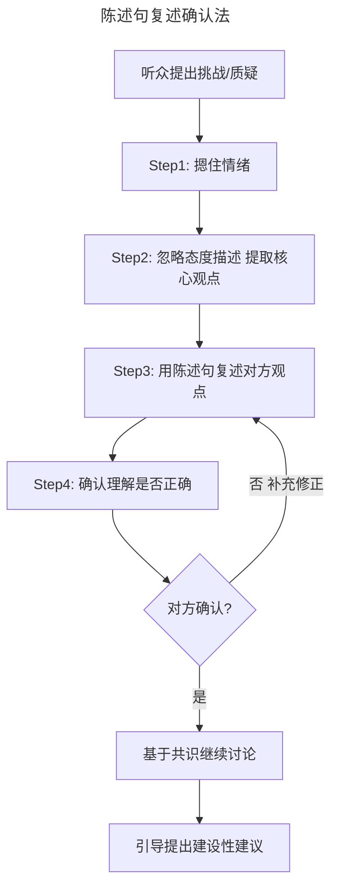
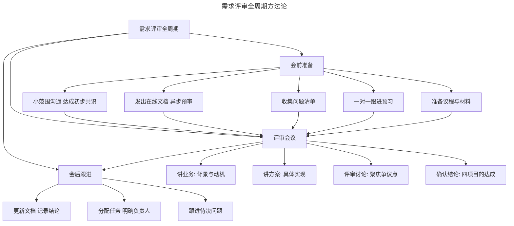

# 37 | 如何做好需求评审

> **适用范围**：产品经理（各阶段）、需要组织需求评审的团队负责人、创业者。适用于需求评审全过程、控场技巧、远程评审、AI 辅助评审等场景。
>
> **更新摘要（v2 · 2026-08 更新）**：
> - 结构化升级为 6 节骨架（导言 / 核心方法论 / 关键流程 / 工具与实战 / 常见误区 / 进阶延展）
> - 合并"需求评审不只是一次会议"（上）与"在评审中控住全场"（下）为单篇完整文档
> - 保留全部 Mermaid 图并补充 `--- title: ... ---` frontmatter，每张图后追加文字解读
> - 保留四项目的、异步预审、知识诅咒、陈述句复述确认法、远程评审、AI 辅助评审

---

## 1. 导言

**"问渠哪得清如许，为有源头活水来。"——朱熹**

需求评审不是一次会议，而是贯穿需求分析到实施全周期的过程。它服务于两种受众（需求方和实现方），达成四个目的（确认理解一致、交代背景、交代方案给需求方、交代方案给实现方）。成功的评审需要充分的会前准备：小范围沟通、提前发出材料、一对一跟进预习。

> **核心摘要**：需求评审不是一次会议，而是贯穿需求分析到实施全周期的过程。它服务于两种受众（需求方和实现方），达成四个目的。成功的评审需要充分的会前准备和控场能力。在远程协作时代，异步预审 + 同步讨论的模式正在成为新常态；控场的核心是克服"知识的诅咒"，用具体场景引导而非强迫听众参与，用自信传递信心，用陈述句复述确认法化解争吵。AI 正在为评审提供新的辅助能力，但产品经理的控场能力和同理心依然是不可替代的核心竞争力。

> **图解**：需求评审控场方法论全景——五大核心能力：克服知识的诅咒（从背景讲起、增加检查点、AI 生成听众视角摘要）、用具体场景吸引（用户场景与用例故事、Figma 可交互原型、Loom 视频异步讲解）、用自信感染听众（充分准备、开启摄像头、专业工具展示）、避免赢的争吵（陈述句复述确认法、聊天框缓冲、礼貌喊停）、小团队灵活评审（每日站会微评审、飞书文档异步评审、Loom 视频评审）。

---

## 2. 核心方法论

### 2.1 需求评审的定义与边界

**需求评审（Requirements Review）** 是指在需求分析完成后、开发实施前，由产品经理组织相关利益方对需求方案进行检验、确认和共识建立的过程。它包含三个关键要素：

| 要素 | 说明 |
|------|------|
| 时机 | 需求分析完成后、开发实施前 |
| 参与者 | 需求方代表、实现方代表（设计/开发/测试）、其他利益相关者 |
| 产出 | 确认的需求方案、明确的实施计划、识别的风险和待决问题 |

需求评审的边界需要澄清：不是一次单向的"产品经理讲、其他人听"的会议，而是一个多方参与、双向沟通、达成共识的过程。

### 2.2 需求评审的受众、目的

作为产品经理的下意识反应，任何事情都应该先去追问："解决谁的什么问题"。对需求评审来说，就是要先弄明白需求评审的受众和目的。我们通常意义的需求评审，是产品经理完成需求收集和分析，确定解决方案之后，面向两个角色，做四件事情。

**第一件事**：向需求方以及其他利益相关方详述自己对需求的理解和分析，明确我们的需求分析与他们的原始期望是一致的。（如用户说要一匹更快的马，你分析需求和场景后认为他的动机是希望更快地到达目的地，把你的分析过程讲给他听，并同他们达成一致。）

**第二件事**：向设计、研发和测试团队讲清楚需求的背景和来龙去脉。不能只交代做什么，还要交代为什么做。

**第三件事**：向需求方交代具体的产品解决方案，也就是他们将要得到一个什么东西，这个东西会如何出现在他们的工作场景中，以及会如何跟他们发生关系。

**第四件事**：向开发团队交代产品解决方案，设计师、工程师需要弄清楚自己将要制造一个什么东西，长成什么样子，怎样运转，有哪些特性。

**四项目的的矩阵化理解**——将这四项目的按照"受众"和"内容"两个维度组织：

| | 需求方 | 实现方 |
|------|--------|--------|
| **需求理解** | 确认对原始期望的理解一致 | 交代需求的背景和来龙去脉 |
| **方案交代** | 说明将要得到什么、如何影响工作 | 说明将要制造什么、如何运转 |

**四项目的对应四个关键产出**：需求确认（需求方签字认可"这就是我想要的"）；背景共识（实现方理解"为什么要做这个"）；方案确认（需求方认可"这个方案可以解决我的问题"）；实施共识（实现方清楚"具体要做什么"）。

### 2.3 哪些人参加评审，怎样安排议程？

如果把上面提到的四件事情拽出来，分别排列组合一下，就很容易得到答案。如果通过一次串讲，既能与需求方达成一致，也向实现方交代了背景；既能让需求方明白产品方案，也可以让实现方清楚特性列表，那就尽量一次性搞定。如果有实际情况或者流程障碍，那再根据具体情况去拆分会议。不论开几个会，都要记住上面四个目标，手段是为目标服务的。

**参与者选择的实践建议**：

| 参与者类型 | 必须参加 | 可选参加 | 不建议参加 |
|------------|----------|----------|------------|
| 产品经理 | ✓ | | |
| 需求方代表 | ✓ | | |
| 技术负责人 | ✓ | | |
| 设计师 | ✓（涉及UI时）| ✓（纯后端时）| |
| 开发工程师 | ✓（关键功能）| ✓（辅助功能）| |
| 测试工程师 | ✓ | | |
| 项目经理 | | ✓ | |
| 高层领导 | | | ✓（容易压制讨论） |

**关键原则**：参与者越少越好，但要确保"能做决策的人"和"能发现问题的人"都在场。

---

## 3. 关键流程

### 3.1 "预则立，不预则废"

大部分人的思考都需要时间和过程，有的产品经理为了顺利通过评审，会想要打别人一个措手不及。大家一定要重视会前的沟通，提前做功课，要记住需求评审会应该是凯旋的钟声，而不是冲锋的号角。

**会前沟通一般是小范围的**，针对一些细节点深入、频繁地与具体的相关人交换信息，达成一致。通过这样的沟通，确保在需求评审之前，将整个流程中可能发生分歧的点都考虑到，并且进行过讨论，要做到最终在需求评审会上的内容不会让与会者感到"意外"。

**一定要提前发出需求评审的材料**。虽然有一些手段可以敦促大家提前预习，但说实话，大部分人还是不会读。这时候，最好可以一对一跟进一下，也就是说，产品经理需要能够意识到不同的人关注的不同内容，然后非常具体地指出来，再让对方去提前读。比如，跟业务部门代表说："你看看功能图例里头那个流程图，是不是跟你们业务实际情况一致"。只有这样具体地指出来，相关的同事才能有操作路径，才有预习的效果。

**准备材料和议程**。材料至少要包括需求文档，议程至少有讲业务、讲实现、评审讨论三个部分。会前发出来的材料和议程，一定要专业，要严谨，一方面是可以把事情交代清楚，另一方面，大家提前看到这样专业和严谨的东西，会受到影响，在潜意识里会对这次需求评审更严肃和重视一点。

**需求评审模式演进**：

> **图解**：需求评审模式演进——传统模式（发出文档→等待会议→同步评审会议→会议纪要）；新模式（发出在线文档→异步评论预审→收集问题清单→同步会议聚焦争议点→文档自动更新）。新模式的核心优势：降低同步会议成本、提高讨论质量、文档即会议纪要、跨时区友好。

**文档形态的演变：从 PRD 到 Notion/飞书**——原稿中提到的"需求文档"，在 2018 年前后通常指传统的 PRD。到 2025-2026 年，需求文档的形态已经发生了显著变化：形态（Word/PDF → 在线文档实时协作）；更新方式（版本号 → 实时更新历史可追溯）；交互方式（单向阅读 → 评论、@提醒、任务分配）；原型集成（截图 → Figma 嵌入可交互）；评审方式（会议串讲 → 异步评论+同步讨论）；开发对接（文档转 Jira → 飞书多维表格/Notion 数据库直接对接）。

### 3.2 当心知识的诅咒

"知识的诅咒"指的是当一个人拥有某种知识之后，就很难想象和模拟出不知道它时的状态。有个著名的心理学实验：让一组人在限定范围内选择一首非常简单的曲子，然后在桌面上敲击它的节奏，另一组来猜，最终只有 2.5% 的听众猜对了曲目，而敲击者预测这一概率至少是 50%。

作为产品经理，对业务和产品细节的了解就像脑海中的旋律，台上的你其实无法想象坐在下面听讲的人的处境。我建议你在做宣讲或者评审需求的时候，要像做产品设计的时候一样，把自己放到听众的上下文中去，把来龙去脉讲清楚。哪怕有一部分听众会觉得你有点啰嗦，也要讲，尽可能从所有人都了解的背景开始讲起，逐渐向外延伸，像讲故事一样。大部分人听到自己已经知道的事情时会有安全感，以此为基础延伸开来，才能让听众感到踏实和好奇，摆脱知识的诅咒。

**知识的诅咒在需求评审中的三种表现**：

| 表现 | 产品经理视角 | 听众视角 | 后果 |
|------|-------------|----------|------|
| 术语黑话 | "这个需求涉及 CQRS 架构" | "CQRS 是什么？" | 听众迷失，放弃跟进 |
| 隐含假设 | "用户当然会先登录再操作" | "为什么一定要先登录？" | 理解偏差，后续返工 |
| 跳跃逻辑 | "所以我们需要加一个按钮" | "等等，怎么就到按钮了？" | 跟不上节奏，走神 |

**应对原则**：永远假设听众不知道你脑子里的上下文，从最基础的背景开始讲起。

### 3.3 不要强迫，要吸引

当听众没有积极参与的时候，我们要做的不是强迫他们，而是引导他们来理解。在需求评审会上引导听众的最有力武器就是"具体"。有个故事：一个产品经理做便携式平板电脑的提案，介绍外观尺寸说了半天听众一头雾水。这时他发现自己随身携带的文件夹的尺寸跟产品设计尺寸很相近，于是把这个文件夹扔到会议桌中间，说：这就是那个平板电脑的样子。一个莫名其妙却足够具体的文件夹，就能帮助所有漂浮在空中虚无缥缈的概念落地。

对于软件产品来说，我们的"文件夹"就是用户场景和用例故事。为了让听众理解需求和方案，最好可以从场景和故事出发，用具体的案例来跟听众沟通，而不是对着文档从头到尾照本宣科。我过去的习惯是，先整体地介绍业务，大的逻辑和背景，然后用一个实际的业务案例把相关的功能和流程串讲一遍，最后回到文档本身，把需求文档从头到尾过一遍。

**远程评审中的"具体"**：

| 线下评审 | 远程评审替代方案 |
|----------|------------------|
| 传递文件夹/实物 | 屏幕共享 Figma 原型，所有人点击链接自己操作 |
| 白板画流程图 | FigJam/Miro 在线白板，所有人实时协作 |
| 纸质文档翻页 | 在线文档 + 评论，异步标注问题 |
| 面对面讲故事 | Loom 录制操作视频 + 语音讲解，提前分发 |

### 3.4 用自己的态度感染别人

需求相关文档和会议流程要尽可能的专业严谨，让听众在本能上觉得这是一次"正式而严肃的会议"。信心也是一样，产品经理在评审时一定要有信心，并且要在评审过程中传递这样的信心。所谓"自信者，人恒信之"。想要让听众相信你的话，最好能让他们先相信你。

**自信的来源**：需求分析深度（你挖得够深，就不怕被追问）；数据支撑（有用户调研数据、竞品分析数据，就不怕被质疑）；方案完整性（考虑了边界条件和异常流程，就不怕被挑战）；会前沟通（提前与关键人员达成共识，就不怕会上出现"意外"）。

### 3.5 不要为了赢而争吵

需求评审中经常会发生争吵。对抗通常会激起更多对抗，很快大家都忘了本来要做什么，只是希望能赢得辩论。争吵本身不可怕，可怕的是为了捍卫自己而吵。

**防止将不同意见升级为争吵的一个办法是用陈述句复述并确认**——用陈述句去复述提问人的意思。比如听众说："你了解过现在的流程吗，所有的来电都记录提醒时间，服务人员还用不用干别的了？"如果你能及时摁住情绪，把态度描述忽略掉，用陈述句去复述提问人的意思："我理解一下，你是想说，并不是所有的来电都要记录提醒时间"，继续复述："所以我理解你的意思是，如果我们要求服务人员为未处理的来电建立提醒，会降低工作效率"。用这样的风格不断复述的同时，你可以引导他把问题背后的问题说出来。这个过程的目的是通过他的反对找到有建设性的建议，而不是赢得争论。

> **图解**：陈述句复述确认法——四步化解评审中的情绪化争论：Step1 摁住情绪→Step2 忽略态度描述提取核心观点→Step3 用陈述句复述对方观点→Step4 确认理解是否正确（对方确认则基于共识继续讨论，否则补充修正回到复述）→引导提出建设性建议。

### 3.6 小公司的需求评审

在小公司中，需求评审未必会成为一个仪式化的流程环节。可能是产品经理跟老板聊几句，然后写比较短的文档，或者画个原型，跟工程师面对面交流。我的建议是，小公司可以没有正儿八经的大型需求评审会，但最好要有需求评审的过程。这个评审可能是跟工程师小范围的需求串讲，也可能是产品经理自己在脑海中对自己的一次模拟评审。不能因为缺乏评审会，就把没有完全想清楚的需求交付给开发，浪费了时间，也影响士气。

**远程小团队的评审实践**——小团队远程评审实践建议：每日站会中嵌入微评审（在每日站会中花 5 分钟快速过一下当天要开发的需求）；飞书文档异步评审（不开会，在飞书文档中用评论功能完成评审）；Loom 视频评审（产品经理录制 5 分钟视频讲解需求，工程师异步观看并评论）；FigJam 协作评审（在在线白板上画流程图，所有人实时标注问题）。

---

## 4. 工具与实战

### 4.1 需求评审全周期方法论

> **图解**：需求评审全周期方法论——会前准备（小范围沟通、发出在线文档异步预审、收集问题清单、一对一跟进预习、准备议程与材料）→评审会议（讲业务、讲方案、评审讨论聚焦争议点、确认结论四项目的达成）→会后跟进（更新文档记录结论、分配任务明确负责人、跟进待决问题）。

### 4.2 AI 辅助需求文档生成与评审

2024-2025 年，AI 工具为需求文档撰写提供了新的辅助手段：从用户故事生成验收标准（输入用户故事，AI 自动生成验收标准）；从原型生成功能描述（上传 Figma 原型截图，AI 自动生成功能描述文案）；从会议录音生成文档（录制需求讨论会议，AI 自动生成会议纪要和需求要点）；竞品功能对比（输入竞品链接，AI 自动生成功能对比矩阵）。

**但需要注意：AI 生成的文档是"初稿"，不是"终稿"**。AI 可以加速文档撰写，但无法替代产品经理的思考。AI 生成的验收标准可能遗漏边界条件，AI 生成的功能描述可能不够精准。产品经理需要仔细审核和修改 AI 生成的内容，确保其准确性和完整性。

**AI 辅助克服"知识的诅咒"**：AI 生成"听众视角"摘要（输入需求文档，让 AI 从"不了解背景的工程师"视角生成摘要，检查是否有术语未解释、逻辑跳跃等问题）；AI 实时字幕与翻译（帮助非母语参与者跟上讨论）；AI 会议纪要自动生成（包括讨论要点、决策项和待决问题）。

### 4.3 实战要点

| 要点 | 说明 | 适用场景 |
|------|------|----------|
| 四项目的明确 | 确认理解一致、交代背景、方案给需求方、方案给实现方 | 所有需求评审 |
| 异步预审+同步讨论 | 提前发出在线文档收集评论，会议只聚焦争议点 | 远程/混合办公团队 |
| 一对一跟进预习 | 具体指出"你看哪一部分"，给操作路径 | 关键利益相关者 |
| 轻量文档工具 | 用Notion/飞书替代传统PRD，实时协作 | 现代产品团队 |
| 克服知识的诅咒 | 从听众视角出发，从背景讲起，不跳步骤 | 所有评审场景 |
| 具体场景引导 | 用用户故事和用例替代文档照本宣科 | 复杂业务流程评审 |
| 自信传递信心 | 充分准备+专业工具+开启摄像头 | 所有评审，尤其是远程评审 |
| 陈述句复述确认 | 四步法化解情绪化争论 | 评审中出现分歧和争吵时 |
| 远程评审节奏控制 | 缩短单次时长，增加检查点，利用聊天框 | 线上评审 |
| AI辅助评审 | 自动生成会议纪要、听众视角摘要 | 提高评审效率 |
| 小团队灵活评审 | 站会微评审/异步文档评审/Loom视频评审 | 创业团队、小团队 |

---

## 5. 常见误区

| 误区 | 表现 | 正确做法 |
|------|------|----------|
| **把评审当一次会议** | 只关注会议本身，忽视事前事后 | 评审是贯穿需求分析到实施全周期的过程 |
| **打人措手不及** | 毫无铺垫突然开评审会 | 会前小范围沟通，提前发材料，一对一跟进 |
| **文档照本宣科** | 对着文档从头到尾念 | 从场景和故事出发，用具体案例沟通 |
| **陷入知识诅咒** | 默认听众了解所有上下文 | 从背景讲起，从所有人都了解的内容延伸 |
| **为赢而争吵** | 对抗激起更多对抗 | 用陈述句复述确认法，找建设性建议 |
| **完全依赖AI文档** | 直接采用AI生成的需求文档 | AI生成初稿，人工审核修改 |

---

## 6. 进阶延展

### 6.1 总结

需求评审不是一次会议，而是贯穿需求分析到实施全周期的过程。它服务于两种受众（需求方和实现方），达成四个目的（确认理解一致、交代背景、交代方案给需求方、交代方案给实现方）。成功的评审需要充分的会前准备：小范围沟通、提前发出材料、一对一跟进预习。

控场的核心是克服"知识的诅咒"，用具体场景引导而非强迫听众参与，用自信传递信心，用陈述句复述确认法化解争吵。在远程评审场景下，这些原则依然适用，但需要适配线上化的工具和节奏——利用聊天框收集问题、屏幕共享展示原型、录制回放确保信息不丢失。AI 正在为评审提供新的辅助能力，但产品经理的控场能力和同理心依然是不可替代的核心竞争力。

### 6.2 延伸阅读

- 《关于需求变更：需求背后的需求》（docs/管理/01-产品/产品管理/01-产品方法论/24-关于需求变更.md）——需求分析的方法论与"化变更于无形"的变更管理
- Chip Heath & Dan Heath, *Made to Stick*——"知识的诅咒"与如何让信息更易理解
- Chris Voss, *Never Split the Difference*——陈述句复述确认法的谈判学原理
- Scrum Guide: Backlog Refinement——敏捷需求评审的官方定义
- Notion 官方模板库：Product Requirements——现代 PRD 模板参考
- 飞书官方文档：高效会议最佳实践
