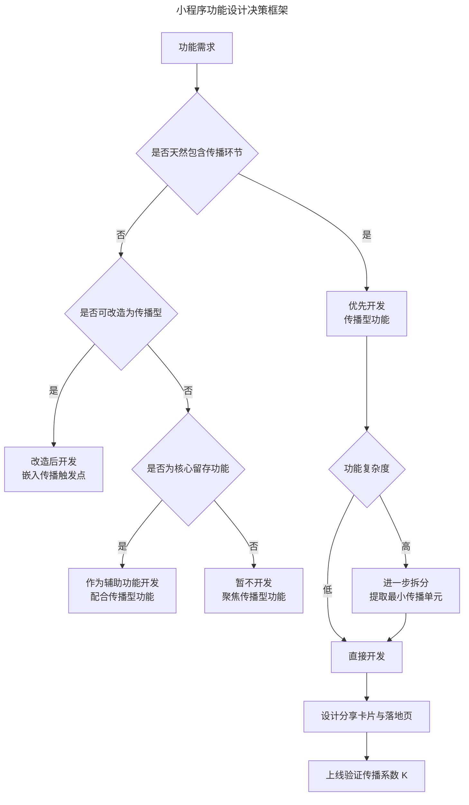
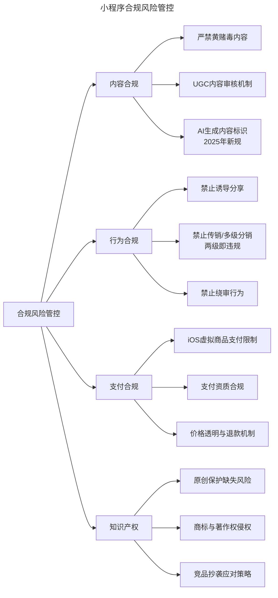
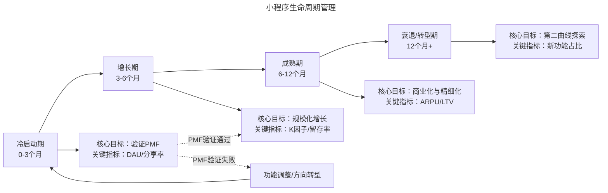

# 小程序开发与运营的关键实践指南

> **适用范围**：产品经理、小程序产品经理、开发者、创业者。适用于小程序功能设计、技术优化、合规管控、运营策略、AI 赋能等场景。
>
> **更新摘要（v2 · 2026-08 更新）**：
> - 结构化升级为 6 节骨架（导言 / 核心方法论 / 关键流程 / 工具与实战 / 常见误区 / 进阶延展）
> - 保留功能设计原则、技术约束、合规红线、运营策略、AI 赋能、多平台协同
> - 保留全部 Mermaid 图并补充 `--- title: ... ---` frontmatter，每张图后追加文字解读

---

## 1. 导言

小程序的产品设计与运营实践，与传统原生应用（Native App）及 Web 应用存在显著差异。这种差异并非仅限于技术实现层面，更深层地体现在用户心智模型、场景适配逻辑、平台治理边界及商业可持续性等多个维度。许多产品团队将小程序视为"App 的精简版"，将完整功能体系移植至小程序中，这种做法往往导致用户体验割裂、传播效率低下、平台合规风险等问题。

本文从小程序功能设计原则、技术约束与性能优化、平台合规与风险管控、运营策略及未来趋势五个维度，系统梳理小程序开发与运营的关键实践。

### 1.1 功能设计决策框架

> **图解**：小程序功能设计决策框架——功能需求判断是否天然包含传播环节：是则优先开发传播型功能（复杂度高则拆分提取最小传播单元），否则判断是否可改造为传播型（可改造则嵌入传播触发点，否则判断是否为核心留存功能：是则作为辅助功能，否则暂不开发）。最终设计分享卡片与落地页，上线验证传播系数 K。

---

## 2. 核心方法论

### 2.1 碎片化、场景化、简单化

小程序嫁接于超级应用的场景之中，其功能设计应与平台场景形成闭环，而非构建独立而完整的功能体系。小程序功能设计的第一原则是**碎片化、场景化、简单化**：碎片化（不追求功能完整，而是提取单一、独立的功能切片）；场景化（功能与平台使用场景深度耦合，形成"场景-功能"闭环）；简单化（用户进入后无需学习即可使用，用完即走）。

以电商为例，不必将商品浏览、店铺、类目、购物车等完整体系搬入小程序，而可拆分为独立的碎片化功能：

| 功能切片 | 场景闭环 | 传播属性 | 优先级建议 |
|----------|----------|----------|-----------|
| 拼团 | 会话/群聊分享 → 参团 → 成团 | 强（传播完成闭环） | 高 |
| 代付 | 发起订单 → 分享至会话 → 他人付款 | 强（传播完成闭环） | 高 |
| 分销 | 推荐商品 → 好友购买 → 获得佣金 | 强（传播驱动收益） | 中 |
| 商品详情 | 搜索/扫码 → 浏览 → 下单 | 弱（独立完成） | 低 |
| 完整商城 | 多入口 → 浏览 → 搜索 → 下单 | 弱（功能过重） | 不建议 |

### 2.2 从传播出发设计功能

小程序功能设计的第二原则是**从传播出发设计功能**。在微信生态中，留存手段有限（缺乏完善的通知体系，用户用完即退回微信大池），产品团队需要优先考虑增长而非体验。

核心判断标准：若两个功能中，一个可独立完成，另一个必须通过传播才能完成闭环，应毫不犹豫优先开发后者。拼团、代付、分销等功能之所以在微信生态中表现优异，正是因为其功能闭环内嵌了传播环节，使得增长成为功能运转的自然结果。

---

## 3. 关键流程

### 3.1 技术约束与性能优化

小程序的运行时架构由逻辑层（Logic Layer）与视图层（View Layer）组成，两者分别运行在独立的线程中，通过 Native 层进行通信。这一双线程架构（Dual-Thread Architecture）带来了以下技术约束：

| 约束项 | 具体限制 | 影响范围 |
|--------|----------|----------|
| 包体积 | 主包 ≤ 2MB，总包 ≤ 20MB（含分包） | 功能复杂度、资源加载 |
| DOM 操作 | 无法直接操作 DOM，需通过数据绑定 | 开发模式转变 |
| 线程通信 | 逻辑层与视图层通过消息通信，存在延迟 | 高频交互场景性能 |
| 运行环境 | 基于 WebView 渲染，非纯 Native | 复杂动画与渲染性能 |
| API 限制 | 部分系统 API 需用户授权方可调用 | 功能实现路径 |
| 后台运行 | 小程序切至后台后 5 分钟内被挂起 | 长时间运行场景 |

**性能优化关键实践**——包体积优化（启用分包加载、图片资源使用 CDN、代码压缩与 Tree Shaking、2024 年微信"按需注入"机制）；渲染性能优化（减少 setData 调用频率、列表渲染使用 recycle-view 虚拟列表、复杂动画用 CSS Animation 或 WXS、合理使用自定义组件）；启动性能优化（利用预下载机制、首屏数据缓存秒开、异步加载+骨架屏）。

### 3.2 平台合规与风险管控

**合规红线清单**：

> **图解**：小程序合规风险管控——内容合规（严禁黄赌毒、UGC 审核、AI 生成内容标识）、行为合规（禁止诱导分享、禁止传销/多级分销、禁止绕审）、支付合规（iOS 虚拟商品支付限制、支付资质、价格透明）、知识产权（原创保护缺失、商标著作权侵权、竞品抄袭应对）。

**关键风险详解**——诱导分享的灰色地带（拼团通常不被认定，推荐有赏可能被认定；合规建议以"功能闭环需要"作为分享行为的正当性基础）；绕审行为的不可持续性（随时可能被检测处罚，不因"别人也在做"作为合规判断依据）；iOS 虚拟商品支付限制（受苹果 App Store 政策约束，需设计差异化支付方案或采用 IAP 通道）；抄袭风险与应对（加快迭代、构建品牌认知壁垒、利用微信投诉机制、嵌入难以复制的运营资源）。

---

## 4. 工具与实战

### 4.1 运营策略

**小程序生命周期管理**：

> **图解**：小程序生命周期管理——冷启动期（0-3 个月，验证 PMF，指标 DAU/分享率）→增长期（3-6 个月，规模化增长，指标 K 因子/留存率）→成熟期（6-12 个月，商业化与精细化，指标 ARPU/LTV）→衰退/转型期（12 个月+，第二曲线探索）。PMF 验证失败则功能调整/方向转型回到冷启动期。

**留存与召回策略**——小程序的留存挑战在于：用户使用后即退回微信主界面，缺乏有效的主动召回手段。2020 年起微信将模板消息升级为订阅消息后，召回机制的设计需更加精细化：订阅消息设计（在用户完成关键操作后自然引导订阅、每条订阅消息仅对应一次推送、消息内容必须与订阅场景严格对应）；场景化召回（利用公众号关联推送、企业微信客服触达、微信搜一搜 SEO 优化）；用户分层运营（新用户降低使用门槛、活跃用户深化功能使用、沉默用户价值提醒、流失用户重新激活或放弃）。

**数据分析体系**——小程序运营需建立完整的数据分析体系，核心指标框架：获客层（新增用户数、CAC）；活跃层（DAU/MAU、DAU/MAU 比值）；传播层（分享率、K 因子）；留存层（次日/7日/30日留存）；商业层（ARPU、LTV）。

### 4.2 2024-2026：关键趋势与前瞻

**AI 赋能小程序开发**——AI 小程序构建工具（微信"小程序 AI 助手"支持自然语言描述生成页面、第三方平台集成 AI 能力、低代码/无代码平台降低门槛）；AI 增强运营能力（AI 驱动的用户分群与个性化推荐、AI 生成 A/B 测试方案、AI 智能客服）；AI 小程序的新品类（AI 对话助手、AI 创作工具、AI 增强服务）。

**多平台协同与生态融合**——跨平台数据打通（部分头部品牌尝试微信、支付宝、抖音小程序的用户数据统一管理）；平台差异化定位（微信侧重社交传播、支付宝侧重交易服务、抖音侧重内容消费）；小程序与 App 的协同（小程序作为轻量入口筛选高价值用户，引导下载 App 获得完整体验）。

**从"用完即走"到"用完再来"**——微信对小程序的原始愿景是"用完即走"，但行业实践却走向了"用完再来"。2024-2026 年，这一矛盾正在走向新的平衡：平台侧（持续治理过度裂变，推动生态回归用户价值）；开发者侧（流量成本上升倒逼精细化运营，从"拉新"转向"留存"）；用户侧（对裂变套路的免疫力提升，自然传播的信任优势凸显）。

### 4.3 实战要点

| 要点 | 说明 | 适用场景 |
|------|------|----------|
| 碎片化场景化简单化 | 提取单一功能切片，形成场景闭环 | 功能设计 |
| 从传播出发设计 | 优先开发需传播完成闭环的功能 | 功能设计 |
| 包体积优化 | 分包加载、CDN托管、Tree Shaking | 技术优化 |
| 渲染性能优化 | 减少setData、虚拟列表、CSS动画 | 性能优化 |
| 合规红线 | 内容/行为/支付/知识产权四线 | 合规管控 |
| 订阅消息召回 | 关键操作后引导订阅、场景对应推送 | 留存召回 |
| 用户分层运营 | 新/活跃/沉默/流失分层策略 | 运营策略 |
| AI赋能 | AI构建工具、AI增强运营、AI新品类 | 2024+趋势 |

---

## 5. 常见误区

| 误区 | 表现 | 正确做法 |
|------|------|----------|
| **把小程序当App精简版** | 移植完整功能体系 | 碎片化、场景化、简单化 |
| **忽视传播设计** | 只做独立使用功能 | 从传播出发设计，优先传播型功能 |
| **绕审侥幸** | 模仿"漏网之鱼"违规功能 | 严守合规红线，不冒违规风险 |
| **忽视技术约束** | 忽略包体积/渲染性能限制 | 优化包体积、渲染、启动性能 |
| **诱导分享** | 以利益诱导分享 | 以"功能闭环需要"作为分享正当性 |
| **单一平台思维** | 不考虑多平台协同 | 平台差异化定位，多平台统一开发 |

---

## 6. 进阶延展

### 6.1 结论

小程序的开发与运营实践，需在"碎片化场景适配"与"平台合规边界"的双重约束下展开。功能设计应遵循"碎片化、场景化、简单化"与"从传播出发"两大原则，避免将完整 App 体系移植至小程序。技术层面需关注包体积、渲染性能与启动速度的优化，并根据目标平台分布选择合适的跨平台开发方案。合规层面需严守内容安全、行为规范、支付政策与知识产权四条红线，杜绝绕审行为与侥幸心理。

运营层面，小程序的留存挑战要求产品团队建立精细化的用户分层运营体系与数据分析框架，善用订阅消息等召回机制。随着 AI 技术的融入、多平台协同的深化以及平台治理的持续完善，小程序生态正从流量红利期走向价值深耕期。产品经理应以长期主义视角审视小程序的定位与运营，在平台规则边界内构建可持续的用户价值。

### 6.2 参考文献

- 阿拉丁研究院. (2024). *2024年小程序行业发展白皮书*. 阿拉丁.
- 微信开放平台. (2025). *小程序内 AI 生成内容管理规范*. 腾讯.
- 微信开放平台. (2024). *小程序订阅消息使用规范（修订版）*. 腾讯.
- 微信开放平台. (2024). *小程序性能优化指南*. 腾讯.
- 中国信通院. (2025). *小程序开发者服务能力要求* (YD/T 6174-2025). 工业和信息化部.
- Parker, G. G., Van Alstyne, M. W., & Choudary, S. P. (2016). *Platform revolution*. W. W. Norton & Company.
- 全国人民代表大会常务委员会. (2021). *中华人民共和国个人信息保护法*. 中国法律出版社.
