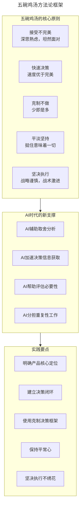
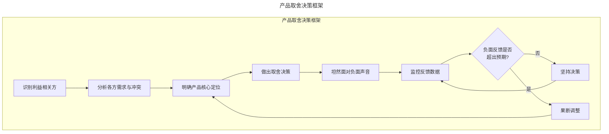
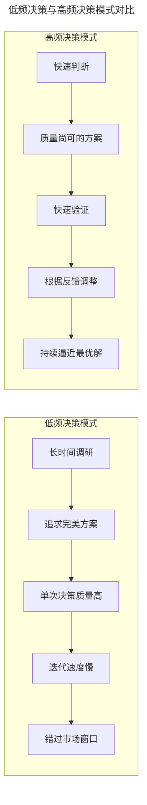
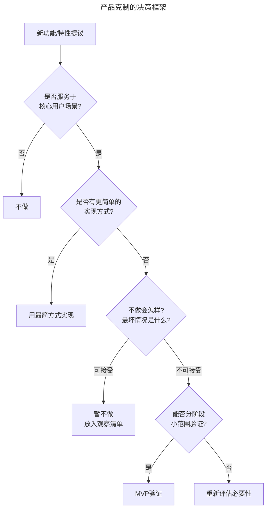
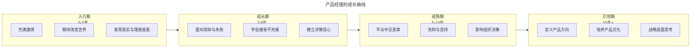
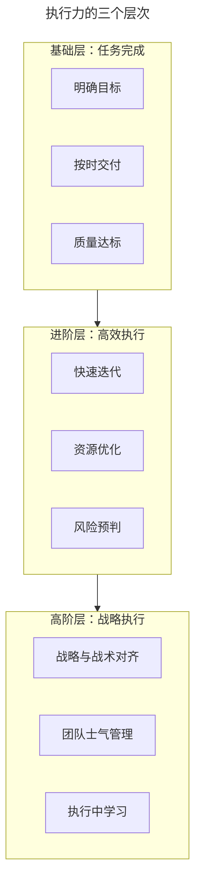

# 新年给产品经理的几碗鸡汤

> **适用范围**：产品经理（各阶段）、产品负责人、需要调整心态的从业者。适用于产品取舍、快速决策、克制不做、平淡坚持、坚决执行、AI 时代心态等场景。
>
> **更新摘要（v2 · 2026-08 更新）**：
> - 结构化升级为 6 节骨架（导言 / 核心方法论 / 关键流程 / 工具与实战 / 常见误区 / 进阶延展）
> - 保留五碗鸡汤、产品取舍框架、决策模式对比、克制框架、成长曲线、执行力层次
> - 保留全部 Mermaid 图并补充 `--- title: ... ---` frontmatter，每张图后追加文字解读

---

## 1. 导言

产品经理的五碗鸡汤：接受不完美——每个选择都有代价，深思熟虑后坦然面对；快速决策——单次决策的质量不如决策的速度和频率重要；克制不做——什么都不做有时就能跑赢大盘；平淡坚持——产品工作没有那么多高光时刻，挺住就意味着一切；坚决执行——战略上谨慎，战术上激进，不要绣花。在 AI 时代，这些原则依然适用，但 AI 为决策提供了新的支撑，也为"克制"增加了新的维度。

### 1.1 五碗鸡汤的方法论框架

> **图解**：五碗鸡汤方法论框架——核心原则（接受不完美、快速决策、克制不做、平淡坚持、坚决执行）在 AI 时代有了新的支撑（AI 辅助取舍分析、加速决策信息获取、帮助评估必要性、分担重复性工作），最终落地为实践要点。

---

## 2. 核心方法论

### 2.1 第一碗鸡汤：取一利、生一弊，深思熟虑，扛住诋毁

世上没有完美的产品设计方案，产品经理的日常工作，就是在各种并不完美的方案中做出取舍。对一部分人友好的设计，可能会伤害到另一部分人的利益，伤害自然会带来抱怨甚至谩骂。对于产品经理来说，一定要深思熟虑，想清楚可能的利弊，坚定地做出选择之后，坦然面对选择带来的负面声音。

有的产品经理做出判断之后，听到负面声音就犯怂，不敢坚持，想要讨好所有人。要知道，做产品和做人一样，一个讨好所有人的产品是平庸而缺乏个性的。产品经理要有自己的权衡取舍，有自己的坚持。另一方面，也不要盲目地在没有经过深入思考的情况下瞎坚持。如果某些特性上线之后，用户抱怨的内容或规模超出了预期，那可能就要果断做出调整，不要将错就错。

**经典案例：即时通讯的已读回执**——已读回执是一个典型的取舍案例。微信的选择（始终没有加入已读回执，设计原则是收件人体验大于发件人体验，聊天体验推崇简单有力）；钉钉的选择（不仅有已读回执，还有"DING"消息强提醒、已读未读统计，关键用户是企业管理者，围绕"组织效率"核心定位）；飞书的选择（折中方案——在群聊中提供已读人数统计，但不显示具体谁已读谁未读，在效率与压力之间找到平衡）。

**产品取舍决策框架**：

> **图解**：产品取舍决策框架——识别利益相关方→分析各方需求与冲突→明确产品核心定位→做出取舍决策→坦然面对负面声音→监控反馈数据→负面反馈是否超出预期（否则坚持决策，是则果断调整）。核心定位是决策的锚点，负面反馈的监控是纠偏的依据。

### 2.2 第二碗鸡汤：没有任何一个抉择是生死抉择

产品经理要忌讳"广谋而不决"和"优柔寡断"，不要"每种可能都去调研，但却迟迟不做选择"。有时候，我们会不自觉地放大一次抉择的作用。但事实上，在我们的生活和工作中，很少有哪一个抉择是真正的"生死抉择"。当我们在几个选项中持续犹豫时，说明这几个选项可能差不多好，所以不用太纠结究竟要选哪个。

尤其是对发展期的产品设计来说，**单次决策的质量不是最重要的，决策的速度和频率才是**。我们应当训练自己的决策能力是：快速做出大量的、质量还不错的决策，而不是花费大量时间和精力做出一个无懈可击的决策。

**决策质量与速度的关系**：

> **图解**：低频决策与高频决策模式对比——低频决策模式（长时间调研→追求完美方案→单次决策质量高→迭代速度慢→错过市场窗口）；高频决策模式（快速判断→质量尚可的方案→快速验证→根据反馈调整→持续逼近最优解）。高频决策通过快速验证和持续调整，最终逼近最优解。

**AI 辅助决策：新支撑**——2023 年以来，AI 工具为产品经理的快速决策提供了新的支撑：数据分析（AI 快速分析用户行为数据识别趋势）；竞品分析（AI 自动收集整理竞品信息）；方案评估（AI 辅助评估不同方案利弊）；用户反馈分析（AI 自动分类总结用户反馈）；A/B 测试分析（AI 自动分析测试结果并给出建议）。**重要提醒**：AI 辅助决策不等于 AI 代替决策。AI 可以提供信息和分析，但最终的判断和责任仍由产品经理承担。

**何时需要慢决策**——虽然快速决策通常是更好的策略，但以下场景需要放慢决策速度：不可逆决策（如数据迁移、架构变更等难以回退的决策）；高影响决策（影响大量用户或核心业务流程的决策）；合规相关决策（涉及隐私、安全、法规的决策）；品牌定位决策（影响产品长期品牌形象的决策）。

---

## 3. 关键流程

### 3.1 第三碗鸡汤：什么都不做，或许就已经跑赢了大盘

有一次我到小区里的一个快递柜里取包裹，包裹取出后，屏幕上显示："您的包裹存放 xx 小时，击败了本小区 x% 的人"。我盯着屏幕愣了很久，不知道究竟是什么意思——如果我想要击败本小区更多的人，是应该将包裹放得更久，还是应该尽快取走？而我猜测，做这个特性的产品经理可能纯粹只是为了做而做。

这也是为什么我们早先经常赞叹于微信团队"克制"的难得。当你的应用开始成为入口，开始有了各种用户和反馈之后，你可能会发现很多虚虚实实的机会，想要做各种各样的尝试。这些尝试如果单独去看，每一个可能都无伤大雅，但加到一起，可能就会让产品的调性发生变化。所以在很多时候，或许什么都不做就可以跑赢大盘。

**经典案例：Google 搜索首页的演变**——想想 Google 的核心搜索流程，这么多年连"I'm Feeling Lucky"都没有变过。2024-2025 年的变化：Google 开始在搜索结果页面中引入 AI Overview（AI 概览），在传统搜索结果上方展示 AI 生成的摘要。Google 的取舍在于：AI 概览提升了信息获取效率，但也可能让用户不再点击原始网页。Google 最终选择了在 AI 概览中保留来源链接，并在某些场景下让用户选择是否查看 AI 摘要——这本身就是一种"克制"的体现。对比案例：一些搜索引擎在引入 AI 功能时更加激进，直接用 AI 回答替代传统搜索结果，导致用户在某些场景下无法获得准确信息（AI 幻觉问题）。

**产品克制的决策框架**：

> **图解**：产品克制的决策框架——新功能提议后判断是否服务于核心用户场景（否则不做），是否有更简单的实现方式（是则用最简方式实现），不做会怎样最坏情况是什么（可接受则暂不做放入观察清单，不可接受则能否分阶段小范围验证：是则 MVP 验证，否则重新评估必要性）。绿色节点为"不做"或"简化"的路径，黄色节点为验证路径，红色节点为需要警惕的路径。

---

## 4. 工具与实战

### 4.1 第四碗鸡汤：平淡无奇，十之八九

很多人在入行之前觉得，产品经理是一份每天都需要创造的工作。事实上，做产品没有那么多激情时刻。我们绝大部分的工作，都是在平淡、纠结和琐碎中度过的。行业数据表明，百分之七八十的项目最终其实是以失败告终的。这就是产品工作的真实写照，产品经理要保持一颗平常心，不要因为几个项目失败了，就失去对自己的信心。面对工作中的琐碎也要保持耐心和认真，很多时候不是我们争取到了胜利，而是我们有足够的耐心和储备等到了它。

**产品经理的成长曲线**：

> **图解**：产品经理的成长曲线——入行期（0-2 年，充满激情、期待改变世界、发现现实与理想差距）→成长期（2-5 年，面对琐碎与失败、学会接受不完美、建立决策信心）→成熟期（5-10 年，平淡中见真章、克制与坚持、影响组织决策）→引领期（10 年+，定义产品方向、培养产品文化、战略层面思考）。

### 4.2 第五碗鸡汤：坚决执行，不要绣花

"在战略上谨慎，在战术上激进。"——斑马资本 吴永强。我们日常工作中很容易出现的一个状况，就是在战术执行中不断地质疑战略，结果影响了进程，也伤害了士气。相反，一旦经过充分论证之后，做出了方向上的判断，就应该搁置争议，全力执行；并且执行的过程应当大开大合，快进快出，不要绣花。几乎所有的执行方案都是有瑕疵的，如果因为缺陷和错误就怠慢了手头的工作，整个规划的节奏就会乱掉。

**执行力的层次**：

> **图解**：执行力的三个层次——基础层（任务完成：明确目标、按时交付、质量达标）→进阶层（高效执行：快速迭代、资源优化、风险预判）→高阶层（战略执行：战略与战术对齐、团队士气管理、执行中学习）。

### 4.3 实战要点

| 要点 | 说明 | 适用场景 |
|------|------|----------|
| 接受不完美 | 每个选择都有代价，深思熟虑后坦然面对 | 功能取舍、优先级排序 |
| 快速决策 | 决策速度比单次质量更重要，快速验证持续调整 | 产品方向选择、方案评估 |
| 克制不做 | 用决策框架评估必要性，不做也是一种选择 | 功能规划、需求评审 |
| 平淡坚持 | 保持平常心，耐心等待胜利 | 项目低谷期、职业倦怠期 |
| 坚决执行 | 战略谨慎，战术激进，不要绣花 | 项目执行阶段 |
| AI辅助决策 | 利用AI加速信息获取和分析，但不替代判断 | 数据分析、竞品调研、用户反馈 |
| 监控反馈 | 坚持决策后持续监控，超出预期时果断调整 | 功能上线后 |

---

## 5. 常见误区

| 误区 | 表现 | 正确做法 |
|------|------|----------|
| **讨好所有人** | 听到负面声音就犯怂，不敢坚持 | 深思熟虑后坚定选择，坦然面对负面声音 |
| **优柔寡断** | 每种可能都调研却迟迟不选择 | 快速做出大量质量还不错的决策 |
| **放大单次抉择** | 以为一个决策决定成败 | 成功由一系列决策和行为造就 |
| **做而为了做** | 为了"有产出"做无意义功能 | 用克制框架评估必要性，不做也是选择 |
| **执行中质疑战略** | 战术执行中不断质疑战略 | 战略谨慎，战术激进，坚决执行 |

---

## 6. 进阶延展

### 6.1 总结

在春节假期的尾声，我分享了做产品经理以来的一些感悟：学会接受不完美，提高决策效率、避免优柔寡断，能够用良好心态面对日常的琐碎，以及战略上要谨慎、战术上要激进。在 AI 时代，这些原则依然适用，但 AI 为我们的决策提供了新的支撑。产品经理需要善用 AI 工具，同时保持自己的判断力和克制力。希望你能够保持良好的心态，不要浮躁也不要气馁，踏实做事，锐意进取，为自己的用户创造价值。

### 6.2 延伸阅读

- 《精益创业》——Eric Ries，理解快速验证和迭代
- 《启示录》——Marty Cagan，理解产品经理的核心价值
- 《思考，快与慢》——Daniel Kahneman，理解决策心理学
- 《克制：少即是多的设计哲学》——理解产品克制的价值
- 《AI 时代的产品管理》——理解 AI 对产品管理的影响
