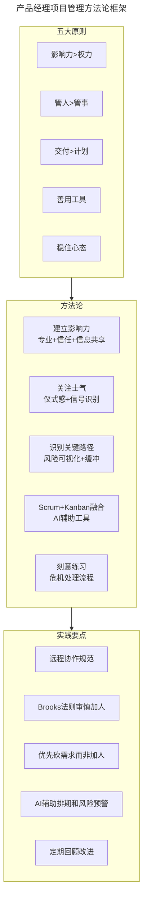
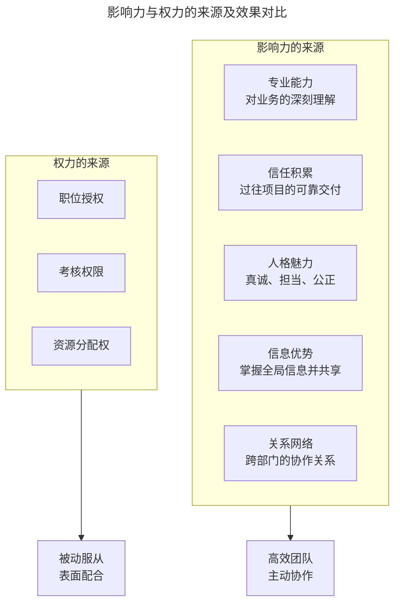
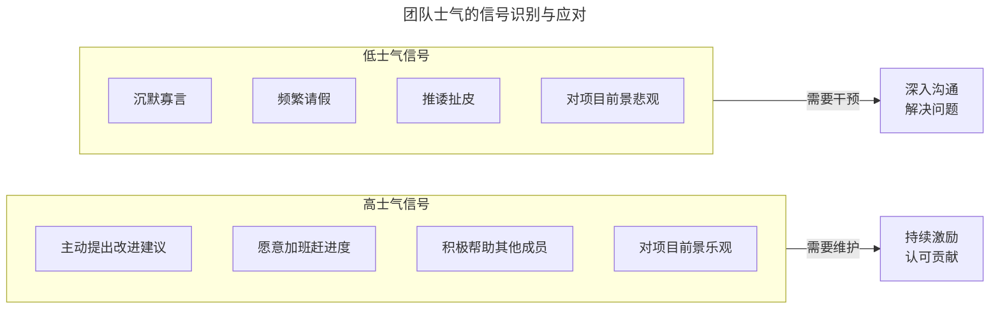
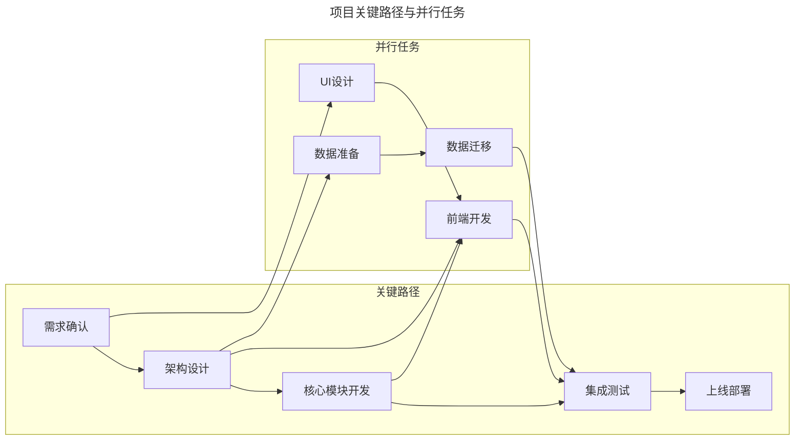
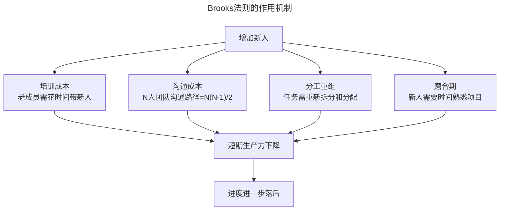
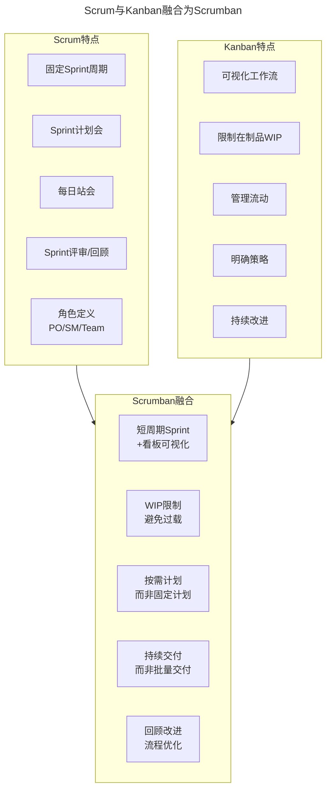
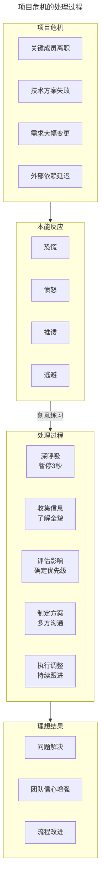

# 产品经理的项目管理心得

> **适用范围**：产品经理（各阶段）、项目经理、需要负责项目交付的团队负责人。适用于影响力建设、士气管理、交付管理、项目管理工具、危机处理等场景。
>
> **更新摘要（v2 · 2026-08 更新）**：
> - 结构化升级为 6 节骨架（导言 / 核心方法论 / 关键流程 / 工具与实战 / 常见误区 / 进阶延展）
> - 保留五大原则、Brooks 法则、Scrumban、远程团队管理、危机处理
> - 保留全部 Mermaid 图并补充 `--- title: ... ---` frontmatter，每张图后追加文字解读

---

## 1. 导言

产品经理在项目管理中需要掌握五个核心原则：影响力大于权力——依靠专业和信任而非行政命令组织团队；管人大于管事——关注士气和人心比流程制度更重要；交付大于计划——计划是手段，交付才是目的；正确看待工具——全面了解但不拘泥；稳住心态——项目经理的沉稳是团队的定心丸。在敏捷与 AI 时代，这些原则依然适用，但有了新的实践方法和工具支撑。

### 1.1 产品经理项目管理的方法论框架

> **图解**：产品经理项目管理方法论框架——五大原则（影响力>权力、管人>管事、交付>计划、善用工具、稳住心态）指导方法论选择（建立影响力、关注士气、识别关键路径、Scrum+Kanban 融合、刻意练习），方法论落地为实践要点（远程协作规范、Brooks 法则审慎加人、优先砍需求而非加人、AI 辅助排期和风险预警、定期回顾改进）。

---

## 2. 核心方法论

### 2.1 影响力大于权力

**"将者，智、信、仁、勇、严也。"——孙武《孙子兵法》**

互联网公司的项目团队通常是根据项目范围临时组建的，团队成员来自于不同的职能部门。这就意味着产品经理对项目组成员并没有行政权力。在这样的环境中，一定要依靠影响力来组织团队。千万不要抱有"我是这个项目的项目经理，所以你们要听我的"这样的态度和言行，否则很容易让项目组内部出现罅隙。利用权力威逼利诱，总是隔着一层障碍；利用影响力团结一心，才能打造更有效率的项目团队。

**影响力的来源**：

> **图解**：影响力与权力的来源及效果对比——影响力的来源（专业能力、信任积累、人格魅力、信息优势、关系网络）带来高效团队主动协作；权力的来源（职位授权、考核权限、资源分配权）只能获得被动服从表面配合。

### 2.2 管人大于管事

项目进行的过程中，有的项目经理会根据流程和制度，照本宣科地执行项目管理手段。从单个项目的角度来看，这样的方式可能不会有太大问题，但如果忽略了项目中人的因素，那么项目抵抗风险的能力以及达成卓越的可能性都会降低。从我自己的体会来说，在项目中，对人关注的重要性或许会超过对执行具体事务的管理。

**士气：团队中看不见的那只手**——士气是团队中看不见的那只手，项目经理需要对此有感性上的敏感，关注整个项目组的士气。提高士气的大前提：你做的产品规划和设计要靠谱，大家能够理解并且看到希望。在此基础之上，也要注意项目的里程碑和仪式感。在达成阶段性的目标或交付阶段性的特性时，可以买点水果大家一起庆祝庆祝，或者哪怕在项目群里郑重其事地宣布一下，既可以保持项目组内部的信息透明，也能让大家时刻感受到项目在持续向前推进。

**士气管理的信号识别**：

> **图解**：团队士气的信号识别与应对——高士气信号（主动提出改进建议、愿意加班、积极帮助他人、对项目前景乐观）需要维护（持续激励认可贡献）；低士气信号（沉默寡言、频繁请假、推诿扯皮、对项目前景悲观）需要干预（深入沟通解决问题）。

---

## 3. 关键流程

### 3.1 交付大于计划

项目管理通常都是基于项目计划开展的，包括分析预估并排定计划，在项目推进过程中设置里程碑和观测点，以及最终保质保量交付上线。这个过程需要项目计划保持一定的严肃和刚性。但我们也要知道，**项目计划只是手段，项目交付才是项目管理的目的**，所以不能过分拘泥于计划，因为过程中的一些意外自乱阵脚。

**关键路径与风险可视化**——项目管理中我们要能识别关键路径，清楚任务依赖，并且建立尽可能多的观察点，在问题发生前预警、问题发生时快速做出调整。

> **图解**：项目关键路径与并行任务——关键路径（需求确认→架构设计→核心模块开发→集成测试→上线部署）与并行任务（UI 设计→前端开发、数据准备→数据迁移）。关键路径上的任何延迟都会直接影响交付时间。

**风险应对：加班、加人、砍需求**——当项目进展出现风险时，应对方案基本就是三招："加班、加人、砍需求"。先考虑加班，如果加班搞不定，考虑往项目组中增派人手；如果加人也解决不了问题，就要开始根据优先级倒着往下砍需求或者改方案；不到万不得已尽量不要延期。

**Brooks 法则与"加人"策略的矛盾**——1975 年，Fred Brooks 在《人月神话》中提出："向进度落后的项目中增加人手，只会使进度更加落后。"

> **图解**：Brooks 法则的作用机制——增加新人带来的培训成本、沟通成本、分工重组、磨合期导致短期生产力下降，反而使进度进一步落后。

**何时可以加人？**——Brooks 法则并非绝对，以下情况加人可能有效：任务可高度分解（新人可以独立完成某个子任务，不需要大量沟通）；有充足的培训资源（老成员不需要花太多时间带新人）；项目周期较长（有足够时间让新人度过磨合期）；加的是经验丰富的成员（熟悉技术栈和业务的人可以快速上手）。**更优的替代方案**：砍需求（根据优先级砍掉非核心需求，是最直接有效的方式）；简化方案（用更简单的实现方式替代复杂方案）；调整排期（分阶段交付，先交付核心功能）；借调经验丰富的成员（短期借调比长期加人更有效）。

**缓冲时间的智慧**——我过去经历的大部分项目评估都偏向乐观，工程师觉得三天能做完的东西，可能需要五天才搞得定。所以我们要在项目中，尤其是在关键路径前后，根据风险大小和团队情况，在评估的结果上留出余量，应付可能出现的延期。

---

## 4. 工具与实战

### 4.1 正确看待项目管理工具

项目管理是一项技术活，涉及了很多工具和方法。面对这些工具，有两种极端的态度：一种是全面实施，严格按照工具来执行项目管理；另一种是觉得工具都是形式主义，根据自己的经验管理项目就可以。这两种态度都不可取。我建议你要全面了解项目管理工具和方法论，同时不拘泥于它们。每一样工具和规范都是前人经验的结晶，通过研究这些工具的设计和构造，我们可以学习很多关于项目管理的洞察。

**从工具设计洞察管理智慧**——案例：站会中的令牌设计。敏捷开发的方法论中有个工具叫做站会，在站会中有一个设计，是用一个令牌——比如一支笔，作为发言的标识，只有拿到这支笔的人可以说话，其他人保持安静。这个设计本身非常形式化，但我们可以通过这个细节去洞察：站会中可能发生的现象，就是本来设计的初衷是做一个短平快的沟通，结果却演变成了七嘴八舌的细节讨论会。所谓尽信书不如无书，我们也需要根据自己的项目和团队情况，选择合适的管理工具。

**敏捷 Scrum 与 Kanban 的融合实践（Scrumban）**：

> **图解**：Scrum 与 Kanban 融合为 Scrumban——Scrum 特点（固定 Sprint 周期、Sprint 计划会、每日站会、Sprint 评审/回顾、角色定义）与 Kanban 特点（可视化工作流、限制在制品 WIP、管理流动、明确策略、持续改进）融合为 Scrumban（短周期 Sprint+看板可视化、WIP 限制、按需计划、持续交付、回顾改进）。融合模式兼顾了 Scrum 的节奏感和 Kanban 的灵活性。适用场景：维护型项目、混合型团队、小团队、需要快速响应变化的团队。

### 4.2 稳住才能赢

我认识的优秀项目经理，都有一个共同的特点，就是风格非常沉稳。在项目出现意外的时候，他们也会慌张，但都可以迅速调整心态，冷静思考对策，绝不会手足无措。项目经理的心态如果崩了，其他团队成员信心就更悬了。除了心态要好之外，项目经理能稳得住，最重要的是对整个项目状况的通盘掌握。这一切都需要投入精力和时间去学习，所以项目管理并不是一个纯粹的经验学科，而是一门手艺，不能随意而为，而要刻意练习。

**项目危机的处理过程**：

> **图解**：项目危机的处理过程——项目危机（关键成员离职、技术方案失败、需求大幅变更、外部依赖延迟）→本能反应（恐慌、愤怒、推诿、逃避）→刻意练习→处理过程（深呼吸、收集信息、评估影响、制定方案、执行调整）→理想结果（问题解决、团队信心增强、流程改进）。

### 4.3 AI 辅助项目管理工具

2023 年以来，AI 工具开始渗透到项目管理领域，为产品经理提供了新的辅助手段：

| AI应用场景 | 具体工具/方法 | 效果 |
|------------|---------------|------|
| 智能排期 | AI分析历史数据，辅助工期评估 | 提升评估准确性 |
| 风险预警 | AI识别项目风险信号，提前预警 | 减少意外延期 |
| 资源优化 | AI分析团队成员技能和工作量，优化分配 | 提升资源利用率 |
| 进度预测 | AI根据当前进展预测交付时间 | 辅助决策 |
| 会议摘要 | AI自动生成会议纪要和行动项 | 减少行政工作量 |
| 文档生成 | AI辅助生成项目文档和报告 | 提升文档效率 |

**实践建议**：保持开放心态尝试新工具；不完全依赖 AI，关键决策仍需人工判断；将 AI 视为"助手"而非"管理者"；关注数据隐私和安全问题。

### 4.4 远程/分布式团队的项目管理挑战

远程和分布式团队为项目管理带来了新的挑战：沟通成本增加（同步沟通需预约、时区差异导致响应延迟、文字沟通易误解）；管理透明度下降（无法直接观察工作状态、难以感知士气变化、信息传递不及时）；协作效率降低（代码审查/设计评审需异步进行、集成测试和部署需协调、知识共享更困难）。应对策略：沟通成本（建立异步优先的沟通规范，工具 Slack/飞书/钉钉）；透明度（工作状态可视化，工具 Jira/Linear/Notion）；协作效率（缩短反馈循环小批量交付，工具 GitHub/GitLab）；知识共享（建立共享文档和知识库，工具 Confluence/Notion）；士气管理（增加非正式互动机会，工具 Donut/RandomCoffee）。

### 4.5 实战要点

| 要点 | 说明 | 适用场景 |
|------|------|----------|
| 影响力驱动 | 依靠专业和信任而非权力组织团队 | 所有项目，尤其是跨部门项目 |
| 关注士气 | 识别士气信号，及时激励或干预 | 项目中期、士气波动时 |
| 交付优先 | 计划是手段，交付是目的，不过分拘泥计划 | 项目出现风险时 |
| 审慎加人 | 遵循Brooks法则，优先砍需求 | 项目进度落后时 |
| 留缓冲 | 在关键路径前后留余量 | 工期评估阶段 |
| Scrum+Kanban | 融合两种方法，取长补短 | 维护型/混合型项目 |
| AI辅助 | 利用AI工具辅助排期、风险预警、文档生成 | 日常项目管理 |
| 远程规范 | 建立异步优先的沟通和协作规范 | 远程/分布式团队 |
| 稳住心态 | 项目经理的沉稳是团队的定心丸 | 项目危机时 |
| 刻意练习 | 项目管理是手艺，需要持续学习和练习 | 持续提升 |

---

## 5. 常见误区

| 误区 | 表现 | 正确做法 |
|------|------|----------|
| **依赖行政权力** | 认为"我是项目经理你们要听我的" | 依靠影响力而非权力组织团队 |
| **只管事不管人** | 忽略项目中人的因素 | 关注士气和人心比流程制度更重要 |
| **过分拘泥计划** | 计划出现意外就自乱阵脚 | 计划是手段，交付是目的 |
| **盲目加人** | 进度落后就不断加人 | 遵循Brooks法则，优先砍需求 |
| **工具形式主义** | 要么照搬工具要么完全不用 | 全面了解但不拘泥，择善而从 |
| **心态不稳** | 危机时手足无措 | 稳住心态，冷静思考对策 |

---

## 6. 进阶延展

### 6.1 总结

在今天的分享里，我提到了在项目管理中应当更多地利用影响力而非权力，应当更重视人而非流程和制度；之后，我谈到了计划是交付的手段和确保交付的重要性，深入分析了 Brooks 法则与"加人"策略的矛盾；最后又聊到了如何看待项目管理工具（包括 Scrum+Kanban 融合和 AI 辅助工具），以及项目经理所需要的心态和控制力。

在敏捷和 AI 时代，项目管理的核心原则没有变，但实践方法和工具在不断演进。产品经理需要持续学习，刻意练习，将项目管理从经验升华为手艺。

### 6.2 延伸阅读

- 《人月神话》——Fred Brooks，理解软件工程的本质复杂性
- 《构建之法》——邹欣，现代软件工程实践
- 《团队之美》——Andrew Stellman 等，团队协作最佳实践
- 《网易一千零一夜》——网易项目管理实践
- 《Scrum 指南》——Ken Schwaber 等，理解 Scrum 框架
- 《看板方法》——David J. Anderson，理解 Kanban 实践
- 《远程工作革命》——理解远程协作最佳实践
