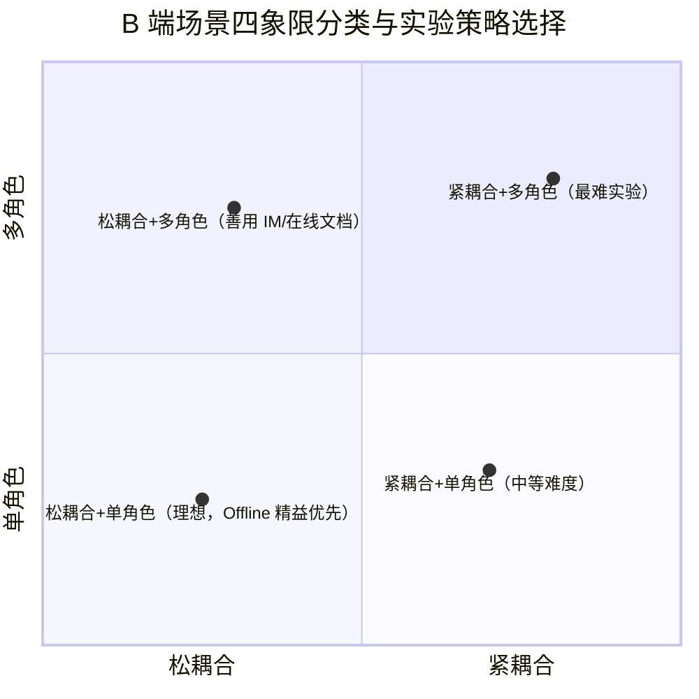
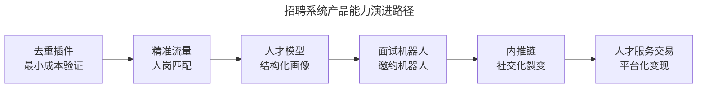
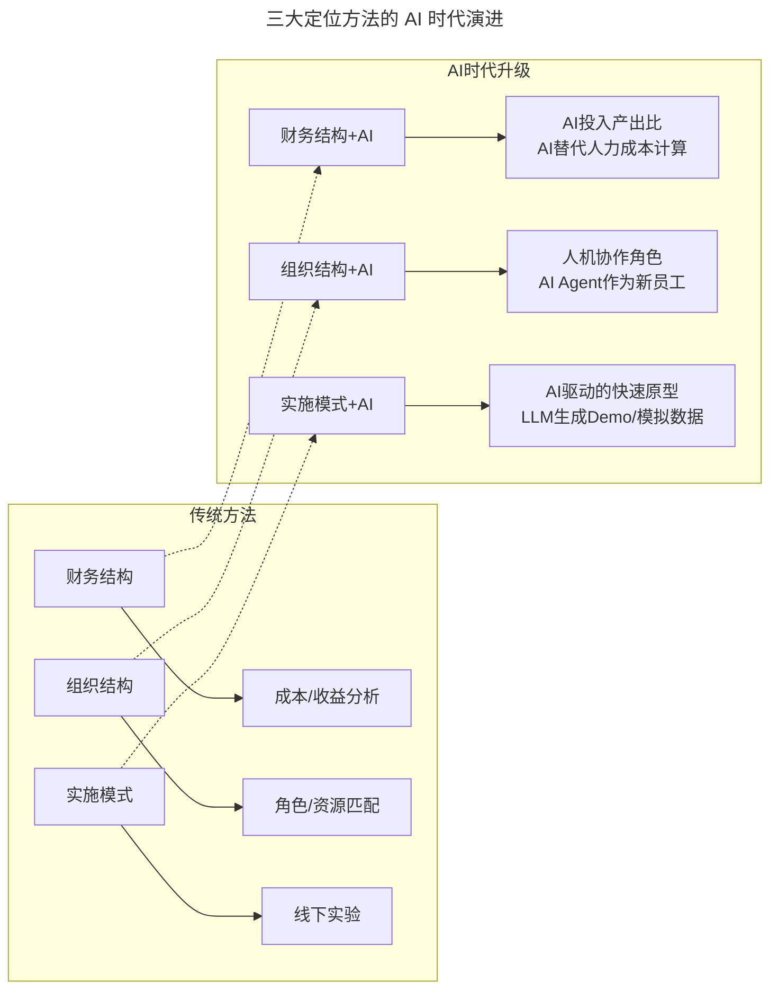
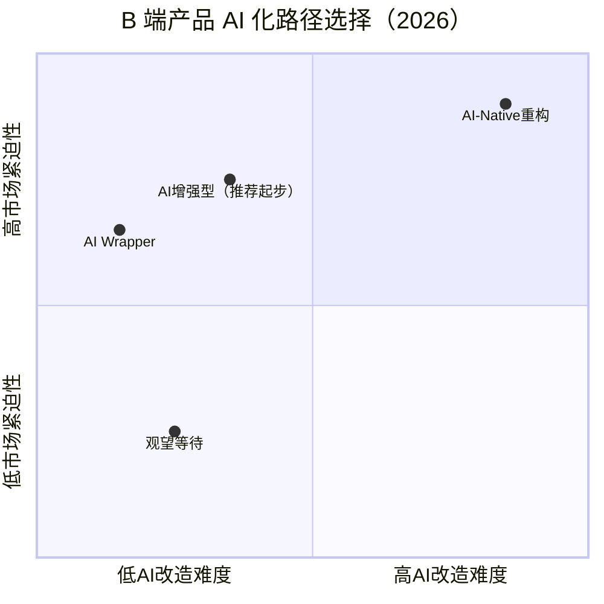

# 第138讲 | 78-于艺：以生存为核心，B端产品的定位心法

> **适用范围**：B端产品经理、技术管理者、企业服务创业者
>
> **更新摘要（v2 · 2026-08 更新）**：
> - 结构化升级为 6 节骨架（导言 / 核心方法论 / 关键流程 / 工具与实战 / 常见误区 / 进阶延展）
> - 保留原文招聘系统案例及三大定位方法（财务结构 / 组织结构 / 实施模式）
> - 整合 AI 时代升级注解，新增 B 端产品 AI 化路径选择四象限与行动清单
> - 移除失效图片引用，替换为 Mermaid 流程图与表格说明

## 1. 导言

我对于B端产品的定位是生存，因为在我看来B端产品不是用于娱乐或消费，而是给经营者、工作者收获利益，多数使用B端产品的人都是为了生存。

在分享方法论之前，我想先讲一个招聘系统产品的案例，之后通过这个案例来看一个垂直房产经纪行业的生态服务是如何构建起来的。

当招聘系统这个产品需求提出来时，总部说，"我们做一个管理系统，把招聘经纪人这事好好管一管。"管的就是招聘中简历、面试、offer这个流程。

之所以会提出这个需求，是因为当时以链家的背景，全国有将近20万经纪人，每年的流失率是100%，而每流失一个人，就会损失一万块钱，流失20万人就意味着损失20亿元。因此，对于招聘系统的产品需求，我们积极并且快速将它实现了，结果却很失败。

其实，我们最初的目标是系统做完之后，全国30多个分公司都能将它上线，实现所有流程的线上化，结果却没有一个分公司愿意用这套系统。原因主要在于每个城市的招聘环境不同，对于小城市的分公司来说，最多两名招聘专员，根本不需要招聘系统，招聘和协同工作只用QQ就可以搞定。而一些大城市的分公司表示，不仅要用招聘系统，还要求系统能够支撑抢简历、自动计算业绩、自动发放绩效等功能。最终因为每个城市的差异较大，每个分公司的需求都不同，难以统一招聘系统。

我们总结了失败的原因，归根结底还是因为没有正确的方法论。B端产品是为了满足生存需求而存在的，企业的目的是盈利，员工跟随企业也是为了赚钱的机会，因此我们做B端产品时就需要看准盈利点在哪，是谁在帮助企业盈利以及如何实现盈利。于是，我们总结出三个定位方法，分别是财务结构定位、组织结构定位与实施模式定位。

## 2. 核心方法论

### 2.1 财务结构定位

我们可以从财务视角找到企业的核心价值点，比如从哪里赚钱，成本在哪里，为什么能活下来等。程序员们有一个通病就是看到财务两个字就想逃，但是，要想知道一个公司的成本与收益构成，就要看企业财报，有些企业可能没有真正意义上的公开财报，那我们可以去做经营者访谈，比如贝壳找房，每个门店都是一个独立的最小单元的经营者，我们可以通过了解这个店的收入与支出来了解财务结构定位。

另外，还可以看企业的核心生产资料是什么？生产资料是一个企业正增长的正相关因素，比如经纪公司的正相关因素就是经纪人的数量，或者叫合格的经纪人数量，那它的核心生产资料就是经纪人。而其他企业的核心生产力可能是产品、是服务，或者是产品背后的创新能力等，每个行业都不一样。

结合以上两点，再回顾招聘系统产品的案例，招聘与企业利润息息相关，招聘不利就意味着没有人去做交易服务，无法获得佣金收入。由此可见，招聘是关联经纪公司生存的核心价值点，至于招聘业务，本身就有一个盈利模型，它容易被量化，容易衡量交付数量，并不是一个公司的纯粹职能。

### 2.2 组织结构定位

以组织为核心去定位服务提供者的角色和资源。我们需要关注两个方面，第一是目标需求所在的组织架构，一般产品经理会定位到使用产品的角色，那资源如何定位呢？资源就是这个产品所在团队的组织架构，如果看不到一个完整的组织架构，我们就需要看他的汇报对象或上级组织，比如老师的上级组织是学校，这是教师群体所在的组织架构。

第二是目标需求的用户及其上级的绩效和收入构成，我们需要观察B端用户的收入来源，由此观察他们在乎什么。还是以招聘系统为例，因为招聘对业务的影响过于深远，所以招聘部门在全国的组织架构是各分公司负责自己的业务与收入，管理权主要落在各城市分公司，而非由总部统一管理，这也是招聘部门在组织架构方面的差异。

另外，在绩效构成方面，招聘部门中，每个人都是低底薪+高绩效的方式，他们非常在意自己交付的速度与数量，如果我们的产品对他的收入和绩效产生了影响，并且没有给他的上级管理者带来好处，那么这个产品就不可能在各城市分公司中推广成功。

### 2.3 实施模式定位

从实施角度看，我们需要选择最好的精益实验方案，精益实验在B端产品中非常难做，因为这个实验不是开流量、开灰度就可以跑出来的，我们需要做大量的业务研究，甚至设计业务实验。在实际执行中，我们可以尝试三步走。

第一，评估耦合强度，耦合即环节之间的紧密程度，比如在招聘时，获取简历和简历邀约是可以分开的两个步骤，我不需要在一秒钟之内把获取简历和简历邀约都做完。

第二，评估角色的丰富程度，比如财务系统的审批可能需要层层审批，涉及的角色非常丰富。而招聘这件事很简单，就是招聘专员，向他们交付一个服务。

第三，优先尝试Offline的精益实验，就是不要动用开发资源，先把一个最小的业务实践跑起来，即线下的Offline的精益实验。这个方式够灵活、够快，能够快速获得用户的反馈。

下图从耦合强度与角色丰富度两个维度对 B 端场景进行四象限分类，说明在不同象限下应采取的实验策略。



四象限中，比较理想的是松耦合、单角色的场景，可以尽可能尝试Offline精益先跑业务的方式。其次是左上角第二象限松耦合、多角色的场景，它的不利点在于多角色沟通方面，业务跑出来后需要沟通的方面太多了。这时，我们可以善用IM、在线文档、网盘等工具，比如在三个人的招聘组中，我们想去监控他们的行为，就可以建一个IM群，或者用一些在线共享文档、共享网盘等工具将他们的行为记录下来，验证一些事情。

## 3. 关键流程

再来回顾招聘系统的案例，我们可以将招聘业务流程拆解成多个模块，然后用Excel、在线文档、邮件、IM组合的方式模拟线上规则，强调最小单元的交付，快速、灵活地获取用户反馈。

当我们做完这些事情之后，我们的招聘系统产品获得了重生，目前，我们对它的定位是，一个正在进行中的贝壳找房经纪平台上的经纪人招聘生态服务。

第一，它是一个可以独立核算的商业化服务，它可以从职能团队中剥离出来。

第二，我们可以用平台+城市合伙团队的模式，利用各个城市非职能团队，甚至是当地的一些人才供应商，做一些定制的合作，形成贝壳输出商机及输出人员的需求，由当地的合伙人向我们提供服务，我们跟他做利益的分成。

第三，技术驱动重构经纪人招聘的业务流程，我们具体做了哪些事呢？首先是去重插件，这是一个非常小的产品，也非常符合精益原则，我可以几乎毫无成本的帮助全国的招聘团队或正在招人的店长们节约简历下载的重复量。

其次是精准流量，我们可以把线上获取简历的渠道，更加精准的匹配经纪人岗位的需求，而非让招聘专员自己去下载简历，通过人性去判断简历是否合适。有了精准流量后，可以匹配后续的人才模型，之后还可以做面试机器人、邀约机器人、内推链等等。最后，当这个平台上的人才服务流程已经跑起来的时候，就可以做人才服务交易了。

下图为招聘系统从去重插件到人才服务交易的能力演进路径，体现了"最小单元交付—精准化—自动化—平台化"四阶段递进逻辑。



该路径说明：B 端产品的演进应从最小可行单元起步，逐步叠加自动化能力，最终走向平台化交易闭环，而非一开始就追求大而全的系统。

## 4. 工具与实战

### 4.1 三定位法实战要点

| 定位方法 | 关键问题 | 实战工具 |
|---------|---------|---------|
| 财务结构定位 | 从哪赚钱？成本在哪？核心生产资料是什么？ | 企业财报、经营者访谈、门店收支模型 |
| 组织结构定位 | 谁是使用者？其上级考核什么？收入构成如何？ | 组织架构图、绩效构成表、岗位访谈 |
| 实施模式定位 | 耦合强度？角色丰富度？能否先 Offline？ | Excel + IM + 在线文档组合模拟 |

### 4.2 招聘系统重生后的商业化模式

招聘系统产品重生后形成的三层商业化模式：

1. **独立核算**：可从职能团队剥离，形成自负盈亏的服务单元
2. **平台 + 城市合伙**：贝壳输出商机与需求，当地合伙人提供服务并分成
3. **技术驱动重构**：从去重插件到精准流量、人才模型、机器人、内推链、人才服务交易

### 4.3 AI 时代的实施模式升级

| 步骤 | 原文方法 | AI 增强版 |
|-----|---------|--------|
| **评估耦合度** | 分析环节紧密程度 | + AI 识别可自动化环节 |
| **评估角色丰富度** | 分析涉及角色数量 | + 评估 AI Agent 可替代角色 |
| **Offline 精益实验** | 线下 Excel/IM 模拟 | AI 快速原型：用 LLM 生成模拟数据/交互 Demo |

> **实战建议**：在招聘系统案例中，可用 AI 生成 1000 份模拟简历，让用户在 3 天内体验完整流程（而非数周线下跑业务）。

## 5. 常见误区

### 5.1 误区一：B 端产品等同于管理系统

最初总部提出"做一个管理系统把招聘管起来"，结果没有任何分公司愿意使用。B 端产品的本质是帮助使用者生存与盈利，而非单纯管控流程。若产品不能为使用者带来收入或效率上的直接收益，就无法推广成功。

### 5.2 误区二：忽视城市差异，强求统一

每个城市的招聘环境、团队规模、需求差异巨大。小城市两名招聘专员用 QQ 即可解决，大城市则需要抢简历、自动算绩效等高级功能。一刀切的统一系统注定失败，应采用"平台 + 本地化运营"的模式。

### 5.3 误区三：不做 Offline 实验直接开发

招聘系统最初直接开发全功能系统，结果失败。正确做法是先用 Excel、在线文档、IM 组合模拟线上规则，验证业务可行性后再投入开发资源。

### 5.4 误区四（AI 时代新增）：忽视 AI 化成熟度评估

2026 年，B 端产品面临 AI-Native 竞品的降维打击。不能帮客户用 AI 降本增效的 B 端产品将失去生存资格。常见误区包括：

- 盲目套 AI 壳（AI Wrapper），易被复制且无壁垒
- 忽视核心生产资料从"人力"向"数据 + AI 能力"的迁移
- 在 AI 改造旧系统时不做 ROI 评估，导致投入产出失衡

## 6. 进阶延展

### 6.1 "以生存为核心"的 AI 时代再定义

2026 年，原文核心方法论在 AI 时代需要全面升级——AI 正在重塑 B 端产品的竞争格局，传统 B 端产品面临 AI-Native 竞品的降维打击。84% 企业开始评估或部署 AI 解决方案，B 端产品的定位必须考虑"AI 化程度"这一新维度。

**2026 B 端产品生存新公式**：

```
2026 B端产品生存能力 = (财务价值 × AI差异化ROI) + (组织效能 × AI协作效率) + (实施敏捷性 × AI原型速度)

关键变化：
- "财务结构定位" → 需要证明"AI带来的降本增效"
- "组织结构定位" → AI Agent改变角色分工和协作模式
- "实施模式定位" → AI加速MVP验证，从月级缩短到周级
```

### 6.2 三大定位方法的 AI 时代演进

下图展示传统三定位法向 AI 增强版的演进关系，每个维度都新增了 AI 相关的评估子项。



图中虚线表示传统方法向 AI 增强版的映射：财务维度新增 AI 投入产出比，组织维度新增人机协作角色，实施维度新增 AI 驱动的快速原型能力。

**财务结构定位 × AI**：

| 维度 | 传统视角 | AI 时代新增 |
|-----|---------|----------|
| **核心生产资料** | 经纪人数量/合格率 | 数据资产质量 + AI 模型能力 |
| **成本构成** | 人力/场地/系统 | + AI 推理成本/Token 消耗/微调投入 |
| **盈利模型** | 佣金/服务费 | + AI 增值服务/自动化效率收益 |

> **案例延伸**：招聘系统中，原文提到的"去重插件"可升级为 AI 简历智能去重 + 人岗匹配 Agent，不仅节约下载量，更能自动筛选高意向候选人，直接提升转化率。

**组织结构定位 × AI**：

```
传统组织架构：总部 → 分公司 → 招聘专员（人）
                    ↓
AI时代组织架构：总部 → 分公司 → [招聘专员 + AI招聘助手]
                                  ↓
                        新增角色：AI运营经理（管理AI Agent绩效）
```

**关键变化**：
- **绩效重构**：从"交付数量"→"AI 辅助下的交付质量 × 效率"
- **权责变化**：总部可通过 AI 统一输出能力（如人才模型），城市团队做本地化运营
- **收入影响**：AI 工具降低底薪依赖，但要求更高 AI 操作技能

### 6.3 B 端产品 AI 化的三种路径

下图从 AI 改造难度与市场紧迫性两个维度，对 B 端产品 AI 化路径进行四象限定位。



| 路径 | 描述 | 适用场景 | 投入 | 风险 |
|-----|------|---------|------|------|
| **AI Wrapper** | 在现有产品上套 AI 壳 | 快速验证市场 | 低 | 高（易被复制） |
| **AI 增强型** | 核心流程中嵌入 AI 能力 | 大多数现有 B 端产品 | 中 | 中 |
| **AI-Native 重构** | 从零设计 AI 优先架构 | 新产品/颠覆性转型 | 高 | 中 |

四象限图表明：对于市场紧迫性高但改造难度适中的产品，AI 增强型是推荐的起步路径；而对于市场紧迫性高且改造难度高的产品，AI-Native 重构虽投入大但能建立长期壁垒。

### 6.4 2026 立即行动清单

- [ ] 用"AI 增强版三定位法"重新审视当前 B 端产品
- [ ] 绘制产品的"AI 化成熟度地图"（财务/组织/实施三维）
- [ ] 选择一个最小模块进行 AI 增强实验（如招聘系统的 AI 简历初筛）
- [ ] 评估核心生产资料是否需要纳入"数据/AI 能力"维度

### 6.5 作者简介

于艺，贝壳找房店面平台及客户赋能平台事业部总经理，致力于用互联网的产品技术帮助贝壳平台上的加盟商更高效的开店，更高效的招人育人。之前在链家负责链家网上海app的研发工作，在经营分析系统、楼盘字典、真房源和O2O的行为追踪方面有诸多创新。

---

**注解说明**：本章节基于 2026 年 AI 在企业端深度渗透的现状，对原文"以生存为核心，B 端产品的定位心法"进行 AI 时代升级。原文强调的"生存"本质不变——不能帮客户用 AI 降本增效的 B 端产品，将在 2026 年失去生存资格。
