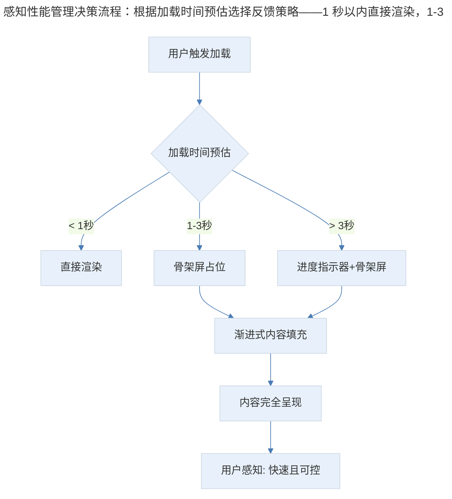
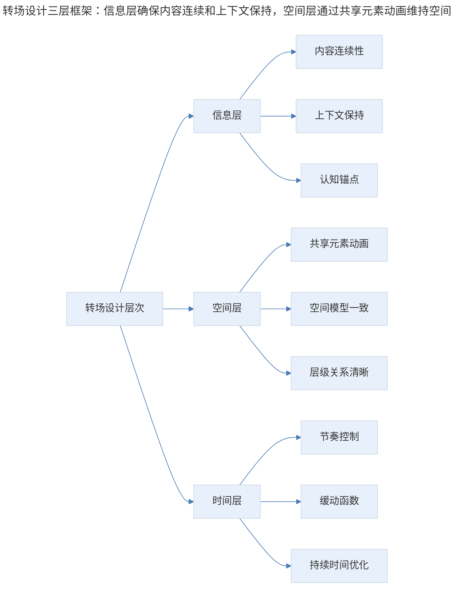
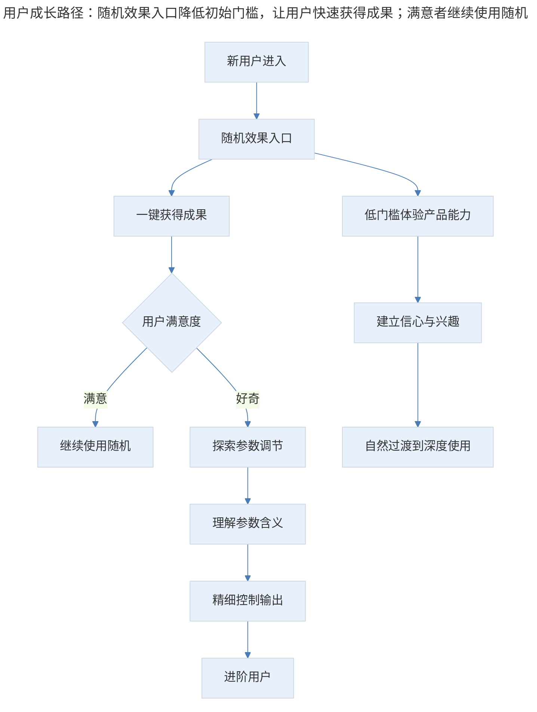
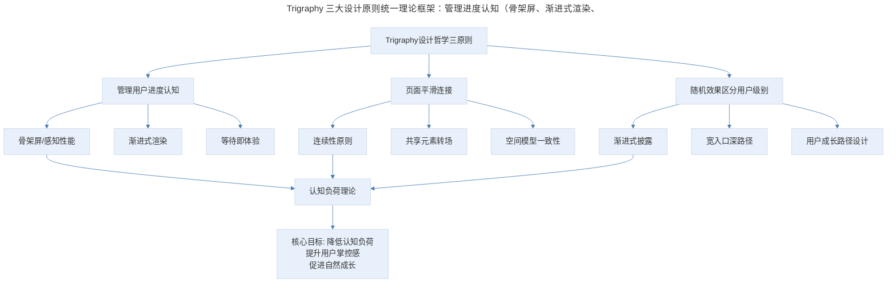

# 03 | 产品案例分析·Trigraphy 的设计哲学

## 1. 导言

Trigraphy 是一款以艺术风格化为核心的图片处理应用，其设计哲学围绕"管理用户认知、平滑页面连接、区分用户级别"三大原则展开。尽管 Trigraphy 本身可能已淡出市场，但其设计思想在当今 AI 图像生成应用中得到了更广泛的延续与升华。从骨架屏到 AI 随机生成，从感知性能优化到渐进式披露，Trigraphy 的三大设计原则依然是现代产品经理必须掌握的基础功法。

> **更新说明**：本文档于 2026-06 更新，主要更新点：补充骨架屏与感知性能管理最新实践；增加 AI 生成类应用（Midjourney/Prisma/Lensa）中随机效果引导的对比分析；引入认知负荷理论与渐进式披露框架；增加专业深度分层与 Mermaid 流程图。

## 2. 核心概念：利用设计管理用户对进度的认知

打开 Trigraphy，启动屏上除了 Logo 之外下面还有三个框，这是占位符。当应用完全打开之后，可以看到这三个格子里面填充了本地的图片。

看起来，结构已预先在启动时完成加载了，第二步才把这些内容加载到结构中，而实际上，启动屏上三个框是画出来的。对于一个 App 来说，点击它的图标打开应用开始加载，在完成加载之前，用户都没有办法参与。加载的过程究竟需要多长时间，用户没办法预期，这个过程对用户来说是失控的。

通过以上的设计，加上一些看起来是加载过程的反馈，这就管理了用户对于加载进度的认知。

### 2.1 从骨架屏到感知性能管理

Trigraphy 的这一做法，正是后来被广泛采用的**骨架屏（Skeleton Screen）**的早期实践。如今，骨架屏已成为移动端和 Web 端的标配设计模式，被 Facebook、LinkedIn、YouTube 等主流应用普遍采用。其核心逻辑并非真正加快加载速度，而是通过**感知性能（Perceived Performance）**优化来降低用户的等待焦虑。

感知性能管理的理论根基来自认知心理学中的**等待时间感知理论**：

- **有反馈的等待 < 无反馈的等待**：用户看到结构在逐步填充，比面对空白屏幕感觉更快
- **有预期的等待 < 无预期的等待**：骨架屏暗示了即将出现的内容类型和布局，降低了不确定性
- **有进度的等待 < 无进度的等待**：渐进式的内容出现比突然的整页加载更让人安心

> 感知性能管理决策流程：根据加载时间预估选择反馈策略——1 秒以内直接渲染，1-3 秒用骨架屏占位，超过 3 秒用进度指示器配合骨架屏，最终让用户产生"快速且可控"的感知。

**图表解读**：感知性能管理决策流程图展示了根据加载时间预估选择不同反馈策略的逻辑。1 秒以内直接渲染即可；1-3 秒区间使用骨架屏占位；超过 3 秒则需要进度指示器配合骨架屏。最终目标是让用户产生"快速且可控"的感知。

### 2.2 现代演进：AI 生成场景下的进度管理

在 AI 图像生成应用（如 Midjourney、DALL·E、Stable Diffusion WebUI）中，等待时间往往长达 10-30 秒，进度管理的挑战更为严峻。当前主流做法包括：

| 应用 | 进度管理策略 | 效果评价 |
|------|------------|----------|
| Midjourney | 从模糊到清晰的渐进式渲染，实时展示生成过程 | ★★★★★ 将等待变为观赏体验 |
| DALL·E | 进度条+预览缩略图 | ★★★☆☆ 中规中矩 |
| Stable Diffusion WebUI | 实时逐行渲染预览 | ★★★★☆ 技术用户偏好 |
| Lensa AI | 骨架屏+百分比进度+预估剩余时间 | ★★★★☆ 面向大众用户友好 |

**关键洞察**：Midjourney 的做法最具启发性——它将"等待"本身转化为"观赏"体验。用户看着图像从噪声中逐步浮现，这个过程本身就具有审美价值和参与感。这比单纯的进度条高明得多，因为它将被动等待变成了主动观察。

### 2.3 专业深度分层

**🟢 基础层**：掌握骨架屏的基本用法，在加载场景中为用户提供结构化占位反馈。

**🟡 进阶层**：理解感知性能理论，能根据加载时长选择合适的反馈策略（骨架屏/进度条/渐进渲染），并量化评估用户等待体验。

**🔴 高阶层**：将等待体验转化为产品价值的一部分（如 Midjourney 的渐进渲染观赏），设计"等待即体验"的创新交互模式，实现从被动等待到主动参与的范式转换。

## 3. 关键方法：如何将两个目的不同的页面更顺滑地连接起来

打开 Trigraphy 之后，界面上有一张大的图片，下面可以看到本地的相册。这个页面的主界面像是一个画板，底下的照片是用户准备处理的素材，好像是用户调色盘一样，这是典型的工具操作页面。

这时，如果向上滑动这张照片，下面的部分会收起来，整个页面上变成一个图片的内容流，上面是各种用 Trigraphy 处理过的照片。也就是说，通过这样的操作把原来的工具操作页面，变成了一个信息流结构。

这是一个很聪明的交互设计，通过一个动效将两个页面的元素平滑地连接在一起，就避免了生硬的页面切换。

### 3.1 页面连接的理论框架：连续性原则与转场设计

Trigraphy 的这一设计体现了格式塔心理学中的**连续性原则（Principle of Continuity）**——人眼倾向于将元素沿着最平滑的路径连接起来。在交互设计中，这一原则被转化为**共享元素转场（Shared Element Transition）**和**空间模型一致性**。

现代转场设计框架可以归纳为以下层次：

> 转场设计三层框架：信息层确保内容连续和上下文保持，空间层通过共享元素动画维持空间模型一致性，时间层控制动画节奏与缓动，三层协同才能实现真正"顺滑"的页面连接。

**图表解读**：转场设计的三层框架——信息层确保内容连续和上下文保持，空间层通过共享元素动画维持空间模型一致性，时间层控制动画节奏与缓动。三层协同才能实现真正"顺滑"的页面连接。

### 3.2 现代案例对比

| 产品 | 页面连接方式 | 设计特点 | 适用场景 |
|------|------------|----------|----------|
| Trigraphy | 上滑切换工具/信息流 | 手势驱动，空间连续 | 工具+社区混合 |
| Instagram | 底部 Tab+故事横向滑 | 模块化导航，手势分层 | 多功能社交平台 |
| TikTok | 上下滑全屏切换 | 极简手势，沉浸式流 | 纯内容消费 |
| Notion | 侧边栏+页面嵌套 | 层级式空间模型 | 知识管理工具 |
| Arc Browser | 空间式标签管理 | 3D 空间隐喻 | 浏览器创新交互 |

**关键洞察**：页面连接方式的选择取决于产品的**信息架构复杂度**和**用户核心路径**。Trigraphy 的做法适合"工具+社区"双模式产品——用户在工具模式中创作，在社区模式中消费，两者通过手势无缝切换。

### 3.3 AI 时代的页面连接新范式

AI 产品的兴起带来了新的页面连接挑战：**对话式界面与传统页面的融合**。例如 ChatGPT 将对话流与工具面板（DALL·E、代码解释器、文件上传）连接，Perplexity 将对话流与引用源面板连接。这类产品的页面连接需要处理"线性对话流"与"并行工具面板"之间的空间关系，是值得持续关注的设计前沿。

### 3.4 专业深度分层

**🟢 基础层**：掌握基本的页面转场设计，避免生硬的页面切换，使用共享元素动画保持视觉连续性。

**🟡 进阶层**：理解转场设计三层框架（信息/空间/时间），能根据产品信息架构选择合适的页面连接方式，并设计手势与动效的协同。

**🔴 高阶层**：在 AI 对话式界面等新范式下，创新性地解决线性流与并行面板的空间连接问题，建立新的交互范式。

## 4. 实践落地：通过随机效果设计区分不同级别的用户

在用 Trigraphy 处理图片的过程中，可以看到有几个不同的艺术效果可以选择，每个艺术效果下面都有一些对应的参数，用户可以自行调整。每个艺术效果的图片上也都有一个筛子，当用户点击时，应用会自动帮用户选择一个参数组合。

全新的用户进入应用后，通过点击筛子，可以立竿见影地看到这个 App 可以做什么，而无需费心调试参数。

当新用户不断按这个筛子，去随机调整参数的时候，会对应用效果有一个比较清楚的预期。此外，这个操作还会勾起用户进一步探索更高级参数设置方法的欲望。

### 4.1 理论框架：渐进式披露与用户成长路径

Trigraphy 的"筛子"设计是**渐进式披露（Progressive Disclosure）**的经典实践。其核心逻辑是：

> 用户成长路径：随机效果入口降低初始门槛，让用户快速获得成果；满意者继续使用随机，好奇者自然过渡到参数探索，最终成为进阶用户。关键在于"不强迫升级，但始终提供升级路径"。

**图表解读**：用户成长路径图展示了从新用户到进阶用户的自然过渡。随机效果入口降低了初始门槛，让用户快速获得成果；满意者继续使用随机，好奇者自然过渡到参数探索，最终成为进阶用户。关键在于"不强迫升级，但始终提供升级路径"。

### 4.2 AI 生成应用中的随机效果引导

在 AI 图像生成应用中，"随机效果引导"变得更加普遍和重要，因为 AI 的参数空间远比传统滤镜复杂：

| 产品 | 随机/低门槛入口 | 进阶控制 | 用户成长路径 |
|------|---------------|----------|-------------|
| Trigraphy | 筛子随机参数 | 手动调参 | 随机→探索→精通 |
| Prisma | 一键风格化 | 风格强度滑块 | 一键→微调 |
| Lensa AI | 预设魔法头像 | 风格选择+数量 | 预设→选择→付费 |
| Midjourney | /imagine prompt | 参数后缀+Remix | 简单提示词→参数控制→Remix 模式 |
| DALL·E | 自然语言描述 | 风格参考+编辑区域 | 描述→参考→精细编辑 |

**关键洞察**：AI 产品的参数空间呈指数级增长，"随机/低门槛入口"的价值不降反升。Midjourney 的成功部分归功于其"简单提示词即可出图"的低门槛设计，同时通过参数后缀、Remix 模式等为进阶用户保留了深度控制空间。这种"宽入口、深路径"的设计哲学是 AI 消费级产品的关键成功因素。

### 4.3 AI 对产品经理工作的影响

在 AI 产品设计中，产品经理需要特别关注：

1. **提示词工程作为新的"参数空间"**：自然语言输入看似降低了门槛，但写出高质量提示词本身就是一种专业技能。产品经理需要设计"提示词模板""风格预设"等低门槛入口，同时为进阶用户保留自由度。

2. **AI 输出的不确定性管理**：AI 生成结果具有随机性，产品经理需要将这种不确定性转化为优势（如"惊喜感"），而非劣势（如"不可控感"）。Trigraphy 的筛子设计思路在此尤为适用。

3. **用户对 AI 能力的认知校准**：新用户往往对 AI 能力有过高或过低的预期，随机效果入口可以帮助用户快速建立对 AI 能力范围的准确认知。

### 4.4 专业深度分层

**🟢 基础层**：理解渐进式披露原则，为不同级别用户设计差异化的功能入口，确保新用户有低门槛上手路径。

**🟡 进阶层**：掌握用户成长路径设计，能在"宽入口"与"深路径"之间取得平衡，利用随机性降低门槛同时激发探索欲。

**🔴 高阶层**：在 AI 产品的不确定性输出场景下，设计创新的"随机→探索→精通"用户成长模型，将 AI 的随机性转化为产品优势，管理用户对 AI 能力的认知预期。

## 5. 实践指南：方法论框架与实战要点

### 5.1 方法论框架

> Trigraphy 三大设计原则统一理论框架：管理进度认知（骨架屏、渐进式渲染、等待即体验）、页面平滑连接（连续性原则、共享元素转场、空间模型一致）、随机效果区分用户级别（渐进式披露、宽入口深路径、用户成长路径）。三者共同底层逻辑是"降低认知负荷"。

**图表解读**：Trigraphy 三大设计原则的统一理论框架。三者的共同底层逻辑是"降低认知负荷"——管理进度认知降低了等待的不确定性负荷，页面平滑连接降低了切换的上下文负荷，随机效果区分用户级别降低了新用户的选择负荷。最终目标是提升用户掌控感并促进自然成长。

### 5.2 实战要点

| 要点 | 说明 | 适用场景 |
|------|------|----------|
| 骨架屏占位 | 加载时展示内容结构占位符，降低等待焦虑 | 1-3 秒加载场景 |
| 渐进式渲染 | 内容逐步填充，将等待变为观赏 | AI 生成等长等待场景 |
| 感知性能优先 | 优化用户感知速度而非仅优化实际速度 | 所有加载场景 |
| 共享元素转场 | 页面切换时保持关键视觉元素连续 | 页面间有视觉关联元素 |
| 手势驱动模式切换 | 通过手势在不同功能模式间平滑切换 | 工具+社区双模式产品 |
| 随机效果入口 | 为新用户提供一键随机功能，降低上手门槛 | 参数空间大的创作工具 |
| 宽入口深路径 | 低门槛入口+深度控制选项并存 | AI 创作类产品 |
| 用户成长路径设计 | 设计从新手到专家的自然过渡路径 | 所有复杂产品 |
| AI 不确定性转化 | 将 AI 输出的随机性转化为惊喜感而非不可控感 | AI 生成类产品 |
| 认知负荷分层 | 根据用户级别控制信息密度和功能复杂度 | 多级别用户产品 |

## 6. 进阶延展：核心要点回顾

### 6.1 核心要点回顾

Trigraphy 的设计哲学围绕三大原则展开：利用设计管理用户对进度的认知（骨架屏、感知性能管理，在 AI 生成场景下延伸为"等待即体验"）、如何将两个目的不同的页面更顺滑地连接起来（连续性原则、共享元素转场，在 AI 时代延伸为对话式界面与传统页面的融合）、通过随机效果设计区分不同级别的用户（渐进式披露、宽入口深路径，在 AI 生成应用中延伸为随机效果引导）。三大原则的共同底层逻辑是"降低认知负荷"——管理进度认知降低等待的不确定性负荷，页面平滑连接降低切换的上下文负荷，随机效果区分用户级别降低新用户的选择负荷。最终目标是提升用户掌控感并促进自然成长。

### 6.2 延伸阅读

- 《Designing for Perception》—— Luke Wroblewski 关于感知性能的系列文章
- 《Progressive Disclosure》—— Nielsen Norman Group 经典研究
- 《The Design of Everyday Things》—— Don Norman，认知负荷与可供性理论
- Midjourney 官方文档—— AI 图像生成的渐进式渲染设计
- 《Animation in UI Design》—— Material Design 动效指南，转场设计最佳实践

## 更新日志

| 版本 | 日期 | 更新内容 |
|------|------|----------|
| v1.0 | 2018 | 初始版本 |
| v2.0 | 2026-06 | 补充骨架屏与感知性能管理最新实践；增加 AI 生成类应用对比分析；引入认知负荷理论与渐进式披露框架；增加 Mermaid 流程图与专业深度分层 |