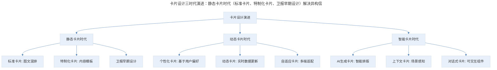
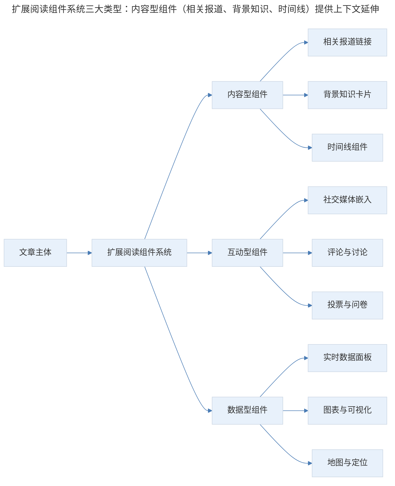
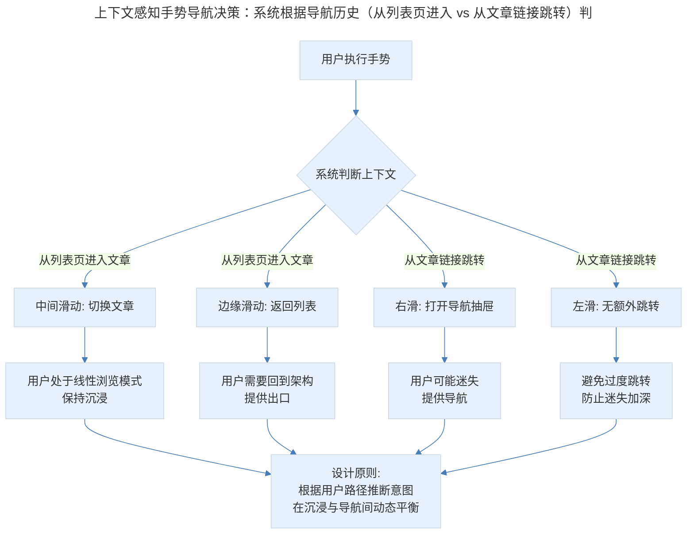
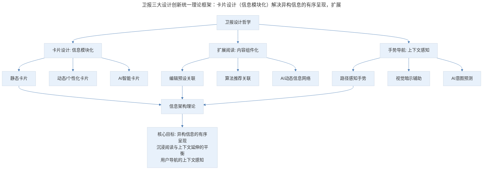

# 06 | 产品案例分析 · The Guardian 的文本之美

## 1. 导言

卫报客户端是传统纸媒数字化转型的标杆案例，其卡片设计、扩展阅读组件化和手势导航三大设计创新，至今仍是内容型产品的设计典范。随着卡片设计演进到个性化与动态化阶段、暗色模式与无障碍设计成为行业标配、AI 驱动的内容排版逐渐成熟，卫报的设计哲学在新时代获得了更丰富的诠释。本文将从理论框架与实战要点两个维度，系统解析卫报的设计思想及其现代演进。

> **更新说明**：本文档于 2026-06 更新，主要更新点：补充卡片设计最新演进（个性化/动态卡片/自适应卡片）；增加暗色模式与无障碍设计趋势分析；引入信息架构理论与组件化设计框架；补充 AI 驱动的内容排版与个性化展示；增加专业深度分层与 Mermaid 流程图。

## 2. 核心概念：卡片设计

卡片本身是一个消化能力较强的设计形式，它可以将不同类型的信息比较整齐地排布在一起。

在卫报客户端首页上，你可以看到有很多不同类型的卡片组合排列。

首先有三种标准卡片。第一种是焦点图组合卡片，有图、有标题，下面还有一些可以横向滑动的卡片元素。第二种小型图的卡片，这种卡片尺寸较小，一行可以放置多个。第三种是纯字的卡片，卡片利用文字的颜色、底色和 Icon 区分不同的样式。

这样的设计之下，即便有大量的文字，整体版面看起来也并不死板。

除了标准卡片还有特制化卡片。这种卡片除了文字或者图片之外，会根据卡片具体内容的模板做出特制化的设计。特制化卡片的设计优点是：虽然信息的类型各异，却能够被卡片系统地整合起来，既规范美观，又不影响内容的形式的丰富性。

在产品设计中，当不同类型与内容的信息需要在同样的架构下展示时，使用卡片可以规范整体的页面版式，使之整齐美观。与此同时，卡片设计也有自己的弊端，你需要根据不同的产品做出最佳的调整。

### 2.1 卡片设计的理论框架

卡片设计的本质是**信息模块化（Information Modularization）**——将异构信息封装为统一的交互单元。其理论基础可以追溯到三个核心理论：

- **格式塔分组原则**：卡片通过边框、阴影、背景色等视觉边界，实现"接近性"与"相似性"分组，帮助用户快速识别信息边界
- **米勒定律（7±2）**：卡片将信息分块呈现，每张卡片承载有限信息量，降低认知负荷
- **卡片隐喻（Card Metaphor）**：源自实体卡片的认知映射，用户天然理解卡片的"拿起、翻转、排列"等交互暗示

> 卡片设计三时代演进：静态卡片时代（标准卡片、特制化卡片、卫报早期设计）解决异构信息统一展示；动态卡片时代（个性化卡片、动态卡片、自适应卡片）引入个性化、实时更新和多端适配；智能卡片时代（AI 生成卡片、上下文卡片、对话式卡片）由 AI 驱动实现自动排版、场景感知和可交互组件化。

**图表解读**：卡片设计经历了三个时代的演进。静态卡片时代以卫报早期设计为代表，解决异构信息的统一展示问题；动态卡片时代引入个性化、实时更新和多端适配；智能卡片时代则由 AI 驱动，实现自动排版、场景感知和可交互组件化。

### 2.2 卡片设计的现代演进

**个性化卡片**：现代内容平台已普遍采用个性化卡片排序。今日头条、Apple News 等应用根据用户阅读历史动态调整卡片的内容、大小和排列顺序。卫报自身也在后续版本中引入了基于用户行为的个性化推荐卡片。

**动态卡片**：体育赛事比分、股票行情、选举计票等实时数据场景催生了动态卡片——卡片内容随数据变化实时更新，无需刷新页面。Apple 的 Live Activities 和 Android 的 Live Widgets 是这一趋势的系统级实现。

**自适应卡片**：Microsoft 提出的 Adaptive Cards 规范定义了一套跨平台卡片渲染标准，同一套卡片 JSON 定义可以在 Teams、Outlook、Cortana 等不同宿主中渲染，体现了卡片作为"跨平台内容单元"的设计理念。

**AI 驱动的卡片排版**：2024-2025 年，AI 自动排版技术开始应用于内容卡片设计。Google 的 Magic Compose、Apple Intelligence 的通知摘要等功能，本质上都是 AI 对卡片内容的智能重组与呈现。

### 2.3 暗色模式与卡片设计

暗色模式（Dark Mode）的普及对卡片设计提出了新的要求：

| 设计要素 | 亮色模式 | 暗色模式 | 注意事项 |
|---------|---------|---------|---------|
| 卡片边界 | 阴影/边框 | 微妙阴影/半透明 | 暗色下阴影效果减弱，需调整 |
| 背景层次 | 白底+灰底 | 深灰底+黑底 | 层次对比需重新校准 |
| 文字对比度 | 深色文字 | 浅色文字 | WCAG AA 标准：对比度≥4.5:1 |
| 图片处理 | 原图 | 可选降低亮度 | 避免图片在暗色环境中过于刺眼 |
| 色彩语义 | 饱和色 | 适度降饱和 | 暗色下高饱和色易产生光晕效应 |

卫报在后续版本中完整支持了暗色模式，其卡片设计在暗色环境下依然保持了良好的层次感和可读性，是内容型产品暗色模式适配的参考案例。

### 2.4 无障碍设计趋势

无障碍设计（Accessibility）已从"加分项"变为"必选项"，欧盟《欧洲无障碍法案》（EAA）于 2025 年 6 月正式生效，要求所有数字产品满足 WCAG 2.1 AA 标准。对卡片设计的影响包括：

- **语义化标记**：卡片需使用正确的 ARIA 角色（article、region 等），确保屏幕阅读器能正确解读
- **焦点管理**：卡片作为交互单元，需有清晰的焦点顺序和焦点样式
- **触摸目标**：卡片内可交互元素的最小触摸区域为 44×44pt（iOS）/48×48dp（Android）
- **色彩无关性**：卡片的状态变化不能仅依赖颜色传达，需配合图标或文字

### 2.5 专业深度分层

**🟢 基础层**：掌握卡片设计的基本模式（标准卡片/特制化卡片），能根据内容类型选择合适的卡片样式，保持页面整齐美观。

**🟡 进阶层**：理解卡片设计的模块化理论，能设计个性化/动态卡片系统，完成暗色模式适配和无障碍基础合规。

**🔴 高阶层**：设计 AI 驱动的智能卡片系统，实现跨平台自适应渲染、场景感知的内容编排，以及对话式可交互卡片组件。

## 3. 关键方法：文章中的扩展阅读

卫报客户端在内容的扩展阅读中也做出了独特的设计，当文中涉及一些延伸阅读的时候，文章里会嵌入像组件一样的东西，帮助用户去理解它的上下文，获取更多的详细信息。

比如，你在阅读一篇文章的同时，可以查看关于某一话题的展开报道，还可以查看到一些常用的问答，在一些文章中，甚至可以直接嵌入 Twitter 的推文。这样一系列的动作会让文章的体验丰富很多，与现实世界的连接也更加鲜活。

在产品设计上，产品经理也可以参考这样的一种方式：以一篇文章为起点，去串连起所有的上下文和背景信息。这样的设计优点可以让读者在一篇文章中获得沉浸阅读，并能够找到更多感兴趣的相关文章。

### 3.1 扩展阅读的组件化设计框架

卫报的扩展阅读设计本质上是**内容组件化（Content Componentization）**的实践——将不同类型的外部信息封装为标准化的嵌入组件，在保持阅读沉浸感的同时提供上下文延伸。

> 扩展阅读组件系统三大类型：内容型组件（相关报道、背景知识、时间线）提供上下文延伸；互动型组件（社交媒体嵌入、评论、投票）引入社交维度；数据型组件（实时数据、图表、地图）增强信息深度，协同构建"以文章为中心的信息网络"。

**图表解读**：扩展阅读组件系统分为三大类型。内容型组件提供上下文延伸（相关报道、背景知识、时间线）；互动型组件引入社交维度（社交媒体嵌入、评论、投票）；数据型组件增强信息深度（实时数据、图表、地图）。三者协同构建了"以文章为中心的信息网络"。

### 3.2 现代演进：从嵌入组件到 AI 驱动的上下文网络

卫报早期的扩展阅读设计依赖编辑手动配置关联内容。如今，AI 技术使扩展阅读实现了质的飞跃：

| 维度 | 传统方式 | AI 驱动方式 |
|------|---------|-----------|
| 内容关联 | 编辑手动配置 | NLP 语义分析自动关联 |
| 个性化程度 | 所有用户相同 | 基于阅读历史的个性化推荐 |
| 实时性 | 发布后固定 | 动态更新，追踪事件进展 |
| 形式丰富度 | 预设组件模板 | AI 生成摘要/时间线/知识图谱 |
| 多语言 | 无 | 自动翻译关联海外报道 |

**关键洞察**：AI 驱动的扩展阅读正在从"编辑预设的关联"走向"算法动态编织的信息网络"。例如，当用户阅读一篇关于气候变化的文章时，AI 可以实时生成该主题的时间线、关联最新进展、推荐不同观点的报道，甚至根据用户的知识水平调整扩展内容的深度。这种"千人千面"的扩展阅读体验，是卫报早期组件化设计的自然延伸。

### 3.3 专业深度分层

**🟢 基础层**：掌握扩展阅读的组件化设计，能设计标准化的嵌入组件（相关链接、背景卡片、社交媒体嵌入），保持阅读沉浸感。

**🟡 进阶层**：理解内容组件化的信息架构原理，能设计多类型组件系统（内容型/互动型/数据型），平衡沉浸阅读与上下文延伸。

**🔴 高阶层**：设计 AI 驱动的动态上下文网络，实现语义关联、个性化推荐、实时更新的扩展阅读系统，构建"以文章为中心的信息网络"。

## 4. 实践落地：手势导航设计

第一个场景：打开列表页后，点击进入一篇文章，如果我们将手指放在屏幕中间向左或向右滑，这样的操作可以切换不同的文章查看详情；如果我们将手指从边缘开始往右划，页面会回到列表页。

从屏幕中间滑和边缘滑动，效果是截然不同的，这是一个非常大胆的设计，优点和缺点都很有争议。

第二个场景：当从一篇文章的链接中跳转到另一篇文章时，如果我们把手指按在中间向左滑的时候，并不会出现更多文章详情跳转；而将手指向右滑的时候，导航抽屉会被打开，你可以从抽屉上定位到后面或者其他类目。

这样的设计十分巧妙，当用户以某篇文章为起点进行探索的时候常常会脱离整体的信息架构。这时用户是迷失在整个架构里面的，所以当我们在右滑的时候，系统会把导航展示给用户。让用户快速找到回家的路。

手势导航的不同是一个非常大胆的设计。因为它造成了一个应用中同样手势的不同反应，也许这样的设计会出现不稳定和混乱的感觉，但对于沉浸阅读来说，它或许又是一个十分优秀的交互设计。

这种设计是完全根据用户路径去判断场景并给出反馈。或许，你可以将这样的思路用在其他产品设计中，扬长避短。

### 4.1 手势导航的理论框架：上下文感知交互

卫报的手势导航设计体现了**上下文感知交互（Context-Aware Interaction）**的核心理念——同一手势在不同上下文中产生不同响应，系统根据用户的导航路径和当前位置推断意图。

> 上下文感知手势导航决策：系统根据导航历史（从列表页进入 vs 从文章链接跳转）判断用户状态（线性浏览 vs 探索迷失），并据此赋予同一手势不同含义——中间滑动切换文章、边缘滑动返回列表、右滑打开导航抽屉、左滑无额外跳转。核心原则是在沉浸阅读与架构导航间动态平衡。

**图表解读**：上下文感知手势导航的决策逻辑。系统根据用户的导航历史（从列表页进入 vs 从文章链接跳转）判断用户当前状态（线性浏览模式 vs 探索迷失状态），并据此赋予同一手势不同的含义。核心原则是在沉浸阅读与架构导航之间动态平衡。

### 4.2 手势导航的现代演进

卫报的大胆设计在当时颇具争议，但这一思路在后续产品中得到了更精细的演化：

| 产品 | 手势创新 | 上下文感知方式 | 争议程度 |
|------|---------|--------------|---------|
| 卫报 | 同手势不同响应 | 基于导航路径 | 高 |
| Instagram | 左滑：DM/相机/地图（不同版本） | 基于版本迭代 | 中 |
| Twitter/X | 右滑回复/转发 | 基于内容区域 | 低 |
| Safari | 边缘滑动返回 | 基于滑动起点 | 低（系统级） |
| 微信读书 | 上下滑切换章节/左右滑翻页 | 基于阅读模式 | 低 |

**关键洞察**：卫报的设计争议核心在于"违反了操作一致性原则"。现代产品更倾向于通过**视觉暗示**而非**隐式规则**来区分手势含义——例如，在可滑动的区域露出边缘提示，或通过微动效预告手势结果。这既保留了上下文感知的灵活性，又降低了用户的认知负担。

### 4.3 AI 时代的手势与交互演进

AI 的引入正在重塑手势交互的边界：

1. **意图预测**：AI 可以根据用户的历史行为模式，预测用户下一步最可能的操作，提前准备界面状态。例如，当 AI 判断用户即将返回列表时，可以预加载列表页。

2. **自适应手势**：AI 可以根据用户的使用习惯，动态调整手势的触发阈值和响应方式。例如，对左撇子用户自动镜像手势方向。

3. **多模态交互融合**：手势与语音、眼动等交互方式的融合。Apple Vision Pro 的眼动+手势交互是这一趋势的前沿代表——用户通过眼睛注视选择目标，通过手指捏合确认操作，实现了更自然的上下文感知。

### 4.4 专业深度分层

**🟢 基础层**：掌握手势导航的基本设计原则，理解操作一致性原则，避免同一手势产生令人困惑的不同响应。

**🟡 进阶层**：理解上下文感知交互理论，能设计基于用户路径的手势差异化响应，并通过视觉暗示降低认知负担。

**🔴 高阶层**：设计 AI 驱动的自适应手势系统，实现意图预测、个性化手势映射和多模态交互融合，在沉浸与导航之间实现动态最优平衡。

## 5. 实践指南：方法论框架与实战要点

### 5.1 方法论框架

> 卫报三大设计创新统一理论框架：卡片设计（信息模块化）解决异构信息的有序呈现，扩展阅读（内容组件化）解决沉浸阅读与上下文延伸的平衡，手势导航（上下文感知）解决用户导航的上下文感知，三者的共同底层是信息架构理论。

**图表解读**：卫报三大设计创新的统一理论框架。卡片设计解决异构信息的模块化呈现，扩展阅读解决沉浸阅读与上下文延伸的平衡，手势导航解决用户导航的上下文感知。三者的共同底层是信息架构理论——如何在复杂信息空间中为用户构建清晰、沉浸且可控的阅读体验。

### 5.2 实战要点

| 要点 | 说明 | 适用场景 |
|------|------|----------|
| 标准卡片+特制化卡片 | 用标准卡片保持一致性，特制化卡片处理特殊内容 | 内容型产品首页 |
| 卡片模块化设计 | 将异构信息封装为统一交互单元 | 多类型内容混合展示 |
| 暗色模式适配 | 重新校准卡片边界、层次和色彩对比度 | 全产品暗色模式支持 |
| 无障碍合规 | 语义化标记、焦点管理、触摸目标、色彩无关性 | 满足 WCAG/EAA 合规要求 |
| 扩展阅读组件化 | 将外部信息封装为标准化嵌入组件 | 长文阅读场景 |
| 内容型/互动型/数据型组件 | 三类组件协同构建信息网络 | 深度内容产品 |
| AI 驱动上下文网络 | 语义关联+个性化推荐+实时更新 | 大规模内容平台 |
| 上下文感知手势 | 根据用户路径赋予同一手势不同含义 | 沉浸式阅读产品 |
| 视觉暗示辅助 | 通过边缘提示、微动效预告手势结果 | 降低手势认知负担 |
| 个性化卡片排序 | 基于用户行为动态调整卡片内容和排列 | 信息流产品 |

## 6. 进阶延展：核心要点回顾

### 6.1 核心要点回顾

卫报客户端的三大设计创新至今仍是内容型产品的设计典范：卡片设计（信息模块化）通过标准卡片与特制化卡片的组合，将异构信息有序呈现，并在现代演进为个性化、动态、自适应与 AI 智能卡片；扩展阅读（内容组件化）通过内容型/互动型/数据型三类组件，在保持阅读沉浸感的同时提供上下文延伸，并在 AI 时代演进为算法动态编织的信息网络；手势导航（上下文感知）根据用户导航路径赋予同一手势不同含义，实现沉浸与导航间的动态平衡。三者的共同底层是信息架构理论。在 2024-2026 年，暗色模式与无障碍设计成为行业标配，AI 驱动的内容排版、意图预测与多模态交互正在进一步丰富卫报的设计哲学。

### 6.2 延伸阅读

- 《Adaptive Cards》—— Microsoft 跨平台卡片设计规范
- 《WCAG 2.2 Guidelines》—— W3C 无障碍设计标准
- 《Information Architecture》—— Louis Rosenfeld 经典信息架构教材
- 《Dark Mode Design Guidelines》—— Material Design 暗色模式指南
- 《Context-Aware Computing》—— Gregory Abowd 上下文感知计算理论

## 更新日志

| 版本 | 日期 | 更新内容 |
|------|------|----------|
| v1.0 | 2018 | 初始版本 |
| v2.0 | 2026-06 | 补充卡片设计最新演进（个性化/动态/智能卡片）；增加暗色模式与无障碍设计分析；引入信息架构理论与组件化设计框架；补充 AI 驱动内容排版；增加 Mermaid 流程图与专业深度分层 |