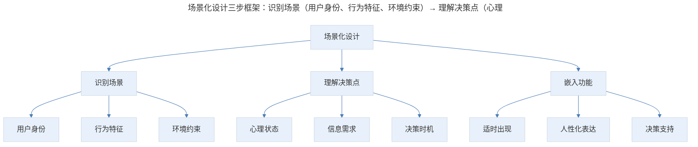
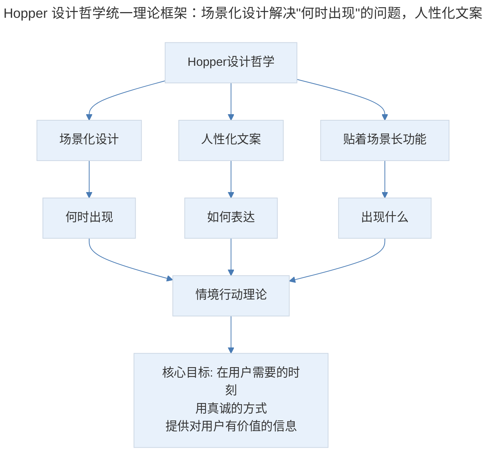

# 09 | 产品案例分析：Hopper 的"人工智能"

## 1. 导言

Hopper 是一款以场景化设计著称的旅行预订应用，其核心设计哲学是"贴着场景长功能"——在用户恰好需要做决定的时刻，以人性化的方式出现并提供帮助。从机票价格预测到酒店/房屋租赁/租车，Hopper 始终坚持用温暖的文案和场景化的交互替代冰冷的图表与表格。在大模型时代，Hopper 的"向场景索要人情味"哲学获得了新的诠释——AI 不是人情味的替代品，而是让人情味规模化交付的基础设施。

> **更新说明**：本文档于 2026-06 更新，主要更新点：补充 Hopper 产品迭代最新动态（酒店/房屋租赁/租车）；增加大模型时代"向技术索要人情味"的新解；引入场景化设计理论框架；补充国内机票预订搭售问题改善与对比分析；增加 AI 对产品经理场景化设计工作的影响；增加专业深度分层与 Mermaid 流程图。

## 2. 核心概念：场景化设计——从用户场景出发的产品哲学

传统旅行机票产品的交互方式一般会要求用户指定往返的时间或地点，在大量的航班信息中做筛选，从而获得有效的信息。

Hopper 的交互方式则截然不同，它不要求用户指定具体时间，甚至连往返地点也无需具体指定；而是希望可以通过自身大数据的分析能力和数据带来的决策引擎，为用户提供合适的旅行计划，同时帮助用户去监控和预测机票价格的变化。

Hopper 的设计非常的场景化，它所有的设计几乎都是顺着场景长出来的。

打开这款应用之后，你会看见两个卡片，上面的卡片有出发和到达地的选择，下面的卡片有个兔子，这其实是两种不同的选择机票和旅行计划的方式，针对的也是两种不同的场景。

### 2.1 场景化设计的理论框架

场景化设计的理论基础可以追溯到**情境行动理论（Situated Action Theory）**——人的行为不是由预先设定的计划驱动，而是由具体情境中的行动构成。在产品设计中，这意味着功能不应从"我们有什么能力"出发，而应从"用户在什么情境下需要什么"出发。


> 场景化设计三步框架：识别场景（用户身份、行为特征、环境约束）→ 理解决策点（心理状态、信息需求、决策时机）→ 嵌入功能（适时出现、人性化表达、决策支持）。核心原则是"功能贴着场景长"。

**图表解读**：场景化设计的三步框架——识别场景、理解决策点、嵌入功能。识别场景需要理解用户身份、行为和环境约束；理解决策点需要洞察用户的心理状态和信息需求；嵌入功能则需要做到适时出现、人性化表达和提供决策支持。核心原则是"功能贴着场景长"。

### 2.2 Hopper 的场景化实践详解

**场景一：明确目的地的价格预测**

首先，我们先来试用上面的模式。选择出发地是北京，到达地选择旧金山。选了出发到达之后，场景直接给出一张日历，这个日历的颜色越浅越便宜，颜色越深就会越贵，这样的设计也是方便用户查看机票价格。

当我们选择 11 月 12 日到 18 日的区间后，跳转画面出现了一只兔子，界面上显示出当前的最低价格是 3860 元人民币，并且，这只兔子在提示：你现在应该预定。底下还有一句话：这不是最好的价格，但如果你继续等，你有可能会要付更多钱。它告诉用户，机票的低谷价格已经过去了，如果有出行的需求，最好尽快预定。

这就是 Hopper 很重要的提示功能。这样的提示以一种非常自然的方式，把信息描述给用户听。整个过程像一个人在跟用户做沟通，而不是一个很生硬的机器去提示用户，并让用户从复杂的信息表格或者图表里去获取到信息。

它用人的口吻去告诉用户注意事项，再配上画面中温暖的大兔子，这样的提示方式会让用户感觉非常温暖。这是这款应用的一个很好的特点，它场景化的设计非常有人情味。

**场景二：灵活出行的方案推荐**

我们选一个其他时间段的机票再看一下，选择 2 月 11 日到 17 日后，当前的最低价格是 5486 元，下面有一句提示：你可以等一等，会有更便宜的价格，但一定要在 2 月 10 号之前买好票。这是 Hopper 监控这段时间，通过分析历史机票价格的变化，给出的一个建议。

这个建议依然是用人类语言自然语言描述的，不是一个非常生硬和冰冷的图表，你会感觉好像真的是一只兔子在跟你交流一样。

在提示的下面出现了三条建议。第一条建议：你可以选择更便宜的旅行时间。如果你在 12 日出发就可以省 525 元，如果你在 11 日之后的一周之内出发，最多可以省 1200 元。第二条建议：你可以选择更便宜的出发机场。从北京走，不妨从天津走，你就可以省 559 元。最后一条建议：你可以选择更便宜的到达机场。

在用户恰好想做决定，甚至是心里刚冒出这个念头的时候，Hopper 都合适地出现提醒，并利用数据分析帮助用户做这样的决策，这是这个产品非常场景化的一种表现。

**场景三：不确定目的地的探索推荐**

再来看第二种场景。这个场景中，用户可以作出不定项的选择。出发的日期可以不定，假期的长度也可以不定。从北京出发，去到哪里也是不定的，用户可以多选，可以随意添加很多想去玩儿的地方。添加之后，Hopper 会生成很多卡片，根据数据的计算，制定好出游的方案。

这种卡片设计很有意思，就好像做探索旅行的攻略一样。用户可以什么都不用拟定，甚至只有一个出行的打算，那么 Hopper 会来帮你，给出你旅行的建议。

## 3. 关键方法：人性化文案——用人的方式说人话

当选定一个城市之后，这个时候会出现一个机票列表，这跟传统的机票预定 App 没有什么太大区别了，需要注意的是，在机票预定的下方，Hopper 依然在给出你提示，只不过换了一种样式，这一次，提示在列表中出现。

Hopper 永远在场景里面去理解你当前的位置，理解你当前的关注点，然后适时地去把它的一些功能嵌入在你实际的使用中，让用户觉得非常不突兀，也很吻合。

在用户选择机票的过程中，Hopper 依然持续地去推荐其他可能的选项，就算是在用户已经决定的情况下，它还是会把一些可能对用户更有利的，可能之前没有关注到的机票推荐给用户。

在选定出发和回程的机票后，在机票的确定界面上，会弹出一个熊的画面去提示：小心。下面有小字：这个航班有可能会有一些比较低的限制。

国内的一些机票预定应用在这个界面会铆足了劲，加一些搭售的选项，比如买保险，买个酒店的抵用券等等；而当 Hopper 出现一些具体限制的时候，它会很温馨地用一句话来提示。并且，这个提示非常的不突兀，它不是弹出一个框，也不是一个巨大的标红，而是用一种很卡通的，很温和的方式来给你这样的提醒。

### 3.1 人性化文案的设计原则

Hopper 的文案设计体现了**对话式信息呈现**的核心理念，其设计原则可以归纳为：

| 原则 | Hopper 实践 | 反面案例 |
|------|-----------|---------|
| 用人的口吻 | "你应该预定"而非"建议预定" | "系统推荐您尽快完成预订" |
| 给出理由 | "低谷价格已过去"而非仅"价格趋势上涨" | 仅显示价格曲线无解读 |
| 提供选择 | 三条替代建议而非单一结论 | "最低价为 XXX"无替代方案 |
| 温和提醒 | 卡通熊+小字而非弹窗+标红 | 红色警告框"注意：有限制条件" |
| 适时出现 | 在决策节点嵌入而非全屏弹窗 | 打开 App 即弹窗推荐 |

### 3.2 国内机票预订搭售问题的改善

原文提到的国内机票搭售问题，在 2017-2018 年间曾引发广泛争议（携程、去哪儿等被曝光默认搭售保险、酒店券等）。此后行业经历了显著改善：

- **2018 年**：民航局发布《关于改进民航票务服务工作的通知》，明确要求航空公司和销售代理不得搭售
- **2019-2020 年**：各大 OTA 平台陆续将搭售选项改为默认不勾选，并提供"裸票"购买选项
- **2021-2023 年**：搭售问题基本得到遏制，但以"会员权益""加速包"等变相形式仍偶有出现
- **2024-2025 年**：行业整体规范，消费者维权意识增强，搭售空间进一步压缩

**关键洞察**：Hopper 的温和提醒与国内 OTA 的搭售推销，本质上是两种截然不同的产品价值观——前者在用户决策点提供对用户有利的信息，后者在用户决策点插入对平台有利的选择。场景化设计的"场景"应该是用户的场景，而非平台的场景。

## 4. 实践落地：Hopper 的产品迭代与演进

Hopper 自原文撰写以来经历了重大产品迭代：

| 时间 | 迭代内容 | 设计哲学延续 |
|------|---------|-------------|
| 2018-2019 | 新增酒店预订，引入"价格冻结"功能 | 场景化价格预测延伸至酒店 |
| 2020-2021 | 新增房屋租赁（Home Swap），疫情期间灵活退改 | 场景化应对疫情不确定性 |
| 2022-2023 | 新增租车预订，推出 Hopper Cloud B2B 平台 | 场景化覆盖全旅行链路 |
| 2024-2025 | AI 驱动的个性化推荐增强，引入对话式客服 | 人性化文案+AI 规模化交付 |

Hopper 从单一的机票价格预测工具，演进为覆盖机票、酒店、租车、房屋租赁的全链路旅行平台，但其核心设计哲学——"贴着场景长功能"——始终未变。每新增一个品类，都是对新的用户场景的识别和响应。

### 4.1 大模型时代"向技术索要人情味"的新解

在 Hopper 中，可以具体化看出产品经理常说的：场景是需求的灵魂，我们需要让产品和功能贴着需求与场景长出来。Hopper 所有的交互过程正是这样，每一处都是与场景相吻合，在用户想做决定的时候，恰好的出现。

谈及人工智能，我们会做很多的交互，试图让机器用人的方式去跟用户交流，去跟用户说人话。但是，事实上很多这样的产品，反倒给人一种冰冷而生硬的感觉。

反观 Hopper 这个产品，它似乎也看不到什么人工智能，但是通过处理文案，处理产品的细节，反倒把这个应用做得非常有人情味，特别温和。当你在使用 Hopper 的时候，你的感觉是在跟一个了解你"正在想什么"的人在做沟通。

在这个人工智能时代，在我们向技术去索要人情味之前，我们可能更多地需要向产品、向用户的场景去要一些人情味，这就是 Hopper 带给产品人最大的启发。

```mermaid
---
title: "向技术索要人情味"的时代演进：前大模型时代，技术限制使机器难以说人话，Hopp
---
%%{init: {"theme": "base", "themeVariables": {"primaryColor": "#E8F1FB", "lineColor": "#4A7CB5"}}}%%
flowchart TD
    A["向技术索要人情味"] --> B["前大模型时代"]
    A --> C["大模型时代"]

    B --> B1["技术限制: 机器难以说人话"]
    B --> B2["解法: 文案+设计模拟人情味"]
    B --> B3["Hopper: 创新实践"]

    C --> C1["技术突破: 机器轻易说人话"]
    C --> C2["新问题: 人话泛滥, 真情稀缺"]
    C --> C3["新解法: 场景理解+真诚表达+适度克制"]

    B2 --> D["核心洞察"]
    C3 --> D

    D --> E["人情味 ≠ 说人话<br/>人情味 = 在正确场景用真诚方式提供有价值信息"]
```
> "向技术索要人情味"的时代演进：前大模型时代，技术限制使机器难以说人话，Hopper 通过文案和设计模拟人情味是创新；大模型时代，机器轻易说人话，但"人话泛滥"导致真情稀缺，新的解法是场景理解+真诚表达+适度克制。核心洞察：人情味不等于说人话，而等于在正确场景用真诚方式提供有价值信息。

**图表解读**："向技术索要人情味"在不同时代的理解。前大模型时代，技术限制使机器难以说人话，Hopper 通过文案和设计模拟人情味是创新。大模型时代，机器轻易说人话，但"人话泛滥"导致真情稀缺，新的解法是场景理解+真诚表达+适度克制。核心洞察：人情味不等于说人话，而等于在正确场景用真诚方式提供有价值信息。

### 4.2 大模型时代的三个关键认知

1. **"说人话"是必要条件而非充分条件**：ChatGPT、Claude 等大模型可以生成流畅自然的人类语言，但这不等于人情味。当 AI 客服用完美的语言说"我理解您的感受"却无法解决实际问题时，这种"人话"比机器语言更令人反感。

2. **场景理解是人情的根基**：Hopper 的人情味来自它"知道你在想什么"——在用户犹豫是否等更低价格时给出建议，在用户可能忽略限制条件时温和提醒。大模型可以更精准地理解场景，但前提是产品设计者先识别出这些场景。

3. **适度克制是最高级的人情味**：Hopper 用卡通熊+小字而非弹窗+标红来提醒限制条件，这种克制本身就是对用户的尊重。大模型时代，AI 可以生成大量"贴心"内容，但过度关怀反而令人窒息。

## 5. 实践指南：AI 对产品经理场景化设计工作的影响与方法论框架

### 5.1 AI 对产品经理场景化设计工作的影响

1. **场景识别的 AI 辅助**：AI 可以分析用户行为数据，自动识别高频场景和决策节点，帮助产品经理更系统地发现"功能应该长在哪里"。

2. **文案生成的 AI 辅助**：大模型可以根据场景和用户状态生成个性化文案，实现 Hopper 式人性化表达的规模化交付。但产品经理需要把控文案的"真诚度"和"克制度"。

3. **A/B 测试的 AI 加速**：AI 可以快速生成多种文案变体并进行自动化测试，找到最有效的表达方式，但需警惕"效果最优"不等于"最有人情味"。

4. **场景化功能的 AI 驱动**：AI 可以根据实时场景动态调整功能呈现，实现"千人千场景"的个性化体验，这是 Hopper 早期设计哲学的终极延伸。

### 5.2 方法论框架


> Hopper 设计哲学统一理论框架：场景化设计解决"何时出现"的问题，人性化文案解决"如何表达"的问题，贴着场景长功能解决"出现什么"的问题，三者的共同底层是情境行动理论——人的行为由情境驱动，产品功能也应由情境驱动。

**图表解读**：Hopper 设计哲学的统一理论框架。场景化设计解决"何时出现"的问题，人性化文案解决"如何表达"的问题，贴着场景长功能解决"出现什么"的问题。三者的共同底层是情境行动理论——人的行为由情境驱动，产品功能也应由情境驱动。核心目标是在用户需要的时刻，用真诚的方式，提供对用户有价值的信息。

### 5.3 实战要点

| 要点 | 说明 | 适用场景 |
|------|------|----------|
| 场景优先设计 | 从用户场景出发设计功能，而非从技术能力出发 | 所有产品功能规划 |
| 决策点嵌入 | 在用户决策的关键时刻嵌入功能和建议 | 交易/选择类场景 |
| 人性化文案 | 用人的口吻、给出理由、提供选择 | 所有用户提示和引导 |
| 温和克制提醒 | 用温和方式提醒风险，而非恐吓式警告 | 风险提示/限制说明 |
| 适时出现原则 | 在用户需要的时刻出现，不过早不过晚 | 功能推荐/信息提示 |
| 反搭售思维 | 在决策点提供对用户有利的信息，而非对平台有利的选择 | 交易类产品 |
| 场景跟随设计 | 功能持续跟随用户场景变化，动态调整 | 多步骤流程产品 |
| AI 辅助场景识别 | 利用 AI 分析行为数据，自动识别高频场景 | 大规模用户产品 |
| AI 文案规模化 | 大模型生成个性化文案，实现人性化表达规模化 | 个性化推荐产品 |
| 克制即尊重 | 适度克制是最高级的人情味，避免过度关怀 | AI 客服/智能助手 |

## 6. 进阶延展：核心要点回顾

### 6.1 核心要点回顾

Hopper 的核心设计哲学是"贴着场景长功能"——在用户恰好需要做决定的时刻，以人性化的方式出现并提供帮助。其场景化设计基于情境行动理论，通过识别场景、理解决策点、嵌入功能，实现在用户决策点的适时出现；人性化文案通过用人的口吻、给出理由、提供选择、温和提醒，实现对话式信息呈现。在 2024-2025 年，Hopper 从单一机票价格预测工具演进为覆盖机票、酒店、租车、房屋租赁的全链路旅行平台，但核心设计哲学始终未变。在大模型时代，"向技术索要人情味"获得新解——人情味不等于说人话，而等于在正确场景用真诚方式提供有价值信息；AI 不是人情味的替代品，而是让人情味规模化交付的基础设施。

### 6.2 延伸阅读

- 《Situated Action Theory》—— Lucy Suchman，情境行动理论经典著作
- 《Predictably Irrational》—— Dan Ariely，行为经济学与决策心理学
- 《Don't Make Me Think》—— Steve Krug，场景化可用性设计
- Hopper 官方博客—— 价格预测算法与场景化设计实践
- 《Designing for Trust》—— 暗黑模式与信任设计研究

## 更新日志

| 版本 | 日期 | 更新内容 |
|------|------|----------|
| v1.0 | 2018 | 初始版本 |
| v2.0 | 2026-06 | 补充 Hopper 产品迭代动态；增加大模型时代"向技术索要人情味"新解；引入场景化设计理论框架；补充国内搭售问题改善分析；增加 AI 对场景化设计影响；增加 Mermaid 流程图与专业深度分层 |