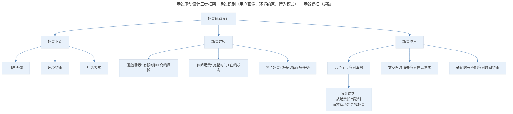
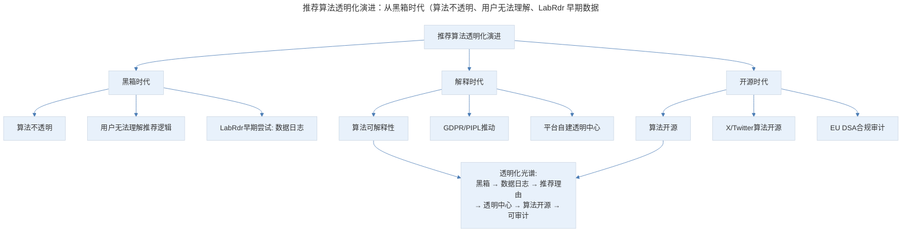
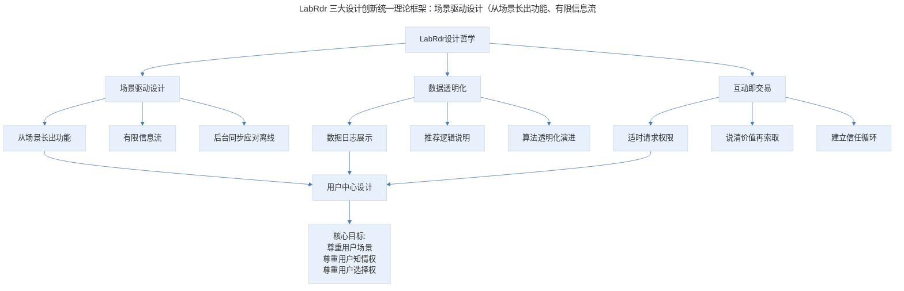

# 12 | 产品案例分析：LabRdr 的设计实验

## 1. 导言

LabRdr 是卫报移动创新实验室开发的实验性新闻阅读应用，其三大设计创新——从用户场景出发贴着场景设计产品、用户数据收集透明化处理、互动即交易——至今仍是产品设计的核心原则。在 GDPR 与《个人信息保护法》时代，数据透明化已从设计选择变为法律义务；在注意力经济反思浪潮中，LabRdr 的"有限信息流"设计获得了新的理论支撑；在推荐算法透明化运动中，LabRdr 的数据日志设计成为行业标杆。本文将系统解析 LabRdr 的设计思想及其在新时代的演进。

> **更新说明**：本文档于 2026-06 更新，主要更新点：补充 GDPR/个人信息保护法下数据透明化的法律视角；增加推荐算法透明化最新实践（X/Twitter 算法开源、EU DSA 合规）；引入注意力经济与数字健康讨论；补充 AI 驱动的隐私合规与透明化工具；增加专业深度分层与 Mermaid 流程图。

## 2. 核心概念：从用户场景出发，贴着场景设计产品

在第一次使用这款应用的时候，LabRdr 会问你几个问题。第一个问题是你早晚的通勤开始时间，也就是上班时间和下班时间；第二个问题是问，你花在早晚通勤上的时间长度，你可以分别作出选择。在此之后，LabRdr 会根据你的选择，为你挑选适合你通勤长度的文章集合，在你每天早晨和晚上通勤开始的时候推送给你。

在这里，LabRdr 有一个有趣的特性，就是它的文章同步是在后台进行的。这应对的是一个什么样的场景呢：我们出门坐地铁或者其他交通工具，手机有可能会没有信号。这时我们一般会在上地铁之前先打开离线一些数据，然后在地铁上读；LabRdr 在后台同步的功能就会离线下载，用户也就无需打开应用手动下载。

这是 LabRdr 整个的设计起点。就像我在之前分享 Hopper 的时候提到，越来越多的产品在改变自己的设计起点，产品不再从我们有什么出发，而是从用户需要和用户场景出发。LabRdr 就是这样，它不是将大量的新闻分类排序，和盘托出摆在用户面前；而是去理解用户阅读新闻的场景，从场景里面长出功能。

我们可以看到 LabRdr 上的文章并不会一直保留。当一天过去后，这一天文章集合就会消失不见，这跟传统的新闻客户端永无止境拉不到头的时间线形成了鲜明的对比。

这个设计跟我们做的 Readhub 有些类似，我们不希望对用户来说，信息是无尽的，它只会让用户消耗更多无意义的时间，并陷入到信息焦虑中。

### 2.1 场景驱动设计的理论框架

LabRdr 的设计起点体现了**场景驱动设计（Context-Driven Design）**的方法论，与 Hopper 的场景化设计一脉相承，但侧重点不同：Hopper 侧重在场景中嵌入功能，LabRdr 侧重从场景中生长产品。


> 场景驱动设计三步框架：场景识别（用户画像、环境约束、行为模式）→ 场景建模（通勤场景：有限时间+离线风险、休闲场景、碎片场景）→ 场景响应（后台同步应对离线、文章限时消失应对信息焦虑、通勤时长匹配应对时间约束）。核心原则是从场景长出功能而非从功能寻找场景。

**图表解读**：场景驱动设计的三步框架。场景识别关注用户画像、环境约束和行为模式；场景建模将识别结果转化为具体场景描述；场景响应针对每个场景设计功能。LabRdr 的三个核心功能（后台同步、限时消失、时长匹配）分别对应通勤场景的三个约束（离线风险、信息焦虑、时间有限）。

### 2.2 注意力经济与"有限信息流"设计

LabRdr 的"文章限时消失"设计在注意力经济反思浪潮中获得了新的理论支撑：

**注意力经济的批判性反思**：

- **Tristan Harris 的"时间很好"运动**（2016-至今）：前 Google 设计伦理学家发起，呼吁科技公司从"争夺注意力"转向"尊重用户时间"
- **屏幕时间管理工具普及**：Apple Screen Time（2018）、Android Digital Wellbeing（2018）的推出，标志着行业开始正视注意力过度消耗问题
- **无限滚动的争议**：2022 年，美国国会提出法案要求社交媒体平台关闭无限滚动等"成瘾性设计"
- **EU《数字服务法》（DSA）**：2024 年全面实施，要求大型平台评估其设计对用户心理健康的影响

**LabRdr 的"有限信息流"设计哲学**与上述趋势高度一致——它主动限制了信息供给量，避免了无限时间线带来的信息焦虑和注意力消耗。这一设计在当今"信息过载"的环境下更具价值。

| 设计选择 | 无限时间线（传统） | 有限信息流（LabRdr） | 理论依据 |
|---------|------------------|-------------------|---------|
| 信息量 | 无限 | 有限 | 希克定律：选择越多，决策越难 |
| 时间线 | 永无止境 | 每日清零 | 蔡格尼克效应：未完成更易记住 |
| 用户心理 | FOMO（错失恐惧） | 满足感 | 稀缺性原理：有限更显珍贵 |
| 行为模式 | 无意识刷屏 | 有意识阅读 | 心流理论：适度挑战产生沉浸 |

### 2.3 专业深度分层

**🟢 基础层**：理解场景驱动设计的基本思路，能从用户场景出发规划功能，而非从技术能力出发。

**🟡 进阶层**：掌握场景识别、建模、响应的系统方法，能设计"有限信息流"等对抗注意力经济的产品策略。

**🔴 高阶层**：在注意力经济与数字健康的宏观语境下，设计系统性的"尊重用户时间"产品策略，平衡商业目标与用户福祉。

## 3. 关键方法：用户收集数据的透明化处理

除了场景化的新闻阅读功能之外，LabRdr 还有另一个我认为非常出色的处理，它会将用户数据的收集透明化。

我们刚才提到 LabRdr 会根据用户的喜好给用户推荐新闻，这类功能又叫个性化推荐，很多的新闻客户端都能做到。但以往的个性推荐算法通常是个黑箱。有时候我们误点了一些文章，导致算法认为我们喜欢这样的主题，然后时间线里头不断会出现更多此类文章。进而又增加了误点的风险。最后，误点越来越多，推荐也越来越飘逸。

LabRdr 会将你阅读过的所有文章，按类别放在日志里；并且明确地告诉你，这是根据这些数据来对你的喜好进行猜测的。这种将逻辑和规则开放给用户的设计，会让用户有控制感和安全感。

### 3.1 数据透明化的法律视角：从设计选择到法律义务

LabRdr 的数据透明化设计在原文撰写时还是一种前瞻性的设计选择，但在 GDPR（2018 年 5 月生效）和《个人信息保护法》（2021 年 11 月生效）之后，已变为法律义务。

**GDPR 的透明化要求**：

- **知情权（Article 13-14）**：数据控制者必须以清晰、简明的语言告知用户数据处理的范围、目的和逻辑
- **访问权（Article 15）**：用户有权获取其个人数据的副本
- **解释权（Article 22）**：对于自动化决策，用户有权获得"有意义的信息，关于所涉及的逻辑"
- **数据可携带权（Article 20）**：用户有权以结构化格式获取其数据

**《个人信息保护法》的透明化要求**：

- **第七条**：处理个人信息应当遵循公开、透明原则
- **第二十四条**：利用个人信息进行自动化决策，应当保证决策的透明度和结果公平、公正；通过自动化决策方式向个人进行信息推送、商业营销，应当同时提供不针对其个人特征的选项，或者提供便捷的拒绝方式
- **第四十八条**：个人有权要求个人信息处理者对其个人信息处理规则进行解释说明

**关键洞察**：LabRdr 的数据日志设计——将用户阅读历史按类别展示并说明推荐逻辑——实际上已经超前满足了 GDPR 和《个人信息保护法》的核心透明化要求。这证明了好的设计往往领先于法规，而法规的出台则使好的设计成为行业底线。

### 3.2 推荐算法透明化的最新实践

LabRdr 的透明化设计在近年来获得了更广泛的行业响应：


> 推荐算法透明化演进：从黑箱时代（算法不透明、用户无法理解、LabRdr 早期数据日志尝试）到解释时代（算法可解释性、GDPR/PIPL 推动、平台自建透明中心）再到开源时代（算法开源、X/Twitter 算法开源、EU DSA 合规审计）。透明化光谱从黑箱到可审计。

**图表解读**：推荐算法透明化的演进路径。从黑箱时代（算法不透明、用户无法理解），到解释时代（GDPR 推动、平台自建透明中心），再到开源时代（X/Twitter 算法开源、EU DSA 合规审计）。透明化光谱从黑箱到可审计，LabRdr 的数据日志设计处于光谱的早期位置，但方向正确。

**重要案例**：

| 案例 | 时间 | 透明化实践 | 意义 |
|------|------|-----------|------|
| LabRdr 数据日志 | 2017 | 展示阅读历史+推荐逻辑 | 前瞻性设计 |
| Instagram "为什么看到这则广告" | 2019 | 展示广告定向依据 | 大平台跟进 |
| TikTok 透明中心 | 2020 | 内容审核与推荐算法说明 | 回应监管压力 |
| X/Twitter 算法开源 | 2023 | 推荐算法代码在 GitHub 开源 | 行业首次 |
| EU DSA 合规 | 2024 | 大型平台需接受独立审计 | 法律强制 |
| Apple App 隐私营养标签 | 2020- | 数据收集类型可视化 | 系统级透明 |

### 3.3 AI 驱动的隐私合规与透明化工具

AI 技术在数据透明化领域既是挑战也是机遇：

**挑战**：AI 推荐系统比传统算法更复杂、更难解释。深度学习模型的"黑箱"特性与透明化要求之间存在根本性张力。

**机遇**：AI 也可以帮助实现更好的透明化：

- **自动化隐私影响评估**：AI 扫描产品功能，自动识别隐私风险点
- **自然语言解释生成**：大模型将算法逻辑翻译为用户可理解的自然语言
- **异常检测**：AI 监控推荐结果，识别可能的偏见或歧视性输出
- **合规自动化**：AI 辅助生成 GDPR/PIPL 合规文档和用户告知文本

### 3.4 专业深度分层

**🟢 基础层**：理解数据透明化的基本设计方法（数据日志、推荐理由展示），满足用户知情权。

**🟡 进阶层**：掌握 GDPR/PIPL 的透明化合规要求，能设计满足法律义务的透明化方案，平衡透明度与商业机密。

**🔴 高阶层**：在 AI 推荐系统的复杂性下，设计创新的透明化机制（算法可解释性、自然语言解释、合规自动化），在透明化光谱上找到最优位置。

## 4. 实践落地：产品和用户的每一次互动，其实都是一次交易

很多应用并没有讲清楚自己为什么需要请求推送权限，只要一打开应用，它们就要求用户开启这款应用的通知推送设置，这样的做法其实会让转化率会受到很大的影响，而 LabRdr 请求用户开启通知推送的时机却选择得十分巧妙。

选择向用户请求推送的时机十分重要。我们首先需要让用户了解到：推送是可以带来直接价值的。这时一定要说清楚，应用会在什么样的时机推送什么样的内容，对用户有什么样的好处。

产品和用户的每一次互动，其实都是一次交易。不论是购买一个产品，还是使用一个功能，我们需要用户付出他的时间、精力或者其他资源。这时候，我们就必须要说清产品究竟可以给他带来什么价值，只有当这个价值高于用户对于自己所付出资源的成本预期时，交易才会顺利地进行。

### 4.1 "互动即交易"的理论框架

"互动即交易"的设计原则可以从**社会交换理论（Social Exchange Theory）**和**心理账户（Mental Accounting）**两个角度理解：

```mermaid
---
title: "互动即交易"分析框架：用户付出注意力、认知、隐私、行动四类成本，产品提供功能、
---
%%{init: {"theme": "base", "themeVariables": {"primaryColor": "#E8F1FB", "lineColor": "#4A7CB5"}}}%%
flowchart TD
    A["互动即交易"] --> B["用户付出的成本"]
    A --> C["产品提供的价值"]
    A --> D["交易达成条件"]

    B --> B1["注意力成本"]
    B --> B2["认知成本"]
    B --> B3["隐私成本"]
    B --> B4["行动成本"]

    C --> C1["功能价值"]
    C --> C2["信息价值"]
    C --> C3["情感价值"]
    C --> C4["社交价值"]

    D --> D1["价值 > 成本预期"]
    D --> D2["价值可感知"]
    D --> D3["价值可信任"]

    D1 --> E["设计原则:<br/>在请求之前先给予<br/>在索取之时说清价值<br/>在互动之中建立信任"]
```
> "互动即交易"分析框架：用户付出注意力、认知、隐私、行动四类成本，产品提供功能、信息、情感、社交四类价值。交易达成条件是价值大于成本预期、价值可感知、价值可信任。设计原则是在请求之前先给予、在索取之时说清价值、在互动之中建立信任。

**图表解读**："互动即交易"的分析框架。用户付出的成本包括注意力、认知、隐私和行动四类；产品提供的价值包括功能、信息、情感和社交四类。交易达成的条件是价值大于成本预期、价值可感知、价值可信任。设计原则是：在请求之前先给予，在索取之时说清价值，在互动之中建立信任。

### 4.2 推送权限请求的最佳实践

LabRdr 的推送权限请求时机选择是"互动即交易"的经典案例。现代产品设计中，推送权限请求的最佳实践已形成系统化方法：

| 策略 | 说明 | 转化率影响 | 案例 |
|------|------|-----------|------|
| 首次打开即请求 | 用户尚未感知价值 | 低（30-40%） | 传统做法 |
| 功能触发时请求 | 用户刚体验相关功能 | 中（50-60%） | LabRdr |
| 价值展示后请求 | 先展示推送带来的具体价值 | 高（70-80%） | 现代最佳实践 |
| 渐进式请求 | 先请求轻度权限，逐步升级 | 最高（80%+） | iOS 定位权限 |

**关键洞察**：iOS 14.5+ 的 App Tracking Transparency 框架将"互动即交易"原则提升到了系统级——应用必须先获得用户授权才能追踪跨应用行为。统计数据显示，当应用在展示价值后再请求追踪权限时，授权率从约 25% 提升至约 50% 以上，验证了"先给予再索取"的有效性。

### 4.3 AI 时代的"互动即交易"新维度

AI 产品引入了新的"交易"维度——**用户数据作为 AI 训练的隐性成本**：

1. **数据使用透明化**：用户与 AI 产品的互动中，其数据可能被用于模型训练。产品经理需要明确告知数据用途，让用户做出知情选择。

2. **AI 幻觉的信任成本**：当 AI 给出错误信息时，用户的信任成本急剧上升。产品经理需要设计"置信度提示"和"事实核查"机制，降低用户的信任风险。

3. **个性化与隐私的平衡**：AI 越了解用户，服务越精准，但隐私成本也越高。产品经理需要设计"可调节的个性化"——让用户自主选择隐私-个性化平衡点。

### 4.4 专业深度分层

**🟢 基础层**：理解"互动即交易"的基本原则，在请求用户资源时说清价值，选择合适的请求时机。

**🟡 进阶层**：掌握社会交换理论和心理账户框架，能系统分析用户成本与产品价值，设计渐进式权限请求策略。

**🔴 高阶层**：在 AI 产品的新维度下（数据使用透明化、AI 幻觉信任成本、个性化-隐私平衡），设计创新的"互动即交易"机制，实现用户与产品的可持续价值交换。

## 5. 实践指南：方法论框架与实战要点

### 5.1 方法论框架


> LabRdr 三大设计创新统一理论框架：场景驱动设计（从场景长出功能、有限信息流、后台同步）尊重用户场景，数据透明化（数据日志展示、推荐逻辑说明、算法透明化演进）尊重用户知情权，互动即交易（适时请求权限、说清价值再索取、建立信任循环）尊重用户选择权。共同底层是"用户中心设计"。

**图表解读**：LabRdr 三大设计创新的统一理论框架。场景驱动设计尊重用户场景，数据透明化尊重用户知情权，互动即交易尊重用户选择权。三者的共同底层是"用户中心设计"——将用户视为有自主权的个体，而非被动的内容消费者或数据来源。

### 5.2 实战要点

| 要点 | 说明 | 适用场景 |
|------|------|----------|
| 场景驱动设计 | 从用户场景出发生长功能，而非从技术能力出发 | 产品功能规划 |
| 有限信息流 | 主动限制信息供给量，对抗注意力经济 | 内容型产品 |
| 后台同步 | 预判离线场景，提前同步数据 | 弱网环境产品 |
| 数据日志展示 | 将用户数据收集情况可视化展示 | 个性化推荐产品 |
| 推荐逻辑说明 | 用自然语言解释推荐依据 | 算法推荐产品 |
| GDPR/PIPL 合规 | 满足法律要求的透明化义务 | 面向欧盟/中国市场的产品 |
| 算法透明中心 | 建立独立的算法透明化页面 | 大型平台产品 |
| 适时请求权限 | 在用户感知价值后再请求权限 | 所有需要权限的产品 |
| 先给予再索取 | 在请求用户资源前先展示价值 | 用户引导流程 |
| AI 数据使用透明 | 明确告知用户数据是否用于 AI 训练 | AI 产品 |

## 6. 进阶延展：核心要点回顾

### 6.1 核心要点回顾

LabRdr 的三大设计创新至今仍是产品设计的核心原则：场景驱动设计（从用户场景长出功能，通过后台同步、有限信息流、通勤时长匹配应对通勤场景的离线、信息焦虑与时间约束，并在注意力经济反思浪潮中获得新的理论支撑）、数据透明化（通过数据日志展示阅读历史与推荐逻辑，在 GDPR 与《个人信息保护法》时代从设计选择变为法律义务，并演进为推荐算法透明化的行业标杆）、互动即交易（通过适时请求权限、说清价值再索取，实现用户与产品的价值交换）。三者的共同底层是"用户中心设计"——尊重用户场景、尊重用户知情权、尊重用户选择权。在 2024-2026 年，AI 驱动的隐私合规工具、算法开源与多模态透明化正在进一步丰富 LabRdr 的设计哲学。

### 6.2 延伸阅读

- 《GDPR Article 22》—— 自动化决策的透明化要求
- 《个人信息保护法》—— 中国数据保护法律框架
- 《The Age of Surveillance Capitalism》—— Shoshana Zuboff，注意力经济批判
- 《How We Got Here》—— X/Twitter 算法开源文档
- 《Social Exchange Theory》—— George Homans，社会交换理论经典

## 更新日志

| 版本 | 日期 | 更新内容 |
|------|------|----------|
| v1.0 | 2018 | 初始版本 |
| v2.0 | 2026-06 | 补充 GDPR/PIPL 法律视角；增加推荐算法透明化最新实践；引入注意力经济与数字健康讨论；补充 AI 驱动隐私合规工具；增加 Mermaid 流程图与专业深度分层 |