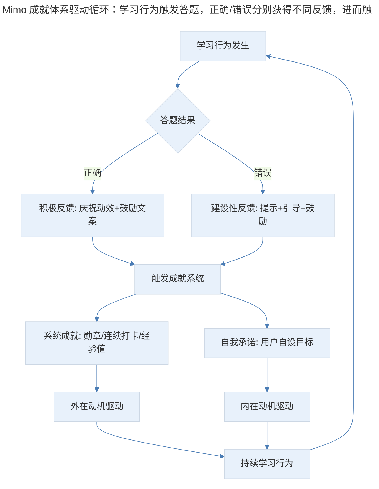
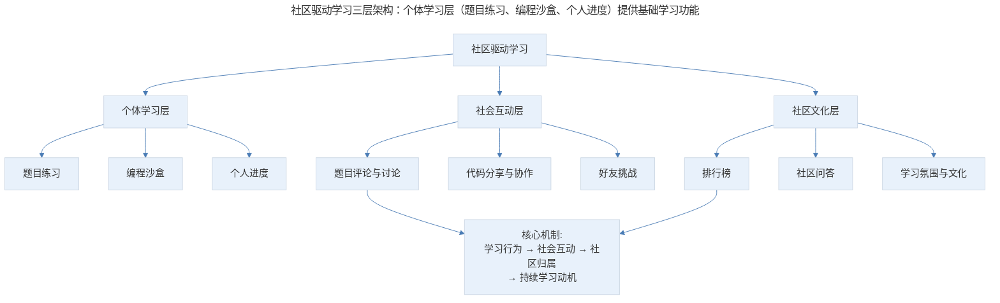
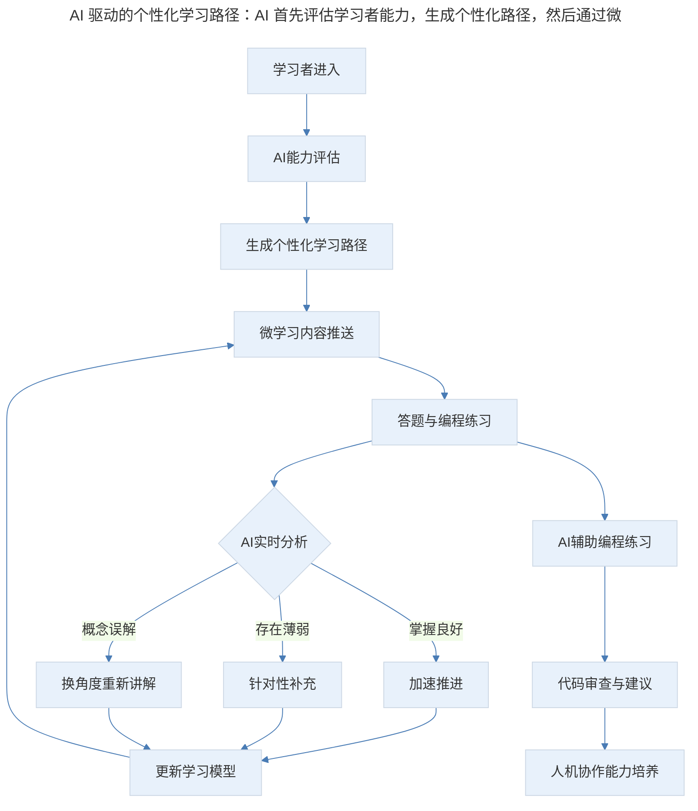
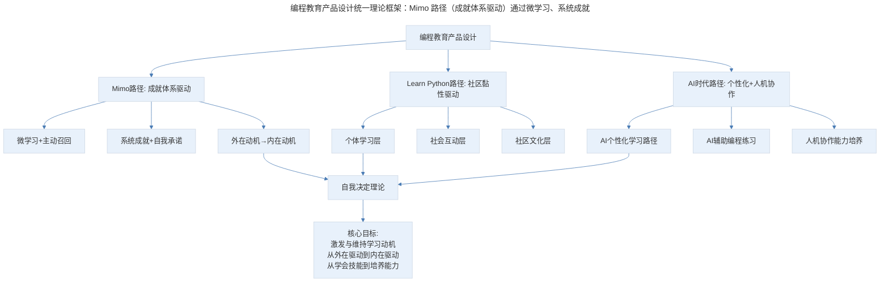

# 15 | 产品案例分析：Mimo 与 Learn Python 的导学之趣

## 1. 导言

Mimo 和 Learn Python 是两款针对基础 IT 教育的应用，它们分别从"成就体系驱动"和"社区黏性驱动"两个维度探索了编程教育的产品设计。在 AI 辅助编程学习工具（GitHub Copilot、ChatGPT）崛起的背景下，编程教育产品的核心价值正在从"教人写代码"转向"教人理解代码与解决问题"。答题反馈机制、成就体系、社区黏性和编程沙盒等设计原则依然有效，但其实现方式和侧重点需要随 AI 时代重新校准。本文将系统解析两款产品的设计思想及其在 AI 时代的演进。

> **更新说明**：本文档于 2026-06 更新，主要更新点：补充 AI 辅助编程学习工具（GitHub Copilot/ChatGPT 辅助学习）的对比分析；增加 AI 驱动个性化学习路径设计；引入自我决定理论与游戏化学习框架；补充编程教育产品最新演进；增加专业深度分层与 Mermaid 流程图。

## 2. 核心概念：Mimo——成就体系驱动的学习引擎

Mimo 和 Learn Python 是两款针对基础 IT 教育的应用。

教育类的应用是最难做的应用类型之一，尤其是需要学习者自我驱动的教育类应用更是难上加难，在 IT 这种实践性非常强的领域内，除了要基于用户或者说学习者自我的驱动力之外，还需要产品的设计者给出足够循循善诱的学习计划。除此之外，设计者还需要在学习者使用的过程中，随时观察他的状态、设计复杂的成就系统，给予他恰如其分的鼓励。

我们就从做题开始体验一下，Mimo 是如何了解用户并且推动用户学习的。

### 2.1 题目设置：讲一句问一句的互动教学

首先是题目的设置。这些内容读者应该都有简单的编程基础，知道要把编程这件事情从易到难、由浅入深地讲清楚并不容易。这里的题目设置很巧妙，它会给用户讲一点内容，然后要求用户互动。

这就是通过内容设置引导用户学习的过程，在这里，应用像是一位老师在给你讲课，怕你走神儿，所以讲一句就问一点问题，让你一直跟着它的思路。

这种"讲一句问一句"的设计本质上是**微学习（Microlearning）**与**主动召回（Active Recall）**的结合：

- **微学习**：将知识拆解为极小的单元，每次只呈现一个知识点，降低认知负荷
- **主动召回**：通过提问迫使学习者主动回忆和应用知识，而非被动阅读，显著提升记忆留存率
- **即时反馈循环**：每道题后立即给出正确/错误反馈，形成"学习-测试-反馈"的快速循环

### 2.2 答题反馈：关键时刻的激励设计

其次是答题反馈的设置。当用户在答题和反馈的过程中，每一个正确或者错误的时刻，对设计者来说都是一个关键时刻。在这个时刻应用如何反馈非常重要。它是否可以在正确的时候，给用户积极的反馈，在错误的时候，给用户鼓励，引导用户继续向前，这是一个学习型应用能不能持续黏住用户的关键点。

在答题的过程中，用户不断会触发一些成就系统的提示，获得一些鼓励。

应用的成就体系有两部分组成，一部分是根据你的学习情况，系统根据规则给出的勋章和奖励；另一部分是系统引导你去设置的，自己的学习目标；这样一来，自己设置的目标相当于自己给自己的承诺。从心理学的角度来讲，人会倾向于前后一致，这也是一种黏住用户的手段。

> Mimo 成就体系驱动循环：学习行为触发答题，正确/错误分别获得不同反馈，进而触发成就系统。系统成就（勋章、连续打卡）提供外在动机，自我承诺（自设目标）激发内在动机，两种动机协同驱动持续学习行为，形成正向循环。

**图表解读**：Mimo 的成就体系驱动循环。学习行为触发答题，正确/错误分别获得不同反馈，进而触发成就系统。系统成就（勋章、连续打卡）提供外在动机，自我承诺（自设目标）激发内在动机。两种动机协同驱动持续学习行为，形成正向循环。

### 2.3 理论框架：自我决定理论与游戏化学习

Mimo 的成就体系设计可以用**自我决定理论（Self-Determination Theory, SDT）**来解析。SDT 认为人的内在动机由三个基本心理需求驱动：

| SDT 需求 | Mimo 的设计对应 | 效果 |
|---------|--------------|------|
| 自主性（Autonomy） | 用户自设学习目标、选择学习路径 | 用户感到自己在掌控学习 |
| 胜任感（Competence） | 循序渐进的题目、即时正向反馈、勋章奖励 | 用户感到自己在进步 |
| 关联性（Relatedness） | 排行榜、学习社区（后期版本增加） | 用户感到自己不是孤军奋战 |

**游戏化学习框架**：Mimo 的设计也符合**八角行为分析法（Octalysis）**框架中的多个核心驱动力：

- **史诗意义与使命感**：学习编程改变人生
- **进步与成就感**：勋章、连续打卡、经验值
- **创意授权与反馈**：编程沙盒中的自由创作
- **所有权与占有欲**：个人学习档案、自设目标
- **社交影响与关联性**：排行榜、社区

### 2.4 专业深度分层

**🟢 基础层**：掌握微学习与主动召回的基本设计方法，设计"讲一句问一句"的互动教学内容。

**🟡 进阶层**：理解自我决定理论，能设计兼顾外在动机与内在动机的成就体系，平衡系统成就与自我承诺。

**🔴 高阶层**：运用八角行为分析法等游戏化框架，设计完整的学习动机系统，实现从外在动机到内在动机的自然转化。

## 3. 关键方法：Learn Python——社区黏性驱动的学习生态

Learn Python 这款应用则是利用社区的方式增加用户的黏性。

和 Mimo 不同，Learn Python 每种语言各自是一个应用，这样可以让用户更独立地聚焦场景，另外，也可以从应用的层面，天然地隔离了付费模式。

它的题目设置跟 Mimo 类似，但加入了社区的属性。在每个题下面，甚至每一个选项，都会有评论。你可以看到其他的学习者在这里的留言。并对他们的留言进行点赞。

Learn Python 还为学习者们提供了各种交流的机制。比如有 Play Ground，在这里大家可以写下自己的代码，让别人来运行甚至编辑，还有讨论区和问答板块，看起来十分丰富。还有 Leader Board 也是一个社会化的成就体系。

应用甚至还提供了加好友，以及跟好友之间互相做编程任务挑战的功能，为了能让学习者保持学习热情和粘性，Learn Python 煞费了一番苦心。

总之，利用学习工具，把学习者聚到一起。形成社区；然后由社区的力量持续地黏住用户，这就是 Learn Python 一以贯之的设计思路。

### 3.1 社区驱动学习的理论框架

Learn Python 的社区黏性设计体现了**社会建构主义（Social Constructivism）**的学习观——知识不是被动接收的，而是在社会互动中主动建构的。

> 社区驱动学习三层架构：个体学习层（题目练习、编程沙盒、个人进度）提供基础学习功能，社会互动层（题目评论、代码分享、好友挑战）将个体行为社会化，社区文化层（排行榜、社区问答、学习氛围）构建归属感。核心机制是"学习行为→社会互动→社区归属→持续学习动机"的正向循环。

**图表解读**：社区驱动学习的三层架构。个体学习层提供基础学习功能，社会互动层通过评论、分享、挑战等机制将个体行为社会化，社区文化层通过排行榜、问答等构建归属感。核心机制是"学习行为→社会互动→社区归属→持续学习动机"的正向循环。

### 3.2 编程沙盒（Playground）的设计价值

Learn Python 的 Playground 是一个关键设计——它让学习者可以自由编写、运行和分享代码。这一设计的重要性在于：

- **从被动学习到主动创造**：题目练习是"按指令写代码"，Playground 是"自由创造代码"，后者更能激发内在动机
- **从个人练习到社会协作**：代码可以被他人运行、编辑和评论，将编程从孤独的活动变为社交活动
- **从知识记忆到能力建构**：自由编程需要综合运用所学知识，是真正的能力建构而非机械记忆

### 3.3 专业深度分层

**🟢 基础层**：理解社区驱动学习的基本设计，在产品中增加评论、讨论等社交功能。

**🟡 进阶层**：掌握社会建构主义理论，能设计三层社区架构（个体/互动/文化），实现"学习→互动→归属→动机"的正向循环。

**🔴 高阶层**：设计编程沙盒等创造性社交功能，实现从被动学习到主动创造、从个人练习到社会协作的范式转换。

## 4. 实践落地：AI 时代编程教育产品的重新定位

AI 辅助编程工具的崛起正在深刻改变编程教育产品的价值定位和设计方向。

### 4.1 AI 辅助编程学习工具的冲击

| 工具 | 核心能力 | 对传统编程教育的影响 |
|------|---------|-------------------|
| GitHub Copilot | 代码自动补全与生成 | "写代码"的门槛大幅降低 |
| ChatGPT/Claude | 自然语言描述生成代码 | "从需求到代码"的路径缩短 |
| Replit AI | 在线 IDE+AI 辅助 | 编程沙盒的 AI 增强版 |
| Cursor | AI 驱动的代码编辑器 | 专业开发流程的 AI 化 |
| Khan Academy AI | AI 个性化辅导 | 自适应学习的 AI 实现 |

**核心挑战**：当 AI 可以自动生成代码时，"教人写代码"的价值何在？

**关键洞察**：编程教育的核心价值正在从"教人写代码"转向三个新方向：

1. **教人理解代码**：AI 生成的代码需要人类审查、理解和修改，"读代码"能力比"写代码"更重要
2. **教人解决问题**：将模糊的需求转化为清晰的规格说明，是 AI 无法替代的核心能力
3. **教人与 AI 协作**：提示词工程、AI 输出审查、人机协作流程是新的必备技能

### 4.2 AI 驱动的个性化学习路径

AI 技术使编程教育产品能够实现真正的个性化学习：

> AI 驱动的个性化学习路径：AI 首先评估学习者能力，生成个性化路径，然后通过微学习内容推送和实时分析动态调整学习节奏——掌握良好则加速、存在薄弱则补充、概念误解则换角度讲解。同时 AI 辅助编程练习培养人机协作能力。

**图表解读**：AI 驱动的个性化学习路径。AI 首先评估学习者能力，生成个性化路径，然后通过微学习内容推送和实时分析，动态调整学习节奏。掌握良好则加速，存在薄弱则补充，概念误解则换角度讲解。同时，AI 辅助编程练习培养人机协作能力——这是 AI 时代编程教育的新核心。

### 4.3 AI 时代编程教育产品的设计演进

| 设计维度 | 传统设计（Mimo/Learn Python） | AI 增强设计 | 变化本质 |
|---------|---------------------------|-----------|---------|
| 内容呈现 | 预设课程路径 | AI 动态生成个性化路径 | 静态→动态 |
| 答题反馈 | 预设正确/错误反馈 | AI 分析错误模式+个性化指导 | 规则→智能 |
| 编程练习 | 静态题目+沙盒 | AI 辅助编程+代码审查 | 写代码→与 AI 协作写代码 |
| 成就体系 | 统一勋章体系 | 个性化里程碑+能力图谱 | 标准化→个性化 |
| 社区互动 | 人工评论+讨论 | AI 导师+同伴协作+代码分享 | 人→人+AI |
| 学习目标 | "学会写代码" | "学会理解代码+解决问题+与 AI 协作" | 技能→能力 |

### 4.4 AI 对产品经理工作的影响

1. **从内容设计到体验设计**：当 AI 可以动态生成学习内容时，产品经理的核心工作从"设计课程内容"转向"设计学习体验框架"——定义 AI 的边界、节奏和干预策略。

2. **从统一标准到个性化最优**：AI 使每个学习者可以拥有独特的学习路径，产品经理需要设计"个性化约束"——在个性化与学习效果之间找到平衡。

3. **从"教写代码"到"教与 AI 协作"**：产品定位的根本性转变，要求产品经理重新定义学习目标和成功指标。

4. **AI 导师的"人情味"问题**：AI 导师可以 24/7 在线、无限耐心，但如何避免"过度帮助"导致学习者丧失独立思考能力？这与 Hopper 的"适度克制"原则异曲同工。

### 4.5 专业深度分层

**🟢 基础层**：理解 AI 对编程教育的影响，在传统设计框架中引入 AI 辅助功能（如 AI 答疑、代码审查）。

**🟡 进阶层**：设计 AI 驱动的个性化学习路径，实现动态内容生成、实时能力评估和自适应节奏调整。

**🔴 高阶层**：重新定义 AI 时代编程教育的产品定位，从"教写代码"转向"教理解代码+解决问题+与 AI 协作"，设计人机协作学习的新范式。

## 5. 实践指南：方法论框架与实战要点

### 5.1 方法论框架

> 编程教育产品设计统一理论框架：Mimo 路径（成就体系驱动）通过微学习、系统成就、自我承诺实现外在动机到内在动机的转化；Learn Python 路径（社区黏性驱动）通过个体学习、社会互动、社区文化三层架构驱动学习；AI 时代路径（个性化+人机协作）通过 AI 个性化学习路径、AI 辅助编程练习、人机协作能力培养驱动学习。共同底层是自我决定理论。

**图表解读**：编程教育产品设计的统一理论框架。Mimo 路径通过成就体系驱动学习，Learn Python 路径通过社区黏性驱动学习，AI 时代路径通过个性化+人机协作驱动学习。三者的共同底层是自我决定理论——满足自主性、胜任感和关联性三大心理需求。核心目标是激发与维持学习动机，实现从外在驱动到内在驱动、从学会技能到培养能力的转化。

### 5.2 实战要点

| 要点 | 说明 | 适用场景 |
|------|------|----------|
| 微学习+主动召回 | 将知识拆解为极小单元，通过提问迫使主动回忆 | 所有教育类产品 |
| 即时反馈循环 | 每道题后立即给出正确/错误反馈 | 答题类产品 |
| 系统成就+自我承诺 | 双轨成就体系，外在动机与内在动机协同 | 学习/习惯养成产品 |
| 自我决定理论应用 | 满足自主性、胜任感、关联性三大需求 | 所有需要持续动机的产品 |
| 社区三层架构 | 个体学习+社会互动+社区文化 | 社区型学习产品 |
| 编程沙盒设计 | 自由创作+社交协作的编程环境 | 编程教育产品 |
| AI 个性化学习路径 | 动态生成+实时评估+自适应调整 | AI 教育产品 |
| AI 辅助编程练习 | 代码审查+建议+人机协作 | 编程教育产品 |
| 从"教写代码"到"教与 AI 协作" | 产品定位的根本性转变 | AI 时代编程教育 |
| AI 导师适度克制 | 避免过度帮助导致丧失独立思考 | AI 辅导产品 |

## 6. 进阶延展：核心要点回顾

### 6.1 核心要点回顾

Mimo 和 Learn Python 分别从"成就体系驱动"和"社区黏性驱动"两个维度探索了编程教育的产品设计。Mimo 通过"讲一句问一句"的微学习与主动召回、答题反馈的关键时刻激励、系统成就与自我承诺的双轨成就体系，实现从外在动机到内在动机的转化（基于自我决定理论与八角行为分析法）；Learn Python 通过个体学习、社会互动、社区文化三层社区架构，以及编程沙盒的创造性设计，实现"学习→互动→归属→动机"的正向循环（基于社会建构主义）。在 AI 时代，编程教育的核心价值从"教人写代码"转向"教人理解代码+解决问题+与 AI 协作"，AI 驱动的个性化学习路径与人机协作能力培养成为新的设计核心。共同底层是自我决定理论——激发与维持学习动机，从外在驱动到内在驱动，从学会技能到培养能力。

### 6.2 延伸阅读

- 《Self-Determination Theory》—— Deci & Ryan，内在动机的经典理论
- 《Octalysis》—— Yu-kai Chou，游戏化设计框架
- 《Mindstorms》—— Seymour Papert，建构主义与编程教育
- 《AI in Education》—— UNESCO 2023 报告，AI 与教育的未来
- 《Learner-Centered Design》—— Soloway 等，以学习者为中心的设计方法论

## 更新日志

| 版本 | 日期 | 更新内容 |
|------|------|----------|
| v1.0 | 2018 | 初始版本 |
| v2.0 | 2026-06 | 补充 AI 辅助编程学习工具对比分析；增加 AI 驱动个性化学习路径设计；引入自我决定理论与游戏化学习框架；补充编程教育产品 AI 时代演进；增加 Mermaid 流程图与专业深度分层 |