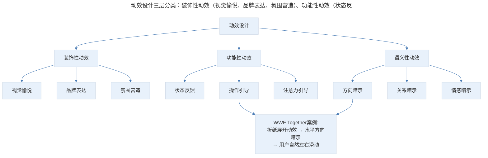
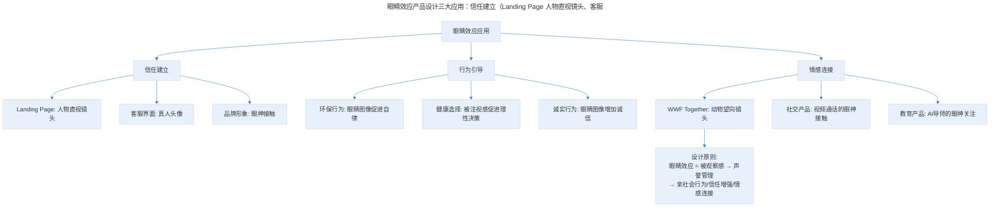
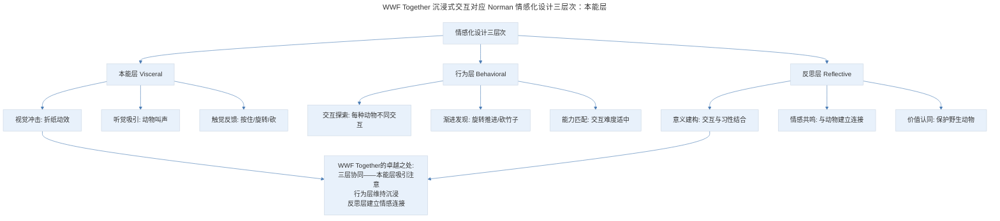
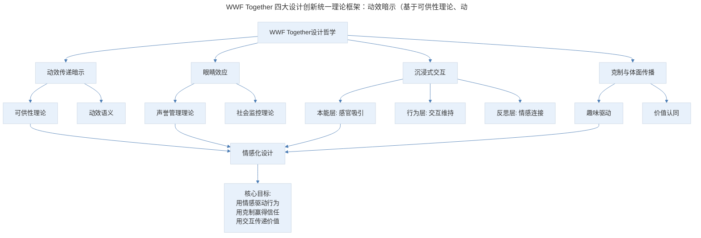

# 18 | 产品案例分析：WWF Together 的情怀设计

## 1. 导言

WWF Together 是世界自然基金会推出的推广应用，其四大设计创新——用动效传递暗示、望向镜头的眼睛效应、沉浸式交互、克制与体面的传播设计——至今仍是情感化设计的典范。在 VR/AR 沉浸式体验日益普及的今天，WWF Together 的交互设计思想获得了更强大的技术载体；在情感计算与 AI 驱动的个性化体验时代，"眼睛效应"等心理学原理有了更精细的应用可能。本文将系统解析 WWF Together 的设计思想及其在新时代的演进。

> **更新说明**：本文档于 2026-06 更新，主要更新点：补充"眼睛效应"最新心理学研究证据；增加沉浸式交互在 VR/AR 时代的新演进；引入情感化设计理论框架（Norman 三层次）；补充 AI 驱动的沉浸式体验与情感计算；增加专业深度分层与 Mermaid 流程图。

## 2. 核心概念：用动效传递暗示

打开应用，首先看到的是一个折纸的过程，开屏结束以后，通过一个过场动效，给我们展示了完整的内容列表。注意看这个动效，一方面它很好看，另外一方面它明确地给我们暗示，这里的内容是水平布置的，我们想要看更多动物的时候，就会知道要左右滑而不是上下滑。

这个小动作非常有效，我们要暗示用户继续探索的路径的时候，可以用这样的动效，也可以露出一个边，看到一个不完整的边，我们很容易理解这个边是向水平延伸还是垂直延伸的，也就自然知道接下来的操作方向。这里我们用极客时间举个例子，可以看到左边留出一点，就是这样的一个暗示。

动效绝对不是花里胡哨的东西，它在很多时候能传递暗示，再讲一个题外的，就是苹果系统中输错密码的一个摇头的动效，macOS 和 iOS 都有类似的东西，也很有意思。

### 2.1 动效暗示的理论框架

动效传递暗示的设计原理可以从**可供性理论（Affordance Theory）**和**动效语义（Animation Semantics）**两个角度理解：

- **可供性理论**：James Gibson 提出，Donald Norman 引入设计领域。动效通过展示"操作可能性"来传递暗示——折纸展开的水平动效暗示了"水平滑动"这一操作可供性
- **动效语义**：动效不仅是装饰，它承载语义信息。方向性动效暗示导航方向，变形动效暗示状态变化，节奏性动效暗示操作节奏

> 动效设计三层分类：装饰性动效（视觉愉悦、品牌表达、氛围营造）、功能性动效（状态反馈、操作引导、注意力引导）、语义性动效（方向暗示、关系暗示、情感暗示）。WWF Together 的折纸展开动效同时属于功能性动效（操作引导）和语义性动效（方向暗示），是动效设计的最佳实践。

**图表解读**：动效设计的三层分类。装饰性动效追求视觉愉悦和品牌表达，功能性动效提供状态反馈和操作引导，语义性动效传递方向、关系和情感暗示。WWF Together 的折纸展开动效同时属于功能性动效（操作引导）和语义性动效（方向暗示），是动效设计的最佳实践。

### 2.2 现代演进：从微动效到沉浸式动效

WWF Together 的动效设计在当今技术环境下有了更丰富的实现可能：

| 技术演进 | 动效能力提升 | 设计启示 |
|---------|------------|---------|
| Lottie/Rive | 高性能矢量动效，文件更小 | 动效可以更频繁地使用 |
| 3D Touch/Haptic | 触觉反馈与视觉动效协同 | 多感官暗示更有效 |
| ProMotion/高刷新率 | 更流畅的动效表现 | 动效的"质感"成为设计要素 |
| ARKit/ARCore | 空间动效，3D 空间中的暗示 | 动效暗示从 2D 扩展到 3D |
| Vision Pro | 眼动+手势+空间动效 | 动效暗示进入空间计算时代 |

**关键洞察**：Apple Vision Pro 的空间计算环境将动效暗示推向了新维度——在 3D 空间中，动效不仅暗示操作方向，还暗示空间关系（远近、层级、连接）。WWF Together 的"折纸展开暗示水平滑动"在空间计算中可以演变为"3D 折纸展开暗示空间导航方向"。

### 2.3 专业深度分层

**🟢 基础层**：掌握动效暗示的基本设计方法，通过方向性动效和边缘露出暗示操作方向。

**🟡 进阶层**：理解可供性理论和动效语义，能设计功能性+语义性的复合动效，实现操作引导与情感暗示的统一。

**🔴 高阶层**：在空间计算和 AR/VR 环境中，设计 3D 空间动效暗示系统，实现多感官（视觉+触觉+听觉）协同的暗示设计。

## 3. 关键方法：望向镜头的眼睛

WWF Together 有一个很小的细节，你可以注意到，这里每个动物的照片都是包括眼睛的局部构图，这些眼睛是望向镜头的。这样的设计其实也是有心理学依据的，眼睛给人的心理暗示非常强烈。曾经有一个心理学实验，说的是在街上画一些眼睛，甚至是眼睛形状的图案，都能提高行人把垃圾丢到垃圾桶里的概率，而不是随地乱扔。

我还看过一篇文章说，如果在你的工作环境中，贴上一些有眼睛的图案或照片，或是放上镜子，让你可以看到自己的眼睛，都能提高你的工作效率。在一些 Landing Page 优化建议中，文章也提到了可以在首页中放置人物的照片，其中有一个要点，就是说这些人应该直视镜头，会特别有冲击力。

### 3.1 "眼睛效应"的心理学研究证据

"眼睛效应"（Watching Eye Effect）在心理学中有丰富的实证研究支撑：

**经典研究**：

- **Bateson et al. (2006)**：在大学咖啡厅的"诚实箱"旁贴眼睛图片，付款金额是贴花朵图片时的近 3 倍
- **Ernest-Jones et al. (2011)**：在超市购物车上贴眼睛贴纸，顾客更倾向于将垃圾投入垃圾桶
- **Nettle et al. (2012)**：在自行车停放处贴眼睛海报（"Cycle Thieves, We Are Watching You"），自行车盗窃行为显著减少

**最新研究进展**：

- **Sparks & Barclay (2013)**：眼睛效应在在线环境中同样有效——在网页上显示眼睛图像可以增加用户的诚实行为
- **Raihani & Aitken (2021)**：元分析发现眼睛效应的强度受文化背景调节，集体主义文化中效应更强
- **Manesi et al. (2016)**：眼睛效应不仅影响亲社会行为，还影响消费决策——被"注视"时消费者更倾向于选择健康食品

**理论解释**：

| 理论 | 核心解释 | 对产品设计的启示 |
|------|---------|---------------|
| 声誉管理理论 | 眼睛激活"被观察"感，触发声誉管理行为 | 在需要用户自律的场景中使用眼睛图像 |
| 社会监控理论 | 眼睛暗示社会规范的存在，增加规范遵从 | 在需要规范行为的场景中使用眼睛图像 |
| 进化心理学 | 人类对眼睛高度敏感是进化适应的结果 | 眼睛图像具有跨文化的普遍效果 |

### 3.2 "眼睛效应"在产品设计中的应用

> 眼睛效应产品设计三大应用：信任建立（Landing Page 人物直视镜头、客服界面真人头像、品牌形象眼神接触）、行为引导（环保行为、健康选择、诚实行为）、情感连接（WWF Together 动物望向镜头、社交产品眼神接触、教育产品 AI 导师眼神关注）。核心机制是"被观察感→声誉管理→亲社会行为/信任增强/情感连接"。

**图表解读**：眼睛效应在产品设计中的三大应用方向。信任建立用于 Landing Page 和品牌形象，行为引导用于环保和健康场景，情感连接用于 WWF Together 等情怀产品。核心机制是"被观察感→声誉管理→亲社会行为/信任增强/情感连接"。

### 3.3 AI 时代的"眼睛效应"新维度

1. **AI 虚拟形象的眼神**：AI 助手（如 ChatGPT 的语音模式、Meta AI）开始拥有虚拟形象，这些形象的眼神设计直接影响用户的信任感和亲近感。

2. **情感计算（Affective Computing）**：AI 可以通过摄像头识别用户的面部表情和眼神方向，实现"双向眼神交流"——不仅 AI"看着"用户，AI 也能感知用户是否"看着"它。

3. **个性化眼神交互**：AI 可以根据用户的情感状态动态调整虚拟形象的眼神——当用户困惑时给予关注的眼神，当用户成功时给予赞许的眼神。

4. **伦理边界**：眼睛效应的"被观察感"如果被过度利用（如监控式设计），可能侵犯用户隐私和自主权。产品经理需要在"增强信任"与"避免操控"之间保持克制。

### 3.4 专业深度分层

**🟢 基础层**：理解眼睛效应的基本原理，在 Landing Page 和品牌形象中使用直视镜头的人物/动物照片。

**🟡 进阶层**：掌握眼睛效应的心理学机制（声誉管理/社会监控），在不同场景中恰当应用眼睛效应引导行为。

**🔴 高阶层**：在 AI 虚拟形象和情感计算环境中，设计双向眼神交互系统，同时把握眼睛效应的伦理边界，避免操控性设计。

## 4. 实践落地：沉浸式交互

其实仔细翻下来，你会发现这款应用的数据量并不大，这跟我们之前提到的一些应用不同，那些应用是要把大量内容条理化简单化，但这个应用却是要把单薄的内容有机丰富地整合在一起。

我们可以看到，它利用了非常丰富的交互方式，来表现形态各异的动物的习性和特点，每一种都不同，很新鲜，吸引人们不断地探索，去了解每种动物。

比如我们打开熊猫，第一个有趣的交互是，当你按住这个折纸的时候，会有熊猫的叫声，上面的文字也会随之扭曲。我们继续往后看，会发现一些更有趣的交互，比如通过旋转一个控件来推进内容的继续加载，或砍掉竹子才能看到后面的文字。

我们再来看两个动物，你会看到具体的交互方式设计与动物的习性是紧密结合的，比如展示老虎的视力，是通过两个亮度不同的滤镜，还可以打开相机去通过这两个孔看自己周围的环境。再比如展示大象的生存环境，有 360 度视角的图片，非常用心，恰到好处。

应用不断地用这些交互形式吸引你的注意力，让你跟它去进行互动。让你的手不要离开屏幕。也让你的视线和精力沉浸在信息和内容中。

### 4.1 沉浸式交互的理论框架：Norman 情感化设计三层次

WWF Together 的沉浸式交互设计完美对应了 Donald Norman 的**情感化设计三层次理论**：

> WWF Together 沉浸式交互对应 Norman 情感化设计三层次：本能层（视觉冲击、听觉吸引、触觉反馈）吸引注意力，行为层（交互探索、渐进发现、能力匹配）维持沉浸感，反思层（意义建构、情感共鸣、价值认同）建立情感连接。三层协同是 WWF Together 的卓越之处。

**图表解读**：WWF Together 的沉浸式交互对应 Norman 情感化设计三层次。本能层通过视觉、听觉、触觉吸引注意力；行为层通过多样化交互和渐进发现维持沉浸感；反思层通过交互与习性的结合建立情感连接和价值认同。三层协同是 WWF Together 的卓越之处。

### 4.2 沉浸式交互的现代演进

WWF Together 的沉浸式交互在当今技术环境下有了更强大的实现载体：

| 技术载体 | 沉浸能力 | 与 WWF Together 的对比 |
|---------|---------|---------------------|
| WWF Together (2013) | 触屏交互+声音+视觉 | 基础沉浸，2D 触屏 |
| BBC Story of Life | 全屏视频+圆形进度条 | 视频沉浸，观看为主 |
| Apple Vision Pro | 空间计算+3D+眼动+手势 | 完全沉浸，空间交互 |
| Meta Quest | VR 全景+6DoF | 深度沉浸，身体参与 |
| AR 应用 (JigSpace 等) | AR 叠加+手势交互 | 现实融合沉浸 |

**关键洞察**：WWF Together 的核心设计思想——"交互方式与内容特性紧密结合"——在任何技术载体上都适用。技术只是手段，关键是让交互本身成为内容的一部分，而非仅仅是内容的容器。例如，"砍竹子看文字"的交互之所以有效，不是因为技术先进，而是因为"砍竹子"这个动作与"熊猫吃竹子"的内容特性完美契合。

### 4.3 AI 驱动的沉浸式体验

AI 技术正在为沉浸式交互带来新的可能：

1. **AI 生成个性化交互**：AI 可以根据用户的兴趣和行为模式，动态生成交互方式。例如，对喜欢声音的用户增加更多声音交互，对喜欢触觉的用户增加更多手势交互。

2. **AI 驱动的对话式沉浸**：AI 可以让动物"开口说话"，与用户进行自然语言对话，回答关于习性和生存状况的问题，将单向的交互探索变为双向的对话交流。

3. **AI 情感识别**：AI 可以通过面部表情和交互模式识别用户的情感状态，动态调整沉浸深度——当用户感到无聊时增加交互刺激，当用户感到疲劳时降低交互强度。

### 4.4 专业深度分层

**🟢 基础层**：掌握沉浸式交互的基本设计方法，设计多样化的交互方式吸引用户注意力。

**🟡 进阶层**：理解 Norman 情感化设计三层次，能设计三层协同的沉浸式交互——本能层吸引、行为层维持、反思层连接。

**🔴 高阶层**：在 VR/AR 和 AI 环境中，设计空间沉浸式交互和 AI 驱动的个性化沉浸体验，同时保持"交互与内容特性结合"的核心原则。

### 4.5 引人深思的传播与分享

最后还有一个拍照的功能，可以将这个动物的折纸形象和你的生活环境相结合做出一张照片，然后鼓励你把它分享出去，影响更多的人来保护野生动物，关注野生动物。

这个设计有一个特别好的隐喻，就是这些动物跟你身边触手可及的环境是息息相关的，它们就在我们身边，与我们共存。而且我们知道，当我们想要促进某个用户去进行分享和传播的时候，最重要的事情是要保证这个分享和传播的东西是跟他有关的，一张自己身边环境的照片，就是跟它有关的内容，这样的相关性，理论上也会提高分享的意愿。

而且我觉得难能可贵的是，它并不是通过站在道德制高点来胁迫你分享和呼吁对野生动物的关注，而是通过这样有趣的功能，来推动你去做传播和分享，很克制，也很体面。

**克制与体面的传播设计**：

| 传播策略 | 方式 | 用户感受 | 案例 |
|---------|------|---------|------|
| 道德胁迫 | "不分享就是不关心" | 反感、被迫 | 部分公益广告 |
| 社交压力 | "你的朋友都在参与" | 焦虑、从众 | 捐款排名 |
| 利益诱导 | "分享获得奖励" | 功利、短暂 | 裂变营销 |
| 趣味驱动 | "有趣+与己相关" | 自愿、愉悦 | WWF Together |
| 价值认同 | "我认同所以分享" | 主动、持久 | 品牌社区 |

**关键洞察**：克制与体面的传播设计虽然短期转化率可能不如道德胁迫或利益诱导，但长期品牌价值和用户信任远高于后者。在"暗黑模式"（Dark Patterns）日益受到监管和公众抵制的今天，克制式传播的价值更加凸显。

## 5. 实践指南：方法论框架与实战要点

### 5.1 方法论框架

> WWF Together 四大设计创新统一理论框架：动效暗示（基于可供性理论、动效语义）、眼睛效应（基于声誉管理理论、社会监控理论）、沉浸式交互（基于 Norman 情感化设计三层次）、克制传播（基于趣味驱动、价值认同）。四者共同底层是"情感化设计"。

**图表解读**：WWF Together 四大设计创新的统一理论框架。动效暗示基于可供性理论，眼睛效应基于声誉管理理论，沉浸式交互基于 Norman 情感化设计三层次，克制传播基于趣味驱动和价值认同。四者的共同底层是"情感化设计"——通过情感驱动行为，用克制赢得信任，用交互传递价值。

### 5.2 实战要点

| 要点 | 说明 | 适用场景 |
|------|------|----------|
| 动效传递暗示 | 用方向性动效暗示操作方向和导航路径 | 所有需要引导操作的产品 |
| 边缘露出暗示 | 露出不完整的边缘暗示延伸方向 | 卡片/内容流产品 |
| 眼睛效应 | 利用直视镜头的眼睛图像增强信任和亲社会行为 | Landing Page/品牌形象/公益产品 |
| 声誉管理机制 | 通过"被观察感"触发用户的声誉管理行为 | 需要用户自律的场景 |
| 情感化设计三层次 | 本能层吸引+行为层维持+反思层连接 | 所有情感化产品 |
| 交互与内容特性结合 | 交互方式与内容主题紧密契合 | 教育/科普/文化产品 |
| 克制式传播 | 通过趣味性和相关性驱动分享，避免道德胁迫 | 公益/品牌传播 |
| 分享内容的相关性 | 确保分享内容与用户自身相关 | 社交分享功能 |
| AI 个性化沉浸 | 根据用户兴趣动态调整交互方式和沉浸深度 | AI 驱动的体验产品 |
| 眼睛效应伦理边界 | 在增强信任与避免操控之间保持克制 | AI 虚拟形象/监控场景 |

## 6. 进阶延展：核心要点回顾

### 6.1 核心要点回顾

WWF Together 的四大设计创新至今仍是情感化设计的典范：动效传递暗示（基于可供性理论与动效语义，通过方向性动效和边缘露出暗示操作方向，并在空间计算时代演进为 3D 空间动效暗示）、望向镜头的眼睛效应（基于声誉管理理论与社会监控理论，利用被观察感触发亲社会行为，并在 AI 时代演进为双向眼神交互与情感计算）、沉浸式交互（基于 Norman 情感化设计三层次，实现本能层吸引、行为层维持、反思层连接，并在 VR/AR 与 AI 时代演进为空间沉浸与个性化沉浸）、克制与体面的传播设计（通过趣味性与相关性驱动分享，避免道德胁迫与社交压力）。四者的共同底层是"情感化设计"——用情感驱动行为，用克制赢得信任，用交互传递价值。

### 6.2 延伸阅读

- 《Emotional Design》—— Donald Norman，情感化设计经典
- 《The Watching Eye Effect》—— Bateson et al.，眼睛效应经典实验
- 《Affordance Theory》—— James Gibson，可供性理论
- 《Dark Patterns》—— Harry Brignull，暗黑模式与设计伦理
- 《Affective Computing》—— Rosalind Picard，情感计算与 AI

## 更新日志

| 版本 | 日期 | 更新内容 |
|------|------|----------|
| v1.0 | 2018 | 初始版本 |
| v2.0 | 2026-06 | 补充眼睛效应最新心理学研究；增加沉浸式交互 VR/AR 演进；引入 Norman 情感化设计三层次框架；补充 AI 驱动沉浸式体验与情感计算；增加 Mermaid 流程图与专业深度分层 |