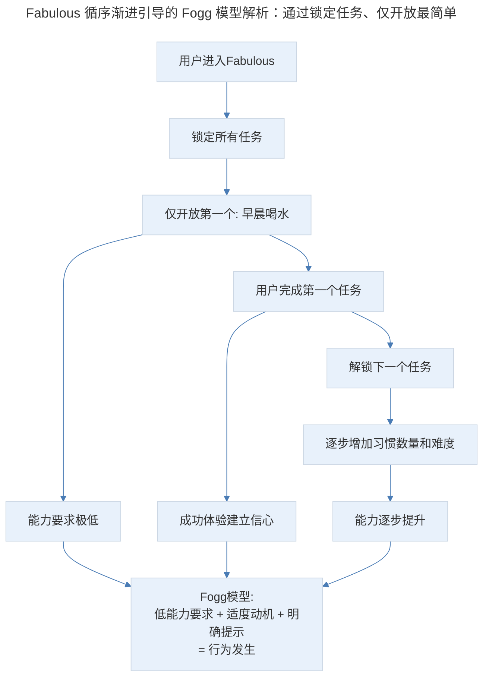
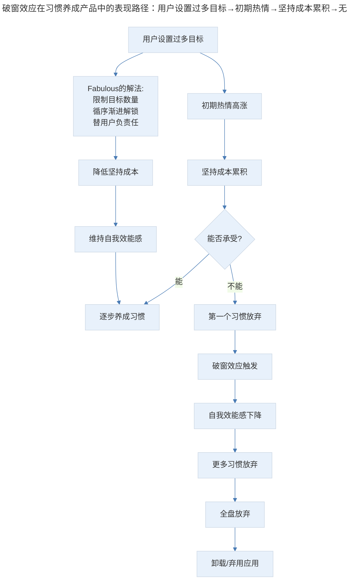
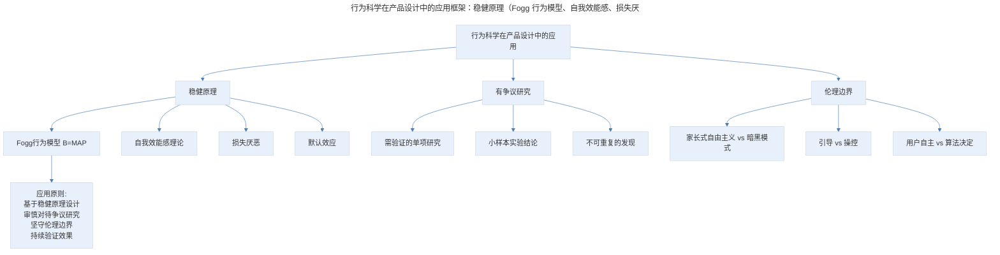
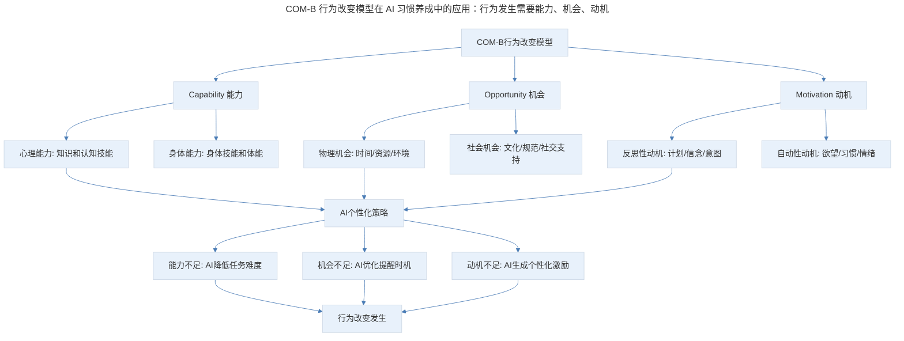
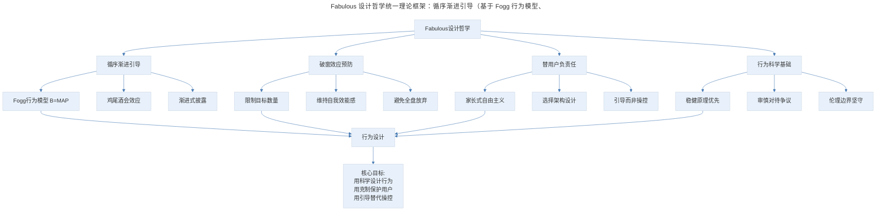

# 21 | 产品案例分析：Fabulous 的精致养成

## 1. 导言

Fabulous 是一款以行为科学为基础的习惯养成应用，其三大设计创新——循序渐进的引导、破窗效应的预防、替用户"负责任"——体现了"用科学设计行为"的产品哲学。在 Dan Ariely 数据造假争议引发行为科学信任危机的背景下，Fabulous 的科学基础需要更审慎的审视；在 AI 驱动个性化习惯养成的浪潮中，Fabulous 的"克制"哲学获得了新的技术实现可能。本文将系统解析 Fabulous 的设计思想，并讨论行为科学在产品设计中的应用边界与 AI 时代的新方向。

> **更新说明**：本文档于 2026-06 更新，主要更新点：补充 Dan Ariely 数据造假争议对行为科学应用的影响；增加 AI 驱动个性化习惯养成方案分析；引入行为设计理论框架（Fogg 行为模型/COM-B 模型）；补充习惯养成产品最新演进与竞争格局；增加专业深度分层与 Mermaid 流程图。

## 2. 核心概念：循序渐进的引导

Fabulous 不同于其他培养习惯的应用，有很多强制的提醒和计划，它给人的感觉就是很克制，淡淡地、循序渐进地帮助用户培养一个习惯。

这款应用设计得非常漂亮，从图标到内容，整个视觉风格很像纪念碑谷那款游戏，它的设计语言是经典的 Material Design，得过不少设计的奖。

从新手引导开始说起。第一次打开 Fabulous，我们可以看到他的新手引导，并不是简单的教给你怎样使用这款应用的所有功能，而是把所有的功能构建在一个使用向导上。

你可以看到很多种不同的任务，但他强制要求你只能从第一个任务开始，后面的任务全都是被锁住的；整个的新手引导是以非常丰富的交互对话方式进行的，而不是简单的一个模板，告诉你点哪里操作什么。

它的交互也很人性化，我们之前在分享 Hopper 的时候，也提到过类似的风格。交互不是冰冷的说明书，而是人性化的交流。

### 2.1 循序渐进引导的理论框架

Fabulous 的循序渐进引导可以用**Fogg 行为模型（Fogg Behavior Model, B=MAP）**来解析：

- **B = MAP**：行为（Behavior）= 动机（Motivation）× 能力（Ability）× 提示（Prompt）
- 当动机、能力和提示同时存在且足够强时，行为才会发生
- Fabulous 的循序渐进引导本质上是**逐步提升能力（Ability）**的策略——从最简单的"每天早晨喝水"开始，让用户在低能力要求下成功完成行为，建立信心后再逐步增加难度

> Fabulous 循序渐进引导的 Fogg 模型解析：通过锁定任务、仅开放最简单的第一个任务，确保用户在低能力要求下成功完成行为。成功体验建立信心（提升动机），然后逐步解锁更多任务（提升能力）。核心逻辑是 Fogg 模型：低能力要求+适度动机+明确提示=行为发生。

**图表解读**：Fabulous 循序渐进引导的 Fogg 模型解析。通过锁定任务、仅开放最简单的第一个任务，确保用户在低能力要求下成功完成行为。成功体验建立信心（提升动机），然后逐步解锁更多任务（提升能力）。核心逻辑是 Fogg 模型：低能力要求+适度动机+明确提示=行为发生。

### 2.2 藏在姓名中的细节

在整个流程的一开始，它就会询问你的姓名。而一个姓名，不仅仅用于个人中心里面进行展示。他的整个流程中都会亲切的呼唤你的名字。

我们在这里写的小池，他就会一直以小池来进行第二人称的描述。这个细节虽然没有什么技术含量，但确实会让人觉得亲切。你可以看到他的一些流程和内容是以写信的方式推送给你的。在信中可以就可以开启一个习惯。

之前看过一篇文章，说每个人都会本能地关注自己，所以当你和用户谈论他自己的事，你就会比较容易获得他的重视。

早先在做邮件营销的时候，有一个技巧，就是在标题中插入用户的姓名，这样的邮件更容易被用户关注到，从而获得更高的打开率。邮件时代结束以后，自媒体命名也有类似的诀窍，很多人会在标题中使用第二人称你，因为从读者的角度来看它与自己的名字指代是相同的，所以更容易引起关注。

**心理学原理**：这一设计利用了**鸡尾酒会效应（Cocktail Party Effect）**——人脑对与自己相关的信息（尤其是自己的名字）具有优先注意机制。在嘈杂环境中，人也能敏锐地捕捉到自己的名字。Fabulous 在交互中反复使用用户姓名，正是利用了这一注意力机制。

### 2.3 专业深度分层

**🟢 基础层**：掌握循序渐进引导的基本设计方法，从最简单的任务开始，逐步增加难度。

**🟡 进阶层**：理解 Fogg 行为模型，能根据 B=MAP 框架设计引导策略，通过降低能力要求、增强动机、优化提示来促进行为发生。

**🔴 高阶层**：设计动态适应的引导系统，根据用户的行为数据实时调整任务难度和引导策略，实现个性化的循序渐进。

## 3. 关键方法：破窗效应与替用户"负责任"

这款应用虽然有很多的功能，但是并没有让用户操作，而是逐渐给用户弹出对话框，在某种程度上只会把整个应用的复杂性降低。你也不会特别急于去探索整个应用的完整的架构，他也限制了你的探索。而是逐渐地引导你进入到整个流程里面来。就像是在挖掘一个丰富的宝藏。

我们到其他的几个模块里面看看，他也会告诉你，在未来的某一个时机才能解锁。

我们可以在这里操作打开一些希望养成的习惯。我们的操作可以完全跟着他的引导，一步一步来。它会引导我们从每天早晨喝水开始，逐渐增加自己好习惯的数量。这里的设计非常的克制。不像其他的应用，一股脑的可以加上许许多多的习惯。

### 3.1 破窗效应在产品设计中的体现

很多时候我们在产品设计的时候，感觉可以把我们的功能完全交给用户，他自己爱怎么用就怎么用。这其实是不负责任的，因为用户在看着这些应用的功能的时候，尤其是这些习惯养成类的应用，很容易眼高手低。

用户没有办法意识到设置的每一个习惯养成，在未来的日子里会给自己带来多高的坚持成本；而且这个时候他是心血来潮的，所以他很有可能会一股脑地设置一堆目标。

当未来真的需要他付出大量努力来完成这些目标的时候，他的热度已经过了。而且可能又付不出这么高的坚持成本，那就有可能放弃，一旦他开始放弃，就会产生破窗效应，破罐子破摔，干脆全都不坚持，也不想再打开这个应用，看到自己的累累败绩。

**破窗效应（Broken Windows Theory）**在习惯养成产品中的表现：

> 破窗效应在习惯养成产品中的表现路径：用户设置过多目标→初期热情→坚持成本累积→无法承受→第一个习惯放弃→破窗效应触发→自我效能感下降→全盘放弃。Fabulous 的解法是限制目标数量、循序渐进解锁、替用户负责任，从源头降低坚持成本，维持自我效能感。

**图表解读**：破窗效应在习惯养成产品中的表现路径。用户设置过多目标→初期热情→坚持成本累积→无法承受→第一个习惯放弃→破窗效应触发→自我效能感下降→全盘放弃。Fabulous 的解法是限制目标数量、循序渐进解锁、替用户负责任，从源头降低坚持成本，维持自我效能感。

### 3.2 替用户"负责任"的设计哲学

所以不要想着全都交给用户，让用户为自己负责任。有时候用户是没有办法为自己负责任，这些习惯养成应用的存在，不也本来就应该肩负起这样的责任吗。

Fabulous 的"替用户负责任"设计哲学体现了**家长式自由主义（Libertarian Paternalism）**——保留用户的选择自由，但通过设计"选择架构"引导用户做出对自己有利的选择。

| 设计选择 | 完全自由（反面） | Fabulous 的做法（家长式自由主义） |
|---------|---------------|---------------------------|
| 习惯数量 | 无限制添加 | 逐步解锁，限制同时养成的数量 |
| 习惯难度 | 用户自选 | 从最简单的开始，逐步增加 |
| 功能展示 | 全部展示 | 渐进披露，逐步解锁 |
| 失败处理 | 用户自己面对 | 温和鼓励，不强调失败 |

**关键洞察**：Fabulous 的"替用户负责任"与暗黑模式（Dark Patterns）的"替用户做决定"有本质区别——前者保留用户的选择自由，只是通过设计引导；后者剥夺用户的选择自由，通过设计操控。产品经理需要在这条边界上保持清醒。

### 3.3 专业深度分层

**🟢 基础层**：理解破窗效应在习惯养成中的表现，通过限制目标数量和循序渐进降低用户放弃风险。

**🟡 进阶层**：掌握家长式自由主义的设计哲学，在保留用户选择自由的前提下，通过选择架构引导用户做出有利选择。

**🔴 高阶层**：设计动态的"负责任"系统，根据用户的行为数据实时调整约束力度——对自律能力强的用户放松约束，对自律能力弱的用户加强引导。

## 4. 实践落地：行为科学的科学性审视

说到这里，我们也可以看到 Fabulous 的增值点。它是订阅模式的应用，是在为自己养成习惯的方式和计划收费。在官网的自我介绍中，我们也可以看到这个团队除了在设计上下了很大的功夫之外，也在如何帮助用户培养良好习惯上，花费了很多的心力。

这个产品是在杜克大学的一个中心孵化的。这个中心的负责人就是那本著名的怪诞行为学的作者。他们确实是从科学的角度来打造这款应用，而不是简单粗暴的定一些闹钟，到点叫你喝杯水，活动一下筋骨这么简单。

我很喜欢这样的立意，也希望能有越来越多这样的产品。因为能够提供更专业系统的价值，而获得尊重和盈利。不像现在的流行趋势那样，要大流量，要做生态，做平台做大生意，才能赚钱才能存活。

每一个提供自己独特价值的应用和产品，都应该有充足的生存空间，也希望能够看到越来越多独立开发者或小的开发团队，通过这样精致、独特的应用，生活得很好。

### 4.1 Dan Ariely 数据造假争议及其影响

Fabulous 的科学基础与 Dan Ariely 密切相关——这款产品孵化自杜克大学高级后见之明中心（Center for Advanced Hindsight），而 Ariely 是该中心的负责人和《怪诞行为学》的作者。然而，2021 年 Ariely 卷入了一起严重的数据造假争议：

**事件经过**：

- **2021 年 8 月**：研究者发现 Ariely 等人 2012 年发表在《美国国家科学院院刊》（PNAS）上的一篇关于"签署诚实声明位置对诚信行为影响"的论文存在数据造假
- **调查结果**：数据由一家汽车保险公司提供，但原始数据与论文报告的数据严重不符，数据明显被人为篡改
- **后续影响**：该论文被撤稿，Ariely 声称数据由保险公司提供、自己不知情，但未能完全消除质疑
- **更广泛的影响**：行为科学领域多起可重复性危机被曝光，引发对"行为科学在产品设计中应用"的信任危机

**对 Fabulous 的影响**：

- Fabulous 的核心设计理念（循序渐进、破窗效应预防、替用户负责任）并非仅依赖 Ariely 的个人研究，而是基于更广泛的行为科学共识
- 但 Ariely 的争议确实提醒我们：**行为科学的"科学性"需要更审慎的审视**，不能因为"有研究支持"就盲目应用
- 产品经理应当区分**稳健的行为科学原理**（如 Fogg 模型、自我效能感理论）和**有争议的单项研究**

### 4.2 行为科学在产品设计中的应用边界

> 行为科学在产品设计中的应用框架：稳健原理（Fogg 行为模型、自我效能感、损失厌恶、默认效应）可以放心应用；有争议的研究需要审慎验证；伦理边界需要时刻警惕。应用原则是基于稳健原理设计、审慎对待争议研究、坚守伦理边界、持续验证效果。

**图表解读**：行为科学在产品设计中的应用框架。稳健原理（Fogg 模型、自我效能感等）可以放心应用；有争议的研究需要审慎验证；伦理边界需要时刻警惕。应用原则是：基于稳健原理设计，审慎对待争议研究，坚守伦理边界，持续验证效果。

### 4.3 专业深度分层

**🟢 基础层**：了解行为科学在产品设计中的基本应用，能引用经典原理支持设计决策。

**🟡 进阶层**：能区分稳健的行为科学原理和有争议的单项研究，在设计决策中审慎评估科学依据的可靠性。

**🔴 高阶层**：在行为科学可重复性危机的背景下，建立产品设计中的"科学审慎"框架，持续验证设计效果，坚守伦理边界。

## 5. 实践指南：AI 驱动的个性化习惯养成

AI 技术正在为习惯养成产品带来革命性的变化，Fabulous 的"克制"哲学在 AI 时代获得了新的技术实现可能。

### 5.1 AI 个性化习惯养成方案

| 维度 | 传统方案（Fabulous） | AI 增强方案 | 变化本质 |
|------|-------------------|-----------|---------|
| 习惯推荐 | 统一的"早晨喝水"起点 | AI 根据用户画像推荐个性化起点 | 标准化→个性化 |
| 难度调整 | 固定的循序渐进节奏 | AI 根据完成情况动态调整节奏 | 静态→动态 |
| 失败处理 | 温和鼓励+不强调失败 | AI 分析失败原因+个性化干预策略 | 通用→精准 |
| 提醒时机 | 固定时间提醒 | AI 根据用户作息和场景智能提醒 | 定时→场景化 |
| 动机维持 | 成就体系+信件推送 | AI 生成个性化激励内容+社交匹配 | 模板→定制 |
| 约束力度 | 统一的循序渐进解锁 | AI 根据自律能力动态调整约束 | 一刀切→自适应 |

### 5.2 AI 习惯养成的理论框架：COM-B 模型

AI 驱动的个性化习惯养成可以用**COM-B 模型**来设计：

> COM-B 行为改变模型在 AI 习惯养成中的应用：行为发生需要能力、机会、动机三要素。AI 的个性化策略针对三个要素的不足分别干预——能力不足则降低任务难度，机会不足则优化提醒时机，动机不足则生成个性化激励，三者协同促进行为改变。

**图表解读**：COM-B 行为改变模型在 AI 习惯养成中的应用。行为发生需要能力、机会、动机三要素。AI 的个性化策略针对三个要素的不足分别干预：能力不足则降低任务难度，机会不足则优化提醒时机，动机不足则生成个性化激励。三者协同促进行为改变。

### 5.3 AI 习惯养成的伦理挑战

AI 驱动的习惯养成也面临独特的伦理挑战：

1. **过度优化风险**：AI 可能过于"高效"地驱动行为改变，使用户丧失自主性。Fabulous 的"克制"哲学在此尤为重要——AI 应该帮助用户养成习惯，而非"控制"用户。

2. **数据隐私**：AI 个性化需要大量用户行为数据，包括作息、位置、健康数据等。这些敏感数据的收集和使用需要严格的透明化和用户控制。

3. **算法依赖**：用户可能过度依赖 AI 的提醒和引导，一旦停止使用应用，习惯可能迅速瓦解。产品经理需要设计"渐进脱离"机制。

4. **公平性**：AI 模型可能对某些用户群体（如老年人、残障人士）效果较差，需要确保个性化方案的公平性。

### 5.4 习惯养成产品的竞争格局

Fabulous 面临的竞争格局在近年来发生了显著变化：

| 产品 | 核心策略 | 与 Fabulous 的对比 |
|------|---------|-----------------|
| Fabulous | 行为科学+克制引导+精致设计 | 基准 |
| Habitica | 游戏化 RPG+社交 | 外在动机更强，社区黏性更高 |
| Streaks | 极简设计+iOS 原生 | 更简洁，但缺乏引导深度 |
| Loop Habit Tracker | 开源+极简 | 免费，但功能基础 |
| Notion Habits | 知识管理+习惯追踪 | 集成度高，但非专注习惯养成 |
| AI Coach 类产品 | AI 个性化+对话式引导 | 个性化更强，但科学基础待验证 |

**关键洞察**：Fabulous 的差异化优势在于"行为科学+克制引导+精致设计"的三位一体。AI 时代，这一优势需要升级为"行为科学+AI 个性化+克制引导+精致设计"，在增强个性化的同时保持克制的哲学。

### 5.5 专业深度分层

**🟢 基础层**：理解 AI 对习惯养成产品的影响，在传统框架中引入 AI 辅助功能（如智能提醒、个性化推荐）。

**🟡 进阶层**：掌握 COM-B 模型，设计 AI 驱动的个性化习惯养成方案，针对能力、机会、动机三要素分别干预。

**🔴 高阶层**：在 AI 个性化的同时保持"克制"哲学，设计"渐进脱离"机制和公平性保障，解决 AI 习惯养成的伦理挑战。

### 5.6 方法论框架

> Fabulous 设计哲学统一理论框架：循序渐进引导（基于 Fogg 行为模型、鸡尾酒会效应、渐进式披露）、破窗效应预防（限制目标数量、维持自我效能感、避免全盘放弃）、替用户负责任（家长式自由主义、选择架构设计、引导而非操控）、行为科学基础（稳健原理优先、审慎对待争议、伦理边界坚守）。共同底层是"行为设计"。

**图表解读**：Fabulous 设计哲学的统一理论框架。循序渐进引导基于 Fogg 行为模型，破窗效应预防基于自我效能感理论，替用户负责任基于家长式自由主义，行为科学基础需要稳健原理优先和伦理边界坚守。四者的共同底层是"行为设计"——用科学设计行为，用克制保护用户，用引导替代操控。

## 6. 进阶延展：实战要点与核心要点回顾

### 6.1 实战要点

| 要点 | 说明 | 适用场景 |
|------|------|----------|
| 循序渐进引导 | 从最简单的任务开始，逐步增加难度 | 习惯养成/新手引导 |
| Fogg 行为模型 | B=MAP，确保动机、能力、提示同时满足 | 行为设计 |
| 个性化称呼 | 利用鸡尾酒会效应，用用户姓名增强关注 | 用户引导/邮件营销 |
| 破窗效应预防 | 限制目标数量，避免全盘放弃 | 习惯养成/目标管理 |
| 维持自我效能感 | 通过小成功建立信心，避免大失败摧毁信心 | 所有需要持续坚持的产品 |
| 家长式自由主义 | 保留选择自由，通过选择架构引导 | 需要引导用户决策的产品 |
| 引导而非操控 | 在引导用户和尊重自主性之间保持平衡 | 所有产品设计 |
| 科学审慎 | 区分稳健原理和争议研究，持续验证效果 | 行为科学应用 |
| AI 个性化习惯养成 | COM-B 模型，针对能力/机会/动机分别干预 | AI 习惯养成产品 |
| 渐进脱离机制 | 设计让用户逐步脱离应用仍能保持习惯的路径 | 习惯养成产品 |

### 6.2 核心要点回顾

Fabulous 以行为科学为基础，三大设计创新体现"用科学设计行为"的产品哲学：循序渐进引导（基于 Fogg 行为模型，通过逐步提升能力实现行为发生，并结合鸡尾酒会效应的个性化称呼增强关注）、破窗效应预防（限制目标数量、维持自我效能感、避免全盘放弃）、替用户负责任（基于家长式自由主义，通过选择架构引导用户做出有利选择，与暗黑模式的"替用户做决定"有本质区别）。在 Dan Ariely 数据造假争议引发行为科学信任危机的背景下，产品经理需要区分稳健原理与争议研究，审慎应用行为科学。在 AI 时代，COM-B 模型与 AI 个性化习惯养成成为新方向，但"克制"哲学与"渐进脱离"机制尤为重要。共同底层是"行为设计"——用科学设计行为，用克制保护用户，用引导替代操控。

### 6.3 延伸阅读

- 《Tiny Habits》—— BJ Fogg，微习惯与行为设计
- 《Predictably Irrational》—— Dan Ariely，行为经济学经典（需注意数据造假争议）
- 《Nudge》—— Thaler & Sunstein，家长式自由主义与选择架构
- 《COM-B Model》—— Susan Michie，行为改变轮盘模型
- 《The Replication Crisis in Psychology》—— 行为科学可重复性危机综述

## 更新日志

| 版本 | 日期 | 更新内容 |
|------|------|----------|
| v1.0 | 2018 | 初始版本 |
| v2.0 | 2026-06 | 补充 Dan Ariely 数据造假争议影响分析；增加 AI 驱动个性化习惯养成方案；引入 Fogg 行为模型与 COM-B 模型；补充习惯养成产品竞争格局；增加 Mermaid 流程图与专业深度分层 |