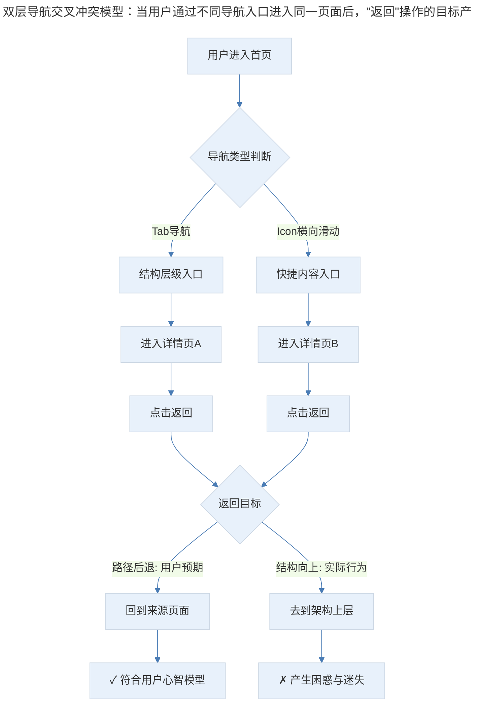
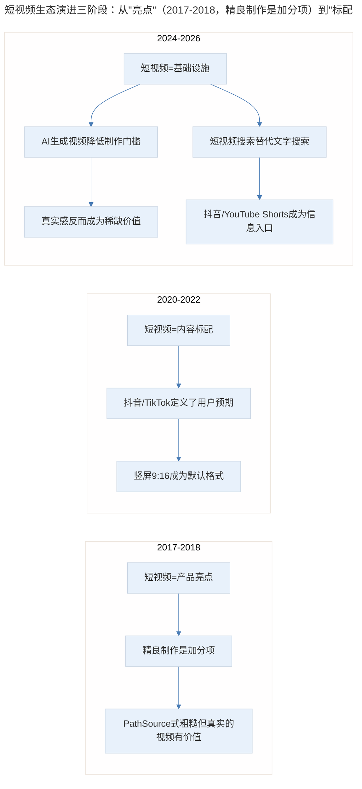
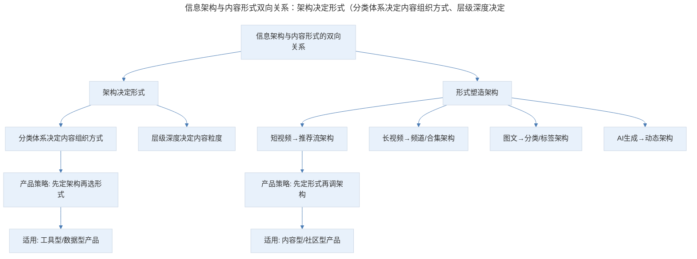
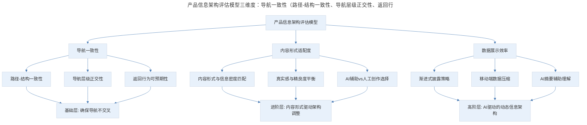

# 产品案例分析：PathSource 的混乱与直观

## 1. 导言

PathSource 是一款面向学生与职场新人的学业职业规划应用，其双层导航交叉设计暴露了信息架构中的路径-结构冲突问题——"路径后退"与"结构向上"的混淆让用户迷失方向。与此同时，其采访短视频功能展现了内容形式对产品体验的巨大增益：非精良但真实、有价值的视频内容，远比纯文字更具感染力。在短视频已成为基础设施的今天，PathSource 的案例启示我们：信息架构必须尊重用户的路径预期，而内容形式的选择应服务于信息传递的本质需求，而非追逐制作精良的表象。

> **更新说明**：本文档于 2026-06 更新，主要更新点：补充 PathSource 产品现状（已下架）；以 TikTok/抖音短视频生态重新审视"视频的直观感染力"；增加信息架构与内容形式关系的深度分析；引入 AI 时代短视频生成对产品内容策略的影响；增加专业深度分层与 Mermaid 流程图。

## 2. 核心概念：产品定位与现状

PathSource 是一个关注学业和职场的应用，主要目标用户是学生以及职场新人，帮助用户选择学校、专业，以及寻找工作。围绕这个目的，PathSource 中提供了各种跟职业、专业、学校相关的信息和数据。

**产品现状更新**：截至 2026 年，PathSource 已从 App Store 下架，其官网也已停止维护。这一结局并不令人意外——职业规划赛道在 2018-2025 年间经历了剧烈洗牌，LinkedIn Learning、Coursera Career Academy、以及各类 AI 驱动的职业规划工具（如 Kickresume AI、Resume.io）已重新定义了这个市场。PathSource 的衰落，部分原因正是其信息架构的混乱导致用户留存不足，在竞争加剧时缺乏护城河。

然而，PathSource 留下的设计教训——尤其是导航混乱与视频感染力这一对矛盾——在今天反而更具参考价值。

## 3. 关键方法：导航的迷茫——双层导航的交叉陷阱

### 3.1 问题还原

打开 PathSource 的第一个页面后，下面有几个 Icon，看起来像某种形式的导航，还可以横向滑动；而在整个结构下面，还有 Tab 导航——两层导航。这种导航不罕见，但一般在概念上，两种导航尽量不要有交叉，否则就很容易让用户感到困惑。

点这几个 Icon 进入一个页面后，在这个页面上如果点返回，去到的不是刚才的首页，而是这个页面在信息架构结构上的上一层。这种"路径-结构"的混淆，是移动端导航设计中最常见的陷阱之一。

### 3.2 路径后退 vs 结构向上：深层设计逻辑

我个人不认为这是一个好的设计，这让我想起 Windows 下的资源管理器，在一个文件夹里面，会有两种回退操作。一种叫做"向上"，也就是打开当前目录的上一级目录。一种叫"后退"，也就是回到你的前一个位置。

前一种是基于文件结构的，后一种是基于路径的。这两种功能的差异在 Windows 下并不大，因为 Windows 是严格按照目录结构来管理文件的，虽然有快捷方式之类的，但它把文件结构非常明确地交代给用户。

在 macOS 中，文件结构其实是被弱化的，我们可以去访问文档、音乐、照片，至于它们存在什么文件结构中，我们并不关心，操作系统也不让我们去关心；所以可以看到 macOS 中只有后退前进，没有所谓的"向上到上一层"。当然，你可以用组合键 Cmd+向上箭头去到目录上一层，如果不停地向上，可能会看到一个挺出乎意料的文件结构。

而在互联网上，所有的内容都是基于链接的，也就是说那个"后退"动作，应该是路径的后退，而不是结构的向上。如果我们想要表现内容结构，其实是通过页面上的样式，比如面包屑之类的，去表现结构；点后退的时候，用户的预期就是回到刚才那个熟悉的页面，而不是去到一个没见过的、不在路径中的页面。

### 3.3 信息架构中的导航冲突模型

> 双层导航交叉冲突模型：当用户通过不同导航入口进入同一页面后，"返回"操作的目标产生歧义——用户预期的是"路径后退"（回到来源页），但系统执行的是"结构向上"（回到架构上层）。这种心智模型与系统行为的不一致，是导航混乱的根源。

**图表解读**：上图展示了双层导航交叉时的核心冲突。当用户通过不同导航入口进入同一页面后，"返回"操作的目标产生了歧义——用户预期的是"路径后退"（回到来源页），但系统执行的是"结构向上"（回到架构上层）。这种心智模型与系统行为的不一致，是导航混乱的根源。

### 3.4 恶意利用与行业现状

有些特别鸡贼的新闻网站，直接进入新闻详情页之后，会篡改浏览器的后退位置。当用户点击后退时会跳到新闻列表页，而不是回到用户进入这个详情页之前的那张页面。

比如在朋友圈看到一篇新闻，打开看完之后点后退，我们本能地会期待回到朋友圈，结果它不，它打开了一个新闻列表。这样的特性，可以理解为是为了用户的留存和访问深度，但它确实是一个意料之外的跳转，体验并不好。

**2024-2025 年行业进展**：随着浏览器安全策略的升级，Chrome 116+和 Safari 17+已对 `history.pushState` 滥用进行了限制，恶意篡改后退行为的技术手段已大幅减少。但在 App 内嵌 WebView 中，此类问题仍然存在——尤其是一些资讯类 App 和短视频 App，通过重写返回按钮逻辑来增加用户停留时长。

### 3.5 现代导航设计最佳实践

| 要点 | 说明 | 适用场景 |
|------|------|----------|
| 导航层级不交叉 | 两种导航体系在概念上应正交，避免同一入口同时属于两个层级 | 所有多层级导航产品 |
| 返回=路径后退 | 返回按钮始终回到用户来源页，而非架构上层 | 全场景通用 |
| 面包屑=结构表达 | 用面包屑表达信息架构层级，而非用返回按钮 | 层级较深的内容型产品 |
| 底部 Tab+顶部筛选 | Tab 负责大结构切换，顶部区域负责当前结构内的筛选/分类 | 电商、内容平台 |
| 手势返回尊重路径 | iOS 边缘滑动返回必须回到路径上一页，不可劫持 | 所有 iOS 应用 |

## 4. 实践落地：视频的直观感染力

### 4.1 PathSource 的短视频亮点

第二点说另一个我觉得值得一提的东西，是 PathSource 的采访短视频。

这里的采访内容主要是让受访人来介绍自己的职业，目的是让学生或职场新人可以充分了解这个职业。

我非常喜欢这样的形式，这应该是这个应用的一个很大的亮点。我们虽然已经看到太多的短视频，但印象里都是搞笑的或者感人的，或者讲情怀的，似乎都是经过"设计和制作"的。

PathSource 中的视频制作并不是非常精良，长度也不长，但却特别有价值。它能理解还没有进入这个工作岗位的人对于这个岗位的好奇；而这样的采访视频，远比通过文字更加简单和有感染力，可以让用户获取一些对这个职业比较直接和感性的认知。

这样的内容也让这款应用变得特别有活力。我们其实有很多做内容的应用，或是一些产品中的内容模块，完全可以用这样形式的视频，来增强内容的丰富程度和感染力。不一定非要制作精良、特别系统性的视频，或许一些简短的，甚至看起来有一点粗糙的视频，只要在内容上有价值可能就很好。

### 4.2 短视频从"亮点"到"基础设施"：2018-2026 的范式迁移

PathSource 在 2017-2018 年将短视频作为产品亮点，这在当时是前瞻性的。但今天，短视频已从"亮点"变成了"基础设施"——TikTok/抖音的全球月活超过 15 亿，短视频不再是一种内容形式的选择，而是用户消费内容的默认预期。

**短视频生态的关键变化**：

> 短视频生态演进三阶段：从"亮点"（2017-2018，精良制作是加分项）到"标配"（2020-2022，抖音/TikTok 定义用户预期、竖屏 9:16 成为默认格式）再到"基础设施"（2024-2026，AI 生成视频降低制作门槛、真实感成为稀缺价值、短视频搜索替代文字搜索）。

**图表解读**：短视频在产品中的角色经历了三个阶段——从"亮点"到"标配"再到"基础设施"。值得注意的是，当 AI 生成视频（Sora、Kling、Runway 等）让精良制作变得廉价时，"真实感"反而成了新的稀缺价值。PathSource 那种粗糙但真实的采访视频，在今天反而更具战略意义。

### 4.3 AI 时代的内容形式选择

2024-2025 年，AI 视频生成技术的突破（OpenAI Sora、快手 Kling、Pika 等）让视频制作门槛急剧下降。这对产品经理意味着：

| 维度 | 传统时代 | AI 时代 |
|------|----------|--------|
| 视频制作成本 | 高（拍摄+剪辑+后期） | 极低（AI 生成+轻量编辑） |
| 精良视频的稀缺性 | 高 | 低（AI 可批量生成精良内容） |
| 真实感的稀缺性 | 低（真实是默认状态） | 高（AI 内容泛滥后真实成为信任锚点） |
| 产品内容策略 | 用精良视频吸引用户 | 用真实内容建立信任，用 AI 辅助提升效率 |
| 用户预期 | 视频是加分项 | 视频是基本要求 |

**关键洞察**：当 AI 可以批量生成"精良"视频时，PathSource 式的"粗糙但真实"反而成为一种差异化优势。产品经理在制定内容策略时，需要重新思考"精良"与"真实"的平衡——在 AI 内容泛滥的时代，用户对真实人际互动的渴望只会更强烈。

### 4.4 信息架构与内容形式的关系

PathSource 的案例还揭示了一个更深层的问题：信息架构与内容形式之间存在双向塑造关系。

**传统观点**：先有信息架构，再选择内容形式填充。这是 PathSource 的做法——先搭建了职业/学校/专业的分类架构，再往里面填充文字数据和视频内容。

**更新观点**：内容形式本身会反向塑造信息架构。当短视频成为主要内容形式时，信息架构需要适配短视频的消费逻辑——竖屏滑动、沉浸式浏览、算法推荐，这些都会改变内容的组织方式。抖音的"推荐流"架构就是内容形式反向塑造信息架构的典型案例。

> 信息架构与内容形式双向关系：架构决定形式（分类体系决定内容组织方式、层级深度决定内容粒度，产品策略是先定架构再选形式，适用于工具型/数据型产品）；形式塑造架构（短视频→推荐流架构、长视频→频道/合集架构、图文→分类/标签架构、AI 生成→动态架构，产品策略是先定形式再调架构，适用于内容型/社区型产品）。

### 4.5 数据展示的齐整之美

最后想要特别提一下的是 PathSource 的学校详情页，每张页面上都有这个学校的一些数据展示，整个页面组织得非常齐整，但并不枯燥，很多设计细节给了我不少启发。在移动端呈现大量数据，其实是一件挺难的事情。

**2024-2026 年数据展示新趋势**：随着 AI 数据可视化工具的成熟（如 Observable、Flourish、以及 AI 辅助的 ChartGPT），移动端数据展示有了新的可能性：

- **渐进式披露**：先展示核心指标，用户点击后展开详细数据
- **AI 摘要**：用自然语言自动生成数据解读，降低用户理解门槛
- **交互式图表**：支持手势缩放、拖拽筛选的轻量图表组件
- **个性化数据视图**：根据用户关注点动态调整数据展示优先级

## 5. 实践指南：方法论框架与实战要点

### 5.1 方法论框架

> 产品信息架构评估模型三维度：导航一致性（路径-结构一致性、导航层级正交性、返回行为可预期性，基础层确保导航不交叉）、内容形式适配度（内容形式与信息密度匹配、真实感与精良度平衡、AI 辅助 vs 人工创作选择，进阶层内容形式驱动架构调整）、数据展示效率（渐进式披露、移动端数据压缩、AI 摘要辅助理解，高阶层 AI 驱动的动态信息架构）。

**图表解读**：产品信息架构评估模型从三个维度展开——导航一致性、内容形式适配度、数据展示效率。每个维度对应不同的专业深度层级：基础层确保导航不交叉（PathSource 未做到）；进阶层让内容形式驱动架构调整（PathSource 的短视频是亮点但未驱动架构）；高阶层利用 AI 实现动态信息架构（PathSource 时代尚无此能力）。

### 5.2 实战要点

| 要点 | 说明 | 适用场景 |
|------|------|----------|
| 双层导航不交叉 | 两种导航体系在概念上应正交，避免用户在返回时产生困惑 | 所有使用多层级导航的产品 |
| 返回=路径后退 | 返回按钮始终回到用户来源页，用面包屑表达结构层级 | 全场景通用 |
| 真实感>精良度 | 在 AI 内容泛滥时代，粗糙但真实的内容反而更具信任价值 | 内容型产品、社区产品 |
| 内容形式驱动架构 | 当短视频成为主要内容形式时，信息架构应适配其消费逻辑 | 内容平台、知识付费产品 |
| 渐进式数据披露 | 移动端数据展示先给核心指标，再允许用户按需展开 | 数据密集型产品 |
| AI 辅助内容生产 | 用 AI 降低视频制作门槛，但保留真实人际互动的内核 | 所有需要视频内容的产品 |

## 6. 进阶延展：专业深度分层与核心要点回顾

### 6.1 专业深度分层

**基础层**：

- 理解路径后退与结构向上的区别
- 确保产品导航层级不交叉
- 返回按钮行为符合用户预期

**进阶层**：

- 根据内容形式调整信息架构
- 在真实感与精良度之间找到平衡
- 设计渐进式数据披露策略

**高阶层**：

- 利用 AI 实现动态信息架构（根据用户行为实时调整内容组织方式）
- 在 AI 生成内容与用户原创内容之间建立协同机制
- 设计内容形式的混合策略（短视频+图文+AI 摘要的组合）

### 6.2 核心要点回顾

PathSource 的案例揭示了信息架构与内容形式的双重启示。在信息架构层面，双层导航交叉导致"路径后退"与"结构向上"的混淆，让用户迷失方向——返回按钮应始终回到用户来源页（路径后退），用面包屑表达结构层级；现代导航设计最佳实践包括导航层级不交叉、返回=路径后退、面包屑=结构表达。在内容形式层面，PathSource 的采访短视频展示了"真实感>精良度"的价值——在 AI 内容泛滥时代，粗糙但真实的内容反而更具信任价值；内容形式本身会反向塑造信息架构（短视频→推荐流架构），产品经理需要根据内容形式动态调整架构。产品信息架构评估模型从导航一致性、内容形式适配度、数据展示效率三个维度展开，分层指导产品设计。

### 6.3 延伸阅读

- 《无界面交互》（Golden Krishna）——关于让设计隐于内容之后的理念
- 《信息架构：超越 Web 设计》（Rosenfeld, Morville & Arango）——信息架构经典
- 《短视频时代的产品设计》——内容形式与架构的双向关系
- "Deceptive Design"（原 Dark Patterns）——导航操纵的识别与防范
- Nielsen Norman Group: "Navigation: You Are Here"——导航设计最佳实践

## 更新日志

| 版本 | 日期 | 更新内容 |
|------|------|----------|
| v1.0 | 2018-01 | 初始版本 |
| v2.0 | 2026-06 | 补充 PathSource 下架现状；以 TikTok/抖音生态重新审视短视频价值；增加 AI 时代内容形式选择分析；增加信息架构与内容形式双向关系模型；增加 Mermaid 流程图与专业深度分层 |