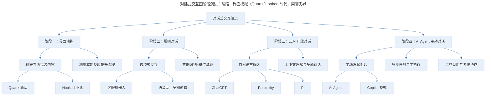
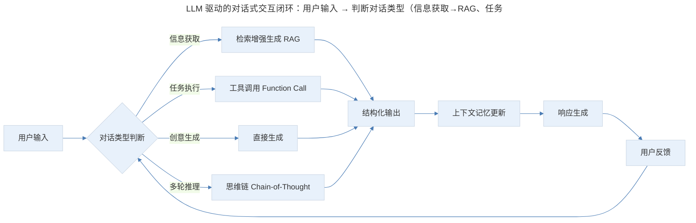
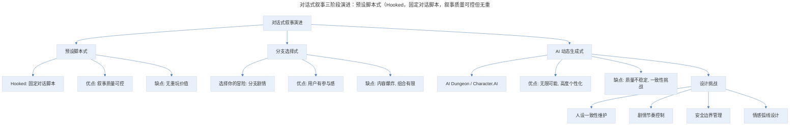

# 产品案例分析：Quartz & Hooked 的对话式交互

## 1. 导言

对话式交互从早期的"模拟聊天界面"演进到 AI Agent 驱动的"真正对话"，经历了范式级的跃迁。Quartz 和 Hooked 代表了 2017 年前后"用聊天界面包装内容"的设计思路，利用用户对聊天界面的本能反应来提升阅读沉浸感；而 ChatGPT、Perplexity、Pi 等产品的出现，使"人机对话"从受限的选项式交互跃升为开放式自然语言交互。对话式交互不再只是 UI 范式，而是正在成为产品本身的核心形态。产品经理需要理解这一演进脉络，在不同场景下选择合适的对话式交互策略。

> **更新说明**：本文档于 2026-06 更新，主要更新点：1）Quartz App 已于 2020 年前后停止运营，原文中关于 Quartz 的案例分析保留为历史参考，新增 ChatGPT/Perplexity 等 LLM 驱动的对话式产品作为当代案例；2）原文"人机对话"观点已严重过时——AI 已能进行开放式对话，对话式交互进入 AI Agent 全新时代；3）新增对话式交互演进框架、专业深度分层、Mermaid 流程图。

## 2. 核心概念：方法论框架与对话式交互演进

### 2.1 对话式交互演进框架

> 对话式交互四阶段演进：阶段一界面模拟（Quartz/Hooked 时代，用聊天界面包装内容，AI 能力为零）、阶段二规则对话（客服机器人、语音助手早期形态，基于规则和意图识别）、阶段三 LLM 开放对话（ChatGPT、Perplexity、Pi，实现真正的开放式对话）、阶段四 AI Agent 主动对话（AI Agent、Copilot 模式，AI 不仅能对话还能主动执行任务）。每个阶段是叠加关系而非替代关系。

**图表解读**：对话式交互经历了四个阶段的演进。阶段一（Quartz/Hooked 时代）本质是"用聊天界面包装内容"，AI 能力为零；阶段二是传统聊天机器人，基于规则和意图识别；阶段三以 ChatGPT 为标志，实现了真正的开放式对话；阶段四是当前正在发生的 AI Agent 范式，AI 不仅能对话，还能主动执行任务。每个阶段并非替代关系，而是叠加关系——不同场景适用不同阶段的设计。

## 3. 关键方法：聊天式界面的黏着力

### 3.1 原文回顾：聊天界面的本能反应

Quartz 是一款新闻应用，它完全基于对话界面呈现新闻内容。打开它的第一感觉像打开了一个聊天界面——看到聊天界面的时候，你的第一感觉是什么？

可以体会一下，自己在看到一个微信聊天的时候，是会有本能反应的。越来越多的广告和线下活动的海报上，会用聊天记录作为图片，聊天的内容就是营销的内容。我有一次在看一个长长的列表时，本能地盯住了其中一个聊天界面的图片，仔细读了一下，读完才反应过来，这个过程几乎是下意识的。

### 3.2 认知科学视角的深化

为什么聊天界面有如此强的黏着力？原文提出了两个解释，我们在此基础上补充认知科学的深层分析：

**解释一：肌肉记忆与模式识别**。我们的阅读习惯已经被手机和即时消息应用切分得非常细碎，每天在微信或短信中进行大量练习，已经在脑子里形成了思维模式和肌肉记忆。一旦识别到对话界面的模式，就会自然而然地开始从上往下读内容。

**解释二：窥私欲与社交好奇**。人性有比较阴暗的一面，我们可能会下意识地认为这是别人的聊天记录，而聊天场景又很私密，可能会激发我们想去偷看的欲望。

**补充解释三：认知负荷最小化**。根据认知负荷理论（Cognitive Load Theory, Sweller, 1988），聊天界面的线性结构天然降低了外在认知负荷——用户不需要理解复杂的页面布局，只需沿时间线自上而下阅读，这与人类最自然的阅读习惯完全一致。

**补充解释四：社交临场感**。根据 Short 等人提出的社交临场感理论（Social Presence Theory），对话界面暗示"有一个人在跟你说话"，这种拟人化的信息呈现方式比传统列表式呈现更能激发用户的情感参与。

### 3.3 当代验证：短视频与聊天式广告的持续演化

2024-2025 年，聊天式界面在营销领域的应用不仅没有衰退，反而更加深入：

- **抖音/快手评论区广告**：品牌以"评论回复"的形式植入广告，用户在刷评论时自然接收
- **小红书"对话式笔记"**：用聊天截图形式分享产品体验，转化率显著高于传统图文
- **微信朋友圈广告**：以聊天记录形式呈现的广告创意持续获得高互动率

这些现象持续验证了原文的核心洞察：聊天界面对人类有近乎本能的吸引力。

## 4. 实践落地：模拟人类的对话感——从 Quartz 到 ChatGPT 的范式跃迁

### 4.1 Quartz 的对话设计策略

Quartz 中的新闻不会在一个气泡里把所有内容写完，而是分成好多句话，模拟聊天对话场景。读起来的负担非常轻，还有循序渐进的感觉。内容完全模拟聊天语气，信息出现也不是一下出现很多条，而是模拟"正在输入"的效果，再出现内容。

Quartz 对用户的互动预期是有管理的——只提供选项，通过对选项的设计加入人情味，用不同的短语或表情让用户不至于觉得乏味。

### 4.2 原文观点的过时之处

原文写道："人机对话的应用很多时候是在这里放一个对话框，你可以随便打字，或者说话，这是个对算法能力要求极高的暗示……目前算法很难像人类一样跟你唠嗑，它可能只能对特定的内容和领域反应很好。"

**这一观点在 2023 年后已被彻底颠覆。** ChatGPT 的发布证明，AI 不仅能"跟你唠嗑"，还能在开放域对话中表现出令人惊讶的理解力和创造力。我们有必要重新审视对话式交互的设计哲学。

### 4.3 LLM 时代的对话式交互新范式

> LLM 驱动的对话式交互闭环：用户输入 → 判断对话类型（信息获取→RAG、任务执行→Function Call、创意生成→直接生成、多轮推理→Chain-of-Thought）→ 结构化输出 → 上下文记忆更新 → 响应生成 → 用户反馈，形成"理解意图→选择策略→执行推理→结构化输出→记忆更新"的完整闭环。

**图表解读**：LLM 驱动的对话式交互不再是简单的"输入-匹配-输出"模式，而是形成了"理解意图→选择策略→执行推理→结构化输出→记忆更新"的完整闭环。产品经理在设计 AI 对话产品时，需要考虑每个环节的设计策略。

**当代对话式产品对比**：

| 产品 | 对话模式 | 核心创新 | 适用场景 |
|------|----------|----------|----------|
| ChatGPT | 开放式多轮对话 | 通用推理能力 | 知识问答、创意写作、编程辅助 |
| Perplexity | 对话式搜索 | 引用溯源+结构化摘要 | 信息检索、研究调研 |
| Pi (Inflection) | 情感化对话 | 拟人化语气与共情 | 情感陪伴、日常闲聊 |
| Character.AI | 角色扮演对话 | 人设一致性 | 娱乐、教育、创意 |
| Kimi (月之暗面) | 长文档对话 | 超长上下文窗口 | 文档分析、深度阅读 |
| ChatGPT Canvas | 对话+协作画布 | 双栏编辑模式 | 写作、编程协作 |

### 4.4 从"管理预期"到"超越预期"

Quartz 的设计哲学是"管理用户预期"——通过限制选项来避免用户失望。而 LLM 时代的设计哲学是"超越用户预期"——通过强大的理解能力来处理开放输入。

但这并不意味着"管理预期"的设计思路过时了。实际上，优秀的 AI 产品仍然需要精心管理用户预期：

- **ChatGPT 的 System Prompt**：本质上就是在管理 AI 的行为边界
- **Perplexity 的 Focus 模式**：让用户选择搜索领域，缩小预期范围
- **Copilot 的上下文感知**：根据当前工作场景自动调整对话范围

### 4.5 建立在对话模式上的小说阅读：Hooked 的遗产与后续

Hooked 是一个对话式小说 App，曾一度超过 SnapChat 冲上 App Store 榜首。其创始人做过一个测试：让年轻人在手机上阅读一千词的小说，最好情况下只有三分之一读到了最后；但将小说改成文本消息的展示方式后，几乎所有人都读完了。

这个应用把故事建立在对话中，通过对话推进故事进展，阅读体验极其碎片——读一句话，然后用产品形态隔开，顿一下，切得很细，但确实非常容易沉迷，尤其故事中充满悬念时。

其付费模式也容易让用户接受：按阅读时长做限制，读到一定时间后暂停，过一段时间才能继续读。

**对话式叙事的当代演化**：

- **抖音/快手短剧**：用对话气泡+字幕的形式呈现剧情，本质是 Hooked 模式的视频化
- **AI 角色扮演对话**（Character.AI / Talkie）：用户与 AI 角色实时对话推进剧情，从"读对话"变成"参与对话"
- **互动叙事游戏**（如《生命线》系列后续作品）：实时推送式叙事，结合通知系统创造沉浸感
- **微信小程序互动小说**：国内市场将 Hooked 模式与微信生态结合，社交裂变驱动增长

### 4.6 AI 生成式叙事：从预设对话到动态生成

> 对话式叙事三阶段演进：预设脚本式（Hooked，固定对话脚本，叙事质量可控但无重玩价值）、分支选择式（选择你的冒险，用户有参与感但内容爆炸组合有限）、AI 动态生成式（AI Dungeon/Character.AI，无限可能高度个性化但质量不稳定）。AI 生成式引入人设一致性维护、剧情节奏控制、安全边界管理、情感弧线设计四大设计挑战。

**图表解读**：对话式叙事经历了从"预设脚本"到"分支选择"再到"AI 动态生成"的演进。AI 生成式叙事带来了无限可能，但也引入了新的设计挑战——产品经理需要在自由度和控制力之间找到平衡。

## 5. 实践指南：对话式交互分层实战指南

### 5.1 基础层：局部对话化改造

对于已有的应用，全盘推翻不是好主意，但可以在需要跟用户循序渐进交互的过程中使用对话方式：

| 应用场景 | 具体做法 | 参考案例 |
|----------|----------|----------|
| 新人引导 | 用对话方式逐步介绍功能 | Slack 的 Onboarding |
| 表单提交 | 将表单拆解为对话式问答 | Typeform、腾讯问卷 |
| 客服支持 | 用对话界面替代 FAQ 列表 | 各类智能客服 |
| 营销转化 | 用聊天记录形式呈现营销内容 | 小红书对话式笔记 |

### 5.2 进阶层：AI 增强的对话式体验

| 应用场景 | 具体做法 | 参考案例 |
|----------|----------|----------|
| 知识问答 | 接入 LLM 实现自然语言查询 | Perplexity、Kimi |
| 内容推荐 | 基于对话理解用户偏好 | ChatGPT 推荐对话 |
| 数据分析 | 用自然语言查询数据 | ChatGPT Code Interpreter |
| 写作辅助 | 对话式协作编辑 | ChatGPT Canvas、Notion AI |

### 5.3 高阶层：AI Agent 驱动的主动式对话

| 应用场景 | 具体做法 | 参考案例 |
|----------|----------|----------|
| 任务自动化 | AI 主动发起对话确认任务步骤 | ChatGPT with GPTs |
| 工作流编排 | AI 在多步骤流程中协调人与系统 | Microsoft Copilot Studio |
| 个性化陪伴 | AI 基于上下文主动推送信息 | Pi、Replika |
| 多 Agent 协作 | 多个 AI Agent 对话完成复杂任务 | AutoGen、CrewAI |

### 5.4 AI 对产品经理工作的影响

对话式交互的范式跃迁对产品经理的工作方式产生了深远影响：

1. **需求文档的对话化**：越来越多的团队开始用"与 AI 对话"的方式生成和迭代 PRD，而非传统的文档编写
2. **用户研究的 AI 辅助**：AI 可以模拟用户进行对话式测试，快速验证交互假设
3. **对话流设计成为新技能**：产品经理需要掌握 Prompt Engineering 和对话流设计
4. **从"设计界面"到"设计对话"**：在 AI Agent 时代，产品经理更多是在设计 AI 与用户的对话策略，而非页面布局

### 5.5 实战要点

| 要点 | 说明 | 适用场景 |
|------|------|----------|
| 聊天界面的本能吸引力 | 利用用户对聊天界面的下意识反应提升内容消费 | 内容型产品、营销场景 |
| 碎片化降低阅读门槛 | 将长内容拆解为对话片段，降低认知负荷 | 教育、阅读、新闻产品 |
| 管理用户预期 | 即使在 AI 时代，仍需通过设计管理对话边界 | 所有对话式产品 |
| 从界面模拟到真正对话 | LLM 使对话从 UI 范式变为产品核心形态 | AI 原生产品 |
| 场景化选择对话深度 | 不同场景适用不同阶段的对话式交互 | 产品功能规划 |
| AI Agent 主动对话 | AI 不再只是被动响应，而是主动发起和引导 | 智能助手、工作流自动化 |

## 6. 进阶延展：核心要点回顾

### 6.1 核心要点回顾

对话式交互经历了四阶段演进：界面模拟（Quartz/Hooked，用聊天界面包装内容）、规则对话（客服机器人，选项式交互）、LLM 开放对话（ChatGPT、Perplexity，开放式自然语言交互）、AI Agent 主动对话（AI Agent、Copilot，主动执行任务）。聊天界面因其肌肉记忆、窥私欲、认知负荷最小化与社交临场感，对人类有近乎本能的吸引力。Quartz 的"管理用户预期"设计哲学在 LLM 时代并未过时，但已从"限制选项"演进为"通过 System Prompt 管理行为边界"。Hooked 的对话式叙事模式在当代演化为短剧、AI 角色扮演、互动叙事与 AI 动态生成式叙事。产品经理需要根据场景选择对话式交互的深度，并在 AI Agent 时代从"设计界面"转向"设计对话"。

### 6.2 延伸阅读

- 《无界面交互》（Golden Krishna）：理解"少即是多"的交互哲学
- ChatGPT System Prompt 设计：学习如何通过 Prompt 管理对话预期
- Perplexity 的产品设计：对话式搜索的标杆实践
- Character.AI 的用户研究：AI 角色对话的用户心理分析
- 《认知负荷理论》（Sweller）：理解为什么碎片化对话降低阅读负担

## 更新日志

| 版本 | 日期 | 更新内容 |
|------|------|----------|
| v1.0 | 2018-01 | 初始版本，分析 Quartz 和 Hooked 的对话式交互设计 |
| v2.0 | 2026-06 | 全面更新：标注 Quartz 停运；新增 LLM 时代对话式交互范式分析；新增 AI Agent 主动对话阶段；补充认知科学视角；新增专业深度分层；新增 Mermaid 流程图 |