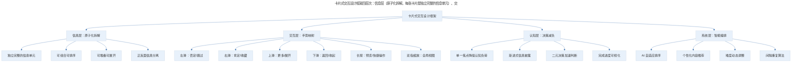
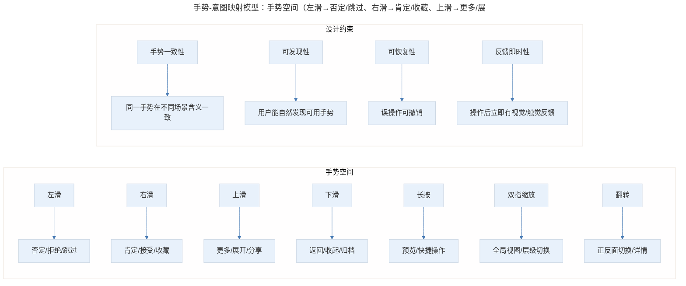
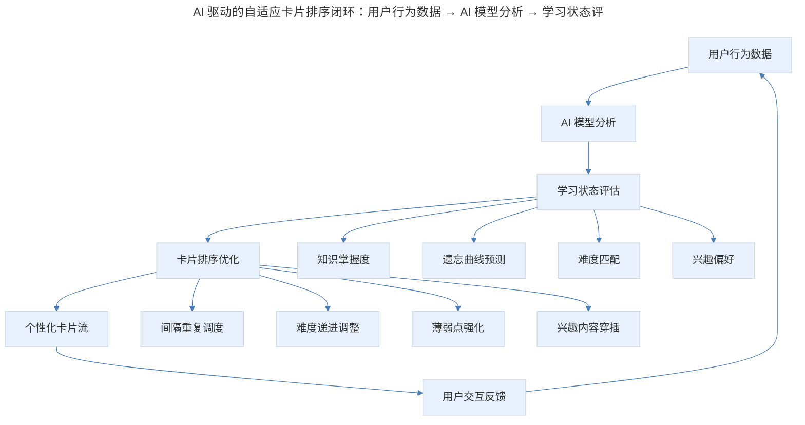

# 产品案例分析：Primer 的扑克牌交互

## 1. 导言

卡片式交互（Card-based Interaction）是移动端最成功的设计范式之一，它将信息拆解为可滑动、可堆叠、可翻转的独立单元，天然适配触屏操作和碎片化消费场景。Primer、Tinycards 等早期产品验证了卡片在教育领域的价值；Tinder 将左右滑动卡片引入社交领域并创造了全新的交互范式；2024-2025 年，卡片式交互在 AI 个性化推荐、空间计算（Apple Vision Pro）和短视频信息流中持续演化。产品经理需要理解卡片式交互的底层逻辑——信息原子化、操作手势化、决策轻量化——才能在不同场景下灵活运用。

> **更新说明**：本文档于 2026-06 更新，主要更新点：1）Tinycards 已于 2020 年被 Duolingo 关闭，Swiipe 已停止运营，Google Primer 已于 2022 年停止更新；2）新增当代卡片式交互案例（Duolingo、Tinder、小红书、Apple Vision Pro 等）；3）补充卡片式交互的理论框架与设计原则；4）新增 AI 驱动的自适应卡片推荐；5）新增专业深度分层与 Mermaid 流程图。

## 2. 核心概念：方法论框架与卡片式交互设计框架

### 2.1 卡片式交互设计框架

> 卡片式交互设计框架四层次：信息层（原子化拆解，每张卡片是独立完整的信息单元）、交互层（手势映射，左右上下滑动对应直觉操作意图）、认知层（决策减负，单一焦点降低认知负荷、二元决策加速判断）、系统层（智能编排，AI 自适应排序、个性化推荐、难度动态调整、间隔重复算法）。

**图表解读**：卡片式交互的设计框架包含四个层次。信息层解决"内容如何拆解"的问题——每张卡片是一个原子化的信息单元；交互层解决"用户如何操作"的问题——手势与操作意图的自然映射；认知层解决"用户如何理解"的问题——降低决策负担；系统层解决"如何智能化"的问题——AI 驱动的个性化编排。四层协同，才能设计出优秀的卡片式体验。

## 3. 核心概念：Primer 的卡片设计——自然接受的暗示

### 3.1 原文回顾

Primer 是 Google 出品的一个技能学习类应用，通过卡片介绍和讲授独立话题。它采用 Material Design 规范，卡片是其中很重要的元素。

Primer 的结构非常直观：Lesson 和 Lesson Sets，Lesson 包含于 Lesson Sets 中。一个课程中有说明性卡片和互动式卡片，这些分类用户不需要理解和区分，很自然。在整个课程推进过程中，用户要做的就是读内容、翻卡片，卡片会随着手的方向被推走。有的卡片是一张，有的是一叠——一叠是一个知识点，一张是一句话，但在使用过程中，用户很自然地就会接受这个暗示。

### 3.2 Primer 的状态更新

Google Primer 已于 2022 年停止更新，其内容已迁移至 Google 的其他学习平台。Primer 的核心设计理念——卡片式课程、互动式学习、渐进式披露——仍然具有极高的参考价值，但其产品形态已属于上一个时代。

### 3.3 值得重新审视的设计细节

**双指缩放的全局视图**：当两个手指缩放时，可以看到完整的课程结构，灰掉的卡片是还没看到的，不能点开。这个设计把水平和竖直两个方向都利用起来，是一种非常优雅的信息架构可视化方式。

**强制互动的"考试"卡片**：App 会拦住用户不断翻卡的过程，让用户做题。有些题目其实是告知的过程，通过让用户做选择，强制思考，而不是开自动挡一张张划卡。这一设计原则在当代产品中仍然广泛使用。

## 4. 关键方法：卡片式交互的理论基础

### 4.1 信息原子化原则

卡片式交互的底层逻辑是信息原子化——将复杂的信息结构拆解为独立、完整、可组合的最小单元。每张卡片应该满足：

| 原则 | 说明 | 示例 |
|------|------|------|
| 独立性 | 单张卡片能独立传达一个完整信息点 | Primer 的单张知识卡片 |
| 完整性 | 卡片内的信息自洽，不依赖其他卡片 | Tinycards 正面问题+反面答案 |
| 可组合性 | 卡片可以按不同顺序排列组合 | 课程中卡片的灵活排序 |
| 可扩展性 | 卡片可以堆叠、展开、翻转 | Primer 的一叠卡片 |

### 4.2 手势-意图映射模型

> 手势-意图映射模型：手势空间（左滑→否定/跳过、右滑→肯定/收藏、上滑→更多/展开、下滑→返回/收起、长按→预览、双指缩放→全局视图、翻转→正反面切换）与设计约束（手势一致性、可发现性、可恢复性、反馈即时性）。

**图表解读**：手势与意图的映射需要遵循一致性、可发现性、可恢复性和反馈即时性四个约束。Tinder 的左右滑动之所以成功，正是因为它完美满足了这四个约束——左滑右滑含义直觉，手势自然可发现，可以回退上一张，滑动时有即时视觉反馈。

### 4.3 决策心理学视角

卡片式交互的"一次一张"设计，本质上是利用了决策心理学中的几个关键效应：

- **选择过载效应**（Choice Overload, Iyengar & Lepper, 2000）：选项过多反而降低决策质量和满意度。卡片式交互通过"一次一张"将多选变单选，规避选择过载。
- **锚定效应**（Anchoring Effect）：当前卡片成为决策锚点，用户只需判断"比上一个好还是差"，而非绝对评估。
- **损失厌恶**（Loss Aversion, Kahneman & Tversky）：Tinder 式的"左滑就永远错过"利用了损失厌恶心理，促使用户更认真地对待每张卡片。

## 5. 实践落地：卡片式交互的当代案例全景

### 5.1 教育领域：从 Tinycards 到 Duolingo

Tinycards 已于 2020 年被 Duolingo 关闭，但其核心设计理念——正面问题、反面答案的闪卡交互——被 Duolingo 完整继承并大幅增强：

| 对比维度 | Tinycards (已关闭) | Duolingo (2025) |
|----------|-------------------|-----------------|
| 卡片类型 | 静态闪卡 | 动态互动卡片（填空、选择、配对） |
| 进度机制 | 简单完成标记 | 经验值、连胜、排行榜 |
| 算法驱动 | 固定顺序 | 间隔重复+AI 自适应难度 |
| 社交机制 | 基础分享 | 好友排行、公会系统 |
| 个性化 | 无 | AI 根据错误模式调整卡片顺序 |

Duolingo 的成功证明了：卡片式交互需要与游戏化机制和 AI 算法深度结合，才能在当代保持竞争力。

### 5.2 社交领域：Tinder 的范式演化

Tinder 将左右滑动卡片引入社交匹配，创造了"Swipe"交互范式。2024-2025 年，Tinder 的交互模式经历了重要演化：

- **Explore 标签页**：从纯卡片滑动到分类浏览，补充了"主动探索"的场景
- **AI 照片选择**：AI 帮用户选择最佳照片，卡片内容本身被 AI 优化
- **关系目标标签**：卡片上增加意图标签，减少匹配后的沟通成本
- **视频简介**：卡片从静态图片扩展到短视频，信息密度提升

Tinder 的演化说明：卡片式交互不是孤立存在的，它需要与推荐算法、内容丰富度、社交机制协同进化。

### 5.3 内容消费领域：小红书与信息流

小红书的双列瀑布流本质上是卡片式交互的变体——每张笔记是一张卡片，用户通过滑动浏览、点击展开。与 Tinder 的"决策型卡片"不同，小红书是"发现型卡片"：

| 维度 | 决策型卡片（Tinder） | 发现型卡片（小红书） |
|------|---------------------|---------------------|
| 核心动作 | 左右滑动做二元决策 | 上下滑动浏览发现 |
| 信息密度 | 低（快速判断） | 中高（吸引点击） |
| 算法角色 | 匹配推荐 | 内容发现推荐 |
| 卡片关系 | 互斥（选了 A 就不能选 B） | 独立（可以都看） |
| 心理驱动 | 损失厌恶 | 好奇心与探索欲 |

### 5.4 空间计算领域：Apple Vision Pro

Apple Vision Pro 将卡片式交互带入空间计算时代。visionOS 中的窗口（Window）本质上是悬浮在三维空间中的卡片：

- **空间卡片**：窗口可以自由移动、缩放、排列
- **深度层级**：卡片在 Z 轴上有前后关系
- **手势扩展**：除了左右滑动，增加了捏合、注视等空间手势
- **沉浸式过渡**：卡片可以展开为全沉浸空间

## 6. 进阶延展：AI 驱动的卡片式交互新范式与核心要点回顾

### 6.1 自适应卡片排序

传统卡片产品的排序是固定的或基于简单规则。AI 时代，卡片排序可以基于用户行为实时优化：

> AI 驱动的自适应卡片排序闭环：用户行为数据 → AI 模型分析 → 学习状态评估（知识掌握度、遗忘曲线预测、难度匹配、兴趣偏好）→ 卡片排序优化（间隔重复调度、难度递进调整、薄弱点强化、兴趣内容穿插）→ 个性化卡片流 → 用户交互反馈，形成"行为采集→状态评估→排序优化→反馈迭代"的闭环。

**图表解读**：AI 驱动的自适应卡片排序形成了"行为采集→状态评估→排序优化→反馈迭代"的闭环。Duolingo 已经在用类似机制，未来更多卡片式产品将采用这种模式。

### 6.2 AI 生成式卡片

AI 不仅能优化卡片排序，还能动态生成卡片内容：

- **Duolingo Max**：AI 根据用户错误模式生成针对性练习卡片
- **Quizlet Q-Chat**：AI 将闪卡转化为对话式学习体验
- **Notion AI**：将文档内容自动拆解为可复习的知识卡片
- **Anki + AI 插件**：自动从学习材料生成闪卡

### 6.3 卡片式交互与 AI Agent 的结合

AI Agent 可以将卡片式交互作为输出界面——将复杂的多步骤任务拆解为一系列卡片，用户逐张确认和操作：

- **ChatGPT 的卡片式输出**：搜索结果、代码块、图片以卡片形式呈现
- **Microsoft Copilot**：在 Office 中以卡片形式展示 AI 建议
- **iOS 18 智能建议**：以卡片形式推送 AI 生成的操作建议

### 6.4 分层实战指南

**基础层：信息展示型卡片**

| 应用场景 | 具体做法 | 参考案例 |
|----------|----------|----------|
| 课程学习 | 将知识点拆解为独立卡片 | Primer、Duolingo |
| 闪卡记忆 | 正面问题反面答案 | Anki、Quizlet |
| 新闻浏览 | 卡片式信息流 | 小红书、Google Discover |
| 产品展示 | 商品卡片浏览 | 淘宝、Amazon |

**进阶层：决策型卡片**

| 应用场景 | 具体做法 | 参考案例 |
|----------|----------|----------|
| 社交匹配 | 左右滑动做二元决策 | Tinder、探探 |
| 内容筛选 | 滑动筛选感兴趣内容 | TikTok 的"不感兴趣" |
| 问卷调查 | 卡片式逐题作答 | Typeform |
| 任务管理 | 卡片看板拖拽排序 | Trello、Notion Board |

**高阶层：AI 驱动的智能卡片**

| 应用场景 | 具体做法 | 参考案例 |
|----------|----------|----------|
| 自适应学习 | AI 根据掌握度动态调整卡片 | Duolingo Max |
| 个性化推荐 | AI 生成个性化内容卡片 | 各平台推荐流 |
| AI Agent 输出 | 将 AI 任务拆解为卡片流 | ChatGPT、Copilot |
| 空间计算 | 三维空间中的悬浮卡片 | Apple Vision Pro |

### 6.5 AI 对产品经理工作的影响

卡片式交互的智能化对产品经理提出了新的要求：

1. **从"设计卡片"到"设计卡片生成规则"**：AI 时代，产品经理不再逐张设计卡片，而是设计 AI 生成卡片的规则和约束
2. **排序算法成为核心产品决策**：卡片的呈现顺序直接影响用户体验，排序逻辑需要产品经理深度参与
3. **A/B 测试的颗粒度细化**：可以测试单张卡片的不同变体，而非整个页面
4. **卡片生命周期管理**：何时引入新卡片、何时淘汰旧卡片、何时复训，都需要数据驱动决策

### 6.6 核心要点回顾

卡片式交互是移动端最成功的设计范式之一，其底层逻辑是信息原子化、操作手势化、决策轻量化。Primer 通过卡片式课程、互动式学习、渐进式披露验证了卡片在教育领域的价值；卡片式交互的四层设计框架（信息层原子化拆解、交互层手势映射、认知层决策减负、系统层智能编排）为设计提供了系统化指导。当代卡片式交互在 Duolingo（教育+游戏化+AI 算法）、Tinder（社交 Swipe 范式）、小红书（发现型卡片）、Apple Vision Pro（空间计算）中持续演化。在 AI 时代，自适应卡片排序与 AI 生成式卡片成为新范式，产品经理从"设计卡片"转向"设计卡片生成规则"。

### 6.7 实战要点

| 要点 | 说明 | 适用场景 |
|------|------|----------|
| 信息原子化 | 将复杂内容拆解为独立完整的卡片单元 | 所有卡片式产品 |
| 手势自然映射 | 左右上下滑动对应直觉性操作意图 | 移动端卡片交互 |
| 渐进式披露 | 先展示概要，点击或翻转展示详情 | 信息密度高的场景 |
| 二元决策加速 | 一次只做"是/否"判断，降低决策负担 | 匹配、筛选场景 |
| AI 自适应排序 | 根据用户行为动态优化卡片顺序 | 教育、推荐场景 |
| 卡片与算法协同 | 卡片是界面，算法是引擎，两者需协同设计 | 所有智能卡片产品 |

### 6.8 延伸阅读

- Material Design Cards 规范：Google 官方卡片设计指南
- 《决策与选择心理学》（Kahneman）：理解决策心理学在卡片交互中的应用
- Duolingo 的间隔重复算法设计：教育类卡片产品的算法实践
- Tinder 的推荐算法架构：社交匹配类卡片产品的技术实现
- Apple Human Interface Guidelines - visionOS：空间计算时代的卡片设计

## 更新日志

| 版本 | 日期 | 更新内容 |
|------|------|----------|
| v1.0 | 2018-02 | 初始版本，分析 Primer、Tinycards、Swiipe 等卡片式交互 |
| v2.0 | 2026-06 | 全面更新：标注 Tinycards/Swiipe/Primer 停运或停更；新增 Duolingo/Tinder/小红书/Vision Pro 等当代案例；补充卡片式交互理论框架；新增 AI 驱动自适应卡片；新增专业深度分层与 Mermaid 流程图 |