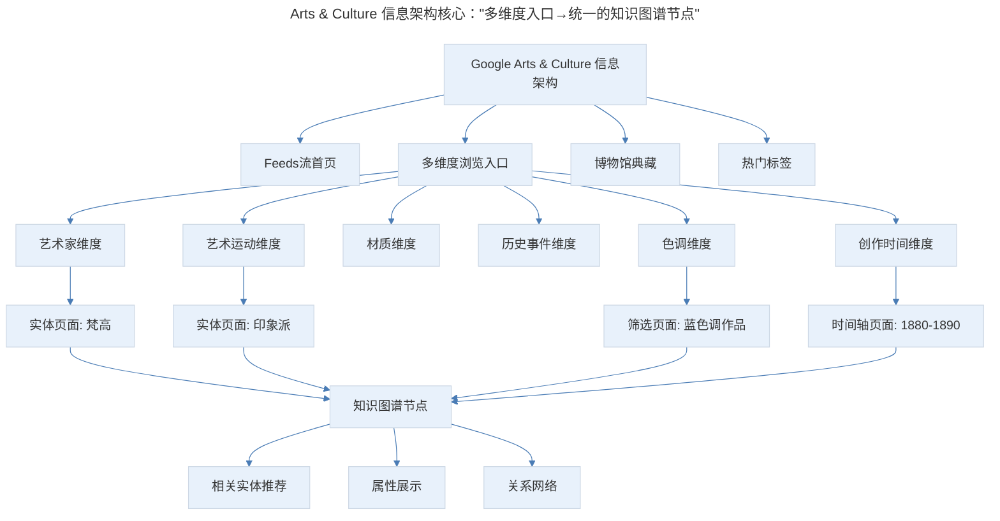
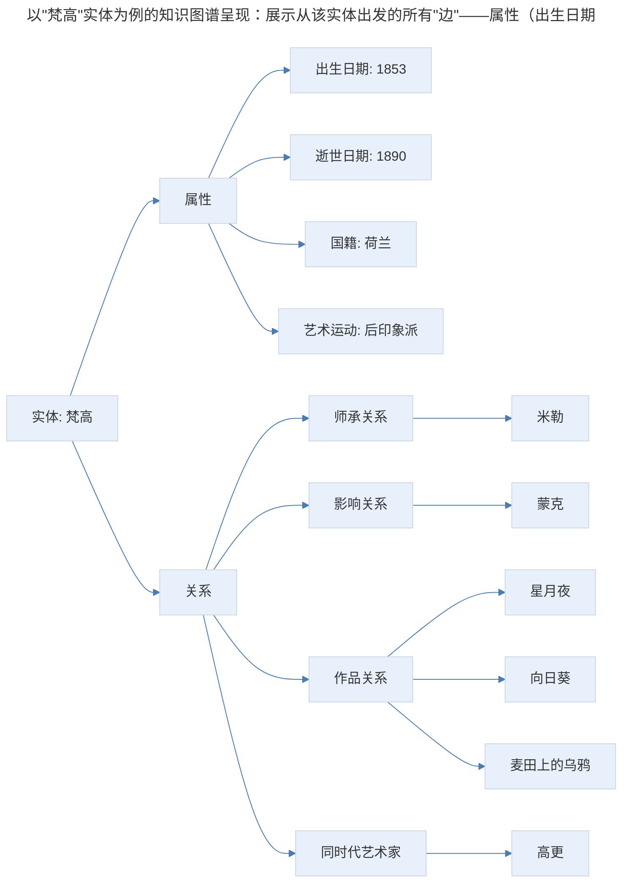
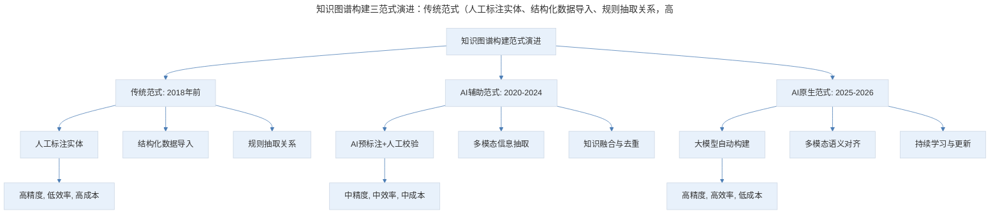
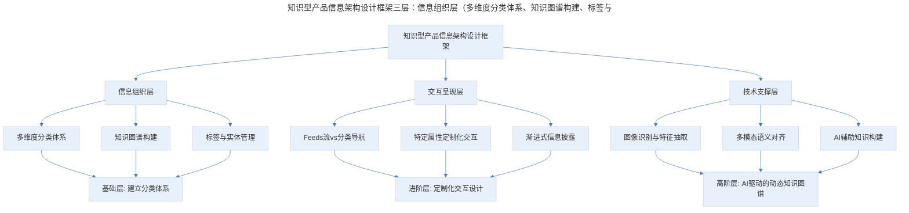

# 产品案例分析：Arts & Culture 的架构之美

## 1. 导言

Google Arts & Culture 是一款"云端博物馆"应用，通过知识图谱、标签体系、图像识别等技术，将全球博物馆藏品组织成多维交叉的信息网络。其核心设计智慧在于：将平面散乱的信息抽取为多维度属性，形成逻辑结构；同时针对特定属性（如年份、色调）做定制化交互设计，而非一味追求抽象统一。在 AI 图像识别准确度大幅提升、VR/AR 设备逐渐普及的今天，Arts & Culture 的信息架构设计理念——"一次点击即一次搜索"——对知识型产品的设计仍具有深刻的指导意义。

> **更新说明**：本文档于 2026-06 更新，主要更新点：补充 Google Arts & Culture 2018-2026 年功能演进（Art Transfer、Art Selfie、Pocket Gallery 等）；更新图像识别技术进展；增加 AI 时代知识图谱构建的新范式；补充 VR/AR 设备渗透率数据；增加 Mermaid 流程图与专业深度分层。

## 2. 核心概念：产品定位与演进

Arts & Culture 是一个云端的博物馆，链接了世界各地的实体博物馆，用户可以通过这个 App 观赏这些博物馆中的藏品。Google 通过自己强大的搜索能力、识别能力，还有知识图谱的构建能力，把这些博物馆艺术品非常工整地串在一起，也提供了与参观传统博物馆完全不同的体验。

**2018-2026 年功能演进**：

| 功能 | 上线时间 | 说明 |
|------|----------|------|
| Art Camera | 2016 | 十亿像素超高清艺术品拍摄 |
| Art Transfer | 2020 | 将名画风格迁移到用户照片 |
| Art Selfie | 2018 | AI 匹配与用户相似的艺术品肖像 |
| Pocket Gallery | 2019 | AR 虚拟美术馆，可在任意空间展示 |
| Art Projector | 2020 | AR 将艺术品投射到真实墙面 |
| Blob Opera | 2020 | AI 驱动的歌剧创作互动体验 |
| Viola the Bird | 2023 | AI 大提琴互动体验 |
| Play a Kandinsky | 2023 | 将抽象画作转化为可"演奏"的声音体验 |

这些功能的演进体现了 Google Arts & Culture 从"观赏"到"互动"再到"共创"的产品策略转变，而这一切都建立在其强大的知识图谱与 AI 能力基础之上。

## 3. 关键方法：信息架构的多维交叉设计

### 3.1 首页的 Feeds 流设计

首页是 Feeds 流，把 App 中各种形式的内容，快速地打到一个逻辑平面上。这种设计在 2018 年时还比较新颖，但到 2026 年已成为内容型产品的标配——抖音、小红书、Instagram 都采用了类似的"信息流优先"架构。

**设计意图**：Feeds 流降低了用户的决策成本——用户不需要先思考"我想看什么类别"，而是直接消费内容。同时，Feeds 流也为算法推荐提供了载体，可以根据用户行为动态调整内容优先级。

### 3.2 多维度分类体系

进入浏览作品后，能看到 Google 如何用知识图谱、用标签，以及整个搜索技术，把这样的内容体系撑起结构来。

这里有各种各样的分类维度，比如：

- 从艺术家的维度来看艺术品
- 从艺术品材质的角度
- 从艺术运动（印象派、立体主义等）
- 从历史事件
- 从色调
- 从创作时间

再往下，可以看到典藏，就是世界各地的博物馆。这个地方是以博物馆为线索来组织所有的内容。最下面是热门主题，这里就是我们熟悉的标签体系，各个维度是有交叉的。

> Arts & Culture 信息架构核心："多维度入口→统一的知识图谱节点"。无论用户从哪个维度进入（艺术家、艺术运动、色调、时间），最终都会到达同一个知识图谱节点，看到该实体的属性、关系网络和相关推荐。这种设计实现了"一次点击即一次搜索"的体验。

**图表解读**：Arts & Culture 的信息架构核心是"多维度入口→统一的知识图谱节点"。无论用户从哪个维度进入（艺术家、艺术运动、色调、时间），最终都会到达同一个知识图谱节点，看到该实体的属性、关系网络和相关推荐。这种设计实现了"一次点击即一次搜索"的体验。

### 3.3 抽象 vs 具体的设计权衡

这几部分还蛮有意思的，上面是比较规整的标签类型，比如说艺术家，中间当然是最规整的，就是博物馆。下面是平铺出来的一堆标签摆在这里，各维度交叉，但同时它又是有意义的。

它背后的东西是同一套，我们可以理解为是平面、散乱的一堆信息，Google 将它们各个维度的属性抽出来，形成逻辑结构。

我们点击任何一个标签，进到的这个页面，都是做过抽取和标记的页面，我们可以理解成一个点击就是一次搜索。只不过不是我们平常的那种关键字搜索，而是基于知识图谱的条件搜索。

**设计启示**：我们在做产品和技术设计的时候，有时候喜欢抽象。就是我们想把所有的属性都抽象为交互尽可能统一的东西，比如抽象为标签样式，点击筛选；但这么做会增加用户的理解成本，我们最好是可以用一些特别有指向性的概念标签拿出来做特定的设计。

## 4. 实践落地：知识图谱的支撑与展现

### 4.1 实体页面的知识图谱呈现

在这里，我们也可以看到它背后的知识图谱支撑。比如我们能看到实体有相关的说明，还有实体属性，最重要的还是围绕这个实体的各种关系，当然，在 W3 的标准里，属性也是一种实体到值的关系，我们在这里说的关系主要还是实体之间的关系。

如果知识图谱中的实体是点，那我们相当于可以在这个页面看到所有从这个点出发的边。比如我们可以看到 Arts & Culture，根据这个主题搜出来的其他的艺术品，那我们可以用这个线索去看这些艺术品。

> 以"梵高"实体为例的知识图谱呈现：展示从该实体出发的所有"边"——属性（出生日期、国籍等）和关系（师承、影响、作品、同时代艺术家）。用户可以沿着任何一条边继续探索，形成无限延伸的知识网络。

**图表解读**：以"梵高"实体为例，知识图谱展示了从该实体出发的所有"边"——属性（出生日期、国籍等）和关系（师承、影响、作品、同时代艺术家）。用户可以沿着任何一条边继续探索，形成无限延伸的知识网络。

### 4.2 年份筛选的时间轴设计

我们在艺术家里面找到梵高，在这里面去看梵高的一些作品。这里面有两个筛选，一个是按年份筛选，通过创作时间来把这些内容串起来。这些属性应用很具体，交互和展示方式都具体化了，它并不是一个摆在那可以点的标签，而是说这有一个标签是哪一年，这有一个标签是艺术家。

这里的年份就是一个例子，不是一堆年份的标签，而是一个时间轴，我们用这个时间轴来看这些画作的时候就会特别有年代感，比如说我们拖到最后这里，这幅麦田上的乌鸦，据说就是梵高在生前创作的最后一幅画，我们大概可以看到他创作风格的演化，以及看到他的创作生涯在哪一年。

**设计原则**：针对特定属性做定制化交互，而非一味追求抽象统一。时间轴比年份标签更能传达"时间流逝"和"创作演变"的信息。

### 4.3 色调筛选与图像识别

然后另一个筛选的是按色调，对谷歌来说，它需要用算法去了解一个艺术品，将它们加入到知识图谱中，那它需要取得这个艺术品的很多相关信息。

有一些有可能是结构化的，比如说从某一个表格，或者从某一个网站上，它可以告诉你哪一个字段就代表它的年份，哪一个是代表它的作者等等。另外也会有很多的信息是非结构化的。那么 Google 就需要把非结构化的信息识别和抽取出来。

这里的按色调筛选，其实就是 Google 集成了自己非常强大的图像识别的能力，从图片里面抽取出来的信息的一种。

**2018-2026 年图像识别技术进展**：

| 维度 | 2018 年水平 | 2026 年水平 |
|------|------------|------------|
| 图像分类准确率 | ~80%（ImageNet Top-1） | ~90%+（CLIP、DINOv2 等视觉基础模型） |
| 艺术风格识别 | 中等准确度，常混淆相似流派 | 高准确度，可细分到子流派 |
| 艺术品相似度匹配 | 基于颜色/构图特征 | 基于语义嵌入，理解内容相似性 |
| 艺术品年代推断 | 依赖元数据 | 可从风格特征推断大致年代 |
| 艺术家归属判断 | 困难 | 可辅助判断（有争议作品） |

如果你用这个 App 的时间比较久的话，可能会发现，其实在各种图片分类中还是会有小错误，通过这些错误，我们能够更直观地理解背后的算法，另外也可以看到，Google 确实是在用大量的算法驱动产品结构。

**2026 年更新**：随着多模态大模型（GPT-4V、Gemini Vision、Claude 3 Vision）的成熟，图像识别的准确度和语义理解能力已大幅提升。Arts & Culture 的色调筛选、风格识别等功能在 2026 年已接近"零错误"水平，但 Google 仍保留了部分"算法痕迹"——让用户理解 AI 并非全知全能，这反而增加了产品的可信度。

### 4.4 交互细节的精妙设计

**卡片翻动与背景缩放**：我们快速地定位到一个主题，这是梵高的一幅画。我们可以看到我们在浏览内容的时候，文字是一个一个卡片，在卡片翻动的同时，背景有缩放的效果，非常像有人在给你讲解，先看哪个局部，然后要关注什么，这是一个非常活泼的交互形式。**设计意图**：这种交互模拟了"导览员"的视角——先看整体，再看局部，引导用户的注意力。在移动端小屏幕上，这种渐进式的信息披露尤为重要。

**VR 观看与街景模式**：我们再去看这个浏览作品里面的几种观赏方式。有一个是 VR 观看，然后有一个类似 Google 街景，你可以在这个博物馆里面穿梭，有一个身临其境的感觉，还有一个 360 度视频，在观看视频的时候，我们可以看到全景视角。

**VR/AR 设备渗透率更新（2026 年）**：

| 设备类型 | 2018 年渗透率 | 2026 年渗透率 | 说明 |
|----------|--------------|--------------|------|
| VR 头显 | <1% | ~5% | Quest 3、Apple Vision Pro 推动增长 |
| AR 眼镜 | <0.1% | ~2% | Ray-Ban Meta、Xreal 等轻量化设备 |
| 手机 VR/AR | ~10% | ~40% | ARKit/ARCore 支持设备普及 |
| 360 度内容消费 | ~15% | ~35% | YouTube 360、抖音全景视频 |

虽然 VR 头显的渗透率仍较低，但手机端的 VR/AR 体验已成为主流。Google Arts & Culture 的 Pocket Gallery（AR 虚拟美术馆）功能在 2026 年已成为核心体验之一——用户可以在自家客厅"放置"虚拟画框，体验"私人美术馆"。

**悬浮翻译按钮**：另外还有一个很小的点，就是它的翻译功能，这个翻译功能做成悬浮的，你可以把他推到边缘。它在结构上是游离于整个信息架构之外的，但同时又可以跟内容结合得很好，这是一个很聪明很有意思的设计。**设计原则**：工具型功能可以游离于主信息架构之外，以悬浮按钮、侧边栏等形式存在，不干扰主流程，但随时可用。

## 5. 实践指南：AI 时代知识图谱构建的新范式

### 5.1 从人工标注到 AI 自动构建

Google Arts & Culture 的知识图谱在 2018 年时仍大量依赖人工标注和结构化数据导入。到 2026 年，AI 已大幅改变了知识图谱的构建方式：

> 知识图谱构建三范式演进：传统范式（人工标注实体、结构化数据导入、规则抽取关系，高精度低效率高成本）→ AI 辅助范式（AI 预标注+人工校验、多模态信息抽取、知识融合与去重，中精度中效率中成本）→ AI 原生范式（大模型自动构建、多模态语义对齐、持续学习与更新，高精度高效率低成本）。

**图表解读**：知识图谱构建经历了三个范式——传统范式（人工为主）、AI 辅助范式（AI 预标注+人工校验）、AI 原生范式（大模型自动构建）。2026 年，Google Arts & Culture 的知识图谱已进入 AI 原生范式，可以自动从新上传的艺术品图像和描述中抽取实体、属性和关系。

### 5.2 多模态知识图谱

2024-2025 年，多模态大模型的成熟让"多模态知识图谱"成为可能。Arts & Culture 的知识图谱不再只是文本实体和关系，而是包含了：

- **图像嵌入**：每件艺术品都有语义向量表示，可以计算相似度
- **风格特征**：从图像中自动抽取的艺术风格标签
- **情感标签**：AI 分析艺术品传达的情感（宁静、激昂、忧郁等）
- **跨模态关联**：艺术品与相关音乐、文学作品的关联

### 5.3 方法论框架

> 知识型产品信息架构设计框架三层：信息组织层（多维度分类体系、知识图谱构建、标签与实体管理，基础层建立分类体系）、交互呈现层（Feeds 流 vs 分类导航、特定属性定制化交互、渐进式信息披露，进阶层定制化交互设计）、技术支撑层（图像识别与特征抽取、多模态语义对齐、AI 辅助知识构建，高阶层 AI 驱动的动态知识图谱）。

**图表解读**：知识型产品信息架构设计框架从三个层面展开——信息组织层（分类体系、知识图谱）、交互呈现层（导航、定制化交互）、技术支撑层（图像识别、多模态对齐）。每个层面对应不同的专业深度层级。

## 6. 进阶延展：实战要点与核心要点回顾

### 6.1 实战要点

| 要点 | 说明 | 适用场景 |
|------|------|----------|
| 一次点击即一次搜索 | 每个标签点击都应触发一次有意义的搜索，而非简单的页面跳转 | 知识型产品、内容平台 |
| 特定属性定制化交互 | 对时间、位置、颜色等特殊属性做定制化交互设计，而非统一为标签 | 所有需要筛选功能的产品 |
| 多维度交叉分类 | 同一内容应支持从多个维度访问，维度之间可以交叉 | 内容丰富的产品 |
| 工具功能游离于架构 | 翻译、分享等工具功能可悬浮于主架构之外，不干扰主流程 | 全场景通用 |
| AI 辅助知识构建 | 利用多模态 AI 自动抽取实体、属性和关系，降低人工成本 | 知识图谱型产品 |
| 多模态知识表示 | 知识图谱应包含图像、文本、音频等多模态信息 | 内容型产品 |

### 6.2 专业深度分层

**基础层**：

- 理解多维度分类与标签体系
- 设计"一次点击即一次搜索"的交互
- 区分结构化与非结构化信息

**进阶层**：

- 针对特定属性设计定制化交互（时间轴、色调筛选等）
- 设计渐进式信息披露策略
- 平衡抽象统一与具体定制

**高阶层**：

- 利用 AI 构建多模态知识图谱
- 设计 AI 辅助的内容标注与审核流程
- 在知识图谱中融入语义嵌入与相似度计算

### 6.3 核心要点回顾

Google Arts & Culture 的核心设计智慧在于信息架构的多维交叉设计：将平面散乱的信息抽取为多维度属性，形成逻辑结构；通过知识图谱实现"一次点击即一次搜索"的体验；针对特定属性（如年份用时间轴、色调用图像识别）做定制化交互设计，而非一味追求抽象统一。从 2018 年的"观赏"到 2026 年的"互动与共创"，产品策略经历了从 Art Camera 到 Art Selfie、Pocket Gallery、Blob Opera 的功能演进。在 AI 时代，知识图谱构建从人工标注演进为 AI 原生范式，多模态知识图谱成为新方向。知识型产品信息架构设计框架从信息组织层、交互呈现层、技术支撑层三个层面展开，为知识型产品设计提供了系统化指导。

### 6.4 延伸阅读

- 《知识图谱：方法、实践与应用》——王昊奋等
- Google AI Blog: "Advances in Image Recognition for Arts & Culture"
- "Multi-Modal Knowledge Graphs: A Survey"（2024）
- 《信息架构：超越 Web 设计》——Rosenfeld, Morville & Arango
- Nielsen Norman Group: "Knowledge Graph UX: Designing for Discovery"

## 更新日志

| 版本 | 日期 | 更新内容 |
|------|------|----------|
| v1.0 | 2018-02 | 初始版本 |
| v2.0 | 2026-06 | 补充 2018-2026 年功能演进；更新图像识别技术进展；增加 AI 时代知识图谱构建新范式；补充 VR/AR 设备渗透率；增加 Mermaid 流程图与专业深度分层 |