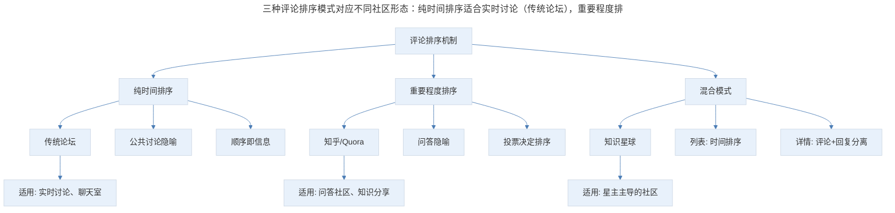
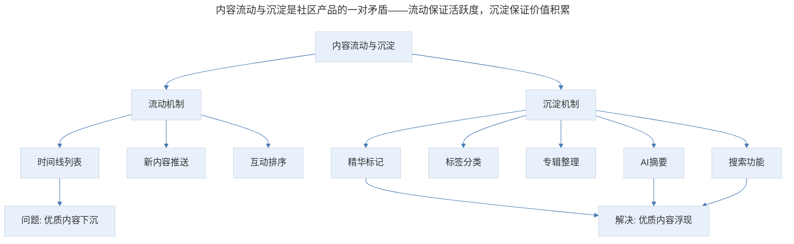
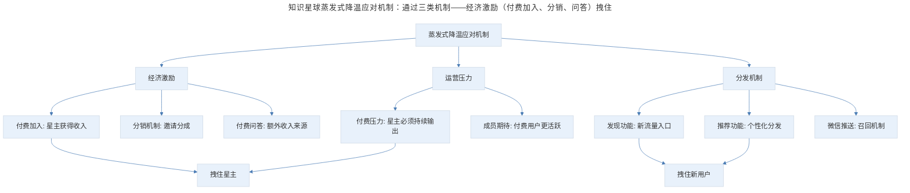
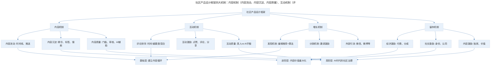

# 产品案例分析：解读知识星球

## 1. 导言

知识星球是一款"手机版论坛"产品，其核心设计智慧在于：在继承论坛基本形态的同时，通过评论排序机制、付费加入、内容沉淀策略等细节创新，使其成为"另一个物种"。知识星球面临社区产品的三大经典问题——内容流动与沉淀、内容分类与整理、蒸发式降温与留存——并通过星主运营、付费门槛、分销机制等手段应对。在微信推送机制收紧、AI 内容泛滥的今天，知识星球的设计理念对社区产品仍有重要参考价值，同时也面临新的挑战。

> **更新说明**：本文档于 2026-06 更新，主要更新点：补充知识星球 2018-2026 年功能演进；更新微信推送机制变化对产品的影响；分析"发现"功能从灰度到核心的演变；补充百度贴吧现状与社区产品演进；增加 AI 时代社区产品的新挑战与机遇；增加 Mermaid 流程图与专业深度分层。

## 2. 核心概念：产品定位与演进

知识星球的创始人吴鲁加老师曾这样介绍这款 App："你可以把知识星球理解为一个手机版的论坛。"

他的产品机制设计非常聪明，从哪里看都像是论坛，但众多细节差异又使得它似乎变成了另外一个物种。

**2018-2026 年功能演进**：

| 功能 | 上线时间 | 说明 |
|------|----------|------|
| 付费加入 | 2016 | 核心商业模式，星主设置入圈费用 |
| 分销机制 | 2018 | 分享赚钱，用户邀请新成员可获分成 |
| 发现功能 | 2018-2019 | 从灰度测试到核心功能，中心化推荐 |
| 精华与标签 | 2018 | 内容沉淀与分类机制 |
| 微信小程序 | 2018 | 无需下载 App 即可参与 |
| 圈子搜索 | 2020 | 站内搜索功能优化 |
| 问答功能 | 2021 | 星主可设置付费问答 |
| AI 摘要 | 2024 | AI 自动生成内容摘要 |
| 内容推荐 | 2025 | 基于用户兴趣的个性化推荐 |

这些功能的演进体现了知识星球从"去中心化工具"到"平台化社区"的转变——早期完全依赖星主自带流量，后期通过"发现"和"推荐"功能建立中心化流量分发能力。

## 3. 关键方法：评论排序机制的设计智慧

### 3.1 三种评论排序模式

一般在各种论坛或者社区这种有互动的产品中，评论或留言的排序方式有几种：

**第一种：纯时间排序**——比如传统的论坛都是这样，它是一种公共讨论的隐喻，就像大家聚在一起，你一句我一句的说话，这些内容的先后顺序本身就包含了信息。

**第二种：按重要程度排序**——比如知乎、Quora，它不像一堆人的讨论，而像是一个人和多个人的交流，可能是一个人问问题，其他人跟这个人对话。

**第三种：混合模式**——还有一种是像知识星球这样，评论按时间排序，然后将针对评论的评论再单独提出来。并且知识星球的设计是，在列表页看到的评论按时间排序，如果进入到某一条具体的帖子中，才是我们说的这种更复杂一些的评论展示形式。

> 三种评论排序模式对应不同社区形态：纯时间排序适合实时讨论（传统论坛），重要程度排序适合问答社区（知乎/Quora），混合模式适合星主/博主主导的社区（知识星球）。知识星球选择混合模式，是因为其社区形态是"星主发布内容，成员围绕内容互动"，而非"成员之间平等讨论"。

**图表解读**：三种评论排序模式对应不同的社区形态——纯时间排序适合实时讨论，重要程度排序适合问答社区，混合模式适合星主/博主主导的社区。知识星球选择混合模式，是因为其社区形态是"星主发布内容，成员围绕内容互动"，而非"成员之间平等讨论"。

### 3.2 百度贴吧的对比

百度贴吧之前同时用了这两种形态，也就是说所有的评论根据时间排序的同时，再根据评论之间的关系再冗余一遍。我不知道现在还是不是这样，没有去求证。

**2026 年百度贴吧现状**：百度贴吧在 2018-2026 年间经历了剧烈衰落。其核心问题包括：

- 内容质量下降，广告泛滥
- 蒸发式降温严重，头部用户大量流失
- 管理混乱，吧主权力滥用
- 移动端体验不佳，被小红书、知乎等取代

百度贴吧的衰落印证了社区产品"蒸发式降温"的致命性——当头部内容生产者离开，社区活跃度会坠崖式下降，新人由于群体隔阂也无法接上班。

## 4. 实践落地：社区产品的三大经典问题

从一个完成冷启动的社区的角度看，有老生常谈的三个问题：内容流动与沉淀、内容分类与整理、蒸发式降温与留存。我们看看知识星球的处理方案。

### 4.1 内容流动与沉淀

首先，由于列表的本身限制，会让很多优秀的内容沉下去，而且这些优秀内容也缺乏索引和结构，很容易淹没在一些低质量内容中。

知识星球用了一些筛选，也加了精华和标签的机制。这些手段，如果对于一个论坛来说，其实是远远不够的，随着内容增加就应付不过来了；但在移动端，由于碎片化的属性，可能会好很多，联想一下微信的朋友圈，以及半年、三天不可见的设置。可以理解在移动端的环境中，内容的预期寿命其实是很短的，沉淀可能问题不大。

**2026 年更新**：知识星球在 2024 年上线了 AI 摘要功能，可以自动为长内容生成摘要，帮助用户快速判断内容价值。同时，精华内容的"置顶"和"专辑"功能也得到了强化，让优质内容更容易被发现。

> 内容流动与沉淀是社区产品的一对矛盾——流动保证活跃度，沉淀保证价值积累。知识星球通过精华、标签、专辑、AI 摘要、搜索等机制解决优质内容下沉问题。

**图表解读**：内容流动与沉淀是社区产品的一对矛盾——流动保证活跃度，沉淀保证价值积累。知识星球通过精华、标签、专辑、AI 摘要、搜索等机制解决优质内容下沉问题。

### 4.2 内容分类与整理

还有内容分类的问题，我们经常看到有两个极端，一个是完全按照领域、主题来区分内容，还有一种是按人来做划分，知识星球取了个模糊的中间位，既是根据人，也就是星主来划分板块，也是根据主题——每个人会设计板块的主题，这样来作区分。

**设计智慧**：这种"人+主题"的混合分类方式，既保留了"关注人"的社交属性，又提供了"关注主题"的信息获取效率。用户可以因为信任某个星主而加入圈子，也可以因为对某个主题感兴趣而加入。

### 4.3 蒸发式降温与留存

另外就是所谓的蒸发式降温，指的是社区头部的生产者离开社区，导致社区活跃度坠崖式下降，这种情况在一些年纪比较大的社区中很容易出现。老人走了，新人由于群体隔阂也没接上班，很快就凉了。

知识星球由于非常依赖星主的运营，所以有可能会面临比传统论坛更凶猛的蒸发式降温，这时候需要去考虑拽住人，尤其是拽住星主或主要内容生产者的机制。

**知识星球的应对机制**：

> 知识星球蒸发式降温应对机制：通过三类机制——经济激励（付费加入、分销、问答）拽住星主；运营压力（付费用户的期待）迫使星主持续输出；分发机制（发现、推荐、推送）拽住新用户。

**图表解读**：知识星球通过三类机制应对蒸发式降温——经济激励（付费加入、分销、问答）拽住星主；运营压力（付费用户的期待）迫使星主持续输出；分发机制（发现、推荐、推送）拽住新用户。

它目前有一个在灰度测试很有意思的设计，就是转发赚钱，比如我加入了小道消息的星球，我把内容分享出去，如果有人通过我的分享加入星球，我可以分到一点钱。

另外还有加入星球付费的这个设计，会持续给星主一些运营的压力，也算是一个天然的拽人机制。

### 4.4 推送机制与发现功能

**微信推送机制的变化**：目前知识星球还利用微信的一些推送机制，定期地推送内容，也是在拽人。不过这里面有个设计是可以通过互动关掉这个推送，不流氓，挺好的。

**2018-2026 年微信推送机制变化**：

| 时间 | 变化 | 对知识星球的影响 |
|------|------|------------------|
| 2018 | 模板消息限制 | 推送触达率下降 |
| 2020 | 订阅消息机制 | 需用户主动订阅 |
| 2022 | 服务号折叠 | 推送可见度下降 |
| 2024 | 小程序推送收紧 | 小程序触达受限 |
| 2025 | 微信生态进一步收紧 | 依赖 App 自有推送 |

微信推送机制的持续收紧，迫使知识星球从"依赖微信生态"转向"建立自有 App 生态"。到 2026 年，知识星球 App 已成为主要使用场景，微信小程序更多作为"入口"而非"主阵地"。

**发现功能的演变**：还有最后一个想说的是它的发现机制，这是一个刚刚上线的功能，之前基本是完全去中心化的，也就是我几乎只能在知识星球体系外发现和加入一个版块。在这种情况下，其实去做一个"发现"，做中心化的推荐是一个非常顺的逻辑，但吴鲁加老师一直到最近才做了这样的功能。

**为什么"发现"功能上线这么晚？**

1. **早期策略**：知识星球早期定位是"工具"而非"平台"，星主自带流量，不需要平台分发
2. **质量控制**：过早做中心化推荐，可能导致低质量圈子获得过多曝光
3. **商业模式**：付费圈子不适合纯算法推荐，需要考虑用户付费意愿匹配

**2026 年"发现"功能现状**：发现功能已成为知识星球的核心功能之一，采用"编辑推荐+算法推荐"的混合模式。编辑推荐保证质量，算法推荐保证个性化。同时，"发现"页面也成为了知识星球商业化的重要入口——优质圈子可以通过付费获得曝光。

## 5. 实践指南：AI 时代社区产品的新挑战

### 5.1 AI 内容泛滥的威胁

2023-2025 年，AI 生成内容的爆发对社区产品带来了新的挑战：

| 挑战 | 说明 | 知识星球的应对 |
|------|------|----------------|
| 内容同质化 | AI 生成内容大量雷同 | 强调"真人互动"价值 |
| 信任危机 | 用户难以分辨 AI 与真人 | 星主身份认证 |
| 内容质量下降 | 低成本批量生产内容 | 付费门槛天然过滤 |
| 互动质量下降 | AI 自动回复泛滥 | 限制 API 调用，强调真人互动 |

**知识星球的优势**：付费门槛天然过滤了大量 AI 垃圾内容。在免费社区中，AI 可以批量注册账号、批量发帖、批量回复；但在付费圈子中，每个"账号"都对应真实的付费行为，AI 垃圾内容的成本大幅提高。

### 5.2 AI 辅助运营的机遇

同时，AI 也为社区运营带来了新机遇：

- **AI 摘要**：自动生成长内容摘要，帮助用户快速判断价值
- **AI 问答助手**：基于历史内容回答常见问题，减轻星主负担
- **AI 内容推荐**：更精准的个性化推荐
- **AI 翻译**：支持跨语言社区

### 5.3 方法论框架

> 社区产品设计框架四大机制：内容机制（内容流动、内容沉淀、内容质量）、互动机制（评论排序、互动激励、互动质量）、增长机制（发现机制、分销机制、外部引流）、留存机制（经济激励、社交激励、内容激励）。每个机制对应不同设计要点，并映射到三个专业深度层级。

**图表解读**：社区产品设计框架从四个机制展开——内容机制、互动机制、增长机制、留存机制。每个机制对应不同的设计要点，并映射到三个专业深度层级。

## 6. 进阶延展：实战要点与核心要点回顾

### 6.1 实战要点

| 要点 | 说明 | 适用场景 |
|------|------|----------|
| 评论排序匹配社区形态 | 时间排序适合讨论，重要度排序适合问答，混合模式适合博主主导 | 所有社区产品 |
| 付费门槛过滤垃圾 | 付费天然过滤 AI 垃圾内容和低质量用户 | 知识付费、专业社区 |
| 经济激励拽住生产者 | 付费分成、问答收入等经济激励留住头部生产者 | 所有依赖头部用户的社区 |
| 发现功能时机选择 | 过早做中心化推荐可能影响质量，需等生态成熟 | 平台型社区 |
| AI 辅助而非替代 | AI 用于摘要、推荐、问答辅助，但核心互动保持真人 | 所有社区产品 |
| 多渠道触达 | 不依赖单一推送渠道，建立 App+小程序+公众号矩阵 | 所有社区产品 |

### 6.2 专业深度分层

**基础层**：

- 理解三种评论排序模式的适用场景
- 设计内容流动与沉淀的基本机制
- 建立用户增长的基本路径

**进阶层**：

- 设计经济激励体系留住头部用户
- 平衡去中心化与中心化推荐
- 设计分销与裂变机制

**高阶层**：

- 在 AI 内容泛滥时代保持社区真实性
- 设计 AI 辅助运营与真人互动的平衡
- 建立跨平台、跨渠道的用户触达体系

### 6.3 核心要点回顾

知识星球的核心设计智慧在于：在继承论坛基本形态的同时，通过评论排序机制（混合模式，列表时间排序+详情评论回复分离）、付费加入（核心商业模式）、内容沉淀策略（精华、标签、AI 摘要）等细节创新，使其成为"另一个物种"。面对社区产品的三大经典问题，知识星球通过"人+主题"混合分类（内容分类）、精华/标签/AI 摘要（内容沉淀）、经济激励+运营压力+分发机制（应对蒸发式降温）等手段应对。在微信推送机制持续收紧的背景下，知识星球从"依赖微信生态"转向"建立自有 App 生态"，"发现"功能从灰度到核心实现了中心化流量分发。在 AI 时代，付费门槛天然过滤 AI 垃圾内容成为知识星球的结构性优势。社区产品设计框架从内容、互动、增长、留存四大机制展开，为社区产品设计提供系统化指导。

### 6.4 延伸阅读

- 《社区运营的艺术》——社区产品经典
- 《蒸发式降温：社区衰落的原因与对策》
- "Designing Community Platforms in the AI Era"（2024）
- 百度贴吧衰落案例分析
- 知识星球官方博客：产品迭代思考

## 更新日志

| 版本 | 日期 | 更新内容 |
|------|------|----------|
| v1.0 | 2018-03 | 初始版本 |
| v2.0 | 2026-06 | 补充 2018-2026 年功能演进；更新微信推送机制变化；分析"发现"功能演变；补充百度贴吧现状；增加 AI 时代社区产品新挑战；增加 Mermaid 流程图与专业深度分层 |