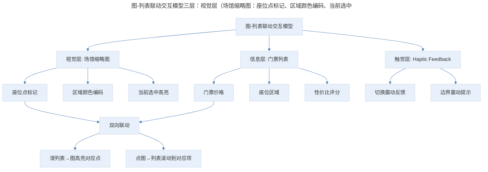
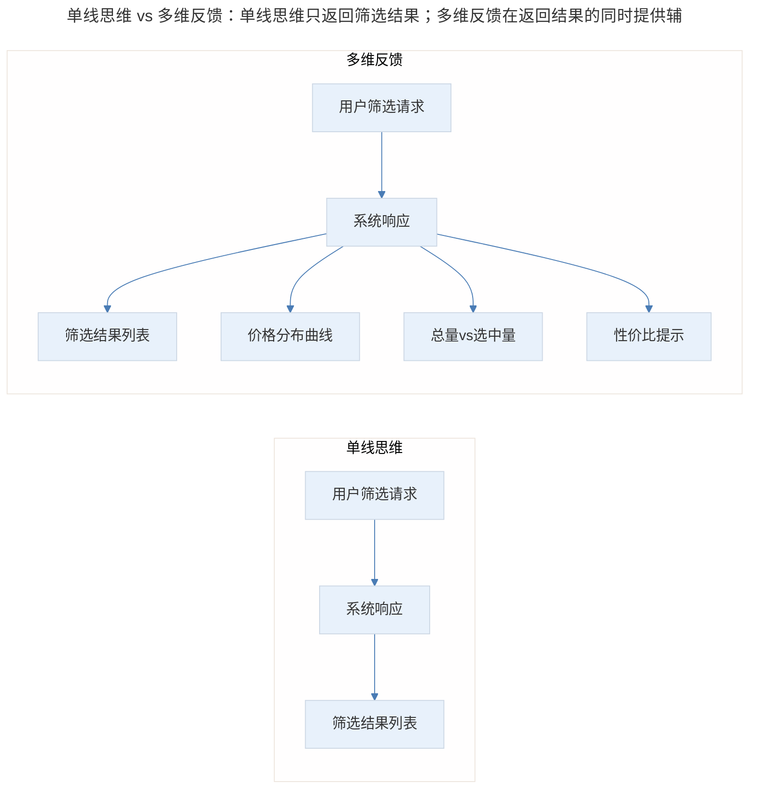
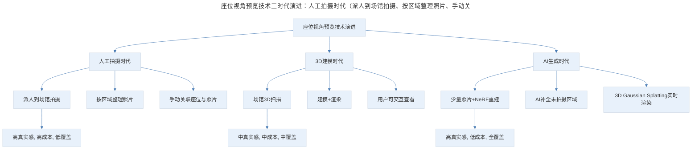
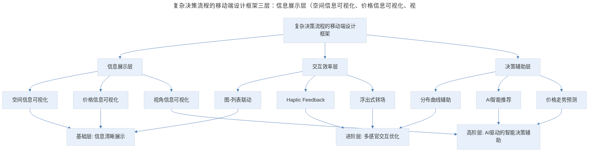

# 产品案例分析：SeatGeek 的订票设计

## 1. 导言

SeatGeek 是一款订票类 App，其核心设计亮点包括：图与列表的联动浏览、价格筛选分布曲线、真实视角座位预览、卡片浮出式转场。这些设计共同解决了一个核心问题——如何让用户在有限的移动端屏幕上，高效地完成"选座-比价-下单"的复杂决策流程。在 AI 和 3D 建模技术成熟的今天，SeatGeek 的设计理念——"让用户看到真实"——仍然是订票类产品的设计标杆，而新技术为"真实视角预览"等痛点提供了更优的解决方案。

> **更新说明**：本文档于 2026-06 更新，主要更新点：补充 SeatGeek 2018-2026 年功能演进；更新 Android 端 Haptic Feedback 发展；增加 AI/3D 建模在座位视角预览中的新方案；增加 Mermaid 流程图与专业深度分层；补充 AI 时代订票产品的新趋势。

## 2. 核心概念：产品定位与演进

SeatGeek 是一个订票类的 App，我们买过电影票，可能也买过一些话剧或者体育比赛的票，所以应该都用过类似的应用。SeatGeek 中有一些挺好玩的交互细节，希望可以给你带来启发。

SeatGeek 的整体结构比较简单，可以根据不同维度去浏览活动和节目，也可以搜索，还可以订阅追踪。

**2018-2026 年功能演进**：

| 功能 | 上线时间 | 说明 |
|------|----------|------|
| Deal Score | 2013 | AI 评估票价性价比 |
| 3D 视角预览 | 2016 | 真实座位视角图片 |
| Haptic Feedback | 2017 | 滑动切换座位时的触觉反馈 |
| 动态定价 | 2019 | 基于供需的实时价格调整 |
| SeatGeek Marketplace | 2020 | 开放第三方票务市场 |
| AR 场馆导航 | 2022 | AR 引导用户找到座位 |
| AI 推荐座位 | 2024 | 基于用户偏好的智能座位推荐 |
| 3D 场馆模型 | 2025 | AI 生成的 3D 场馆全景模型 |

## 3. 关键方法：门票的快速浏览——图与列表的联动

### 3.1 设计还原

我们重点看一下订票的交互流程。我们可以看到页面上方是一个场馆的缩略图，不同区域的座位用不同的颜色标识，不像我们平时买电影票或者一些演出的票那样，所有的座位都平铺开展示，这里只是有限的一些小点。

这里还有一个很有意思的交互，缩略图上的每一个点代表门票，每个门票蕴含的信息量比较大，那么如何快速地浏览所有的门票呢？

传统的思维可能是点击某个点的时候，浮层展示一下门票详情，这样做效率非常低，要不断地点；而 SeatGeek 采用的方式则是滑动下面的列表。

在滑动的过程中，利用图和列表的联动把门票的信息交代清楚，可以快速地浏览门票信息。滑动中还利用了 iPhone 的震动，每个切换会有一个微小的震动，这是一个新颖的设计。

### 3.2 图-列表联动的交互模型

> 图-列表联动交互模型三层：视觉层（场馆缩略图：座位点标记、区域颜色编码、当前选中高亮）、信息层（门票列表：门票价格、座位区域、性价比评分）、触觉层（Haptic Feedback：切换震动反馈、边界震动提示）。核心是"双向联动"——滑列表时图高亮对应点，点图时列表滚动到对应项。

**图表解读**：图-列表联动交互模型包含三个层面——视觉层（场馆缩略图）、信息层（门票列表）、触觉层（Haptic Feedback）。核心是"双向联动"：滑列表时图高亮对应点，点图时列表滚动到对应项。这种设计让用户可以在"空间位置"和"价格信息"之间快速切换，大幅提升浏览效率。

### 3.3 Haptic Feedback 的发展

**2018-2026 年 Haptic Feedback 进展**：

| 平台 | 2018 年 | 2026 年 |
|------|--------|--------|
| iOS | Taptic Engine，3 种预设反馈 | Core Haptics API，自定义波形 |
| Android | 少数旗舰机支持 | 旗舰机标配，Vibrator API 成熟 |
| 跨平台 | 无统一标准 | React Native/Flutter 插件支持 |

2026 年，Haptic Feedback 已成为移动端交互设计的标准工具。Apple 的 Core Haptics API 允许开发者自定义震动波形、强度和持续时间，Android 端也通过 Vibrator API 提供了类似能力。SeatGeek 在 2017 年使用 Haptic Feedback 时还是创新设计，到 2026 年已成为行业标配。

## 4. 实践落地：票价的直观筛选——分布曲线的价值

### 4.1 设计还原

还有这里的 Filter，有一个细节，虽然很常见，但还是分享一下，就是当筛选价格的时候，它有一条曲线展示每个价格区间的门票量，随着你修改上下限，能够非常直观地看到总量和你选中的价格区间的门票量。

过去我们在做筛选或交互步骤的时候，思考逻辑是单线的，比如用户向系统发出请求，要求筛选某一个价格区间内的门票，系统响应请求，展示这个价格区间的门票列表。

如果我们跳出这个单线思维，去考虑在用户提出筛选请求时，还有没有其他对用户有价值的信息可以一起反馈。比如说，反馈的信息可以加入整体的票量以及价格区间的分布。

### 4.2 从单线思维到多维反馈

> 单线思维 vs 多维反馈：单线思维只返回筛选结果；多维反馈在返回结果的同时提供辅助决策信息——价格分布曲线帮助用户理解市场，总量 vs 选中量帮助用户评估稀缺性，性价比提示帮助用户做出最优选择。

**图表解读**：单线思维只返回筛选结果，多维反馈则在返回结果的同时提供辅助决策信息——价格分布曲线帮助用户理解市场，总量 vs 选中量帮助用户评估稀缺性，性价比提示帮助用户做出最优选择。

**设计原则**：在用户提出筛选请求时，思考"还有哪些信息可以帮助用户做出更好的决策"，而不仅仅是"用户要什么给什么"。

### 4.3 AI 时代的智能筛选

2024-2026 年，AI 为筛选体验带来了新的可能性：

- **智能推荐筛选范围**：基于用户历史行为和当前市场情况，推荐最优价格区间
- **预测价格走势**：AI 分析历史数据，预测未来价格变化趋势
- **个性化排序**：根据用户偏好（价格优先/位置优先/性价比优先）动态调整排序

### 4.4 位置的真实视角：从照片到 3D 建模

再看一个有意思的细节，当我们买门票选位置的时候，有一个痛点，就是如果我们不了解场馆，很难判断不同位置的视线怎样。我们来看这个 App 怎么解决这个问题。

打开个体育比赛，我们点击一个位置点，你可以注意看，上面的缩略图变成了这个位置的真实视线情况，我没有去研究这个图是怎么收集的，但可以想象这会是一个苦活儿，能做到这样很让人感慨，我觉得我自己有时候挺缺乏这种踏踏实实下笨功夫解决问题的劲头。

**从"苦活儿"到 AI 自动化**：

| 方案 | 时代 | 优势 | 劣势 |
|------|------|------|------|
| 人工拍摄 | 2016-2020 | 真实感强 | 成本高、覆盖慢 |
| 3D 建模+渲染 | 2020-2023 | 覆盖快、可交互 | 真实感稍弱 |
| AI 生成视角 | 2024-2026 | 极低成本、全覆盖 | 可能有微小偏差 |
| NeRF/3D Gaussian | 2025-2026 | 真实感+可交互 | 计算资源需求高 |

**2026 年最佳方案**：NeRF（Neural Radiance Fields）和 3D Gaussian Splatting 技术可以在少量照片的基础上重建高真实感的 3D 场景，用户可以自由旋转、缩放查看任意角度的视角。SeatGeek 在 2025 年已开始采用这种技术，大幅降低了数据采集成本，同时提升了用户体验。

> 座位视角预览技术三时代演进：人工拍摄时代（派人到场馆拍摄、按区域整理照片、手动关联，高真实感高成本低覆盖）→ 3D 建模时代（场馆 3D 扫描、建模+渲染、用户可交互查看，中真实感中成本中覆盖）→ AI 生成时代（少量照片+NeRF 重建、AI 补全、3D Gaussian Splatting 实时渲染，高真实感低成本全覆盖）。

**图表解读**：座位视角预览技术经历了三个时代——人工拍摄（高真实感但高成本）、3D 建模（可交互但真实感稍弱）、AI 生成（低成本高真实感全覆盖）。2026 年的 NeRF/3D Gaussian 技术实现了"鱼与熊掌兼得"。

### 4.5 卡片的流畅转场

最后一个很小的细节，就是当我们点击 Checkout 的时候，不是替换页面，而是直接在当前页面浮出卡片，我们之前也讲过类似的细节，比如 Fabulous 里面，这么做不加入转场，交互体验衔接很流畅。这是移动端设计中，保证用户体验顺滑很重要的一点。

**设计原则**：在关键操作节点（如结算、确认），使用浮出卡片而非页面跳转，保持上下文可见，减少用户的认知负担。

**2026 年更新**：这种"浮出卡片"的转场模式在 2026 年已成为移动端设计的标准模式。Apple 的 HIG（Human Interface Guidelines）和 Google 的 Material Design 3 都推荐在模态操作中使用底部浮出卡片（Bottom Sheet），而非全屏页面跳转。

## 5. 实践指南：方法论框架与实战要点

### 5.1 方法论框架

> 复杂决策流程的移动端设计框架三层：信息展示层（空间信息可视化、价格信息可视化、视角信息可视化，基础层信息清晰展示）、交互效率层（图-列表联动、Haptic Feedback、浮出式转场，进阶层多感官交互优化）、决策辅助层（分布曲线辅助、AI 智能推荐、价格走势预测，高阶层 AI 驱动的智能决策辅助）。

**图表解读**：复杂决策流程的移动端设计框架从三个层面展开——信息展示层（空间、价格、视角的可视化）、交互效率层（联动、触觉、转场）、决策辅助层（分布曲线、AI 推荐、价格预测）。每个层面对应不同的专业深度层级。

### 5.2 实战要点

| 要点 | 说明 | 适用场景 |
|------|------|----------|
| 图-列表双向联动 | 空间位置与信息列表双向联动，提升浏览效率 | 所有涉及空间选择的产品 |
| 多维反馈优于单线响应 | 筛选时不仅返回结果，还提供辅助决策信息 | 所有筛选/搜索场景 |
| Haptic Feedback 增强感知 | 在关键交互节点使用触觉反馈增强操作确认感 | 列表切换、边界到达、操作确认 |
| 浮出卡片优于页面跳转 | 关键操作使用浮出卡片保持上下文可见 | 结算、确认、详情查看 |
| 真实视角解决信息不对称 | 让用户看到真实场景，消除决策中的不确定性 | 所有涉及空间位置选择的产品 |
| AI 降低数据采集成本 | 用 NeRF/3D Gaussian 等技术替代人工拍摄 | 需要大量实景数据的产品 |

## 6. 进阶延展：专业深度分层与核心要点回顾

### 6.1 专业深度分层

**基础层**：

- 设计图-列表联动的交互模式
- 在筛选中提供多维反馈信息
- 使用浮出卡片替代页面跳转

**进阶层**：

- 利用 Haptic Feedback 增强交互感知
- 设计价格分布曲线等辅助决策组件
- 平衡信息密度与浏览效率

**高阶层**：

- 利用 NeRF/3D Gaussian 等技术实现低成本高真实感视角预览
- 设计 AI 驱动的智能推荐与价格预测
- 在复杂决策流程中实现多感官协同交互

### 6.2 核心要点回顾

SeatGeek 的设计理念——"让用户看到真实"——是订票类产品的设计标杆，其核心设计亮点共同解决"选座-比价-下单"的复杂决策流程。图与列表的联动浏览（视觉层+信息层+触觉层，双向联动提升浏览效率）、价格筛选分布曲线（从单线思维到多维反馈，提供辅助决策信息）、真实视角座位预览（从人工拍摄到 AI 生成的 NeRF/3D Gaussian 技术，实现低成本高真实感全覆盖）、卡片浮出式转场（保持上下文可见，减少认知负担）。复杂决策流程的移动端设计框架从信息展示层、交互效率层、决策辅助层三个层面展开，并在 2026 年以 Haptic Feedback 标配、Bottom Sheet 标准模式与 AI 智能决策辅助为当代演进方向。

### 6.3 延伸阅读

- Apple Human Interface Guidelines: Haptics
- Material Design 3: Bottom Sheets
- "NeRF: Neural Radiance Fields for View Synthesis"（Mildenhall et al., 2020）
- "3D Gaussian Splatting for Real-Time Radiance Field Rendering"（Kerbl et al., 2023）
- 《移动端交互设计模式》——复杂决策流程优化

## 更新日志

| 版本 | 日期 | 更新内容 |
|------|------|----------|
| v1.0 | 2018-04 | 初始版本 |
| v2.0 | 2026-06 | 补充 SeatGeek 2018-2026 年功能演进；更新 Haptic Feedback 发展；增加 AI/3D 建模在视角预览中的新方案；增加 Mermaid 流程图与专业深度分层 |