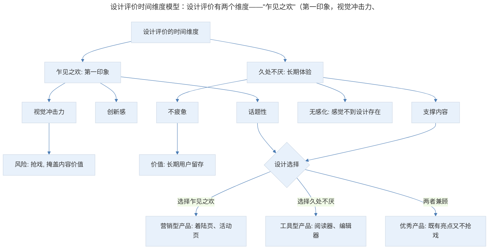
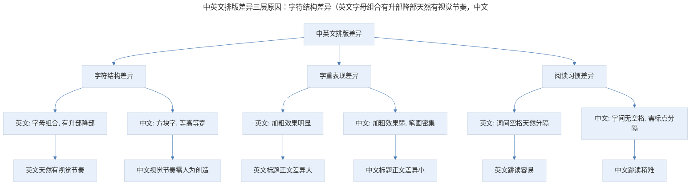
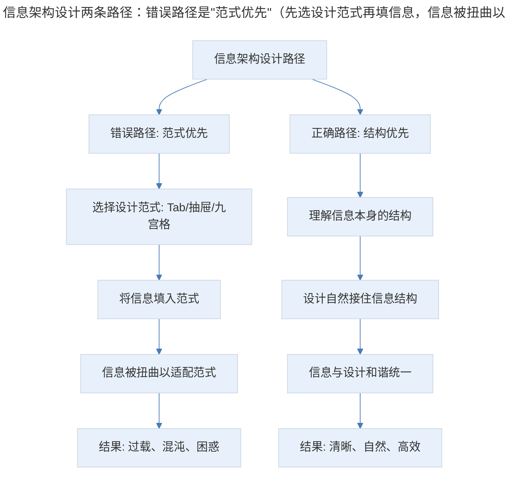
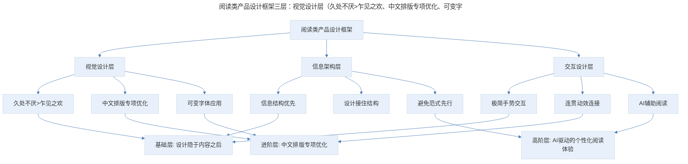

# 产品案例分析：Unread 的阅读体验

## 1. 导言

Unread 是一款以极简设计著称的 RSS 阅读器，其设计哲学——"乍见之欢不如久处不厌"——揭示了产品设计的深层价值：好的设计应长时间使用而不让用户感到疲惫，低调地藏到内容后面去支撑架构和逻辑。Unread 还直观展示了中英文排版差异对阅读体验的影响，以及"信息架构应服务于信息本身结构"的设计原则。在 RSS 阅读器市场萎缩、AI 摘要改变阅读方式的今天，Unread 的设计理念——让设计隐于内容之后——对阅读类产品仍有深刻的指导意义。

> **更新说明**：本文档于 2026-06 更新，主要更新点：补充 RSS 阅读器市场现状与萎缩原因；更新中文字体移动端渲染改善（苹方/思源黑体）；增加手势交互规范的演进；补充 AI 时代阅读体验的新趋势（AI 摘要、个性化排版）；增加 Mermaid 流程图与专业深度分层。

## 2. 核心概念：产品定位与市场现状

Unread 是一个非常著名的 RSS 阅读器，如果你是 RSS 爱好者的话，肯定听说过这个应用。它的设计非常漂亮，简洁精确，阅读体验很好。

Unread 的设计，从首页到列表页一以贯之。页面的版式设计也非常统一，元素很少，颜色也很少，只有黑灰红三个颜色，却很精致，有设计感。

**RSS 阅读器市场现状（2026 年）**：

| 产品 | 状态 | 说明 |
|------|------|------|
| Google Reader | 2013 年关闭 | RSS 阅读器的标志性产品 |
| Unread | 仍在维护 | iOS 端极简 RSS 阅读器 |
| Reeder | 仍在维护 | iOS/macOS 端主流 RSS 阅读器 |
| Feedly | 仍在维护 | Web+移动端，AI 集成 |
| Inoreader | 仍在维护 | 高级过滤与规则功能 |
| NetNewsWire | 开源维护 | macOS/iOS 免费开源阅读器 |

**RSS 阅读器市场萎缩的原因**：

1. **社交媒体取代**：Twitter/X、微博、微信公众号成为主要信息源
2. **算法推荐取代**：用户更习惯被动接收推荐内容，而非主动订阅
3. **RSS 源减少**：许多网站不再提供 RSS 输出
4. **信息过载**：订阅源过多导致 RSS 阅读器本身成为负担

**2024-2026 年 RSS 的"小复兴"**：随着 AI 内容泛滥和算法推荐的信息茧房问题日益严重，部分用户开始回归 RSS——主动选择信息源、避免算法操纵。Feedly 等阅读器也集成了 AI 摘要功能，让 RSS 阅读器在 AI 时代找到了新的价值定位。

## 3. 关键方法：设计的美学——乍见之欢 vs 久处不厌

### 3.1 设计评价的时间维度

关于设计我想多说一句，有一个我特别喜欢的设计师，之前跟我合作去做一些 Web 页的设计，她曾经跟我说，设计应该放到更长的视角中去评价，很多第一眼看上去很惊艳的设计并不一定是好的设计，它有可能会过于抢戏，而把真正的价值掩盖掉。

好的设计应该是长时间使用，但让用户感到不疲惫，甚至用户都没有意识到设计的存在，它会低调地藏到内容后面，去支撑架构和逻辑。

这一席话对我影响还是挺大的，我们评价设计的时候通常都是会从看到它的那个片段出发，觉得惊艳或者赞叹，或者平淡无奇，但其实如果我们可以从更长的时间段出发去评价的话，很多乍一看平淡无奇的设计，可能是非常好的设计。

### 3.2 设计评价的时间维度模型

> 设计评价时间维度模型：设计评价有两个维度——"乍见之欢"（第一印象，视觉冲击力、创新感、话题性，风险是抢戏掩盖内容价值）和"久处不厌"（长期体验，不疲惫、无感化、支撑内容，价值是长期用户留存）。不同类型产品应侧重不同维度：营销型侧重乍见之欢，工具型侧重久处不厌，优秀产品两者兼顾。

**图表解读**：设计评价有两个维度——"乍见之欢"（第一印象）和"久处不厌"（长期体验）。不同类型的产品应侧重不同维度：营销型产品侧重乍见之欢，工具型产品侧重久处不厌，优秀产品则两者兼顾。

继续回来看 Unread，我们来看列表页，这个列表页没有去取 RSS 源的图，没有图可能会让页面看起来没那么活泼，但是也会更简洁直观地展示信息。

## 4. 实践落地：字体的差异——英文 vs 中文

### 4.1 排版差异的直观感受

这里有个细节，对比看中文和英文的文章，会感觉英文表现比中文好很多，英文标题有明显的加粗，跟摘要有很明显的样式差异；但中文的差异就小很多。当然 Unread 应该是主要针对英文做的设计，中文表现稍微差一点很正常。

但我们在同一个列表对比两种设计，会比较直观地感受到差别，当主题和正文的差异足够明显的时候，我们随着往下拉列表，视觉是很容易跳读的，视线可以快速地定位到每一条的标题上；如果差异不大，像中文这样，当然也可以跳读，但好像就会稍微累一点。这个道理没什么高深的，可是在这里对比还是挺直观的。

还有一个是关于这种差异来源的，就是我们看到很多国外很漂亮的版式设计，用到中文的时候就会差一截，长度、字体和字型都不一样；所以当我们想要去借鉴的时候，一定要意识到这个差异，不要一股脑搬过来，可能会不伦不类。

对于版式设计，其实可以多借鉴日文的东西，因为日语里面有很多汉字，不太会有字型差异带来的设计效果差异。

### 4.2 中文字体移动端渲染的改善（2018-2026）

| 维度 | 2018 年 | 2026 年 |
|------|--------|--------|
| 系统中文字体 | 苹方（iOS）/ 思源黑体（Android） | 苹方-简/繁优化版 / HarmonyOS Sans |
| 字重支持 | 2-3 种字重 | 6-9 种字重（可变字体） |
| 标题与正文差异 | 加粗效果不明显 | 可变字体实现明显字重差异 |
| 排版引擎 | 基础排版 | 高级排版（字距、行距微调） |
| AI 辅助排版 | 无 | AI 自动调整排版参数 |

**关键进展**：可变字体（Variable Fonts）技术的成熟是中文字体排版的重大突破。2018 年，中文字体在移动端只有 2-3 种字重，标题与正文的视觉差异很小。到 2026 年，苹方和思源黑体都支持了可变字体，可以在 6-9 种字重之间平滑过渡，标题与正文的视觉差异大幅提升。

此外，HarmonyOS Sans 作为华为推出的开源中文字体，在多字重、多语言支持方面表现优秀，已成为 Android 端中文字体的新选择。

### 4.3 中英文排版差异的深层原因

> 中英文排版差异三层原因：字符结构差异（英文字母组合有升部降部天然有视觉节奏，中文方块字等高等宽视觉节奏需人为创造）、字重表现差异（英文加粗效果明显标题正文差异大，中文加粗效果弱标题正文差异小）、阅读习惯差异（英文词间空格天然分隔跳读容易，中文字间无空格跳读稍难）。中文排版需要更多"人为创造视觉节奏"的设计手段。

**图表解读**：中英文排版差异源于三个层面——字符结构（方块字 vs 字母组合）、字重表现（加粗效果弱 vs 强）、阅读习惯（无空格 vs 有空格）。这些差异意味着中文排版需要更多"人为创造视觉节奏"的设计手段。

### 4.4 信息架构的逻辑：解决问题 vs 制造问题

我们再看整个架构，会看到统一入口或者某个源的入口，然后进来就是列表，点击就是详情，非常自然。当然，因为 RSS 本来的逻辑结构就简单，不需要什么特别的设计。

但是，从文字内容的设计出发，更容易去理解一个事情，就是设计与信息本身的关系，我之前看过一本书叫《无界面交互》，里面有一句话我特别喜欢，说过载、混沌和困惑并不是信息的特质，而是设计的失败。

其实信息本身就有其逻辑和结构，而不是说因为有了信息架构设计，才被分门别类地安放在不同的槽里面，很多时候我们会陷入到一些经典的范式中，比如抽屉，比如 Tab，比如九宫格。

好像是先有了架构，再往里填充信息，这个逻辑其实是不对的，应该是先理解信息本身的结构，再考虑用什么样的设计去自然地接住它。要让设计去解决问题，而不是制造问题。

### 4.5 信息结构优先于设计范式

> 信息架构设计两条路径：错误路径是"范式优先"（先选设计范式再填信息，信息被扭曲以适配范式，导致过载混沌困惑）；正确路径是"结构优先"（先理解信息结构再设计，信息与设计和谐统一，清晰自然高效）。Unread 的架构之所以自然，正是因为 RSS 信息本身结构简单（源→列表→详情），设计自然地接住了这个结构。

**图表解读**：信息架构设计有两条路径——错误路径是"范式优先"（先选设计范式再填信息），正确路径是"结构优先"（先理解信息结构再设计）。Unread 的架构之所以自然，正是因为 RSS 信息本身结构简单（源→列表→详情），设计自然地接住了这个结构。

### 4.6 AI 时代的阅读体验新趋势

2024-2026 年，AI 为阅读体验带来了新的可能性：

- **AI 摘要**：自动生成长文摘要，帮助用户快速判断是否值得阅读
- **AI 翻译**：实时翻译外文内容，消除语言障碍
- **个性化排版**：根据用户阅读习惯自动调整字号、行距、配色
- **AI 问答**：基于文章内容回答用户问题，无需通读全文
- **智能稍后阅读**：AI 根据用户兴趣优先级自动排序待读列表

**对"久处不厌"设计哲学的影响**：AI 辅助功能应遵循"隐于内容之后"的原则——AI 摘要不应替代阅读，而应帮助用户更高效地筛选内容；AI 排版不应改变内容呈现，而应优化阅读舒适度。

## 5. 实践指南：手势交互的极简设计与方法论框架

### 5.1 手势交互的极简设计

另外说一下这个极简设计是如何做交互的，除了在架构里点来点去，按图索骥之外，还利用了长按和上下左右滑，在几乎所有的界面上都响应这几个交互手势，而且有一个很精致地动效连接，非常连贯。

**2018-2026 年手势交互规范演进**：

| 手势 | 2018 年 | 2026 年 |
|------|--------|--------|
| 左右滑动 | 返回/切换 | 返回/切换/删除/归档 |
| 长按 | 上下文菜单 | 上下文菜单+快捷操作 |
| 下拉 | 刷新 | 刷新+展开搜索 |
| 边缘滑动 | iOS 返回 | iOS 返回+多任务 |
| 捏合缩放 | 图片缩放 | 全局缩放（列表↔详情） |

2026 年，手势交互已更加丰富和标准化。Apple 的 HIG 和 Google 的 Material Design 3 都定义了更完善的手势交互规范，用户对手势的接受度和熟练度也大幅提升。Unread 式的"极简手势交互"在今天已成为阅读类产品的标准设计模式。

### 5.2 方法论框架

> 阅读类产品设计框架三层：视觉设计层（久处不厌>乍见之欢、中文排版专项优化、可变字体应用）、信息架构层（信息结构优先、设计接住结构、避免范式先行）、交互设计层（极简手势交互、连贯动效连接、AI 辅助阅读）。每个层面对应不同的专业深度层级。

**图表解读**：阅读类产品设计框架从三个层面展开——视觉设计层（久处不厌、中文排版、可变字体）、信息架构层（结构优先、避免范式先行）、交互设计层（极简手势、连贯动效、AI 辅助）。每个层面对应不同的专业深度层级。

## 6. 进阶延展：实战要点与核心要点回顾

### 6.1 实战要点

| 要点 | 说明 | 适用场景 |
|------|------|----------|
| 久处不厌优于乍见之欢 | 工具型产品应追求长期使用不疲惫，而非第一眼惊艳 | 阅读器、编辑器、效率工具 |
| 中文排版需专项优化 | 不可直接套用英文排版设计，需考虑字重、字距、行距差异 | 所有中文内容产品 |
| 信息结构优先于设计范式 | 先理解信息本身的结构，再选择设计方式 | 所有信息架构设计 |
| 极简手势交互 | 用少量手势覆盖大量操作，保持连贯动效 | 阅读类、浏览类产品 |
| 可变字体提升排版质量 | 利用可变字体技术实现标题与正文的明显视觉差异 | 所有移动端内容产品 |
| AI 辅助隐于内容之后 | AI 摘要、AI 排版等功能应辅助而非替代阅读 | 所有阅读类产品 |

### 6.2 专业深度分层

**基础层**：

- 理解"久处不厌"的设计哲学
- 确保信息架构服务于信息本身的结构
- 设计基本的极简手势交互

**进阶层**：

- 针对中文排版做专项优化（可变字体、字距行距微调）
- 设计连贯的动效连接
- 平衡信息密度与阅读舒适度

**高阶层**：

- 利用 AI 实现个性化阅读体验（AI 摘要、智能排序、个性化排版）
- 在 AI 辅助与自主阅读之间找到平衡
- 设计跨平台一致的阅读体验

### 6.3 核心要点回顾

Unread 的设计哲学"乍见之欢不如久处不厌"揭示了产品设计的深层价值——好的设计应长时间使用而不让用户疲惫，低调地藏到内容后面支撑架构和逻辑。设计评价的时间维度模型（乍见之欢 vs 久处不厌）指导不同类型的产品侧重不同维度。Unread 直观展示了中英文排版差异（字符结构、字重表现、阅读习惯三个层面）对阅读体验的影响，以及"信息架构应服务于信息本身结构"（结构优先于范式）的设计原则。极简手势交互与连贯动效连接是阅读类产品的标准设计模式。在 RSS 阅读器市场萎缩的背景下，AI 时代的"小复兴"与 AI 摘要、个性化排版等新趋势为阅读类产品带来新价值，但"让设计隐于内容之后"的原则始终不变。

### 6.4 延伸阅读

- 《无界面交互》（Golden Krishna）——让设计隐于内容之后
- 《中文排版需求》（W3C Working Draft）——中文排版规范
- "Variable Fonts for CJK Scripts"（2024）——可变字体在中文中的应用
- Apple Human Interface Guidelines: Typography
- 《阅读的未来》——AI 时代阅读体验的变革

## 更新日志

| 版本 | 日期 | 更新内容 |
|------|------|----------|
| v1.0 | 2018-05 | 初始版本 |
| v2.0 | 2026-06 | 补充 RSS 阅读器市场现状；更新中文字体移动端渲染改善；增加手势交互规范演进；补充 AI 时代阅读体验新趋势；增加 Mermaid 流程图与专业深度分层 |