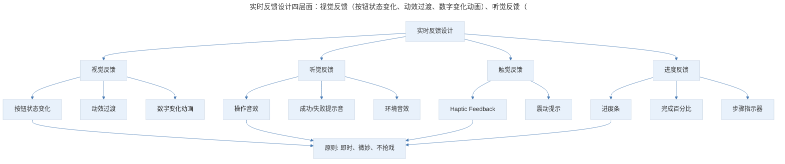
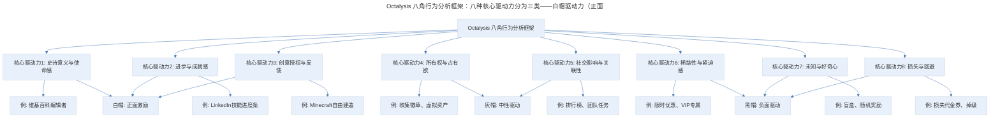
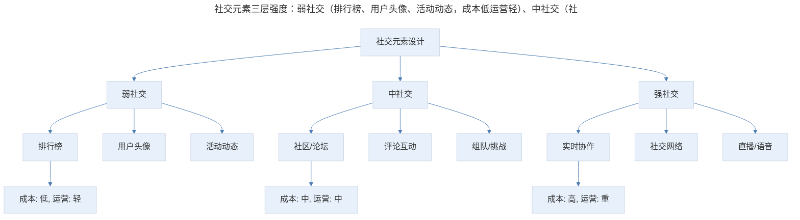
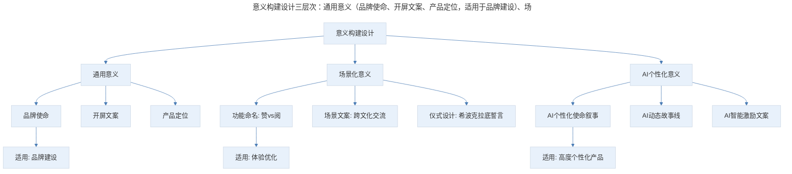
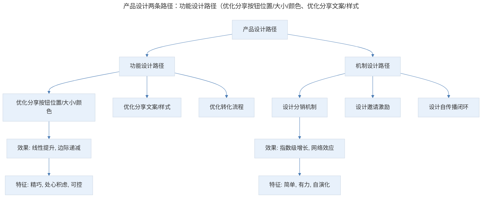
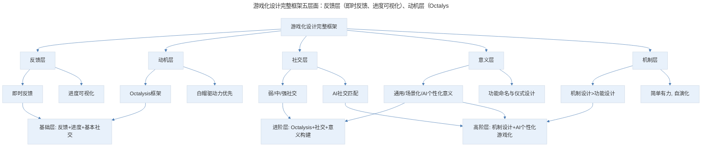

# "玩"的力量：从游戏设计中学习产品设计

## 1. 导言

游戏设计蕴含着让用户"自愿投入"的深层智慧——持续实时的反馈激活低级神经反应，对人性的洞察打开行为的开关。这两种设计手段同样适用于产品设计：实时反馈让用户感受到互动与奖励，人性洞察让产品具有不可抗拒的吸引力。在 AI 时代，Octalysis 八角行为分析框架为游戏化设计提供了系统化的分析工具，而 AI 驱动的个性化游戏化则让"因人而异"的激励成为可能。但游戏化设计也面临伦理边界——激励与操纵之间只有一线之隔。

游戏设计的后两种手段——与社群建立联系和构建意义——揭示了更深层的用户动机：人是社会动物，渴望与社会建立联系；每个人都渴望成为超越个体的伟大事业的一部分。在产品设计中，社交元素让产品有人情味，意义构建让用户找到使命感。而 Jonathan Blow 关于"机制设计优于功能设计"的观点，更是产品设计的核心智慧——精巧的功能性设计远不如关键性的机制设计来得重要、有效。

> **更新说明**：本文档于 2026-06 更新，主要更新点：增加 Octalysis 八角行为分析框架；补充 AI 驱动的个性化游戏化设计；更新游戏化设计实践案例；增加 Mermaid 流程图与专业深度分层；补充游戏化设计的伦理边界。

## 2. 核心概念：为什么游戏让人着迷

**"玩游戏，就是自愿尝试克服种种不必要的障碍。" —— 伯纳德·苏茨（Bernard Suits）**

你有没有考虑过一个问题：从某种意义上来说，打游戏和做工作的性质是类似的。它们都需要在一定的规则框架内，克服困难，完成目标。

不同的是，打游戏是我们"自找的"，没有什么强制要求，我们却主动花费精力和金钱投入其中，乐此不疲；而工作为我们提供了收入来源和社会地位，我们却经常心猿意马，叫苦不迭。

如果抛开外在的表现形式，只从编程的角度去思考游戏的实现，我们会发现让玩家魂牵梦萦的背后，只是内存中变量的数值或显存里不同的色块。

那么，究竟是什么让游戏充满了不可抗拒的魅力，让人们自愿投入其中，难以自拔呢？我们设计的产品有没有可能像游戏一样，也具有这样的魔力，让用户持续投入其中呢？

我并不是一个资深的游戏玩家，所以便带着这样的疑问，读了几本跟游戏设计相关的书，也尝试玩儿了一些流行的商业游戏和独立游戏，接下来两次的分享中，我就来谈一谈自己对游戏的一些思考和理解，希望能给你带来启发。

## 3. 关键方法：游戏设计手段 1 与手段 2

### 3.1 手段一：持续实时的反馈

实时的反馈是游戏中最常见的设计手段。不论是吃掉砖块里长出来的蘑菇，还是命中远方山坡上举着平底锅的敌人，游戏一定会立即通过声音或影像给予玩家以反馈，它既是互动，也是奖励。

这种奖励会在神不知鬼不觉中激活我们的低级神经反应，达到一种生理上的过瘾；然而，当我们全身心沉浸在游戏情节中时，或许并没有注意到，自己已经被这些感官反馈激发了。这也是游戏设计的精妙之处，就像是用一只你没有注意到的、看不见的手拉住你一样。

我们可以通过一些方式去理解这些反馈带来的引力，前些日子微信发布了跳一跳小游戏，一夜之间周围很多人玩儿。我也试了试，发现总是得不到高分。

后来我有个分数很高的同事跟我说有个窍门，就是："玩儿的时候把声音打开"。于是我打开声音试了试，发现在有声音的情况下，不但自己的表现更好，而且觉得这个游戏似乎"更好玩了"。

**产品设计中的实时反馈**：类似的道理，在产品的交互设计中也一样。比如我们在做按钮设计时，都会做一个点击状态的样式，当点击或触摸到按钮的时候，背景颜色反显一下或者阴影变化一下，这样让用户在点击时有一个直观的反馈。

我们之前在分享 Mimo 的时候提到过它的实时反馈，就是当用户完成一道题目的时候，除了声音和视觉效果的反馈之外，还会立刻对题目的正误做出解析。我之前也做过一个答题类的 App，当时设计了一个效果是：用户每完成一道题目会有一个动效，屏幕上淡淡地闪现一个"+1"的字样，然后立刻看到"已答题数"的增加。还有我们在分享 Trigraphy 时提到过的进度条，也是一种实时反馈。

**实时反馈的设计原则**：类似的技巧很容易应用到产品设计中，但要注意过犹不及，不要给反馈效果加太多戏，不要让用户感到突兀和莫名其妙。前段时间玩儿一个游戏，开始玩儿的时候，每做一步操作就出现很震撼的效果，还会有大字和感叹号，表扬我说："你太棒了！"让我很不舒服，这就是一种负反馈。

> 实时反馈设计四层面：视觉反馈（按钮状态变化、动效过渡、数字变化动画）、听觉反馈（操作音效、成功/失败提示音、环境音效）、触觉反馈（Haptic Feedback、震动提示）、进度反馈（进度条、完成百分比、步骤指示器）。核心原则是"即时、微妙、不抢戏"。

**图表解读**：实时反馈设计包含四个层面——视觉、听觉、触觉、进度。核心原则是"即时、微妙、不抢戏"——反馈必须即时，但不应过于夸张以至于分散注意力。

**延迟享受的启示**：除了这些交互细节的设计之外，实时反馈能给我们的另一个启发是关于生活的。当我们从电子产品中越来越容易获得实时反馈时，我们的大脑会逐渐适应并迷上这种感觉。这样一来，我们很容易对那些奖励周期比较长的事情产生厌倦。在生活和工作中，许多了不得的成就都来自于没有显著反馈情况下的坚持，比如锻炼身体、学外语或积累产品设计经验等等。我们应当具备延迟享受（Delayed Gratification）的耐力，才能够收获更多成绩。

### 3.2 手段二：人性的开关

我们骨子里或多或少都有惰性、恐惧和贪念等等特质。当设计命中这些特质时，我们就很容易受到牵制或影响。

关于这一点的争议很多，因为人性就像是藏在我们体内的开关，可以伸一只手进去打开或关闭它们——不论这只手善良与否。很多人质疑这样的设计手段是一种操纵，而有的人认为这是游戏工业的规则，没必要大惊小怪。

暂时放下道德争议，这些设计至少都伴随着深刻的人性洞察。比如游戏设计会利用我们与生俱来的囤积欲，为了收集不同颜色的勋章或钻石，我们可以忍受大量机械和无意义的重复。再比如，游戏利用我们对损失的厌恶，当我们获得某种道具之后，就会愿意付出大量的精力和代价避免它被别人夺走，这在心理学上也被称作禀赋效应；还有几乎所有的游戏都在利用人们对未知的好奇心。还有游戏之所以持续吸引玩家上瘾的秘诀——成就感与自豪。

**Octalysis 八角行为分析框架**（2026 年更新）：Yu-kai Chou 提出的 Octalysis 八角行为分析框架，为游戏化设计提供了系统化的分析工具。该框架识别了驱动人类行为的八种核心动机：

> Octalysis 八角行为分析框架：八种核心驱动力分为三类——白帽驱动力（正面激励：使命感、成就感、创意）、灰帽驱动力（中性：所有权、社交）、黑帽驱动力（负面驱动：稀缺、未知、损失）。好的游戏化设计应以白帽驱动力为主，适度使用灰帽，谨慎使用黑帽。

**图表解读**：Octalysis 框架将八种核心驱动力分为三类——白帽驱动力（正面激励：使命感、成就感、创意）、灰帽驱动力（中性：所有权、社交）、黑帽驱动力（负面驱动：稀缺、未知、损失）。好的游戏化设计应以白帽驱动力为主，适度使用灰帽，谨慎使用黑帽。

**产品设计中的人性利用**：毫无疑问，同样的手段当然可以被用在产品设计之中。比如最常见的用户等级体系，以及各种成就勋章和排行榜，早已经成为拥有用户体系的产品粘住用户的基础手段。还有各种收集勋章，点亮道具的营销活动，虽然好像没什么品味，但确实非常有效。

还有刚才提到的禀赋效应，指的是当个人一旦拥有某项物品，那么他对该物品价值的评价会比未拥有之前大大增加。我们熟知的各类代金券赠送都是在利用人们的这种心理，送用户 30 块钱代金券，让他买 80 块钱的东西，远比向他推销 50 块钱的东西来得容易。如果这 30 块钱的代金券还能"师出有名"，比如分享给朋友才能得到或者老用户才能得到，那就更容易勾住用户。

## 4. 实践落地：游戏设计手段 3 与手段 4

### 4.1 手段三：与社群建立联系

人是社会动物，我们都渴望与社会建立联系，游戏中会有大量人与人之间的纽带设计，吸引玩家持续投入其中。

比如我前一阵子一直在玩《王者荣耀》，它最大的吸引力其实不是游戏本身，而是跟几个要好的朋友合作完成一件事情的体验。我们在游戏中分工配合、互相协助的过程中，在这个过程里，我体会到了因为融入和关联而产生的开心。

跟游戏一样，产品设计也可以通过加入社交元素来构建持续的吸引力，不论是在应用中加入社区，还是做一个排行榜，哪怕是在内容里做出用户的头像，都可以让一个冰冷的产品变得有人情味和烟火气。

> 社交元素三层强度：弱社交（排行榜、用户头像、活动动态，成本低运营轻）、中社交（社区/论坛、评论互动、组队/挑战，成本中运营中）、强社交（实时协作、社交网络、直播/语音，成本高运营重）。产品应根据自身定位选择合适的社交强度。

**图表解读**：社交元素按强度分为三层——弱社交（排行榜、头像，成本低运营轻）、中社交（社区、评论，成本中运营中）、强社交（实时协作、社交网络，成本高运营重）。产品应根据自身定位选择合适的社交强度。

关于社交元素的应用，有一个提醒是：类似的产品特性在计算成本和投入的时候，一定要考虑到运营。任何有人群的地方，都需要持续投入运营的力量，如果规划不力，可能会出现冷冷清清，有不如无的情况。

**2024-2026 年社交元素新实践**：

| 产品 | 社交元素 | 效果 |
|------|----------|------|
| Duolingo | 好友排行榜+联赛 | 日活提升 30%+ |
| Strava | 运动社区+挑战赛 | 用户留存率行业领先 |
| Apple Fitness+ | 共享活动环 | 社交激励驱动订阅 |
| Notion | 模板社区 | UGC 驱动增长 |
| GitHub | 贡献图+Star | 开发者社交身份 |

**AI+社交匹配**：2024-2026 年，AI 开始用于社交匹配——根据用户水平、兴趣、活跃时间等维度，AI 自动匹配最合适的社交对象。例如，Duolingo 的联赛系统会根据用户水平动态分组，确保每组用户实力接近，增加竞争性和趣味性。

### 4.2 手段四：构建意义

每个人都渴望成为超越个体的伟大事业的一部分，各种游戏通常都会把自己放到一个宏大的背景中，拯救宇宙、拯救地球或拯救公主。玩家会将自己代入故事，建立使命感，为自己疯狂点击鼠标或机械地移动拼图的行为找到意义。

这是游戏设计惯用的手法，因为游戏本身通常是脱离现实的，为了在虚拟中把游戏世界有血有肉地建立起来，就必须通过叙事的手段去构建游戏的意义。而产品设计通常就是在现实语境中解决实际问题的，不需要构建环境和意义，那么说，关于这一点，产品设计能向游戏借鉴什么呢？

**产品设计中的意义构建**：其实还是可以借鉴的，比如对于英语学习的应用来说，可以通过强调跨文化交流的意义，来缓解用户背单词带来的枯燥。再比如我之前做过一款医学职业资格证考试类的 App，我在开屏的界面上，放了一段希波克拉底的医学誓言。这样的做法是希望可以唤起用户学医的使命感。或者我们可以通过构建意义的手段去润滑产品的体验，比如微信朋友圈的"赞"就是一种。你可以设想一下，如果这个按钮被设计成"阅"，即便操作完全一样，带来的体验也会大相径庭。

**2026 年意义构建新实践**：

| 产品 | 意义构建方式 | 效果 |
|------|--------------|------|
| Duolingo | "免费教育全世界" | 用户使命感驱动贡献 |
| Strava | "记录你的每一步" | 运动成为自我叙事 |
| Wikipedia | "人类知识总和" | 志愿者使命感驱动编辑 |
| GitHub | "构建未来软件" | 开发者身份认同 |
| Apple Health | "你的健康数据助手" | 健康管理成为自我关怀 |

**AI 时代的动态意义构建**：AI 为意义构建带来了新的可能性——根据用户画像动态调整意义叙事：

> 意义构建设计三层次：通用意义（品牌使命、开屏文案、产品定位，适用于品牌建设）、场景化意义（功能命名赞 vs 阅、场景文案跨文化交流、仪式设计希波克拉底誓言，适用于体验优化）、AI 个性化意义（AI 个性化使命叙事、AI 动态故事线、AI 智能激励文案，适用于高度个性化产品）。层次越高，个性化程度越高，但实现复杂度也越高。

**图表解读**：意义构建设计分为三个层次——通用意义（品牌使命）、场景化意义（功能命名、仪式设计）、AI 个性化意义（动态叙事）。层次越高，个性化程度越高，但实现复杂度也越高。

## 5. 实践指南：游戏机制为核心的设计启示

### 5.1 Jonathan Blow 的机制设计哲学

独立游戏界有一位以观点犀利著称的制作人 Jonathan Blow，他一直旗帜鲜明地反对空洞的游戏内核，反对游戏设计中的操纵。他认为优秀的游戏来自于精妙的机制，而非处心积虑的音、画设计。

他推崇清晰易懂、简单有力的游戏机制，就像物理定律一样，游戏中无穷的变幻和惊喜都自然而然地从中演化出来，并不会让玩家觉得突兀。Jonathan Blow 以自己的作品《时空幻境》（Braid）举例，其中所有的玩法都基于一个简单的假设：如果时间可以倒流，世界会变成什么样子。

他的观点虽然有些激烈，却对我非常有启发。一个好的产品或运营活动的设计也是一样，那些精巧的、处心积虑的功能性设计，远不如关键性的机制设计来得重要、有效。

### 5.2 功能设计 vs 机制设计

我们用最近很流行的知识产品推广来举个例子。

假设我们想推进某个知识产品的销量，可能会考虑促进用户间的传播，于是我们设计分享功能；为了让分享率更高，于是我们精心地设计分享按钮的位置、尺寸和颜色。分享后，为了让分享出去的内容转化率更高，我们还会不断调整文案、样式设计，最终一点一点优化用户传播带来的销售。这个过程就是精巧和处心积虑的功能性设计。

那什么是机制设计呢？如果我们不去雕琢分享功能，而是设计一套分销机制，比如用户 A 分享了内容，如果用户 B 通过这个分享产生购买，则将收入的一部分作为奖励分给用户 A。如果用户 C 通过 B 的分享又发生购买，那么用户 A 和 B 都会得到一定比例的提成。不过请注意，这个设计很容易让我们想到传销，法律对多级分销和传销有明确规定，层级太多涉嫌传销是违法的。

> 产品设计两条路径：功能设计路径（优化分享按钮位置/大小/颜色、优化分享文案/样式、优化转化流程，效果线性提升边际递减，特征精巧处心积虑可控）；机制设计路径（设计分销机制、设计邀请激励、设计自传播闭环，效果指数级增长网络效应，特征简单有力自演化）。功能设计是"精雕细琢"，机制设计是"四两拨千斤"。

**图表解读**：产品设计有两条路径——功能设计路径（优化按钮、文案、流程，效果线性提升）和机制设计路径（设计分销、激励、闭环，效果指数级增长）。功能设计是"精雕细琢"，机制设计是"四两拨千斤"。

**2026 年机制设计新案例**：

| 产品 | 机制设计 | 效果 |
|------|----------|------|
| Notion | 模板市场机制 | 用户自发创建模板，驱动增长 |
| Figma | 插件生态机制 | 开发者自发构建生态 |
| Duolingo | 联赛+连胜机制 | 用户自发竞争，驱动留存 |
| 小红书 | 内容+电商闭环机制 | 用户自发种草，驱动转化 |
| ChatGPT | GPT Store 机制 | 开发者自发构建应用生态 |

如果你陷入了无尽的功能性设计中很难突破的时候，不妨停下来回到产品机制重新出发去做一些思考，看看会不会有新想法。

### 5.3 AI+游戏化融合的新趋势

2024-2026 年，AI 与游戏化的融合催生了新的设计范式：

| 融合方向 | 说明 | 案例 |
|----------|------|------|
| AI 个性化难度 | 根据用户水平动态调整难度 | Duolingo 自适应课程 |
| AI 社交匹配 | 根据用户画像匹配社交对象 | 游戏匹配系统 |
| AI 动态叙事 | 根据用户行为生成个性化故事 | AI 驱动的 RPG |
| AI 激励优化 | 根据用户反应优化激励方式 | 个性化推送时机 |
| AI 内容生成 | 自动生成游戏化内容 | AI 生成挑战任务 |

**AI 游戏化的风险**：AI+游戏化也带来了新的风险：

- **过度个性化**：AI 可能过于精准地"命中"用户弱点，构成操纵
- **成瘾风险**：AI 优化的游戏化系统可能比传统系统更容易导致成瘾
- **公平性问题**：AI 个性化可能导致不同用户体验差异过大
- **透明度不足**：用户不知道 AI 在背后如何调整体验

**设计原则**：AI+游戏化应遵循"增强而非操纵"原则——AI 应帮助用户更好地实现自己的目标，而非利用用户弱点实现平台目标。

### 5.4 方法论框架

> 游戏化设计完整框架五层面：反馈层（即时反馈、进度可视化）、动机层（Octalysis 框架、白帽驱动力优先）、社交层（弱/中/强社交、AI 社交匹配）、意义层（通用/场景化/AI 个性化意义、功能命名与仪式设计）、机制层（机制设计>功能设计、简单有力自演化）。基础层关注反馈和基本社交，进阶层关注 Octalysis 框架和意义构建，高阶层关注机制设计和 AI 个性化游戏化。

**图表解读**：游戏化设计完整框架包含五个层面——反馈层、动机层、社交层、意义层、机制层。基础层关注反馈和基本社交，进阶层关注 Octalysis 框架和意义构建，高阶层关注机制设计和 AI 个性化游戏化。

## 6. 进阶延展：实战要点与核心要点回顾

### 6.1 实战要点

| 要点 | 说明 | 适用场景 |
|------|------|----------|
| 即时反馈 | 每个操作都应有即时、微妙的反馈 | 所有交互设计 |
| 进度可视化 | 让用户看到自己的位置和距离目标的距离 | 学习、健身、任务管理产品 |
| 白帽驱动力优先 | 以使命感、成就感、创意为主，谨慎使用损失和稀缺 | 所有游戏化设计 |
| 禀赋效应利用 | 让用户"拥有"后再提供选择，提高转化率 | 营销活动、代金券 |
| 个性化激励 | AI 根据用户画像定制激励方式 | 学习、健身、效率工具 |
| 伦理边界 | 激励与操纵之间只有一线之隔，必须保障用户自主权 | 所有游戏化设计 |
| 社交元素匹配产品定位 | 弱/中/强社交根据产品定位选择，必须考虑运营成本 | 所有产品 |
| 意义构建润滑体验 | 通过功能命名、仪式设计等构建意义，让用户找到使命感 | 学习、健身、专业工具 |
| 机制设计优于功能设计 | 关键性的机制设计比精巧的功能设计更有效 | 增长、运营、商业模式 |
| AI 游戏化伦理 | AI+游戏化应"增强而非操纵"，避免过度个性化 | 所有 AI 驱动产品 |

### 6.2 专业深度分层

**基础层**：

- 设计即时反馈和进度可视化
- 加入弱社交元素（排行榜、头像）
- 理解功能命名对体验的影响

**进阶层**：

- 用 Octalysis 框架系统化设计游戏化系统
- 设计场景化的意义构建
- 平衡社交强度与运营成本

**高阶层**：

- 设计简单有力的产品机制（分销、生态、闭环）
- AI 驱动的个性化游戏化
- 在 AI 增强与用户自主之间建立伦理边界

### 6.3 核心要点回顾

游戏设计蕴含着让用户"自愿投入"的深层智慧，四种设计手段分别为：持续实时的反馈（视觉/听觉/触觉/进度，原则是即时微妙不抢戏）、人性的开关（囤积欲、损失厌恶/禀赋效应、好奇心、成就感，Octalysis 八角行为分析框架，白帽驱动力优先）、与社群建立联系（弱/中/强社交三层，必须考虑运营成本）、构建意义（通用/场景化/AI 个性化意义，功能命名与仪式设计）。Jonathan Blow 关于"机制设计优于功能设计"的观点是产品设计的核心智慧——功能设计是线性提升的精雕细琢，机制设计是指数级增长的四两拨千斤。在 AI 时代，AI 驱动的个性化游戏化（个性化难度、社交匹配、动态叙事、激励优化）成为新范式，但应遵循"增强而非操纵"原则，在激励与操纵之间划定伦理边界。

### 6.4 延伸阅读

- 《游戏改变世界》（Jane McGonigal）——游戏设计原则在通用领域的应用
- 《游戏化实战》（Yu-kai Chou）——Octalysis 框架详解
- 《体验引擎：游戏设计全景揭秘》——游戏设计方法论
- 《上瘾：让用户养成使用习惯的四大产品逻辑》——尼尔·埃亚尔
- "AI and Gamification: Opportunities and Risks"（2025）

## 更新日志

| 版本 | 日期 | 更新内容 |
|------|------|----------|
| v1.0 | 2018-05 | 初始版本 |
| v2.0 | 2026-06 | 增加 Octalysis 八角行为分析框架；补充 AI 驱动个性化游戏化；更新游戏化设计实践案例；增加 Mermaid 流程图与专业深度分层；补充游戏化设计伦理边界 |