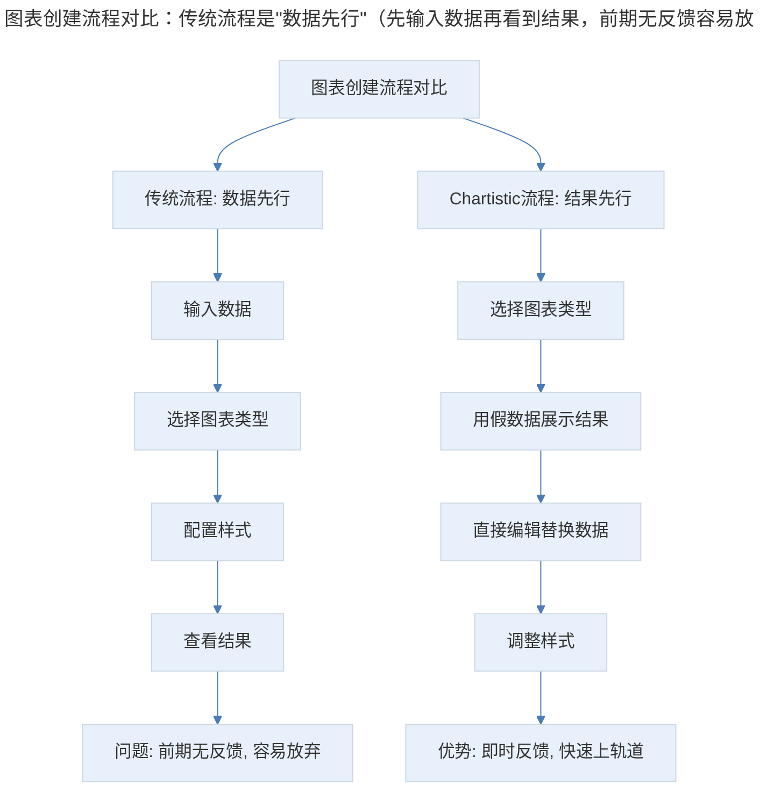
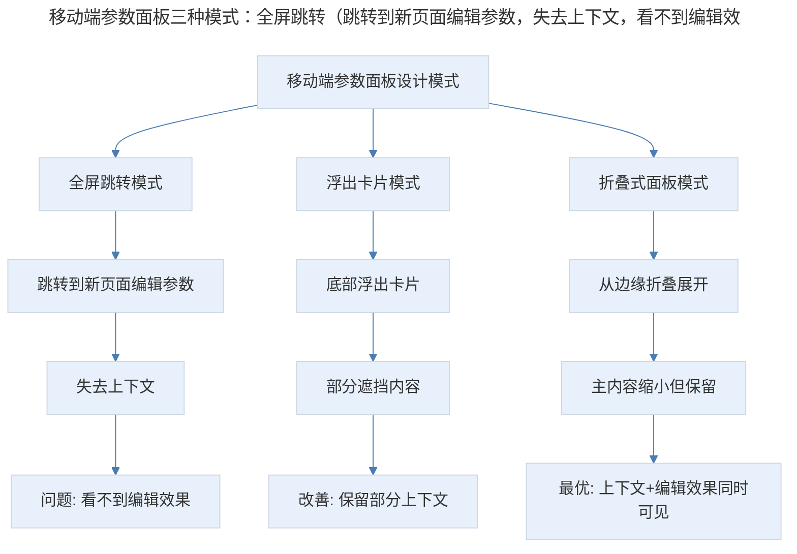
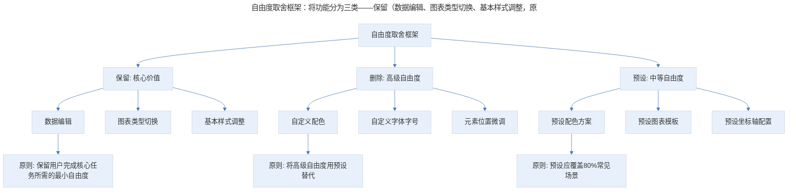
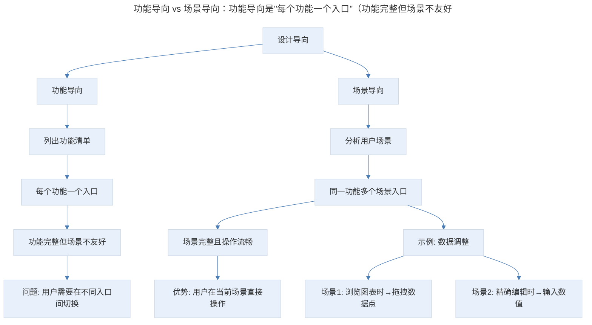
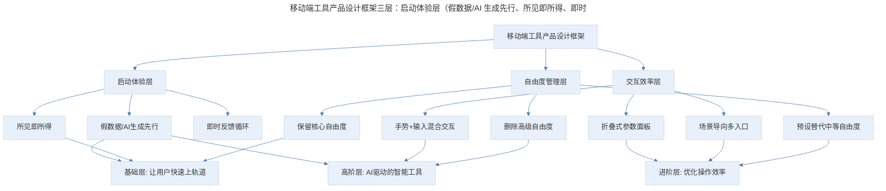

# 产品案例分析：Chartistic 的"复杂"图表

## 1. 导言

Chartistic 是一款移动端图表制作工具，其核心设计智慧在于：通过"假数据先行"降低用户启动门槛，通过"折叠式参数面板"放大屏幕面积，通过"删除自由度"保留核心价值，通过"从场景出发"而非"从功能出发"设计交互入口。这些设计原则在 AI 辅助数据可视化工具（如 ChatGPT Code Interpreter、Observable AI、Flourish 等）涌现的今天，仍然具有深刻的指导意义——工具的易用性不在于功能多少，而在于能否让用户快速"上轨道"并持续获得成就感。

> **更新说明**：本文档于 2026-06 更新，主要更新点：补充 Chartistic 产品现状；更新数据可视化工具生态变化（Observable/Flourish/AI 辅助）；增加 AI 辅助数据可视化对产品设计的冲击；增加 Mermaid 流程图与专业深度分层；补充移动端数据可视化新趋势。

## 2. 核心概念：产品定位与市场现状

Chartistic 是一款移动端做图表的工具。

在一般的概念中，制作图表都是一项复杂的工作，我们要处理数据、处理图表的样式，进行各种各样的配置工作；而由于手机端使用场景的不稳定，以及交互方式的限制，要为手机端设计图表工具其实是挺困难的一件事情。

除了要删掉大量的配置功能，牺牲自由度之外，我们还要尽可能地利用各种交互可能性，最大限度地拓展物理的小屏幕带来的限制。

**Chartistic 产品现状**：截至 2026 年，Chartistic 仍在 App Store 上架并持续维护，但其市场份额已被 AI 驱动的数据可视化工具大幅侵蚀。用户现在更倾向于使用 ChatGPT 等 AI 工具直接生成图表，而非手动在手机上操作。

**2026 年数据可视化工具生态**：

| 工具 | 平台 | 特点 | 适用场景 |
|------|------|------|----------|
| Chartistic | iOS | 极简移动端图表 | 快速制作简单图表 |
| Observable | Web | AI 辅助+交互式笔记本 | 数据分析与探索 |
| Flourish | Web | 模板化+动画图表 | 数据故事讲述 |
| ChatGPT Code Interpreter | Web | AI 自动生成图表 | 快速数据可视化 |
| D3.js | Web | 编程式可视化 | 高度定制化需求 |
| Canva Charts | Web+移动 | 设计导向图表 | 社交媒体图表 |
| Apple Numbers | macOS/iOS | 原生表格+图表 | 办公场景 |

## 3. 关键方法："假数据"的靠谱——先上轨道再调整

### 3.1 设计还原

首先是选择图表样式，它将图表样式的支持删减到只剩五种，前四种我们都很熟悉，柱状图、折线图、面积图、饼图，最后一种很有意思，算是一种信息图。

我们先选择一个折线图，打开后直接看到图，所见即所得的效果。这个跟我们想象中创建一个图表的过程其实是有点不同的，按照逻辑顺序，似乎应该先维护数据表格，再基于数据表格来创建图表。

这里是用假数据填充了数据位，直接就能看到表格。这个思路很值得学习，不是按部就班地走完逻辑流程，而是用临时数据先直接完成流程，然后再回来对中间步骤做调整和修复。

这个页面中直接给出了一些编辑的位置，标题、横纵轴这些，样式设计和文案也很直观，会召唤我们直接去点击编辑。一旦我们开始动手去编辑，是直接可以看到成果变化的。

这个感觉很微妙，不是在黑影中做一大堆工作，然后一开灯看到成果。就像我们产品迭代，不论多烂，先发布一个版本，哪怕不对外，有看得见摸得着具体的东西，感觉就会很特别，英文叫：On Track，中文可以翻译成："上轨道"，心里就有谱了。

### 3.2 "假数据先行"的设计模式

> 图表创建流程对比：传统流程是"数据先行"（先输入数据再看到结果，前期无反馈容易放弃）；Chartistic 的流程是"结果先行"（先看到假数据的结果，再替换为真实数据，即时反馈让用户快速"上轨道"）。

**图表解读**：传统流程是"数据先行"——先输入数据再看到结果，前期无反馈容易放弃。Chartistic 的流程是"结果先行"——先看到假数据的结果，再替换为真实数据，即时反馈让用户快速"上轨道"。

**设计原则**：在工具型产品中，让用户先看到"完成态"再逐步调整，比让用户从零开始构建更有效。这种"脚手架"模式在 AI 时代更加重要——AI 生成的初版就是最好的"假数据"。

### 3.3 AI 时代的"假数据"升级

2024-2026 年，AI 将"假数据先行"升级为"AI 生成先行"：

| 模式 | 时代 | 用户体验 |
|------|------|----------|
| 假数据先行 | Chartistic 2017 | 看到假数据图表，手动替换 |
| 模板先行 | Canva/Flourish 2020 | 选择模板，替换数据 |
| AI 生成先行 | ChatGPT 2024 | 描述需求，AI 生成完整图表 |
| AI+手动调整 | 2025-2026 | AI 生成初版，手动微调 |

AI 生成先行是"假数据先行"的自然延伸——AI 生成的图表比假数据更有意义，因为它已经包含了用户意图的初步理解。用户只需在 AI 基础上微调，而非从零开始。

## 4. 实践落地：被放大的屏幕——折叠式参数面板

### 4.1 设计还原

我们再来探索界面，左边可以直接改变图表类型，数值都会保留，然后这里的数据点都是可以拖动改变的，我很喜欢这个设计，这里很符合手机的操作场景。

之后是设计，我们可以向右或者向下拉出参数设置的部分，这里有一个动效的衔接，参数设置部分是折叠出来的，而图表的主体部分稍微缩小，还保留在屏幕内，并没有转场。

这样的设计相当于放大了屏幕的面积，让我们感觉这些设置似乎就停靠在屏幕边缘，一定程度降低这个界面复杂度，让操作流畅而连贯。

### 4.2 折叠式面板的交互模式

> 移动端参数面板三种模式：全屏跳转（跳转到新页面编辑参数，失去上下文，看不到编辑效果）、浮出卡片（底部浮出卡片，部分遮挡内容，保留部分上下文）、折叠式面板（从边缘折叠展开，主内容缩小但保留，上下文+编辑效果同时可见）。Chartistic 的折叠式面板是最优方案。

**图表解读**：移动端参数面板有三种模式——全屏跳转（失去上下文）、浮出卡片（部分遮挡）、折叠式面板（主内容缩小但保留）。Chartistic 的折叠式面板是最优方案，让用户在编辑参数的同时看到图表变化。

**2026 年行业趋势**：折叠式面板已成为移动端工具类产品的标准设计模式。Apple 的 Bottom Sheet 和 Google 的 Bottom Sheet 组件都支持这种交互，且增加了半屏/全屏的灵活切换。

### 4.3 自由度的取舍：保留核心价值

再来看这些设置项，刚才提到一个完整的图表工具在向移动端迁移时的取舍，从这些设置项里面，我们可以看到一些端倪，跟我们平时做表格的各种设置比起来，这里的设置少了很多。这背后取舍的逻辑就是保留核心价值，删除自由度，提高易用性。

我们一起来看看去掉了哪些易用性，除了我们刚才说的，图表类型只有几种之外，可以看到所有图表元素的位置和字体字号之类也是可以预定义的，只能调整是否显示之类的细节，但还是保留了一些坐标轴配置之类的东西。

还有一个有意思的设计是图表的配色，我们是没办法完全自定义图表元素配色的，只能在几种配色之间切换，甚至我们不能指定配色方案，只能依次切换。不得不说，Chartistic 这么做非常有胆量。

### 4.4 自由度取舍的设计框架

> 自由度取舍框架：将功能分为三类——保留（数据编辑、图表类型切换、基本样式调整，原则是保留用户完成核心任务所需的最小自由度）、删除（自定义配色、自定义字体字号、元素位置微调，原则是将高级自由度用预设替代）、预设（预设配色方案、预设图表模板、预设坐标轴配置，原则是预设应覆盖 80% 常见场景）。Chartistic 的配色设计就是"删除自由度+预设替代"的典型案例。

**图表解读**：自由度取舍框架将功能分为三类——保留（核心价值）、删除（高级自由度）、预设（中等自由度用预设替代）。Chartistic 的配色设计就是"删除自由度+预设替代"的典型案例。

**AI 时代的新平衡**：AI 为自由度取舍提供了新的解决方案——用 AI 自动处理高级自由度，用户只需描述意图。例如，用户说"我想用蓝色系配色"，AI 自动生成配色方案，而非让用户手动选择或只能依次切换预设。

### 4.5 从场景出发：同一功能的多入口设计

我们再看一个功能点，我们如何调整图表中的数据值？我们可以看到，有两个地方可以调整，一个是我们可以在图中直接拖拽，另一个就是可以向下拉开配置菜单去输入数值。同样的，添加或者删除数据点也有两个地方可以操作。

这个东西本身没有什么设计难度，但我感觉它背后有种设计思想，就是不从功能出发，而是从场景出发。

我们做设计的时候，可能会觉得需要有一个删除或添加数据点的功能，然后根据功能结构放好了，认为自己已经提供了这个功能，任务就完成了。但是，完整地提供功能不是设计的终点，把每一个场景理解清楚并做好设计才是。哪怕一个功能在一屏中以不同的形式出现两遍，也不是不能接受的。

> 功能导向 vs 场景导向：功能导向是"每个功能一个入口"（功能完整但场景不友好，用户需要在不同入口间切换）；场景导向是"同一功能多个场景入口"（场景完整且操作流畅，用户在当前场景直接操作）。Chartistic 的数据调整功能提供了两个入口——拖拽（浏览场景）和输入（编辑场景）。

**图表解读**：功能导向是"每个功能一个入口"，场景导向是"同一功能多个场景入口"。Chartistic 的数据调整功能提供了两个入口——拖拽（浏览场景）和输入（编辑场景），让用户在当前场景直接操作，无需切换。

### 4.6 信息图设计

最后介绍一下这个类似信息图的小设计，很有意思，你可以在这里选择一个图形，然后用它来指示一个百分比指标，操作也很简单，就像是调整水位一样。你可以搜索各种图形，做出来的图形虽然简单，但却精致实用。

**2026 年信息图趋势**：AI 驱动的信息图生成（如 Infogram AI、Piktochart AI）已让信息图制作变得极其简单。用户只需输入数据和描述，AI 即可生成精美的信息图。但 Chartistic 式的"手动调整水位"交互，在需要精确控制和即时反馈的场景中仍有价值。

## 5. 实践指南：方法论框架与实战要点

### 5.1 方法论框架

> 移动端工具产品设计框架三层：启动体验层（假数据/AI 生成先行、所见即所得、即时反馈循环，基础层让用户快速上轨道）、交互效率层（折叠式参数面板、场景导向多入口、手势+输入混合交互，进阶层优化操作效率）、自由度管理层（保留核心自由度、删除高级自由度、预设替代中等自由度，高阶层 AI 驱动的智能工具）。

**图表解读**：移动端工具产品设计框架从三个层面展开——启动体验层（假数据先行、所见即所得）、交互效率层（折叠面板、场景导向）、自由度管理层（保留/删除/预设）。每个层面对应不同的专业深度层级。

### 5.2 实战要点

| 要点 | 说明 | 适用场景 |
|------|------|----------|
| 假数据/AI 生成先行 | 让用户先看到完成态再调整，而非从零开始构建 | 所有工具型产品 |
| 折叠式参数面板 | 参数面板从边缘折叠展开，主内容缩小但保留 | 所有移动端编辑工具 |
| 删除自由度保留核心价值 | 将高级自由度用预设替代，保留核心编辑能力 | 移动端工具、简化版产品 |
| 场景导向多入口 | 同一功能在不同场景提供不同入口 | 所有交互密集型产品 |
| 即时反馈循环 | 编辑操作立即反映在结果上，保持用户心流 | 所有编辑/创作工具 |
| AI 辅助降低门槛 | 用 AI 生成初版，用户在 AI 基础上微调 | 所有创作型工具 |

## 6. 进阶延展：专业深度分层与核心要点回顾

### 6.1 专业深度分层

**基础层**：

- 设计"假数据先行"的启动体验
- 确保核心功能有即时反馈
- 保留核心自由度，删除高级自由度

**进阶层**：

- 设计折叠式参数面板
- 实现场景导向的多入口设计
- 用预设替代中等自由度

**高阶层**：

- 利用 AI 生成替代假数据，提供更有意义的初始状态
- 设计 AI 辅助+手动微调的混合编辑模式
- 在自由度取舍中利用 AI 动态调整（根据用户水平自动展示/隐藏高级功能）

### 6.2 核心要点回顾

Chartistic 的核心设计智慧在于移动端工具产品的四大原则：假数据先行（让用户先看到完成态再调整，AI 时代升级为 AI 生成先行）、折叠式参数面板（从边缘折叠展开，主内容缩小但保留，上下文+编辑效果同时可见）、删除自由度保留核心价值（将高级自由度用预设替代，预设覆盖 80% 常见场景，AI 时代用 AI 自动处理高级自由度）、从场景出发而非从功能出发（同一功能多个场景入口，让用户在当前场景直接操作）。移动端工具产品设计框架从启动体验层、交互效率层、自由度管理层三个层面展开。在 AI 时代，ChatGPT Code Interpreter、Observable AI、Flourish 等 AI 辅助工具正在重塑数据可视化生态，但工具的易用性不在于功能多少，而在于能否让用户快速"上轨道"并持续获得成就感。

### 6.3 延伸阅读

- Observable (observablehq.com) —— AI 辅助的交互式数据可视化
- Flourish (flourish.studio) —— 模板化数据故事工具
- "The Grammar of Graphics" —— 数据可视化的理论基础
- ChatGPT Code Interpreter —— AI 驱动的数据可视化
- 《移动端工具产品设计模式》——折叠面板与场景导向

## 更新日志

| 版本 | 日期 | 更新内容 |
|------|------|----------|
| v1.0 | 2018-06 | 初始版本 |
| v2.0 | 2026-06 | 补充 Chartistic 产品现状；更新数据可视化工具生态；增加 AI 辅助数据可视化分析；增加 Mermaid 流程图与专业深度分层 |