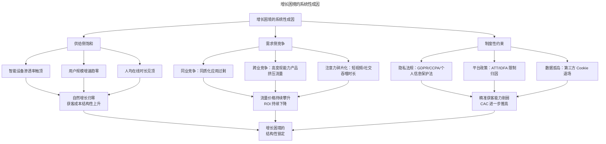
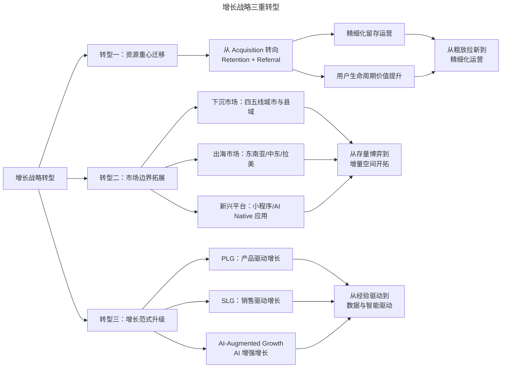

# 产品增长的结构性困境与战略转型

> **适用范围**：产品经理（3-5 年经验）、增长负责人、产品管理者、创业者。适用于增长困境分析、战略转型、CAC 管控、PLG/SLG 选择、存量市场增长等场景。
>
> **更新摘要（v2 · 2026-08 更新）**：
> - 结构化升级为 6 节骨架（导言 / 核心方法论 / 关键流程 / 工具与实战 / 常见误区 / 进阶延展）
> - 保留结构性成因、CAC 攀升、三重转型、PLG/SLG/AI 增长、实施框架
> - 保留全部 Mermaid 图并补充 `--- title: ... ---` frontmatter，每张图后追加文字解读

---

## 1. 导言

近年来，产品增长已从增量时代的"跑马圈地"转变为存量时代的"精耕细作"。这一转变并非周期性波动，而是由底层结构性因素驱动的范式转移（Paradigm Shift）。全球头部科技公司的财报数据反复印证：Netflix、Meta、Twitter 等拥有业界最先进数据分析能力的企业，同样面临增长未达预期的困境。在中国市场，移动互联网用户规模增速从 2018 年的 11.3% 降至 2024 年的不足 2%，智能手机出货量连续多年下滑——这一趋势已从预测变为现实。

对于具有 3-5 年经验的产品管理者而言，理解增长困境的深层成因，并据此制定战略转型路径，已成为不可回避的核心命题。

### 1.1 增长困境的系统性成因

> **图解**：增长困境的系统性成因——供给侧饱和（智能设备渗透率触顶、用户规模增速趋零、人均在线时长见顶）→自然增长归零获客成本结构性上升；需求侧竞争（同业同质化、跨业高变现挤压、注意力碎片化）→流量价格攀升 ROI 下降；制度性约束（隐私法规、平台政策 ATT/IDFA、数据孤岛第三方 Cookie 退场）→精准获客能力削弱 CAC 推高。三者共同导致增长困境的结构性锁定。

---

## 2. 核心方法论

### 2.1 移动互联网红利消退的量化表征

移动互联网红利消退并非抽象概念，而是可量化的系统性趋势：

- **设备渗透饱和**：中国智能手机出货量自 2017 年首次出现年度下滑后持续走低，2024 年全球智能手机出货量约 12.4 亿部，同比增长约 6%（IDC, 2025）。
- **用户规模触顶**：中国移动互联网月活跃用户规模突破 12 亿后趋于平稳，人均单日使用时长在 6-7 小时区间徘徊，时长增长已近极限。
- **自然增长归零**：早期"即使产品什么都不做也可能迎来可观自然增长"的时代已彻底终结，所有增长均需主动投入资源获取。

### 2.2 用户获取成本（CAC）的结构性攀升

获客成本上升并非简单的市场竞价结果，而是由多层因素叠加驱动的结构性趋势。

**竞价机制驱动的成本通胀**——在程序化广告生态中，不同变现能力的广告主在同一流量池中竞价。当某一行业的单用户变现价值（LTV）显著高于其他行业时，该行业广告主能够承受更高的 CAC 出价，从而系统性推高整体流量价格。例如，电商和金融科技产品的单用户收入远高于内容类产品，导致内容类产品在流量竞价中处于结构性劣势。

**隐私法规对获客效率的深层冲击**——2024 年以来，全球隐私法规体系对增长工作的影响已从"间接约束"升级为"直接制约"：

| 隐私法规/政策 | 影响范围 | 对 CAC 的具体影响 |
|---|---|---|
| Apple ATT | iOS 生态 | 归因精度下降 30-50%，iOS 端 CAC 上升 40-60% |
| Google Privacy Sandbox / 第三方 Cookie 退场 | Web 端 | 再营销受众缩减，Web 端获客效率下降 20-35% |
| 中国《个人信息保护法》 | 中国市场全渠道 | 数据收集与使用合规成本上升，用户授权率降低 |
| GDPR/CCPA | 欧美市场 | 数据处理成本增加，合规团队投入上升 |

**跨行业注意力竞争**——用户在线时长的饱和意味着所有产品在同一个"注意力池"中零和博弈。短视频平台（如抖音、TikTok）对用户时长的吞噬效应尤为显著——2024 年中国用户日均短视频使用时长已超过 2.5 小时，严重挤压其他品类的使用空间。

### 2.3 竞争格局的范式转变：从同业竞争到跨业竞争

传统竞争分析框架假设竞争发生在同品类产品之间，但当前增长困境的核心特征之一是**跨行业注意力竞争**。做社区产品的竞争者不再只是其他社区，而是拥有电商变现能力的产品矩阵；做工具产品的对手也不再只是同类工具，而是通过内容生态黏住用户的超级应用。这种竞争格局的转变使得"领域壁垒"失效，变现能力的差异直接转化为获客预算的差异，进一步加剧了低变现能力产品的增长困境。

---

## 3. 关键流程

### 3.1 战略转型路径：三重转型

面对结构性困境，产品增长的战略重心需要实现三重转型。

> **图解**：增长战略三重转型——转型一资源重心迁移（从 Acquisition 转向 Retention + Referral→精细化留存运营、用户生命周期价值提升→从粗放拉新到精细化运营）；转型二市场边界拓展（下沉市场、出海市场、新兴平台→从存量博弈到增量空间开拓）；转型三增长范式升级（PLG、SLG、AI 增强增长→从经验驱动到数据与智能驱动）。

**转型一：资源重心从获客向留存与推荐迁移**——在红利期，资源投入逻辑是"跑马圈地"；红利消退后，这一逻辑需要彻底反转：留存即增长（留存率每提升 5%，利润可增加 25-95%，领先公司已把资源配比从"70% 获客/30% 留存"调整为"40% 获客/40% 留存/20% 推荐"）；推荐引擎替代付费获客（Dropbox 邀请存储、拼多多拼团模式）；从"大声吆喝"到"精细技术"（产品体验和用户价值逐渐取代营销活动成为增长核心驱动力）。

**转型二：市场边界的结构性拓展**——下沉市场（四五线城市及县域，但需强调下沉市场并非"低级市场"，对用户做价值评判是傲慢且有害的思维）；出海市场（东南亚、中东、拉美，但需解决本地化适配、合规风险、支付基建等挑战，2024-2025 年出海重心已从"工具出海"转向"内容与社交出海"）；新兴平台与形态（小程序、AI Native 应用、Agent 分发渠道，小程序授权获客成本已从早期 0.5 元上涨至 3-5 元区间）。

### 3.2 转型三：增长范式的升级——PLG、SLG 与 AI-Augmented Growth

| 维度 | PLG | SLG | AI-Augmented Growth |
|---|---|---|---|
| 核心驱动力 | 产品自身体验驱动用户采用与扩展 | 销售团队主动推动客户转化 | AI 自动化驱动增长实验与优化 |
| 典型适用场景 | SaaS、开发者工具、自助服务产品 | 企业级软件、复杂采购决策 | 全品类，尤其是数据密集型产品 |
| 获客逻辑 | 自下而上，用户自发试用并扩散 | 自上而下，从决策层切入 | 智能识别高价值用户，自动化触达与转化 |
| 代表企业 | Slack、Figma、Notion | Salesforce、SAP | 2024-2026 年新兴实践者 |
| 关键指标 | PQL、试用转付费率 | SQL、销售周期 | AI 实验吞吐量、自动化优化迭代速度 |
| 优势 | 获客成本低、用户自驱动 | 客单价高、客户关系深度强 | 实验速度指数级提升、7×24 优化 |
| 局限 | 上行销售困难、企业级功能采纳慢 | 获客成本高、规模化依赖人力 | 模型偏差风险、过度自动化可能导致用户体验异化 |

**PLG 与 SLG 的融合趋势**——2024-2026 年，增长实践中最重要的趋势之一是 PLG 与 SLG 的融合（Product-Led Sales, PLS）。即以 PLG 模式获取用户和验证产品价值，再以 SLG 模式实现上行销售和客户深化。

**AI-Augmented Growth 的兴起**——AI 对增长工作的影响体现在三个层面：实验自动化（AI Agent 可自主设计、执行、分析 A/B 测试，将实验吞吐量提升 5-10 倍）；个性化触达（基于大语言模型的用户沟通可实现千人千面的个性化内容生成与触达时机优化）；预测性增长（利用机器学习模型预测用户流失、转化概率和 LTV，实现资源的最优配置）。

---

## 4. 工具与实战

### 4.1 2024-2026 年增长实践的前沿趋势

**隐私计算与第一方数据战略**——在第三方数据能力持续被削弱的背景下，**第一方数据（First-Party Data）战略**已成为增长工作的基础设施。具体实践包括：数据清洁室（Data Clean Room，在不共享原始数据的前提下实现跨平台数据协作与归因分析）；服务器端追踪（Server-Side Tracking，绕过浏览器端隐私限制实现更稳定的归因链路）；渐进式画像构建（通过产品内交互逐步收集用户偏好数据，替代一次性授权采集）。

**增长工程的崛起**——增长工程（Growth Engineering）作为独立职能正在快速崛起。增长工程师需要具备全栈开发能力、数据工程经验和增长实验方法论，能够在产品内快速构建、测试和迭代增长特性。这一角色填补了传统"增长黑客"（偏策略）与"产品工程师"（偏功能）之间的能力空缺。

**从 DAU 到有效活跃用户的指标进化**——在增长困境下，DAU/MAU 等表层活跃指标的指导价值持续下降。领先企业正在转向更精细的活跃度量：核心行为活跃度（完成产品核心价值行为的用户占比）；价值实现率（达到 Aha Moment 的用户占新增用户的比例）；长期留存曲线斜率（关注留存曲线"长尾"的斜率变化，而非简单的 D7/D30 留存率）。

### 4.2 战略转型的实施框架

| 转型维度 | 红利期做法 | 困境期转型 | 关键行动 |
|---|---|---|---|
| 资源配置 | 70% 获客 / 30% 其他 | 40% 留存 / 30% 推荐 / 30% 获客 | 重新评估获客预算 ROI，设立留存专项 |
| 竞争策略 | 同品类竞争 | 跨品类注意力竞争 | 分析用户注意力分配，识别真实竞争者 |
| 市场选择 | 一二线城市优先 | 下沉与出海并行 | 建立本地化团队，适配产品体验 |
| 数据能力 | 第三方数据依赖 | 第一方数据战略 | 部署 CDP，建设数据清洁室 |
| 增长范式 | 营销驱动增长 | PLG + AI 增强增长 | 引入增长工程职能，搭建实验平台 |
| 核心指标 | DAU/MAU 增速 | 价值实现率与长期留存 | 定义核心行为指标，重构数据看板 |

### 4.3 实战要点

| 要点 | 说明 | 适用场景 |
|------|------|----------|
| 留存即增长 | 存量市场留存率提升 5% 利润增 25-95% | 资源配比调整 |
| 推荐替代付费获客 | 产品内生的推荐机制替代外部付费获客 | 高 CAC 环境 |
| 跨业竞争识别 | 识别真实的跨行业注意力竞争者 | 竞争分析 |
| 下沉≠低级 | 基于当地用户生活场景深入洞察 | 下沉市场 |
| PLG/SLG/PLS | 根据产品类型选择增长范式 | 增长范式选择 |
| AI增强增长 | 实验自动化、个性化触达、预测性增长 | 数据密集型产品 |
| 第一方数据战略 | 数据清洁室、服务器端追踪、渐进画像 | 隐私合规时代 |
| 核心行为活跃度 | 从 DAU 到有效活跃用户 | 指标重构 |

---

## 5. 常见误区

| 误区 | 表现 | 正确做法 |
|------|------|----------|
| **把增长困境当周期波动** | 认为只是短期波动，等待回升 | 识别结构性成因，主动战略转型 |
| **只看 CAC 数字** | 忽视隐私法规、跨业竞争等深层因素 | 分析 CAC 攀升的多层结构性驱动 |
| **依赖第三方数据** | 继续依赖第三方 Cookie 等 | 建立第一方数据战略 |
| **把下沉市场当低级市场** | 对用户做价值评判 | 基于当地用户生活场景深入洞察 |
| **固守单一增长范式** | 只依赖营销驱动增长 | PLG + SLG 融合 + AI 增强增长 |

---

## 6. 进阶延展

### 6.1 结语

产品增长的结构性困境并非短期波动，而是由设备渗透饱和、注意力竞争白热化、隐私法规收紧等多重因素共同驱动的长期趋势。面对这一困境，产品管理者需要实现从"粗放获客"到"精细化运营"、从"存量博弈"到"增量开拓"、从"经验驱动"到"数据与智能驱动"的三重战略转型。

增长的本质从未改变——它始终根植于用户价值。变化的是实现增长的路径与方法。在结构性困境中，唯有回归用户价值本质，同时拥抱 AI 增强增长等新范式，才能在存量时代找到可持续的增长路径。

### 6.2 参考文献

- Adjust. (2025). *Mobile App Trends 2025*. Adjust GmbH.
- AppsFlyer. (2024). *The State of App Marketing 2024*. AppsFlyer Ltd.
- Branch. (2025). *Mobile Growth Report 2025*. Branch Metrics.
- Ellis, S., & Brown, M. (2017). *Hacking Growth*. Crown Business.
- IDC. (2025). *Worldwide Quarterly Mobile Phone Tracker*.
- Reichheld, F. F., & Schefter, P. (2000). E-loyalty: Your secret weapon on the Web. *Harvard Business Review*, 78(4), 105-113.
- 艾瑞咨询. (2024). *中国移动互联网年度报告 2024*.
- 中国互联网络信息中心. (2025). *第 55 次中国互联网络发展状况统计报告*.
