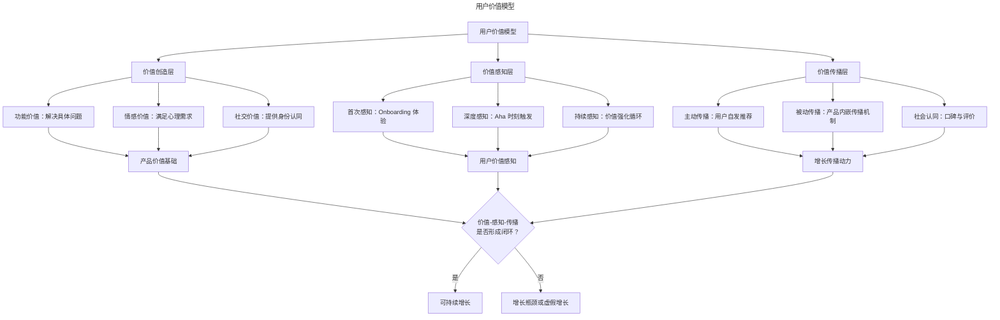
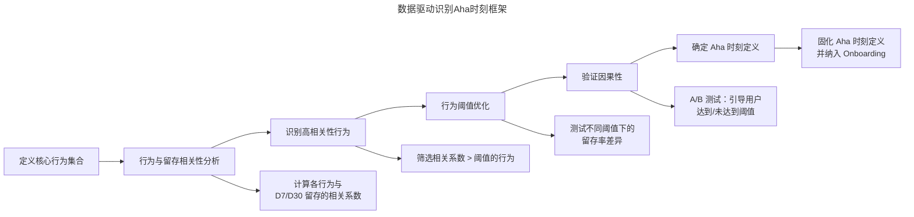
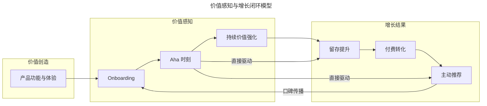

# 产品增长的核心驱动力：用户价值与 Aha 时刻

> **适用范围**：产品经理（3-5 年经验）、增长负责人、产品管理者、创业者。适用于用户价值识别、Aha 时刻设计、Onboarding 优化、PMF 判断、PLG 增长等场景。
>
> **更新摘要（v2 · 2026-08 更新）**：
> - 结构化升级为 6 节骨架（导言 / 核心方法论 / 关键流程 / 工具与实战 / 常见误区 / 进阶延展）
> - 保留用户价值模型、价值-感知差距、Aha 时刻识别、Sean Ellis PMF、闭环模型
> - 保留全部 Mermaid 图并补充 `--- title: ... ---` frontmatter，每张图后追加文字解读

---

## 1. 导言

在增长方法论日益丰富的当下，从业者容易陷入"手段崇拜"——将 Hotmail 的邮件签名推广、Dropbox 的邀请存储空间、拼多多的拼团砍价等经典案例视为可复制的增长模板。然而，这些"四两拨千斤"的增长招数背后，都有一个共同的基础：**用户价值**。

Sean Ellis 在《增长黑客》中引用 Airbnb 增长团队的观点："是爱创造了增长，而不是增长创造了爱"（Ellis & Brown, 2017）。这一论断揭示了增长的本质——增长不是营销技巧的堆砌，而是用户价值被感知、被认可、被传播的过程。

对于具有 3-5 年经验的产品管理者而言，理解用户价值在增长中的核心地位，掌握 Aha 时刻的识别与设计方法，是构建可持续增长体系的基础。

### 1.1 用户价值模型

> **图解**：用户价值模型——价值创造层（功能价值、情感价值、社交价值）→产品价值基础；价值感知层（首次感知 Onboarding、深度感知 Aha 时刻、持续感知价值强化循环）→用户价值感知；价值传播层（主动传播、被动传播、社会认同）→增长传播动力。三者形成闭环则可持续增长，否则增长瓶颈或虚假增长。

---

## 2. 核心方法论

### 2.1 用户价值的增长视角

用户价值是一个多维概念，在增长领域可以从两个独特视角进行审视：

**价值创造视角**：产品是否持续有效地解决了一方或多方的核心问题？这是产品存在的根本理由。

**价值感知视角**：用户是否真正意识到产品为其创造的价值？这是增长发生的前提条件。

两者缺一不可——有价值无感知，产品难以获得增长；有感知无价值，增长终将归于沉寂。

### 2.2 价值-感知差距（Value-Perception Gap）

产品管理者常犯的错误是假设"价值创造"自动等同于"价值感知"。实际上，两者之间存在显著的**价值-感知差距**：

| 差距类型 | 表现特征 | 典型案例 | 解决方向 |
|---|---|---|---|
| 功能差距 | 产品功能强大但用户不知如何使用 | 企业级软件功能利用率低于 20% | 优化 Onboarding，场景化引导 |
| 认知差距 | 产品价值与用户预期不匹配 | 工具类产品被误认为内容平台 | 明确价值主张，精准获客渠道 |
| 时机差距 | 价值存在但触发时机不当 | 过早推送高级功能导致用户困惑 | 基于用户旅程的时机优化 |
| 表达差距 | 产品价值无法用语言描述 | 用户难以向他人解释产品价值 | 提炼可传播的价值表达 |

价值-感知差距的存在意味着：**增长工作的核心不仅是创造价值，更是帮助用户发现和感知价值**。

### 2.3 从用户描述中重新发现产品价值

用户如何向他人描述产品，是理解真实价值感知的重要窗口。这一描述往往与产品设计的初衷存在差异，而这种差异恰恰揭示了用户视角的价值定位。

**案例：Path 与 Instagram 的滤镜价值**——Path 最初定位为私密社交应用，但大量用户向朋友推荐时强调的是"滤镜特别好，处理出来的图片很高级"。Instagram 同样经历了从"图片社交"到"滤镜工具"再到"视觉社交平台"的演变。用户描述揭示的价值——图片处理能力——成为产品早期增长的核心驱动力。

**案例：产品形态的意外转型**——多个知名产品的最终形态与初始设计截然不同：

| 产品 | 初始定位 | 用户发现的价值 | 最终形态 |
|---|---|---|---|
| Pinterest | 移动电商应用 | 图片收藏与发现 | 视觉发现引擎 |
| YouTube | 视频约会网站 | 视频分享与观看 | 视频内容平台 |
| Groupon | 在线活动平台 | 团购优惠 | 本地服务平台 |
| Facebook | 校园社交 | 社交连接与信息获取 | 全球社交平台 |

这些案例揭示了一个关键洞察：**产品活在用户的认知中，而非设计者的蓝图里**。从用户描述中重新认识产品，是发现真实价值定位的有效方法。

---

## 3. 关键流程

### 3.1 Aha 时刻的定义与意义

**Aha 时刻（Aha Moment）** 是指用户在使用产品过程中，突然意识到产品价值、发现产品奥妙并为之眼前一亮的那个时刻。这是一个感性与理性交织的顿悟时刻，是用户从"试用"转向"认可"的关键转折点。

Aha 时刻的重要性在于：留存拐点（达到 Aha 时刻的用户留存率显著高于未达到的用户）；转化驱动（Aha 时刻是付费转化的关键前置条件）；传播起点（经历 Aha 时刻的用户更倾向于主动推荐）。

### 3.2 Aha 时刻的识别方法论

**数据驱动的识别方法**——经典案例是 Twitter 发现"关注 30 个人"的留存拐点。通过数据分析，Twitter 团队发现关注 30 个以上用户的用户群体，其长期留存率显著高于关注少于 30 个用户的群体。30 个关注恰好提供了持续更新的信息流，使用户能够感知到 Twitter 的核心价值——实时信息获取。

> **图解**：数据驱动识别 Aha 时刻框架——定义核心行为集合→行为与留存相关性分析（计算各行为与 D7/D30 留存的相关系数）→识别高相关性行为（筛选相关系数 > 阈值的行为）→行为阈值优化（测试不同阈值下的留存率差异）→验证因果性（A/B 测试引导用户达到/未达到阈值）→确定 Aha 时刻定义（固化并纳入 Onboarding）。

**2024-2026 年的产品分析实践**——现代产品分析工具（如 Amplitude、Mixpanel、PostHog）已将 Aha 时刻识别功能产品化：留存曲线分群（按行为完成度对用户分群，比较不同群体的留存曲线）；相关性矩阵（自动计算各行为与留存目标的相关性，识别高价值行为）；路径分析（分析达到 Aha 时刻的典型用户路径，优化 Onboarding 流程）。

**定性驱动的识别方法**——数据驱动方法适用于已有一定用户基础的产品，对于新产品或用户量较小的产品，定性方法更为适用：用户访谈（询问"什么时候你觉得这个产品对你有用？"）；NPS 开放题分析（分析用户推荐或不推荐的具体原因）；用户反馈文本挖掘（从应用商店评论、客服工单中提取价值感知关键词）。

**Sean Ellis PMF 调查法**——Sean Ellis 提出的产品市场契合度（Product-Market Fit, PMF）调查是识别价值感知的有效工具。核心问题是："如果你不能再使用这个产品，你会感觉如何？"选项包括：非常失望、有点失望、不会在意。**PMF 阈值**：如果超过 40% 的用户选择"非常失望"，则认为产品达到了 PMF。这一方法不仅用于 PMF 判断，也可用于识别哪些用户群体、哪些使用场景下价值感知最强。

### 3.3 Aha 时刻的设计原则

Aha 时刻并非完全自然发生，优秀的产品设计会主动创造触发 Aha 时刻的条件：

| 设计原则 | 具体实践 | 案例 |
|---|---|---|
| 降低到达门槛 | 简化 Onboarding，减少前置步骤 | Slack 的团队创建向导 |
| 突出核心价值 | 在首次体验中展示最核心的功能 | Notion 的模板库 |
| 创造惊喜感 | 设计超出预期的交互细节 | Readhub 的双指捏合切换周/日视图 |
| 即时反馈 | 让用户行为立即产生可见结果 | Instagram 滤镜的实时预览 |
| 社会认同 | 展示其他用户的使用状态 | Spotify 的"好友正在听" |

**设计 Aha 时刻的注意事项**：避免过度设计（Aha 时刻应服务于价值感知，而非炫技）；尊重用户多样性（不同用户群体的 Aha 时刻可能不同，需要分群识别和设计）；持续迭代（随着产品演进，Aha 时刻的定义也需要更新）。

---

## 4. 工具与实战

### 4.1 从价值到增长的传导机制

用户价值与增长之间存在清晰的传导链条：

> **图解**：价值感知与增长闭环模型——价值创造（产品功能与体验）→价值感知（Onboarding→Aha 时刻→持续价值强化）→增长结果（留存提升→付费转化→主动推荐）。Aha 时刻直接驱动留存提升和主动推荐，主动推荐通过口碑传播回到 Onboarding，形成闭环。

这一模型揭示了增长工作的关键杠杆点：Onboarding 优化（帮助用户尽快到达 Aha 时刻）；Aha 时刻设计（创造价值感知的关键节点）；价值强化循环（通过持续的价值交付巩固用户认知）；推荐机制设计（将价值感知转化为传播动力）。

### 4.2 增长手段与价值基础的平衡

将产品比作帆船，帆是品牌、运营、拉新能力，船体是产品价值本身。**船小帆大则航行不稳甚至倾覆，船大帆小则步履维艰**。

| 状态 | 特征 | 风险 | 典型表现 |
|---|---|---|---|
| 价值强、增长弱 | 产品体验好但用户增长缓慢 | 错失市场窗口，被竞品超越 | 口碑好但知名度低 |
| 价值弱、增长强 | 营销能力强但产品体验差 | 用户流失快，口碑崩塌 | 刷屏后迅速沉寂 |
| 价值与增长匹配 | 产品价值与增长能力协调 | 无 | 可持续增长 |

**刷屏不是目标，而是手段**。将刷屏作为目标，是舍本逐末。真正可持续的增长，是产品价值被用户发现、认可、传播的自然结果。

### 4.3 2024-2026 年的前沿实践

**AI 驱动的 Aha 时刻优化**——个性化 Onboarding（基于用户特征动态调整 Onboarding 路径，使不同用户都能以最适合自己的方式到达 Aha 时刻）；预测性干预（利用机器学习模型预测用户是否可能达到 Aha 时刻，对高风险用户进行主动干预）；Aha 时刻自动化发现（AI Agent 自动分析用户行为数据，发现人类分析师可能忽略的 Aha 时刻模式）。

**产品分析工具的演进**——现代产品分析工具已将 Aha 时刻识别从"手工分析"升级为"产品化能力"：Amplitude（留存分析、行为相关性分析、用户分群）；Mixpanel（信号分析 Signals、影响分析 Impact）；PostHog（开源方案，支持自定义 Aha 时刻追踪）；Heap（自动事件捕获，减少埋点依赖）。

**PLG 框架下的 Aha 时刻**——PQL（Product Qualified Lead）定义（达到 Aha 时刻的用户可被定义为 PQL，作为销售团队跟进的优先线索）；免费到付费转化（Aha 时刻是免费用户转化为付费用户的关键节点，付费墙通常设置在 Aha 时刻之后）；产品驱动销售（销售团队基于用户是否达到 Aha 时刻来评估购买意向，而非传统的 MQL 标准）。

### 4.4 Aha 时刻识别的行动清单

| 阶段 | 行动项 | 输出物 |
|---|---|---|
| 准备阶段 | 定义核心行为集合，建立事件追踪体系 | 行为事件清单、埋点文档 |
| 分析阶段 | 计算行为与留存相关性，识别候选 Aha 时刻 | 相关性分析报告、候选行为列表 |
| 验证阶段 | A/B 测试验证因果性，确定阈值 | Aha 时刻定义文档 |
| 落地阶段 | 优化 Onboarding，引导用户到达 Aha 时刻 | Onboarding 优化方案 |
| 监控阶段 | 持续追踪 Aha 时刻到达率，迭代优化 | Aha 时刻到达率看板 |

### 4.5 价值感知优化的关键指标

| 指标 | 定义 | 目标方向 |
|---|---|---|
| Aha 时刻到达率 | 新增用户中达到 Aha 时刻的比例 | 持续提升 |
| 到达时间（Time to Aha） | 从首次使用到达到 Aha 时刻的时间 | 持续缩短 |
| Aha 用户留存率 | 达到 Aha 时刻用户的留存率 | 显著高于整体留存率 |
| PMF 调查"非常失望"比例 | 选择"非常失望"的用户比例 | > 40% |

---

## 5. 常见误区

| 误区 | 表现 | 正确做法 |
|------|------|----------|
| **手段崇拜** | 把经典增长案例当可复制模板 | 理解增长招数背后的用户价值基础 |
| **假设价值创造=价值感知** | 功能强大就以为用户能感知 | 识别价值-感知差距，帮助用户发现价值 |
| **设计者蓝图思维** | 以为产品按自己设计被使用 | 从用户描述中重新发现产品价值 |
| **Aha 时刻过度设计** | 复杂交互只为炫技 | Aha 时刻服务价值感知，避免炫技 |
| **刷屏当目标** | 把刷屏当增长目标 | 刷屏是手段，可持续增长源于用户价值 |

---

## 6. 进阶延展

### 6.1 结语

增长的核心驱动力始终是用户价值。无论增长方法论如何演进，这一本质不会改变。Aha 时刻作为用户价值感知的关键节点，是连接产品价值与增长结果的桥梁。

对于产品管理者而言，增长工作的起点不是设计精妙的传播机制，而是回答两个根本问题：产品为用户创造了什么价值？用户如何发现和感知这一价值？只有当这两个问题有了清晰的答案，增长手段才能发挥应有的作用。

在 AI 时代，Aha 时刻的识别与设计正在被技术赋能，但核心逻辑不变——帮助用户更快、更清晰地感知产品价值，是可持续增长的根基。

### 6.2 参考文献

- Ellis, S., & Brown, M. (2017). *Hacking Growth*. Crown Business.
- Ellis, S. (2010). *Startup Marketing Blog: When to launch?* http://www.startup-marketing.com/
- Amplitude. (2024). *The Product Analytics Guide: Finding Your Aha Moment*.
- Mixpanel. (2024). *Signals: Find the behaviors that matter*.
- Christensen, C. M., et al. (2016). Know your customers' "jobs to be done". *Harvard Business Review*, 94(9), 54-62.
- Fogg, B. J. (2009). A behavior model for persuasive design. *Proceedings of the 4th International Conference on Persuasive Technology*.
- Eyal, N. (2014). *Hooked: How to Build Habit-Forming Products*. Portfolio.
