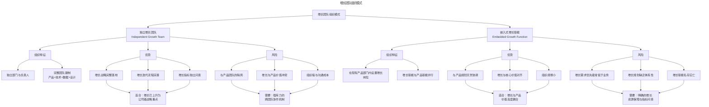
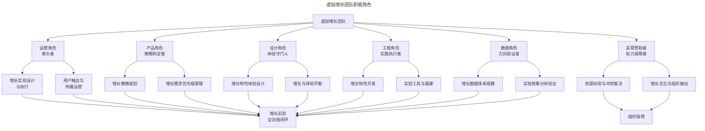

# 增长团队的组织设计与虚拟协作

> **适用范围**：产品经理（3-5 年经验）、增长负责人、产品管理者、创业者。适用于增长团队组织设计、虚拟协作、Growth Pod、Product Trio、增长节奏规划等场景。
>
> **更新摘要（v2 · 2026-08 更新）**：
> - 结构化升级为 6 节骨架（导言 / 核心方法论 / 关键流程 / 工具与实战 / 常见误区 / 进阶延展）
> - 保留两种路径两个阶段、虚拟团队角色、节奏式资源倾斜、Growth Pod、Product Trio、AI 增强、决策框架
> - 保留全部 Mermaid 图并补充 `--- title: ... ---` frontmatter，每张图后追加文字解读

---

## 1. 导言

增长从个人英雄主义的"黑客技巧"走向体系化的组织能力，是产品成熟过程中的必然演进。随着团队规模扩张，部门间职责划分趋于明确——市场部负责获客，产品部负责功能，技术部负责实现，运营部负责维护——这种职能分工在提升专业性的同时，也在用户旅程的各阶段之间制造了缝隙。增长策略需要贯穿用户全生命周期，但部门间的权责分离使得策略难以有始有终地贯彻。

增长团队的组织设计，本质上是在"专业化效率"与"全链路一致性"之间寻找最优平衡点。对于具有 3-5 年经验的产品管理者而言，理解不同组织模式的适用条件，掌握在现有架构中推动增长的协作方法，是将增长从理念转化为成果的关键。

### 1.1 专门化增长的两条路径

> **图解**：增长团队组织模式——独立增长团队（独立部门与负责人、完整团队建制；优势：增长战略完整落地、迭代流程完善、指标独立问责；风险：与产品团队隔阂、增长与产品价值冲突、组织墙沟通成本）适合增长已上升为公司级战略重点；嵌入式增长职能（在现有产品部门内设置增长岗位；优势：与产品规划天然协调、增长与核心价值对齐、组织摩擦小；风险：增长需求优先级常低于业务、规划缺乏体系性、职能名存实亡）适合增长与产品价值高度耦合。

---

## 2. 核心方法论

### 2.1 团队发展的两个阶段

**阶段一：早期团队（全员增长）**——团队规模较小，成员身兼多职，尚不具备组建专门增长团队的条件。此阶段的增长策略与产品规划高度融合，全体成员共同关注增长指标。核心特征是敏捷性和灵活性，增长需求与产品需求在同一个迭代中自然消化。

**阶段二：规模化团队（专门化增长）**——随着团队扩张和职能分化，增长需求在部门缝隙中日益被边缘化。产品团队优先业务功能，市场团队关注品牌传播，运营团队侧重用户维护——增长无人负责或人人有责但无人问责。此时需要专门的增长职能来确保策略的完整性和持续性。

### 2.2 两种路径的系统性比较

| 比较维度 | 独立增长团队 | 嵌入式增长职能 |
|---|---|---|
| 代表企业 | Facebook、Uber | Twitter、LinkedIn |
| 组织结构 | 独立部门，专职增长负责人 | 产品部门内设置增长岗位 |
| 决策效率 | 增长决策快，跨团队决策慢 | 增长决策需与产品协调，但整体一致性高 |
| 资源保障 | 增长资源独立，不受业务挤压 | 增长资源常与业务共享，易被挤压 |
| 策略完整性 | 全链路增长策略完整落地 | 增长策略可能支离破碎 |
| 产品一致性 | 增长特性可能与产品价值冲突 | 增长与产品价值天然对齐 |
| 适用阶段 | 公司级增长战略，高管直接推动 | 增长处于探索期，与产品高度耦合 |
| 关键成功因素 | 跨团队沟通机制，共同目标对齐 | 增长资源保障，指标问责机制 |

### 2.3 2024-2026 年的演进趋势：混合模式与 Growth Pod

领先企业正在探索独立与嵌入的混合模式——**Growth Pod（增长小队）**。Growth Pod 是一种跨职能小型团队，通常由 5-8 人组成，包含产品经理、设计师、工程师、数据分析师，以特定增长目标为使命进行短期冲刺。

Growth Pod 的核心特征：任务导向（围绕明确的增长指标组建，完成目标后可解散或转向）；跨职能组成（不依赖其他团队即可完成增长实验的全流程）；时间限定（通常以 6-12 周为一个冲刺周期）；可扩展（可同时运行多个 Pod，各自聚焦不同增长杠杆）。

---

## 3. 关键流程

### 3.1 虚拟增长团队的职能角色

对于大多数未设立正式增长组织的团队而言，在现有组织架构中构建虚拟增长团队是更务实的路径。虚拟增长团队没有独立编制，通过横向协作机制推动增长。

> **图解**：虚拟增长团队职能角色——运营角色（牵头者，增长实验设计执行、用户触达运营）、产品角色（策略制定者，增长策略规划、需求优先级管理）、设计角色（体验守门人，增长特性体验设计、增长与体验平衡）、工程角色（实施执行者，增长特性开发、实验工具与基建）、数据角色（方向验证者，数据体系搭建、实验效果分析验证）共同构成增长实验全流程闭环；高管赞助者（权力保障者，资源协调与冲突裁决、增长文化与组织推动）提供组织保障。

**角色职能详解**：

| 角色 | 核心职责 | 关键产出 | 可兼任性 |
|---|---|---|---|
| 运营（牵头者） | 增长实验设计执行、用户触达运营 | 实验方案、运营计划 | 中小团队可与产品角色合并 |
| 产品经理（策略制定者） | 增长策略规划、需求优先级管理 | 增长路线图、PRD | 不可替代 |
| 设计师（体验守门人） | 增长特性体验设计、体验底线守护 | 设计方案、体验评审 | 可与其他设计任务合并 |
| 工程师（实施执行者） | 增长特性开发、实验工具建设 | 代码实现、实验基建 | 中小团队可与业务开发合并 |
| 数据分析师（方向验证者） | 数据体系搭建、实验效果验证 | 数据看板、分析报告 | 产品经理可承担基础分析 |
| 高管赞助者（权力保障者） | 资源协调、冲突裁决、文化推动 | 资源承诺、决策支持 | 不可替代 |

### 3.2 增长策略与产品规划的协调机制

增长需求与产品需求之间的张力是虚拟增长团队面临的核心挑战。这种张力表现为两种典型冲突：冲突一（增长需求与核心价值的优先级冲突，如转介绍提成机制可能与产品核心价值无直接关系）；冲突二（增长特性与用户体验的冲突，如 Hotmail 每封邮件结尾增加推广链接，从增长角度极为成功但对用户体验具有侵入性）。

**解决方案：节奏式资源倾斜**——不建议将增长与产品需求静态配比，而是采用动态节奏式方法：

| 阶段 | 资源倾斜方向 | 典型周期 | 关键产出 |
|---|---|---|---|
| 价值夯实期 | 产品核心价值 > 增长 | 2-4 周 | 功能完善、体验优化 |
| 增长冲刺期 | 增长 > 产品核心价值 | 1-3 周 | 增长特性上线、实验启动 |
| 数据沉淀期 | 均衡，以数据观察为主 | 1-2 周 | 实验数据分析、用户反馈收集 |

这一"低头忙活——抬头吆喝——观察数据"的循环节奏，确保产品核心价值与增长策略交替推进，避免任何一方长期被忽视。

### 3.3 高管赞助者：虚拟增长团队的关键保障

虚拟增长团队没有正式组织权力，其运作依赖**高管赞助者（Executive Sponsor）**的全力支持与直接参与。这一角色的重要性体现在三个层面：资源保障（从当前业务规划中抽调人手投入增长实验，短期内可能看不到数据回报，只有具备足够级别和影响力的人才能维持资源的持续投入）；冲突裁决（增长需求与业务需求冲突时，需要高于部门负责人的决策者进行裁决）；文化推动（增长需要宽松的试错和迭代环境，这种文化的建立需要从上至下的推动）。

如果缺乏高管赞助者，增长工作极容易在"连续投入几十人日但数据纹丝不动"的压力下被迫中断。此时唯一能维持局面的，是权力或信任——要么有实权人物背书，要么与决策者建立了充分的互信。

---

## 4. 工具与实战

### 4.1 2024-2026 年的增长组织演进

**Product Trio 模型**——**Product Trio** 是近年来产品团队组织设计的核心理念，由产品经理、设计师、工程师三人组成核心决策单元。这一模型在增长领域的应用体现为：增长 Product Trio（增长产品经理 + 增长设计师 + 增长工程师，构成增长决策与执行的核心单元）；去中心化决策（减少层级审批，Trio 内部即可完成增长实验的设计-开发-上线全流程）；快速迭代（Trio 模式下，从假设到实验上线的周期可压缩至 1-2 天）。

| 维度 | 传统增长团队 | Product Trio 增长模式 |
|---|---|---|
| 决策单元 | 增长负责人 + 部门负责人 | PM + 设计师 + 工程师 |
| 决策速度 | 需多级审批 | Trio 内部自治 |
| 实验周期 | 1-2 周 | 1-3 天 |
| 职能完整性 | 依赖跨团队协作 | Trio 内闭环 |
| 适用规模 | 中大型团队 | 小型精干团队 |

**Growth Pod 结构**——Growth Pod 是 Product Trio 的扩展版本，在核心 Trio 基础上增加数据分析师和运营专员。典型构成（6-8 人）：增长产品经理（Pod Lead）+ 增长设计师 + 增长工程师 × 2 + 数据分析师 + 增长运营专员 +（可选）AI/ML 工程师。运行机制：使命驱动（每个 Pod 围绕一个明确的增长指标组建）；自治运营（Pod 内部自主决策实验方案，无需外部审批）；定期评审（每 2 周向增长委员会汇报进展，评估是否继续、调整或终止）；动态组建（目标达成后 Pod 可解散，成员回归原团队或组建新 Pod）。

**AI 增强增长团队**——AI 技术正在从工具层面和团队结构层面重塑增长团队。工具层面：大语言模型（自动生成实验方案、个性化用户触达文案）、机器学习模型（用户流失预测、转化概率预测、LTV 预估）、AI Agent（自动执行 A/B 测试、自动优化投放出价）、生成式 AI（自动生成设计变体、文案变体）。团队结构层面：AI/ML 工程师成为标配；人机协作模式（人类负责策略制定和价值判断，AI 负责实验执行和数据优化）；一人多能（AI 工具降低数据分析和内容生产门槛）。

**远程与异步协作的增长团队**——2024-2026 年，远程与异步协作已成为增长团队的常态。影响包括：实验文档化（所有增长假设、实验设计、结果分析必须完整文档化）；异步实验评审（替代同步会议，通过文档评审和异步评论完成实验方案审批）；时区覆盖（分布式团队可实现 7×24 实验监控）。

### 4.2 虚拟增长团队的实操框架

**启动清单**：确定高管赞助者并获得资源承诺→明确增长北极星指标→组建虚拟团队明确各角色职责→搭建数据基础与实验工具→制定增长策略与实验路线图→启动首批增长实验→建立定期复盘机制。

**增长节奏规划模板**（12 周）：Week 1-2 价值夯实期（产品核心功能优化）→Week 3-4 增长冲刺期（Onboarding 优化 + Aha 时刻引导）→Week 5 数据沉淀期（实验分析 + 用户反馈收集）→Week 6-7 价值夯实期（用户反馈驱动的功能迭代）→Week 8-9 增长冲刺期（推荐机制优化 + 传播特性开发）→Week 10 数据沉淀期（实验分析 + 留存趋势评估）→Week 11-12 规划期（下季度增长策略制定 + 资源规划）。

**常见陷阱与应对策略**：

| 陷阱 | 表现 | 应对策略 |
|---|---|---|
| 增长需求被业务需求完全挤压 | 增长需求永远排不上期 | 高管赞助者确保每迭代固定 20% 资源用于增长 |
| 增长特性损害用户体验 | 用户投诉增加、NPS 下降 | 设计师作为"体验守门人"拥有一票否决权 |
| 实验缺乏体系性 | 零散实验无积累效应 | 建立增长实验知识库，确保学习沉淀 |
| 数据能力不足 | 无法设计有效实验或无法验证结果 | 优先投入数据基建，必要时借助外部工具 |
| 团队士气低迷 | 连续实验失败导致团队信心下降 | 设定合理的实验预期，庆祝"学到了什么" |

### 4.3 组织模式选择的决策框架

**决策矩阵**：

| 判断维度 | 独立增长团队 | 嵌入式增长 | 虚拟增长团队 |
|---|---|---|---|
| 公司增长阶段 | 规模化增长期 | 增长探索期 | 增长启动期 |
| 团队规模 | > 50 人产品团队 | 20-50 人产品团队 | < 20 人产品团队 |
| 高管重视度 | CEO/VP 级直接推动 | 部门负责人支持 | 中层管理者推动 |
| 增长优先级 | 公司级战略 | 部门级重要事项 | 团队级探索事项 |
| 组织变革能力 | 可承受组织结构调整 | 可承受岗位调整 | 仅能在现有框架内操作 |
| 跨部门协作成熟度 | 需要正式机制保障 | 依赖非正式协作 | 依赖个人影响力 |

**演进路径建议**：全员增长（< 10 人）→虚拟增长团队（10-30 人）→嵌入式增长职能（30-80 人）→Growth Pod / 混合模式（80-200 人）→独立增长部门 + Growth Pod（> 200 人）。每一步演进都需要与前一步充分验证后再推进，避免组织设计超前于实际需求。

---

## 5. 常见误区

| 误区 | 表现 | 正确做法 |
|------|------|----------|
| **组织设计超前** | 团队规模小却设独立增长部门 | 按演进路径逐步推进，每步充分验证 |
| **增长与产品对立** | 增长特性损害产品核心价值 | 增长必须与产品价值对齐 |
| **缺乏实权负责人** | 虚拟团队无高管赞助者 | 必须有实权负责人提供资源保障和冲突裁决 |
| **静态资源分配** | 增长与产品需求固定配比 | 采用节奏式动态平衡 |
| **只庆祝成功** | 连续实验失败导致士气低迷 | 庆祝"学到了什么"而非只庆祝"成功" |

---

## 6. 进阶延展

### 6.1 结语

增长团队的组织设计没有标准答案。独立团队与嵌入式职能各有优劣，选择取决于公司规模、增长阶段、高管重视度和组织协作成熟度。对于大多数团队而言，虚拟增长团队是务实且高效的起点——它不需要组织架构调整，通过横向协作机制即可推动增长实践。

无论选择哪种组织模式，三个原则始终适用：第一，增长必须与产品价值对齐，而非与之对立；第二，必须有实权负责人提供资源保障和冲突裁决；第三，增长与产品需求之间需要节奏式的动态平衡，而非静态的资源分配。

在 AI 增强增长的新范式下，增长团队的形态正在加速演进——Product Trio 提供了更精干的决策单元，Growth Pod 提供了更灵活的组织形态，AI 工具提供了更高效的实验能力。组织设计的核心目标始终不变：让增长策略能够完整、高效、可持续地落地执行。

### 6.2 参考文献

- Ellis, S., & Brown, M. (2017). *Hacking Growth*. Crown Business.
- Reber, K. (2017). How Do You Choose the Best Growth Team Model? *The Startup – Medium*.
- Cagan, M. (2017). *Inspired: How to Create Tech Products Customers Love* (2nd ed.). Wiley.
- Seiden, J. (2023). *Product Trio: The Secret to High-Performing Product Teams*. ProductPlan.
- Lenny Rachitsky. (2024). How the best growth teams are organized. *Lenny's Newsletter*.
- Reforge. (2024). *Growth Series: Team Structure and Process*.
- Doshi, A., & Agarwal, A. (2024). AI-augmented product growth. *McKinsey Digital*.
- Duarte, N., & Sanchez, P. (2022). *Adaptive Teams*. Harvard Business Review Press.
