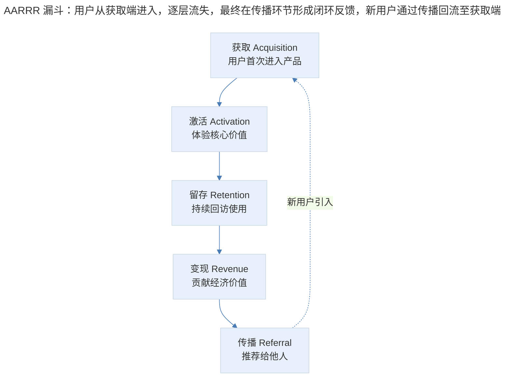
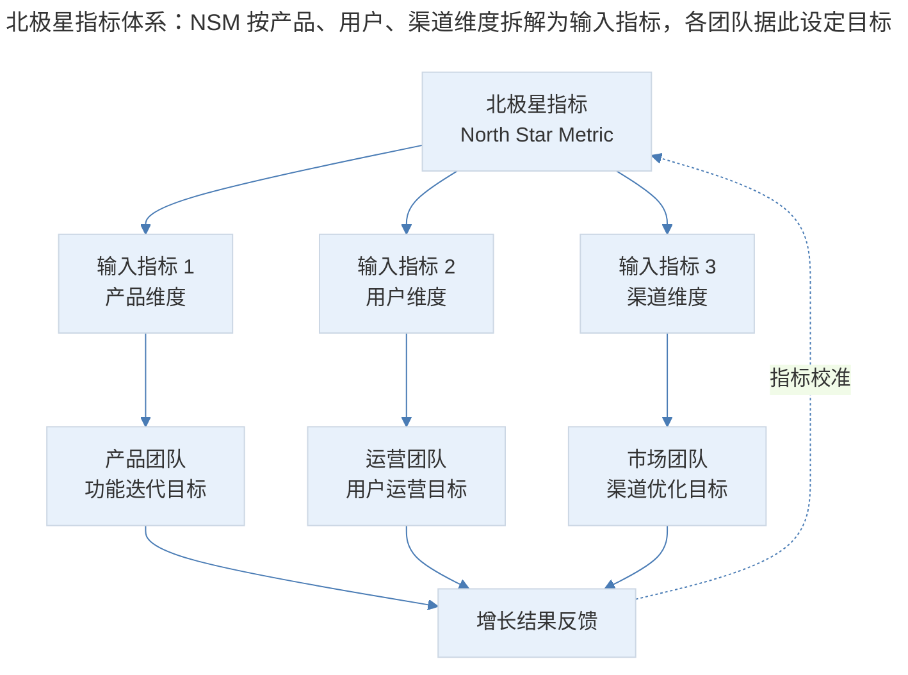

# 增长指标体系：从AARRR到RARRA的框架演进

## 1. 导言

增长指标体系是产品增长实践的基石。在缺乏系统化指标框架的情况下，增长策略往往沦为经验驱动的零散尝试，难以形成可复用的方法论。2007 年，Dave McClure 提出 AARRR 海盗指标（Pirate Metrics）框架，为产品增长提供了首个结构化分析模型。此后十余年间，随着 Product-Led Growth（PLG，产品驱动增长）范式的兴起与留存优先理念的确立，AARRR 框架经历了从优先级重排到 RARRA 的演进，并进一步与 North Star Metric（北极星指标）体系融合，形成了更为完整的增长指标架构。

本文系统梳理 AARRR 与 RARRA 框架的核心逻辑、适用场景与演进路径，并结合 2024-2026 年 AI 驱动的指标追踪技术与 PLG 指标体系，构建面向中高级产品经理的增长指标实践框架。

## 2. 框架解析：从 AARRR 到 RARRA

### 2.1 AARRR：海盗指标的结构化逻辑

AARRR 框架将用户与产品的互动周期分解为五个顺序环节：

| 环节 | 英文 | 定义 | 典型指标 |
|------|------|------|----------|
| 获取 | Acquisition | 用户首次接触并进入产品 | 新增用户数、获客成本（CAC）、渠道转化率 |
| 激活 | Activation | 用户完成关键行为，体验产品核心价值 | 激活率、Aha Moment 达成率、首次关键行为时间 |
| 留存 | Retention | 用户持续回访并重复使用产品 | 次日/7日/30日留存率、留存曲线衰减斜率 |
| 变现 | Revenue | 用户为产品贡献经济价值 | ARPU、付费转化率、客单价 |
| 传播 | Referral | 用户主动向他人推荐产品 | K 因子、邀请转化率、病毒系数 |

AARRR 框架的核心隐喻是漏斗——用户从获取端进入，逐层流失，最终在传播环节形成闭环反馈：


> AARRR 漏斗：用户从获取端进入，逐层流失，最终在传播环节形成闭环反馈，新用户通过传播回流至获取端。

### 2.2 留存的度量方法

留存率的度量并非单一指标，而是根据业务特性选择不同时间窗口与计算口径的组合：

| 留存类型 | 定义 | 计算方式 | 适用场景 |
|----------|------|----------|----------|
| 次日留存 | 新用户次日回访比例 | D1回访用户数 / D0新增用户数 | 高频产品（社交、资讯） |
| 7日留存 | 新用户第7日回访比例 | D7回访用户数 / D0新增用户数 | 中频产品（电商、工具） |
| 30日留存 | 新用户第30日回访比例 | D30回访用户数 / D0新增用户数 | 低频产品（旅行、房产） |
| 周留存曲线 | 按周追踪留存衰减趋势 | 各周回访用户数 / 初始用户数 | 评估留存拐点 |
| 滚动留存 | 任意时间窗口的留存率 | 按行为定义回访，非固定时间窗口 | 行为频率差异大的产品 |

留存曲线的形态是判断产品是否达到 PMF 的关键依据。典型的健康留存曲线呈现"先陡后平"的特征——早期因尝鲜用户流失而快速下降，随后趋于稳定形成平台期。若留存曲线持续下降无拐点，则表明产品尚未实现足够的价值留存。

### 2.3 AARRR 的框架局限

AARRR 框架虽具强通用性，但在实际业务应用中存在以下结构性局限：

1. **时间顺序不等于优先级顺序**：AARRR 按用户旅程排列，但各环节对业务的影响力并不遵循此顺序。大量产品在获取端投入过度资源，却因留存薄弱导致用户如流水般流失。
2. **缺乏指标间的因果建模**：框架描述了环节的先后关系，但未明确各环节指标之间的因果传导机制，容易导致局部优化（Local Optimization）。
3. **未区分业务阶段差异**：初创期产品与成熟期产品的指标优先级截然不同，AARRR 框架本身不提供阶段适配指引。
4. **忽略了产品类型的差异**：B2B SaaS 产品与消费级 App 的增长逻辑存在本质差异，AARRR 框架对此缺乏针对性的调整指导。

### 2.4 RARRA：留存优先的范式转换

RARRA 框架对 AARRR 的环节进行了优先级重排，将留存置于首位：

| 优先级 | RARRA | 核心主张 |
|--------|-------|----------|
| 1 | Retention（留存） | 产品价值验证的基石，留存在则增长有根 |
| 2 | Activation（激活） | 价值传递效率，从流量到用户的关键转化 |
| 3 | Referral（传播） | 用户自发传播是产品价值的最佳证明 |
| 4 | Revenue（变现） | 商业模式验证，在价值确立后追求效率 |
| 5 | Acquisition（获取） | 获客置于末位——先有好产品，再扩大影响 |

RARRA 的优先级逻辑可由以下模型表达：

```mermaid
---
title: RARRA 三阶段模型：先做价值验证（留存+激活），再做价值扩散（传播），最后形成商业闭环（变现+获客）
---
%%{init: {"theme": "base", "themeVariables": {"primaryColor": "#E8F1FB", "lineColor": "#4A7CB5"}}}%%
graph LR
    subgraph 第一阶段：价值验证
        R1["留存 Retention<br/>产品价值金标准"] --> A1["激活 Activation<br/>价值传递枢纽"]
    end
    subgraph 第二阶段：价值扩散
        A1 --> R2["传播 Referral<br/>用户自发推荐"]
    end
    subgraph 第三阶段：商业闭环
        R2 --> V["变现 Revenue<br/>商业模式验证"]
        V --> AC["获取 Acquisition<br/>规模化获客"]
    end
```
> RARRA 三阶段模型：先做价值验证（留存+激活），再做价值扩散（传播），最后形成商业闭环（变现+获客）。

### 2.5 留存作为增长的地基

RARRA 框架的核心论点是：留存是产品生命力和存在价值的金标准。以蓄水池模型类比，新增与传播是注水管，留存则是排水管——若排水管漏水，注水速度再快也无法蓄水。

这一论点在数据层面得到充分验证。贝恩公司的经典研究表明，留存率每提升 5%，利润可提升 25%-95%（Reichheld, 1996）。而 McClure 本人在提出 AARRR 时亦明确指出增长的三步走路径：第一步打造卓越产品（关注激活与留存），第二步推广产品（关注获客与传播），第三步赚钱（关注变现效率）。

留存之后应重点关注激活与传播。激活类似于心理学中的首因效应（Primacy Effect）——用户在陌生状态下首次体验产品的价值感知，决定了其是否愿意再次回访。激活是从流量到用户的关键转化枢纽，激活率每提升一个百分点，意味着留存池的入水口径扩大一个百分点。

传播则是增长黑客故事最常发生的环节。当用户成为产品的宣传员，在分布式社交网络中帮助产品建立更多入口时，获客成本将呈指数级下降。传播与留存共同昭示着用户对产品的喜爱——只有真正认可产品价值的用户，才会持续使用并主动推荐。

以 Readhub 为例，其实践路径遵循 RARRA 逻辑：第一阶段持续迭代产品，提供更卓越的资讯消费体验，关注次日留存与周留存，并利用订阅功能配合提升留存；第二阶段关注传播，通过小程序卡片与 Web 产品内转发等功能，鼓励用户在社交网络上推荐与引用资讯。

### 2.6 AARRR 与 RARRA 的适用场景对比

| 维度 | AARRR | RARRA |
|------|-------|-------|
| 核心理念 | 按用户旅程顺序分析 | 按业务影响力排序执行 |
| 适用阶段 | 成熟期产品、流量充裕场景 | 初创期产品、PMF 验证阶段 |
| 资源配置倾向 | 前端获客优先 | 后端留存优先 |
| 风险偏好 | 适合有充足预算的规模化增长 | 适合资源受限的精益增长 |
| 典型场景 | 电商大促、品牌投放 | 新产品冷启动、PLG 产品 |
| 代表企业 | 传统互联网公司、平台型产品 | Slack、Notion、Figma 等 PLG 产品 |

## 3. 指标锚点：North Star Metric 北极星指标

### 3.1 定义与作用

North Star Metric（NSM，北极星指标）是反映产品核心价值的单一指标，它具备以下特征：

- **反映核心价值**：该指标的提升意味着用户获得了更多产品价值
- **可拆解可行动**：可分解为若干 Input Metric（输入指标），各团队可据此制定行动方案
- **长期导向**：在较长时间周期内保持稳定，不因短期策略波动而频繁变更

Sean Ellis 与 Morgan Brown 在《Hacking Growth》中系统阐述了 NSM 的设定方法论，强调 NSM 应作为全公司对齐增长的唯一锚点（Ellis & Brown, 2017）。

### 3.2 北极星指标框架


> 北极星指标体系：NSM 按产品、用户、渠道维度拆解为输入指标，各团队据此设定目标，增长结果反馈并校准 NSM。

### 3.3 典型 NSM 案例

| 公司 | 北极星指标 | 指标类型 | 价值映射 |
|------|-----------|----------|----------|
| Spotify | 用户收听时长 | 参与度 | 内容消费深度反映产品价值 |
| Airbnb | 预订夜晚数 | 交易量 | 双边市场核心交易完成 |
| WhatsApp | 发送消息数 | 活跃度 | 通讯工具核心使用频率 |
| Slack | 团队日活跃用户发送消息数 | 参与度 | 协作工具核心交互行为 |
| Notion | 周活跃用户创建/编辑页面数 | 参与度 | 知识管理工具核心价值 |

## 4. 范式扩展：PLG 与 AI 驱动的指标体系

### 4.1 PLG 范式的指标特征

Product-Led Growth（PLG，产品驱动增长）是 2020 年代最重要的增长范式之一。PLG 产品的核心特征是产品本身即获客、激活、留存与变现的载体，其指标体系与传统销售驱动模式存在本质差异。

PLG 指标体系的关键构成：

| 指标类别 | 核心指标 | 定义 | 行业基准（2024） |
|----------|----------|------|------------------|
| 获客效率 | CAC（Customer Acquisition Cost） | 获客成本 | PLG 产品 CAC 通常低于销售驱动产品 50%-70% |
| 留存质量 | NRR（Net Revenue Retention） | 净收入留存率 | 优秀 SaaS >120%，顶级 >130% |
| 变现效率 | ARPU（Average Revenue Per User） | 用户平均收入 | 随产品成熟度递增 |
| 传播能力 | K 因子（Viral Coefficient） | 病毒传播系数 | K>1 可实现自传播增长 |
| 产品粘性 | DAU/MAU Ratio | 日月活跃比 | 优秀 >25%，顶级 >50% |
| 转化效率 | Free-to-Paid Conversion | 免费转付费率 | PLG 产品通常 2%-8% |

PLG 指标体系并非替代 AARRR/RARRA，而是在其基础上增加了产品自驱增长的度量维度。在 PLG 模式下，RARRA 的优先级逻辑得到进一步强化——产品必须先实现高留存与高激活，才能依赖产品自身完成获客与传播闭环。

### 4.2 AI 驱动的指标追踪与分析（2024-2026）

2024-2026 年，AI 技术在增长指标领域的应用呈现三大趋势：

**趋势一：自动化指标发现（Automated Metric Discovery）**

传统模式下，关键指标的识别依赖产品经理的经验判断。AI 驱动的指标发现系统可通过分析全量用户行为数据，自动识别与业务结果高度相关的行为指标。Amplitude 的 AI Assistant、Mixpanel 的 Spark 等功能已实现基于机器学习的异常检测与指标推荐。

**趋势二：智能留存分析（Intelligent Retention Analysis）**

AI 模型可自动识别留存曲线中的拐点（Inflection Point），判断产品是否达到 PMF（Product-Market Fit）。例如，通过分析不同用户群组的留存曲线形态，AI 可自动识别高价值用户的行为特征组合，为激活策略提供精准指引。

**趋势三：预测性指标建模（Predictive Metric Modeling）**

基于用户早期行为数据，AI 模型可预测长期留存概率与 LTV（Life Time Value），使产品团队能够在用户生命周期的早期阶段做出干预决策，而非等待留存数据滞后呈现。

### 4.3 主流工具对比

| 工具 | AI 能力 | 核心优势 | 适用场景 |
|------|--------|----------|----------|
| Amplitude | AI Assistant、自动洞察 | 行为分析深度、路径分析 | 中大型产品、PLG 产品 |
| Mixpanel | Spark AI、预测分析 | 实时分析、易用性 | 初创至中型产品 |
| GrowingIO | 智能分析、归因 | 国内生态适配、全量采集 | 国内企业、电商 |
| Heap | 自动采集、AI 洞察 | 无埋点采集、数据完整性 | 数据基建薄弱团队 |
| PostHog | 开源、AI 功能实验 | 成本可控、数据自主 | 技术导向团队 |

## 5. 实践指南：从框架选择到指标落地

### 5.1 框架选择决策

产品经理应根据业务阶段选择指标框架：

| 业务阶段 | 推荐框架 | 核心关注 | 典型 NSM 方向 |
|----------|----------|----------|-------------|
| PMF 验证期 | RARRA | 留存与激活 | 核心行为完成率 |
| 增长期 | AARRR+NSM | 获客效率与留存质量 | 用户增长量×参与度 |
| 成熟期 | AARRR+PLG | 变现效率与 NRR | 收入类指标 |
| 转型期 | RARRA | 重新验证留存 | 新核心行为指标 |

### 5.2 指标体系构建步骤

1. **确定北极星指标**：基于产品核心价值主张，选择反映价值交付的单一指标
2. **拆解输入指标**：将 NSM 按产品、用户、渠道维度拆解为可行动的 Input Metric
3. **映射 AARRR/RARRA 环节**：将输入指标对应至增长漏斗的各环节
4. **建立数据采集体系**：确保各指标的数据采集完整性与准确性
5. **设定基准与目标**：基于行业基准与历史数据设定各指标的目标值
6. **定期校准**：根据业务阶段变化调整指标优先级与目标值

## 6. 进阶延展：增长指标体系的未来趋势

### 6.1 从静态指标到动态指标网络

传统指标体系以静态的漏斗模型为基础，而未来的增长指标体系将向动态指标网络演进。指标之间的因果关系不再是预设的线性链路，而是通过因果推断（Causal Inference）算法实时发现与更新。这一趋势在 2025-2026 年的 AI 分析平台中已初现端倪。

### 6.2 AI Agent 驱动的增长运营

随着 AI Agent 技术的成熟，增长指标的监控、分析与策略响应将部分实现自动化。AI Agent 可 7×24 小时监控指标异常，自动生成分析报告，甚至直接执行低风险的优化策略（如调整推送时机、优化 Onboarding 流程），将产品经理从重复性分析工作中释放，聚焦于策略设计与创意生成。

### 6.3 隐私计算与指标精度平衡

随着全球隐私法规趋严（GDPR、CCPA、中国《个人信息保护法》），用户行为数据的采集面临合规约束。差分隐私（Differential Privacy）与联邦学习（Federated Learning）技术将在增长指标领域得到应用，在保护用户隐私的前提下维持指标分析的精度。

### 6.4 核心要点回顾

从 AARRR 到 RARRA 的演进，本质是从"按用户旅程描述"到"按业务影响力排序"的范式转换。留存作为增长的地基，其优先地位在 PLG 时代得到进一步强化。North Star Metric 体系为增长指标提供了锚点，AI 技术则为指标发现、分析与预测注入了新的能力。中高级产品经理应超越框架本身的形式，理解其背后的优先级逻辑与阶段适配原则，结合业务实际构建可落地的指标体系。

---

## 参考资料

- Ellis, S., & Brown, M. (2017). *Hacking Growth: How Today's Fastest-Growing Companies Drive Breakout Success*. Crown Business.
- McClure, D. (2007). Startup metrics for pirates: AARRR! *500 Startups*. https://www.500.co/startup-metrics-for-pirates-aarrr/
- Reichheld, F. F. (1996). *The Loyalty Effect: The Hidden Force Behind Growth, Profits, and Lasting Value*. Harvard Business School Press.
- Chen, A. (2021). *The Cold Start Problem: How to Start and Scale Network Effects*. Harper Business.
- Reforge. (2024). *Growth Series: Retention + Engagement*. https://www.reforge.com
- OpenView Partners. (2024). *Product-Led Growth Benchmarks Report*. https://openviewpartners.com
- Amplitude. (2025). *North Star Metric Framework Guide*. https://amplitude.com/blog/product-north-star-metric
- Lenny Rachitsky. (2024). *How the best companies think about product metrics*. https://www.lennysnewsletter.com