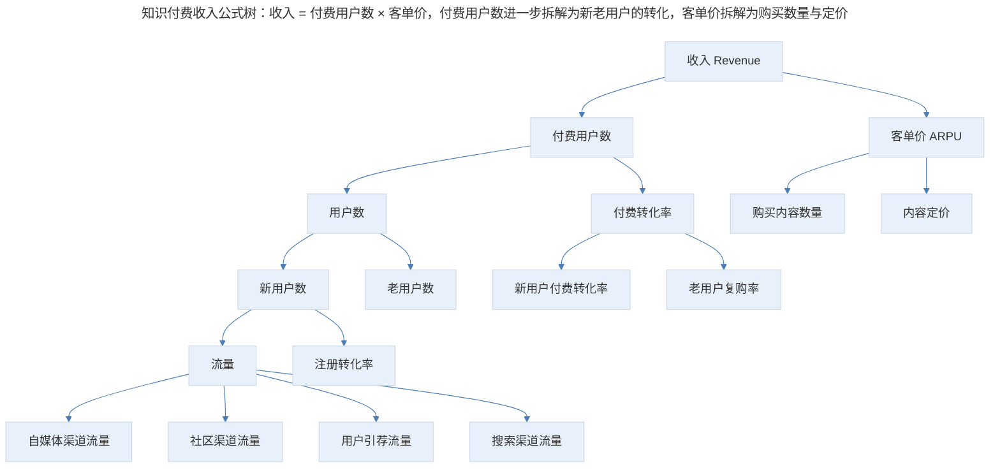
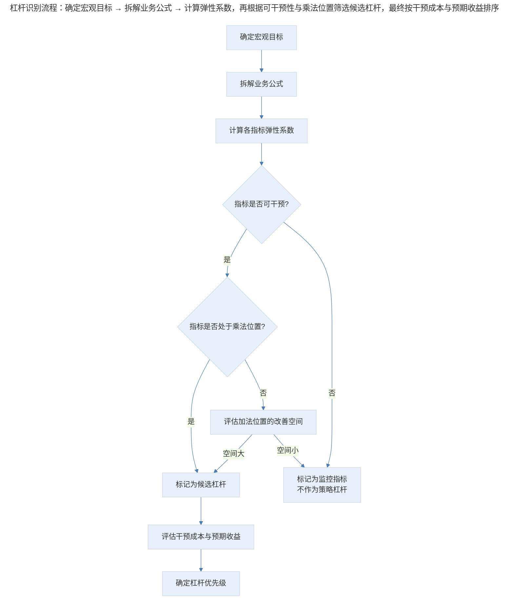

# 业务公式拆解与增长杠杆识别

## 1. 导言

增长指标体系解决了"看什么"的问题，业务公式拆解则解决"怎么看"和"怎么动"的问题。宏观目标（如收入、利润、用户数）是业务健康度的特征码，但无法直接作为策略执行的落脚点。产品经理需要将宏观目标按业务逻辑逐层拆解为可量化、可归因、可行动的指标层级，并从中识别增长杠杆（Growth Leverage）——那些以较小投入撬动整体业务改善的关键支点。

本文系统阐述业务公式拆解的方法论框架、增长杠杆的识别原则，并结合 Unit Economics（单位经济模型）、现代 SaaS 指标体系与 AI 驱动的指标发现技术，构建面向中高级产品经理的实践指南。

## 2. 拆解基础：宏观目标与业务公式

### 2.1 宏观目标的选择

所有增长策略必须基于明确可量化的宏观目标。该目标在较长周期内保持相对稳定，是产品、技术、运营、市场团队的共同方向。常见的宏观目标包括：

| 宏观目标 | 适用场景 | 核心假设 |
|----------|----------|----------|
| 收入 | 商业模式验证期、盈利导向期 | 产品已验证 PMF，商业模式可行 |
| 利润 | 成熟运营期、资本效率导向期 | 收入增长已趋稳，需提升运营效率 |
| 用户数 | 规模化扩张期、网络效应驱动期 | 用户规模与平台价值正相关 |
| 市场占有率 | 竞争激烈期、赢家通吃市场 | 先发优势或规模优势决定终局 |

宏观目标之间存在复杂的关联关系：有时正相关（更多收入支撑更高利润），有时相互矛盾（快速扩张市场份额可能牺牲短期利润）。选择在一定时期内相对稳定的核心目标，能够从源头为策略优先级提供清晰的判断依据。

**时机选择是决定目标正确性的关键变量。** 在应当快速扩张时选择尽快盈利，或在弹尽粮绝之际仍烧钱扩盘，都是典型的战略失误。许多互联网公司的发展路径遵循"先抢用户，再谋收入，后求利润"的三阶段模型，各阶段的目标切换节点需要基于数据而非主观判断做出决策。

### 2.2 业务公式拆解方法论

业务公式拆解的核心原则是：**依据业务逻辑，对宏观指标的构成要素进行逆向推算，直至达到可决策的粒度。** 拆解过程不涉及复杂算法，而是基于对业务运作机制的深度理解。

拆解需遵循以下规则：

1. **完整性（MECE 原则）**：拆解后的子指标之和应等于父指标，无遗漏无重叠
2. **可归因性**：每个子指标的变化可归因到具体的业务动作
3. **可行动性**：拆解到产品/运营团队可执行干预的粒度即止，避免过度拆解
4. **正交性**：子指标之间尽量相互独立，减少共线性干扰

### 2.3 拆解路径与公式树

以知识付费产品的收入拆解为例：

> 知识付费收入公式树：收入 = 付费用户数 × 客单价，付费用户数进一步拆解为新老用户的转化，客单价拆解为购买数量与定价。

对应的数学表达为：

$$\text{收入} = \text{新用户数} \times \text{新用户付费转化率} \times \text{新购客单价} + \text{老用户数} \times \text{复购率} \times \text{复购客单价}$$

进一步展开：

$$\text{收入} = \sum_{i}(\text{渠道}_i\text{流量} \times \text{渠道}_i\text{注册转化率}) \times \text{新用户付费转化率} \times \text{新购客单价} + \text{老用户数} \times \text{复购率} \times \text{复购客单价}$$

### 2.4 多维度拆解策略

同一宏观目标可从不同维度拆解，选择哪条路径取决于业务特征与策略意图：

| 拆解维度 | 公式结构 | 适用场景 | 策略指向 |
|----------|----------|----------|----------|
| 用户生命周期 | 新用户贡献 + 老用户贡献 | 关注用户运营效率 | 新客获取 vs 老客复购 |
| 渠道 | 各渠道收入之和 | 关注渠道 ROI | 渠道预算分配优化 |
| 销售效率 | 人数 × 人效 × 客单价 | ToB 销售驱动产品 | 团队扩张 vs 效率提升 |
| 产品线 | 各产品线收入之和 | 多产品矩阵 | 产品组合策略 |
| 地域 | 各区域收入之和 | 区域化运营 | 区域资源倾斜 |

以 ToB 产品的收入规划为例，从销售效率维度出发：

$$\text{收入} = \text{销售人数} \times \text{人均订单数} \times \text{平均订单金额}$$

继续向下拆解：

$$\text{人均订单数} = \text{销售线索数量} \times \text{线索转化率}$$

$$\text{线索转化率} = f(\text{拜访量}, \text{销售技能}, \text{产品匹配度})$$

拆解至可决策粒度后，策略选择便清晰呈现：加人、提效或涨价，三者之间的权衡可基于数据而非直觉做出判断。

## 3. 经济模型：Unit Economics 与 SaaS 指标

### 3.1 Unit Economics 核心框架

Unit Economics（UE，单位经济模型）是评估商业模式可持续性的基础工具。其核心逻辑是：在单位用户维度上，获取成本与生命周期价值的对比关系决定了商业模式的健康度。

| 核心指标 | 定义 | 计算方式 |
|----------|------|----------|
| CAC（Customer Acquisition Cost） | 获取单个付费用户的成本 | 销售与市场费用 / 新增付费用户数 |
| LTV（Life Time Value） | 单个用户的生命周期总价值 | ARPU × 毛利率 × 用户生命周期 |
| LTV/CAC Ratio | 单位经济效率 | LTV ÷ CAC |
| CAC Payback Period | 获客成本回收周期 | CAC / (ARPU × 毛利率) |

健康度基准：

| 指标 | 健康基准 | 警戒线 | 说明 |
|------|----------|--------|------|
| LTV/CAC | > 3:1 | < 1:1 | 3:1 为 SaaS 行业黄金标准；低于 1:1 意味着每获取一个用户即亏损 |
| CAC Payback Period | < 12 个月 | > 24 个月 | PLG 产品通常 < 6 个月，销售驱动产品可延长至 12-18 个月 |
| 毛利率 | > 70% | < 50% | SaaS 产品因边际成本低，毛利率通常在 70%-85% |

将 Unit Economics 嵌入业务公式拆解体系，可以在不同层级评估策略的经济效率。例如，在渠道维度的拆解中，分别计算各渠道的 LTV/CAC Ratio，即可识别高效率渠道与低效率渠道，为预算分配提供量化依据。

$$\text{渠道}_i\text{效率} = \frac{\text{渠道}_i\text{LTV}}{\text{渠道}_i\text{CAC}}$$

### 3.2 现代 SaaS 指标体系

SaaS（Software as a Service）商业模式的核心特征是订阅制收入，其指标体系与传统一次性交易模式存在本质差异。2024-2026 年，以下指标已成为 SaaS 产品经理的必备知识：

| 指标 | 英文 | 定义 | 重要性 |
|------|------|------|--------|
| ARR | Annual Recurring Revenue | 年度经常性收入 | SaaS 收入核心指标 |
| MRR | Monthly Recurring Revenue | 月度经常性收入 | ARR 的月度拆解 |
| NRR | Net Revenue Retention | 净收入留存率（含扩容与收缩） | 衡量存量用户价值增长能力 |
| GRR | Gross Revenue Retention | 毛收入留存率（不含扩容） | 衡量存量用户流失底线 |
| Logo Churn | 客户数流失率 | 流失客户数 / 期初客户数 | 衡量客户流失严重程度 |
| ARPU | Average Revenue Per User | 用户平均收入 | 衡量变现效率 |

### 3.3 NRR 的特殊地位

NRR（Net Revenue Retention）是 SaaS 商业模式中最重要的单一指标之一。它衡量的是：在不计入新客的情况下，存量用户群体在一年后的收入变化。NRR > 100% 意味着即使不获新客，收入仍在增长——这是 SaaS 商业模式的理想状态。

| NRR 水平 | 含义 | 代表企业 |
|----------|------|----------|
| > 130% | 极强的产品粘性与扩容能力 | Snowflake、Twilio |
| 110%-130% | 健康的扩容-流失平衡 | Salesforce、Datadog |
| 100%-110% | 微弱增长，流失压力较大 | 多数中型 SaaS |
| < 100% | 存量用户收入在收缩 | 需立即解决留存问题 |

将 SaaS 指标体系融入业务公式，收入公式可表达为：

$$\text{ARR}_{t+1} = \text{ARR}_t \times \text{NRR} + \text{新客ARR}$$

进一步拆解新客 ARR：

$$\text{新客ARR} = \text{线索量} \times \text{转化率} \times \text{新客ACV}$$

其中 ACV（Annual Contract Value）为年度合同价值。此公式的结构清晰揭示了增长的三大引擎：存量增长（NRR 驱动）、获客效率与客单价提升。

## 4. 杠杆识别：从公式中发现高价值支点

### 4.1 杠杆的定义与特征

增长杠杆（Growth Leverage）是业务公式中能够以较小变化撬动整体业务显著改善的关键指标。杠杆的本质特征是：

1. **高弹性**：该指标的单位变化能带来宏观目标的显著变化
2. **可干预**：产品/运营团队能够通过具体行动影响该指标
3. **乘数效应**：该指标处于公式的乘法位置，而非加法位置

### 4.2 杠杆识别流程

> 杠杆识别流程：确定宏观目标 → 拆解业务公式 → 计算弹性系数，再根据可干预性与乘法位置筛选候选杠杆，最终按干预成本与预期收益排序。

### 4.3 典型杠杆识别案例

| 产品类型 | 宏观目标 | 关键杠杆 | 杠杆逻辑 |
|----------|----------|----------|----------|
| Uber | 平台 GMV | 用户完成公里数 | 公里数反映双边匹配效率，高完成率驱动司机留存与乘客复购 |
| Facebook | 广告收入 | 用户分享次数与停留时长 | 分享创造内容供给，时长创造广告曝光 |
| 即时通讯工具 | 活跃度 | 人均消息量 | 消息量是通讯工具核心价值，低消息量用户必然流失 |
| 抽奖助手 | 传播效率 | 发起抽奖人次 | 抽奖活动是传播载体，活动量直接决定传播半径 |
| SaaS 产品 | ARR | NRR | NRR > 100% 时存量用户自驱增长，获客投入效率倍增 |

### 4.4 杠杆选择的注意事项

1. **区分因果与相关**：指标与宏观目标的强相关性不等于因果关系。三聚氰胺案例揭示了将特征指标误认为因果杠杆的危险——氮元素含量是牛奶质量的特征，但直接干预该指标（添加三聚氰胺）并未改善牛奶质量，反而造成危害。同理，将反映目标达成度的指标当作目标本身，会导致畸形的业务策略。
2. **关注指标的动态性**：业务阶段变化时，杠杆可能随之迁移。初创期的杠杆通常是激活率或留存率，成长期可能转向获客效率，成熟期则可能聚焦变现效率。
3. **避免局部优化**：杠杆识别应置于整体业务公式的上下文中评估，避免对单一指标的极端追求损害系统整体健康。

## 5. 实践框架：从公式到杠杆的四步法

| 步骤 | 核心任务 | 关键输出 | 常见误区 |
|------|----------|----------|----------|
| 1. 确定目标 | 选定宏观核心目标 | 单一宏观指标+时间周期 | 目标模糊或同时追踪多个目标 |
| 2. 拆解公式 | 按业务逻辑逆向拆解 | 完整的业务公式树 | 拆解维度选择不当或过度拆解 |
| 3. 识别杠杆 | 评估各指标的弹性与可干预性 | 2-3 个优先杠杆 | 将相关关系误判为因果关系 |
| 4. 动态校准 | 定期评估杠杆有效性并调整 | 更新后的杠杆优先级 | 杠杆选择固化，忽视阶段变化 |

## 6. 进阶延展：AI 驱动与未来趋势

### 6.1 AI 驱动的指标发现与杠杆识别（2024-2026）

**自动化弹性分析**：传统杠杆识别依赖产品经理对业务公式的手动拆解与经验判断。AI 技术可自动计算各指标相对于宏观目标的弹性系数，并基于历史数据模拟不同干预场景的预期效果，大幅提升杠杆识别的效率与准确性。

**因果推断辅助**：AI 驱动的因果推断（Causal Inference）工具可帮助区分指标间的相关关系与因果关系。例如，通过 Double Machine Learning 或 Instrumental Variable 方法，AI 系统可自动识别哪些行为指标真正驱动了留存或收入的提升，而非仅仅是伴随出现的相关信号。

**实时杠杆监控**：AI 系统可对已识别的增长杠杆进行实时监控，当杠杆指标出现异常波动时自动告警，并基于历史模式生成初步的原因假设，加速产品团队的问题定位与策略响应。

### 6.2 业务公式拆解的未来趋势

**从静态公式到动态因果图**：传统业务公式是静态的线性结构，而真实的业务系统是动态的非线性网络。2025-2026 年，基于因果发现算法（Causal Discovery）的动态因果图将逐步替代手动拆解的业务公式。系统能够基于数据自动发现指标间的因果结构，并在业务环境变化时自动更新因果图。

**AI Agent 辅助的策略推演**：AI Agent 可在业务公式的基础上进行蒙特卡洛模拟（Monte Carlo Simulation），评估不同干预策略的预期效果分布，为产品经理提供量化的决策支持。这将显著降低增长策略的试错成本，提升策略命中率。

**实时 Unit Economics**：随着数据基础设施的完善，Unit Economics 的计算将从季度/月度批次模式转向实时计算模式。产品经理可实时观测各渠道、各用户群组的 LTV/CAC 变化，实现增长策略的敏捷迭代。

### 6.3 核心要点回顾

业务公式拆解是增长策略从宏观目标到微观行动的桥梁，增长杠杆识别则是从公式中发现高价值干预点的关键能力。产品经理应掌握多维度拆解策略，结合 Unit Economics 与 SaaS 指标体系评估商业模式健康度，并运用因果思维识别真正的增长杠杆而非虚假的相关信号。在 AI 技术的辅助下，杠杆识别的效率与准确性正在快速提升，但业务理解与判断力仍是不可替代的核心能力。

---

## 参考资料

- Ellis, S., & Brown, M. (2017). *Hacking Growth: How Today's Fastest-Growing Companies Drive Breakout Success*. Crown Business.
- Bessembinder, H. (2023). Unit economics and the path to profitability. *Journal of Financial Economics*, 147(1), 1-28.
- Tunguz, T. (2024). *The SaaS Benchmarks Report 2024*. OpenView Partners. https://openviewpartners.com
- Skok, D. (2024). *SaaS Metrics 2.0 — A Guide to Measuring and Improving What Matters*. For Entrepreneurs. https://www.forentrepreneurs.com/saas-metrics/
- Lenny Rachitsky. (2024). *How to find your product's growth levers*. https://www.lennysnewsletter.com
- Reforge. (2024). *Growth Series: Business Model & Unit Economics*. https://www.reforge.com
- Amplitude. (2025). *AI-Powered Product Analytics Guide*. https://amplitude.com
- Pearl, J., & Mackenzie, D. (2018). *The Book of Why: The New Science of Cause and Effect*. Basic Books.