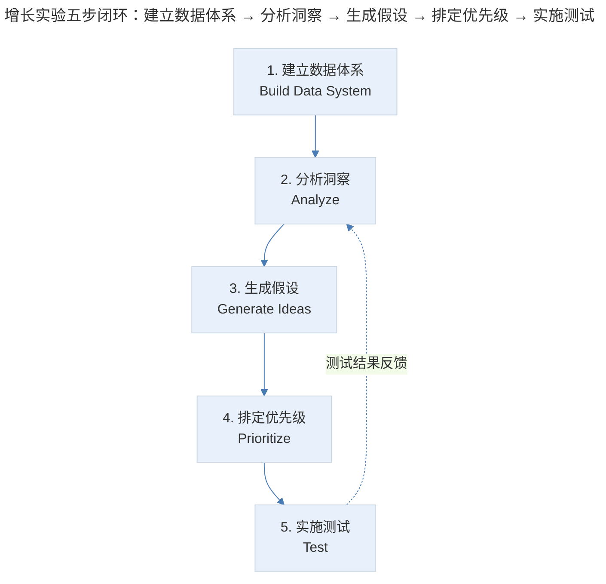
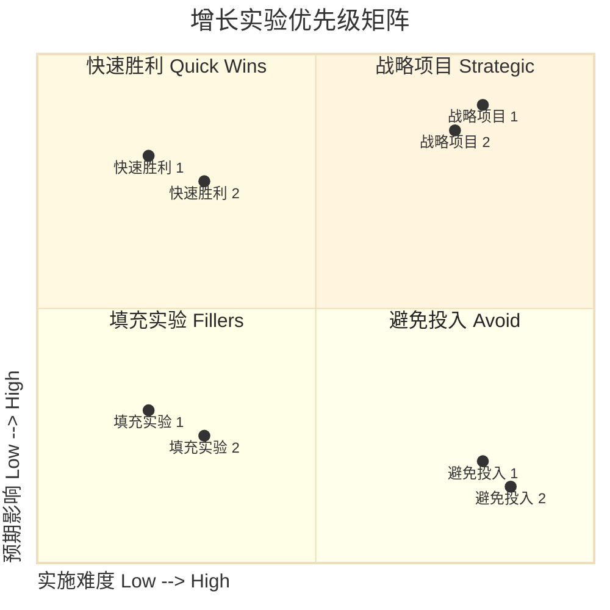
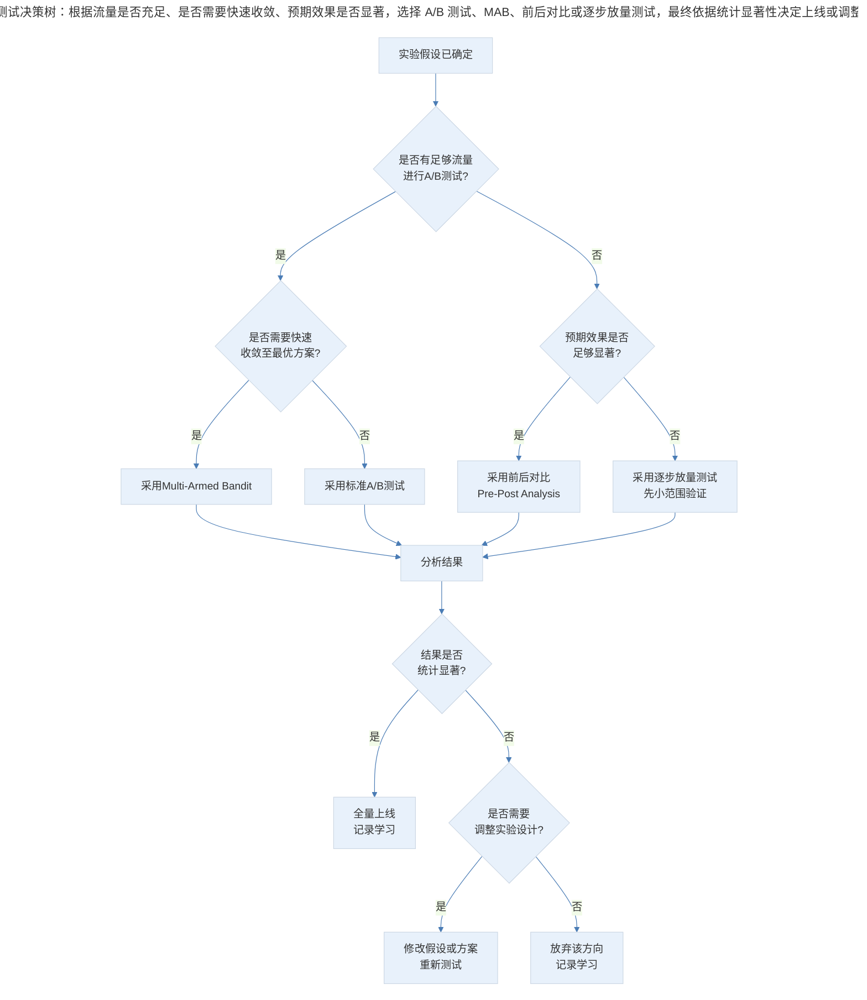

# 增长实验的闭环流程与执行方法论

## 1. 导言

增长领域有一则广为流传的格言："当你在博客或书上看到某一增长策略时，它通常已经过时了。"这并非否定策略的价值，而是强调一个更根本的命题——**增长的核心竞争力不在于具体策略，而在于产生、筛选和验证策略的过程能力。** Dropbox 的邀请获客、Hotmail 的邮件签名传播，这些经典案例看似灵机一动，实则是由一整套系统化实验流程激发、筛选和测试出来的结果。

本文系统阐述增长实验的闭环流程（Build-Measure-Learn Cycle），涵盖数据体系建设、分析框架、假设生成、优先级排序（ICE/RICE 框架）与测试方法论，并结合 2024-2026 年 AI 驱动的实验分析、Multi-Armed Bandit 等前沿实践，构建面向中高级产品经理的增长实验执行体系。

## 2. 闭环概览：增长实验的五步流程

### 2.1 流程定义

增长实验闭环由五个核心步骤构成，循环往复：

> 增长实验五步闭环：建立数据体系 → 分析洞察 → 生成假设 → 排定优先级 → 实施测试，测试结果反馈回分析阶段，形成持续进化的循环。

该闭环与 Eric Ries 提出的 Build-Measure-Learn 循环高度一致（Ries, 2011），但增长实验更强调数据驱动与量化验证。每个循环的输出不仅是策略验证结果，更是下一轮分析的输入，形成持续进化的知识积累。

### 2.2 流程核心原则

| 原则 | 含义 | 反模式 |
|------|------|--------|
| 过程优于策略 | 系统化的实验流程比任何单一策略更有价值 | 迷恋某个"神来之笔"策略 |
| 数据优于直觉 | 所有决策以测试数据为最终裁判 | 凭经验或权威拍板 |
| 速度优于完美 | 快速闭环比完美实验设计更重要 | 过度设计实验，延迟学习 |
| 密度优于广度 | 在一个主题上密集测试，而非分散尝试 | 同时在多个方向浅尝辄止 |

## 3. 前置步骤：数据体系与分析洞察

### 3.1 建立数据体系

增长是一种偏理性的学科，其决策依据是测试的数据结果。没有数据体系，产品与运营团队将处于盲目状态，无法进行有效的增长实验。

数据体系的建设存在从简到繁的层级选择：

| 层级 | 方案 | 优势 | 劣势 | 适用阶段 |
|------|------|------|------|----------|
| L1 | 第三方工具基本功能 + 简单分析 | 快速启动，零开发成本 | 灵活性低，数据深度不足 | 冷启动期 |
| L2 | 第三方工具自定义打点 + 复杂分析 | 灵活性较高，功能丰富 | 数据所有权受限，成本随量增长 | 成长期 |
| L3 | 自有打点策略 + 第三方分析工具 | 数据自主可控，采集灵活 | 开发成本较高 | 扩张期 |
| L4 | 自建数据体系（采集+存储+分析） | 完全自主，深度定制 | 建设周期长，维护成本高 | 成熟期 |

**实践建议**：初期采用第三方工具（如 Amplitude、Mixpanel、GrowingIO）快速搭建基础数据能力，先看到核心指标，再逐步演进至自建体系。避免在数据基建上过度投入而延迟增长实验的启动。

数据采集的关键原则：

1. **事件定义标准化**：统一事件命名规范（如`[对象]_[动作]_[结果]`），避免同一行为在不同模块中命名不一致
2. **属性设计前瞻性**：事件属性应覆盖分析所需的用户维度（渠道、版本、设备等）与业务维度（商品类别、订单金额等）
3. **采集完整性验证**：上线后必须进行数据质量校验，确保事件触发与属性上报的准确性

### 3.2 分析洞察

增长分析服务于两个核心目的：

**目的一：流程诊断（Funnel Diagnosis）**

将业务流程及各分支拆开，辨别每个步骤之间是否存在异常的流失与转化。这是宏观层面的分析，揭示业务流程在哪个阶段出现缺陷。例如：用户有加入购物车的行为，但仅有极小比例进入结算页面——这指向购物车到结算的转化断裂。

**目的二：维度拆解（Dimensional Segmentation）**

将用户按各种维度分组，观察不同维度用户之间的行为差异，识别高价值用户群组的特征组合。例如：已登录用户是否比未登录用户更容易进入结算页？留存用户是否比新用户转化率更高？特定运营商线路的用户是否存在访问异常？

常用分析框架：

| 分析类型 | 方法 | 输出 | 典型工具 |
|----------|------|------|----------|
| 漏斗分析 | 逐步骤转化率计算 | 流程断裂点定位 | Amplitude Funnel |
| 群组分析 | 按时间/行为维度分组对比 | 不同群组的行为差异 | Mixpanel Cohort |
| 路径分析 | 用户行为序列追踪 | 非预期行为路径发现 | Amplitude Pathfinder |
| 留存分析 | N 日留存率与留存曲线 | 产品粘性与价值验证 | GrowingIO Retention |
| 归因分析 | 多触点贡献度计算 | 渠道/触点效果评估 | Google Analytics 360 |

## 4. 中间步骤：假设生成与优先级排序

### 4.1 生成假设

基于分析发现的问题，产品经理需要提出假设——对数据现象的因果解释，并据此提出可能的改善方案。增长是依靠持续的、大量的尝试取胜的，因此假设生成阶段应追求数量与多样性。

每个增长假设应包含以下要素：

| 要素 | 说明 | 示例 |
|------|------|------|
| 目标用户 | 策略针对的用户群组 | 未登录用户 |
| 观察现象 | 数据分析发现的问题 | 未登录用户购物车→结算转化率仅为 5% |
| 因果假设 | 对现象的因果解释 | 未登录用户缺乏信任感，不愿在陌生网站支付 |
| 干预方案 | 具体的产品/运营动作 | 在结算页增加"已有人购买"社会证明 |
| 预期效果 | 量化的预期指标变化 | 购物车→结算转化率提升至 8% |
| 验证指标 | 衡量策略是否有效的数据 | 未登录用户群组的转化率变化 |

**关键原则**：假设必须逻辑清晰、具体可执行。模糊的假设如"改善未登录用户的引导流程"纯属浪费时间。同时，应尽可能对数字做出量化预期，而非笼统地说"某指标会提高"——量化预期有助于排定优先级，也是训练增长策略效果预测能力的过程。

假设生成的常见方法：

| 方法 | 描述 | 适用场景 |
|------|------|----------|
| 数据驱动 | 基于分析发现的数据异常提出假设 | 有数据体系支撑的产品 |
| 用户研究 | 基于用户访谈、反馈提出假设 | 数据不足以解释行为时 |
| 竞品对标 | 基于竞品功能与策略提出假设 | 寻找差异化机会或追赶差距 |
| 框架启发 | 基于 AARRR/RARRA 框架系统性扫描 | 全面审视增长机会 |
| 跨行业借鉴 | 基于其他行业的成功案例提出假设 | 寻求突破性创新 |

### 4.2 排定优先级

**ICE 框架**（Impact, Confidence, Ease）是增长实验最常用的优先级排序框架，由 Sean Ellis 提出（Ellis & Brown, 2017）：

| 维度 | 含义 | 评分标准（1-10） |
|------|------|------------------|
| Impact（影响） | 该实验对目标指标的预期影响程度 | 1=微弱影响，10=颠覆性影响 |
| Confidence（信心） | 对影响预期的信心程度 | 1=纯猜测，10=有充分数据支撑 |
| Ease（难度） | 实施该实验的难易程度（反向评分） | 1=极难实施，10=极容易实施 |

ICE 得分 = Impact × Confidence × Ease，得分越高优先级越高。

**RICE 框架**在 ICE 基础上增加了 Reach 维度，适用于用户规模较大的产品：

| 维度 | 含义 | 评分方式 |
|------|------|----------|
| Reach（覆盖） | 该实验影响的用户数量 | 每周期影响的用户数 |
| Impact（影响） | 对受影响用户的预期影响程度 | 0.25=微小，0.5=中等，1=显著，2=巨大，3=颠覆 |
| Confidence（信心） | 对 Reach 和 Impact 评估的信心 | 100%=高，80%=中，50%=低 |
| Effort（投入） | 实施所需的人月数 | 人月为单位 |

RICE 得分 = (Reach × Impact × Confidence) / Effort

**ICE 与 RICE 对比**：

| 维度 | ICE | RICE |
|------|-----|------|
| 评估维度 | 3 个 | 4 个 |
| 评分方式 | 主观评分（1-10） | 混合评分（定量+定性） |
| 计算复杂度 | 低 | 中 |
| 适用场景 | 小团队、快速排序 | 大团队、需要更精确的量化 |
| 覆盖面考量 | 隐含在 Impact 中 | 独立评估 Reach |
| 投入量化 | Ease 为反向评分 | Effort 为正向量化（人月） |

**优先级矩阵**：优先从代价小、预期效果明确的实验开始，原因有三——快速建立闭环流程、成功时增强团队信心、失败时受挫感较低。随着实验能力的成熟，逐步向高影响高难度的战略项目推进。

> 优先级矩阵按实施难度与预期影响将实验分为四象限：优先做"快速胜利"（低难度高影响），逐步推进"战略项目"，慎做"填充实验"与"避免投入"。

## 5. 落地执行：测试方法论与闭环迭代

### 5.1 测试方法论

增长实验的测试环节存在三种主要方法：

| 方法 | 科学性 | 实施复杂度 | 适用场景 |
|------|--------|------------|----------|
| A/B 测试 | 高 | 中 | 需要精确量化效果的场景 |
| Multi-Armed Bandit | 高 | 高 | 流量有限、需快速收敛的场景 |
| 前后对比（Pre-Post） | 低 | 低 | 预期效果显著、资源受限的场景 |

**A/B 测试**是增长实验的金标准方法。其核心逻辑是：将用户随机分为实验组与对照组，仅对实验组施加干预，通过对比两组的指标差异判断策略效果。

A/B 测试的关键要求：

1. **随机分组**：确保实验组与对照组在所有维度上统计等价
2. **样本量计算**：基于最小可检测效应（MDE）与统计功效（Statistical Power）计算所需样本量
3. **实验周期**：覆盖完整的用户行为周期（通常至少 1-2 周），避免周期效应干扰
4. **单一变量**：每次实验仅改变一个变量，确保因果归因的清晰性
5. **多重比较校正**：同时测试多个指标时，需进行 Bonferroni 校正或 FDR 校正

**测试决策树**：

> 测试决策树：根据流量是否充足、是否需要快速收敛、预期效果是否显著，选择 A/B 测试、MAB、前后对比或逐步放量测试，最终依据统计显著性决定上线或调整。

**Multi-Armed Bandit**（MAB，多臂老虎机）是 A/B 测试的进阶方法，其核心优势在于**在实验过程中动态调整流量分配，将更多流量导向表现更优的方案，从而减少实验期间的"遗憾损失"（Regret）**。

| 对比维度 | A/B 测试 | Multi-Armed Bandit |
|----------|---------|-------------------|
| 流量分配 | 固定比例（如 50:50） | 动态调整，逐步向最优方案倾斜 |
| 实验期间收益 | 低（一半流量在次优方案） | 高（逐步集中流量至最优方案） |
| 收敛速度 | 需要预设实验周期 | 自适应收敛 |
| 统计严谨性 | 高（严格的假设检验） | 中（探索与利用的权衡） |
| 适用场景 | 需要严格统计结论 | 流量有限、需快速决策 |

2024-2026 年，主流实验平台（如 Optimizely、LaunchDarkly、Statsig）已将 MAB 算法作为标准功能提供，产品经理无需自建算法即可使用。

### 5.2 闭环迭代：从测试到学习

每个增长实验的结果可归入以下三类：

| 结果类型 | 含义 | 后续行动 |
|----------|------|----------|
| 验证成功 | 指标显著改善，假设成立 | 全量上线，基于新数据进入下一轮分析 |
| 验证失败 | 指标无显著变化或恶化，假设不成立 | 记录学习，调整假设或放弃方向 |
| 意外发现 | 出现预期之外的指标变化 | 深入分析意外发现，可能开启新的增长方向 |

每个实验应记录以下信息，形成可检索的知识库：

- **实验编号与名称**
- **假设描述**（含量化预期）
- **实验设计**（分组方式、样本量、实验周期）
- **结果数据**（核心指标变化、统计显著性）
- **结论与学习**（假设是否成立、意外发现）
- **后续行动**（全量上线/调整/放弃）

迭代节奏应与业务特性匹配：

| 产品类型 | 建议迭代周期 | 实验并行数 | 说明 |
|----------|-------------|------------|------|
| 消费级 App | 1-2 周 | 3-5 个 | 流量大，可快速获得统计显著结果 |
| B2B SaaS | 2-4 周 | 1-3 个 | 流量有限，需更长周期积累样本 |
| 电商平台 | 1 周 | 5-10 个 | 流量充裕，可高频迭代 |
| 社交产品 | 1-2 周 | 3-5 个 | 需考虑网络效应的溢出影响 |

## 6. 进阶延展：AI 驱动与未来趋势

### 6.1 AI 驱动的增长实验（2024-2026）

**AI 辅助的假设生成**：AI 大语言模型可基于数据分析报告自动生成增长假设，显著提升假设生成的效率与多样性。产品经理可将分析发现的数据异常输入 AI 系统，获得多个可能的因果解释与干预方案，再由人工筛选与完善。

**AI 驱动的实验分析**：传统 A/B 测试分析依赖人工计算统计显著性与效应量。AI 驱动的实验分析工具可自动完成以下工作：

1. **自动检测统计显著性**：实时监控实验数据，当达到统计显著时自动通知
2. **异质性处理效应分析（HTE）**：自动识别实验效果在不同用户群组中的差异，发现"隐藏的赢家"
3. **实验干扰检测**：识别实验组与对照组之间的溢出效应（Spillover Effect）与网络效应干扰

**自适应实验平台**：2024-2026 年，自适应实验平台（Adaptive Experimentation Platform）成为前沿趋势。这类平台结合了 MAB 算法与贝叶斯优化（Bayesian Optimization），能够在实验过程中自动调整流量分配、同时优化多个指标、自动识别最优参数组合。代表性平台包括 Statsig、Eppo、VWO 等。

AI 实验工具对比：

| 工具 | AI 能力 | 核心优势 | 适用场景 |
|------|--------|----------|----------|
| Statsig | 自适应实验、自动分析 | MAB、多层门控 | 技术导向团队 |
| Eppo | 因果推断、HTE 分析 | 统计严谨性 | 数据驱动型组织 |
| Optimizely | AI 推荐、MAB | 功能全面、企业级 | 大型企业 |
| LaunchDarkly | Feature Flag + 实验 | 发布与实验一体化 | DevOps 成熟团队 |
| VWO | AI 辅助测试设计 | 易用性、可视化编辑 | 非技术团队 |

### 6.2 增长实验的执行清单

**实验启动前**：

- [ ] 数据体系已就绪，核心指标可追踪
- [ ] 宏观目标与增长杠杆已明确
- [ ] 实验假设已按标准格式书写
- [ ] ICE/RICE 评分已完成
- [ ] 样本量与实验周期已计算

**实验执行中**：

- [ ] 实验分组随机性已验证
- [ ] 数据采集完整性已确认
- [ ] 实验过程未被外部因素干扰
- [ ] 中期数据检查（避免过早停止或过度等待）

**实验结束后**：

- [ ] 统计显著性已确认（p < 0.05 或贝叶斯后验概率 > 95%）
- [ ] 效应量已计算（不仅是统计显著，还需业务显著）
- [ ] 异质性分析已完成（不同群组的效果差异）
- [ ] 实验文档已归档
- [ ] 后续行动已确定并排入迭代计划

### 6.3 增长实验的未来趋势

**从 A/B 测试到 AI 生成实验**：随着 AI Agent 技术的成熟，增长实验的假设生成、方案设计与结果分析将部分实现自动化。AI Agent 可基于数据异常自动提出假设、设计实验方案、监控实验过程并生成分析报告，产品经理的角色将从执行者转向审核者与策略制定者。

**因果推断的普及化**：传统 A/B 测试在流量有限或实验成本高昂的场景下难以实施。因果推断方法（如 Difference-in-Differences、Synthetic Control、Regression Discontinuity）可在不具备随机实验条件时，基于观测数据估计因果效应。2025-2026 年，这些方法正通过工具化平台向产品经理普及。

**合成控制与数字孪生**：合成控制法（Synthetic Control Method）与数字孪生（Digital Twin）技术将在增长实验领域得到应用。通过构建与实验组高度相似的"合成对照组"，可在不具备真实对照组的情况下评估策略效果，大幅扩展可实验的场景范围。

**隐私保护下的实验设计**：随着隐私法规趋严，传统的用户级随机分组实验面临合规挑战。差分隐私（Differential Privacy）与聚合级实验设计（Aggregate-Level Experimentation）将成为增长实验的新范式，在保护用户隐私的前提下维持实验的科学性。

### 6.4 核心要点回顾

增长实验的闭环流程——建立数据体系、分析洞察、生成假设、排定优先级、实施测试——是增长实践的核心引擎。有效的增长策略不是灵机一动的产物，而是在这一闭环的持续迭代中涌现的结果。产品经理应建立系统化的实验流程，运用 ICE/RICE 框架科学排序，以 A/B 测试与 Multi-Armed Bandit 方法严谨验证，并将每次实验的学习沉淀为组织知识。在 AI 技术的辅助下，实验的效率与精度正在快速提升，但提出好假设的能力与对业务逻辑的深度理解，仍是产品经理不可替代的核心竞争力。

---

## 参考资料

- Ries, E. (2011). *The Lean Startup: How Today's Entrepreneurs Use Continuous Innovation to Create Radically Successful Businesses*. Crown Business.
- Ellis, S., & Brown, M. (2017). *Hacking Growth: How Today's Fastest-Growing Companies Drive Breakout Success*. Crown Business.
- Kohavi, R., Tang, D., & Xu, Y. (2020). *Trustworthy Online Controlled Experiments: A Practical Guide to A/B Testing*. Cambridge University Press.
- Agrawal, R., & Goyal, N. (2012). Analysis of Thompson sampling for the multi-armed bandit problem. *Conference on Learning Theory (COLT)*, JMLR Workshop and Conference Proceedings.
- Dmitriev, P., Gupta, S., Kim, D. W., & Vaz, G. (2017). A dirty dozen: Twelve common metric interpretation pitfalls in online controlled experiments. *Proceedings of the 23rd ACM SIGKDD International Conference on Knowledge Discovery and Data Mining*.
- Statsig. (2025). *Adaptive Experimentation with Multi-Armed Bandits*. https://www.statsig.com
- Eppo. (2025). *Causal Inference for Product Experimentation*. https://www.eppo.io
- Reforge. (2024). *Experimentation Series: Advanced Testing Methodologies*. https://www.reforge.com
- Lenny Rachitsky. (2024). *The state of product experimentation in 2024*. https://www.lennysnewsletter.com
- Athey, S., & Imbens, G. W. (2017). The econometrics of randomized experiments. In *Handbook of Economic Field Experiments* (Vol. 1, pp. 73-140). North-Holland.