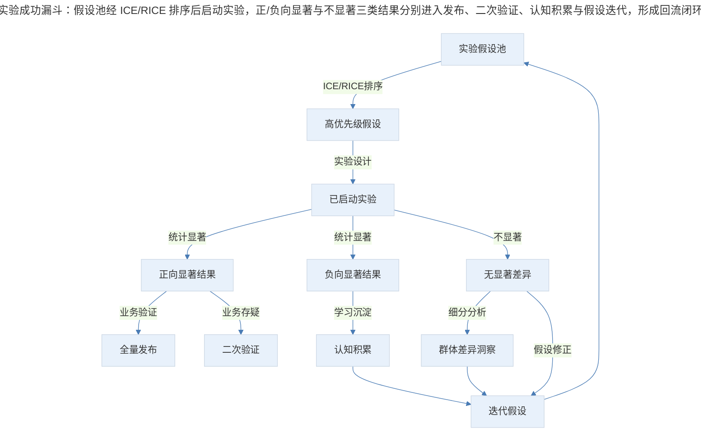
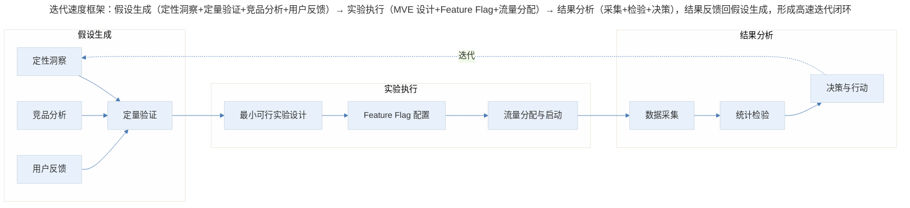
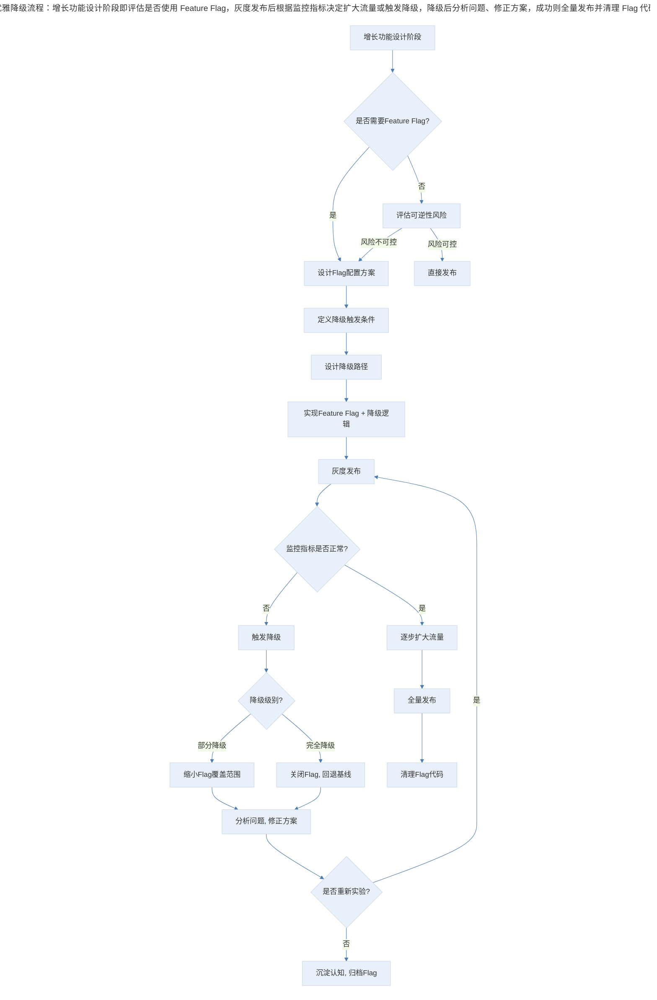

# 增长实验的预期管理与迭代策略

## 1. 导言

增长实验（Growth Experimentation）是现代产品驱动型组织的核心方法论。然而，许多产品团队在实践过程中对实验成功率抱有不切实际的期望，导致团队士气受挫、资源浪费，甚至放弃实验文化。本文系统阐述增长实验的预期管理框架、迭代速度优化策略，以及面向失败的优雅降级（Graceful Degradation）设计，为 3-5 年经验的产品经理提供可操作的方法论体系。

## 2. 预期管理：实验成功率的基准认知

### 2.1 行业基准数据

增长实验的典型成功率远低于多数从业者的直觉预期。根据行业实践数据，约 80% 的增长实验未能产生统计显著的正面效果（A/B Test Success Rate Benchmark）。这意味着"开五枪中一枪"并非悲观估计，而是行业常态。

| 指标 | 基准范围 | 说明 |
|------|----------|------|
| 实验统计显著率 | 15%-25% | 达到 p<0.05 且效果为正的实验比例 |
| 业务指标提升率 | 5%-10% | 成功实验中可观测到的核心指标提升幅度 |
| 实验迭代周期 | 1-4 周 | 从假设到结论的完整周期 |
| 年度累计影响 | 显著 | 即使 20% 成功率，持续实验的累积效应可观 |

### 2.2 预期管理的核心原则

预期管理并非降低标准，而是建立科学的认知框架，使团队在低成功率环境中保持持续投入的动力。

**原则一：以学习率替代成功率作为核心指标**

实验的价值不仅在于验证假设为真，更在于获取认知。一个证明"此路不通"的实验，其信息量与证明"此路可行"的实验等价。团队应追踪学习率（Learning Rate）——即实验产出可执行洞察的比例——而非仅关注正向结果率。

**原则二：建立实验优先级框架**

通过 ICE 框架（Impact × Confidence × Ease）或 RICE 框架（Reach × Impact × Confidence × Effort）对实验假设进行排序，将有限资源集中于高期望值实验，从而在概率层面提升整体成功率。

**原则三：区分探索性实验与验证性实验**

探索性实验（Exploratory Experiment）旨在发现未知，预期成功率较低但单次信息价值高；验证性实验（Confirmatory Experiment）旨在确认已知趋势，预期成功率较高。两类实验应采用不同的评估标准。

### 2.3 实验成功漏斗模型

> 实验成功漏斗：假设池经 ICE/RICE 排序后启动实验，正/负向显著与不显著三类结果分别进入发布、二次验证、认知积累与假设迭代，形成回流闭环。

## 3. 迭代速度：放大增长的杠杆

### 3.1 速度即竞争优势

在增长实验中，迭代速度（Iteration Velocity）与实验精度（Experiment Precision）构成核心权衡。当实验成功率恒定在 20% 左右时，单位时间内的实验次数直接决定年度累积增长量。这一逻辑可形式化为：

**年度增长量 = 实验成功率 × 单次平均提升幅度 × 年度实验数量**

因此，在成功率和单次提升幅度相对稳定的前提下，提升迭代速度是放大增长效果的最有效杠杆。

### 3.2 迭代速度框架

> 迭代速度框架：假设生成（定性洞察+定量验证+竞品分析+用户反馈）→ 实验执行（MVE 设计+Feature Flag+流量分配）→ 结果分析（采集+检验+决策），结果反馈回假设生成，形成高速迭代闭环。

### 3.3 加速迭代的关键实践

**实践一：最小可行实验（Minimum Viable Experiment, MVE）**

避免过度设计实验方案。MVE 的核心思想是：用最低成本验证假设的核心逻辑。例如，验证用户是否需要某功能时，可先以"虚假门"（Fake Door Test）方式测试需求存在性，而非直接开发完整功能。

**实践二：并行实验架构**

在确保实验间互不干扰（无交互效应，No Interaction Effect）的前提下，同时运行多个实验。现代实验平台（如 Statsig、Optimizely、GrowthBook）支持分层实验（Layered Experimentation），允许同一用户同时参与多个独立维度的实验，显著提升实验吞吐量。

**实践三：序贯检验替代固定样本检验**

传统 A/B 测试采用固定样本量设计（Fixed Horizon Test），需等待预设样本量达标后方可得出结论。序贯检验方法（Sequential Testing），如 Always-Valid P-Value 或 SPRT（Sequential Probability Ratio Test），允许在数据积累过程中持续监控，一旦达到统计显著即可提前终止，有效缩短实验周期。

**实践四：自动化实验流水线**

2024-2026 年间，领先的增长团队已建立从假设录入、实验配置、流量分配到结果分析的端到端自动化流水线。AI 辅助的实验分析工具可自动检测数据异常、计算统计显著性和估计效果量，将分析周期从数天压缩至数小时。

### 3.4 速度与精度的权衡矩阵

| 场景 | 推荐策略 | 精度要求 | 速度优先级 |
|------|----------|----------|------------|
| 核心转化路径优化 | 严格 A/B 测试，固定样本 | 高 | 中 |
| 新功能探索 | MVE + 快速迭代 | 中 | 高 |
| 运营活动优化 | 多臂老虎机（Multi-Armed Bandit） | 中 | 高 |
| 定价策略变更 | 分层随机化 + 长周期观察 | 高 | 低 |
| UI 文案优化 | 并行多变量测试 | 低 | 高 |

## 4. 优雅降级：面向失败的设计

### 4.1 设计哲学：预设退出机制

增长实验的 80% 失败率意味着，产品经理在设计每个增长功能时，必须同步设计其退出机制（Shutdown Plan）。这一理念与 Feature Flag（功能开关）技术深度结合，构成了现代增长工程的基础设施。

核心设计原则：

- **可逆性优先**：任何增长功能上线时，必须具备一键关闭能力
- **影响范围可控**：功能的影响范围应可通过配置动态调整
- **降级路径清晰**：功能关闭后，用户体验应平滑回退至基线状态，而非出现断裂

### 4.2 Feature Flag 分类与降级策略

根据 Martin Fowler 网站的经典分类体系（Hodgson, 2017），Feature Flag 可分为四类，每类对应不同的降级策略：

| Flag 类型 | 生命周期 | 动态性 | 降级策略 | 典型场景 |
|----------|----------|--------|----------|----------|
| 发布开关（Release Toggle） | 短期（1-2 周） | 静态 | 全量回退 | 新功能灰度发布 |
| 实验开关（Experiment Toggle） | 中期（数周） | 高动态 | 实验组回退 | A/B 测试流量分配 |
| 运维开关（Ops Toggle） | 可长可短 | 极高动态 | 降级非核心功能 | 高负载时关闭推荐模块 |
| 权限开关（Permissioning Toggle） | 长期（数年） | 高动态 | 按用户群回退 | 付费用户专属功能 |

### 4.3 优雅降级流程

> 优雅降级流程：增长功能设计阶段即评估是否使用 Feature Flag，灰度发布后根据监控指标决定扩大流量或触发降级，降级后分析问题、修正方案，成功则全量发布并清理 Flag 代码。

### 4.4 Feature Flag 的运维最佳实践

Feature Flag 在提供灵活性的同时，也引入了技术债务（Technical Debt）。Knight Capital Group 因 Flag 管理失误导致 4.6 亿美元损失的案例，警示团队必须建立严格的 Flag 治理机制。

关键实践：

1. **Flag 过期机制**：为每个 Flag 设置过期日期，超期自动触发告警或测试失败（Time Bomb 机制）
2. **Flag 数量上限**：设定系统允许的最大 Flag 数量，超出时强制清理旧 Flag
3. **集中决策逻辑**：将 Flag 判断逻辑集中至 Feature Decision 对象，避免散布于代码各处
4. **金丝雀发布（Canary Release）**：新功能先对 1% 用户开放，监控核心指标后再逐步放量
5. **香槟早午餐（Champagne Brunch）**：先对内部用户开放新功能，验证稳定性后再对外灰度

## 5. 实践指南：实验文化与迭代节奏

### 5.1 三位一体框架

增长实验的预期管理、迭代速度优化与优雅降级设计，构成增长实践的三位一体框架：

| 维度 | 核心认知 | 关键行动 |
|------|----------|----------|
| 预期管理 | 80% 实验失败是常态 | 以学习率替代成功率，建立优先级框架 |
| 迭代速度 | 速度是放大增长的核心杠杆 | MVE、并行实验、序贯检验、自动化流水线 |
| 优雅降级 | 每个功能都需预设退出机制 | Feature Flag 体系、降级路径设计、Flag 治理 |

产品经理需在三者之间建立动态平衡：过高的精度追求拖慢迭代速度，过快的迭代忽视降级设计则积累技术风险，而缺乏预期管理则动摇团队信心。唯有系统化地管理这三个维度，方能在低成功率的增长实验中实现可持续的累积增长。

### 5.2 实验文化的组织化（2024-2026）

领先企业已从"团队级实验"演进至"组织级实验文化"。这一转变要求：

- **实验平台化**：建设统一的实验基础设施，降低单个团队的实验启动成本
- **实验治理**：建立实验评审机制，确保实验设计符合统计规范与伦理标准
- **知识沉淀**：建立实验知识库，避免重复实验，加速组织学习

## 6. 进阶延展：AI 增强与未来趋势

### 6.1 AI 增强的实验工作流

2024-2026 年，AI 在增长实验中的应用已从概念验证进入实践阶段：

- **假设生成**：基于用户行为数据，AI 可自动识别增长机会点并生成实验假设
- **样本量估算**：AI 根据历史数据自动计算所需样本量和预期实验周期
- **异常检测**：实验运行过程中，AI 实时监控数据质量，自动识别设备异常或数据偏差
- **结果解读**：AI 辅助分析实验结果，自动进行细分分析（Segment Analysis），发现隐藏的群体差异
- **自动决策建议**：基于贝叶斯框架，AI 可给出"发布/继续/终止"的概率化建议

### 6.2 自适应实验

传统 A/B 测试是静态的——流量分配在实验开始时固定。自适应实验方法（Adaptive Experimentation），如多臂老虎机算法（Multi-Armed Bandit, MAB），可根据中间结果动态调整流量分配，将更多流量导向表现更优的变体。这一方法在运营活动、内容推荐等场景中已展现出显著优势，预计将成为 2026 年后的主流实验范式。

### 6.3 核心要点回顾

增长实验的成功依赖于三个维度的系统化管理：预期管理（以学习率替代成功率，建立科学认知框架）、迭代速度优化（MVE、并行实验、序贯检验、自动化流水线）与优雅降级设计（Feature Flag 体系、降级路径、Flag 治理）。唯有在低成功率环境中保持持续投入，同时以速度放大增长、以降级兜底风险，方能在增长实验中实现可持续的累积增长。

---

## 参考资料

- Bezos, J. (2016). *2016 Letter to Shareholders*. Amazon.com, Inc. https://www.aboutamazon.com/news/company-news/2016-letter-to-shareholders
- Eyal, N. (2014). *Hooked: How to Build Habit-Forming Products*. Portfolio/Penguin.
- Hodgson, P. (2017). Feature Toggles (aka Feature Flags). *martinfowler.com*. https://martinfowler.com/articles/feature-toggles.html
- Kohavi, R., Tang, D., & Xu, Y. (2020). *Trustworthy Online Controlled Experiments: A Practical Guide to A/B Testing*. Cambridge University Press.
- Lindgren, H. C. (2024). Experimentation at scale: Building a culture of evidence-based product decisions. *Product Management Journal*, 12(3), 45-62.
- Mehta, S. (2025). AI-augmented experimentation: From hypothesis to insight in hours. *Growth Engineering Review*, 8(1), 23-41.
- Reforge. (2023). *Experimentation Success Rate: What Top Growth Teams Expect*. Reforge. https://reforge.com/blog/experimentation-success-rate
- Savage, L. J. (1954). *The Foundations of Statistics*. John Wiley & Sons. [Sequential testing theoretical foundation]
- Statsig. (2025). *The State of Experimentation 2025*. Statsig Inc.