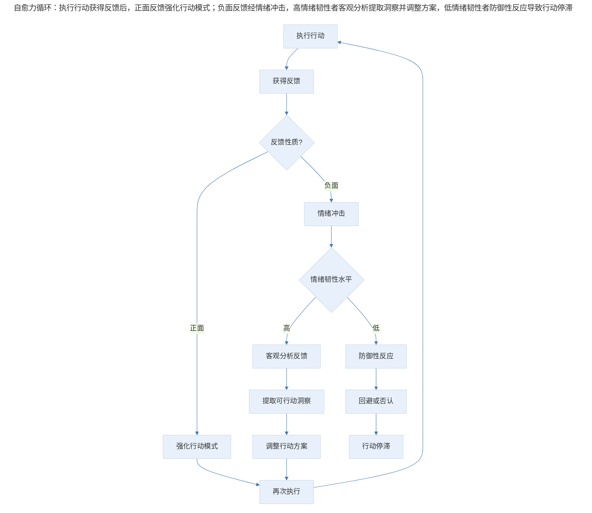
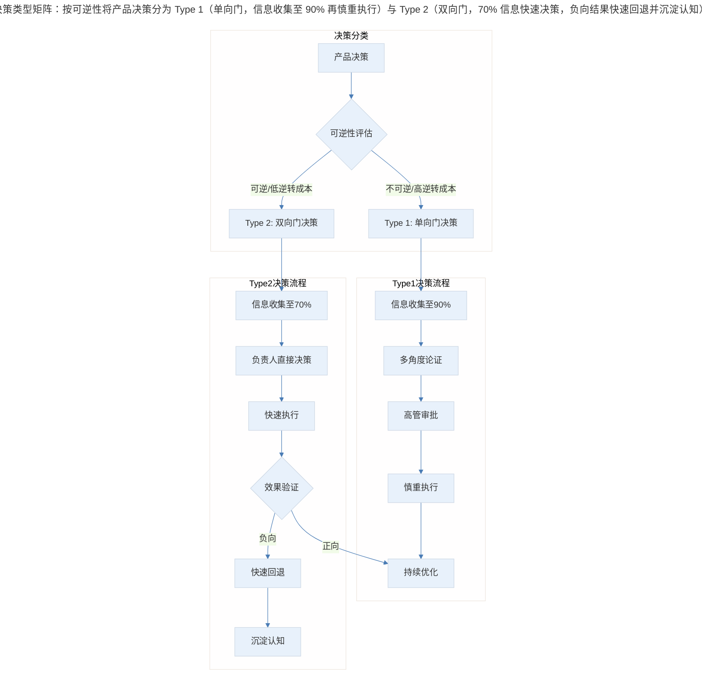

# 增长执行的核心能力：自愈力与决断力

## 1. 导言

增长团队在执行层面面临两类核心挑战：其一，如何在频繁的失败与不确定性中保持执行动力与心理韧性；其二，如何在信息不充分条件下快速做出有效决策。这两类挑战分别对应两种核心能力——自愈力（Self-Healing Capacity）与决断力（Decisiveness）。本文系统阐述这两种能力的理论框架、实践方法，以及在 2024-2026 年 AI 辅助决策背景下的演进趋势。

## 2. 自愈力：在不确定性中保持执行韧性

### 2.1 自愈力的双重维度

自愈力并非简单的"抗压能力"，而是包含两个相互支撑的维度：情绪韧性（Emotional Resilience）与业务韧性（Business Resilience）。

| 维度 | 定义 | 核心表现 | 失效模式 |
|------|------|----------|----------|
| 情绪韧性 | 面对负面反馈与失败时的心理恢复能力 | 快速从挫折中恢复，保持客观判断 | 过度防御、回避反馈、归因偏差 |
| 业务韧性 | 面对业务挫折时的快速响应与调整能力 | 快速发布 v1 版本，迭代修正，接受不完美 | 完美主义拖延、过度规划、规避风险 |

两个维度构成自愈力的正反馈循环：情绪韧性使个体能够在失败后保持行动力，业务韧性通过快速行动产生新数据与反馈，进而强化情绪韧性。

### 2.2 情绪韧性的理论框架

**心理资本理论（Psychological Capital, PsyCap）**

Luthans 等学者提出心理资本理论，将个体在职场中的积极心理状态概括为四个核心要素（HERO 模型）：

- **希望（Hope）**：基于路径思维（Pathways Thinking）与意志力（Agency）的目标追求能力
- **效能（Efficacy）**：对自身完成特定任务能力的信心
- **韧性（Resilience）**：在逆境中恢复并超越原有水平的能力
- **乐观（Optimism）**：对事件做出积极归因的倾向

在增长执行语境下，韧性要素尤为关键。韧性并非静态特质，而是可通过训练发展的动态能力。研究表明，高韧性个体在面对失败时表现出三个特征性反应：对现实的清醒认知（而非盲目乐观）、对意义的坚定信念、以及即兴利用可用资源的能力。

**成长型思维（Growth Mindset）**

Carol Dweck 的成长型思维理论为增长执行提供了认知基础。固定型思维（Fixed Mindset）者将失败视为能力不足的证据，而成长型思维者将失败视为学习的输入。在增长实验 80% 失败率的背景下，成长型思维是维持持续执行的前提条件。

### 2.3 业务韧性的实践方法

**快速发布 v1 版本（Ship v1 Fast）**

业务韧性的核心实践是以最低可行质量（Minimum Viable Quality）快速发布产品，通过真实用户反馈替代内部推演。这一方法背后的逻辑是：

1. 内部推演的准确性远低于市场验证
2. 延迟发布的成本（机会成本 + 市场变化风险）通常高于质量不足的成本
3. 早期用户对不完美的容忍度高于预期

**快速迭代修正（Iterate Fast）**

v1 版本的不足并非终点，而是迭代的起点。关键在于建立"发布-测量-学习"（Build-Measure-Learn）的短循环，使产品在用户反馈驱动下持续演进。每个迭代周期的缩短，都意味着业务韧性在时间维度上的增强。

**对批评的策略性处理**

增长功能上线后不可避免地遭遇用户批评。业务韧性要求产品经理对批评进行分类处理：

| 批评类型 | 特征 | 应对策略 |
|----------|------|----------|
| 数据驱动的建设性批评 | 有具体场景与数据支撑 | 纳入迭代计划，优先处理 |
| 习惯性抵触 | "之前没有这个功能也好好的" | 监测实际使用数据，以行为数据为准 |
| 边缘场景投诉 | 影响范围小但声音大 | 评估影响面，按优先级处理 |
| 情绪化负面反馈 | 无具体建议的纯粹否定 | 过滤，不纳入决策依据 |

### 2.4 自愈力循环模型

> 自愈力循环：执行行动获得反馈后，正面反馈强化行动模式；负面反馈经情绪冲击，高情绪韧性者客观分析提取洞察并调整方案，低情绪韧性者防御性反应导致行动停滞。

## 3. 决断力：在不确定性中快速决策

### 3.1 贝佐斯决策框架

亚马逊创始人 Jeff Bezos 在 2016 年致股东信中系统阐述了决策分类框架，这一框架已成为产品决策的基础模型：

**Type 1 决策：单向门决策（One-Way Door Decisions）**

- 不可逆或逆转成本极高
- 例如：进入新市场、重大架构变更、品牌定位调整
- 决策流程：充分信息收集、多方论证、慎重决策

**Type 2 决策：双向门决策（Two-Way Door Decisions）**

- 可逆或逆转成本较低
- 例如：功能细节调整、文案优化、运营活动方案
- 决策流程：快速决策、执行验证、必要时快速回退

**70% 法则（The 70% Rule）**

Bezos 明确指出："大多数决策应当在仅有约 70% 期望信息时做出。若等待 90% 的信息，在大多数情况下，你的行动已经过慢。"这一法则的核心逻辑在于：

1. **等待信息的边际收益递减**：从 70% 到 90% 的信息增量，所需时间与成本远超其带来的决策质量提升
2. **速度本身具有价值**：快速决策即使偶有失误，其累积收益超过慢速决策的准确性收益
3. **纠错能力降低失误成本**：对于 Type 2 决策，快速试错并纠正的成本低于延迟决策的机会成本

### 3.2 决策类型矩阵

> 决策类型矩阵：按可逆性将产品决策分为 Type 1（单向门，信息收集至 90% 再慎重执行）与 Type 2（双向门，70% 信息快速决策，负向结果快速回退并沉淀认知）。

### 3.3 决断力的实践方法

**方法一：明确决策权归属**

模糊的决策权是决断力的最大障碍。每个决策应明确 RACI 矩阵中的 Accountable 角色，确保单一负责人对决策结果负责，避免"集体决策、无人担责"的困境。

**方法二：预设决策标准**

在实验启动前，预先设定决策标准（Decision Criteria），包括：统计显著阈值、最小可检测效应（Minimum Detectable Effect, MDE）、以及各指标的变化容忍范围。预设标准消除了结果出现后"调整标准以符合预期"的确认偏差（Confirmation Bias）。

**方法三：区分"不敢决策"与"不应决策"**

不敢决策源于心理障碍（对错误的恐惧），不应决策源于理性判断（信息严重不足或决策前提未成立）。产品经理需诚实区分两者——前者需要克服，后者需要等待。

**方法四：建立决策日志**

记录每个重要决策的背景、依据、预期结果和实际结果，定期回顾决策质量。决策日志的长期价值在于校准个人的决策置信度，使 70% 法则中的"70%"逐步精确化。

### 3.4 决断力与自愈力的协同

决断力与自愈力并非独立能力，而是相互增强的系统：

- 决断力使行动快速启动，为自愈力提供反馈输入
- 自愈力使决策失误的后果可控，降低决断的心理成本
- 两者结合形成"快速决策-快速验证-快速修正"的闭环

| 能力组合 | 行为模式 | 结果 |
|----------|----------|------|
| 高决断力 + 高自愈力 | 快速决策，快速修正 | 最优：高速度 + 低失误成本 |
| 高决断力 + 低自愈力 | 快速决策，失误后崩溃 | 高风险：失误代价放大 |
| 低决断力 + 高自愈力 | 迟迟不决，但不惧失败 | 低效：浪费自愈力优势 |
| 低决断力 + 低自愈力 | 不敢决策，惧怕失败 | 最差：行动瘫痪 |

## 4. 组织韧性：从个体能力到组织能力

### 4.1 组织韧性的概念框架

自愈力与决断力的讨论不应局限于个体层面。组织韧性（Organizational Resilience）是系统能力，指组织在面对外部冲击与内部失败时，维持核心功能并持续进化的能力。

根据 Duchek 的组织韧性三阶段模型：

1. **预期能力（Anticipatory Capacity）**：识别潜在风险与机会的感知能力
2. **应对能力（Coping Capacity）**：面对冲击时快速响应与资源调配的能力
3. **适应能力（Adaptive Capacity）**：从冲击中学习并改进系统的能力

### 4.2 构建组织韧性的关键实践

**实践一：心理安全感（Psychological Safety）**

Google 的"亚里士多德计划"（Project Aristotle）研究发现，团队效能的首要预测因子是心理安全感——团队成员是否确信在团队中承担风险不会被惩罚。高心理安全感的团队更敢于提出大胆假设、更愿意承认错误、更快速地从失败中恢复。

**实践二：故障复盘文化（Blameless Post-Mortem）**

将失败归因于系统缺陷而非个人过失，通过结构化复盘提取可行动洞察，而非追究责任。这一文化使团队成员不再恐惧失败，从而提升决断力与自愈力。

**实践三：去中心化决策（Decentralized Decision-Making）**

将 Type 2 决策权下放至一线执行者，减少决策链条长度。组织层面的去中心化与个体层面的 70% 法则相呼应——只有当决策权被下放，快速决策才成为可能。

### 4.3 组织韧性与个体韧性的对比

| 维度 | 个体韧性 | 组织韧性 |
|------|----------|----------|
| 核心机制 | 心理资本、成长型思维 | 心理安全感、去中心化决策 |
| 恢复速度 | 取决于个体心理弹性 | 取决于组织冗余度与响应机制 |
| 学习方式 | 个人反思与经验积累 | 故障复盘与知识共享 |
| 放大效应 | 通过领导力影响团队 | 通过制度与文化塑造个体 |
| 失效模式 | 职业倦怠（Burnout） | 组织僵化（Organizational Inertia） |

## 5. 实践指南：决策与韧性落地

### 5.1 从个体到组织的落地路径

产品经理应在个体层面持续修炼自愈力与决断力，同时在组织层面推动韧性文化建设，使"快速决策-快速验证-快速修正"成为团队的默认行为模式，而非需要勇气才能执行的例外行为。

| 能力 | 核心原则 | 关键实践 | AI 时代演进 |
|------|----------|----------|------------|
| 自愈力 | 失败是输入，不是终结 | 快速发布 v1、迭代修正、策略性处理批评 | AI 缓冲情绪冲击，加速反馈循环 |
| 决断力 | 速度优于完美，70% 信息即行动 | Bezos 决策分类、70% 法则、决策日志 | AI 加速信息聚合，辅助决策模拟 |
| 组织韧性 | 系统能力超越个体能力 | 心理安全感、无责复盘、去中心化决策 | AI 辅助风险预警，人机协同决策 |

## 6. 进阶延展：AI 辅助决策与韧性增强

### 6.1 AI 辅助决策的实践现状

2024-2026 年，AI 在产品决策领域的应用已从"辅助分析"扩展至"辅助判断"：

**信息聚合与摘要**：AI 可快速汇总用户反馈、竞品动态、市场数据，为决策提供更全面的信息基础，使 70% 信息量阈值更早达到。

**决策模拟**：基于历史数据与因果推断模型，AI 可模拟不同决策路径的可能结果，降低 Type 2 决策的不确定性。

**风险预警**：AI 实时监控业务指标，在决策执行后自动检测异常，缩短"决策-发现失误-纠正"的反馈周期。

**认知偏差检测**：AI 可识别决策过程中的常见偏差——锚定效应（Anchoring Bias）、确认偏差（Confirmation Bias）、沉没成本谬误（Sunk Cost Fallacy）——并发出预警。

### 6.2 AI 增强自愈力的双面效应

AI 对自愈力的影响呈现双面性：

| 效应 | 正面影响 | 负面风险 |
|------|----------|----------|
| 信息层面 | 更快获取客观反馈，减少主观猜测 | 过度依赖 AI 判断，削弱自主分析能力 |
| 情绪层面 | AI 承担部分"坏消息传达者"角色，缓冲情绪冲击 | 对 AI 反馈的依赖可能削弱直面现实的能力 |
| 行动层面 | AI 辅助快速迭代，加速"行动-反馈"循环 | "AI 会处理"的心态可能导致主动性下降 |

### 6.3 人机协同决策模型

2026 年及以后，产品决策将向"人机协同"（Human-AI Collaboration）模型演进。在这一模型中：

- AI 负责信息处理、模式识别与风险预警
- 人类负责价值判断、战略取舍与利益相关者协调
- 决策过程透明可审计，AI 建议的依据可追溯

这一模型的核心挑战不在于技术实现，而在于"信任校准"——既不过度信任 AI 输出（自动化偏见，Automation Bias），也不因偶发错误而完全拒绝 AI 建议（算法厌恶，Algorithm Aversion）。

### 6.4 核心要点回顾

自愈力与决断力是增长执行的两大支柱能力，二者形成"敢决策-能恢复-再决策"的正向循环。自愈力使团队在 80% 失败率的现实中保持持续投入，决断力以 70% 法则确保快速行动，组织韧性通过心理安全感、无责复盘与去中心化决策将个体能力转化为系统能力。在 AI 时代，产品经理应善用 AI 增强信息聚合与决策模拟，同时校准对 AI 的信任，保持自主判断力这一不可替代的核心竞争力。

---

## 参考资料

- Bezos, J. (2016). *2016 Letter to Shareholders*. Amazon.com, Inc. https://www.aboutamazon.com/news/company-news/2016-letter-to-shareholders
- Duchek, S. (2020). Organizational resilience: A capability-based conceptualization. *Business Research*, 13(1), 215-246. https://doi.org/10.1007/s40685-019-0085-7
- Dweck, C. S. (2006). *Mindset: The New Psychology of Success*. Random House.
- Edmondson, A. C. (2019). *The Fearless Organization: Creating Psychological Safety in the Workplace for Learning, Innovation, and Growth*. Wiley.
- Luthans, F., Youssef-Morgan, C. M., & Avolio, B. J. (2015). *Psychological Capital and Beyond*. Oxford University Press.
- Parasuraman, R., & Riley, V. (1997). Humans and automation: Use, misuse, disuse, abuse. *Human Factors*, 39(2), 230-253. https://doi.org/10.1518/001872097778543886
- Ries, E. (2011). *The Lean Startup: How Today's Entrepreneurs Use Continuous Innovation to Create Radically Successful Businesses*. Crown Business.
- Seligman, M. E. P. (2011). *Flourish: A Visionary New Understanding of Happiness and Well-Being*. Free Press.
- Washington, A. L. (2024). AI-assisted decision making in product management: Opportunities and pitfalls. *Journal of Product Innovation Management*, 41(2), 89-108.
- Zhang, Y., & Chen, L. (2025). Organizational resilience in the age of AI: Frameworks and empirical evidence. *Strategic Management Journal*, 46(4), 612-638.