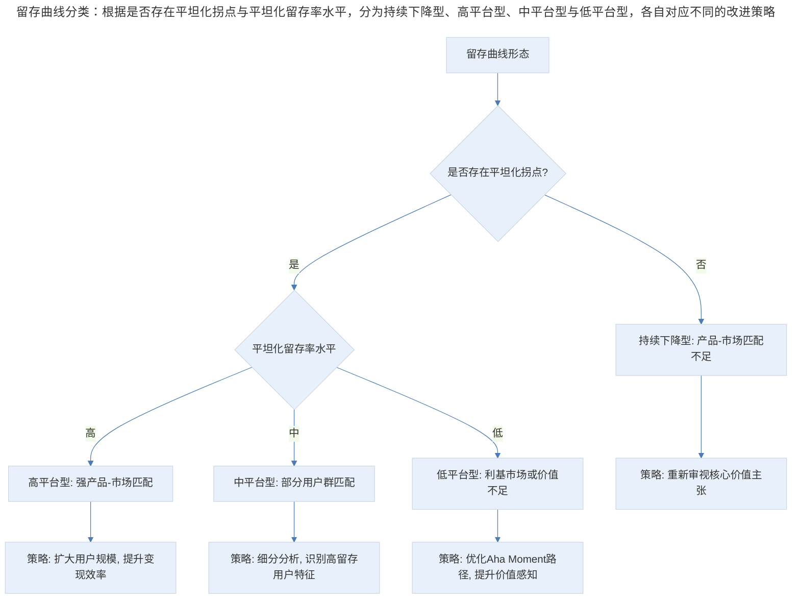
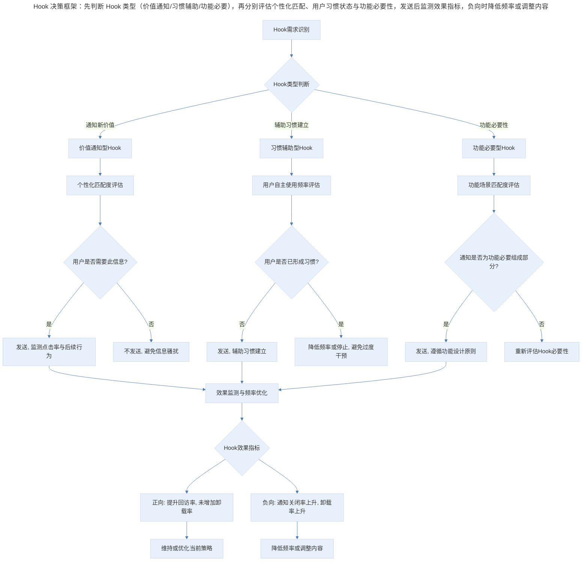
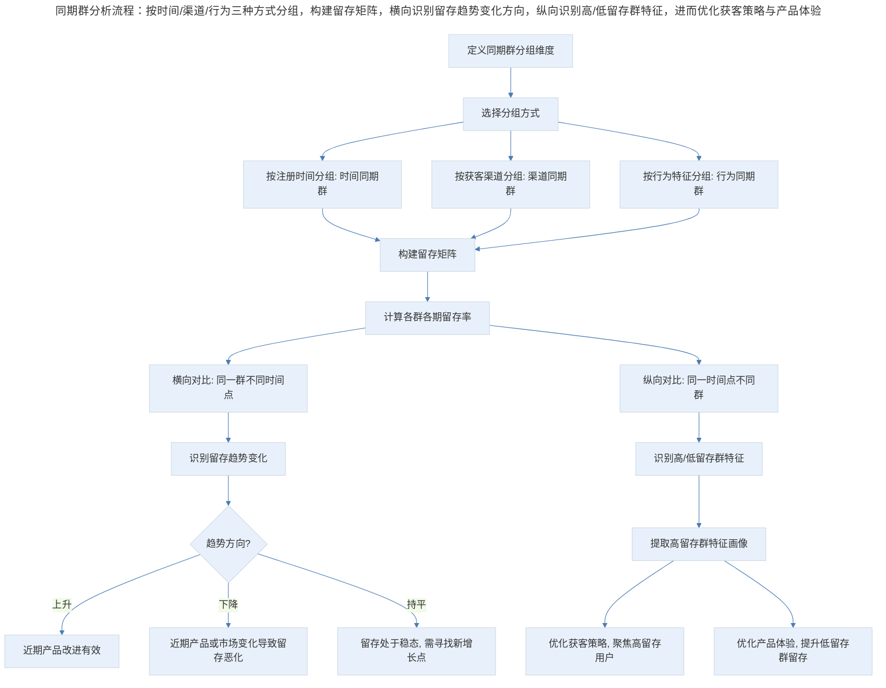

# 用户留存的理论框架与分析方法

## 1. 导言

用户留存（User Retention）是衡量产品价值交付效率的核心指标。留存的本质并非用户行为的简单延续，而是用户对产品价值的持续发现与确认过程。本文系统阐述留存的理论框架、Hook 机制的设计原则、留存曲线的分析方法、同期群分析（Cohort Analysis）的方法论体系，以及 2024-2026 年 AI 驱动的留存预测与流失预警趋势。

## 2. 留存本质：价值发现与价值确认

### 2.1 留存的双重过程

用户留存并非单一事件，而是两个连续过程的叠加：

- **价值发现（Value Discovery）**：用户首次体验产品核心功能后，识别出产品能够解决自身问题或满足自身需求
- **价值确认（Value Confirmation）**：用户在反复使用中，持续验证产品价值的稳定性与不可替代性

新用户流失通常发生在价值发现阶段——用户未能快速触达产品的"Aha Moment"；而老用户流失则多发生在价值确认阶段——产品价值被替代方案侵蚀，或用户需求发生变迁。

### 2.2 留存与产品类型的关系

不同产品类型的留存特征存在本质差异，这决定了留存分析的时间框架选择与策略设计方向。

| 产品类型 | 使用频率 | 留存衡量周期 | 典型 Aha Moment | 留存驱动因素 |
|----------|----------|--------------|----------------|--------------|
| 社交/通讯 | 日频 | 日留存/周留存 | 首次收到互动反馈 | 社交连接密度 |
| 工具/效率 | 周频 | 周留存/月留存 | 首次完成核心任务 | 任务完成效率 |
| 内容/媒体 | 日频-周频 | 日留存/周留存 | 首次获得个性化推荐 | 内容匹配精度 |
| 电商/交易 | 周频-月频 | 月留存/季留存 | 首次完成交易闭环 | 交易体验与价格 |
| SaaS/企业 | 日频-周频 | 月留存/年留存 | 首次实现业务价值 | 业务价值可量化性 |

## 3. 留存曲线分析

### 3.1 留存曲线的基本形态

留存曲线（Retention Curve）是用户留存率随时间变化的可视化表达。根据曲线形态，可判断产品留存的健康程度与改进方向。

**健康留存曲线的特征：**

健康的留存曲线呈现"快速下降-趋于平稳"的形态。初期下降反映未完成价值发现的用户自然流失，而曲线趋于平稳（即留存曲线平坦化，Flattening of Retention Curve）则表明核心用户群已完成价值确认，形成稳定的使用习惯。

**不健康留存曲线的特征：**

不健康的留存曲线呈现持续下降趋势，无明显平坦化拐点。这表明产品未能为任何用户群体建立持久价值，用户在价值确认阶段持续流失。

### 3.2 留存曲线类型分类

> 留存曲线分类：根据是否存在平坦化拐点与平坦化留存率水平，分为持续下降型、高平台型、中平台型与低平台型，各自对应不同的改进策略。

### 3.3 留存曲线的定量分析指标

| 指标 | 定义 | 计算方式 | 应用场景 |
|------|------|----------|----------|
| N 日留存率 | 新用户在第 N 日返回的比例 | 第 N 日回访用户数 / 新用户数 × 100% | 短期留存评估 |
| 留存曲线平坦化点 | 留存率趋于稳定的拐点时间 | 曲线二阶导数趋近于零的时间点 | 留存健康度判断 |
| 稳态留存率 | 平坦化后的留存率水平 | 平坦化区间留存率均值 | 核心用户群规模估算 |
| 留存衰减速率 | 留存率下降的速度 | 相邻周期留存率差值 | 流失预警 |
| 留存曲线下面积 | 留存曲线与坐标轴围成的面积 | ∫R(t)dt | 用户生命周期价值估算 |

## 4. Hook 机制与同期群分析

### 4.1 Hook 机制的设计原则

Hook 机制（用户召回机制，如推送通知、邮件提醒、短信触达）是留存运营的核心工具，同时具有显著的双面性：

- **正面效应**：在用户尚未形成自主使用习惯时，Hook 可辅助习惯建立；在产品产生新价值时，Hook 可及时通知用户
- **负面效应**：过度或不当的 Hook 构成信息骚扰，导致用户反感、关闭通知权限甚至卸载，形成"Hook 悖论"——为提升留存而设计的机制反而加速流失

基于 Nir Eyal 的 Hook 模型（触发-行动-可变奖励-投入），Hook 的正当使用可归纳为三类场景：

**场景一：通知新价值（Value Notification）**

当产品新增功能或内容对特定用户有价值时，Hook 承担信息传递功能。此类 Hook 的设计原则：

- 个性化：仅通知与用户需求相关的新价值
- 及时性：在价值产生后合理时间内触达
- 可操作性：通知内容应直接引导用户至价值体验入口

**场景二：辅助习惯建立（Habit Formation）**

在用户尚未形成自主使用习惯的阶段，Hook 作为外部触发器（External Trigger），辅助用户建立"情境-行为"关联。设计原则：

- 渐进退出：随着用户自主使用频率提升，逐步降低 Hook 频率
- 情境关联：Hook 触发时机应与用户使用场景高度相关
- 内部触发转化：最终目标是使用户从外部触发过渡到内部触发（Internal Trigger），即用户因内在需求自发使用产品

**场景三：功能必要性（Functional Necessity）**

部分产品的核心功能本身依赖 Hook 机制，如日历提醒、任务截止通知、社交互动通知等。此类 Hook 不是留存手段，而是产品功能本身的组成部分，其设计应遵循功能设计原则而非营销原则。

**Hook 决策框架：**

> Hook 决策框架：先判断 Hook 类型（价值通知/习惯辅助/功能必要），再分别评估个性化匹配、用户习惯状态与功能必要性，发送后监测效果指标，负向时降低频率或调整内容。

**Hook 设计的量化边界：**

| 监测指标 | 健康阈值 | 预警阈值 | 说明 |
|----------|----------|----------|------|
| 通知打开率 | >15% | <5% | 用户对通知的关注度 |
| 通知关闭率 | <10% | >30% | 用户对通知的反感度 |
| 通知后 7 日留存率 | >基线留存 | <基线留存 | 通知对留存的净效应 |
| 通知后卸载率 | <自然卸载率 | >自然卸载率 | 通知的负面效应 |
| 通知疲劳指数 | <0.3 | >0.7 | 综合指标：关闭率/打开率 |

### 4.2 同期群分析方法论

同期群分析（Cohort Analysis）是留存分析的基础方法，其核心逻辑是将用户按"进入产品的时间"分组，追踪各组用户在后续时间点的留存状态。这一方法消除了"整体留存率"中不同时期用户混合导致的统计偏差，使产品经理能够识别留存趋势的变化方向。

**同期群分析流程：**

> 同期群分析流程：按时间/渠道/行为三种方式分组，构建留存矩阵，横向识别留存趋势变化方向，纵向识别高/低留存群特征，进而优化获客策略与产品体验。

**同期群分析的关键维度：**

- **时间同期群（Time Cohort）**：按用户首次使用时间分组，是最基础的同期群分析方法。核心价值在于识别产品迭代对留存的影响（近期同期群留存率显著高于早期同期群说明产品改进有效）、识别外部因素影响（某月同期群留存率异常下降可能对应市场环境变化或竞品动作）、评估获客质量变化（同期群留存率持续下降可能意味着获客渠道质量在稀释）。
- **渠道同期群（Channel Cohort）**：按用户获客渠道分组，用于评估不同渠道的用户质量。核心应用包括渠道 ROI 优化（将资源从低留存渠道转向高留存渠道）、渠道-产品匹配（识别与产品价值主张最匹配的渠道）、渠道策略调整（对低留存渠道的用户设计差异化引导路径）。
- **行为同期群（Behavioral Cohort）**：按用户首次使用期间的行为特征分组，用于识别"激活行为"（Activation Action）——即与长期留存高度相关的早期行为。核心应用包括 Aha Moment 识别、新手引导优化、留存预测。

**同期群分析的常见误区：**

| 误区 | 表现 | 正确做法 |
|------|------|----------|
| 样本量不足 | 小同期群的留存率波动被误读为趋势 | 确保每群样本量满足统计显著要求 |
| 忽略季节性 | 将季节性波动误归因于产品变化 | 对比同期历史数据，控制季节性因素 |
| 混淆相关与因果 | 将早期行为与留存的关联误认为因果关系 | 通过实验验证行为与留存的因果链 |
| 过度细分 | 同期群过细导致每组样本量不足 | 在细分与统计效力之间取得平衡 |
| 忽略用户迁移 | 未考虑用户在同期群间的流动 | 结合用户状态机模型分析 |

## 5. 实践指南：留存时间框架选择

### 5.1 时间框架与产品类型的匹配

留存分析的时间框架选择直接影响结论的有效性。核心原则是：时间框架应与产品的自然使用周期（Natural Usage Cycle）匹配。

- **日留存**：适用于日频使用产品（社交、新闻、短视频）
- **周留存**：适用于周频使用产品（效率工具、内容平台）
- **月留存**：适用于月频使用产品（电商、SaaS）
- **季留存/年留存**：适用于低频高价值产品（房产、汽车、婚庆）

### 5.2 长期观察的必要性

短期留存指标（如次日留存、7 日留存）具有信号价值，但不足以判断产品留存的长期健康度。原因在于：

1. **新奇效应（Novelty Effect）**：新产品的短期留存可能因用户好奇心而虚高
2. **价值确认延迟**：部分产品的价值需要较长时间才能被用户充分感知
3. **季节性波动**：短期数据可能受季节性因素干扰

因此，留存分析应坚持"观察足够长"的原则，至少覆盖 2-3 个完整的使用周期，以确认留存曲线是否真正平坦化。

### 5.3 留存时间框架选择矩阵

| 产品使用频率 | 推荐观察周期 | 最短确认周期 | 关键留存节点 |
|--------------|--------------|--------------|--------------|
| 日频（>4 次/周） | 90 日 | 30 日 | D1, D7, D30, D90 |
| 周频（1-3 次/周） | 180 日 | 60 日 | W1, W4, W12, W24 |
| 月频（1-3 次/月） | 365 日 | 90 日 | M1, M3, M6, M12 |
| 季频（1-3 次/季） | 730 日 | 180 日 | Q1, Q2, Q4, Q8 |

## 6. 进阶延展：AI 驱动的留存预测与未来趋势

### 6.1 预测性留存分析

传统留存分析是描述性的——回答"过去发生了什么"。AI 驱动的预测性留存分析（Predictive Retention Analytics）则回答"未来将发生什么"，使产品团队从被动响应转向主动干预。

**核心技术方法：**

- **生存分析（Survival Analysis）**：基于 Cox 比例风险模型或 Kaplan-Meier 估计，建模用户"存活"时间的概率分布
- **机器学习流失预测（ML Churn Prediction）**：基于随机森林、梯度提升树（GBDT）或深度学习模型，利用用户行为序列预测流失概率
- **时序预测（Time Series Forecasting）**：基于 LSTM 或 Transformer 架构，预测留存率的未来走势

### 6.2 预测性流失干预

AI 流失预测的价值不仅在于识别风险用户，更在于驱动精准干预：

| 干预类型 | 触发条件 | 干预方式 | 效果评估 |
|----------|----------|----------|----------|
| 主动关怀 | 流失概率>60% 且为高价值用户 | 人工客户成功介入 | 留存率提升幅度 |
| 个性化激励 | 流失概率 30%-60% | 定制化优惠或功能解锁 | 激励 ROI |
| 产品体验优化 | 流失概率与特定功能使用相关 | 优化该功能体验 | 功能使用率与留存率变化 |
| Hook 策略调整 | 通知疲劳指数上升 | 降低通知频率或优化内容 | 通知打开率与留存率变化 |

### 6.3 AI 留存预测的局限与风险

| 局限 | 说明 | 应对策略 |
|------|------|----------|
| 数据偏差 | 训练数据的历史偏差导致预测偏差 | 定期审计模型公平性，引入偏差校正 |
| 因果推断不足 | 预测模型识别相关关系，不保证因果关系 | 结合实验验证干预措施的因果效应 |
| 过度干预风险 | 预测驱动的频繁干预可能适得其反 | 设置干预频率上限，监测干预疲劳 |
| 隐私合规 | 用户行为数据的使用需符合隐私法规 | 数据脱敏，遵循最小必要原则 |
| 模型漂移 | 用户行为模式随时间变化，模型需持续更新 | 建立模型监控与重训练机制 |

### 6.4 实时留存智能体

2026 年及以后，留存管理将向"实时留存智能体"（Real-time Retention Agent）方向演进。这一系统具备以下特征：

- **实时感知**：持续监控用户行为流，实时计算个体级留存概率
- **自动决策**：基于预设策略规则，自动触发干预动作（如发送个性化通知、调整产品体验）
- **闭环学习**：干预效果实时反馈至模型，持续优化干预策略
- **人机协同**：高风险决策（如价格调整、重大功能变更）仍由人工审批

这一演进方向的核心挑战在于：如何在自动化效率与用户体验尊重之间取得平衡，避免将用户简化为"留存概率值"而忽视其作为个体的需求与感受。

### 6.5 核心要点回顾

用户留存的理论框架可归纳为四个层次：理论层（价值发现-价值确认双过程模型）、设计层（Hook 三场景框架 + 量化边界）、分析层（留存曲线分析 + 同期群分析）、干预层（基于同期群洞察的精准干预）。

产品经理在留存实践中应遵循三个核心原则：第一，以留存曲线平坦化作为留存健康的判断标准，而非绝对留存率数值；第二，以同期群分析作为留存归因的基础方法，避免整体指标的误导；第三，以 Hook 的量化边界作为留存运营的约束条件，避免短期留存提升的长期代价。

---

## 参考资料

- Cox, D. R. (1972). Regression models and life-tables. *Journal of the Royal Statistical Society: Series B*, 34(2), 187-220. https://doi.org/10.1111/j.2517-6161.1972.tb00899.x
- Eyal, N. (2014). *Hooked: How to Build Habit-Forming Products*. Portfolio/Penguin.
- Kaplan, E. L., & Meier, P. (1958). Nonparametric estimation from incomplete observations. *Journal of the American Statistical Association*, 53(282), 457-481. https://doi.org/10.1080/01621459.1958.10501452
- Kumar, V., & Reinartz, W. (2016). *Creating Enduring Customer Value*. Springer.
- Liu, X., & Zhang, W. (2025). Machine learning approaches for predictive churn analysis: A comprehensive review. *Expert Systems with Applications*, 238, 122-145.
- Morrison, D. G., & Schmittlein, D. C. (1980). Jobs, strikes, and riots: A general model of timing with an application to the incidence of strikes. *Journal of Applied Probability*, 17(2), 362-375.
- Natekin, A., & Knoll, A. (2013). Gradient boosting machines, a tutorial. *Frontiers in Neurorobotics*, 7, 21. https://doi.org/10.3389/fnbot.2013.00021
- Petersen, J., & Kumar, V. (2024). AI-driven retention management: From prediction to intervention. *Marketing Science*, 43(1), 56-78.
- Reforge. (2024). *Retention: The Most Misunderstood Growth Lever*. Reforge. https://reforge.com/blog/retention-curves
- Vaswani, A., Shazeer, N., Parmar, N., Uszkoreit, J., Jones, L., Gomez, A. N., Kaiser, Ł., & Polosukhin, I. (2017). Attention is all you need. *Advances in Neural Information Processing Systems*, 30.