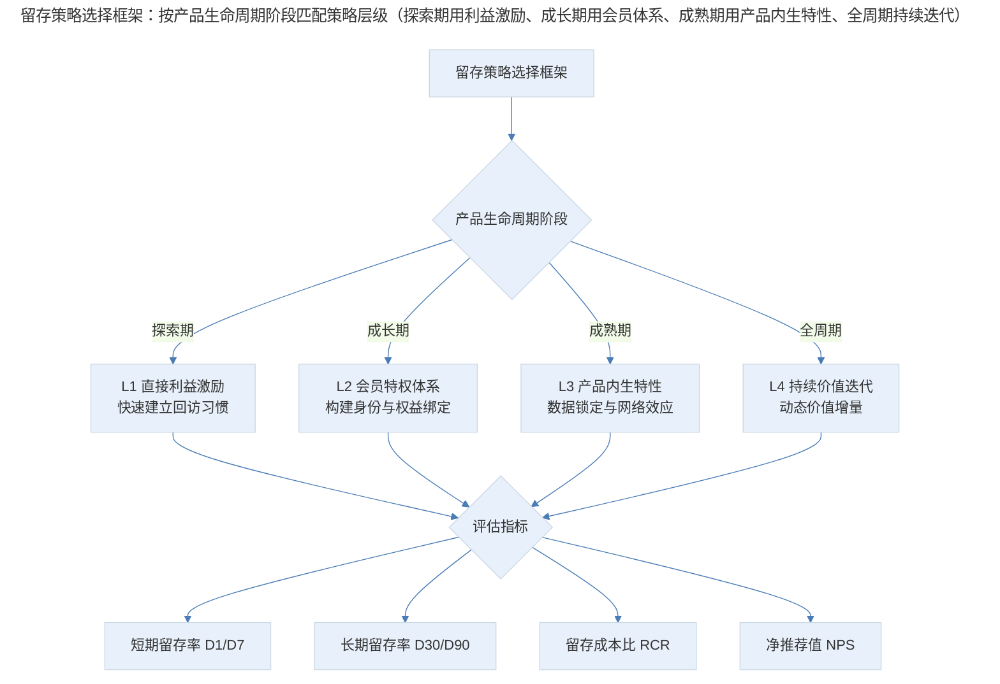
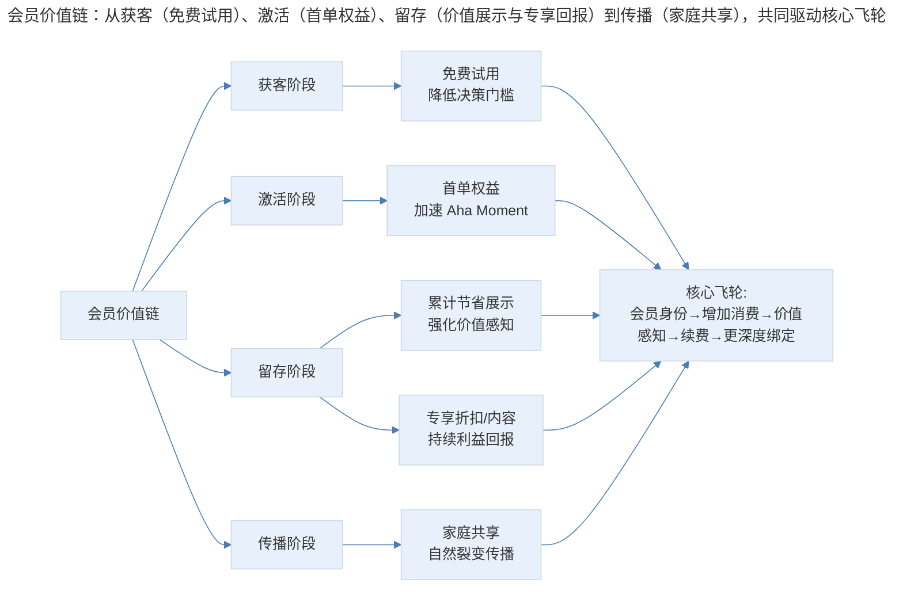
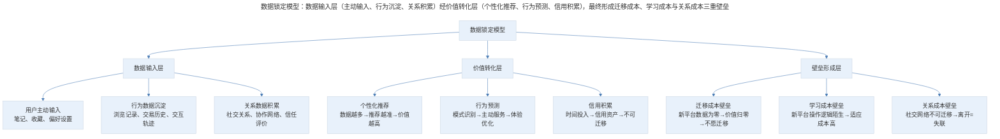

# 用户留存的策略体系与实施路径

## 1. 导言

用户留存（User Retention）是增长模型 AARRR 中衡量产品持续价值创造能力的核心指标。本文系统构建留存策略的分类体系，从会员经济（Membership Economics）、直接利益激励、产品内生留存特性、持续迭代四个维度展开深入分析，重点探讨数据锁定（Data Lock-in）、网络效应（Network Effects）与转换成本（Switching Cost）的设计方法论，并结合 2024–2026 年订阅疲劳（Subscription Fatigue）、AI 个性化留存等前沿趋势，提出可操作的留存策略选择框架与实施路径。

## 2. 策略体系：留存策略的分类与选择

### 2.1 留存策略的分层模型

留存策略并非零散手段的堆砌，而应根据价值创造的深度与可持续性进行分层设计。从外部激励到产品内生特性，留存策略的效力递增，但实施难度也随之提升。

| 策略层级 | 英文 | 价值来源 | 留存可持续性 | 实施难度 | 典型案例 |
|----------|------|----------|-------------|----------|----------|
| L1 直接利益激励 | Direct Incentive | 外部利益回报 | 低—中 | 低 | 签到奖励、登录礼包 |
| L2 会员特权体系 | Membership Program | 身份与权益绑定 | 中—高 | 中 | Amazon Prime、京东 PLUS |
| L3 产品内生特性 | Product-Intrinsic Feature | 功能依赖与数据锁定 | 高 | 高 | 微信社交网络、Notion 数据沉淀 |
| L4 持续价值迭代 | Continuous Iteration | 动态价值增量 | 高 | 高 | iOS 系统更新、游戏版本迭代 |

留存策略的选择需与产品生命周期阶段匹配：

> 留存策略选择框架：按产品生命周期阶段匹配策略层级（探索期用利益激励、成长期用会员体系、成熟期用产品内生特性、全周期持续迭代），并以留存率与留存成本比等指标评估效果。

### 2.2 策略选择的关键决策因素

| 决策维度 | 评估问题 | 倾向 L1/L2 | 倾向 L3/L4 |
|----------|----------|-----------|-----------|
| 用户使用频率 | 产品是否需要高频交互？ | 高频场景，需要外部刺激维持 | 低频但高价值场景 |
| 数据积累深度 | 用户是否在产品中沉淀大量数据？ | 数据积累浅，需外部钩子 | 数据积累深，内生锁定强 |
| 社交属性 | 产品是否具备社交或平台属性？ | 非社交产品 | 强网络效应产品 |
| 竞争格局 | 替代品获取难度如何？ | 替代品丰富，需利益绑定 | 替代品稀缺，功能壁垒高 |
| 变模型式 | 收入模型是否支持会员制？ | 广告变现或交易抽佣 | 订阅制或增值服务 |

## 3. 策略实施：会员经济与直接利益激励

### 3.1 会员特权体系与会员经济

会员经济（Membership Economy）的本质是将一次性交易关系转化为持续的订阅关系，通过权益绑定提高用户的转换成本与离开意愿（Baxter, 2015）。Amazon Prime 是会员经济最经典的实践案例：

| 指标 | 数据 | 行业对比 |
|------|------|----------|
| 免费试用→付费转化率 | 73% | 订阅类产品平均 40–55% |
| 第一年续订率 | 约 91% | 行业平均 60–70% |
| 第三年续订率 | 约 96% | 行业平均 45–55% |
| 会员年均消费额 | 非会员的 2 倍以上 | — |

Prime 会员体系的成功并非仅源于权益本身，更在于其精心设计的价值感知机制：用户可随时查看 Prime 已节省的运费金额，产品中无处不在的 Prime 标识强化身份认同，专享折扣持续提供决策锚点。这些设计将抽象的会员价值转化为可感知的具体回报，从而驱动续费决策。

> 会员价值链：从获客（免费试用）、激活（首单权益）、留存（价值展示与专享回报）到传播（家庭共享），共同驱动"会员身份→增加消费→价值感知→续费→更深度绑定"的核心飞轮。

一个完整的会员特权体系应包含以下核心设计要素：

**权益结构设计**：权益应覆盖"省钱—省时—专属"三个层次。省钱型权益（折扣、免邮）提供直接经济回报；省时型权益（优先配送、免广告）降低使用摩擦；专属型权益（限定内容、优先体验）提供身份认同与稀缺价值。

**定价心理学**：年费制相较于月费制能显著提升续费率，因其将决策从"每月是否值得"转化为"一年一次性判断"，同时沉没成本效应会促使会员更频繁地使用服务以"回本"。

**价值可视化**：持续向会员展示已获得的权益价值，如"本月已为您节省 ¥XX"，是维持续费意愿的关键手段。研究显示，价值可视化可使续费率提升 12–18%（McKinsey, 2023）。

### 3.2 订阅疲劳与会员体系的挑战（2024–2026）

2024–2026 年，会员经济面临前所未有的挑战——订阅疲劳（Subscription Fatigue）。根据 Zuora 的订阅经济报告，2024 年全球消费者平均订阅 5.8 项付费服务，较 2020 年增长 43%，但主动取消订阅的比例也同步上升至 31%。

| 订阅疲劳指标 | 2022 | 2024 | 2026（预测） |
|-------------|------|------|-------------|
| 人均订阅服务数 | 4.6 | 5.8 | 6.5 |
| 年度主动取消率 | 24% | 31% | 35% |
| "订阅过多"认知比例 | 42% | 56% | 62% |
| 新订阅意愿指数 | 68 | 54 | 48 |

应对订阅疲劳的策略方向：

1. **灵活订阅模式**：提供月/季/年多档位选择，增加"暂停而非取消"选项，降低决策心理负担
2. **价值分层**：基础权益免费开放，核心权益付费解锁，避免全量收费导致的价值感知稀释
3. **AI 动态权益推荐**：基于用户行为数据，动态推荐最匹配的权益组合，提升权益使用率与价值感知
4. **生态系统整合**：将分散的会员权益整合为统一身份（如 Apple One），降低用户的订阅管理成本

### 3.3 直接利益激励

直接利益激励是最直接的留存手段，通过外部奖励驱动用户回访。其核心机制包括：

**递进累计设计**：游戏领域的连续登录奖励是最典型的递进累计设计。第一天登录获得基础奖励，连续登录奖励价值递增，中断则重置。这一设计利用了损失厌恶（Loss Aversion）心理——用户不愿因中断而放弃已累积的奖励进度。

**打卡签到机制**：将递进累计逻辑移植到非游戏产品中，形成签到功能。连续签到可兑换积分、优惠券或实物奖励。需要特别注意的是，奖励物品应与产品核心价值相关联：游戏道具之于游戏、社区积分之于社区、电商折扣之于电商——无关的奖励仅起到钩子（Hook）作用，无法转化为真正的留存驱动力。

直接利益激励的局限性：

| 局限性 | 表现 | 应对策略 |
|--------|------|----------|
| 边际效用递减 | 用户对相同奖励逐渐麻木 | 动态调整奖励价值与稀缺性 |
| 利益依赖 | 停止激励后留存快速回落 | 与产品内生特性结合，逐步过渡 |
| 灰产风险 | 羊毛党套利，真实用户占比低 | 风控体系与用户质量筛选 |
| 成本不可持续 | 长期激励成本侵蚀利润 | 设定激励上限，引入社交裂变降低单位成本 |

## 4. 内生留存：产品内生留存特性

产品内生留存特性是留存策略中效力最强、可持续性最高的类别。其核心逻辑是：用户在产品使用闭环中自然完成留存，无需依赖外部激励。

### 4.1 功能性刚需

产品的核心功能本身即为用户持续回访的理由。即时通讯工具（IM）、日历应用、邮件客户端等属于天然具备高频刚需属性的产品。关键在于识别产品的"不可替代场景"——如果用户必须回到产品中才能完成某项关键任务，则功能性刚需自然成立。

| 维度 | 评估标准 | 权重 |
|------|----------|------|
| 使用频率 | 用户完成任务的时间间隔 | 高 |
| 替代方案数 | 完成相同任务的替代工具数量 | 高 |
| 迁移成本 | 从当前产品迁移至替代方案的成本 | 中 |
| 任务重要性 | 该任务对用户工作/生活的影响程度 | 中 |

### 4.2 数据锁定效应

数据锁定（Data Lock-in）是产品内生留存最强大的机制之一。其核心原理是：随着用户在产品中积累的数据量增加，产品对用户的个性化价值持续提升，而迁移至替代方案的成本也随之增大，从而形成天然壁垒。

> 数据锁定模型：数据输入层（主动输入、行为沉淀、关系积累）经价值转化层（个性化推荐、行为预测、信用积累），最终形成迁移成本、学习成本与关系成本三重壁垒。

数据锁定的典型案例：

- **笔记应用**：用户在 Notion、Obsidian 中积累的知识库越庞大，迁移至其他工具的成本越高
- **电商平台**：淘宝卖家积累的信用评级、交易数据、客户评价构成不可迁移的资产
- **音乐服务**：Spotify 根据用户听歌历史生成的个性化推荐，数据积累越深体验越好
- **银行应用**：自动识别用户行为模式，在特定时间主动推送操作提醒，减少用户操作成本

数据锁定的设计原则：

1. **降低数据输入门槛**：通过 AI 自动化减少用户主动输入的负担，如智能分类、自动标签
2. **加速数据积累**：尽早引导用户完成关键数据的首次输入，缩短"数据冷启动"期
3. **显性化数据价值**：定期向用户展示数据带来的个性化价值，如"基于您的偏好，为您推荐..."
4. **构建数据网络**：让数据之间产生关联，形成"数据越多→关联越密→价值越大"的飞轮

### 4.3 网络效应

网络效应（Network Effects）是产品内生留存的最高形态。其核心定义是：随着使用某个产品的用户数量增加，该产品对每个用户的价值也在增加（Shapiro & Varian, 1999）。

| 网络效应类型 | 英文 | 典型案例 | 留存机制 |
|-------------|------|----------|----------|
| 直接网络效应 | Direct Network Effects | 微信、电话网络 | 用户越多→可联系的人越多→价值越大 |
| 间接网络效应 | Indirect Network Effects | 淘宝、Uber | 买家越多→卖家越多→选择越丰富 |
| 数据网络效应 | Data Network Effects | Waze、Grammarly | 用户越多→数据越多→产品越智能 |
| 平台网络效应 | Platform Network Effects | iOS/Android 生态 | 开发者越多→应用越多→用户粘性越强 |

网络效应的设计要点：

- **冷启动策略**：网络效应产品的核心挑战在于冷启动期——用户量不足时价值有限。需通过单用户价值（Single-Player Value）先行留住早期用户，逐步积累网络密度
- **临界质量（Critical Mass）**：识别网络效应开始发挥作用的用户量阈值，在此之前可容忍较高的获客成本
- **多边市场平衡**：对于平台型产品，需同时关注供需两端的增长平衡，避免单侧膨胀导致体验劣化

### 4.4 转换成本设计

转换成本（Switching Cost）是数据锁定与网络效应的经济学表达。产品经理应有意识地设计转换成本结构：

| 转换成本类型 | 设计手段 | 效力评估 |
|-------------|----------|----------|
| 财务成本 | 会员年费制、积分体系、预付费模式 | 中 |
| 数据成本 | 深度数据沉淀、个性化配置、历史记录 | 高 |
| 学习成本 | 独特交互范式、专业工作流、快捷键体系 | 中—高 |
| 关系成本 | 社交网络、协作空间、组织账号体系 | 高 |
| 情感成本 | 品牌认同、成就体系、徽章与纪念 | 低—中 |

## 5. 实践指南：持续迭代与实施框架

### 5.1 迭代即留存

产品功能的持续迭代本身就是一种留存策略。iOS 系统更新是典型案例——硬件更换周期较长，但软件的持续迭代不断为设备注入新功能，延长用户的使用周期与活跃度。游戏领域同样如此，新角色、新地图、新玩法是驱动玩家持续回归的核心动力。

迭代即留存的实施要点：

- **节奏感**：建立可预期的更新节奏（如每月小版本、每季度大版本），培养用户的"期待感"
- **价值感知**：每次更新的价值必须可感知，而非仅是底层优化。通过更新日志、功能引导强化用户新发现
- **参与感**：让用户参与功能优先级投票或 Beta 测试，将被动接受转化为主动期待

### 5.2 留存诊断

在制定留存策略之前，需完成系统性的留存诊断：

1. **留存曲线分析**：绘制不同用户群组的留存曲线，识别关键流失节点
2. **流失归因分析**：通过用户调研与行为数据分析，明确流失的主要原因
3. **竞品留存对标**：获取行业基准数据，判断当前留存水平的相对位置
4. **留存成本评估**：计算当前各留存手段的投入产出比，识别效率洼地

### 5.3 策略组合设计

留存策略不应单一依赖，而应构建组合体系。推荐的策略组合逻辑：

| 产品阶段 | 核心策略 | 辅助策略 | 禁忌 |
|----------|----------|----------|------|
| 冷启动期 | L1 直接利益 + L4 快速迭代 | L2 早期会员 | 过早投入网络效应建设 |
| 成长期 | L2 会员体系 + L3 数据沉淀 | L1 场景化激励 | 忽视数据积累基础建设 |
| 成熟期 | L3 网络效应 + L4 持续迭代 | L2 会员升级 | 过度依赖利益激励 |
| 衰退期 | L4 创新突破 + L3 数据迁移壁垒 | L1 召回激励 | 放弃核心用户维护 |

## 6. 进阶延展：AI 个性化留存与核心要点回顾

### 6.1 AI 驱动的个性化留存（2024–2026）

2024–2026 年，AI 技术为留存策略带来了范式级别的变革。核心趋势包括：

**预测性流失干预（Predictive Churn Intervention）**：基于机器学习模型，在用户表现出流失前兆行为时（如使用频率下降、功能使用范围收窄），自动触发个性化的留存干预——可能是推送相关内容、提供专属优惠或引导体验新功能。据 Bain & Company（2024）研究，预测性流失干预可将流失率降低 15–25%。

**AI 个性化体验**：利用 AI 根据用户行为数据动态调整产品界面、功能推荐与内容排序，使每位用户的体验高度个性化。Spotify 的 AI DJ、Netflix 的个性化首页即是典型案例。

**智能内容生成**：AIGC 技术使产品能够以极低成本持续产出个性化内容，解决"内容消费完毕即流失"的痛点。如 Duolingo 利用 AI 生成个性化练习内容，保持学习者的持续参与。

| AI 留存技术 | 应用场景 | 效果指标 | 成熟度 |
|------------|----------|----------|--------|
| 流失预测模型 | 识别高风险用户并提前干预 | 流失率降低 15–25% | 成熟 |
| 个性化推荐引擎 | 动态调整内容与功能展示 | 留存率提升 10–20% | 成熟 |
| AIGC 内容生成 | 持续产出个性化内容 | 参与度提升 20–35% | 快速成长 |
| 智能对话留存 | AI 主动发起交互引导回访 | 回访率提升 8–15% | 早期 |
| 自适应界面 | 根据用户熟练度动态调整 UI | 新用户激活率提升 12–18% | 早期 |

### 6.2 核心要点回顾

用户留存的策略体系从外部激励到产品内生特性，效力与可持续性逐级递增。会员经济通过身份与权益绑定构建中期留存基础，数据锁定与网络效应则构筑长期竞争壁垒。2024–2026 年，订阅疲劳要求会员体系向灵活化与价值分层演进，AI 技术则为个性化留存与预测性干预开辟了全新路径。留存策略的选择与实施应基于产品生命周期阶段、用户特征与竞争格局进行系统性判断，而非照搬单一模式。

---

## 参考资料

- Baxter, R. K. (2015). *The Membership Economy: Find Your Super Users, Master the Forever Transaction, and Build Recurring Revenue*. McGraw-Hill Education.
- Blank, S. (2020). *The Startup Owner's Manual: The Step-by-Step Guide for Building a Great Company* (2nd ed.). Wiley.
- Bain & Company. (2024). *The State of Customer Loyalty 2024*. Bain & Company Report.
- McKinsey & Company. (2021). *The value of getting personalization right—or wrong—is multiplying*. McKinsey Digital Article.
- Shapiro, C., & Varian, H. R. (1999). *Information Rules: A Strategic Guide to the Network Economy*. Harvard Business School Press.
- Zuora. (2024). *Subscription Economy Index: 2024 Annual Report*. Zuora Inc.
- Thales, T. (2025). *AI-driven retention: From reactive to predictive churn management*. Journal of Product Analytics, 12(3), 45–62.
- Reichheld, F. (2023). *The Net Promoter System: Transforming customer experience and loyalty in the AI era*. Harvard Business Review Press.