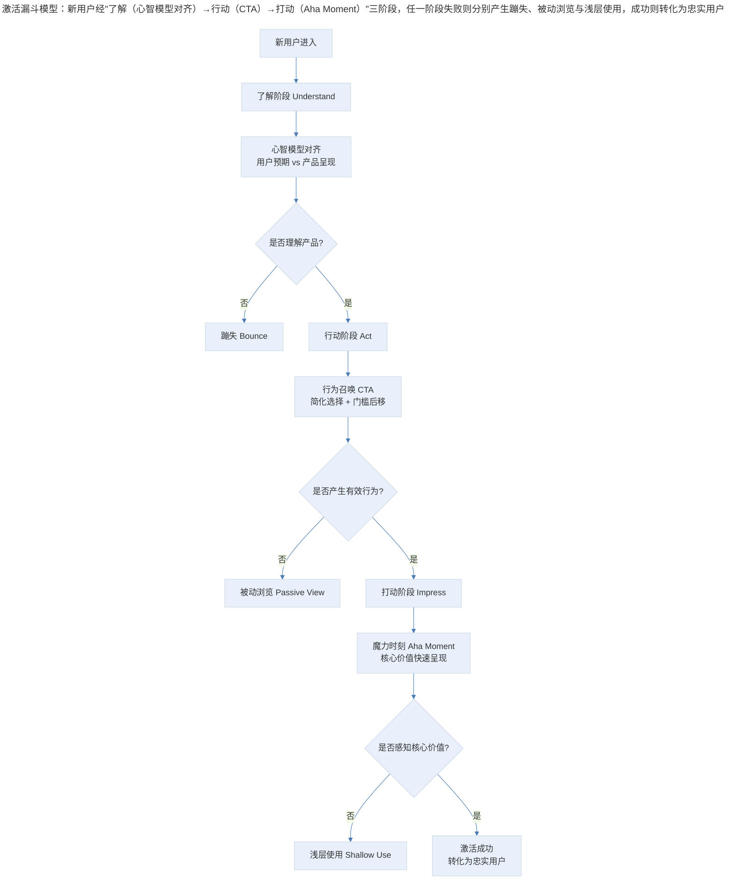
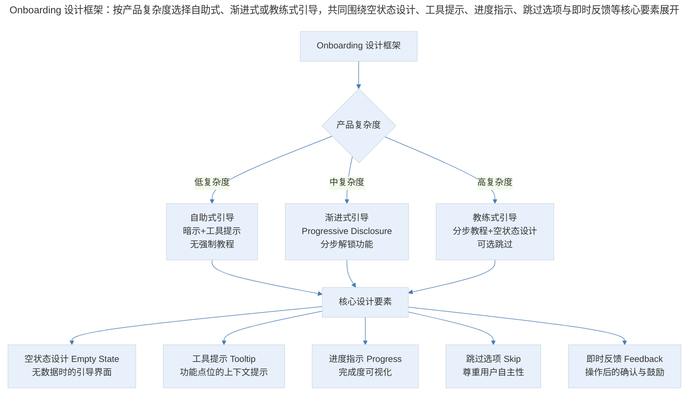
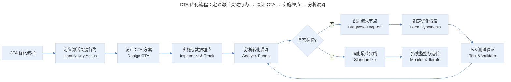

# 用户激活的系统性设计：从了解到打动

## 1. 导言

用户激活（User Activation）是 AARRR 增长模型中将新用户转化为忠实用户的关键环节，其核心目标是引导用户尽快体验产品的魔力时刻（Aha Moment）。本文构建"了解→行动→打动"三阶段激活漏斗模型，系统阐述心智模型对齐（Mental Model Alignment）、行为召唤（Call to Action, CTA）设计原则、新手引导（Onboarding）最佳实践，并结合 2024–2026 年 AI 个性化引导、渐进式披露（Progressive Disclosure）等前沿趋势，提出可度量的激活优化框架与行业基准数据。

## 2. 激活框架：三阶段漏斗模型

### 2.1 核心定义

**用户激活（User Activation）** 是指新用户首次进入产品后，通过系统化的引导与体验设计，使其完成关键行为并感知产品核心价值的过程。激活率（Activation Rate）是衡量该过程效率的核心指标，定义为完成激活关键行为的用户占新用户总数的比例。

在 AARRR 增长模型中，激活与留存是两个应优先重视的环节。留存反映产品能否持续创造价值，激活则决定产品能否将首次到访的新用户有效转化为长期用户。两者之间存在强因果关系——激活质量直接影响后续留存表现。

| 概念 | 英文 | 定义 | 与激活的关系 |
|------|------|------|-------------|
| 激活 | Activation | 新用户完成关键行为并感知核心价值 | 本主题 |
| 魔力时刻 | Aha Moment | 用户首次感知产品核心价值的瞬间 | 激活的终极目标 |
| 蹦失 | Bounce | 着陆后无有效交互即离开 | 激活失败的表现 |
| 新手引导 | Onboarding | 系统化引导新用户完成激活的流程 | 激活的实施手段 |
| 首因效应 | Primacy Effect | 首次印象对后续认知的巨大影响 | 激活的心理基础 |

### 2.2 激活漏斗模型

激活过程可系统化为三阶段漏斗模型：了解（Understand）→行动（Act）→打动（Impress）。每个阶段存在明确的转化目标与流失风险。

> 激活漏斗模型：新用户经"了解（心智模型对齐）→行动（CTA）→打动（Aha Moment）"三阶段，任一阶段失败则分别产生蹦失、被动浏览与浅层使用，成功则转化为忠实用户。

### 2.3 激活的行业基准数据

不同产品类型的激活率基准差异显著，以下数据基于 2024–2025 年行业研究汇总：

| 产品类型 | 激活关键行为 | 行业平均激活率 | 优秀水平 | 落后水平 |
|----------|-------------|---------------|----------|----------|
| SaaS 工具 | 完成首次核心操作 | 25–40% | >55% | <15% |
| 电商平台 | 完成首单 | 15–25% | >35% | <8% |
| 社交应用 | 完成个人资料+首次互动 | 30–45% | >60% | <20% |
| 内容订阅 | 完成首次内容消费 | 35–50% | >65% | <25% |
| 游戏产品 | 完成新手教程 | 40–60% | >75% | <30% |

## 3. 前两阶段设计：了解与行动

### 3.1 了解阶段：心智模型对齐

用户首次进入产品时并非"白纸"状态，其过往经验已在大脑中形成对特定类型产品的心智模型（Mental Model）。例如，打开电商网站时用户会期待品类列表，打开图片处理应用时会本能寻找载入图片的按钮。

心智模型对齐的核心挑战在于：完全符合用户预期的产品形态易于上手但缺乏新鲜感，颠覆性的概念模型可能瞬间抓住注意力却容易导致用户受挫离开。推荐策略是**在熟悉的架构中设计超出期望的体验**——让用户在安全感的着陆点上发现惊喜。

| 对齐策略 | 适用场景 | 优势 | 风险 |
|----------|----------|------|------|
| 完全顺应 | 用户时间成本高、替代品多 | 上手快、蹦失低 | 差异化不足、记忆点弱 |
| 渐进挑战 | 产品有明确创新点 | 兼顾易用与新鲜感 | 设计复杂度高 |
| 颠覆重构 | 开创全新品类 | 强烈差异化、高记忆度 | 学习成本高、蹦失风险大 |

在用户进入产品后、失去耐心前完成高效沟通，是了解阶段的核心任务。高效沟通的设计原则：

1. **清晰简洁**：描述语言应精炼直接，避免冗长段落与模糊表述
2. **问题导向**：从用户痛点出发描述产品价值，而非从功能特性出发
3. **人格化表达**：使用对话式语言而非官方辞令，降低心理距离
4. **图文并茂**：视觉信息处理速度远快于文字，关键信息应优先以视觉方式传达
5. **社交背书**：利用媒体评价、用户赞誉、权威认证增强信任感
6. **来源识别与个性化**：通过技术手段识别用户来源渠道与搜索关键词，针对不同动机进行差异化介绍
7. **竞品对比**：在合规前提下，通过直观对比引导用户认知产品优势

来源识别是了解阶段最具实操价值的技术手段。以电商信息流产品为例，当用户通过搜索引擎着陆到商品详情页时，系统可从请求中提取搜索关键词，在站内搜索后以提示框形式告知用户"本站还有 600+ 种同类商品可供选择"，引导其跳转至品类页或站内搜索。该策略可将蹦失率降低 20–30%。

| 来源渠道 | 识别方式 | 个性化策略 | 典型效果 |
|----------|----------|-----------|----------|
| 搜索引擎 | 提取搜索关键词 | 展示站内相关品类/搜索结果 | 蹦失降低 20–30% |
| 社交媒体 | 识别分享内容类型 | 匹配内容主题的着陆页 | 转化率提升 15–25% |
| 广告投放 | 识别广告素材与定向 | 着陆页与广告承诺一致 | 转化率提升 30–50% |
| 邮件/推送 | 识别邮件主题/推送内容 | 深度链接至对应功能页 | 转化率提升 40–60% |
| 二维码 | 识别二维码场景标签 | 场景化功能引导 | 激活率提升 20–35% |

### 3.2 行动阶段：行为召唤设计

用户了解产品后，需引导其产生首次有效行为——无论是体验功能、填写注册表单还是完成购买。一旦用户产生有效行为，其后续离开便不再属于"蹦失"，留存概率显著提升。行为召唤（Call to Action, CTA）是行动阶段的核心设计要素。

**原则一：精简选择，聚焦行动**

选择过多导致决策瘫痪（Choice Paralysis），CTA 设计应确保用户在任意时刻面对的核心行动选项不超过一个。PC 时代的设计典范是页面中一个显眼的大按钮——即便遮掉全部文字，用户也明确知道应点击何处。移动端屏幕更小，此原则的重要性进一步放大。

**原则二：门槛后移（Delay Friction）**

将注册、登录等高摩擦步骤尽可能后移。电商产品允许未登录状态下加购物车，部分产品甚至允许未注册完成结账。若注册不可避免，应优先提供第三方账号快速登录。核心逻辑是：**让用户先体验价值，再要求其付出成本**。

**原则三：精心设计新手引导（Onboarding）**

新手引导是行动阶段的系统化设计，包括新手教程、空状态页面设计、跳过设置直接体验等。优秀的 Onboarding 不应依赖说明书式教程，而应通过设计本身的暗示与引导让用户自然完成首次操作。

新手引导设计框架：

> Onboarding 设计框架：按产品复杂度选择自助式、渐进式或教练式引导，共同围绕空状态设计、工具提示、进度指示、跳过选项与即时反馈等核心要素展开。

渐进式披露（Progressive Disclosure）是 2024–2026 年 Onboarding 设计的核心趋势。其原理是：不一次性展示所有功能，而是根据用户的使用进度与熟练度逐步解锁新功能与信息。这一方法有效降低了新用户的认知负荷（Cognitive Load），同时保持了产品的深度与可探索性。

| 渐进式披露层级 | 展示内容 | 触发条件 | 设计要点 |
|---------------|----------|----------|----------|
| L1 核心功能 | 产品最基本的价值交付 | 首次进入 | 极简界面，单一 CTA |
| L2 辅助功能 | 增强核心体验的附加功能 | 完成核心操作后 | 工具提示引导发现 |
| L3 高级功能 | 面向深度用户的专业功能 | 使用频率达到阈值 | 设置入口或快捷键提示 |
| L4 定制功能 | 个性化配置与扩展能力 | 用户主动探索设置 | 不主动展示，按需提供 |

## 4. 打动阶段：魔力时刻设计

### 4.1 Aha Moment 的识别与设计

打动阶段的核心目标是让用户尽快体验产品的魔力时刻（Aha Moment）——即用户首次感知产品核心价值的瞬间。Aha Moment 的设计应遵循"快速、真实、可重复"三个原则：

- **快速**：从用户进入产品到体验 Aha Moment 的时间应尽可能短，理想情况下在 3 分钟内
- **真实**：价值体验必须真实可靠，不可通过虚假手段制造（如社交产品安排机器人陪聊）
- **可重复**：Aha Moment 应非一次性体验，用户应能反复获得类似的价值感知

| 产品类型 | Aha Moment 设计 | 实现手段 | 时间目标 |
|----------|----------------|----------|----------|
| 图片处理工具 | 看到处理后的图片效果 | 一键滤镜/智能修图 | <30 秒 |
| 社交应用 | 与真实用户产生互动 | 智能推荐+快速匹配 | <2 分钟 |
| 外卖平台 | 快速收到第一单 | 新人专享折扣+优先配送 | <30 分钟 |
| SaaS 工具 | 完成首个工作流 | 预设模板+引导操作 | <5 分钟 |
| 游戏产品 | 获得首个成就/击败首个敌人 | 新手关卡设计 | <3 分钟 |
| 电商平台 | 收到首件商品 | 首单折扣/免费试用 | <3 天 |

### 4.2 降低 Aha Moment 门槛的策略

**首单折扣与免费试用**：电商产品的 Aha Moment 通常是收到商品的时刻，首单折扣或首单免费可显著降低用户迈出第一步的门槛。订阅类产品通过免费试用期（Free Trial）确保用户在付费前已体验核心价值。

**预设内容与模板**：SaaS 产品通过预设模板、示例数据让用户无需从零开始即可体验完整工作流。Notion 的模板库、Canva 的设计模板均是此策略的典型应用。

**AI 加速价值交付**：2024–2026 年，AI 技术为加速 Aha Moment 提供了全新手段。AI 可自动完成传统需要用户多次操作才能实现的效果，如 AI 一键修图、AI 自动生成报告、AI 智能推荐匹配，将 Aha Moment 的到达时间从分钟级压缩至秒级。

### 4.3 CTA 优化流程

> CTA 优化流程：定义激活关键行为 → 设计 CTA → 实施埋点 → 分析漏斗，不达标则识别流失节点、制定假设、A/B 测试验证并回流，达标则固化实践并持续监控。

## 5. 实践指南：激活优化的系统化实施

### 5.1 激活诊断清单

在启动激活优化之前，应完成以下诊断：

- [ ] 是否已明确定义激活关键行为（Key Activation Action）？
- [ ] 当前激活率是否低于行业基准？
- [ ] 是否已绘制完整的激活漏斗并识别关键流失节点？
- [ ] 是否已分析不同来源渠道的激活率差异？
- [ ] 是否已收集流失用户的定性反馈？
- [ ] 是否已建立 A/B 测试基础设施？

### 5.2 优化优先级矩阵

| 优化方向 | 预期收益 | 实施成本 | 优先级 |
|----------|----------|----------|--------|
| 来源识别与个性化着陆 | 高 | 低 | P0 |
| CTA 精简与门槛后移 | 高 | 低 | P0 |
| 空状态页面优化 | 中 | 低 | P1 |
| Aha Moment 加速 | 高 | 中 | P1 |
| 渐进式披露设计 | 中 | 中 | P2 |
| AI 个性化 Onboarding | 高 | 高 | P2 |
| 智能对话引导 | 中 | 高 | P3 |

## 6. 进阶延展：AI 个性化引导与核心要点回顾

### 6.1 AI 驱动的动态 Onboarding

传统 Onboarding 采用统一流程，所有新用户经历相同的引导步骤。2024–2026 年，AI 技术使动态个性化 Onboarding 成为可能——系统根据用户的来源渠道、设备类型、行为特征实时调整引导路径。

| AI 个性化维度 | 实现方式 | 效果提升 | 技术成熟度 |
|-------------|----------|----------|-----------|
| 来源适配 | 根据来源渠道匹配不同引导话术 | 激活率 +15–25% | 成熟 |
| 行为预测 | 根据前 3 步操作预测用户意图 | 激活率 +10–18% | 成熟 |
| 节奏自适应 | 根据用户操作速度调整引导节奏 | 完成率 +20–30% | 成长 |
| 内容个性化 | 根据用户画像推荐不同的 Aha Moment | 激活率 +12–20% | 成长 |
| 智能对话引导 | AI Agent 主动询问需求并引导 | 激活率 +8–15% | 早期 |

### 6.2 AI Onboarding 的设计原则

1. **透明性**：用户应知晓 AI 正在为其个性化体验，避免"黑箱"感
2. **可控性**：用户应能随时切换至标准引导流程或跳过 AI 推荐
3. **渐进性**：AI 个性化应从少量维度开始，逐步扩展，避免过度定制导致的"信息茧房"
4. **可解释性**：AI 推荐应附带简短解释，如"基于您的行业，推荐从模板 X 开始"

### 6.3 激活度量的演进

传统激活度量以单一关键行为完成为标准，2024–2026 年的度量体系正向多维度、连续性指标演进：

| 度量维度 | 传统指标 | 演进指标 | 价值 |
|----------|----------|----------|------|
| 激活完成 | 是否完成关键行为 | 激活深度分数（Activation Depth Score） | 区分浅层与深度激活 |
| 激活速度 | 首次关键行为时间 | Aha Moment 到达时间分布 | 识别体验瓶颈 |
| 激活质量 | 完成率 | 激活后 7 日留存率 | 衡量激活的真实价值 |
| 个性化效果 | 整体激活率 | 分群激活率差异 | 评估 AI 个性化的边际贡献 |

### 6.4 核心要点回顾

用户激活是"了解→行动→打动"三阶段漏斗的系统性工程。了解阶段的核心是心智模型对齐与高效沟通，行动阶段的关键是精简 CTA、门槛后移与精心设计 Onboarding，打动阶段的目标是加速 Aha Moment 的到达。2024–2026 年，AI 个性化引导与渐进式披露正在重塑激活设计的范式，从"统一流程"向"千人千面"演进。激活优化应遵循"诊断→假设→测试→迭代"的科学方法，以数据驱动持续改进。

---

## 参考资料

- Amplitude. (2024). *The 2024 Product Analytics Report: Activation benchmarks across industries*. Amplitude Research.
- Fogg, B. J. (2020). *Tiny Habits: The Small Changes That Change Everything*. Houghton Mifflin Harcourt.
- Krug, S. (2014). *Don't Make Me Think, Revisited: A Common Sense Approach to Web Usability* (3rd ed.). New Riders.
- Nielsen Norman Group. (2024). *Onboarding design patterns: Progressive disclosure vs. guided tutorials*. NN/g Research Report.
- Reforge. (2024). *Activation: From first visit to Aha Moment*. Reforge Programs.
- Samuel, A. (2025). *AI-personalized onboarding: Evidence from 200+ SaaS products*. Journal of Product-Led Growth, 8(2), 112–138.
- Thaler, R. H., & Sunstein, C. R. (2021). *Nudge: The Final Edition*. Penguin Books.
- Wu, T. (2024). *Progressive disclosure in the age of AI: Designing for cognitive load optimization*. ACM CHI Conference Proceedings, 1–15.