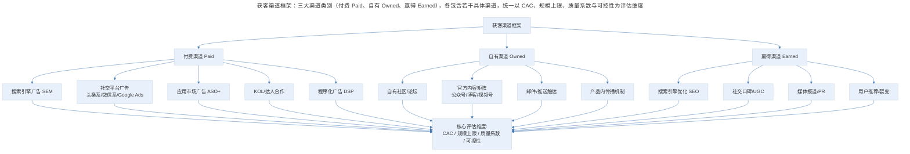
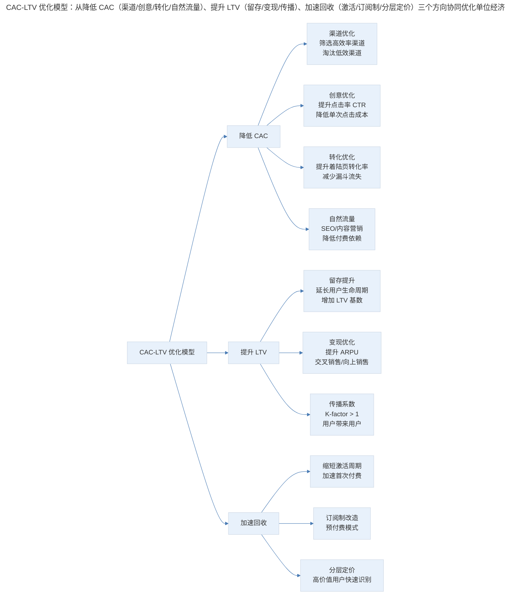

# 用户获取的策略框架与渠道方法论

## 1. 导言

用户获取（User Acquisition）是 AARRR 增长模型中扩大用户规模的入口环节，其核心原则是明确用户画像、定位用户聚集场景、设计高效触达路径。本文系统构建获客渠道的分类框架，深入分析获客成本（Customer Acquisition Cost, CAC）与生命周期价值（Lifetime Value, LTV）的优化模型，辨析"流量品类"与"利润品类"的战略关系，阐述内容驱动与利益驱动两种获客方式的适用边界，并结合 2024–2026 年隐私优先（Privacy-First）获客、AI 优化广告投放、产品驱动增长（Product-Led Growth, PLG）等前沿趋势，提出可操作的获客策略选择与优化框架。

## 2. 获客框架：核心原则与渠道体系

### 2.1 获客与传播的关系

在 AARRR 模型中，获客（Acquisition）与传播（Referral）分居两端，但两者共同构成用户规模的"进水管"。理解两者的区别与联系是制定获客策略的前提。

| 维度 | 获客 Acquisition | 传播 Referral |
|------|-----------------|---------------|
| 主动方 | 产品方直接触达潜在用户 | 现有用户向潜在用户推荐 |
| 参与方式 | 产品方为直接参与方 | 产品方为间接参与方 |
| 信任基础 | 品牌信任、广告信任 | 人际信任、社交背书 |
| 成本结构 | CAC 可控但通常较高 | 边际成本趋近于零 |
| 规模上限 | 受预算与渠道容量限制 | 受用户基数与传播系数限制 |
| 价值信号 | 用户被吸引而来 | 用户认可产品价值而主动推荐 |

传播指标的重要性高于获客指标——当用户愿意搭上自身信誉与时间向他人推荐产品时，至少说明其认可了产品的核心价值。因此，**在产品核心价值尚未成立之前，不应过度投入获客资源**。缺乏生命力的产品即使通过病毒传播或分销裂变获得短期用户量，也难以维持长期留存。

### 2.2 获客的核心原则

获客的核心原则可凝练为一条：**明确用户画像，找到他们聚集的地方，并想办法触达他们**。不论渠道如何变迁——从 PC 时代的搜索引擎到移动端的应用市场，再到微信生态的公众号与小程序——这一原则始终成立。

> 获客渠道框架：三大渠道类别（付费 Paid、自有 Owned、赢得 Earned），各包含若干具体渠道，统一以 CAC、规模上限、质量系数与可控性为评估维度。

### 2.3 渠道选择的决策框架

| 决策维度 | 评估问题 | 权重 |
|----------|----------|------|
| 用户匹配度 | 渠道用户画像与目标用户画像的重合度 | 高 |
| CAC 效率 | 单个获客成本是否在可承受范围内 | 高 |
| 规模上限 | 渠道可提供的用户量是否满足增长目标 | 中 |
| 质量系数 | 渠道获取用户的后续留存与付费表现 | 高 |
| 可控性 | 渠道规则变化对获客稳定性的影响 | 中 |
| 竞争强度 | 同类产品在该渠道的投放密度 | 中 |

### 2.4 CAC-LTV 优化模型

获客策略的底层逻辑是单位经济模型（Unit Economics）：只有当用户生命周期价值（LTV）显著高于获客成本（CAC）时，获客投入才是可持续的。行业公认的健康基准是 LTV/CAC ≥ 3:1。

| 指标 | 定义 | 计算公式 | 健康基准 |
|------|------|----------|----------|
| CAC | 获取单个付费用户的总成本 | 总获客支出 / 新增付费用户数 | 因行业而异 |
| LTV | 用户生命周期内贡献的净利润 | ARPU × 生命周期 × 毛利率 | ≥ 3 × CAC |
| LTV/CAC | 单位经济效率 | LTV / CAC | ≥ 3:1 |
| CAC 回收期 | 收回获客成本所需时间 | CAC / (ARPU × 毛利率) | ≤ 12 个月 |
| 获客边际效率 | 每增加 1 元获客预算带来的 LTV 增量 | ΔLTV / ΔCAC | > 1 |

CAC-LTV 优化路径：

> CAC-LTV 优化模型：从降低 CAC（渠道/创意/转化/自然流量）、提升 LTV（留存/变现/传播）、加速回收（激活/订阅制/分层定价）三个方向协同优化单位经济。

CAC 的行业基准（2024–2025）：

| 行业 | 平均 CAC | LTV/CAC 中位数 | CAC 回收期 | 趋势 |
|------|----------|---------------|-----------|------|
| B2B SaaS | $150–$500 | 3.5:1 | 8–14 个月 | 上升（竞争加剧） |
| B2C 电商 | $20–$80 | 2.5:1 | 3–6 个月 | 上升（隐私政策影响） |
| 移动游戏 | $1.5–$8 | 2.0:1 | 1–3 个月 | 上升（IDFA 政策） |
| 金融科技 | $50–$300 | 3.0:1 | 6–12 个月 | 上升（合规成本） |
| 在线教育 | $30–$120 | 2.0:1 | 4–8 个月 | 下降（AI 降本） |
| 社交/内容 | $2–$15 | 2.5:1 | 2–4 个月 | 上升（注意力竞争） |

## 3. 获客战略：流量品类、利润品类与获客方式

### 3.1 流量品类与利润品类的战略关系

在产品生态中，产品可分为"流量品类"（Traffic Category）与"利润品类"（Profit Category），两者的战略定位与运营逻辑截然不同。

| 维度 | 流量品类 | 利润品类 |
|------|----------|----------|
| 核心目标 | 聚集用户、建立流量池 | 变现用户、创造利润 |
| 用户关系 | 免费或低价获取 | 付费转化与深度服务 |
| 典型形态 | 社区、工具、内容平台 | 电商、SaaS、增值服务 |
| 成功路径 | 先有社区再变现 | 先有变现方法再做社区 |
| 成功率 | 较高（先社区后变现） | 较低（先变现后社区） |
| 内部冲突 | 倾向用户体验至上 | 倾向商业效率优先 |

流量品类与利润品类之间的导流衔接是产品战略中最常见的内部冲突。用户产品团队倾向于保护用户体验与品牌形象，商业产品团队则追求流量支持与转化效率。两者并非对立，而是需要如履薄冰地平衡与取舍。

衔接策略矩阵：

| 衔接模式 | 适用条件 | 实施要点 | 风险 |
|----------|----------|----------|------|
| 自然导流 | 流量品类与利润品类用户高度重合 | 场景化推荐，非强制 | 导流效率低 |
| 场景嵌入 | 利润品类功能可自然融入流量品类使用流程 | 无缝体验，降低感知干扰 | 设计复杂度高 |
| 交叉补贴 | 流量品类免费，利润品类付费 | 免费用户为付费用户提供网络效应 | 免费用户成本 |
| 生态整合 | 统一账号体系与会员身份 | 一站式体验，降低切换成本 | 组织协调难度大 |

典型案例：微信朋友圈为微视导流、QQ 面板为微信带量、阿里生态内淘宝与支付宝的流量协同——这些操作的本质都是流量品类向利润品类的导流衔接。

并非所有产品都需要自建流量池。对于不以"做巨头"为目标的产品，放下流量焦虑、专注服务与利润效率是更理性的选择。

| 战略选择 | 适用条件 | 优势 | 劣势 |
|----------|----------|------|------|
| 自建流量池 | 目标是平台级规模、有长期投入能力 | 流量自主可控、边际成本递减 | 投入大、周期长、风险高 |
| 购买流量 | 利润效率优先、LTV/CAC 健康 | 启动快、可量化、灵活调整 | 依赖外部渠道、成本波动 |
| 混合模式 | 成长期产品、需平衡速度与可持续性 | 兼顾短期效率与长期壁垒 | 资源分配复杂 |

核心逻辑：只要流量市场存在，即可从中购买合理价格的流量，通过高留存与传播逐渐稳固自身的流量结构。**关键不是拥有流量池，而是确保流量进入后的留存与变现效率**。

### 3.2 内容驱动与利益驱动获客

获客过程中吸引用户的方式可分为两大类：内容驱动（Content-Driven）与利益驱动（Incentive-Driven）。

| 维度 | 内容驱动 | 利益驱动 |
|------|----------|----------|
| 核心手段 | 文案、图示、视频说明产品价值 | 红包、礼物、返利等直接利益 |
| 用户动机 | 价值认同与需求匹配 | 利益获取与套利动机 |
| 用户质量 | 高（主动选择、真实需求） | 低—中（含灰产与羊毛党） |
| 长期价值 | 内容持续产生自然流量 | 利益停止则流量停止 |
| 成本结构 | 创作成本固定、边际成本趋零 | 按人头计费、边际成本恒定 |
| 典型案例 | 博客 SEO、公众号推文、视频营销 | PayPal 注册送钱、下载送红包 |

内容驱动的获客方式具有长期复利效应。一篇优质内容可通过搜索引擎持续吸引目标用户，形成"内容资产"。其核心原则包括：

**长期价值导向**：写作时应有意识地构建长期价值，避免过度依赖流行表达与时效性内容。优质内容应能在数月甚至数年后仍通过搜索持续获客。

**文案转化力**：文案质量对转化率的影响远超多数人的预期。同一渠道、同一受众，不同文案的转化率差异可达 3–5 倍。文案应从用户痛点出发，以具体场景与数据支撑价值主张。

**SEO 友好性**：内容应针对目标用户的搜索意图进行优化，确保在搜索引擎中获得持续曝光。关键词研究、内容结构化、内外链建设是基础操作。

利益驱动获客的典型案例是 PayPal 早期通过注册送 $10 快速获取大量用户。该策略在短期内效果显著，但伴随严重的灰产（Gray Market）与黑产（Black Market）风险——专业刷单者可利用虚假账号批量套利，导致"赔了夫人又折兵"。

| 风险类型 | 表现 | 管控措施 |
|----------|------|----------|
| 灰产套利 | 批量注册领取奖励后立即流失 | 设备指纹、行为验证、延迟发放 |
| 黑产攻击 | 自动化脚本批量注册 | 验证码、人机识别、IP 频率限制 |
| 用户质量低 | 利益驱动用户的留存率远低于自然用户 | 分层激励、行为门槛、质量筛选 |
| 成本失控 | 激励预算超支且 ROI 不达标 | 预算上限、动态调价、效果归因 |

利益驱动获客的适用边界：**仅在产品已验证核心价值、留存机制完善的前提下，作为加速获客的辅助手段使用**。若产品本身留存能力不足，利益驱动只会加速"漏桶效应"——用户来得快，走得更快。

## 4. 前沿范式：隐私优先获客与 PLG

### 4.1 隐私优先时代的获客变革（2024–2026）

2024–2026 年，全球隐私法规的收紧与第三方 Cookie 的逐步淘汰，正在从根本上重塑获客的技术基础与策略逻辑。

| 变革维度 | 2022（前 Cookie 时代） | 2024–2026（隐私优先时代） | 影响 |
|----------|----------------------|--------------------------|------|
| 用户追踪 | 第三方 Cookie 跨站追踪 | 第一方数据 + 隐私沙盒 | 定向精度下降 30–50% |
| 归因模型 | 最后点击归因 | 多触点归因 MTA / 增量归因 | 渠道 ROI 评估更复杂 |
| 定向能力 | 基于浏览行为的精准定向 | 上下文定向 + 群组定向 Cohort | CAC 上升 20–40% |
| 数据合规 | 相对宽松 | GDPR/CCPA/PIPL 严格执行 | 数据采集成本增加 |
| ID 体系 | 设备 ID（IDFA/GAID） | SKAdNetwork / 隐私归因 | 移动端归因精度下降 |

面对后 Cookie 时代的挑战，获客策略需从"精准追踪"转向"隐私合规下的高效触达"：

**第一方数据战略（First-Party Data Strategy）**：构建自有数据资产，通过产品内行为采集、用户自愿授权、CRM 数据整合，建立不依赖第三方追踪的用户洞察体系。第一方数据的定向精度虽低于全量 Cookie 追踪，但合规性与可持续性远优于后者。

**上下文定向（Contextual Targeting）**：不依赖用户行为数据，而是根据内容场景匹配广告。例如，在健身内容旁投放运动装备广告。AI 技术的进步使上下文定向的精度显著提升，2025 年的 AI 上下文定向效果已接近传统行为定向的 70–80%。

**群组定向（Cohort Targeting）**：Google Privacy Sandbox 提出的替代方案，将具有相似浏览行为的用户归入群组，广告主定向群组而非个体。精度有所下降，但隐私合规性大幅提升。

**增量测试（Incrementality Testing）**：在归因精度下降的背景下，通过科学的 A/B 测试（如 Geo Lift Test、Ghost Ad Test）直接测量获客渠道的增量贡献，而非依赖归因模型推算。

AI 技术正在重塑广告投放的效率边界：

| AI 广告技术 | 应用场景 | 效果提升 | 成熟度 |
|------------|----------|----------|--------|
| 智能出价 Smart Bidding | 根据转化概率自动调整出价 | CPA 降低 15–30% | 成熟 |
| 创意生成 AIGC | 自动生成广告文案与素材 | 创意测试效率 10x | 快速成长 |
| 受众扩展 Lookalike+ | AI 扩展高价值用户相似人群 | CAC 降低 10–20% | 成熟 |
| 预测性预算分配 | AI 预测各渠道 ROI 并动态调预算 | 整体 ROI 提升 15–25% | 成长 |
| 跨渠道归因 | AI 多触点归因模型 | 渠道评估准确度 +30% | 成长 |

### 4.2 产品驱动增长（PLG）的获客范式

产品驱动增长（Product-Led Growth, PLG）是 2024–2026 年最具影响力的获客范式变革。其核心逻辑是：**产品本身即是最有效的获客渠道**——通过免费版或试用版让用户自主体验产品价值，产品内的传播机制与付费转化驱动增长，而非依赖传统销售或广告投放。

| 维度 | 传统获客（Sales-Led） | PLG 获客（Product-Led） |
|------|----------------------|------------------------|
| 获客方式 | 销售团队主动触达 | 产品自驱，用户自主发现 |
| 首次体验 | 销售演示 Demo | 免费版/试用版自主体验 |
| 转化路径 | 漏斗：线索→商机→成交 | 飞轮：体验→价值→付费→传播 |
| CAC 结构 | 高（销售人力成本） | 低（边际成本趋零） |
| 扩展性 | 受销售团队规模限制 | 产品即渠道，天然可扩展 |
| 典型案例 | Salesforce 传统版 | Slack、Notion、Figma |

PLG 获客的关键设计要素：

1. **低门槛入口**：免费版功能足以展示核心价值，但设置合理的使用边界引导付费
2. **产品内传播机制**：协作功能天然驱动邀请（如 Figma 的分享链接、Slack 的频道邀请）
3. **自服务升级**：用户无需联系销售即可完成从免费到付费的升级
4. **数据驱动的升级触发**：当用户使用量接近免费版上限时，系统自动提示升级价值

PLG 并非万能范式，其适用性取决于产品特征：

| 产品特征 | PLG 适用性 | 原因 |
|----------|-----------|------|
| 自服务产品（协作工具、设计工具） | 高 | 用户可独立评估价值 |
| 复杂企业软件（ERP、CRM 定制版） | 低 | 需要专业实施与配置 |
| 消费级应用（社交、内容） | 高 | 天然具备传播属性 |
| 高客单价 B2B（企业安全、基础设施） | 低 | 决策链长，需销售介入 |
| 平台型产品（市场、生态） | 中 | 需同时解决供需两端冷启动 |

## 5. 实践指南：获客策略实施框架

### 5.1 获客策略选择矩阵

| 产品阶段 | 核心获客策略 | 辅助策略 | 预算分配 |
|----------|-------------|----------|----------|
| 冷启动期 | 内容驱动 + 种子用户定向 | 利益驱动（小规模测试） | 70% 内容 / 30% 付费 |
| 成长期 | 付费渠道规模化 + PLG 机制 | 内容持续积累 | 50% 付费 / 30% PLG / 20% 内容 |
| 成熟期 | PLG 飞轮 + 渠道优化 | 品牌广告 | 40% PLG / 35% 付费 / 25% 品牌 |
| 衰退期 | 高 ROI 渠道精选 + 召回 | 新渠道探索 | 60% 精选 / 40% 探索 |

### 5.2 获客优化的关键指标体系

| 指标层级 | 核心指标 | 辅助指标 | 预警阈值 |
|----------|----------|----------|----------|
| 效率层 | CAC、LTV/CAC | 各渠道 CAC 对比 | LTV/CAC < 2:1 |
| 质量层 | 获客用户 D7/D30 留存 | 获客用户付费转化率 | D7 留存 < 行业基准 50% |
| 规模层 | 月新增用户数 | 各渠道贡献占比 | 单渠道依赖 > 60% |
| 速度层 | CAC 回收期 | 激活到付费时间 | 回收期 > 18 个月 |

### 5.3 获客实验的标准化流程

1. **假设形成**：基于数据分析与用户洞察，形成可验证的获客优化假设
2. **实验设计**：定义实验组/对照组、样本量、观测周期与核心指标
3. **最小化实施**：以最小成本验证假设方向，避免过早大规模投入
4. **效果评估**：基于统计显著性判断实验结果，区分信号与噪声
5. **规模化决策**：效果达标则规模化推广，未达标则迭代假设

## 6. 进阶延展：核心要点回顾

用户获取的策略框架以"明确画像→定位聚集→高效触达"为核心原则，渠道选择应基于用户匹配度、CAC 效率与质量系数进行系统评估。内容驱动与利益驱动各有适用边界，前者构建长期复利，后者加速短期规模但伴随质量风险。"流量品类"与"利润品类"的衔接需要平衡用户体验与商业效率。2024–2026 年，隐私优先时代正在重塑获客的技术基础，AI 优化投放与 PLG 范式为获客效率开辟了新路径。获客策略的实施应遵循"诊断→假设→实验→规模化"的科学方法，以单位经济模型（LTV/CAC）为底线约束，避免盲目追求规模而忽视效率。

---

## 参考资料

- Buffett, M., & Ellwood, I. (2024). *The Brand Choice: The Hidden Psychology of Why Consumers Buy*. Kogan Page.
- Cagan, M. (2017). *Inspired: How to Create Tech Products Customers Love* (2nd ed.). Wiley.
- Chen, A. (2021). *The Cold Start Problem: How to Start and Scale Network Effects*. Harper Business.
- Google. (2024). *Privacy Sandbox: Progress and timeline*. Google Developers Documentation.
- Lenny Rachitsky. (2024). *How the best companies think about CAC*. Lenny's Newsletter.
- McKinsey & Company. (2024). *The future of performance marketing in a privacy-first world*. McKinsey Digital.
- Reforge. (2024). *Acquisition: Channel strategy and CAC optimization*. Reforge Programs.
- Seufert, E. (2024). *Mobile User Acquisition: Post-IDFA strategies and benchmarks*. UA Academy Report.
- Slack. (2023). *Product-Led Growth: Building a self-serve revenue engine*. Slack Internal Publication.
- Wang, W. (2025). *Privacy-first acquisition: Strategies for the post-cookie era*. Journal of Digital Marketing, 15(1), 23–41.