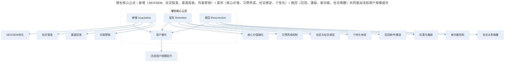
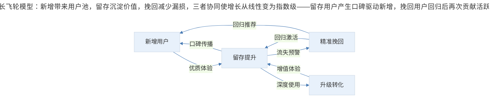
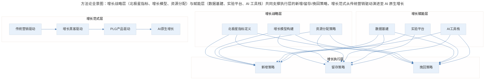

# 增长黑客的核心公式

## 1. 导言

"增长黑客"这个词最近特别火，这个概念最初是由互联网创业者肖恩·埃利斯（Sean Ellis）提出的，他希望能够做到"把钱花在刀刃上"，创新性地实现增长。近几年，硅谷的各大公司都已经建立了自己的增长黑客部门。

很多人听到这个词，觉得既然是"黑客"，一定是潜入什么神秘的系统，利用看不见摸不着的、神秘的方式实现增长。实际上，以前的产品增长主要靠砸钱，而增长黑客是用技术和数据来分析如何增长，找到影响增长的切入点，然后精确执行，从而实现病毒式增长。

增长黑客的核心公式——**增长 = 新增 + 留存 + 挽回（Growth = Acquisition + Retention + Resurrection）**——看似简单，实则蕴含了产品增长的完整逻辑。本文系统阐述这一公式的内涵、应用、增长飞轮模型、增长技巧与经典案例，并结合 AI 时代的新变化，构建完整的增长黑客方法论全景。

## 2. 核心公式：增长 = 新增 + 留存 + 挽回

### 2.1 增长黑客的团队定位

在硅谷，不同公司的增长黑客团队的规模不同，部门划分也不同。比如，Atlassian 把负责增长黑客的专家划分到了市场营销部门；而在 Facebook，有很多的增长黑客专家，他们中有些人做的工作很像数据科学家，所以就和数据科学家并到了一起，另外的增长黑客专家则并入了专门的增长团队，直接汇报给增长团队的领导。

但是，**无论部门怎么划分，增长黑客团队的任务，都是和产品团队、营销团队、数据团队并肩作战，通过分析数据趋势找到产品方向，利用营销技巧实现产品增长。**

### 2.2 核心公式的结构

增长黑客的方式有千万种，但是万变不离其宗，它的本质就是核心公式：**增长 = 新增 + 留存 + 挽回**。

> 增长核心公式：新增（SEO/SEM、社交裂变、渠道投放、内容营销）+ 留存（核心价值、习惯养成、社交绑定、个性化）+ 挽回（召回、激励、新功能、社交唤醒）共同驱动活跃用户规模提升。

### 2.3 公式的两大典型应用

**应用一：提升产品的用户活跃指标**

如果你的目的是增长 APP 的活跃用户数量，那么让更多的用户下载这个 APP，就是新增；让已经下载的用户能够继续使用，就是留存；让已经删掉 APP 但是注册过的用户重新下载并使用，就是挽回。

如果新增的数量非常多，但流失的数量却远远超过新增的数量，那么不管你通过什么方式（比如，优化搜索引擎，或者赞助更多广告位来扩大宣传力度）让更多的用户下载这个 APP，最终的活跃用户数都不会好看。

所以，**作为产品经理，如果你发现产品的用户活跃指标就是上不去，你首先应该分析新增、留存和挽回这三个方面，看看短板到底在哪里，从而制定出不同的策略。**

**应用二：规划大型公司的增长团队的架构**

如果你的公司已经很大了，现在要建立自己的增长团队，你也可以按照增长黑客的核心公式来规划增长团队的架构。在 Instagram 工作的时候，它的增长团队的架构就是按照增长黑客的公式进行划分的，包括了新增团队、留存团队和挽回团队，每个团队各司其职。

- **新增团队**，主要负责搜索引擎优化、APP 下载广告，鼓励用户分享给其他朋友下载 APP。例如，Instagram 以前通过 Facebook 引流，用户通过 Facebook 可以直接获得 Instagram 的下载链接；Facebook 还开通了一键邀请通讯录好友的功能。另外，许多明星特别喜欢使用 Instagram，很多娱乐新闻由 Instagram 曝出，这些新闻也激起用户下载 Instagram 看原文的兴趣。
- **留存团队**，主要负责研究用户为什么会在使用一个月后就流失了（比如，可能是这些用户没有关注其他内容，或者他们的朋友没用这个 APP 所以他们用起来也没意思），通过找出用户流失的原因来提升用户的留存数量。
- **挽回团队**，负责让不再活跃的用户重新下载或者重新开始每周登录 APP，他们通常采取的方式是给用户发消息、邮件，或者举办一些用户活动等。之前交友 APP Tinder 刚起步时，就是通过办派对的方式，让每个学校最好看的姐妹会成员们加入 Tinder，漂亮女生来了，就不用再发愁男生不来了。

## 3. 增长飞轮与经典案例

### 3.1 增长飞轮模型

增长黑客的三要素并非孤立运作，而是相互驱动、形成飞轮效应：

> 增长飞轮模型：新增带来用户池，留存沉淀价值，挽回减少漏损，三者协同使增长从线性变为指数级——留存用户产生口碑驱动新增，挽回用户回归后再次贡献活跃度。

飞轮的核心逻辑：**新增带来用户池，留存沉淀价值，挽回减少漏损，三者协同使增长从线性变为指数级。** 留存用户产生口碑，口碑驱动新增；挽回用户回归后再次贡献活跃度，形成正向循环。

### 3.2 经典案例一：领英——全链路增长教科书

领英是增长黑客核心公式的完美实践者，它的增长策略覆盖了新增→留存→挽回→升级的完整链路。

**新增阶段**：领英会时不时地给用户发消息，告诉最近谁又浏览了主页，但是只显示三个人，如果想看到所有浏览主页的人，就需要购买会员。这就是领英的新增团队在发挥作用。

**留存阶段**：当用户花钱买完会员后，领英会每个星期发邮件告诉谁浏览了主页，这些人来自什么公司；最近哪些公司的人看主页比较多，他们是 HR 还是产品部门的负责人；以及，在这个圈子里的被浏览次数是什么水平等等。这些信息让用户体会到了成为会员可以享受的增值服务。

**挽回阶段**：当用户不再订阅后，随后的几周时间里，会收到很多来自领英的邮件，告诉可以打折购买会员，或者正在举办什么活动，如果现在马上加入会员的话可以得到很多福利。

**升级阶段**：用户购买会员不久，领英就发邮件鼓励从月度订阅升级到年度订阅，并且开始推销更贵的会员服务。仔细看领英的升级邮件界面，它有意把后两个升级选项设置成了按钮的形式，让用户升级为更高级别的会员。所以，产品细节上的优化，往往可以提升整个产品的体验，从而促进产品的增长。

### 3.3 经典案例二：Netflix——挽回策略的标杆

Netflix 的挽回团队工作方式堪称经典。当用户停止使用 Netflix 后，它会给用户发邮件，说新增了很多获奖影片、电视剧，你都看不了好可惜啊，让你免费再使用一个月。

这其实就是一个不错的挽回策略，很多收到邮件的用户都会选择继续使用，这部分用户中又有很多会继续花钱购买会员。

## 4. 增长技巧与三层视角

### 4.1 四大增长技巧

领英和 Netflix 采用的产品增长策略，是比较常规的方式，效果也是中规中矩。还有一些产品采用的增长策略，采用了一些创新型的"野路子"，达到了事半功倍的效果。

**技巧一：社交推荐**

拼多多就是一个典型的例子，它的新增团队利用微信群实现了病毒式增长。前段时间火热的百万英雄，如果成功推荐了新用户，就会送一条命，这一招的效果非常好。它是抓住了用户在"Game Over"的情况下，想要续命继续的心理，所以采用这种"雪中送炭"的方式可以刺激他们推荐给其他朋友。

另外，极客时间 APP 有一个功能，就是可以把你付费购买的课程中的文章分享给朋友，上面会写"曲晓音花钱请你看××××（某篇文章）"，这样朋友觉得占了便宜，你自己也会觉得有面子。如果朋友读完了这篇文章，觉得不错，自然就会购买课程了，这种方式就比普通的"推荐好友，给你打折"这样的手段要高明得多。

**你可以思考一下，有哪些方式可以让用户有动力把你的产品推荐给自己的好友，这个推荐方式可以让用户解决燃眉之急，或者让他们觉得获得社交认可。**

**技巧二：互相借流量**

美国的很多网红惯用的方式就是互相分享彼此的视频，如果让一个百万粉丝的网红分享你的视频，就有可能增加百万级的流量。新浪微博的转发，就是利用了互相借流量的方式。关于这一点，你也可以思考一下可以和哪些 APP 互相导流，促进双方的增长。但是，这种方式对引流增加新增用户有很大帮助，但是并不怎么适用于留存和挽回的情况。

**技巧三：集邮**

集邮是一个很好用的留存技巧。小时候，会为了集齐水系小精灵买各种各样的宠物小精灵的卡，相信你也有过这样的体验。之前火遍美国的 Pokemon Go，就是利用了这样的方式。如果想要集齐宠物小精灵，就要不断刷不断玩。玩了很久之后，发现还差两个小精灵就集齐了，于是只能继续拼命玩，并祈祷可以拿到缺失的两个小精灵。另外，集拉环中大奖，也是采用的同样的方式，目的都是为了增加重复消费，提高留存率。这样的方式是利用用户想要尽善尽美的心态，让他们存有抱憾感，他们就会一直尝试一直尝试，从而增加活跃度和留存率。

**技巧四：抽奖**

这是一个屡试不爽的招数，既可以用来增加新用户，又可以增加留存率，甚至可以挽回用户。抽奖规则是由你制定的，你可以根据产品目标量身定制规则，所以这种方式可以满足不同的增长需求。比如，王者荣耀的抽奖活动，规则是：邀请朋友后，可以获得抽奖机会，这样做的目的是为了提高"新增"；也可以让你在连续玩 10 天后抽奖，这种方式就是通过提升"留存"的方式提升整个产品的用户指标了。

### 4.2 三层深度视角

**🟢 进阶视角（1-3 年产品经验）**

对于初入增长领域的产品经理，核心是**掌握公式、找准短板**：

- **诊断优先**：当 DAU 增长停滞时，不要急于加投放，先拆解新增、留存、挽回各自的贡献率。如果 7 日留存低于 20%，问题大概率在产品本身而非获客
- **单一杠杆起步**：选择一个最短的短板集中突破。留存率每提升 5%，等效于新增提升 15%-20% 的效果
- **数据基建**：确保埋点完整，能追踪用户从注册到流失的全生命周期。没有数据，增长黑客就是空中楼阁
- **小步快跑**：每个增长实验控制在 1-2 周内完成，用 A/B 测试验证效果，避免大规模投入后才发现策略无效

**🔵 资深视角（3-5 年产品经验）**

对于有经验的增长产品经理，核心是**构建体系、驱动飞轮**：

- **飞轮设计**：不再孤立看待新增/留存/挽回，而是设计让三者相互驱动的机制。例如，留存用户产生 UGC 内容→内容吸引新增→新增带来社交关系→社交关系提升留存
- **漏斗精细化**：将 AARRR 漏斗的每个环节进一步拆解。新增不只是"下载"，而是曝光→点击→注册→激活→首次价值体验的完整链路，找到每一步的转化瓶颈
- **归因模型**：从最后点击归因升级到多触点归因，理解用户转化路径上的每个触点贡献，合理分配增长资源
- **组织协同**：推动增长团队与产品、运营、数据团队建立周级别的实验评审机制，确保增长实验的节奏和质量

**🟣 专家视角（5 年+产品经验）**

对于资深增长领导者，核心是**战略布局、生态构建**：

- **增长模型构建**：为业务建立量化增长模型，将新增、留存、挽回的微观行为映射到宏观业务指标（LTV、CAC、Payback Period），用模型指导资源分配
- **反脆弱设计**：增长不能依赖单一渠道。当 iOS 隐私政策变更导致 Facebook 投放 ROI 骤降时，有多元化获客渠道的团队受到的冲击最小
- **增长文化**：在全公司范围内建立"数据驱动+快速实验"的增长文化，让每个团队都具备增长思维，而不仅仅是增长团队的事
- **长期价值守卫**：警惕短期增长手段对长期品牌和用户信任的侵蚀。刷量式增长可能带来数字上的繁荣，但会透支产品的未来

## 5. 实践指南：方法论全景与思考题

### 5.1 方法论全景图

> 方法论全景图：增长战略层（北极星指标、增长模型、资源分配）与赋能层（数据基建、实验平台、AI 工具栈）共同支撑执行层的新增/留存/挽回策略，增长范式从传统营销驱动演进至 AI 原生增长。

### 5.2 三层思考题

**🟢 进阶（1-3 年）**

1. 抖音在增长方面都做了哪些工作，分别属于增长黑客核心公式的哪一部分？
2. 选择一个你常用的 APP，分析它的"新增→留存→挽回"策略分别是什么，哪个环节最薄弱？
3. 如果一个产品的 7 日留存率只有 15%，你会优先改善留存还是加大新增投放？为什么？

**🔵 资深（3-5 年）**

1. 如何设计一个让新增、留存、挽回三者相互驱动的增长飞轮？请以你负责的产品为例画出飞轮图。
2. 当 iOS 隐私政策变更导致精准投放能力下降时，你会如何调整增长策略？
3. 如何建立增长实验的质量标准，避免"数据驱动"变成"数据驱动的故事"？

**🟣 专家（5 年+）**

1. 如何为你的业务构建一个量化增长模型，将微观行为映射到 LTV/CAC 等宏观指标？
2. 在 AI 时代，增长团队的组织架构应该如何演进？传统的"新增/留存/挽回"三分法是否仍然适用？
3. 如何在追求短期增长指标和守护长期用户价值之间找到平衡？请结合具体案例说明。

## 6. 进阶延展：AI 时代的新变化与关键术语

### 6.1 AI 驱动增长

2024 年以来，增长黑客领域正在经历由 AI 驱动的深刻变革。传统的"新增+留存+挽回"公式依然成立，但每个要素的实现方式已经被 AI 重新定义。

**AI 个性化推荐**：传统的新增策略依赖广撒鱼式的投放，而 AI 可以根据用户画像实现千人千面的获客。例如，TikTok 的推荐算法不仅用于内容分发，还用于新用户引导——根据用户前 3 秒的滑动行为，预测兴趣并定制首页内容，将新用户 7 日留存提升了 30% 以上。

**预测性留存**：AI 模型可以在用户流失前 7-14 天识别出流失信号（使用频率下降、会话时长缩短、核心功能使用减少），并自动触发个性化的留存干预。Spotify 利用机器学习预测用户取消订阅的概率，在临界点前推送"年度听歌报告"等情感化内容，将流失率降低了 15%。

**AI 挽回策略**：传统的挽回邮件是统一模板群发，而 AI 可以根据用户的历史行为、流失原因、偏好特征生成个性化的挽回方案。Netflix 已经使用 AI 为不同流失用户定制不同的免费回归优惠——对价格敏感型用户推送折扣，对内容需求型用户推送新片单。

### 6.2 PLG（Product-Led Growth）

PLG 是近年来最重要的增长范式转变，其核心理念是**让产品本身成为增长的引擎**，而非依赖销售或营销驱动。

PLG 的关键特征：

- **自助式体验**：用户可以免费试用核心功能，无需联系销售
- **价值先于付费**：用户先体验到价值，再决定是否付费
- **产品内病毒式传播**：用户在使用过程中自然地邀请协作伙伴
- **数据驱动的升级提示**：基于用户行为数据，在恰当的时机提示升级

Slack、Figma、Notion 都是 PLG 的典型代表。Slack 的增长几乎不依赖传统营销，而是通过团队内部的有机传播——一个团队使用后，成员会将其带入其他团队。

### 6.3 AI 增长工具栈与增长工程化

2024-2026 年，一批 AI 原生增长工具正在重塑增长团队的工作方式：

| 工具类别 | 代表产品 | 核心能力 |
|---------|---------|---------|
| AI 用户分析 | Amplitude AI、Mixpanel Spark | 自动发现用户行为模式，预测流失 |
| AI 内容生成 | Jasper、Copy.ai | 自动生成 A/B 测试文案，千人千面营销内容 |
| AI 实验平台 | Optimizely AI、LaunchDarkly | 自动分配流量，智能终止低效实验 |
| AI 用户运营 | Braze AI、Iterable | 智能触达时机优化，个性化消息编排 |
| PLG 分析 | Pendo、Heap | 产品内行为追踪，自动识别升级时机 |

增长正在从"黑客式"的灵光一现走向工程化的系统实践：

- **实验工厂**：头部公司每周运行数百个 A/B 测试，增长团队更像工程团队，有标准化的实验设计、执行、分析流程
- **Feature Flag 驱动**：通过功能开关控制新功能的灰度发布，实现快速验证和回滚
- **增长指标仪表盘**：实时监控新增、留存、挽回的核心指标，异常自动告警
- **自动化流水线**：从假设生成→实验设计→代码实现→流量分配→结果分析，全流程自动化程度越来越高

### 6.4 核心要点回顾

有了核心公式以后，当你发现产品增长乏力时，就可以分析产品增长停滞具体是由哪个方面引起的，然后对症下药，制定高效的产品增长策略。很多大公司都会按照这个公式把自己的增长团队划分为新增、留存和挽回三组。如果你在小公司，增长团队没有这么大的规模，你也可以借鉴这种方式把你的增长工作分成新增、留存和挽回这三部分。

而在 AI 时代，这个公式的每个要素都在被重新定义：AI 让新增更精准、让留存更智能、让挽回更个性化。PLG 让产品本身成为增长引擎，增长工程化让实验从艺术变为科学。但万变不离其宗——理解用户、创造价值、数据驱动，永远是增长黑客的底层密码。

---

## 参考资料

- 肖恩·埃利斯. 《增长黑客》. 增长黑客概念提出者的经典著作
- Sean Ellis & Morgan Brown. *Hacking Growth*. 英文原版，案例更丰富
- Alistair Croll & Benjamin Yoskovitz. 《精益数据分析》. 数据驱动增长的方法论
- Wes Bush. *Product-Led Growth*. PLG 范式的系统指南
- Ron Kohavi 等. *Trustworthy Online Controlled Experiments*. A/B 测试与实验设计的权威指南
- Reforge Growth Series——Brian Balfour（前 HubSpot VP Growth）的增长系列课程
- Lenny's Newsletter——Lenny Rachitsky 的增长与产品深度周报