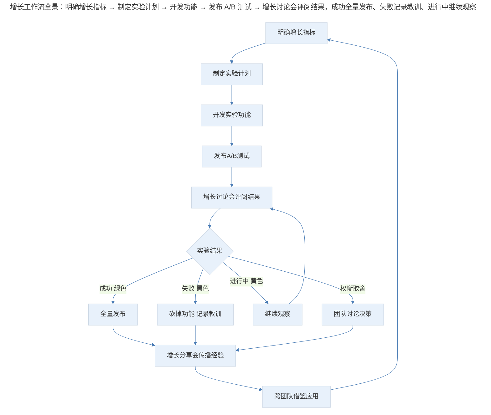
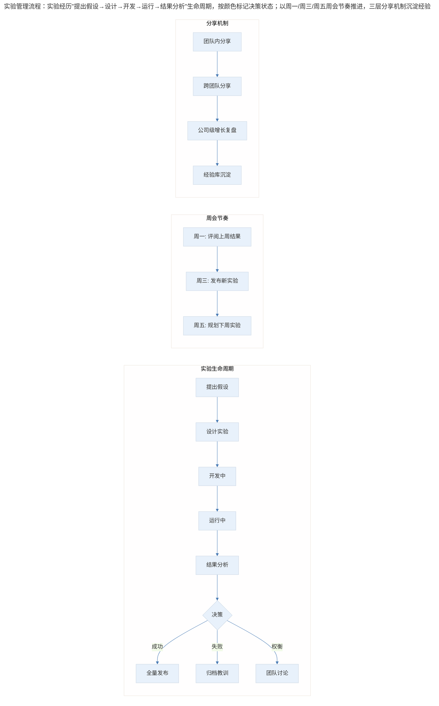
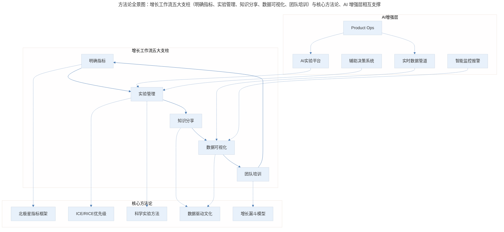

# 想要增长，你的团队需要高效的工作流

## 1. 导言

产品增长是产品成功的必经之路，也是最最重要的部分，而迅猛的增长离不开优秀的增长团队。

但是，并不是只有专门负责增长的产品经理或者增长黑客专家才能帮助产品实现增长，每个产品经理都有责任让自己的团队具备产品增长的能力。本文分享如何设置团队的工作流程，才能最大化团队的增长能力。

## 2. 工作流全景：五大支柱

增长工作流由五大支柱构成，形成持续循环：

> 增长工作流全景：明确增长指标 → 制定实验计划 → 开发功能 → 发布 A/B 测试 → 增长讨论会评阅结果，成功全量发布、失败记录教训、进行中继续观察，最终通过增长分享会传播经验并回流至指标设定。

### 2.1 支柱一：明确增长指标

让团队成员明确要增长的指标到底是什么，这个问题看似容易，但即使是硅谷顶尖科技公司的产品团队，都没有做到这一点。特别是在大型公司，每个团队负责一个细分领域，很多时候大家各自专注于自己的日常工作中，往往会忽略了思考自己的工作到底是提升了公司的什么指标，是如何帮助公司的。

比如，你的团队在视频部门负责捕捉违规内容，那么你们要提升的指标可能是捕捉的准确率，也可能是对捕捉内容类别（成人内容、诈骗内容、违法内容等）的覆盖率，这个时候团队成员很可能就乱了方向，不清楚要增长的到底是什么指标。

这个时候，就需要你对大家说："现阶段我们需要提升捕捉的准确率，提升我们的监管能力，这样才能确保其他团队把更多的网红吸引到我们的平台上。但是，我们现在只是吸引美女网红，所以成人内容可能需要多加注意。"这样的方式，既明确了团队的增长目标，又可以提醒团队成员要兼顾的问题，从而实现产品健壮有力的增长。

**在这里，产品经理需要注意的是，不要怕啰嗦，可以重复重复再重复，一定要达到任何一个团队成员都可以不假思索就能回答出来的程度。**

### 2.2 支柱二：增长讨论与分享会议

如果你的团队经常通过 A/B 测试来决定发布哪个版本，那么你就需要一个增长实验讨论会。

这种会议常见于负责核心体验的团队，比如 Facebook 中负责信息流核心体验的团队，他们稍微把新鲜事的行距改一改，都会影响用户的使用产品的时间，所以每个新功能都需要 A/B 测试，这时组织一个增长实验讨论会就非常必要了。

一般这样的讨论会用一个 Excel 文档，记录所有的小实验，比如按钮颜色的改动，行距的改动，甚至信息流推荐算法的每一个新版本，对应负责人，实验发布时间，实验涉及百分之多少的哪个国家的用户，实验结果是什么，实验界面的链接等等。

你可以在这个 Excel 文档中，用颜色表示实验成功与否，一目了然。比较常用的做法是：绿色表示实验成功，可以发布给所有用户；黑色表示实验失败，肯定不能发布；黄色表示实验正在进行中；红色表示实验正在开发中。

这样的增长讨论会，每周开一次，讨论上周发布的实验的结果，本周开发完毕的实验该发布给哪些用户进行测试，计划下周应该做什么新的增长项目。

实验管理流程：

> 实验管理流程：实验经历"提出假设→设计→开发→运行→结果分析"生命周期，按颜色标记决策状态；以周一/周三/周五周会节奏推进，通过团队内、跨团队、公司级三层分享机制沉淀经验。

这里有一点需要注意，很多产品的功能虽然很酷炫，但就是对用户指标没有积极作用，所以注定了实验会失败，这个功能会被砍掉。

但是，有些工程师和设计师不能正视这些不理想的实验数据，他们会想方设法地掩盖或者编造数据企图蒙混过关。但是，进行 A/B 测试的正确心态是，要像科学家做实验那样严谨，只有这样才能找到真相，实验失败也可以帮助团队成员找到新的、更准确的方向。

除了增长讨论会，还会组织分享增长的会议，因为有些增长方法可以举一反三，应用到其他场景中。这个会议上，大家可以分享每个实验的具体数据，也有数据科学家分析从最近发布的几个实验中找到了什么共同点，以及其他部门的增长实验有什么心得。

比如，当你发现在推荐算法中增加用户最近浏览内容的权重，而不只是关注用户一共看了相关内容几次，可以增加用户的使用时间。信息流推荐系统的工程师发现这个方法管用的时候，可以推荐给其他团队。

这种分享的好处是可以节省大量的试错时间，一个"坑"只由一个团队趟一次就够了，整个公司的所有团队都可以借鉴经验，以免多次重复同样的错误。

总结一下，**增长讨论会和分享会的目的是，和团队成员高效地评阅实验结果，砍掉表现不好的功能；对于表现好的功能，一起制定下一步发布计划；对于一些需要权衡取舍的问题，比如一个核心指标上升了，但是另一个指标却下降了的情况，给团队成员讨论的机会，一起作出产品决定。**

### 2.3 支柱三：增长大屏幕

在 Facebook，每个团队都配有一个大屏幕（一般就是一个巨大的显示屏），上面会显示最在乎的数据是什么。这样做的最大好处是，吸引团队成员的注意力。试想一下，每天上班都看到最在乎的是什么数据，那就相当于每天都在潜意识里强化这个关键点，无形中就提升了整个团队的工作效率。

另外，大家每天开站会时都会看到这个大屏幕，了解核心数据表现如何，有没有什么奇怪的现象。比如，某个数据突然暴跌，是不是出现了 Bug；又比如，某个数据今天突然暴涨，是不是因为今天是节假日，大家都在家，所以使用 APP 的用户一下子就多了。

团队还有增长报警系统，如果数据暴跌的情况超过了某个限定值，那么系统就会自动给对应的工程师发邮件警报，大屏幕的字也会变为红色大字。这样做的目的是，方便大家第一时间注意到问题，并灵活安排手头的工作，优先解决这个新问题。

### 2.4 支柱四：团队增长培训

所有的设计师都应该了解基本的增长技巧，比如按钮设计成什么样用户更容易点击，怎么设计提醒消息用户更容易注意到。所有的工程师也应该知道基本的增长公式，即使他们不在增长团队。

在产品团队重点开发新产品、还没有把产品增长作为重点时，不懂增长的工程师不知道如何权衡取舍自己手头的任务，不懂增长的设计师只追求好看，不在乎也不知道如何提升用户体验。而且，给这些工程师、设计师提意见时，他们也不能充分理解为什么要按照方法来。

后来，邀请增长团队的专家给他们讲授增长经验。之后，他们工作起来更能关注用户体验，更能思考如何一步步提升产品指标，交流起来更顺畅、工作效率也更高了。

因此，**建议是让团队的每一个人，包括营销人员、设计师、工程师、用户体验调研师等等，都上一堂增长课。因为增长是每个人的责任，不能仅靠产品经理一人"空喊口号"。**

## 3. 实验管理与科学心态

### 3.1 增长讨论会的核心价值

增长讨论会和分享会的目的是：和团队成员高效地评阅实验结果，砍掉表现不好的功能；对于表现好的功能，一起制定下一步发布计划；对于一些需要权衡取舍的问题，给团队成员讨论的机会，一起作出产品决定。

正确的 A/B 测试心态是：要像科学家做实验那样严谨，只有这样才能找到真相，实验失败也可以帮助团队成员找到新的、更准确的方向。**不要掩盖或编造数据**——这是对实验真相的背叛。

### 3.2 三层深度视角：明确指标

**🟢 进阶 1-3 年：指标对齐的执行者**

- 确保自己能清晰回答"我的工作提升了什么指标"
- 在站会、周会中主动复述团队增长目标
- 学会区分虚荣指标（Vanity Metric）与北极星指标（North Star Metric）

**🔵 资深 3-5 年：指标体系的构建者**

- 设计团队指标层级：公司级→产品线级→团队级→个人级
- 建立指标间的因果关系模型，识别领先指标与滞后指标
- 处理指标冲突场景：当一个指标上升但另一个下降时，制定决策框架

**🟣 专家 5 年+：指标战略的制定者**

- 在公司层面定义北极星指标，确保跨团队对齐
- 构建指标治理体系，防止指标被操纵或误读
- 在业务转型期重新定义增长指标，引导组织方向转变

### 3.3 三层深度视角：实验管理

**🟢 进阶 1-3 年：实验的参与者**

- 规范记录每个实验的假设、变量、样本量、结果
- 学会用颜色标记系统管理实验状态
- 培养科学实验心态：失败≠白费，失败=排除错误方向

**🔵 资深 3-5 年：实验的设计者**

- 设计统计显著性足够的实验方案，避免假阳性
- 建立实验优先级框架（ICE/RICE 评分），聚焦高价值实验
- 处理多实验交互效应（Interaction Effect），确保实验互不干扰
- 推动建立团队实验文化，让"用数据说话"成为默认工作方式

**🟣 专家 5 年+：实验体系的架构者**

- 构建公司级实验平台，支持多臂老虎机（Multi-armed Bandit）、分层实验（Layered Experimentation）等
- 制定实验伦理规范，保护用户体验底线
- 设计组织级实验节奏：平衡探索性实验与利用性实验的比例
- 在战略层面解读实验数据，识别超越单个实验的系统性规律

## 4. 数据驱动与团队培训

### 4.1 增长大屏幕与数据文化

增长大屏幕的核心价值是让核心数据成为团队注意力的焦点。配合增长报警系统（数据暴跌超过限定值自动发邮件警报、屏幕变红），可以第一时间发现问题并灵活安排工作优先级。

**三层深度视角：**

**🟢 进阶 1-3 年：数据的阅读者**

- 每天关注大屏幕核心数据，培养数据直觉
- 学会区分正常波动与异常信号
- 在站会中主动报告观察到的数据变化

**🔵 资深 3-5 年：仪表盘的设计者**

- 选择最关键的 5-7 个指标展示，避免信息过载
- 设计合理的报警阈值，减少误报和漏报
- 建立数据异常的分级响应机制

**🟣 专家 5 年+：数据驱动的文化塑造者**

- 推动实时数据管道建设，从 T+1 到 T+0
- 构建预测性报警系统，在问题发生前预警
- 设计数据民主化体系，让每个人都能自助查询分析

### 4.2 团队增长培训

让团队的每一个人都上一堂增长课，因为增长是每个人的责任。设计师了解按钮、提醒消息的设计技巧，工程师了解基本增长公式，能使团队在权衡取舍时更有共识，提升工作效率。

**三层深度视角：**

**🟢 进阶 1-3 年：增长知识的学习者**

- 掌握 AARRR 漏斗模型基础概念
- 了解常见增长手段：推送优化、引导流程、社交裂变
- 学会基本的 A/B 测试解读方法

**🔵 资深 3-5 年：增长方法的传播者**

- 在团队内组织增长读书会和工作坊
- 将增长方法论与具体业务场景结合，编写实战案例
- 建立团队增长知识库，沉淀可复用的增长模式

**🟣 专家 5 年+：增长组织的建设者**

- 设计公司级增长培训体系，分角色分阶段
- 培养增长教练（Growth Coach），在各团队中播撒增长种子
- 推动增长思维融入招聘、绩效、晋升等人才体系

## 5. 实践指南：方法论全景与 AI 工具

### 5.1 方法论全景图

> 方法论全景图：增长工作流五大支柱（明确指标、实验管理、知识分享、数据可视化、团队培训）与核心方法论（北极星指标、ICE/RICE、科学实验、数据文化、增长漏斗）相互支撑，并由 AI 增强层赋能。

### 5.2 AI 自动化实验管理

传统增长讨论会依赖 Excel 手动记录实验，AI 时代这一流程正在被彻底重塑：

- **AI 实验平台**：如 Statsig、Eppo、GrowthBook 等平台，自动追踪实验状态、计算统计显著性、生成交互式报告，取代手动 Excel
- **智能实验设计**：AI 根据历史数据推荐实验变量组合，预测实验所需样本量和运行时长，减少无效实验
- **自动异常检测**：AI 实时监控实验数据，自动识别数据异常（如样本比例偏差、新奇效应衰减），无需人工盯盘
- **多臂老虎机算法**：AI 动态调整流量分配，将更多流量导向表现更好的变体，减少实验机会成本

### 5.3 AI 实时监控仪表盘与决策

增长大屏幕从静态展示进化为智能交互中心：

- **自然语言查询**：团队成员可直接用自然语言提问"上周新用户留存率为什么下降"，AI 自动分析并生成解释
- **预测性报警**：AI 基于历史模式预测数据走势，在异常发生前发出预警，而非事后报警
- **根因分析**：当数据异常时，AI 自动关联多个数据源，定位可能的原因（代码部署、外部事件、季节因素）
- **个性化视图**：不同角色看到不同维度的数据，工程师看技术指标，产品经理看用户行为指标

AI 辅助增长决策：

- **实验结果解读**：AI 不仅报告统计显著性，还分析效应量、细分群体差异、长期影响预估
- **权衡取舍建议**：当一个指标上升但另一个下降时，AI 基于历史决策模式给出建议和置信度
- **跨团队知识图谱**：AI 自动挖掘各团队实验间的关联，推荐可复用的增长模式，替代人工分享会中的经验传递
- **增长机会发现**：AI 分析用户行为数据，主动发现潜在的增长机会点，生成假设供团队验证

### 5.4 Product Ops 角色

随着增长工作流复杂度提升，一个新角色正在兴起——Product Ops（产品运营）：

- **职责**：维护实验平台、管理数据管道、确保数据质量、标准化增长流程
- **价值**：让产品经理和工程师专注于策略和创意，而非被工具和数据问题拖累
- **与增长团队关系**：Product Ops 是增长团队的"基础设施团队"，确保增长引擎高效运转
- **技能要求**：数据分析能力、工具搭建能力、流程设计能力、跨团队沟通能力

## 6. 进阶延展：最新实践与核心要点回顾

### 6.1 最新实践（2024-2026）

**AI 实验平台**：2024 年以来，AI 驱动的实验平台成为增长团队标配：

- **Statsig**：支持分层实验、门控发布、自动统计计算，AI Copilot 辅助实验解读
- **Eppo**：基于贝叶斯统计的实验平台，支持方差缩减（CUPED），用更少样本得出可靠结论
- **GrowthBook**：开源实验平台，支持特征标记（Feature Flag）与 A/B 测试一体化
- **LaunchDarkly**：从 Feature Flag 平台扩展为全栈实验平台，支持渐进式发布

**实时数据管道**：从 T+1 批处理到实时流处理的转变：

- **实时事件采集**：基于 Snowplow、Segment 等 CDP，毫秒级采集用户行为事件
- **流式计算引擎**：Apache Flink/Spark Streaming 实时计算核心指标，大屏幕数据延迟从小时级降至秒级
- **数据质量监控**：Great Expectations 等工具自动检测数据管道异常，确保实验数据可信
- **Reverse ETL**：Census/Hightouch 将数据仓库指标实时同步到工具中，实现闭环自动化

**远程团队增长工作流**：后疫情时代，分布式团队的增长工作流需要重新设计：

- **异步优先**：用 Notion/Linear 记录实验，替代白板和 Excel，支持跨时区协作
- **虚拟大屏幕**：Slack/Teams 机器人定时推送核心数据，替代物理大屏幕
- **视频增长讨论会**：Miro/FigJam 协作白板，远程实时讨论实验结果
- **文档化决策**：每个实验决策记录在案，避免远程沟通中的信息丢失
- **时区友好节奏**：增长讨论会轮换时间，确保每个时区成员都能参与

### 6.2 核心要点回顾

让团队具备增长能力的关键在于建立高效的工作流：明确增长指标（全员对齐、重复强化）、组织增长讨论与分享会议（科学实验、颜色标记、跨团队经验共享）、配备增长大屏幕（数据可视化、自动报警）、给团队成员培训增长基本功（增长是每个人的责任）。在 AI 时代，AI 实验平台、实时数据管道与 Product Ops 角色进一步提升了增长工作流的效率与自动化程度。

---

## 参考资料

- Sean Ellis & Morgan Brown. *Hacking Growth*. 增长黑客方法论奠基之作
- Kohavi, Tang & Xu. *Trustworthy Online Controlled Experiments*. A/B 测试权威指南
- John Doerr. *Measure What Matters*. OKR 与指标对齐体系
- Eric Ries. *The Lean Startup*. 最小可行实验与快速迭代
- Statsig Blog (statsig.com/blog) — AI 实验平台最新实践
- Eppo Documentation (eppo.io) — 贝叶斯实验与 CUPED 方法
- GrowthBook Open Source (growthbook.io) — 开源实验平台
- Lenny's Newsletter (lennysnewsletter.com) — 增长与产品管理深度文章
- Reforge (reforge.com) — 增长工程师与产品增长系统培训