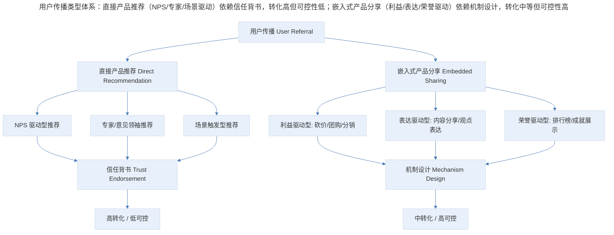
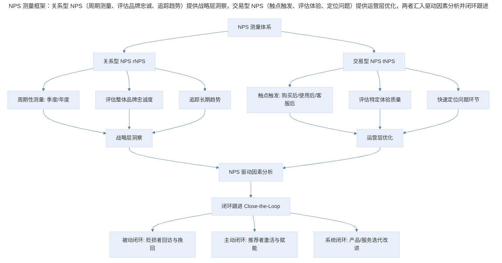
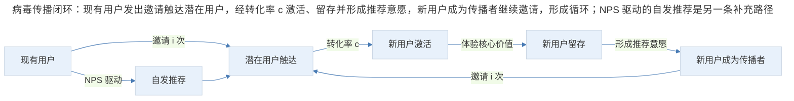

# 用户传播的动机设计与 NPS 体系

## 1. 导言

用户传播（User Referral / Viral Growth）是 AARRR 模型中获客与传播环节的核心驱动力。本文系统阐述用户传播的两种类型——直接产品推荐与嵌入式产品分享，深入解析净推荐值（Net Promoter Score, NPS）的方法论与应用，构建病毒传播系数（Viral Coefficient, K-factor）的量化模型，并探讨传播动机设计、利益分配优化与身份认同机制。结合 2024–2026 年 AI 优化推荐匹配、社交证明机制（Social Proof）与社区驱动增长（Community-Led Growth, CLG）的最新实践，提出可操作的传播体系设计框架。

## 2. 传播类型与 NPS 方法论

### 2.1 用户传播的类型体系

用户传播可依据传播动机的来源与传播路径的嵌入程度，划分为两种基本类型：

| 维度 | 直接产品推荐（Direct Recommendation） | 嵌入式产品分享（Embedded Sharing） |
|------|--------------------------------------|-----------------------------------|
| 传播动机来源 | 用户自发，源于产品核心价值感知 | 产品设计引导，源于功能流程需求 |
| 传播路径 | 线下口口相传 / 私域推荐 | 线上社交网络 / 产品内分享链路 |
| 可设计性 | 低——主要依赖产品价值与品牌建设 | 高——可通过功能机制主动设计 |
| 可追踪性 | 低——难以归因与量化 | 高——可通过 UTM / 深度链接追踪 |
| 转化效率 | 高——基于信任背书 | 中——依赖利益激励与场景设计 |
| 典型案例 | 大众点评口碑推荐、Lightroom 专家推荐 | 拼多多砍价/团购、分享有赏分销 |
| 核心指标 | NPS、口碑传播率 | K-factor、分享转化率 |

> 用户传播类型体系：直接产品推荐（NPS/专家/场景驱动）依赖信任背书，转化高但可控性低；嵌入式产品分享（利益/表达/荣誉驱动）依赖机制设计，转化中等但可控性高。

### 2.2 直接产品推荐：信任背书的力量

直接产品推荐的本质是用户以自身信用为产品背书。当用户向朋友推荐产品时，其行为隐含三层含义：

1. **价值确认**：用户已验证产品核心价值，愿意将其与自身信誉绑定；
2. **关系投资**：推荐行为是对社交关系的投资，推荐者期望被推荐者获得价值以强化关系；
3. **身份表达**：推荐行为传递推荐者的品味、价值观与专业判断。

研究表明，口碑推荐（Word-of-Mouth, WOM）的转化率是传统广告的 5–8 倍（Nielsen, 2023），且获客成本（Customer Acquisition Cost, CAC）仅为付费渠道的 1/4 至 1/3。其核心原因在于信任传递——被推荐者对推荐者的信任，部分迁移至被推荐的产品。

**专家推荐**是直接推荐的强化形态。当用户向领域专家求助并获得推荐时，专家的专业权威进一步放大了信任效应。被推荐者在遇到使用障碍时，倾向于归因于自身能力不足而非产品缺陷，从而产生更高的留存意愿——这一现象可称为"权威推荐的自证效应"（Authority Endorsement Self-Verification Effect）。

### 2.3 嵌入式产品分享：机制设计的艺术

嵌入式产品分享将传播动作嵌入用户使用产品的功能流程中，使传播成为完成某项任务的必要或优化路径。其设计核心在于构建"传播即使用"的体验闭环。

典型的嵌入式分享机制包括：

| 机制类型 | 用户动机 | 传播逻辑 | 典型案例 |
|----------|----------|----------|----------|
| 团购（Group Buy） | 获得折扣 | 薄利多销，自然场景 | 拼多多拼团 |
| 砍价（Price Cut） | 获得更低价格 | 将用户作为流量主，支付 CPM | 拼多多砍价免费拿 |
| 分享有赏（Share-for-Reward） | 获得现金/积分奖励 | 分销逻辑，按效果付费 | 极客时间分销 |
| 加速助力（Boost） | 提升服务优先级 | 包装的传播动作，制造紧迫感 | 携程抢票加速 |
| 内容分享（Content Share） | 表达观点/传递信息 | 社交货币逻辑 | 微信文章转发 |

值得注意的是，"加速助力"类机制在逻辑上与产品核心价值关联较弱（抢票速度与邀请人数无物理因果关系），但通过进度条等视觉反馈制造了"人多力量大"的心理暗示，仍能驱动传播行为。这提示产品经理：传播机制的有效性不仅取决于逻辑合理性，更取决于用户心理感知的合理性。

### 2.4 NPS 方法论与应用体系

**净推荐值（Net Promoter Score, NPS）** 由 Fred Reichheld 于 2003 年提出，是衡量用户满意度与忠诚度的核心指标。其计算方法为：

$$NPS = \%Promoters - \%Detractors$$

用户根据"您有多大可能向朋友或同事推荐本产品？"（0–10 分）被分为三组：

| 用户分类 | 评分范围 | 英文 | 行为特征 |
|----------|----------|------|----------|
| 推荐者 | 9–10 分 | Promoters | 高忠诚度，主动推荐，高生命周期价值 |
| 中立者 | 7–8 分 | Passives | 满意但不热情，易被竞品转化 |
| 贬损者 | 0–6 分 | Detractors | 不满，可能负面传播，高流失风险 |

NPS 的取值范围为 -100 至 +100。根据 Bain & Company 的行业基准数据，NPS > 50 为优秀，NPS > 70 为世界级（Bain & Company, 2024）。

NPS 测量框架：

> NPS 测量框架：关系型 NPS（周期测量、评估品牌忠诚、追踪趋势）提供战略层洞察，交易型 NPS（触点触发、评估体验、定位问题）提供运营层优化，两者汇入驱动因素分析并闭环跟进。

**关系型 NPS（Relationship NPS, rNPS）** 按固定周期（通常为季度或年度）向整体用户群发送问卷，衡量用户对品牌的整体忠诚度。适用于追踪长期趋势与战略决策。

**交易型 NPS（Transactional NPS, tNPS）** 在用户完成特定触点交互后触发（如购买完成、客服咨询后），衡量该触点的体验质量。适用于快速定位问题环节与运营优化。

两者结合使用可形成"宏观趋势 + 微观归因"的完整测量体系。

NPS 作为单一指标存在若干局限：

1. **文化偏差**：不同文化背景下用户评分习惯差异显著。东亚用户倾向于给出中庸评分，导致 NPS 系统性偏低；
2. **行业不可比**：不同行业的 NPS 基准差异极大（如消费品 NPS 通常高于 B2B SaaS），跨行业比较无意义；
3. **因果模糊**：NPS 是结果指标，无法直接指导改进行动——高 NPS 不必然导致高增长，低 NPS 也不必然导致衰退；
4. **样本偏差**：响应问卷的用户往往是最满意或最不满的群体，中立用户响应率低。

针对上述局限，2024–2026 年的 NPS 实践呈现以下演进趋势：

| 演进方向 | 传统做法 | 最新实践 |
|----------|----------|----------|
| 指标组合 | 单一 NPS | NPS + CES（Customer Effort Score）+ CSAT（Customer Satisfaction） |
| 数据采集 | 问卷为主 | 行为数据 + AI 情感分析 + 问卷补充 |
| 分析深度 | 分值追踪 | NPS 驱动因素回归分析 + 根因定位 |
| 闭环速度 | 月度/季度 | 实时预警 + 自动化工单分派 |
| 预测能力 | 描述性 | AI 预测性 NPS——基于行为数据预测用户推荐意愿 |

**AI 预测性 NPS（Predictive NPS）** 是 2024–2026 年的重要创新。通过机器学习模型分析用户行为数据（使用频率、功能深度、客服交互、社区参与度等），在不发送问卷的情况下预测用户的推荐意愿。这一方法解决了问卷响应率低与样本偏差的问题，并可实现实时监控（AskNicely, 2025; Qualtrics, 2025）。

## 3. 传播量化：病毒传播系数与闭环

### 3.1 K-factor 模型

**病毒传播系数（Viral Coefficient, K-factor）** 是衡量产品自传播能力的核心量化指标，定义为每个现有用户平均带来的新用户数：

$$K = i \times c$$

其中：

- **i（Invitations）**：每个用户发出的邀请数量；
- **c（Conversion rate）**：每个邀请的转化率。

当 K > 1 时，产品具备自传播能力，用户量将指数级增长；当 K = 1 时，用户量线性增长；当 K < 1 时，传播链将逐渐衰减。

实际产品中 K > 1 的案例极为罕见。Dropbox 在其推荐计划高峰期 K 值约为 1.2–1.5（Dropbox, 2010），但这是在极强利益激励（双向各 500MB 额外空间）与低摩擦分享机制的共同作用下实现的。大多数产品的 K 值在 0.2–0.5 之间，仍需依赖付费获客补充。

### 3.2 病毒传播闭环

> 病毒传播闭环：现有用户发出邀请触达潜在用户，经转化率 c 激活、留存并形成推荐意愿，新用户成为传播者继续邀请，形成循环；NPS 驱动的自发推荐是另一条补充路径。

病毒传播闭环的关键优化节点：

| 优化节点 | 优化方向 | 具体策略 |
|----------|----------|----------|
| 邀请数量 i | 提升单用户邀请频次 | 降低分享摩擦、多场景触发、社交关系链导入 |
| 转化率 c | 提升邀请接受率 | 优化邀请文案、深度链接直达、新用户引导体验 |
| 激活速度 | 缩短新用户到达 Aha Moment 的时间 | 简化注册流程、预填充信息、引导式 Onboarding |
| 留存质量 | 确保新用户感知核心价值 | 精准推荐、个性化内容、快速价值交付 |
| 推荐意愿 | 将留存用户转化为传播者 | NPS 驱动的推荐触发、社交证明、身份认同设计 |

### 3.3 病毒传播周期时间

除 K-factor 外，**病毒传播周期时间（Viral Cycle Time, ct）** 同样关键。它指从用户发出邀请到新用户完成激活并发出自身邀请的时间间隔。病毒增长公式为：

$$Users(t) = Users(0) \times (1 + K)^{t/ct}$$

缩短 ct 对增长的影响甚至大于提升 K。将 ct 从 5 天缩短至 2 天，在相同 K 值下，30 天内的用户增长差异可达数倍。因此，优化传播闭环的优先级应为：**缩短周期时间 > 提升邀请数量 > 提升转化率**。

## 4. 传播动机设计：利益分配与身份认同

### 4.1 利益分配模型

在嵌入式分享机制中，利益分配（Benefit Allocation）是核心设计决策。为使邀请者 A 将产品传播给潜在用户 B，需在 A 与 B 之间分配激励利益。

| 分配策略 | 描述 | 优势 | 劣势 | 适用场景 |
|----------|------|------|------|----------|
| 偏向邀请者 A | 主要奖励给邀请者，如"邀请得现金" | 激发邀请动力强，A 的 ROI 明确 | B 可能感到被利用，接受意愿低 | 强利益驱动型产品 |
| 偏向被邀请者 B | 主要奖励给被邀请者，如"好友专属优惠" | B 接受意愿高，A 感到"分享利益"更体面 | A 的邀请动力相对弱 | 品牌调性要求高的产品 |
| 双向均衡 | A 与 B 均获得等额奖励，如"各得 10 元" | 双方动力均衡，体验友好 | 成本较高，可能被薅羊毛 | 预算充足、风控完善的产品 |
| 阶梯递增 | A 的奖励随邀请人数递增 | 激发持续邀请，形成竞争 | 可能导致刷单与灰产 | 社交属性强的产品 |

实证数据与行业观察表明，**将利益分配偏向邀请者 A 往往能带来更高的整体传播效率**。其内在逻辑为：

1. **动机强度不对称**：A 的邀请行为需要主动付出精力与信用，需要更强的利益驱动；B 的接受行为相对被动，"帮助朋友"的社交动机已能提供基础驱动力；
2. **需求匹配难度**：为 B 设计的利益点难以精准匹配其需求，而 A 对自身需求有清晰认知，利益激励更有效；
3. **传播链启动**：A 是传播链的启动节点，优先激励 A 可确保传播链的启动率。

然而，这一结论并非绝对。在品牌调性要求高的产品中（如高端消费品、专业服务），偏向 B 的"好友专属"策略在长期品牌建设上更具优势。

### 4.2 身份认同机制："成就用户，而非凸显产品"

用户传播的最深层动机并非"这个产品很好"，而是"这个产品让我看起来很好"。用户将产品作为自我身份的延伸——品味、价值观、专业判断的载体。

身份认同传播模型的核心逻辑：

| 传播行为 | 表层动机 | 深层动机 | 设计启示 |
|----------|----------|----------|----------|
| 推荐高端品牌 | 产品品质好 | "我有品味" | 品牌建设 > 功能宣传 |
| 分享专业工具 | 工具很实用 | "我是专业人士" | 专业身份赋能 > 易用性宣传 |
| 转发深度文章 | 文章写得好 | "我也有这样的思考" | 内容反映用户价值观 > 内容本身质量 |
| 参与排行榜 | 想获得奖励 | "我比别人强" | 竞争展示 > 单纯奖励 |
| 使用小众产品 | 产品独特 | "我与众不同" | 稀缺性 > 普及度 |

苹果（Apple）是身份认同传播的典范。其产品已成为品味、身份与地位的符号，用户推荐苹果产品的深层动机是借品牌特质强化自身形象。这一逻辑同样适用于 Notion（专业效率人士的标志）、Patagonia（环保价值观的载体）等品牌。

**设计原则**：在传播机制设计中，产品经理应始终将用户置于主角位置。传播素材、分享文案、推荐界面应强化用户的身份表达，而非产品的功能宣传。具体而言：

- 分享卡片设计应突出用户生成的内容/成就，产品品牌作为背景元素；
- 推荐文案应允许用户自定义，而非强制使用统一模板；
- 传播触发时机应选择用户获得成就感的时刻（如完成挑战、获得认证），而非产品功能使用时刻。

## 5. 实践指南：传播体系设计框架

基于上述分析，构建用户传播体系的设计框架：

| 设计层次 | 核心任务 | 关键方法 | 核心指标 |
|----------|----------|----------|----------|
| 价值层 | 确保产品核心价值成立 | 用户价值验证、PMF 确认 | NPS、留存率 |
| 动机层 | 设计传播动机与利益分配 | 动机分析、利益分配优化、身份认同设计 | 分享率、K-factor |
| 机制层 | 构建嵌入式分享功能 | 传播闭环设计、降低分享摩擦、深度链接 | 邀请数 i、转化率 c |
| 闭环层 | 缩短传播周期时间 | Onboarding 优化、Aha Moment 加速 | Viral Cycle Time |
| 社区层 | 建设社区驱动增长 | CLG 基础设施、共创机制、社区运营 | 社区活跃度、自然推荐率 |
| 数据层 | 持续测量与优化 | NPS 体系、AI 预测性 NPS、A/B 测试 | rNPS、tNPS、Predictive NPS |

**核心原则**：传播体系的设计必须以产品核心价值为前提。缺乏价值支撑的传播机制，无论设计多么精巧，终将因用户失望而衰减。传播是价值的放大器，而非价值的替代品。

## 6. 进阶延展：前沿实践与核心要点回顾

### 6.1 AI 优化推荐匹配

传统推荐计划采用"一对多"广播模式——邀请者向所有社交关系发送相同邀请。AI 优化推荐匹配（AI-Optimized Referral Matching）改变了这一模式：

1. **智能匹配**：基于用户社交图谱与行为数据，AI 模型预测哪些潜在用户最可能接受邀请并转化为高价值用户，邀请者仅向匹配度最高的对象发送定向邀请；
2. **个性化邀请文案**：AI 根据被邀请者的画像自动生成个性化邀请文案，提升转化率；
3. **动态激励**：AI 根据邀请者与被邀请者的特征动态调整激励金额与形式，实现激励 ROI 最优化。

据 ReferralCandy 2025 年数据，AI 优化推荐匹配可将推荐转化率提升 30–50%，同时将激励成本降低 15–25%（ReferralCandy, 2025）。

### 6.2 社交证明机制

**社交证明（Social Proof）** 是影响用户行为决策的核心心理机制。2024–2026 年的传播设计将社交证明从静态展示升级为动态、情境化的嵌入：

| 社交证明类型 | 传统实现 | 2024–2026 前沿实践 |
|-------------|----------|-------------------|
| 用户数量证明 | "已有 1000 万用户" | 实时动态计数 + 地理位置标注"您附近有 328 人正在使用" |
| 评价证明 | 星级评分 + 文字评价 | AI 摘要评价 + 视频评价 + 场景化评价筛选 |
| 权威证明 | "XX 专家推荐" | 专家实时互动 + 认证体系 + 专业社区背书 |
| 社交关系证明 | "您的好友也在使用" | 社交图谱可视化 + 好友动态流 + 协作场景嵌入 |
| 行为证明 | "最近购买"通知 | 实时行为流 + 相似用户行为推荐 + 群体趋势展示 |

### 6.3 社区驱动增长（CLG）

**社区驱动增长（Community-Led Growth, CLG）** 是 2024–2026 年最具影响力的增长范式之一。CLG 将用户社区从产品的附属品提升为核心增长引擎，其逻辑为：

$$CLG = 社区参与 \times 知识共创 \times 自然推荐$$

CLG 与传统推荐计划的关键差异：

| 维度 | 传统推荐计划 | 社区驱动增长 CLG |
|------|-------------|-----------------|
| 传播动力 | 利益激励 | 价值认同 + 社区归属 |
| 传播路径 | 一对一邀请 | 社区内自然扩散 + 公域影响力 |
| 用户关系 | 交易性 | 社区性 / 共创性 |
| 留存效果 | 激励结束后可能流失 | 社区归属感驱动长期留存 |
| 典型案例 | Dropbox 推荐计划 | Notion 社区、Figma 社区、开源社区 |

CLG 的实施需要三个核心要素：**社区基础设施**（论坛、Discord/Slack 空间、用户组）、**共创机制**（模板市场、插件生态、内容贡献体系）、**社区运营**（社区经理、大使计划、线下活动）。

### 6.4 核心要点回顾

用户传播体系的设计以产品核心价值为前提，通过直接产品推荐（信任背书）与嵌入式产品分享（机制设计）两条路径驱动增长。NPS 体系衡量用户推荐意愿，K-factor 模型量化自传播能力。传播动机设计关键在于利益分配优化与身份认同机制——让用户"看起来很好"比"产品很好"更能驱动深层传播。在 2024–2026 年，AI 优化推荐匹配、社交证明与社区驱动增长正在重塑传播范式，但"传播是价值的放大器，而非价值的替代品"这一原则始终不变。

---

## 参考资料

- AskNicely. (2025). *Predictive NPS: The future of customer experience measurement*. AskNicely Research.
- Bain & Company. (2024). *NPS benchmark study: Global industry standards*. Bain & Company.
- Dropbox. (2010). *Dropbox referral program: Case study in viral growth*. Dropbox Blog.
- Nielsen. (2023). *Nielsen global trust in advertising survey*. Nielsen Holdings.
- Qualtrics. (2025). *AI-driven customer experience: Predictive NPS and beyond*. Qualtrics XM Institute.
- Reichheld, F. F. (2003). The one number you need to grow. *Harvard Business Review*, 81(12), 46–54.
- ReferralCandy. (2025). *The state of referral marketing: AI-optimized matching and dynamic incentives*. ReferralCandy Annual Report.
- Skok, D. (2012). *Lessons learned: Viral marketing and viral coefficient*. For Entrepreneurs.
- Womply. (2024). *Local business reputation and social proof: 2024 benchmark report*. Womply Research.